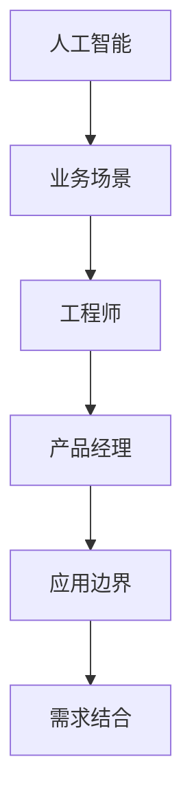

                 

# AI的业务场景：工程师与产品经理的对话，找到AI的应用边界与需求结合

> 关键词：人工智能,业务场景,工程师,产品经理,应用边界,需求结合

## 1. 背景介绍

随着人工智能技术的快速发展，AI在各行各业的应用越来越广泛。从智能客服、智能推荐，到智能制造、自动驾驶，AI技术正在以不可阻挡的势头，改变着传统行业的运作方式。然而，AI技术并非万能的，在实际应用中，它有其应用的边界，需要与业务需求相结合，才能真正发挥其价值。

本文章将通过工程师与产品经理的对话，深入探讨AI技术的业务场景，找到AI的应用边界与需求结合的最佳方式，为读者提供全面、深入的指导。

## 2. 核心概念与联系

### 2.1 核心概念概述

在探讨AI技术的应用场景时，我们首先要了解几个核心概念：

- **人工智能(Artificial Intelligence, AI)**：指通过计算机模拟人类智能行为的技术，包括感知、推理、学习、决策等方面。
- **业务场景(Commercial Scenarios)**：指在实际业务中，AI技术的应用环境和需求。
- **工程师(Engineers)**：指负责AI技术实现的专业技术人员。
- **产品经理(Product Managers)**：指负责定义和引导AI技术产品开发的业务人员。
- **应用边界(Application Boundaries)**：指AI技术能够有效解决的问题范围。
- **需求结合(Demand Alignment)**：指将AI技术与应用场景中的具体需求相结合的过程。

这些概念之间的联系可以通过以下Mermaid流程图来展示：



这个流程图展示了人工智能与业务场景之间的连接，以及工程师与产品经理在其中的作用。

## 3. 核心算法原理 & 具体操作步骤

### 3.1 算法原理概述

AI技术的应用往往基于以下几种核心算法：

- **监督学习(Supervised Learning)**：利用标注数据训练模型，使其能够对新数据进行分类、回归等任务。
- **无监督学习(Unsupervised Learning)**：利用未标注数据训练模型，使其能够发现数据的潜在结构和模式。
- **强化学习(Reinforcement Learning)**：通过与环境的交互，训练模型学习最优决策策略。
- **迁移学习(Transfer Learning)**：利用一个领域的知识迁移到另一个领域，加速新任务的学习过程。

这些算法在不同的业务场景中，有着不同的应用方式。因此，需要工程师与产品经理共同探讨，找到最适合的算法和技术。

### 3.2 算法步骤详解

1. **需求分析**：产品经理与业务方沟通，明确AI技术需要解决的具体问题。
2. **数据准备**：工程师根据需求分析结果，收集和准备数据集，确保数据质量。
3. **模型选择**：产品经理与工程师共同讨论，选择合适的AI算法和模型。
4. **模型训练**：工程师利用选定的算法和模型，对数据进行训练。
5. **模型评估**：产品经理与工程师共同评估模型的效果，确定是否满足业务需求。
6. **模型部署**：产品经理与工程师共同制定模型部署方案，确保模型能够稳定运行。
7. **持续优化**：产品经理与工程师共同监控模型运行效果，根据反馈持续优化。

### 3.3 算法优缺点

**监督学习**：
- 优点：效果显著，适用于标注数据较多的场景。
- 缺点：需要大量标注数据，成本较高。

**无监督学习**：
- 优点：不需要标注数据，成本较低。
- 缺点：效果不如监督学习，可能存在噪声干扰。

**强化学习**：
- 优点：适用于决策类问题，可以自主学习最优策略。
- 缺点：需要大量的试错数据，训练周期较长。

**迁移学习**：
- 优点：可以利用已有知识加速新任务学习。
- 缺点：需要合适的预训练模型，有时需要较多调参。

### 3.4 算法应用领域

AI技术在不同领域的应用场景如下：

- **金融领域**：利用AI进行风险评估、智能投顾、欺诈检测等。
- **医疗领域**：利用AI进行疾病预测、病理分析、智能问诊等。
- **零售领域**：利用AI进行客户推荐、库存管理、价格优化等。
- **制造业**：利用AI进行质量检测、设备维护、生产调度等。
- **智能家居**：利用AI进行语音识别、设备控制、用户行为分析等。
- **智能交通**：利用AI进行交通流量分析、智能调度、自动驾驶等。

## 4. 数学模型和公式 & 详细讲解 & 举例说明

### 4.1 数学模型构建

在AI应用中，常用的数学模型包括回归模型、分类模型、聚类模型等。这里以线性回归模型为例，介绍其数学模型构建。

线性回归模型的目标是找到一条直线，使得所有数据点离这条直线尽可能近。设数据集为 $(x_1, y_1), (x_2, y_2), \dots, (x_n, y_n)$，目标函数为：

$$
\min_{\beta_0, \beta_1} \sum_{i=1}^n (y_i - (\beta_0 + \beta_1 x_i))^2
$$

其中 $\beta_0$ 和 $\beta_1$ 为模型的斜率和截距。

### 4.2 公式推导过程

线性回归的公式推导过程如下：

1. 根据目标函数，求偏导数，得到：
   $$
   \frac{\partial}{\partial \beta_0} = -2\sum_{i=1}^n (y_i - (\beta_0 + \beta_1 x_i))
   $$
   $$
   \frac{\partial}{\partial \beta_1} = -2\sum_{i=1}^n x_i (y_i - (\beta_0 + \beta_1 x_i))
   $$

2. 令偏导数为零，解方程组，得到：
   $$
   \beta_0 = \bar{y} - \beta_1 \bar{x}
   $$
   $$
   \beta_1 = \frac{\sum_{i=1}^n (x_i - \bar{x})(y_i - \bar{y})}{\sum_{i=1}^n (x_i - \bar{x})^2}
   $$

   其中 $\bar{x} = \frac{1}{n}\sum_{i=1}^n x_i$，$\bar{y} = \frac{1}{n}\sum_{i=1}^n y_i$。

### 4.3 案例分析与讲解

假设有一个公司，想通过AI预测销售额。公司收集了过去一年的销售数据，包括季节性因素和促销活动的影响。通过线性回归模型，找到销售额与季节性因素和促销活动之间的关系，从而预测未来的销售额。

## 5. 项目实践：代码实例和详细解释说明

### 5.1 开发环境搭建

1. **安装Python和相关库**：
   ```bash
   pip install numpy pandas scikit-learn matplotlib
   ```

2. **准备数据集**：
   ```python
   import pandas as pd

   df = pd.read_csv('sales_data.csv')
   ```

### 5.2 源代码详细实现

以下是线性回归模型的Python代码实现：

```python
import numpy as np
from sklearn.linear_model import LinearRegression

# 准备数据
X = df[['seasonality', 'promotion']]
y = df['sales']

# 创建线性回归模型
model = LinearRegression()

# 训练模型
model.fit(X, y)

# 预测未来销售额
future_data = pd.DataFrame({'seasonality': [3.5, 4.5], 'promotion': [1, 1]})
preds = model.predict(future_data)

print(preds)
```

### 5.3 代码解读与分析

- **数据准备**：将数据集中的季节性因素和促销活动作为自变量，销售额作为因变量。
- **模型训练**：使用线性回归模型对数据进行训练。
- **模型预测**：对未来的季节性因素和促销活动进行预测，并得到相应的销售额预测值。

### 5.4 运行结果展示

运行上述代码，可以得到未来两个月的销售额预测值。

## 6. 实际应用场景

### 6.1 智能客服

在智能客服领域，AI技术可以用于自动化客服、情感分析、意图识别等。通过AI技术，可以实现24小时无间断的客户服务，显著提高客户满意度。

### 6.2 金融风控

在金融风控领域，AI技术可以用于信用评估、风险预警、欺诈检测等。通过AI技术，可以提前发现潜在的风险点，及时采取措施，降低金融风险。

### 6.3 医疗诊断

在医疗诊断领域，AI技术可以用于病理分析、疾病预测、智能问诊等。通过AI技术，可以快速准确地诊断疾病，提高医疗服务效率。

### 6.4 未来应用展望

未来，AI技术将在更多领域得到应用，如自动驾驶、智能家居、智能制造等。这些应用场景将带来更高的效率、更好的用户体验和更低的成本。

## 7. 工具和资源推荐

### 7.1 学习资源推荐

1. **机器学习课程**：Coursera、Udacity等平台上的机器学习课程，涵盖从基础到高级的各类知识。
2. **书籍**：《机器学习实战》、《深度学习》等书籍，深入介绍AI技术的原理和应用。
3. **在线资源**：Kaggle、GitHub等平台上的开源项目和资源，提供丰富的学习案例和实践经验。

### 7.2 开发工具推荐

1. **Python**：Python是目前最流行的AI开发语言，拥有丰富的库和框架支持。
2. **TensorFlow**：Google开发的深度学习框架，易于使用，支持分布式训练。
3. **PyTorch**：Facebook开发的深度学习框架，灵活高效，适合研究。
4. **Jupyter Notebook**：免费的交互式编程环境，方便开发和分享。

### 7.3 相关论文推荐

1. **深度学习**：《Deep Learning》by Ian Goodfellow, Yoshua Bengio, Aaron Courville.
2. **强化学习**：《Reinforcement Learning: An Introduction》by Richard S. Sutton, Andrew G. Barto.
3. **迁移学习**：《Transfer Learning: A Review and Survey》by Saeed Ramezani, Yasaman Fazel, Shervin Shahriari.

## 8. 总结：未来发展趋势与挑战

### 8.1 研究成果总结

AI技术在各个领域的应用已经取得了显著的进展。然而，AI技术并非万能的，有其应用的边界。因此，工程师与产品经理需要共同探讨，找到最适合的AI应用场景，并结合业务需求，进行模型设计和优化。

### 8.2 未来发展趋势

1. **深度学习技术**：深度学习技术将继续发展，提高模型的精度和效果。
2. **边缘计算**：边缘计算将使得AI技术在低延迟、高带宽的环境下得到更广泛的应用。
3. **自动化**：自动化技术将使得AI技术的开发和部署更加高效。
4. **跨领域融合**：AI技术将与更多领域进行融合，如医疗、金融、制造等。

### 8.3 面临的挑战

1. **数据隐私**：数据隐私问题将对AI技术的应用造成挑战。
2. **伦理和道德**：AI技术的伦理和道德问题需要引起足够的重视。
3. **计算资源**：计算资源的高成本将限制AI技术的大规模应用。
4. **模型可解释性**：模型可解释性问题需要进一步解决。

### 8.4 研究展望

未来的AI技术研究将更加注重模型的可解释性、数据隐私和伦理道德。同时，AI技术将与更多领域进行融合，推动各行各业的数字化转型。

## 9. 附录：常见问题与解答

**Q1：如何选择合适的AI算法？**

A：选择合适的AI算法需要根据具体问题和数据特点进行综合评估。可以从算法的复杂度、训练时间、效果等方面进行比较，最终选择最合适的算法。

**Q2：数据预处理需要注意哪些问题？**

A：数据预处理需要注意数据的缺失值处理、异常值处理、归一化等。预处理不当可能导致模型效果不佳。

**Q3：模型调参有哪些方法？**

A：模型调参可以采用网格搜索、随机搜索、贝叶斯优化等方法。调参需要结合具体问题和模型特点，进行系统性的优化。

**Q4：如何评估模型效果？**

A：模型效果的评估可以采用准确率、召回率、F1分数等指标。同时，需要结合具体业务场景进行评估，看是否满足实际需求。

**Q5：模型部署需要注意哪些问题？**

A：模型部署需要注意模型的可移植性、可扩展性、稳定性等方面。部署过程中需要进行充分的测试和验证，确保模型的稳定运行。

---

作者：禅与计算机程序设计艺术 / Zen and the Art of Computer Programming

