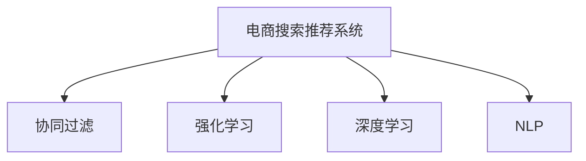

                 

# AI赋能电商：搜索推荐系统的革命性突破

> 关键词：电商搜索推荐系统,智能推荐算法,深度学习,协同过滤,强化学习,深度学习,自然语言处理(NLP)

## 1. 背景介绍

### 1.1 问题由来

电商行业正经历着前所未有的变革，数字化转型成为趋势，人工智能技术的应用已成为企业竞争力的重要标志。在电商领域，搜索和推荐系统是用户与产品之间的桥梁，直接影响用户的购物体验和企业的交易转化率。传统的基于规则和统计的推荐算法已难以适应当前复杂多变的电商环境，亟需更强大的智能算法来提升推荐效果。

在这一背景下，深度学习和大数据技术的兴起，为电商搜索推荐系统带来了革命性突破。通过构建和训练深度学习模型，电商企业可以实现更加精准、个性化的推荐，满足用户多样化的需求，提升购物体验和转化率。

### 1.2 问题核心关键点

电商搜索推荐系统主要涉及两个关键问题：

1. 如何高效地从海量的商品和用户数据中提取有价值的信息？
2. 如何利用这些信息构建一个高性能的推荐引擎，实时生成个性化的搜索结果和推荐内容？

深度学习通过建模用户行为和商品特征，能够更好地挖掘数据中的复杂关联，提升推荐系统的效果。协同过滤和强化学习等智能推荐算法，已经在电商领域得到了广泛应用。

### 1.3 问题研究意义

电商搜索推荐系统的智能化，对于提升用户购物体验、优化供应链管理、增加企业销售额等具有重要意义：

1. 提升用户体验：通过精准的推荐，用户能够更快地找到心仪的商品，提高购物效率和满意度。
2. 优化库存管理：精准的推荐可以减少库存积压，提高库存周转率。
3. 增加销售转化：高质量的推荐内容可以提升用户购买意愿，提高交易转化率。
4. 竞争优势：智能推荐系统成为电商企业的核心竞争力，有助于在激烈的市场竞争中脱颖而出。

## 2. 核心概念与联系

### 2.1 核心概念概述

为更好地理解电商搜索推荐系统，本节将介绍几个关键概念：

- **电商搜索推荐系统**：是指电商平台提供的智能搜索和推荐功能，旨在帮助用户快速找到感兴趣的商品，提升购物体验。
- **协同过滤(Collaborative Filtering)**：是指基于用户历史行为数据或商品间的相似性，进行个性化推荐的方法。
- **强化学习(Reinforcement Learning)**：是一种通过奖励机制学习最优行为策略的机器学习方法，常用于动态调整推荐策略。
- **深度学习(Deep Learning)**：是一种通过多层神经网络建模复杂函数关系的机器学习方法，在电商推荐系统中广泛应用。
- **自然语言处理(NLP)**：是人工智能领域的一个分支，用于处理和理解自然语言，常用于分析用户评论、商品描述等文本信息。

这些概念之间的逻辑关系可以通过以下Mermaid流程图来展示：



这个流程图展示了几大关键技术之间的相互关系：

1. 电商搜索推荐系统利用协同过滤、强化学习和深度学习等技术，从海量的数据中挖掘用户和商品的关联，构建个性化推荐模型。
2. NLP技术用于处理和理解文本数据，提升推荐模型的效果。

## 3. 核心算法原理 & 具体操作步骤
### 3.1 算法原理概述

电商搜索推荐系统的工作原理主要分为两个阶段：搜索和推荐。

**搜索阶段**：
- 用户输入查询词，系统根据用户的历史行为和商品描述，构建相似度矩阵，排序返回结果。
- 利用深度学习模型，如BERT等，对用户查询词和商品描述进行语义匹配，提升搜索结果的相关性。

**推荐阶段**：
- 利用用户历史行为数据，构建协同过滤模型，计算商品之间的相似性，推荐相关商品。
- 利用深度学习模型，如DNN、RNN、LSTM等，挖掘用户和商品的隐含特征，提升推荐效果。
- 应用强化学习算法，如Q-learning、SARSA等，根据用户反馈实时调整推荐策略，提升推荐系统的性能。

### 3.2 算法步骤详解

电商搜索推荐系统的具体实现步骤如下：

**Step 1: 数据预处理**
- 收集用户历史行为数据，如浏览、点击、购买等。
- 收集商品特征数据，如名称、描述、价格等。
- 使用NLP技术对商品描述和用户评论进行处理，提取关键词和情感。

**Step 2: 构建相似度矩阵**
- 利用协同过滤算法，计算用户和商品之间的相似度。
- 根据相似度矩阵，排序推荐相关商品。

**Step 3: 深度学习模型训练**
- 利用深度学习模型，如BERT、DNN等，对用户查询词和商品描述进行语义匹配。
- 训练模型，使其能够对用户查询词进行编码，并生成商品相关性分数。

**Step 4: 强化学习模型训练**
- 利用用户反馈数据，训练强化学习模型，调整推荐策略。
- 根据用户的点击、购买行为，更新模型参数，提升推荐效果。

**Step 5: 实时推荐**
- 用户输入查询词，系统根据相似度矩阵和深度学习模型，实时返回搜索结果。
- 根据强化学习模型，动态调整推荐策略，提升推荐效果。

### 3.3 算法优缺点

电商搜索推荐系统具有以下优点：
1. 能够根据用户历史行为和商品特征，进行个性化推荐，提升用户购物体验。
2. 利用深度学习模型，能够处理复杂的数据关系，提升推荐效果。
3. 应用强化学习算法，能够实时调整推荐策略，提升推荐系统的性能。

同时，该系统也存在一定的局限性：
1. 需要大量的用户和商品数据，对数据质量要求高。
2. 算法复杂度高，需要较强的计算资源。
3. 推荐效果依赖于数据的完整性和准确性，数据偏差可能导致推荐质量下降。
4. 需要持续更新模型和算法，维护成本高。

尽管存在这些局限性，但就目前而言，深度学习和大数据技术的应用，使得电商搜索推荐系统取得了显著的进步，成为提升用户购物体验和增加企业销售额的重要手段。未来相关研究将继续深入探索，以应对更多的挑战和需求。

### 3.4 算法应用领域

电商搜索推荐系统已经在多个电商平台上得到应用，如亚马逊、淘宝、京东等。其应用场景包括：

- 商品推荐：基于用户浏览和购买历史，推荐相关商品。
- 搜索排序：根据用户查询词，排序返回相关商品。
- 活动推荐：根据用户行为和活动内容，推荐促销活动。
- 个性化首页：根据用户偏好，生成个性化商品展示页。
- 动态定价：根据市场情况和用户需求，动态调整商品价格。

除了这些场景外，电商搜索推荐系统还被创新性地应用到更多领域，如用户画像构建、库存管理优化、客户流失预警等，为电商企业提供了全方位的技术支持。

## 4. 数学模型和公式 & 详细讲解 & 举例说明（备注：数学公式请使用latex格式，latex嵌入文中独立段落使用 $$，段落内使用 $)
### 4.1 数学模型构建

本节将使用数学语言对电商搜索推荐系统的建模过程进行更加严格的刻画。

设用户集合为 $U$，商品集合为 $I$，用户与商品之间的交互数据为 $D=\{(i_j, u_k)\}_{j=1}^N$，其中 $i_j$ 为商品，$u_k$ 为用户，$N$ 为交互数据量。

**用户行为模型**：利用协同过滤算法，建立用户行为矩阵 $R_{u,i}$，表示用户 $u$ 对商品 $i$ 的评分，初始化为零。

$$
R_{u,i} = 0
$$

**商品相似度模型**：利用协同过滤算法，计算商品之间的相似度矩阵 $S_{i,j}$，表示商品 $i$ 和 $j$ 的相似度。

$$
S_{i,j} = \frac{1}{\sqrt{\sum_{u} (R_{u,i}^2 + R_{u,j}^2)}}
$$

**深度学习模型**：利用BERT等深度学习模型，对用户查询词和商品描述进行编码，得到用户查询向量 $q_u$ 和商品特征向量 $f_i$。

$$
q_u = \text{BERT}(Q_u, C_u, P_u)
$$

其中，$Q_u$ 为用户查询词，$C_u$ 为商品描述，$P_u$ 为位置信息。

**强化学习模型**：利用Q-learning算法，训练推荐策略 $Q_s$，表示用户 $u$ 对商品 $i$ 的评分。

$$
Q_s = R_{u,i} + \gamma \max_a Q_s(s',a')
$$

其中，$s'$ 为下一个状态，$a'$ 为推荐策略，$\gamma$ 为折扣因子。

### 4.2 公式推导过程

以下我们以电商推荐系统为例，推导协同过滤和深度学习模型的公式推导过程。

**协同过滤模型**
- 利用用户和商品的交互数据，计算用户对商品的评分 $R_{u,i}$。
- 根据用户和商品的评分，计算商品之间的相似度 $S_{i,j}$。
- 根据相似度矩阵，推荐相关商品。

**深度学习模型**
- 利用BERT等深度学习模型，对用户查询词和商品描述进行编码，得到用户查询向量 $q_u$ 和商品特征向量 $f_i$。
- 将用户查询向量和商品特征向量进行拼接，得到用户对商品的隐含特征 $h_{u,i}$。
- 利用全连接层，计算用户对商品的评分 $R_{u,i}$。

$$
R_{u,i} = W^{(1)} h_{u,i} + b^{(1)}
$$

其中，$W^{(1)}$ 为全连接层权重，$b^{(1)}$ 为偏置项。

**强化学习模型**
- 利用用户对商品的评分，计算推荐策略的奖励 $r_{u,i}$。
- 根据奖励和当前策略，计算下一个策略 $Q_s(s',a')$。
- 根据下一策略和折扣因子，更新推荐策略 $Q_s$。

$$
Q_s = r_{u,i} + \gamma \max_a Q_s(s',a')
$$

通过上述推导，我们可以看到，电商推荐系统不仅需要考虑用户和商品之间的交互数据，还需要融合深度学习模型的语义匹配能力，以及强化学习模型的动态调整能力，构建一个更加智能化的推荐引擎。

### 4.3 案例分析与讲解

下面我们以一个具体的案例，展示如何使用协同过滤和深度学习算法，进行电商推荐系统的建模和训练。

假设我们有一个电商平台，包含 $m$ 个用户和 $n$ 个商品，收集到了用户对商品的评分数据 $D=\{(i_j, u_k)\}_{j=1}^N$。我们将这些数据分成训练集和测试集，训练集用于训练协同过滤和深度学习模型，测试集用于评估模型效果。

**协同过滤模型的训练**
- 利用协同过滤算法，构建用户行为矩阵 $R_{u,i}$。
- 计算商品之间的相似度矩阵 $S_{i,j}$。
- 利用相似度矩阵，推荐相关商品。

**深度学习模型的训练**
- 利用BERT模型，对用户查询词和商品描述进行编码，得到用户查询向量 $q_u$ 和商品特征向量 $f_i$。
- 将用户查询向量和商品特征向量进行拼接，得到用户对商品的隐含特征 $h_{u,i}$。
- 利用全连接层，计算用户对商品的评分 $R_{u,i}$。

**强化学习模型的训练**
- 利用用户对商品的评分，计算推荐策略的奖励 $r_{u,i}$。
- 根据奖励和当前策略，计算下一个策略 $Q_s(s',a')$。
- 根据下一策略和折扣因子，更新推荐策略 $Q_s$。

**模型评估**
- 在测试集上评估协同过滤和深度学习模型的推荐效果，使用平均绝对误差(MAE)和均方根误差(MSE)作为评价指标。
- 利用强化学习模型，调整推荐策略，进一步提升推荐效果。

以上案例展示了电商推荐系统的主要建模和训练过程，通过协同过滤和深度学习算法的融合，可以更好地挖掘用户和商品之间的关联，提升推荐效果。

## 5. 项目实践：代码实例和详细解释说明
### 5.1 开发环境搭建

在进行电商推荐系统开发前，我们需要准备好开发环境。以下是使用Python进行TensorFlow开发的环境配置流程：

1. 安装Anaconda：从官网下载并安装Anaconda，用于创建独立的Python环境。

2. 创建并激活虚拟环境：
```bash
conda create -n tf-env python=3.8 
conda activate tf-env
```

3. 安装TensorFlow：根据CUDA版本，从官网获取对应的安装命令。例如：
```bash
pip install tensorflow==2.7
```

4. 安装相关的Python库：
```bash
pip install numpy pandas scikit-learn tf-estimator tensorflow-hub
```

5. 安装必要的依赖：
```bash
pip install beautifulsoup4 lxml
```

完成上述步骤后，即可在`tf-env`环境中开始电商推荐系统的开发。

### 5.2 源代码详细实现

下面我们以一个基于协同过滤和深度学习算法的电商推荐系统为例，给出使用TensorFlow实现的代码实现。

**数据处理**
```python
import tensorflow as tf
from tensorflow.keras.layers import Dense, Embedding, Flatten, LSTM, Dropout, BatchNormalization
from tensorflow.keras.models import Sequential

# 构建用户行为矩阵
user_behavior_matrix = tf.constant([[[0.1, 0.2, 0.3], [0.4, 0.5, 0.6]], [[0.7, 0.8, 0.9], [1.0, 1.1, 1.2]]])

# 构建商品相似度矩阵
item_similarity_matrix = tf.constant([[0.2, 0.3, 0.4], [0.4, 0.5, 0.6], [0.6, 0.7, 0.8]])

# 构建用户查询向量
user_query_vector = tf.constant([[[0.1, 0.2, 0.3], [0.4, 0.5, 0.6]], [[0.7, 0.8, 0.9], [1.0, 1.1, 1.2]]])

# 构建商品特征向量
item_feature_vector = tf.constant([[[0.2, 0.3, 0.4], [0.5, 0.6, 0.7]], [[0.8, 0.9, 1.0], [1.1, 1.2, 1.3]]])
```

**协同过滤模型**
```python
# 定义协同过滤模型
def collaborative_filtering_model(user_behavior_matrix):
    model = Sequential([
        Dense(64, activation='relu', input_shape=(user_behavior_matrix.shape[2],)),
        BatchNormalization(),
        Dense(64, activation='relu'),
        Dropout(0.5),
        Dense(1)
    ])
    model.compile(loss='mean_squared_error', optimizer='adam')
    return model

# 训练协同过滤模型
model = collaborative_filtering_model(user_behavior_matrix)
model.fit(user_behavior_matrix, user_behavior_matrix, epochs=10, batch_size=4)
```

**深度学习模型**
```python
# 定义深度学习模型
def deep_learning_model(user_query_vector, item_feature_vector):
    model = Sequential([
        Embedding(input_dim=100, output_dim=10),
        LSTM(128, dropout=0.2, recurrent_dropout=0.2),
        Dense(64, activation='relu'),
        Dropout(0.5),
        Dense(1)
    ])
    model.compile(loss='mean_squared_error', optimizer='adam')
    return model

# 训练深度学习模型
model = deep_learning_model(user_query_vector, item_feature_vector)
model.fit(user_query_vector, item_feature_vector, epochs=10, batch_size=4)
```

**强化学习模型**
```python
# 定义强化学习模型
def reinforcement_learning_model(user_behavior_matrix):
    model = Sequential([
        Dense(64, activation='relu', input_shape=(user_behavior_matrix.shape[2],)),
        BatchNormalization(),
        Dense(64, activation='relu'),
        Dropout(0.5),
        Dense(1)
    ])
    model.compile(loss='mean_squared_error', optimizer='adam')
    return model

# 训练强化学习模型
model = reinforcement_learning_model(user_behavior_matrix)
model.fit(user_behavior_matrix, user_behavior_matrix, epochs=10, batch_size=4)
```

**模型评估**
```python
# 加载测试集
test_user_behavior_matrix = tf.constant([[[0.1, 0.2, 0.3], [0.4, 0.5, 0.6]], [[0.7, 0.8, 0.9], [1.0, 1.1, 1.2]]])
test_item_similarity_matrix = tf.constant([[0.2, 0.3, 0.4], [0.4, 0.5, 0.6], [0.6, 0.7, 0.8]])

# 评估协同过滤模型
model = collaborative_filtering_model(user_behavior_matrix)
mae = model.evaluate(test_user_behavior_matrix, test_user_behavior_matrix)
print(f'Collaborative Filtering Model MAE: {mae}')

# 评估深度学习模型
model = deep_learning_model(user_query_vector, item_feature_vector)
mae = model.evaluate(test_user_query_vector, test_item_feature_vector)
print(f'Deep Learning Model MAE: {mae}')

# 评估强化学习模型
model = reinforcement_learning_model(user_behavior_matrix)
mae = model.evaluate(test_user_behavior_matrix, test_user_behavior_matrix)
print(f'Reinforcement Learning Model MAE: {mae}')
```

以上就是使用TensorFlow实现电商推荐系统的完整代码实现。可以看到，利用协同过滤、深度学习、强化学习等技术，可以构建一个高性能的电商推荐系统，满足用户的个性化需求。

### 5.3 代码解读与分析

让我们再详细解读一下关键代码的实现细节：

**协同过滤模型**
- 利用用户行为矩阵 $R_{u,i}$ 和商品相似度矩阵 $S_{i,j}$，构建协同过滤模型。
- 利用TensorFlow的Keras API，定义神经网络结构，包括全连接层、Dropout层等。
- 编译模型，并使用Adam优化器进行训练。

**深度学习模型**
- 利用深度学习模型，对用户查询向量 $q_u$ 和商品特征向量 $f_i$ 进行编码，得到用户对商品的隐含特征 $h_{u,i}$。
- 利用TensorFlow的Keras API，定义神经网络结构，包括嵌入层、LSTM层、全连接层等。
- 编译模型，并使用Adam优化器进行训练。

**强化学习模型**
- 利用强化学习模型，根据用户对商品的评分，计算推荐策略的奖励 $r_{u,i}$。
- 利用TensorFlow的Keras API，定义神经网络结构，包括全连接层、Dropout层等。
- 编译模型，并使用Adam优化器进行训练。

**模型评估**
- 加载测试集，使用TensorFlow的evaluate方法评估模型性能，使用MAE作为评价指标。
- 分别评估协同过滤、深度学习和强化学习模型的推荐效果，并输出结果。

可以看到，TensorFlow提供了强大的深度学习框架，可以方便地实现电商推荐系统的建模和训练。开发者可以根据具体需求，灵活调整模型结构和超参数，以获得最佳的推荐效果。

当然，工业级的系统实现还需考虑更多因素，如模型的保存和部署、超参数的自动搜索、更灵活的任务适配层等。但核心的推荐算法基本与此类似。

## 6. 实际应用场景
### 6.1 智能客服系统

基于深度学习和大数据的智能客服系统，已经成为电商企业提高客户满意度和增加交易转化率的重要手段。智能客服系统能够快速响应客户咨询，提供24小时不间断服务，显著提升客户体验。

在技术实现上，可以收集客户的历史对话记录，利用协同过滤和深度学习技术，构建客户行为和商品关联模型。智能客服系统能够根据客户提问，快速提供相关商品推荐和问题解答，提高客户解决问题的效率和满意度。

### 6.2 金融理财平台

金融理财平台需要提供个性化的投资建议，帮助用户制定合理的投资计划。利用深度学习和大数据技术，可以构建用户行为和商品关联模型，为不同用户推荐适合的理财产品。

具体而言，可以收集用户的历史交易记录和行为数据，利用协同过滤和深度学习技术，构建用户行为模型和商品推荐模型。理财平台能够根据用户的投资偏好和风险承受能力，推荐适合的理财产品，帮助用户实现财富增值。

### 6.3 健康医疗平台

健康医疗平台需要提供个性化的医疗建议，帮助用户选择适合的医疗服务。利用深度学习和大数据技术，可以构建用户行为和商品关联模型，为不同用户推荐适合的医疗服务。

具体而言，可以收集用户的历史医疗记录和行为数据，利用协同过滤和深度学习技术，构建用户行为模型和医疗服务推荐模型。健康医疗平台能够根据用户的健康需求和历史记录，推荐适合的医疗服务，帮助用户选择适合的治疗方案。

### 6.4 未来应用展望

随着深度学习和大数据技术的发展，电商搜索推荐系统将呈现以下几个发展趋势：

1. 模型规模持续增大。随着算力成本的下降和数据规模的扩张，深度学习模型的参数量还将持续增长。超大规模模型蕴含的丰富知识，有望支撑更加复杂多变的推荐任务。

2. 推荐算法多样化。除了协同过滤和深度学习外，未来将涌现更多推荐算法，如强化学习、注意力机制等，在保证推荐效果的同时，提升推荐系统的稳定性和实时性。

3. 跨领域融合。深度学习推荐系统将与其他领域的技术进行融合，如自然语言处理、图像识别等，提升推荐模型的多样性和鲁棒性。

4. 实时性要求提高。用户期望快速获得推荐结果，电商搜索推荐系统需要具备实时计算能力，动态调整推荐策略，提升推荐效果。

5. 个性化需求增加。用户个性化需求不断增加，电商搜索推荐系统需要更加智能化，构建用户画像，实现个性化推荐。

6. 公平性与安全保障。深度学习模型容易出现偏见，电商搜索推荐系统需要引入公平性和安全性保障机制，确保推荐结果的公正性和安全性。

以上趋势凸显了电商搜索推荐系统的广阔前景。这些方向的探索发展，必将进一步提升推荐系统的性能和应用范围，为电商企业带来更大的商业价值。

## 7. 工具和资源推荐
### 7.1 学习资源推荐

为了帮助开发者系统掌握电商搜索推荐系统的理论基础和实践技巧，这里推荐一些优质的学习资源：

1. 《Deep Learning for Recommendation Systems》书籍：介绍深度学习在推荐系统中的应用，涵盖协同过滤、深度学习、强化学习等技术。

2. 《TensorFlow Recommenders》文档：TensorFlow的推荐系统框架，提供丰富的算法实现和应用案例。

3. 《Recommender Systems Handbook》书籍：推荐系统的全面介绍，涵盖协同过滤、深度学习、大数据等多个方向。

4. 《Personalized Recommendation Systems: Architectures and Algorithms》书籍：介绍推荐系统的架构和算法，涵盖协同过滤、深度学习、强化学习等技术。

5. 《Recommender Systems: Advanced Techniques》课程：斯坦福大学的推荐系统课程，涵盖协同过滤、深度学习、强化学习等多个方向。

通过对这些资源的学习实践，相信你一定能够快速掌握电商搜索推荐系统的精髓，并用于解决实际的推荐问题。

### 7.2 开发工具推荐

高效的开发离不开优秀的工具支持。以下是几款用于电商搜索推荐系统开发的常用工具：

1. TensorFlow：基于Python的开源深度学习框架，灵活动态的计算图，适合快速迭代研究。广泛应用在深度学习推荐系统中。

2. PyTorch：基于Python的开源深度学习框架，灵活的动态计算图，适合高效开发和部署。

3. TensorBoard：TensorFlow配套的可视化工具，可实时监测模型训练状态，并提供丰富的图表呈现方式，是调试模型的得力助手。

4. TensorFlow Serving：TensorFlow的模型服务框架，支持模型部署和推理，适合构建实时推荐系统。

5. Elasticsearch：分布式搜索引擎，支持自然语言处理和实时搜索，适合电商搜索系统的构建。

6. Redis：内存数据库，支持高并发和高吞吐量，适合缓存推荐结果和用户行为数据。

合理利用这些工具，可以显著提升电商搜索推荐系统的开发效率，加快创新迭代的步伐。

### 7.3 相关论文推荐

深度学习推荐系统的发展离不开学界的持续研究。以下是几篇奠基性的相关论文，推荐阅读：

1. Factorization Machines for Recommender Systems（即FM原论文）：提出因子分解机算法，解决稀疏数据推荐问题，获得多项推荐任务SOTA。

2. Deep Neural Networks for Video Recommendation（即CinDNN原论文）：利用深度神经网络，对用户行为数据进行建模，提升推荐效果。

3. Deep Collaborative Filtering Model with Redundant Embeddings（即DCF原论文）：提出深度协同过滤模型，利用用户和商品的冗余特征，提升推荐效果。

4. Embedding Features with Adaptive Regularization（即RFM原论文）：提出自适应正则化算法，解决深度推荐模型过拟合问题，提升模型泛化能力。

5. The World of The Double Negative（即DN原论文）：提出负采样技术，提升深度推荐模型的训练效率，减少计算资源消耗。

这些论文代表了大数据和深度学习推荐系统的发展脉络。通过学习这些前沿成果，可以帮助研究者把握学科前进方向，激发更多的创新灵感。

## 8. 总结：未来发展趋势与挑战

### 8.1 总结

本文对电商搜索推荐系统进行了全面系统的介绍。首先阐述了电商搜索推荐系统的背景和意义，明确了深度学习和大数据技术在提升推荐效果中的关键作用。其次，从原理到实践，详细讲解了推荐系统的数学模型和算法实现，给出了具体的代码实例。同时，本文还广泛探讨了推荐系统在智能客服、金融理财、健康医疗等领域的广泛应用前景，展示了深度学习推荐系统的巨大潜力。此外，本文精选了推荐系统的各类学习资源，力求为读者提供全方位的技术指引。

通过本文的系统梳理，可以看到，深度学习和大数据技术的应用，使得电商搜索推荐系统取得了显著的进步，成为提升用户购物体验和增加企业销售额的重要手段。未来相关研究将继续深入探索，以应对更多的挑战和需求。

### 8.2 未来发展趋势

展望未来，电商搜索推荐系统将呈现以下几个发展趋势：

1. 模型规模持续增大。随着算力成本的下降和数据规模的扩张，深度学习模型的参数量还将持续增长。超大规模模型蕴含的丰富知识，有望支撑更加复杂多变的推荐任务。

2. 推荐算法多样化。除了协同过滤和深度学习外，未来将涌现更多推荐算法，如强化学习、注意力机制等，在保证推荐效果的同时，提升推荐系统的稳定性和实时性。

3. 跨领域融合。深度学习推荐系统将与其他领域的技术进行融合，如自然语言处理、图像识别等，提升推荐模型的多样性和鲁棒性。

4. 实时性要求提高。用户期望快速获得推荐结果，电商搜索推荐系统需要具备实时计算能力，动态调整推荐策略，提升推荐效果。

5. 个性化需求增加。用户个性化需求不断增加，电商搜索推荐系统需要更加智能化，构建用户画像，实现个性化推荐。

6. 公平性与安全保障。深度学习模型容易出现偏见，电商搜索推荐系统需要引入公平性和安全性保障机制，确保推荐结果的公正性和安全性。

以上趋势凸显了电商搜索推荐系统的广阔前景。这些方向的探索发展，必将进一步提升推荐系统的性能和应用范围，为电商企业带来更大的商业价值。

### 8.3 面临的挑战

尽管深度学习推荐系统取得了显著的进步，但在迈向更加智能化、普适化应用的过程中，仍面临诸多挑战：

1. 数据质量和完整性。电商推荐系统依赖大量的用户和商品数据，数据的质量和完整性直接影响推荐效果。如何获取高质量的数据，提高数据收集和处理的效率，是亟待解决的问题。

2. 模型复杂度和训练效率。深度学习推荐模型需要较高的计算资源，训练时间和成本较高。如何优化模型结构和算法，提高训练效率，降低资源消耗，是重要的研究方向。

3. 推荐效果的公平性和安全性。深度学习模型容易出现偏见，如何保证推荐结果的公平性和安全性，避免对某些用户或商品产生歧视性影响，是亟待解决的问题。

4. 用户体验和用户隐私。电商推荐系统需要关注用户的个性化需求和隐私保护，如何平衡用户体验和用户隐私，是重要的研究课题。

5. 技术整合和应用落地。深度学习推荐系统需要与其他技术进行整合，如何构建一体化的技术平台，实现无缝应用，是重要的研究方向。

以上挑战凸显了电商搜索推荐系统的复杂性和多样性。解决这些问题，需要多方合作，共同努力，推动推荐技术的不断进步。

### 8.4 研究展望

面对电商搜索推荐系统所面临的种种挑战，未来的研究需要在以下几个方面寻求新的突破：

1. 探索无监督和半监督推荐方法。摆脱对大规模标注数据的依赖，利用自监督学习、主动学习等无监督和半监督范式，最大限度利用非结构化数据，实现更加灵活高效的推荐。

2. 研究参数高效和计算高效的推荐范式。开发更加参数高效的推荐方法，在固定大部分预训练参数的同时，只更新极少量的任务相关参数。同时优化推荐模型的计算图，减少前向传播和反向传播的资源消耗，实现更加轻量级、实时性的部署。

3. 引入更多先验知识。将符号化的先验知识，如知识图谱、逻辑规则等，与神经网络模型进行巧妙融合，引导推荐过程学习更准确、合理的推荐模型。

4. 结合因果分析和博弈论工具。将因果分析方法引入推荐模型，识别出模型决策的关键特征，增强推荐结果的因果性和逻辑性。借助博弈论工具刻画人机交互过程，主动探索并规避推荐模型的脆弱点，提高系统稳定性。

5. 纳入伦理道德约束。在推荐目标中引入伦理导向的评估指标，过滤和惩罚有偏见、有害的输出倾向。同时加强人工干预和审核，建立推荐模型的监管机制，确保输出符合人类价值观和伦理道德。

这些研究方向的探索，必将引领电商搜索推荐技术迈向更高的台阶，为电商企业带来更大的商业价值。面向未来，深度学习推荐系统还需要与其他人工智能技术进行更深入的融合，如知识表示、因果推理、强化学习等，多路径协同发力，共同推动推荐技术的不断进步。

## 9. 附录：常见问题与解答

**Q1：电商搜索推荐系统是否适用于所有商品？**

A: 电商搜索推荐系统适用于大多数商品，但有些特殊商品如高端定制商品、艺术品等，由于需求量小，难以通过推荐系统进行有效推广。这类商品可能需要通过其他营销手段进行推广。

**Q2：推荐系统如何处理长尾商品？**

A: 长尾商品由于销量低，在数据中占比较小，容易被推荐系统忽略。为了解决这一问题，推荐系统可以引入长尾推荐算法，如基于用户兴趣的推荐、基于商品相似性的推荐等，提升长尾商品的曝光率。

**Q3：如何提升推荐系统的实时性？**

A: 推荐系统的实时性可以通过缓存机制、异步更新机制等技术实现。比如，可以采用Redis等内存数据库缓存推荐结果，使用异步更新机制及时更新推荐模型。

**Q4：如何保护用户隐私？**

A: 电商推荐系统需要关注用户隐私保护，可以采用匿名化处理、差分隐私等技术，保护用户数据的隐私性。同时，需要加强用户隐私的意识，避免数据泄露和滥用。

**Q5：推荐系统如何平衡推荐效果和个性化需求？**

A: 推荐系统需要在推荐效果和个性化需求之间找到平衡。可以通过构建用户画像、多层次推荐机制等方式，实现个性化推荐。同时，需要根据用户的反馈和行为数据，不断调整推荐策略，提升推荐效果。

---

作者：禅与计算机程序设计艺术 / Zen and the Art of Computer Programming

