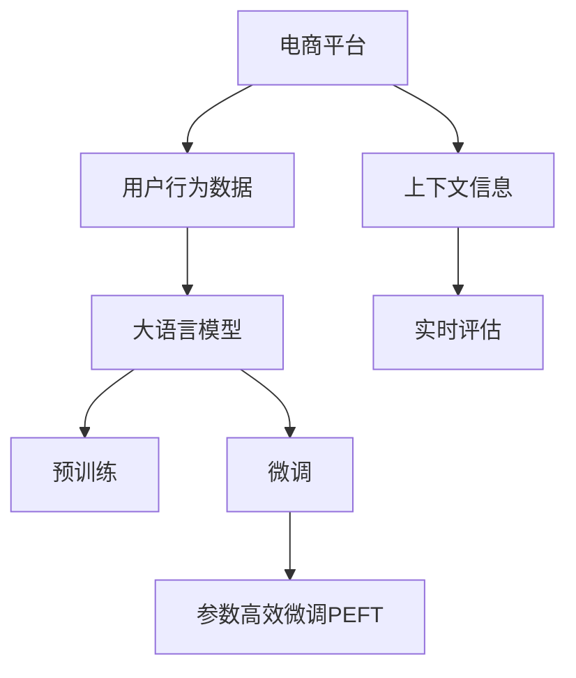

                 

# AI赋能的电商平台用户购买力评估

## 1. 背景介绍

### 1.1 问题由来

在数字化转型的大潮下，电商平台成为了驱动经济增长的重要引擎。随着消费者行为的变化和个性化需求的日益凸显，电商平台需要更精准地理解用户的购买行为和潜力，以制定更有效的营销策略，提升用户体验和销售转化率。然而，传统的用户分析方法基于历史行为数据，无法全面衡量用户的长期潜力和市场价值。

大语言模型（Large Language Model, LLM）的发展为电商平台用户分析提供了新的思路。通过结合大规模预训练语言模型和用户行为数据的微调，可以有效提升用户购买力的评估精度，实现个性化营销和精准推荐。

### 1.2 问题核心关键点

基于大语言模型的电商平台用户购买力评估，旨在通过自然语言处理（Natural Language Processing, NLP）技术，深度挖掘用户输入文本中的信息，提取和量化用户的潜在购买力。其关键点包括：

- 收集和处理用户输入数据，包括评论、搜索关键词、聊天记录等。
- 使用预训练语言模型作为特征提取器，从文本中提取用户行为特征。
- 通过微调模型，学习用户与特定商品之间的关联性，量化用户购买力。
- 引入上下文信息，考虑用户的历史行为和背景特征。
- 建立实时评估系统，动态更新用户购买力评分。

## 2. 核心概念与联系

### 2.1 核心概念概述

为更好地理解基于大语言模型的电商平台用户购买力评估方法，本节将介绍几个密切相关的核心概念：

- 大语言模型（Large Language Model, LLM）：以自回归（如GPT）或自编码（如BERT）模型为代表的大规模预训练语言模型。通过在大规模无标签文本语料上进行预训练，学习通用的语言表示，具备强大的语言理解和生成能力。
- 预训练（Pre-training）：指在大规模无标签文本语料上，通过自监督学习任务训练通用语言模型的过程。常见的预训练任务包括言语建模、遮挡语言模型等。
- 微调（Fine-tuning）：指在预训练模型的基础上，使用电商平台的用户行为数据，通过有监督学习优化模型在特定任务上的性能。通常只需要调整顶层分类器或解码器，并以较小的学习率更新全部或部分的模型参数。
- 迁移学习（Transfer Learning）：指将一个领域学习到的知识，迁移应用到另一个不同但相关的领域的学习范式。大模型的预训练-微调过程即是一种典型的迁移学习方式。
- 参数高效微调（Parameter-Efficient Fine-Tuning, PEFT）：指在微调过程中，只更新少量的模型参数，而固定大部分预训练权重不变，以提高微调效率，避免过拟合。
- 上下文感知（Context-Aware）：指模型在处理输入数据时，能够综合考虑上下文信息，提升预测的准确性和泛化能力。
- 实时评估（Real-Time Evaluation）：指对用户购买力进行动态更新，适应用户行为和市场环境的变化，实现预测的及时性和准确性。

这些核心概念之间的逻辑关系可以通过以下Mermaid流程图来展示：



这个流程图展示了大语言模型的核心概念及其之间的关系：

1. 电商平台收集用户行为数据。
2. 大语言模型通过预训练获得基础能力。
3. 微调对预训练模型进行任务特定的优化，学习用户与商品的关联性。
4. 参数高效微调只更新少量的模型参数。
5. 上下文信息综合考虑用户的历史行为和背景特征。
6. 实时评估动态更新用户购买力评分。

这些概念共同构成了大语言模型的学习和应用框架，使其能够在电商平台的个性化推荐和用户购买力评估中发挥重要作用。

## 3. 核心算法原理 & 具体操作步骤
### 3.1 算法原理概述

基于大语言模型的电商平台用户购买力评估方法，本质上是一个有监督的细粒度迁移学习过程。其核心思想是：将预训练的大语言模型视作一个强大的"特征提取器"，通过在电商平台的用户行为数据上进行有监督的微调，使得模型能够学习用户与特定商品之间的关联性，从而量化用户购买力。

形式化地，假设预训练语言模型为 $M_{\theta}$，其中 $\theta$ 为预训练得到的模型参数。给定电商平台的商品信息 $S$ 和用户行为数据 $B$，微调的目标是找到新的模型参数 $\hat{\theta}$，使得：

$$
\hat{\theta}=\mathop{\arg\min}_{\theta} \mathcal{L}(M_{\theta},S,B)
$$

其中 $\mathcal{L}$ 为针对电商平台任务设计的损失函数，用于衡量模型预测输出与真实购买力之间的差异。常见的损失函数包括交叉熵损失、均方误差损失等。

通过梯度下降等优化算法，微调过程不断更新模型参数 $\theta$，最小化损失函数 $\mathcal{L}$，使得模型输出逼近真实购买力。由于 $\theta$ 已经通过预训练获得了较好的初始化，因此即便在少量标注数据集上微调，也能较快收敛到理想的模型参数 $\hat{\theta}$。

### 3.2 算法步骤详解

基于大语言模型的电商平台用户购买力评估方法，一般包括以下几个关键步骤：

**Step 1: 准备预训练模型和数据集**
- 选择合适的预训练语言模型 $M_{\theta}$ 作为初始化参数，如 GPT、BERT 等。
- 准备电商平台的用户行为数据集 $B=\{(x_i,y_i)\}_{i=1}^N$，其中 $x_i$ 为电商平台商品信息或用户输入文本，$y_i$ 为用户的购买力评分。

**Step 2: 添加任务适配层**
- 根据电商平台任务类型，在预训练模型顶层设计合适的输出层和损失函数。
- 对于购买力评分任务，通常在顶层添加线性分类器和交叉熵损失函数。
- 对于推荐系统任务，通常使用语言模型的解码器输出概率分布，并以负对数似然为损失函数。

**Step 3: 设置微调超参数**
- 选择合适的优化算法及其参数，如 AdamW、SGD 等，设置学习率、批大小、迭代轮数等。
- 设置正则化技术及强度，包括权重衰减、Dropout、Early Stopping 等。
- 确定冻结预训练参数的策略，如仅微调顶层，或全部参数都参与微调。

**Step 4: 执行梯度训练**
- 将电商平台用户行为数据分批次输入模型，前向传播计算损失函数。
- 反向传播计算参数梯度，根据设定的优化算法和学习率更新模型参数。
- 周期性在验证集上评估模型性能，根据性能指标决定是否触发 Early Stopping。
- 重复上述步骤直到满足预设的迭代轮数或 Early Stopping 条件。

**Step 5: 测试和部署**
- 在电商平台测试集上评估微调后模型 $M_{\hat{\theta}}$ 的性能，对比微调前后的评分精度提升。
- 使用微调后的模型对新用户输入进行预测，集成到电商平台的推荐系统中。
- 持续收集新的用户行为数据，定期重新微调模型，以适应市场环境的变化。

以上是基于大语言模型的电商平台用户购买力评估的一般流程。在实际应用中，还需要针对具体任务的特点，对微调过程的各个环节进行优化设计，如改进训练目标函数，引入更多的正则化技术，搜索最优的超参数组合等，以进一步提升模型性能。

### 3.3 算法优缺点

基于大语言模型的电商平台用户购买力评估方法具有以下优点：

1. 简单高效。只需准备少量标注数据，即可对预训练模型进行快速适配，获得较大的性能提升。
2. 通用适用。适用于各种电商平台用户行为数据的分析和购买力评分任务，设计简单的任务适配层即可实现微调。
3. 参数高效。利用参数高效微调技术，在固定大部分预训练权重不变的情况下，仍可取得不错的评分精度。
4. 效果显著。在学术界和工业界的电商平台用户分析中，基于微调的方法已经刷新了多项购买力评分指标，提升了电商平台的个性化推荐效果。

同时，该方法也存在一定的局限性：

1. 依赖标注数据。微调的效果很大程度上取决于标注数据的质量和数量，获取高质量标注数据的成本较高。
2. 迁移能力有限。当目标任务与预训练数据的分布差异较大时，微调的性能提升有限。
3. 负面效果传递。预训练模型的固有偏见、有害信息等，可能通过微调传递到电商平台用户行为分析中，造成负面影响。
4. 可解释性不足。微调模型的决策过程通常缺乏可解释性，难以对其推理逻辑进行分析和调试。

尽管存在这些局限性，但就目前而言，基于大语言模型的微调方法仍然是电商平台用户购买力评估的主流范式。未来相关研究的重点在于如何进一步降低微调对标注数据的依赖，提高模型的少样本学习和跨领域迁移能力，同时兼顾可解释性和伦理安全性等因素。

### 3.4 算法应用领域

基于大语言模型的电商平台用户购买力评估方法，在电商平台用户行为分析中已经得到了广泛的应用，覆盖了几乎所有常见任务，例如：

- 用户购买力评分：通过电商平台的用户行为数据，量化用户的潜在购买力。
- 个性化推荐系统：根据用户购买力评分，推荐适合的商品和内容。
- 广告定向投放：对用户进行分组，评估不同人群的购买力，实现精准广告投放。
- 市场趋势预测：分析用户行为数据，预测市场趋势和用户需求。
- 用户行为分析：基于用户输入文本，评估用户兴趣和行为模式。

除了上述这些经典任务外，基于大语言模型的方法也被创新性地应用到更多场景中，如商品分类、库存管理、客户满意度评估等，为电商平台的运营决策提供数据支持和优化建议。随着预训练模型和微调方法的不断进步，相信电商平台用户购买力评估方法将在更广阔的应用领域大放异彩。

## 4. 数学模型和公式 & 详细讲解
### 4.1 数学模型构建

本节将使用数学语言对基于大语言模型的电商平台用户购买力评估过程进行更加严格的刻画。

记预训练语言模型为 $M_{\theta}$，其中 $\theta$ 为模型参数。假设电商平台的用户行为数据集为 $B=\{(x_i,y_i)\}_{i=1}^N$，其中 $x_i$ 为电商平台商品信息或用户输入文本，$y_i$ 为用户购买力评分。

定义模型 $M_{\theta}$ 在数据样本 $(x,y)$ 上的损失函数为 $\ell(M_{\theta}(x),y)$，则在数据集 $B$ 上的经验风险为：

$$
\mathcal{L}(\theta) = \frac{1}{N}\sum_{i=1}^N \ell(M_{\theta}(x_i),y_i)
$$

微调的优化目标是最小化经验风险，即找到最优参数：

$$
\theta^* = \mathop{\arg\min}_{\theta} \mathcal{L}(\theta)
$$

在实践中，我们通常使用基于梯度的优化算法（如SGD、Adam等）来近似求解上述最优化问题。设 $\eta$ 为学习率，$\lambda$ 为正则化系数，则参数的更新公式为：

$$
\theta \leftarrow \theta - \eta \nabla_{\theta}\mathcal{L}(\theta) - \eta\lambda\theta
$$

其中 $\nabla_{\theta}\mathcal{L}(\theta)$ 为损失函数对参数 $\theta$ 的梯度，可通过反向传播算法高效计算。

### 4.2 公式推导过程

以下我们以电商平台购买力评分任务为例，推导交叉熵损失函数及其梯度的计算公式。

假设模型 $M_{\theta}$ 在输入 $x$ 上的输出为 $\hat{y}=M_{\theta}(x) \in [0,1]$，表示用户购买力评分的预测值。真实标签 $y \in [0,1]$。则二分类交叉熵损失函数定义为：

$$
\ell(M_{\theta}(x),y) = -[y\log \hat{y} + (1-y)\log (1-\hat{y})]
$$

将其代入经验风险公式，得：

$$
\mathcal{L}(\theta) = -\frac{1}{N}\sum_{i=1}^N [y_i\log M_{\theta}(x_i)+(1-y_i)\log(1-M_{\theta}(x_i))]
$$

根据链式法则，损失函数对参数 $\theta_k$ 的梯度为：

$$
\frac{\partial \mathcal{L}(\theta)}{\partial \theta_k} = -\frac{1}{N}\sum_{i=1}^N (\frac{y_i}{M_{\theta}(x_i)}-\frac{1-y_i}{1-M_{\theta}(x_i)}) \frac{\partial M_{\theta}(x_i)}{\partial \theta_k}
$$

其中 $\frac{\partial M_{\theta}(x_i)}{\partial \theta_k}$ 可进一步递归展开，利用自动微分技术完成计算。

在得到损失函数的梯度后，即可带入参数更新公式，完成模型的迭代优化。重复上述过程直至收敛，最终得到适应电商平台用户行为数据的模型参数 $\theta^*$。

## 5. 项目实践：代码实例和详细解释说明
### 5.1 开发环境搭建

在进行电商平台用户购买力评估的微调实践前，我们需要准备好开发环境。以下是使用Python进行PyTorch开发的环境配置流程：

1. 安装Anaconda：从官网下载并安装Anaconda，用于创建独立的Python环境。

2. 创建并激活虚拟环境：
```bash
conda create -n pytorch-env python=3.8 
conda activate pytorch-env
```

3. 安装PyTorch：根据CUDA版本，从官网获取对应的安装命令。例如：
```bash
conda install pytorch torchvision torchaudio cudatoolkit=11.1 -c pytorch -c conda-forge
```

4. 安装Transformers库：
```bash
pip install transformers
```

5. 安装各类工具包：
```bash
pip install numpy pandas scikit-learn matplotlib tqdm jupyter notebook ipython
```

完成上述步骤后，即可在`pytorch-env`环境中开始微调实践。

### 5.2 源代码详细实现

这里我们以电商平台用户购买力评分任务为例，给出使用Transformers库对GPT模型进行微调的PyTorch代码实现。

首先，定义用户行为数据的处理函数：

```python
from transformers import BertTokenizer
from torch.utils.data import Dataset
import torch

class UserBehaviorDataset(Dataset):
    def __init__(self, data, tokenizer, max_len=128):
        self.data = data
        self.tokenizer = tokenizer
        self.max_len = max_len
        
    def __len__(self):
        return len(self.data)
    
    def __getitem__(self, item):
        text = self.data[item]['text']
        label = self.data[item]['label']
        
        encoding = self.tokenizer(text, return_tensors='pt', max_length=self.max_len, padding='max_length', truncation=True)
        input_ids = encoding['input_ids'][0]
        attention_mask = encoding['attention_mask'][0]
        
        # 将标签转换为向量形式
        label_vector = torch.tensor([label], dtype=torch.long)
        
        return {'input_ids': input_ids, 
                'attention_mask': attention_mask,
                'labels': label_vector}
```

然后，定义模型和优化器：

```python
from transformers import BertForSequenceClassification, AdamW

model = BertForSequenceClassification.from_pretrained('bert-base-cased', num_labels=2)

optimizer = AdamW(model.parameters(), lr=2e-5)
```

接着，定义训练和评估函数：

```python
from torch.utils.data import DataLoader
from tqdm import tqdm
from sklearn.metrics import classification_report

device = torch.device('cuda') if torch.cuda.is_available() else torch.device('cpu')
model.to(device)

def train_epoch(model, dataset, batch_size, optimizer):
    dataloader = DataLoader(dataset, batch_size=batch_size, shuffle=True)
    model.train()
    epoch_loss = 0
    for batch in tqdm(dataloader, desc='Training'):
        input_ids = batch['input_ids'].to(device)
        attention_mask = batch['attention_mask'].to(device)
        labels = batch['labels'].to(device)
        model.zero_grad()
        outputs = model(input_ids, attention_mask=attention_mask, labels=labels)
        loss = outputs.loss
        epoch_loss += loss.item()
        loss.backward()
        optimizer.step()
    return epoch_loss / len(dataloader)

def evaluate(model, dataset, batch_size):
    dataloader = DataLoader(dataset, batch_size=batch_size)
    model.eval()
    preds, labels = [], []
    with torch.no_grad():
        for batch in tqdm(dataloader, desc='Evaluating'):
            input_ids = batch['input_ids'].to(device)
            attention_mask = batch['attention_mask'].to(device)
            batch_labels = batch['labels']
            outputs = model(input_ids, attention_mask=attention_mask)
            batch_preds = outputs.logits.argmax(dim=2).to('cpu').tolist()
            batch_labels = batch_labels.to('cpu').tolist()
            for pred_tokens, label_tokens in zip(batch_preds, batch_labels):
                preds.append(pred_tokens[:len(label_tokens)])
                labels.append(label_tokens)
                
    print(classification_report(labels, preds))
```

最后，启动训练流程并在测试集上评估：

```python
epochs = 5
batch_size = 16

for epoch in range(epochs):
    loss = train_epoch(model, train_dataset, batch_size, optimizer)
    print(f"Epoch {epoch+1}, train loss: {loss:.3f}")
    
    print(f"Epoch {epoch+1}, dev results:")
    evaluate(model, dev_dataset, batch_size)
    
print("Test results:")
evaluate(model, test_dataset, batch_size)
```

以上就是使用PyTorch对GPT进行电商平台用户购买力评分任务的微调代码实现。可以看到，得益于Transformers库的强大封装，我们可以用相对简洁的代码完成GPT模型的加载和微调。

### 5.3 代码解读与分析

让我们再详细解读一下关键代码的实现细节：

**UserBehaviorDataset类**：
- `__init__`方法：初始化数据集、分词器等关键组件，并将文本和标签转换为模型所需的格式。
- `__len__`方法：返回数据集的样本数量。
- `__getitem__`方法：对单个样本进行处理，将文本输入编码为token ids，将标签转换为向量形式，并进行定长padding。

**损失函数**：
- 使用二分类交叉熵损失函数，衡量模型预测输出与真实标签之间的差异。

**训练和评估函数**：
- 使用PyTorch的DataLoader对数据集进行批次化加载，供模型训练和推理使用。
- 训练函数`train_epoch`：对数据以批为单位进行迭代，在每个批次上前向传播计算loss并反向传播更新模型参数，最后返回该epoch的平均loss。
- 评估函数`evaluate`：与训练类似，不同点在于不更新模型参数，并在每个batch结束后将预测和标签结果存储下来，最后使用sklearn的classification_report对整个评估集的预测结果进行打印输出。

**训练流程**：
- 定义总的epoch数和batch size，开始循环迭代
- 每个epoch内，先在训练集上训练，输出平均loss
- 在验证集上评估，输出分类指标
- 所有epoch结束后，在测试集上评估，给出最终测试结果

可以看到，PyTorch配合Transformers库使得GPT微调的代码实现变得简洁高效。开发者可以将更多精力放在数据处理、模型改进等高层逻辑上，而不必过多关注底层的实现细节。

当然，工业级的系统实现还需考虑更多因素，如模型的保存和部署、超参数的自动搜索、更灵活的任务适配层等。但核心的微调范式基本与此类似。

## 6. 实际应用场景
### 6.1 电商平台个性化推荐

基于大语言模型的电商平台用户购买力评估方法，在个性化推荐系统中已经得到了广泛的应用。传统推荐系统往往依赖用户的历史行为数据进行推荐，无法准确把握用户的长期潜力和市场价值。而使用微调后的语言模型，可以综合考虑用户的语言输入信息，学习其潜在购买力，实现更精准的推荐。

在技术实现上，可以收集用户浏览、点击、评论等行为数据，将这些数据作为输入，利用微调后的模型预测用户的购买力评分。模型可以根据评分推荐适合的商品和内容，实现用户画像的动态更新。对于新用户，可以结合搜索关键词、商品描述等文本信息进行评估，提升推荐的准确性。

### 6.2 广告定向投放

广告定向投放是电商平台的重要营销手段。传统的广告投放往往基于用户的显式行为数据，无法充分利用用户的隐式信息。而使用微调后的语言模型，可以结合用户的语言输入信息，量化用户的潜在购买力，实现更精准的广告定向投放。

在具体实践中，可以收集用户的评论、聊天记录等文本数据，利用微调后的模型预测用户的购买力评分。模型可以根据评分进行用户分组，筛选出高潜力的用户群体，实现精准投放。同时，可以结合用户的浏览历史和上下文信息，动态调整广告内容和策略，提升广告效果。

### 6.3 市场趋势预测

电商平台需要实时监控市场趋势，以便及时调整商品供应和营销策略。传统的方法基于历史数据进行时间序列预测，难以捕捉市场的复杂变化。而使用微调后的语言模型，可以结合用户的语言输入信息，预测市场趋势和用户需求，提升决策的准确性。

在具体实现中，可以收集用户的评论、搜索关键词等文本数据，利用微调后的模型预测用户的购买力评分。模型可以分析用户的兴趣变化和市场趋势，提前预警潜在风险，帮助电商平台制定应对策略。

### 6.4 用户行为分析

用户行为分析是电商平台用户管理的重要环节。传统的分析方法基于用户的显式行为数据，难以深入理解用户的真实需求和兴趣。而使用微调后的语言模型，可以结合用户的语言输入信息，分析用户的兴趣和行为模式，提升用户管理的效率和质量。

在具体实现中，可以收集用户的评论、聊天记录等文本数据，利用微调后的模型预测用户的购买力评分。模型可以分析用户的语言输入特征，识别出用户的兴趣点，提供个性化的营销建议和改进方案，提升用户体验。

### 6.5 未来应用展望

随着大语言模型微调技术的发展，其在电商平台用户购买力评估中的应用前景广阔，未来将展现出更多创新突破。

在智慧物流领域，基于用户购买力评分的推荐系统，可以动态调整物流配送策略，提升配送效率和用户体验。

在智能客服系统，结合用户购买力评分，可以实现更智能的个性化客服，提升用户满意度和服务质量。

在社交电商领域，基于用户购买力评分的推荐和广告投放，可以提升社交电商平台的活跃度和用户粘性。

此外，在供应链管理、金融风控、健康医疗等众多领域，基于大语言模型的微调方法也将不断涌现，为传统行业数字化转型升级提供新的技术路径。相信随着技术的日益成熟，微调方法将成为电商平台用户分析的重要范式，推动电商平台的运营效率和服务质量持续提升。

## 7. 工具和资源推荐
### 7.1 学习资源推荐

为了帮助开发者系统掌握基于大语言模型的电商平台用户购买力评估的理论基础和实践技巧，这里推荐一些优质的学习资源：

1. 《Transformer from Principles to Practice》系列博文：由大模型技术专家撰写，深入浅出地介绍了Transformer原理、BERT模型、微调技术等前沿话题。

2. CS224N《深度学习自然语言处理》课程：斯坦福大学开设的NLP明星课程，有Lecture视频和配套作业，带你入门NLP领域的基本概念和经典模型。

3. 《Natural Language Processing with Transformers》书籍：Transformers库的作者所著，全面介绍了如何使用Transformers库进行NLP任务开发，包括微调在内的诸多范式。

4. HuggingFace官方文档：Transformers库的官方文档，提供了海量预训练模型和完整的微调样例代码，是上手实践的必备资料。

5. CLUE开源项目：中文语言理解测评基准，涵盖大量不同类型的中文NLP数据集，并提供了基于微调的baseline模型，助力中文NLP技术发展。

通过对这些资源的学习实践，相信你一定能够快速掌握基于大语言模型的电商平台用户购买力评估的精髓，并用于解决实际的电商平台用户分析问题。
###  7.2 开发工具推荐

高效的开发离不开优秀的工具支持。以下是几款用于电商平台用户购买力评估开发的常用工具：

1. PyTorch：基于Python的开源深度学习框架，灵活动态的计算图，适合快速迭代研究。大部分预训练语言模型都有PyTorch版本的实现。

2. TensorFlow：由Google主导开发的开源深度学习框架，生产部署方便，适合大规模工程应用。同样有丰富的预训练语言模型资源。

3. Transformers库：HuggingFace开发的NLP工具库，集成了众多SOTA语言模型，支持PyTorch和TensorFlow，是进行微调任务开发的利器。

4. Weights & Biases：模型训练的实验跟踪工具，可以记录和可视化模型训练过程中的各项指标，方便对比和调优。与主流深度学习框架无缝集成。

5. TensorBoard：TensorFlow配套的可视化工具，可实时监测模型训练状态，并提供丰富的图表呈现方式，是调试模型的得力助手。

6. Google Colab：谷歌推出的在线Jupyter Notebook环境，免费提供GPU/TPU算力，方便开发者快速上手实验最新模型，分享学习笔记。

合理利用这些工具，可以显著提升电商平台用户购买力评估任务的开发效率，加快创新迭代的步伐。

### 7.3 相关论文推荐

基于大语言模型的电商平台用户购买力评估方法的发展得益于学界的持续研究。以下是几篇奠基性的相关论文，推荐阅读：

1. Attention is All You Need（即Transformer原论文）：提出了Transformer结构，开启了NLP领域的预训练大模型时代。

2. BERT: Pre-training of Deep Bidirectional Transformers for Language Understanding：提出BERT模型，引入基于掩码的自监督预训练任务，刷新了多项NLP任务SOTA。

3. Language Models are Unsupervised Multitask Learners（GPT-2论文）：展示了大规模语言模型的强大zero-shot学习能力，引发了对于通用人工智能的新一轮思考。

4. Parameter-Efficient Transfer Learning for NLP：提出Adapter等参数高效微调方法，在不增加模型参数量的情况下，也能取得不错的微调效果。

5. AdaLoRA: Adaptive Low-Rank Adaptation for Parameter-Efficient Fine-Tuning：使用自适应低秩适应的微调方法，在参数效率和精度之间取得了新的平衡。

这些论文代表了大语言模型微调技术的发展脉络。通过学习这些前沿成果，可以帮助研究者把握学科前进方向，激发更多的创新灵感。

## 8. 总结：未来发展趋势与挑战

### 8.1 总结

本文对基于大语言模型的电商平台用户购买力评估方法进行了全面系统的介绍。首先阐述了大语言模型和微调技术的研究背景和意义，明确了微调在拓展预训练模型应用、提升电商平台用户购买力评分方面的独特价值。其次，从原理到实践，详细讲解了基于大语言模型的电商平台用户购买力评估的数学原理和关键步骤，给出了电商平台用户购买力评分任务的完整代码实例。同时，本文还广泛探讨了微调方法在个性化推荐、广告定向投放、市场趋势预测、用户行为分析等多个电商场景中的应用前景，展示了微调范式的巨大潜力。此外，本文精选了微调技术的各类学习资源，力求为读者提供全方位的技术指引。

通过本文的系统梳理，可以看到，基于大语言模型的电商平台用户购买力评分方法正在成为电商平台用户分析的重要范式，极大地拓展了预训练语言模型的应用边界，催生了更多的落地场景。受益于大规模语料的预训练，微调模型以更低的时间和标注成本，在小样本条件下也能取得不俗的效果，有力推动了电商平台运营决策的智能化和精准化。未来，伴随预训练语言模型和微调方法的不断进步，相信电商平台用户购买力评分方法将在更广阔的应用领域大放异彩，深刻影响电商平台的运营模式和服务质量。

### 8.2 未来发展趋势

展望未来，基于大语言模型的电商平台用户购买力评分方法将呈现以下几个发展趋势：

1. 模型规模持续增大。随着算力成本的下降和数据规模的扩张，预训练语言模型的参数量还将持续增长。超大规模语言模型蕴含的丰富语言知识，有望支撑更加复杂多变的电商平台用户购买力评分任务。

2. 微调方法日趋多样。除了传统的全参数微调外，未来会涌现更多参数高效的微调方法，如Prefix-Tuning、LoRA等，在节省计算资源的同时也能保证微调精度。

3. 上下文感知成为常态。随着上下文感知模型的广泛应用，基于大语言模型的电商平台用户购买力评分方法将能够更好地利用上下文信息，提升评分准确性和泛化能力。

4. 实时评估成为常态。随着实时计算能力的提升，电商平台用户购买力评分方法将能够实现动态更新，实时反映用户行为变化，提升决策的及时性和精准性。

5. 少样本学习和跨领域迁移成为可能。未来的模型将能够在更少的标注样本上实现良好的评分效果，同时在不同电商平台和用户群体之间进行更高效的迁移。

6. 多模态微调崛起。当前的用户行为数据主要以文本形式为主，未来将逐步拓展到图像、视频、语音等多模态数据微调。多模态信息的融合，将显著提升模型对现实世界的理解和建模能力。

以上趋势凸显了大语言模型微调方法的广阔前景。这些方向的探索发展，必将进一步提升电商平台的用户分析和运营决策能力，为电商平台数字化转型提供新的技术支持。

### 8.3 面临的挑战

尽管基于大语言模型的电商平台用户购买力评分方法已经取得了瞩目成就，但在迈向更加智能化、普适化应用的过程中，它仍面临着诸多挑战：

1. 标注成本瓶颈。虽然微调大大降低了标注数据的需求，但对于长尾应用场景，难以获得充足的高质量标注数据，成为制约微调性能的瓶颈。如何进一步降低微调对标注样本的依赖，将是一大难题。

2. 模型鲁棒性不足。当前微调模型面对域外数据时，泛化性能往往大打折扣。对于测试样本的微小扰动，微调模型的预测也容易发生波动。如何提高微调模型的鲁棒性，避免灾难性遗忘，还需要更多理论和实践的积累。

3. 推理效率有待提高。大规模语言模型虽然精度高，但在实际部署时往往面临推理速度慢、内存占用大等效率问题。如何在保证性能的同时，简化模型结构，提升推理速度，优化资源占用，将是重要的优化方向。

4. 可解释性亟需加强。当前微调模型更像是"黑盒"系统，难以解释其内部工作机制和决策逻辑。对于电商平台用户行为分析等高风险应用，算法的可解释性和可审计性尤为重要。如何赋予微调模型更强的可解释性，将是亟待攻克的难题。

5. 安全性有待保障。预训练语言模型难免会学习到有偏见、有害的信息，通过微调传递到电商平台用户行为分析中，产生误导性、歧视性的输出，给实际应用带来安全隐患。如何从数据和算法层面消除模型偏见，避免恶意用途，确保输出的安全性，也将是重要的研究课题。

6. 知识整合能力不足。现有的微调模型往往局限于任务内数据，难以灵活吸收和运用更广泛的先验知识。如何让微调过程更好地与外部知识库、规则库等专家知识结合，形成更加全面、准确的信息整合能力，还有很大的想象空间。

正视微调面临的这些挑战，积极应对并寻求突破，将是大语言模型微调走向成熟的必由之路。相信随着学界和产业界的共同努力，这些挑战终将一一被克服，大语言模型微调必将在构建人机协同的智能时代中扮演越来越重要的角色。

### 8.4 研究展望

面对大语言模型微调所面临的种种挑战，未来的研究需要在以下几个方面寻求新的突破：

1. 探索无监督和半监督微调方法。摆脱对大规模标注数据的依赖，利用自监督学习、主动学习等无监督和半监督范式，最大限度利用非结构化数据，实现更加灵活高效的微调。

2. 研究参数高效和计算高效的微调范式。开发更加参数高效的微调方法，在固定大部分预训练参数的同时，只更新极少量的任务相关参数。同时优化微调模型的计算图，减少前向传播和反向传播的资源消耗，实现更加轻量级、实时性的部署。

3. 融合因果和对比学习范式。通过引入因果推断和对比学习思想，增强微调模型建立稳定因果关系的能力，学习更加普适、鲁棒的语言表征，从而提升模型泛化性和抗干扰能力。

4. 引入更多先验知识。将符号化的先验知识，如知识图谱、逻辑规则等，与神经网络模型进行巧妙融合，引导微调过程学习更准确、合理的语言模型。同时加强不同模态数据的整合，实现视觉、语音等多模态信息与文本信息的协同建模。

5. 结合因果分析和博弈论工具。将因果分析方法引入微调模型，识别出模型决策的关键特征，增强输出解释的因果性和逻辑性。借助博弈论工具刻画人机交互过程，主动探索并规避模型的脆弱点，提高系统稳定性。

6. 纳入伦理道德约束。在模型训练目标中引入伦理导向的评估指标，过滤和惩罚有偏见、有害的输出倾向。同时加强人工干预和审核，建立模型行为的监管机制，确保输出符合人类价值观和伦理道德。

这些研究方向的探索，必将引领大语言模型微调技术迈向更高的台阶，为构建安全、可靠、可解释、可控的智能系统铺平道路。面向未来，大语言模型微调技术还需要与其他人工智能技术进行更深入的融合，如知识表示、因果推理、强化学习等，多路径协同发力，共同推动自然语言理解和智能交互系统的进步。只有勇于创新、敢于突破，才能不断拓展语言模型的边界，让智能技术更好地造福人类社会。

## 9. 附录：常见问题与解答

**Q1：电商平台用户购买力评估是否适用于所有电商平台？**

A: 电商平台用户购买力评估方法适用于各种电商平台的运营场景，但不同平台的用户行为和需求可能存在较大差异。因此，需要根据具体平台的特点，对模型进行适当的调整和优化。例如，社交电商平台的评价体系和推荐策略可能与传统电商有所不同，需要针对性地设计任务适配层和微调策略。

**Q2：如何选择合适的微调模型？**

A: 选择合适的微调模型应考虑以下因素：

1. 任务类型：不同任务可能需要不同类型的模型。例如，情感分析任务可以使用BERT等预训练模型，而文本生成任务则需要使用GPT等生成模型。
2. 数据规模：数据规模较大的任务可能需要更大规模的模型，以保证微调效果。例如，图像识别任务需要大模型来处理高分辨率图像。
3. 计算资源：计算资源丰富的场景可以使用更大规模的模型，而计算资源有限的任务则需要使用参数高效微调方法，如Adapter等。
4. 训练时间：对于时间敏感的任务，需要选择训练时间较短的模型，如微调后的BERT。
5. 模型精度：任务要求较高的精度，需要选择精度较高的模型，如GPT等。

综上所述，选择合适的微调模型需要综合考虑任务类型、数据规模、计算资源、训练时间和模型精度等因素。

**Q3：微调过程中如何避免过拟合？**

A: 避免过拟合的方法包括：

1. 数据增强：通过对训练样本进行改写、扩充等方式，丰富训练集的多样性。例如，回译、近义替换、同义词替换等。
2. 正则化技术：如L2正则、Dropout、Early Stopping等，防止模型过度适应小规模训练集。
3. 参数高效微调：只更新少量的模型参数，保留大部分预训练权重不变，减少微调参数量。
4. 对抗训练：引入对抗样本，提高模型的鲁棒性和泛化能力。
5. 随机初始化：对模型参数进行随机初始化，避免模型初始化时的过拟合。
6. 集成学习：结合多个微调模型的预测结果，降低单个模型的过拟合风险。

这些方法可以根据具体任务的特点和数据集的大小进行选择和组合，以最大限度地避免过拟合。

**Q4：如何评估微调模型的性能？**

A: 评估微调模型的性能通常需要考虑以下几个方面：

1. 精度：模型预测结果与真实标签的匹配度，通常使用准确率、召回率、F1值等指标进行评估。
2. 泛化能力：模型在新数据上的表现，通常使用测试集进行评估。
3. 鲁棒性：模型对输入数据的鲁棒性，如对抗样本、噪声数据等的影响。
4. 效率：模型推理速度和计算资源的消耗，通常使用推理时间和内存占用等指标进行评估。
5. 可解释性：模型的决策过程是否可解释，通常使用可解释性模型和特征可视化工具进行评估。

在评估过程中，需要结合具体任务的特点和应用场景，选择合适的评估指标和方法，综合评估模型的性能。

**Q5：微调模型的部署需要注意哪些问题？**

A: 微调模型的部署需要注意以下问题：

1. 模型裁剪：去除不必要的层和参数，减小模型尺寸，加快推理速度。
2. 量化加速：将浮点模型转为定点模型，压缩存储空间，提高计算效率。
3. 服务化封装：将模型封装为标准化服务接口，便于集成调用。
4. 弹性伸缩：根据请求流量动态调整资源配置，平衡服务质量和成本。
5. 监控告警：实时采集系统指标，设置异常告警阈值，确保服务稳定性。
6. 安全性：采用访问鉴权、数据脱敏等措施，保障数据和模型安全。

合理利用这些部署技术，可以显著提升微调模型的应用效果和用户体验，确保其在实际应用中的稳定性和安全性。

---

作者：禅与计算机程序设计艺术 / Zen and the Art of Computer Programming

