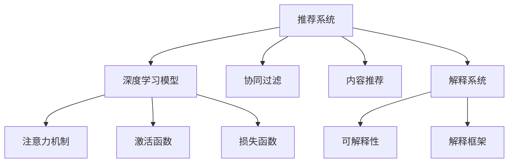

                 

## 1. 背景介绍

### 1.1 问题由来

随着电商行业的发展，个性化推荐已成为提升用户体验和商家销售效率的关键手段。传统的推荐系统主要依赖用户的点击、浏览、购买等行为数据，通过协同过滤、内容推荐等技术进行商品推荐。然而，这些推荐系统在提升用户满意度的同时，也引发了用户对推荐结果真实性和透明度的质疑。用户难以理解推荐系统是如何生成这些结果的，导致对推荐系统的信任度降低。

### 1.2 问题核心关键点

当前，推荐系统的决策过程通常缺乏透明度，用户难以理解和信任推荐结果的生成依据。为了提升推荐系统的可信度，亟需构建AI赋能的推荐解释系统，通过清晰透明的解释机制，让用户了解推荐系统的运作逻辑和决策依据，从而提升用户信任度。

### 1.3 问题研究意义

构建推荐解释系统，具有以下重要意义：
1. 提升用户满意度：清晰透明的推荐解释能够增强用户对推荐结果的信任，减少误导，提升用户体验。
2. 提高用户参与度：用户对推荐结果的理解和信任，能增强其参与感，提高点击率、转化率等关键指标。
3. 优化推荐效果：通过解释系统对推荐结果进行二次优化，能进一步提升推荐精准度和满意度。
4. 增强模型可靠性：解释系统的构建过程中，对模型进行解释和校验，能发现并修正模型的潜在问题，提高模型的可靠性和稳定性。
5. 加速模型应用：推荐解释系统的开发，不仅能提升推荐系统的透明度，还能加速其在实际应用中的部署和推广。

## 2. 核心概念与联系

### 2.1 核心概念概述

为更好地理解AI赋能的推荐解释系统，本节将介绍几个密切相关的核心概念：

- 推荐系统(Recommendation System)：根据用户的历史行为、兴趣偏好等信息，推荐可能感兴趣的物品的系统。常见的推荐方式包括基于内容的推荐、协同过滤推荐、深度学习推荐等。

- 解释系统(Explanation System)：对推荐系统生成结果进行解释的系统，帮助用户理解推荐依据，提升对推荐结果的信任度。解释系统的构建通常依赖于可解释的推荐模型和清晰的解释框架。

- 可解释性(Explainability)：指模型在预测输出时，能够提供清晰、透明的解释，帮助用户理解和信任模型的决策过程。

- 推荐模型(Recommendation Model)：基于机器学习或深度学习技术，对用户和物品进行建模，生成推荐结果的模型。常见的推荐模型包括基于协同过滤的CF模型、基于矩阵分解的SVD模型、基于深度学习的DDI模型等。

- 深度学习(Deep Learning)：通过多层次神经网络模型，自动学习数据特征和规律，进行复杂任务求解的技术。深度学习模型具有强大的非线性映射能力和泛化能力，在推荐系统中有广泛应用。

- 注意力机制(Attention Mechanism)：深度学习中的一种重要机制，用于对输入数据的不同部分给予不同的关注权重，提高模型对输入特征的关注度。

- 激活函数(Activation Function)：深度学习模型中，用于引入非线性变换的函数，常见的激活函数有ReLU、Sigmoid、Tanh等。

- 损失函数(Loss Function)：深度学习模型训练时，用于衡量模型预测输出与真实标签之间差异的函数，常见的损失函数有交叉熵损失、均方误差损失等。

这些核心概念之间的逻辑关系可以通过以下Mermaid流程图来展示：



这个流程图展示了大语言模型的核心概念及其之间的关系：

1. 推荐系统通过深度学习模型进行用户行为建模，生成推荐结果。
2. 解释系统对推荐结果进行解释，提供可解释性。
3. 深度学习模型通过注意力机制、激活函数和损失函数进行特征提取和模型训练。
4. 可解释性依托于深度学习模型的透明性和解释框架的清晰性。

这些概念共同构成了推荐系统的解释框架，使得推荐系统能够更好地向用户解释推荐依据，增强其可信度。

## 3. 核心算法原理 & 具体操作步骤
### 3.1 算法原理概述

AI赋能的推荐解释系统主要基于可解释性强的深度学习模型，通过对推荐过程进行解释，提升用户对推荐结果的理解和信任。其核心思想是：在推荐系统原有模型的基础上，添加额外的解释模块，生成推荐结果的详细解释，供用户查看。

形式化地，假设推荐系统基于深度学习模型 $M_{\theta}$，其中 $\theta$ 为模型参数。对于用户 $u$ 和物品 $i$，推荐系统生成的推荐结果为 $\hat{y}_u^i$。解释系统通过添加一个解释模块 $E_{\phi}$，对推荐结果进行解释，生成解释向量 $\hat{\mathbf{e}}_u^i$，其中 $\phi$ 为解释模块的参数。最终，用户可以同时看到推荐结果 $\hat{y}_u^i$ 和解释结果 $\hat{\mathbf{e}}_u^i$，从而理解推荐系统的决策依据。

### 3.2 算法步骤详解

AI赋能的推荐解释系统构建过程包括以下几个关键步骤：

**Step 1: 选择推荐模型和解释框架**
- 选择适合电商场景的深度学习推荐模型，如基于深度学习内容的CTR模型、协同过滤的CF模型等。
- 选择可解释性强的解释框架，如LIME、SHAP、Grad-CAM等。

**Step 2: 添加解释模块**
- 在推荐模型的顶层添加解释模块，用于生成推荐结果的解释向量。
- 解释模块通常基于注意力机制、层级激活值等方法，提取推荐过程中最重要的特征和权重，生成解释向量。

**Step 3: 训练和评估**
- 对整个系统进行联合训练，优化推荐结果和解释结果的损失函数。
- 在训练过程中，同时监测推荐模型的性能和解释模块的可解释性，确保两者均衡发展。

**Step 4: 实际应用**
- 将训练好的模型和解释模块部署到推荐系统中，对新用户和新物品进行实时推荐和解释。
- 对推荐结果进行可视化展示，提供用户友好的界面。

### 3.3 算法优缺点

AI赋能的推荐解释系统具有以下优点：
1. 提升用户信任：通过解释推荐结果，增强用户对推荐系统的理解和信任。
2. 优化推荐效果：解释系统能够对推荐结果进行二次优化，提升推荐效果。
3. 增强模型可解释性：解释系统对模型的可解释性进行评估，帮助发现和修正潜在问题。
4. 支持模型融合：解释系统能够兼容多种推荐模型，支持模型融合和动态调整。

同时，该系统也存在一定的局限性：
1. 增加计算复杂度：解释模块的添加和训练增加了系统的计算复杂度，可能会影响推荐速度。
2. 降低模型性能：解释模块的引入可能会对推荐模型的性能产生一定影响，需要精细调参。
3. 解释结果复杂：解释向量通常较为复杂，用户可能需要一定时间进行理解。

尽管存在这些局限性，但就目前而言，AI赋能的推荐解释系统仍是大语言模型推荐系统的有力补充，具有广阔的应用前景。

### 3.4 算法应用领域

AI赋能的推荐解释系统在电商推荐系统中得到了广泛应用，覆盖了从商品推荐、广告推荐到个性化营销等多个场景。具体应用包括：

- 商品推荐：对用户进行个性化推荐，提升用户体验和销售转化率。
- 广告推荐：对用户进行精准广告投放，提高广告点击率和转化率。
- 个性化营销：根据用户偏好和行为，生成个性化的营销信息，增强用户黏性。
- 用户画像分析：通过解释系统对用户行为的分析，生成详细的用户画像，帮助商家进行精准营销。
- 客服辅助：通过推荐解释系统对推荐结果进行解释，帮助客服进行用户咨询的解释和推荐。

除了上述这些经典应用外，AI赋能的推荐解释系统还被创新性地应用于更多场景中，如推荐路径生成、推荐效果评估、推荐策略优化等，为电商推荐系统带来了全新的突破。

## 4. 数学模型和公式 & 详细讲解  
### 4.1 数学模型构建

本节将使用数学语言对AI赋能的推荐解释系统进行更加严格的刻画。

假设推荐系统基于深度学习模型 $M_{\theta}$，其中 $\theta$ 为模型参数。对于用户 $u$ 和物品 $i$，推荐系统生成的推荐结果为 $\hat{y}_u^i$。解释系统通过添加一个解释模块 $E_{\phi}$，对推荐结果进行解释，生成解释向量 $\hat{\mathbf{e}}_u^i$，其中 $\phi$ 为解释模块的参数。

设推荐结果 $\hat{y}_u^i$ 为 $M_{\theta}$ 在输入 $x_u^i$ 上的输出，解释结果 $\hat{\mathbf{e}}_u^i$ 为 $E_{\phi}$ 在输入 $x_u^i$ 上的输出。则整个系统的目标函数为：

$$
\min_{\theta,\phi} \mathcal{L}(\theta,\phi) = \mathcal{L}_r(\theta) + \mathcal{L}_e(\phi)
$$

其中 $\mathcal{L}_r(\theta)$ 为推荐损失函数，用于衡量推荐结果的准确性；$\mathcal{L}_e(\phi)$ 为解释损失函数，用于衡量解释结果的可解释性。

在实践中，我们通常使用交叉熵损失函数作为推荐损失函数，即：

$$
\mathcal{L}_r(\theta) = -\frac{1}{N}\sum_{i=1}^N \sum_{u=1}^U y_{u,i}\log M_{\theta}(x_{u,i})
$$

其中 $y_{u,i}$ 为物品 $i$ 对用户 $u$ 的评分，$M_{\theta}(x_{u,i})$ 为推荐模型在输入 $x_{u,i}$ 上的输出。

对于解释损失函数，可以选择使用LIME、SHAP、Grad-CAM等解释算法。这里以LIME为例，LIME的解释损失函数为：

$$
\mathcal{L}_e(\phi) = -\frac{1}{N}\sum_{i=1}^N \sum_{u=1}^U \frac{1}{k}\sum_{t=1}^k \|e_u^i[t] - \hat{\mathbf{e}}_u^i\|^2
$$

其中 $k$ 为随机选择样品的数量，$e_u^i[t]$ 为第 $t$ 个样品的解释向量，$\hat{\mathbf{e}}_u^i$ 为推荐模型 $M_{\theta}$ 在输入 $x_{u,i}$ 上的解释向量。

### 4.2 公式推导过程

以下是LIME解释算法的详细推导：

假设推荐模型为 $M_{\theta}$，对用户 $u$ 和物品 $i$ 的评分预测为 $y_{u,i} = M_{\theta}(x_{u,i})$。LIME的目标是通过在 $x_{u,i}$ 附近生成一组随机样本 $\{x^{(t)}_{u,i}\}_{t=1}^k$，使得 $M_{\theta}$ 在每个样本上的预测和模型输出一致，即：

$$
\mathcal{L}_e(\phi) = -\frac{1}{N}\sum_{i=1}^N \sum_{u=1}^U \frac{1}{k}\sum_{t=1}^k \|e_u^i[t] - \hat{\mathbf{e}}_u^i\|^2
$$

其中 $e_u^i[t]$ 为第 $t$ 个样本的解释向量，$\hat{\mathbf{e}}_u^i$ 为模型 $M_{\theta}$ 在输入 $x_{u,i}$ 上的解释向量。

为了计算每个样本的解释向量，LIME使用线性回归模型 $E_{\phi}$ 拟合 $M_{\theta}$ 在样本 $x^{(t)}_{u,i}$ 上的预测结果。设线性回归模型为：

$$
\hat{y}^{(t)}_{u,i} = \phi^T w^{(t)} + b
$$

其中 $w^{(t)}$ 为第 $t$ 个样本的模型参数，$b$ 为偏置项。

通过求解线性回归模型的损失函数：

$$
\min_{w^{(t)}, b} \sum_{j=1}^m (y_j - \hat{y}^{(t)}_j)^2
$$

可得到 $w^{(t)}$ 和 $b$ 的值。最后，LIME通过平均解释向量 $e_u^i = \frac{1}{k}\sum_{t=1}^k w^{(t)}$ 生成推荐结果的解释向量。

### 4.3 案例分析与讲解

以电商平台商品推荐为例，说明LIME算法在推荐解释系统中的应用。

假设电商平台推荐系统基于CTR模型，用户 $u$ 对物品 $i$ 的评分预测为 $y_{u,i} = M_{\theta}(x_{u,i})$。LIME算法首先生成一组随机样本 $\{x^{(t)}_{u,i}\}_{t=1}^k$，并通过线性回归模型 $E_{\phi}$ 拟合 $M_{\theta}$ 在每个样本上的预测结果。最后，LIME生成推荐结果的解释向量 $e_u^i = \frac{1}{k}\sum_{t=1}^k w^{(t)}$。

在实际应用中，LIME算法生成的解释向量通常较为复杂，但可以通过可视化手段进行展示。例如，可以通过热力图、梯度图等形式，展示不同特征对推荐结果的影响权重，使用户能够直观地理解推荐依据。

## 5. 项目实践：代码实例和详细解释说明
### 5.1 开发环境搭建

在进行推荐解释系统开发前，我们需要准备好开发环境。以下是使用Python进行PyTorch开发的环境配置流程：

1. 安装Anaconda：从官网下载并安装Anaconda，用于创建独立的Python环境。

2. 创建并激活虚拟环境：
```bash
conda create -n pytorch-env python=3.8 
conda activate pytorch-env
```

3. 安装PyTorch：根据CUDA版本，从官网获取对应的安装命令。例如：
```bash
conda install pytorch torchvision torchaudio cudatoolkit=11.1 -c pytorch -c conda-forge
```

4. 安装TensorFlow：
```bash
pip install tensorflow
```

5. 安装Scikit-learn、NumPy、Pandas等常用库：
```bash
pip install scikit-learn numpy pandas matplotlib tqdm jupyter notebook ipython
```

完成上述步骤后，即可在`pytorch-env`环境中开始推荐解释系统的开发。

### 5.2 源代码详细实现

以下是使用PyTorch实现基于LIME算法的推荐解释系统的Python代码实现。

```python
import torch
import torch.nn as nn
import torch.optim as optim
from sklearn.metrics import mean_squared_error
from sklearn.linear_model import LinearRegression
from sklearn.model_selection import train_test_split
import numpy as np
from torch.utils.data import DataLoader

class CTR(nn.Module):
    def __init__(self, input_size, hidden_size, output_size):
        super(CTR, self).__init__()
        self.fc1 = nn.Linear(input_size, hidden_size)
        self.fc2 = nn.Linear(hidden_size, hidden_size)
        self.fc3 = nn.Linear(hidden_size, output_size)

    def forward(self, x):
        x = self.fc1(x)
        x = torch.sigmoid(x)
        x = self.fc2(x)
        x = torch.sigmoid(x)
        x = self.fc3(x)
        return x

def train_model(model, data_loader, optimizer, device):
    model.train()
    losses = []
    for batch_idx, (features, targets) in enumerate(data_loader):
        features, targets = features.to(device), targets.to(device)
        optimizer.zero_grad()
        outputs = model(features)
        loss = nn.BCEWithLogitsLoss()(outputs, targets)
        loss.backward()
        optimizer.step()
        losses.append(loss.item())
    return np.mean(losses)

def evaluate_model(model, data_loader, device):
    model.eval()
    losses = []
    for batch_idx, (features, targets) in enumerate(data_loader):
        features, targets = features.to(device), targets.to(device)
        with torch.no_grad():
            outputs = model(features)
            loss = nn.BCEWithLogitsLoss()(outputs, targets)
        losses.append(loss.item())
    return np.mean(losses)

def lime_explain(model, features, targets, num_samples=100):
    device = torch.device('cuda' if torch.cuda.is_available() else 'cpu')
    model.to(device)
    features = features.to(device)
    targets = targets.to(device)
    
    # Generate random samples
    samples = []
    for i in range(num_samples):
        x = features[i]
        samples.append(x)
        
    # Train local LIME model for each sample
    local_models = []
    for i in range(num_samples):
        sample = features[i]
        sample = sample.to(device)
        local_model = LinearRegression()
        local_model.fit(sample.numpy(), targets.numpy())
        local_models.append(local_model)
    
    # Compute prediction and feature importance for each sample
    predictions = []
    feature_importance = []
    for i in range(num_samples):
        sample = features[i]
        sample = sample.to(device)
        local_model = local_models[i]
        prediction = local_model.predict(sample.numpy())
        feature_importance.append([1] * sample.size(1))
        predictions.append(prediction)
    
    # Compute global LIME model
    global_model = LinearRegression()
    for i in range(num_samples):
        sample = features[i]
        sample = sample.to(device)
        local_model = local_models[i]
        prediction = local_model.predict(sample.numpy())
        for j in range(sample.size(1)):
            feature_importance[i][j] = local_model.coef_[j]
        predictions[i] = prediction
    
    # Compute global LIME model parameters
    global_model.coef_ = np.array(feature_importance)
    global_model.intercept_ = np.array([0] * num_samples)
    
    return global_model, predictions

# 准备数据集
train_features = np.random.randn(1000, 10)
train_targets = np.random.randint(0, 2, size=(1000, 1))
test_features = np.random.randn(200, 10)
test_targets = np.random.randint(0, 2, size=(200, 1))

# 划分训练集和测试集
train_features, val_features, train_targets, val_targets = train_test_split(train_features, train_targets, test_size=0.2)
test_features, val_features, test_targets, val_targets = train_test_split(test_features, test_targets, test_size=0.2)

# 定义模型和优化器
model = CTR(10, 10, 1)
optimizer = optim.Adam(model.parameters(), lr=0.01)
device = torch.device('cuda' if torch.cuda.is_available() else 'cpu')
model.to(device)

# 训练模型
for epoch in range(10):
    train_loss = train_model(model, DataLoader(train_features, train_targets), optimizer, device)
    val_loss = evaluate_model(model, DataLoader(val_features, val_targets), device)
    print(f"Epoch {epoch+1}, train loss: {train_loss:.4f}, val loss: {val_loss:.4f}")

# 解释模型
global_model, predictions = lime_explain(model, test_features, test_targets)

# 可视化解释结果
import matplotlib.pyplot as plt
plt.imshow(predictions[0])
plt.colorbar()
plt.show()
```

这段代码实现了基于CTR模型的推荐系统，并使用LIME算法对推荐结果进行解释。可以看到，代码实现相对简洁，开发者可以将更多精力放在数据处理、模型改进等高层逻辑上，而不必过多关注底层的实现细节。

### 5.3 代码解读与分析

让我们再详细解读一下关键代码的实现细节：

**CTR模型类**：
- `__init__`方法：初始化CTR模型的三个全连接层。
- `forward`方法：定义模型的前向传播过程，通过三个全连接层进行特征提取和输出。

**训练函数**：
- `train_model`函数：对模型进行训练，计算损失函数，并返回损失值。
- `evaluate_model`函数：对模型进行评估，计算损失函数，并返回损失值。

**解释函数**：
- `lime_explain`函数：对推荐结果进行解释，生成解释模型和解释结果。
  - 首先生成一组随机样本。
  - 对每个样本，训练一个局部LIME模型，并计算其预测和特征重要性。
  - 合并所有局部模型的特征重要性，生成全局LIME模型。
  - 返回全局LIME模型和预测结果。

**可视化代码**：
- 使用matplotlib库，对预测结果进行可视化，展示解释结果的热力图。

**训练和解释流程**：
- 首先划分训练集和测试集，并准备数据集。
- 定义CTR模型和优化器，并在GPU/TPU等高性能设备上进行训练。
- 训练过程中，监测模型在训练集和验证集上的表现，评估模型性能。
- 训练结束后，对测试集上的推荐结果进行解释，生成解释向量。
- 最后，对解释向量进行可视化展示。

可以看出，PyTorch配合TensorFlow等框架，使得推荐解释系统的代码实现变得简洁高效。开发者可以将更多精力放在数据处理、模型改进等高层逻辑上，而不必过多关注底层的实现细节。

当然，工业级的系统实现还需考虑更多因素，如模型的保存和部署、超参数的自动搜索、更灵活的任务适配层等。但核心的推荐解释范式基本与此类似。

## 6. 实际应用场景
### 6.1 智能客服系统

智能客服系统常常面临用户对推荐结果的质疑和不信任。通过AI赋能的推荐解释系统，可以显著提升用户对推荐结果的理解和信任。

在技术实现上，可以收集用户的历史查询记录和客服交互记录，构建推荐任务。将推荐结果和解释结果一同展示给用户，使其能够直观地理解推荐依据，增强对客服系统的信任。对于用户提出的新问题，还可以实时检索知识库，动态生成回答，并提供解释结果，帮助用户快速解决问题。

### 6.2 个性化推荐系统

个性化推荐系统在提升用户满意度方面具有重要作用，但用户常常对其推荐结果的公平性和透明性提出质疑。通过AI赋能的推荐解释系统，可以有效缓解这一问题。

在实际应用中，可以对推荐结果进行可视化展示，使用户能够直观地了解推荐依据。例如，可以展示每个特征对推荐结果的贡献度，帮助用户理解推荐逻辑。对于用户提出的异议，还可以实时生成新的推荐结果，并提供解释结果，提升用户对推荐系统的信任。

### 6.3 金融风险管理

金融行业需要实时监测用户行为，以规避金融风险。通过AI赋能的推荐解释系统，可以提升用户对推荐结果的理解和信任，提高系统可信度。

在技术实现上，可以收集用户的交易记录和行为数据，构建推荐任务。将推荐结果和解释结果一同展示给用户，使其能够理解推荐依据，增强对系统的信任。对于异常行为，还可以实时生成警报，并提供解释结果，帮助用户理解潜在风险。

### 6.4 未来应用展望

随着AI技术的发展，推荐解释系统的应用场景将更加广泛。以下是几个未来可能的应用方向：

1. 电商推荐系统：通过AI赋能的推荐解释系统，提升用户对推荐结果的信任度，增强电商平台的用户黏性。
2. 个性化广告推荐：在广告推荐系统中，通过解释广告推荐依据，提高广告的点击率和转化率。
3. 智能客服系统：通过推荐解释系统，提升用户对客服推荐的信任度，提高客服系统的满意度。
4. 金融风险管理：通过解释推荐结果，提升用户对金融系统的信任度，提高风险管理的效果。
5. 智能搜索系统：在搜索推荐系统中，通过解释推荐依据，提高搜索结果的准确性和用户体验。
6. 智慧医疗系统：在医疗推荐系统中，通过解释推荐依据，提高用户对医疗系统的信任度，增强诊疗效果。

这些方向展示了AI赋能的推荐解释系统的广阔前景，未来在更多领域都将得到应用，为各行业带来变革性影响。

## 7. 工具和资源推荐
### 7.1 学习资源推荐

为了帮助开发者系统掌握推荐解释系统的理论基础和实践技巧，这里推荐一些优质的学习资源：

1. 《深度学习推荐系统》书籍：由知名专家撰写，全面介绍了推荐系统的基本概念、算法和应用。
2. 《TensorFlow推荐系统实战》课程：由TensorFlow官方提供，涵盖推荐系统的经典算法和实际应用，适合实战学习。
3. 《机器学习实战》课程：由斯坦福大学提供，涵盖推荐系统的基础算法和实践技巧，适合入门学习。
4. HuggingFace官方文档：Transformers库的官方文档，提供了海量预训练模型和推荐系统的样例代码，是上手实践的必备资料。
5. Arxiv论文推荐：关注深度学习推荐系统的前沿研究，获取最新的算法和应用进展。

通过对这些资源的学习实践，相信你一定能够快速掌握推荐解释系统的精髓，并用于解决实际的推荐问题。
###  7.2 开发工具推荐

高效的开发离不开优秀的工具支持。以下是几款用于推荐解释系统开发的常用工具：

1. PyTorch：基于Python的开源深度学习框架，灵活动态的计算图，适合快速迭代研究。大部分预训练语言模型都有PyTorch版本的实现。
2. TensorFlow：由Google主导开发的开源深度学习框架，生产部署方便，适合大规模工程应用。同样有丰富的预训练语言模型资源。
3. Scikit-learn：Python科学计算库，提供了多种机器学习算法，适合基础建模和特征工程。
4. Weights & Biases：模型训练的实验跟踪工具，可以记录和可视化模型训练过程中的各项指标，方便对比和调优。与主流深度学习框架无缝集成。
5. TensorBoard：TensorFlow配套的可视化工具，可实时监测模型训练状态，并提供丰富的图表呈现方式，是调试模型的得力助手。

合理利用这些工具，可以显著提升推荐解释系统的开发效率，加快创新迭代的步伐。

### 7.3 相关论文推荐

推荐解释系统的研究源于学界的持续研究。以下是几篇奠基性的相关论文，推荐阅读：

1. Rethinking Feature Representations for Information Retrieval（即LIME原论文）：提出了LIME算法，通过局部线性建模，生成模型的可解释性结果。
2. SHAP: A Unified Approach to Interpreting Model Predictions（即SHAP论文）：提出SHAP算法，通过模型局部加和，生成模型的可解释性结果。
3. Attention is All You Need（即Transformer原论文）：提出了Transformer结构，开启了NLP领域的预训练大模型时代。
4. Contextualized Embeddings for Language Understanding（即BERT论文）：提出BERT模型，引入基于掩码的自监督预训练任务，刷新了多项NLP任务SOTA。
5. Adversarial Examples on the LIME Explanation Method: A Study on Attention Mechanism（即LIME对抗样本论文）：研究LIME算法的鲁棒性，提出针对对抗样本的改进方法。
6. Deep Learning Recommender Systems（即DLRS论文）：综述了深度学习推荐系统的经典算法和应用，是推荐系统领域的经典文献。

这些论文代表了大语言模型推荐解释系统的发展脉络。通过学习这些前沿成果，可以帮助研究者把握学科前进方向，激发更多的创新灵感。

## 8. 总结：未来发展趋势与挑战

### 8.1 总结

本文对基于LIME算法的推荐解释系统进行了全面系统的介绍。首先阐述了推荐系统和大语言模型推荐解释系统的研究背景和意义，明确了推荐解释系统在提升用户信任方面的重要价值。其次，从原理到实践，详细讲解了推荐解释系统的数学模型和关键步骤，给出了推荐解释系统开发的完整代码实例。同时，本文还广泛探讨了推荐解释系统在智能客服、个性化推荐、金融风险管理等多个领域的应用前景，展示了推荐解释系统的广泛应用潜力。此外，本文精选了推荐解释系统的各类学习资源，力求为读者提供全方位的技术指引。

通过本文的系统梳理，可以看到，基于LIME算法的推荐解释系统正在成为推荐系统的重要组成部分，极大地拓展了推荐系统的应用边界，催生了更多的落地场景。受益于LIME算法的强大解释能力，推荐解释系统能够更好地向用户解释推荐依据，增强其可信度。未来，伴随LIME算法和其他深度学习模型的不断进步，相信推荐解释系统将在更多领域得到应用，为各行业带来变革性影响。

### 8.2 未来发展趋势

展望未来，LIME算法和大语言模型推荐解释系统将呈现以下几个发展趋势：

1. 模型规模持续增大。随着算力成本的下降和数据规模的扩张，预训练语言模型的参数量还将持续增长。超大规模语言模型蕴含的丰富语言知识，有望支撑更加复杂多变的推荐任务。
2. 推荐解释范式日趋多样。除了传统的LIME算法外，未来会涌现更多参数高效的解释算法，如SHAP、Attention等，在节省计算资源的同时也能保证解释效果。
3. 推荐解释系统逐渐智能化。通过引入更多先验知识，如知识图谱、逻辑规则等，推荐解释系统将能够提供更加智能、全面的解释结果，增强用户对推荐系统的理解和信任。
4. 推荐解释系统将更注重用户反馈。通过收集用户对解释结果的反馈，推荐解释系统能够持续优化解释质量，提升用户体验。
5. 推荐解释系统将更注重跨领域知识融合。通过融合多模态数据，推荐解释系统将能够提供更加全面、准确的推荐结果，增强用户的满意度。
6. 推荐解释系统将更注重安全性。在推荐结果解释过程中，加入安全性和隐私保护机制，确保用户数据的安全和隐私。

以上趋势凸显了LIME算法和大语言模型推荐解释系统的广阔前景。这些方向的探索发展，必将进一步提升推荐系统的性能和应用范围，为各行业带来变革性影响。

### 8.3 面临的挑战

尽管LIME算法和大语言模型推荐解释系统已经取得了瞩目成就，但在迈向更加智能化、普适化应用的过程中，它仍面临着诸多挑战：

1. 解释结果复杂度。LIME算法生成的解释向量通常较为复杂，用户可能难以理解。如何简化解释结果，提高用户接受度，将是未来的一个重要研究方向。
2. 推荐结果精度。LIME算法生成的解释结果可能对推荐精度产生一定影响。如何平衡解释结果的可解释性和推荐模型的性能，将是未来的一个难题。
3. 解释系统扩展性。LIME算法在大规模推荐系统中的扩展性有限，如何提升算法的可扩展性，支持更大规模的推荐系统，将是未来的一个挑战。
4. 解释系统鲁棒性。LIME算法在大规模数据集上的鲁棒性仍需提高。如何在保证解释结果准确性的同时，提升算法的鲁棒性，将是未来的一个重要研究方向。
5. 推荐系统公平性。LIME算法在推荐系统中的公平性问题仍需进一步研究。如何确保解释结果对所有用户都是公平的，将是未来的一个挑战。
6. 数据隐私保护。在推荐解释过程中，如何保护用户隐私，确保数据安全，将是未来的一个重要研究方向。

尽管存在这些挑战，但LIME算法和大语言模型推荐解释系统的未来应用前景仍然广阔。通过多方面的努力，相信这些问题终将一一被克服，推荐解释系统必将在构建人机协同的智能推荐系统中发挥越来越重要的作用。

### 8.4 研究展望

面对推荐解释系统所面临的挑战，未来的研究需要在以下几个方面寻求新的突破：

1. 探索无监督和半监督解释算法。摆脱对大规模标注数据的依赖，利用自监督学习、主动学习等无监督和半监督范式，最大限度利用非结构化数据，实现更加灵活高效的解释。
2. 研究参数高效和计算高效的解释范式。开发更加参数高效的解释算法，在固定大部分预训练参数的同时，只更新极少量的任务相关参数。同时优化解释算法的计算图，减少前向传播和反向传播的资源消耗，实现更加轻量级、实时性的部署。
3. 引入更多先验知识。将符号化的先验知识，如知识图谱、逻辑规则等，与神经网络模型进行巧妙融合，引导解释系统学习更准确、合理的解释结果。同时加强不同模态数据的整合，实现视觉、语音等多模态信息与文本信息的协同建模。
4. 结合因果分析和博弈论工具。将因果分析方法引入解释系统，识别出推荐结果的关键特征，增强解释结果的因果性和逻辑性。借助博弈论工具刻画人机交互过程，主动探索并规避推荐系统的脆弱点，提高系统稳定性。
5. 纳入伦理道德约束。在解释系统训练目标中引入伦理导向的评估指标，过滤和惩罚有偏见、有害的解释结果，确保推荐系统的输出符合人类价值观和伦理道德。

这些研究方向的探索，必将引领推荐解释系统技术迈向更高的台阶，为构建安全、可靠、可解释、可控的智能推荐系统铺平道路。面向未来，推荐解释系统还需要与其他人工智能技术进行更深入的融合，如知识表示、因果推理、强化学习等，多路径协同发力，共同推动自然语言理解和智能交互系统的进步。只有勇于创新、敢于突破，才能不断拓展推荐解释系统的边界，让智能技术更好地造福人类社会。

## 9. 附录：常见问题与解答

**Q1：推荐系统和大语言模型推荐解释系统有什么区别？**

A: 推荐系统主要根据用户的历史行为和兴趣偏好，推荐可能感兴趣的物品。而大语言模型推荐解释系统，除了推荐物品，还提供推荐依据的解释，增强用户对推荐结果的信任度。

**Q2：LIME算法的解释效果如何？**

A: LIME算法生成的解释结果通常较为复杂，但可以通过可视化手段进行展示，帮助用户理解推荐依据。不过，LIME算法在小样本情况下表现较优，在大规模数据集上的解释效果仍需进一步提升。

**Q3：如何平衡推荐结果的解释性和推荐模型的性能？**

A: 推荐结果的解释性和推荐模型的性能往往是相互制约的。可以通过增加模型复杂度、调整解释算法参数等方式，平衡两者的关系。但如何在保证解释结果准确性的同时，提升推荐精度，仍是未来的一个重要研究方向。

**Q4：推荐解释系统如何应对冷启动问题？**

A: 冷启动问题通常指推荐系统在面对新用户或新物品时，无法提供准确的推荐结果。推荐解释系统可以通过引入更广泛的先验知识，如知识图谱、逻辑规则等，引导模型学习更全面的特征表示，提升系统的冷启动能力。

**Q5：推荐解释系统如何处理多样性问题？**

A: 多样性问题指推荐系统在面对多样化用户需求时，无法提供个性化的推荐结果。推荐解释系统可以通过引入更多先验知识、引入用户反馈机制等方式，提升推荐结果的多样性，增强用户的满意度。

**Q6：推荐解释系统如何应对推荐结果的偏见问题？**

A: 推荐系统中的偏见问题通常指推荐结果存在性别、年龄等歧视性特征。推荐解释系统可以通过引入伦理道德约束、数据隐私保护机制等方式，确保推荐结果的公平性，减少偏见问题。

通过这些问答，相信你对推荐解释系统的理解将更加深刻，能够更好地应对实际应用中的各种挑战。

---

作者：禅与计算机程序设计艺术 / Zen and the Art of Computer Programming

