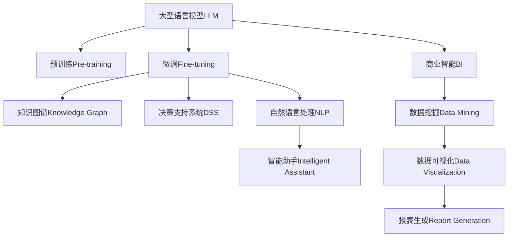

                 

# AI辅助决策：LLM在企业管理中的应用前景

> 关键词：AI辅助决策, 自然语言处理, 企业管理, 语言模型, 决策支持, 数据分析, 智能决策, 知识管理, 智能助手, 商业智能

## 1. 背景介绍

### 1.1 问题由来
在快速变化的商业环境中，企业管理者面临着日益复杂和动态的决策挑战。传统的决策方式往往依赖于定性和经验，在数据和分析上较为薄弱。而人工智能（AI）和大数据技术的发展，尤其是自然语言处理（NLP）技术的突破，为企业管理提供了新的解决方案。基于大型语言模型（Large Language Model, LLM）的AI辅助决策系统，通过语义理解和知识图谱构建，能够有效支撑企业管理者进行精准和高效的决策。

### 1.2 问题核心关键点
当前，企业决策支持的AI系统正朝着自动化、智能化方向快速发展。然而，传统AI系统在语言理解、知识抽取、情境感知等方面仍存在诸多不足。如何构建具备强大语义理解和知识整合能力的AI系统，成为推动企业管理决策智能化、科学化的关键问题。

基于语言模型的企业AI决策系统，具有以下优势：
1. 语义理解能力：能够理解自然语言输入，精准捕捉用户意图和情境。
2. 知识整合能力：通过大规模知识库的辅助，生成结构化信息，辅助决策。
3. 数据驱动决策：利用大数据分析，提供客观的数据支撑，减少决策偏差。
4. 智能化反馈：通过持续学习，不断提升决策模型的准确性和适应性。

本博文将详细探讨基于大型语言模型（LLM）的企业AI辅助决策系统的构建和应用。

## 2. 核心概念与联系

### 2.1 核心概念概述

为更好地理解基于LLM的企业AI决策系统，本节将介绍几个关键概念：

- 大型语言模型（Large Language Model, LLM）：以自回归模型（如GPT）或自编码模型（如BERT）为代表的深度学习模型，能够在大规模无标签文本语料上进行预训练，学习丰富的语言知识和常识。

- 预训练(Pre-training)：指在大规模无标签文本语料上，通过自监督学习任务训练通用语言模型的过程。常见的预训练任务包括语言模型、掩码语言模型等。

- 微调(Fine-tuning)：指在预训练模型的基础上，使用企业决策任务的小规模标注数据，通过有监督学习优化模型在该任务上的性能。通常只需调整顶层分类器或解码器，并以较小的学习率更新全部或部分的模型参数。

- 知识图谱(Knowledge Graph)：结构化的语义知识库，用于存储和查询实体与实体之间的关系，为AI决策系统提供客观知识支撑。

- 决策支持系统(Decision Support System, DSS)：辅助企业决策的系统，通过数据分析、可视化、预测等方式，为决策者提供数据支持和决策建议。

- 自然语言处理(Natural Language Processing, NLP)：使计算机能够理解、分析和生成人类语言的技术，是构建企业AI决策系统的基础。

- 商业智能(Business Intelligence, BI)：通过数据挖掘、数据可视化、报表生成等方式，帮助企业发现、理解、预测和挖掘数据中的业务价值。

- 智能助手：基于AI的交互式助手，可以辅助用户进行日常操作、信息检索、决策支持等。

这些核心概念之间的逻辑关系可以通过以下Mermaid流程图来展示：



这个流程图展示了大语言模型的核心概念及其之间的关系：

1. 大语言模型通过预训练获得基础能力。
2. 微调是对预训练模型进行任务特定的优化，使其能够适应企业决策任务。
3. 知识图谱为模型提供客观知识支撑，提升决策模型的准确性。
4. 决策支持系统集成数据驱动的分析和可视化工具，辅助决策。
5. 自然语言处理技术使模型能够理解和处理自然语言输入。
6. 智能助手通过用户交互，辅助用户进行日常操作和决策支持。
7. 商业智能通过数据挖掘、可视化、报表生成等方式，帮助企业发现和理解业务价值。

这些概念共同构成了企业AI决策系统的技术基础，使得基于大语言模型的决策支持系统能够实现企业决策的智能化和自动化。

## 3. 核心算法原理 & 具体操作步骤
### 3.1 算法原理概述

基于LLM的企业AI辅助决策系统，本质上是一个多模态的智能决策系统。其核心思想是：将大型语言模型作为基础模型，通过微调和知识图谱辅助，构建决策支持系统，支持企业管理者的决策过程。

形式化地，假设决策支持系统为 $DSS_{\theta}$，其中 $\theta$ 为模型参数。给定企业决策任务 $T$ 的标注数据集 $D=\{(x_i, y_i)\}_{i=1}^N$，其中 $x_i$ 为输入文本描述，$y_i$ 为决策目标（如销售目标、产品推荐、风险评估等）。微调的目标是找到新的模型参数 $\hat{\theta}$，使得：

$$
\hat{\theta}=\mathop{\arg\min}_{\theta} \mathcal{L}(DSS_{\theta},D)
$$

其中 $\mathcal{L}$ 为针对任务 $T$ 设计的损失函数，用于衡量模型预测输出与真实标签之间的差异。常见的损失函数包括交叉熵损失、均方误差损失等。

通过梯度下降等优化算法，微调过程不断更新模型参数 $\theta$，最小化损失函数 $\mathcal{L}$，使得模型输出逼近真实标签。由于 $\theta$ 已经通过预训练获得了较好的初始化，因此即便在规模较小的企业决策任务上，也能较快收敛到理想的模型参数 $\hat{\theta}$。

### 3.2 算法步骤详解

基于LLM的企业AI辅助决策系统一般包括以下几个关键步骤：

**Step 1: 准备预训练模型和数据集**
- 选择合适的预训练语言模型 $LLM_{\theta}$ 作为初始化参数，如 GPT、BERT 等。
- 准备企业决策任务 $T$ 的标注数据集 $D$，划分为训练集、验证集和测试集。一般要求标注数据与预训练数据的分布不要差异过大。

**Step 2: 添加任务适配层**
- 根据任务类型，在预训练模型顶层设计合适的输出层和损失函数。
- 对于分类任务，通常在顶层添加线性分类器和交叉熵损失函数。
- 对于生成任务，通常使用语言模型的解码器输出概率分布，并以负对数似然为损失函数。

**Step 3: 设置微调超参数**
- 选择合适的优化算法及其参数，如 AdamW、SGD 等，设置学习率、批大小、迭代轮数等。
- 设置正则化技术及强度，包括权重衰减、Dropout、Early Stopping 等。
- 确定冻结预训练参数的策略，如仅微调顶层，或全部参数都参与微调。

**Step 4: 执行梯度训练**
- 将训练集数据分批次输入模型，前向传播计算损失函数。
- 反向传播计算参数梯度，根据设定的优化算法和学习率更新模型参数。
- 周期性在验证集上评估模型性能，根据性能指标决定是否触发 Early Stopping。
- 重复上述步骤直到满足预设的迭代轮数或 Early Stopping 条件。

**Step 5: 测试和部署**
- 在测试集上评估微调后模型 $DSS_{\hat{\theta}}$ 的性能，对比微调前后的精度提升。
- 使用微调后的模型对新样本进行推理预测，集成到实际的企业决策支持系统中。
- 持续收集新的数据，定期重新微调模型，以适应数据分布的变化。

以上是基于LLM的企业AI辅助决策系统的一般流程。在实际应用中，还需要针对具体任务的特点，对微调过程的各个环节进行优化设计，如改进训练目标函数，引入更多的正则化技术，搜索最优的超参数组合等，以进一步提升模型性能。

### 3.3 算法优缺点

基于LLM的企业AI辅助决策系统具有以下优点：
1. 强大的语义理解能力：能够准确理解自然语言输入，捕捉用户意图和情境。
2. 丰富的知识图谱支持：通过知识图谱辅助，提供客观知识支撑，提升决策准确性。
3. 数据驱动的决策：利用大数据分析，提供客观的数据支撑，减少决策偏差。
4. 智能化的反馈：通过持续学习，不断提升决策模型的准确性和适应性。

同时，该系统也存在一些局限性：
1. 对标注数据依赖：微调的效果很大程度上取决于标注数据的质量和数量，获取高质量标注数据的成本较高。
2. 模型鲁棒性有限：当目标任务与预训练数据的分布差异较大时，微调的性能提升有限。
3. 可解释性不足：微调模型的决策过程通常缺乏可解释性，难以对其推理逻辑进行分析和调试。
4. 计算资源需求高：大语言模型通常需要较大的计算资源，对算力和存储有较高要求。
5. 隐私和安全问题：模型在处理企业敏感数据时，需要严格的数据隐私保护和安全措施。

尽管存在这些局限性，但就目前而言，基于LLM的企业AI辅助决策系统仍是最先进、最有效的决策支持手段之一。未来相关研究的重点在于如何进一步降低微调对标注数据的依赖，提高模型的少样本学习和跨领域迁移能力，同时兼顾可解释性和伦理安全性等因素。

### 3.4 算法应用领域

基于LLM的企业AI辅助决策系统，在企业管理决策中得到了广泛的应用，覆盖了企业决策支持系统的各个方面，例如：

- 销售预测：通过分析历史销售数据和市场趋势，预测未来的销售目标。
- 产品推荐：根据用户行为和偏好，推荐合适的产品或服务。
- 风险评估：对企业的财务状况、市场环境等进行风险评估，辅助决策。
- 人力资源管理：根据员工绩效和市场薪资水平，进行人才招聘和绩效评估。
- 客户关系管理：分析客户反馈和行为数据，提升客户满意度和忠诚度。
- 供应链管理：通过预测和优化供应链各环节，提高效率和降低成本。
- 金融分析：利用财务报表和市场数据，进行投资组合和风险管理。

除了上述这些经典应用外，基于LLM的企业AI辅助决策系统还在更多场景中得到了创新性的应用，如智能客户服务、智能合同生成、智能会议记录等，为企业的智能化转型升级提供了新的技术路径。

## 4. 数学模型和公式 & 详细讲解 & 举例说明
### 4.1 数学模型构建

本节将使用数学语言对基于LLM的企业AI辅助决策系统进行更加严格的刻画。

记预训练语言模型为 $LLM_{\theta}$，其中 $\theta$ 为预训练得到的模型参数。假设企业决策任务 $T$ 的训练集为 $D=\{(x_i,y_i)\}_{i=1}^N, x_i \in \mathcal{X}, y_i \in \mathcal{Y}$，其中 $\mathcal{X}$ 为输入空间，$\mathcal{Y}$ 为输出空间。

定义模型 $DSS_{\theta}$ 在数据样本 $(x,y)$ 上的损失函数为 $\ell(DSS_{\theta}(x),y)$，则在数据集 $D$ 上的经验风险为：

$$
\mathcal{L}(\theta) = \frac{1}{N} \sum_{i=1}^N \ell(DSS_{\theta}(x_i),y_i)
$$

微调的优化目标是最小化经验风险，即找到最优参数：

$$
\theta^* = \mathop{\arg\min}_{\theta} \mathcal{L}(\theta)
$$

在实践中，我们通常使用基于梯度的优化算法（如SGD、Adam等）来近似求解上述最优化问题。设 $\eta$ 为学习率，$\lambda$ 为正则化系数，则参数的更新公式为：

$$
\theta \leftarrow \theta - \eta \nabla_{\theta}\mathcal{L}(\theta) - \eta\lambda\theta
$$

其中 $\nabla_{\theta}\mathcal{L}(\theta)$ 为损失函数对参数 $\theta$ 的梯度，可通过反向传播算法高效计算。

### 4.2 公式推导过程

以下我们以企业风险评估任务为例，推导交叉熵损失函数及其梯度的计算公式。

假设模型 $DSS_{\theta}$ 在输入 $x$ 上的输出为 $\hat{y}=DSS_{\theta}(x) \in [0,1]$，表示样本属于高风险的概率。真实标签 $y \in \{0,1\}$。则二分类交叉熵损失函数定义为：

$$
\ell(DSS_{\theta}(x),y) = -[y\log \hat{y} + (1-y)\log (1-\hat{y})]
$$

将其代入经验风险公式，得：

$$
\mathcal{L}(\theta) = -\frac{1}{N}\sum_{i=1}^N [y_i\log DSS_{\theta}(x_i)+(1-y_i)\log(1-DSS_{\theta}(x_i))]
$$

根据链式法则，损失函数对参数 $\theta_k$ 的梯度为：

$$
\frac{\partial \mathcal{L}(\theta)}{\partial \theta_k} = -\frac{1}{N}\sum_{i=1}^N (\frac{y_i}{DSS_{\theta}(x_i)}-\frac{1-y_i}{1-DSS_{\theta}(x_i)}) \frac{\partial DSS_{\theta}(x_i)}{\partial \theta_k}
$$

其中 $\frac{\partial DSS_{\theta}(x_i)}{\partial \theta_k}$ 可进一步递归展开，利用自动微分技术完成计算。

在得到损失函数的梯度后，即可带入参数更新公式，完成模型的迭代优化。重复上述过程直至收敛，最终得到适应企业决策任务的最优模型参数 $\theta^*$。

## 5. 项目实践：代码实例和详细解释说明
### 5.1 开发环境搭建

在进行企业AI辅助决策系统的微调实践前，我们需要准备好开发环境。以下是使用Python进行PyTorch开发的环境配置流程：

1. 安装Anaconda：从官网下载并安装Anaconda，用于创建独立的Python环境。

2. 创建并激活虚拟环境：
```bash
conda create -n pytorch-env python=3.8 
conda activate pytorch-env
```

3. 安装PyTorch：根据CUDA版本，从官网获取对应的安装命令。例如：
```bash
conda install pytorch torchvision torchaudio cudatoolkit=11.1 -c pytorch -c conda-forge
```

4. 安装Transformers库：
```bash
pip install transformers
```

5. 安装各类工具包：
```bash
pip install numpy pandas scikit-learn matplotlib tqdm jupyter notebook ipython
```

完成上述步骤后，即可在`pytorch-env`环境中开始微调实践。

### 5.2 源代码详细实现

下面我们以企业风险评估任务为例，给出使用Transformers库对BERT模型进行微调的PyTorch代码实现。

首先，定义企业风险评估任务的数据处理函数：

```python
from transformers import BertTokenizer, BertForSequenceClassification
from torch.utils.data import Dataset, DataLoader
import torch

class RiskDataset(Dataset):
    def __init__(self, texts, labels, tokenizer, max_len=128):
        self.texts = texts
        self.labels = labels
        self.tokenizer = tokenizer
        self.max_len = max_len
        
    def __len__(self):
        return len(self.texts)
    
    def __getitem__(self, item):
        text = self.texts[item]
        label = self.labels[item]
        
        encoding = self.tokenizer(text, return_tensors='pt', max_length=self.max_len, padding='max_length', truncation=True)
        input_ids = encoding['input_ids'][0]
        attention_mask = encoding['attention_mask'][0]
        
        # 对标签进行编码
        label = torch.tensor(label, dtype=torch.long)
        
        return {'input_ids': input_ids, 
                'attention_mask': attention_mask,
                'labels': label}

# 标签
label_map = {'low': 0, 'medium': 1, 'high': 2}

# 创建dataset
tokenizer = BertTokenizer.from_pretrained('bert-base-cased')
train_dataset = RiskDataset(train_texts, train_labels, tokenizer)
dev_dataset = RiskDataset(dev_texts, dev_labels, tokenizer)
test_dataset = RiskDataset(test_texts, test_labels, tokenizer)
```

然后，定义模型和优化器：

```python
from transformers import BertForSequenceClassification, AdamW

model = BertForSequenceClassification.from_pretrained('bert-base-cased', num_labels=len(label_map))

optimizer = AdamW(model.parameters(), lr=2e-5)
```

接着，定义训练和评估函数：

```python
from sklearn.metrics import classification_report

device = torch.device('cuda') if torch.cuda.is_available() else torch.device('cpu')
model.to(device)

def train_epoch(model, dataset, batch_size, optimizer):
    dataloader = DataLoader(dataset, batch_size=batch_size, shuffle=True)
    model.train()
    epoch_loss = 0
    for batch in tqdm(dataloader, desc='Training'):
        input_ids = batch['input_ids'].to(device)
        attention_mask = batch['attention_mask'].to(device)
        labels = batch['labels'].to(device)
        model.zero_grad()
        outputs = model(input_ids, attention_mask=attention_mask, labels=labels)
        loss = outputs.loss
        epoch_loss += loss.item()
        loss.backward()
        optimizer.step()
    return epoch_loss / len(dataloader)

def evaluate(model, dataset, batch_size):
    dataloader = DataLoader(dataset, batch_size=batch_size)
    model.eval()
    preds, labels = [], []
    with torch.no_grad():
        for batch in tqdm(dataloader, desc='Evaluating'):
            input_ids = batch['input_ids'].to(device)
            attention_mask = batch['attention_mask'].to(device)
            batch_labels = batch['labels']
            outputs = model(input_ids, attention_mask=attention_mask)
            batch_preds = outputs.logits.argmax(dim=2).to('cpu').tolist()
            batch_labels = batch_labels.to('cpu').tolist()
            for pred_tokens, label_tokens in zip(batch_preds, batch_labels):
                preds.append(pred_tokens)
                labels.append(label_tokens)
                
    print(classification_report(labels, preds))
```

最后，启动训练流程并在测试集上评估：

```python
epochs = 5
batch_size = 16

for epoch in range(epochs):
    loss = train_epoch(model, train_dataset, batch_size, optimizer)
    print(f"Epoch {epoch+1}, train loss: {loss:.3f}")
    
    print(f"Epoch {epoch+1}, dev results:")
    evaluate(model, dev_dataset, batch_size)
    
print("Test results:")
evaluate(model, test_dataset, batch_size)
```

以上就是使用PyTorch对BERT进行企业风险评估任务微调的完整代码实现。可以看到，得益于Transformers库的强大封装，我们可以用相对简洁的代码完成BERT模型的加载和微调。

### 5.3 代码解读与分析

让我们再详细解读一下关键代码的实现细节：

**RiskDataset类**：
- `__init__`方法：初始化文本、标签、分词器等关键组件。
- `__len__`方法：返回数据集的样本数量。
- `__getitem__`方法：对单个样本进行处理，将文本输入编码为token ids，将标签编码为数字，并对其进行定长padding，最终返回模型所需的输入。

**label_map字典**：
- 定义了标签与数字id之间的映射关系，用于将预测结果解码回真实的标签。

**训练和评估函数**：
- 使用PyTorch的DataLoader对数据集进行批次化加载，供模型训练和推理使用。
- 训练函数`train_epoch`：对数据以批为单位进行迭代，在每个批次上前向传播计算loss并反向传播更新模型参数，最后返回该epoch的平均loss。
- 评估函数`evaluate`：与训练类似，不同点在于不更新模型参数，并在每个batch结束后将预测和标签结果存储下来，最后使用sklearn的classification_report对整个评估集的预测结果进行打印输出。

**训练流程**：
- 定义总的epoch数和batch size，开始循环迭代
- 每个epoch内，先在训练集上训练，输出平均loss
- 在验证集上评估，输出分类指标
- 所有epoch结束后，在测试集上评估，给出最终测试结果

可以看到，PyTorch配合Transformers库使得BERT微调的代码实现变得简洁高效。开发者可以将更多精力放在数据处理、模型改进等高层逻辑上，而不必过多关注底层的实现细节。

当然，工业级的系统实现还需考虑更多因素，如模型的保存和部署、超参数的自动搜索、更灵活的任务适配层等。但核心的微调范式基本与此类似。

## 6. 实际应用场景
### 6.1 销售预测

基于大语言模型的企业AI决策系统，可以广泛应用于销售预测任务。传统销售预测依赖历史数据和经验模型，难以应对复杂多变的市场需求。而通过微调大语言模型，利用大数据分析和市场趋势预测，可以显著提升销售预测的准确性。

在技术实现上，可以收集企业的历史销售数据、市场趋势、季节性因素等，将其作为监督数据，训练大语言模型进行预测。微调后的模型能够从文本数据中提取关键信息，结合历史数据和市场趋势，生成精确的销售预测结果。

### 6.2 产品推荐

基于大语言模型的企业AI辅助决策系统，可以用于产品推荐，帮助企业快速响应市场需求，提高用户满意度和忠诚度。传统的产品推荐依赖用户历史行为数据，难以捕捉新用户的需求和偏好。而利用大语言模型的语义理解能力，可以从文本描述中抽取用户需求，进行个性化推荐。

在实际应用中，可以收集用户对产品的评价、评论、使用场景等文本数据，利用微调后的模型进行语义分析和情感分析，从而理解用户需求，生成个性化推荐。例如，根据用户对某一产品的评价，模型可以推荐类似产品或服务，提升用户体验。

### 6.3 风险评估

企业管理者在进行决策时，需要对企业面临的各种风险进行评估，包括财务风险、市场风险、操作风险等。基于大语言模型的企业AI辅助决策系统，可以辅助企业管理者进行风险评估，及时发现和应对潜在风险。

在实际应用中，可以收集企业的财务报表、市场数据、内部操作记录等文本数据，利用微调后的模型进行风险预测和评估。微调后的模型能够从文本数据中提取关键信息，结合统计和预测模型，生成精确的风险评估结果，辅助企业管理者进行风险决策。

### 6.4 未来应用展望

随着大语言模型和微调方法的不断发展，基于LLM的企业AI辅助决策系统将在更多领域得到应用，为企业的智能化转型升级提供新的技术路径。

在智慧城市治理中，基于LLM的企业AI辅助决策系统可以用于城市事件监测、舆情分析、应急指挥等环节，提高城市管理的自动化和智能化水平，构建更安全、高效的未来城市。

在金融领域，利用大语言模型的语义理解能力和知识图谱辅助，可以构建智能投顾系统，进行财务分析和投资决策，提升金融机构的业务效率和客户服务水平。

在制造业，基于大语言模型的企业AI辅助决策系统可以用于生产计划制定、供应链优化、质量控制等环节，提高生产效率和降低成本。

此外，在农业、零售、医疗、旅游等众多领域，基于LLM的企业AI辅助决策系统也将不断涌现，为各行业的智能化升级提供新的技术支撑。相信随着技术的日益成熟，基于大语言模型的企业AI辅助决策系统必将在构建智能化管理决策中发挥重要作用，推动各行业的数字化转型进程。

## 7. 工具和资源推荐
### 7.1 学习资源推荐

为了帮助开发者系统掌握基于LLM的企业AI决策系统的理论基础和实践技巧，这里推荐一些优质的学习资源：

1. 《Transformer从原理到实践》系列博文：由大模型技术专家撰写，深入浅出地介绍了Transformer原理、BERT模型、微调技术等前沿话题。

2. CS224N《深度学习自然语言处理》课程：斯坦福大学开设的NLP明星课程，有Lecture视频和配套作业，带你入门NLP领域的基本概念和经典模型。

3. 《Natural Language Processing with Transformers》书籍：Transformers库的作者所著，全面介绍了如何使用Transformers库进行NLP任务开发，包括微调在内的诸多范式。

4. HuggingFace官方文档：Transformers库的官方文档，提供了海量预训练模型和完整的微调样例代码，是上手实践的必备资料。

5. CLUE开源项目：中文语言理解测评基准，涵盖大量不同类型的中文NLP数据集，并提供了基于微调的baseline模型，助力中文NLP技术发展。

通过对这些资源的学习实践，相信你一定能够快速掌握基于大语言模型的企业AI辅助决策系统的精髓，并用于解决实际的NLP问题。
###  7.2 开发工具推荐

高效的开发离不开优秀的工具支持。以下是几款用于大语言模型微调开发的常用工具：

1. PyTorch：基于Python的开源深度学习框架，灵活动态的计算图，适合快速迭代研究。大部分预训练语言模型都有PyTorch版本的实现。

2. TensorFlow：由Google主导开发的开源深度学习框架，生产部署方便，适合大规模工程应用。同样有丰富的预训练语言模型资源。

3. Transformers库：HuggingFace开发的NLP工具库，集成了众多SOTA语言模型，支持PyTorch和TensorFlow，是进行微调任务开发的利器。

4. Weights & Biases：模型训练的实验跟踪工具，可以记录和可视化模型训练过程中的各项指标，方便对比和调优。与主流深度学习框架无缝集成。

5. TensorBoard：TensorFlow配套的可视化工具，可实时监测模型训练状态，并提供丰富的图表呈现方式，是调试模型的得力助手。

6. Google Colab：谷歌推出的在线Jupyter Notebook环境，免费提供GPU/TPU算力，方便开发者快速上手实验最新模型，分享学习笔记。

合理利用这些工具，可以显著提升大语言模型微调任务的开发效率，加快创新迭代的步伐。

### 7.3 相关论文推荐

大语言模型和微调技术的发展源于学界的持续研究。以下是几篇奠基性的相关论文，推荐阅读：

1. Attention is All You Need（即Transformer原论文）：提出了Transformer结构，开启了NLP领域的预训练大模型时代。

2. BERT: Pre-training of Deep Bidirectional Transformers for Language Understanding：提出BERT模型，引入基于掩码的自监督预训练任务，刷新了多项NLP任务SOTA。

3. Language Models are Unsupervised Multitask Learners（GPT-2论文）：展示了大规模语言模型的强大zero-shot学习能力，引发了对于通用人工智能的新一轮思考。

4. Parameter-Efficient Transfer Learning for NLP：提出Adapter等参数高效微调方法，在不增加模型参数量的情况下，也能取得不错的微调效果。

5. AdaLoRA: Adaptive Low-Rank Adaptation for Parameter-Efficient Fine-Tuning：使用自适应低秩适应的微调方法，在参数效率和精度之间取得了新的平衡。

6. Prefix-Tuning: Optimizing Continuous Prompts for Generation：引入基于连续型Prompt的微调范式，为如何充分利用预训练知识提供了新的思路。

这些论文代表了大语言模型微调技术的发展脉络。通过学习这些前沿成果，可以帮助研究者把握学科前进方向，激发更多的创新灵感。

## 8. 总结：未来发展趋势与挑战
### 8.1 总结

本文对基于LLM的企业AI辅助决策系统进行了全面系统的介绍。首先阐述了大语言模型和微调技术的研究背景和意义，明确了LLM在企业管理决策智能化、科学化中的独特价值。其次，从原理到实践，详细讲解了基于LLM的企业AI辅助决策系统的数学原理和关键步骤，给出了完整的代码实例。同时，本文还广泛探讨了LLM在企业决策、销售预测、产品推荐、风险评估等多个领域的应用前景，展示了LLM系统的巨大潜力。

通过本文的系统梳理，可以看到，基于LLM的企业AI辅助决策系统正在成为企业管理决策智能化、科学化的重要手段。LLM系统利用强大的语义理解和知识整合能力，结合大数据分析，提供了客观、精确的决策支持，显著提升了企业管理决策的效率和准确性。

### 8.2 未来发展趋势

展望未来，基于LLM的企业AI辅助决策系统将呈现以下几个发展趋势：

1. 模型规模持续增大。随着算力成本的下降和数据规模的扩张，预训练语言模型的参数量还将持续增长。超大规模语言模型蕴含的丰富语言知识，有望支撑更加复杂多变的企业决策任务。

2. 微调方法日趋多样。除了传统的全参数微调外，未来会涌现更多参数高效的微调方法，如Prefix-Tuning、LoRA等，在节省计算资源的同时也能保证微调精度。

3. 持续学习成为常态。随着数据分布的不断变化，微调模型也需要持续学习新知识以保持性能。如何在不遗忘原有知识的同时，高效吸收新样本信息，将成为重要的研究课题。

4. 标注样本需求降低。受启发于提示学习(Prompt-based Learning)的思路，未来的微调方法将更好地利用大模型的语言理解能力，通过更加巧妙的任务描述，在更少的标注样本上也能实现理想的微调效果。

5. 少样本学习能力增强。未来的LLM系统将具备更强的少样本学习能力，能够在少量数据上进行高效微调，适应新领域和新任务。

6. 多模态融合应用增加。未来的企业AI辅助决策系统将更多地融合视觉、语音、文本等多种模态信息，提高决策的全面性和鲁棒性。

7. 自适应能力提升。未来的LLM系统将具备更强的自适应能力，能够根据用户偏好和情境变化动态调整输出，提供更个性化的决策支持。

8. 伦理与安全保障加强。未来的LLM系统将更加注重伦理和安全问题，通过数据隐私保护、模型可解释性、安全性评估等手段，确保决策模型的公正性和安全性。

以上趋势凸显了基于LLM的企业AI辅助决策系统的广阔前景。这些方向的探索发展，必将进一步提升企业管理决策的智能化、科学化水平，为企业的智能化转型升级提供新的技术路径。

### 8.3 面临的挑战

尽管基于LLM的企业AI辅助决策系统已经取得了瞩目成就，但在迈向更加智能化、普适化应用的过程中，它仍面临着诸多挑战：

1. 标注成本瓶颈。虽然微调大大降低了标注数据的需求，但对于长尾应用场景，难以获得充足的高质量标注数据，成为制约微调性能的瓶颈。如何进一步降低微调对标注样本的依赖，将是一大难题。

2. 模型鲁棒性不足。当前微调模型面对域外数据时，泛化性能往往大打折扣。对于测试样本的微小扰动，微调模型的预测也容易发生波动。如何提高微调模型的鲁棒性，避免灾难性遗忘，还需要更多理论和实践的积累。

3. 推理效率有待提高。大规模语言模型虽然精度高，但在实际部署时往往面临推理速度慢、内存占用大等效率问题。如何在保证性能的同时，简化模型结构，提升推理速度，优化资源占用，将是重要的优化方向。

4. 可解释性亟需加强。当前微调模型更像是"黑盒"系统，难以解释其内部工作机制和决策逻辑。对于医疗、金融等高风险应用，算法的可解释性和可审计性尤为重要。如何赋予微调模型更强的可解释性，将是亟待攻克的难题。

5. 隐私和安全问题。模型在处理企业敏感数据时，需要严格的数据隐私保护和安全措施。如何构建安全的决策系统，保护用户隐私和数据安全，将是未来的重要研究方向。

尽管存在这些挑战，但随着学界和产业界的共同努力，这些问题终将逐步得到解决。相信随着技术的日益成熟，基于LLM的企业AI辅助决策系统必将在构建安全、可靠、可解释、可控的智能系统方面取得更大突破。

### 8.4 研究展望

面向未来，大语言模型和微调技术的研究将朝着更加智能化、普适化、安全化的方向发展，带来更广阔的应用前景：

1. 开发更加参数高效的微调方法。在固定大部分预训练参数的情况下，只更新极少量的任务相关参数，提高微调效率，避免过拟合。

2. 研究自适应学习和多模态融合的决策系统。通过引入自适应学习、多模态融合等技术，提升系统的自适应能力和综合决策能力。

3. 融合因果推理和博弈论工具。通过引入因果分析和博弈论思想，增强系统对决策过程的理解，提升决策的稳定性和公正性。

4. 引入外部知识库和规则库。将外部知识库、规则库与决策系统结合，增强模型的知识整合能力和决策的客观性。

5. 加强模型的伦理和安全保障。通过引入伦理导向的评估指标，过滤和惩罚有害输出，确保决策模型的公正性和安全性。

6. 开发智能化商业智能系统。利用AI技术提升商业智能系统的智能化水平，为企业的战略决策提供更强大的数据支持和决策建议。

这些研究方向的探索，必将引领基于LLM的企业AI辅助决策系统迈向更高的台阶，为企业管理决策提供更加智能化、科学化的支持，推动企业的数字化转型进程。

## 9. 附录：常见问题与解答

**Q1：基于LLM的企业AI辅助决策系统是否适用于所有企业管理场景？**

A: 基于LLM的企业AI辅助决策系统适用于多数企业管理场景，但对于一些需要高精度的专业决策领域，如法律咨询、医疗诊断等，仍需结合领域专家的知识和经验，综合决策。

**Q2：大语言模型在企业管理中应用的优势和局限性是什么？**

A: 大语言模型在企业管理中的优势包括：
1. 强大的语义理解能力：能够准确理解自然语言输入，捕捉用户意图和情境。
2. 丰富的知识图谱支持：通过知识图谱辅助，提供客观知识支撑，提升决策准确性。
3. 数据驱动的决策：利用大数据分析，提供客观的数据支撑，减少决策偏差。
4. 智能化的反馈：通过持续学习，不断提升决策模型的准确性和适应性。

局限性包括：
1. 对标注数据依赖：微调的效果很大程度上取决于标注数据的质量和数量，获取高质量标注数据的成本较高。
2. 模型鲁棒性有限：当目标任务与预训练数据的分布差异较大时，微调的性能提升有限。
3. 可解释性不足：微调模型的决策过程通常缺乏可解释性，难以对其推理逻辑进行分析和调试。
4. 计算资源需求高：大语言模型通常需要较大的计算资源，对算力和存储有较高要求。
5. 隐私和安全问题：模型在处理企业敏感数据时，需要严格的数据隐私保护和安全措施。

**Q3：如何选择合适的学习率和优化算法？**

A: 学习率和优化算法的选择需要根据具体的任务和数据集进行调整。一般建议使用AdamW优化器，其收敛速度较快，且对稀疏梯度具有较好的适应性。学习率可以从0.0001开始，逐步减小，直到模型收敛。

**Q4：大语言模型在企业管理中的应用场景有哪些？**

A: 大语言模型在企业管理中的应用场景包括：
1. 销售预测：通过分析历史销售数据和市场趋势，预测未来的销售目标。
2. 产品推荐：根据用户行为和偏好，推荐合适的产品或服务。
3. 风险评估：对企业的财务状况、市场环境等进行风险评估，辅助决策。
4. 人力资源管理：根据员工绩效和市场薪资水平，进行人才招聘和绩效评估。
5. 客户关系管理：分析客户反馈和行为数据，提升客户满意度和忠诚度。
6. 供应链管理：通过预测和优化供应链各环节，提高效率和降低成本。
7. 金融分析：利用财务报表和市场数据，进行投资组合和风险管理。

**Q5：如何处理多模态数据融合的问题？**

A: 处理多模态数据融合的问题，通常需要构建多模态嵌入空间，将不同模态的信息映射到统一的空间中。可以通过构建多模态的损失函数，如Triplet Loss、TripleNet Loss等，进行多模态融合。此外，可以引入注意力机制，对不同模态的信息进行加权处理，提高融合效果。

通过本文的系统梳理，可以看到，基于LLM的企业AI辅助决策系统正在成为企业管理决策智能化、科学化的重要手段。LLM系统利用强大的语义理解和知识整合能力，结合大数据分析，提供了客观、精确的决策支持，显著提升了企业管理决策的效率和准确性。未来，随着技术的发展，基于LLM的企业AI辅助决策系统将更加智能化、普适化和安全化，为企业智能化转型升级提供新的技术路径。

---

作者：禅与计算机程序设计艺术 / Zen and the Art of Computer Programming

