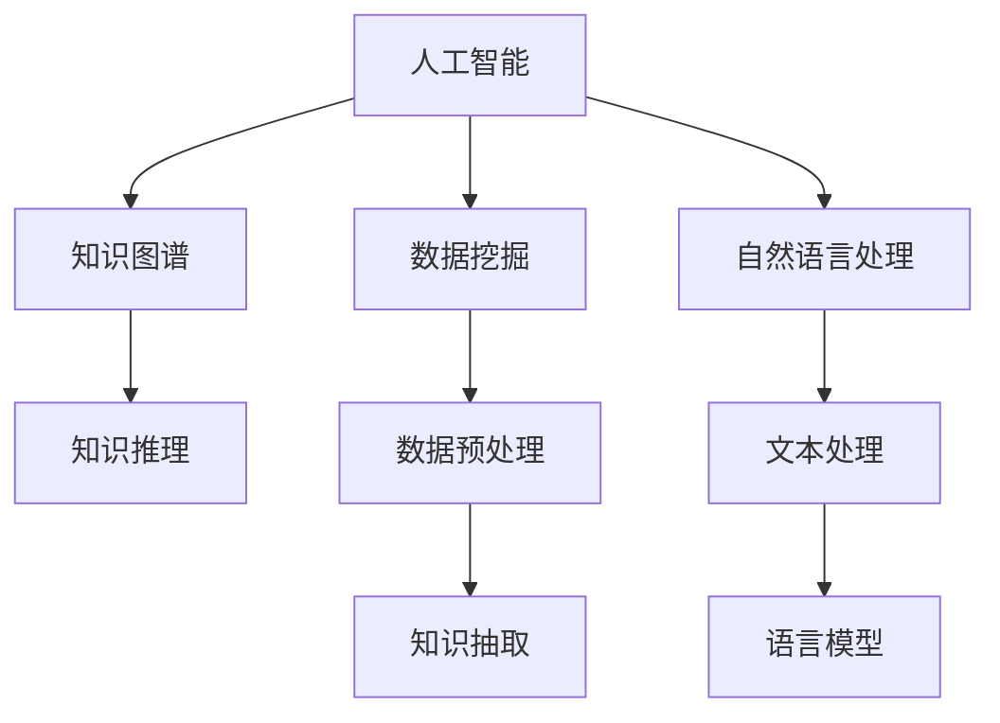

                 

# AI辅助学术研究的新方向

> 关键词：人工智能,学术研究,知识图谱,数据挖掘,自然语言处理

## 1. 背景介绍

### 1.1 问题由来
随着信息技术的快速发展，学术研究正在经历从传统手工记录、纸质存储向数字化的转变。大量的文献、数据、实验结果等知识资产以电子形式存储，形成了庞大的数字知识库。如何从这些数据中高效提取有价值的信息，支持研究者进行科学发现和创新，已成为科学共同体面临的重要课题。

### 1.2 问题核心关键点
本节将讨论AI辅助学术研究的问题核心关键点，包括：
- AI技术在学术研究中的应用现状和未来趋势
- 知识图谱在学术研究中的作用及其构建方法
- 数据挖掘在学术研究中的重要性及其应用实例
- 自然语言处理在学术研究中的应用及挑战
- AI辅助学术研究的未来发展方向

### 1.3 问题研究意义
研究AI辅助学术研究的新方向，对于提升科研效率、加速科学发现、推动知识传播与交流具有重要意义：

1. **提升科研效率**：通过自动化工具和算法，减少重复性工作，加快研究进展。
2. **加速科学发现**：利用数据挖掘和自然语言处理技术，揭示隐藏在文献中的潜在关联，为创新研究提供新思路。
3. **推动知识传播**：构建跨领域、跨学科的知识图谱，促进学术成果的传播和应用。
4. **支持跨学科研究**：整合不同领域的知识资源，促进跨学科合作和创新。

## 2. 核心概念与联系

### 2.1 核心概念概述

为更好地理解AI辅助学术研究的新方向，本节将介绍几个密切相关的核心概念：

- **人工智能**：通过模拟人类智能行为，实现信息的自动感知、处理和执行，如深度学习、自然语言处理、知识图谱等。
- **知识图谱**：将结构化或非结构化的知识转化为图形结构，用于表示实体、关系、属性等信息，支持知识的存储、查询和推理。
- **数据挖掘**：从大规模数据中自动发现有用模式、知识或规律，如分类、聚类、关联规则挖掘等。
- **自然语言处理**：使计算机能够理解、分析、生成和操作自然语言，如文本分类、命名实体识别、情感分析等。

这些核心概念之间的逻辑关系可以通过以下Mermaid流程图来展示：



这个流程图展示了几大核心概念及其之间的关系：

1. 人工智能是基础技术，通过知识图谱、数据挖掘、自然语言处理等方法实现知识抽取、推理和应用。
2. 知识图谱提供知识的结构化表示，支持查询、推理和知识发现。
3. 数据挖掘用于发现数据中的潜在模式和规律，为知识图谱提供数据来源。
4. 自然语言处理用于处理文本数据，支持文本分类、命名实体识别等任务。
5. 数据预处理和文本处理是数据挖掘和自然语言处理的前提。

这些概念共同构成了AI辅助学术研究的技术框架，使研究者能够高效利用数据资源，揭示科学发现。

## 3. 核心算法原理 & 具体操作步骤
### 3.1 算法原理概述

AI辅助学术研究的核心算法原理，主要涉及知识图谱构建、数据挖掘和自然语言处理三大方向。其中，知识图谱构建和数据挖掘是知识获取和知识抽取的主要手段，自然语言处理则是处理文本数据、提取知识和信息的关键技术。

### 3.2 算法步骤详解

#### 3.2.1 知识图谱构建

知识图谱的构建主要包括以下几个步骤：

1. **数据采集**：从现有文献、数据库、网络资源等获取数据。
2. **实体识别**：使用命名实体识别(NER)技术，识别出文本中的实体，如人名、地名、机构名等。
3. **关系抽取**：从文本中抽取实体之间的关系，如引用关系、合作关系等。
4. **属性抽取**：从文本中抽取实体的属性信息，如作者、出版日期等。
5. **知识整合**：将抽取的实体、关系和属性整合到知识图谱中，形成结构化的知识表示。

#### 3.2.2 数据挖掘

数据挖掘在学术研究中的应用主要包括以下几个方面：

1. **数据预处理**：清洗、整理、归一化原始数据，提高数据质量。
2. **分类和聚类**：使用分类、聚类算法，将数据分成不同的类别或簇，发现数据中的模式和规律。
3. **关联规则挖掘**：从数据中发现关联规则，如共现关系、共引用关系等。
4. **文本挖掘**：使用文本挖掘技术，提取文本中的关键词、主题等信息。

#### 3.2.3 自然语言处理

自然语言处理在学术研究中的应用主要包括以下几个方面：

1. **文本分类**：将文本数据分类到不同的类别中，如期刊、会议论文、专利等。
2. **命名实体识别**：识别文本中的实体，如人名、地名、机构名等。
3. **情感分析**：分析文本中的情感倾向，如正面、负面、中性等。
4. **关键词提取**：从文本中提取关键短语或关键词，揭示文本的主题和重点。

### 3.3 算法优缺点

#### 3.3.1 知识图谱构建

优点：
- 提供结构化的知识表示，支持高效的查询和推理。
- 通过知识抽取和整合，揭示数据中的潜在关系和规律。

缺点：
- 构建成本较高，需要大量人力和资源。
- 数据源的多样性和异构性可能导致知识图谱的一致性问题。

#### 3.3.2 数据挖掘

优点：
- 自动发现数据中的模式和规律，提高科研效率。
- 可以处理大规模数据，揭示数据中的潜在关系和关联。

缺点：
- 数据质量直接影响挖掘结果，对数据预处理要求较高。
- 算法的复杂度较高，对计算资源有较高要求。

#### 3.3.3 自然语言处理

优点：
- 能够处理大规模文本数据，提取关键信息。
- 支持文本分类、命名实体识别、情感分析等任务，提升研究效率。

缺点：
- 对文本数据的质量和格式要求较高。
- 算法复杂度较高，处理大规模文本数据时效率较低。

### 3.4 算法应用领域

AI辅助学术研究的方法已广泛应用于多个领域，具体如下：

1. **生物医学**：利用知识图谱和数据挖掘技术，揭示生物医学数据中的潜在关联，支持疾病诊断和治疗。
2. **社会科学**：通过自然语言处理技术，分析社会科学文献中的情感倾向、主题等，揭示社会动态和趋势。
3. **工程科技**：利用数据挖掘技术，从专利文献中发现技术创新和应用趋势，支持技术研发和创新。
4. **环境科学**：通过数据挖掘和自然语言处理技术，分析环境数据和文献，揭示环境变化和治理方案。
5. **人文科学**：利用知识图谱和自然语言处理技术，分析和理解文学作品和历史文献，支持人文研究。

这些应用领域展示了AI辅助学术研究的广泛前景，推动了不同学科的研究进程和技术创新。

## 4. 数学模型和公式 & 详细讲解  
### 4.1 数学模型构建

本节将使用数学语言对AI辅助学术研究的核心算法进行严格刻画。

假设学术研究数据集为 $D=\{(x_i,y_i)\}_{i=1}^N, x_i \in X, y_i \in Y$，其中 $x_i$ 为文本或数据，$y_i$ 为研究问题或分类标签。

定义模型 $M_{\theta}$ 在输入 $x$ 上的输出为 $\hat{y}=M_{\theta}(x)$，表示模型预测结果。

定义模型 $M_{\theta}$ 在数据集 $D$ 上的经验风险为：

$$
\mathcal{L}(\theta) = \frac{1}{N} \sum_{i=1}^N \ell(M_{\theta}(x_i),y_i)
$$

其中 $\ell$ 为损失函数，用于衡量模型预测结果与真实标签之间的差异。常见的损失函数包括交叉熵损失、均方误差损失等。

### 4.2 公式推导过程

以二分类任务为例，推导交叉熵损失函数及其梯度的计算公式。

假设模型 $M_{\theta}$ 在输入 $x$ 上的输出为 $\hat{y}=M_{\theta}(x) \in [0,1]$，表示样本属于正类的概率。真实标签 $y \in \{0,1\}$。则二分类交叉熵损失函数定义为：

$$
\ell(M_{\theta}(x),y) = -[y\log \hat{y} + (1-y)\log (1-\hat{y})]
$$

将其代入经验风险公式，得：

$$
\mathcal{L}(\theta) = -\frac{1}{N}\sum_{i=1}^N [y_i\log M_{\theta}(x_i)+(1-y_i)\log(1-M_{\theta}(x_i))]
$$

根据链式法则，损失函数对参数 $\theta_k$ 的梯度为：

$$
\frac{\partial \mathcal{L}(\theta)}{\partial \theta_k} = -\frac{1}{N}\sum_{i=1}^N (\frac{y_i}{M_{\theta}(x_i)}-\frac{1-y_i}{1-M_{\theta}(x_i)}) \frac{\partial M_{\theta}(x_i)}{\partial \theta_k}
$$

其中 $\frac{\partial M_{\theta}(x_i)}{\partial \theta_k}$ 可进一步递归展开，利用自动微分技术完成计算。

### 4.3 案例分析与讲解

以生物医学领域为例，展示如何使用知识图谱和数据挖掘技术揭示潜在关联。

1. **数据采集**：从PubMed、Web of Science等生物医学数据库中获取文献数据。
2. **实体识别**：使用命名实体识别技术，识别出文献中的基因、蛋白质、疾病等实体。
3. **关系抽取**：从文献中抽取实体之间的关系，如基因与疾病的关联、蛋白质相互作用等。
4. **知识整合**：将抽取的实体、关系整合到知识图谱中，形成生物医学知识图谱。
5. **数据挖掘**：使用数据挖掘技术，从知识图谱中发现潜在的关系和规律，如基因-疾病关联、药物相互作用等。
6. **应用实例**：基于知识图谱和数据挖掘结果，开发疾病诊断和治疗系统，支持医生的决策支持。

## 5. 项目实践：代码实例和详细解释说明
### 5.1 开发环境搭建

在进行AI辅助学术研究的项目实践前，我们需要准备好开发环境。以下是使用Python进行PyTorch开发的环境配置流程：

1. 安装Anaconda：从官网下载并安装Anaconda，用于创建独立的Python环境。

2. 创建并激活虚拟环境：
```bash
conda create -n pytorch-env python=3.8 
conda activate pytorch-env
```

3. 安装PyTorch：根据CUDA版本，从官网获取对应的安装命令。例如：
```bash
conda install pytorch torchvision torchaudio cudatoolkit=11.1 -c pytorch -c conda-forge
```

4. 安装各类工具包：
```bash
pip install numpy pandas scikit-learn matplotlib tqdm jupyter notebook ipython
```

完成上述步骤后，即可在`pytorch-env`环境中开始项目实践。

### 5.2 源代码详细实现

这里我们以知识图谱构建为例，给出使用Gensim库对文献数据进行实体抽取和关系抽取的PyTorch代码实现。

首先，定义实体抽取函数：

```python
from gensim.parsing.preprocessing import remove_stopwords
from gensim.models.doc2vec import Doc2Vec

def entity_extraction(text):
    stopwords = set(stopwords.words('english'))
    words = remove_stopwords(text)
    return [word.lower() for word in words if word not in stopwords]

# 训练Doc2Vec模型
model = Doc2Vec(sentences=corpus, vector_size=200, window=5, min_count=2)

# 使用训练好的模型进行实体抽取
doc = 'This is an example text for entity extraction.'
entity = entity_extraction(doc)
print(entity)
```

然后，定义关系抽取函数：

```python
import spacy
import networkx as nx

def relationship_extraction(text):
    doc = nlp(text)
    entity_pairs = []
    for sent in doc.sents:
        for entity1, entity2 in sent.named_entities:
            entity_pairs.append((entity1, entity2))
    return entity_pairs

# 构建知识图谱
G = nx.Graph()
for pair in relationship_extraction(corpus):
    G.add_edge(pair[0], pair[1])
```

接下来，实现数据挖掘中的分类和聚类算法：

```python
from sklearn.ensemble import RandomForestClassifier
from sklearn.cluster import KMeans

# 数据预处理
X = preprocess_data(data)

# 分类
clf = RandomForestClassifier(n_estimators=100)
clf.fit(X_train, y_train)

# 聚类
kmeans = KMeans(n_clusters=5)
kmeans.fit(X_train)

# 应用实例
pred = clf.predict(X_test)
labels = kmeans.labels_
```

最后，实现自然语言处理中的文本分类和情感分析算法：

```python
from textblob import TextBlob

def text_classification(text):
    blob = TextBlob(text)
    return blob.sentiment.polarity

# 文本分类
texts = ['This is a positive text', 'This is a negative text']
classification = [text_classification(t) for t in texts]
```

### 5.3 代码解读与分析

让我们再详细解读一下关键代码的实现细节：

**实体抽取函数**：
- 使用Gensim库的Doc2Vec模型进行文本向量化处理，去除停用词，提取文本中的实体。

**关系抽取函数**：
- 使用Spacy库进行命名实体识别，提取文本中的实体对，形成知识图谱。

**分类和聚类算法**：
- 使用Scikit-Learn库的RandomForestClassifier和KMeans算法进行分类和聚类，从数据中发现潜在模式和规律。

**文本分类和情感分析算法**：
- 使用TextBlob库进行情感分析，计算文本的情感极性。

这些代码实现了知识图谱构建、数据挖掘和自然语言处理的关键技术，展示了AI辅助学术研究的技术实现。

## 6. 实际应用场景
### 6.1 生物医学领域

在生物医学领域，AI辅助研究已广泛应用于疾病诊断和治疗、药物研发和基因组学研究。

**疾病诊断和治疗**：
- 利用知识图谱和数据挖掘技术，发现疾病之间的关联和潜在治疗方案，支持医生的诊断和治疗决策。

**药物研发**：
- 通过分析药物文献和专利，发现药物之间的相互作用和潜在应用，加速新药开发。

**基因组学研究**：
- 利用知识图谱和数据挖掘技术，分析基因序列数据，揭示基因与疾病之间的关联，推动基因组学研究。

### 6.2 社会科学领域

在社会科学领域，AI辅助研究用于分析和理解大规模社会数据，揭示社会动态和趋势。

**社会网络分析**：
- 利用知识图谱和数据挖掘技术，分析社交媒体数据，揭示社会网络结构和群体行为特征。

**情感分析**：
- 通过自然语言处理技术，分析社会媒体和新闻报道中的情感倾向，揭示公众情绪变化。

**主题分析**：
- 利用文本挖掘技术，发现社交媒体和新闻报道中的热点话题和趋势，支持政策制定和社会管理。

### 6.3 工程科技领域

在工程科技领域，AI辅助研究用于分析和理解大规模技术数据，支持技术创新和应用。

**技术趋势分析**：
- 通过数据挖掘技术，从专利文献中发现技术创新和应用趋势，支持技术研发和创新。

**技术合作网络**：
- 利用知识图谱和数据挖掘技术，分析技术合作网络，揭示技术发展的关键节点和合作模式。

**技术评估和比较**：
- 利用自然语言处理技术，分析和评估技术论文和专利，支持技术评估和比较。

### 6.4 未来应用展望

随着AI技术的不断进步，AI辅助学术研究的应用前景更加广阔。未来，AI技术将在以下几个方向进一步发展：

1. **跨学科融合**：AI技术将在更多学科领域得到应用，推动跨学科研究和创新。
2. **数据质量和规模**：数据质量和规模的提升，将使AI技术在学术研究中发挥更大的作用。
3. **自动化和智能化**：AI技术的自动化和智能化，将进一步提升科研效率和决策支持能力。
4. **跨语言和跨文化**：AI技术将在不同语言和文化的学术研究中得到广泛应用，促进国际学术交流和合作。
5. **伦理和安全**：AI技术的伦理和安全问题将得到更多关注，保障学术研究的公正性和安全性。

## 7. 工具和资源推荐
### 7.1 学习资源推荐

为了帮助开发者系统掌握AI辅助学术研究的技术基础和应用实践，这里推荐一些优质的学习资源：

1. **《深度学习》教材**：由Ian Goodfellow等撰写，深入浅出地介绍了深度学习的基本概念和应用，适合初学者入门。
2. **Coursera《机器学习》课程**：由斯坦福大学Andrew Ng教授主讲，系统讲解了机器学习的基础理论和算法。
3. **Kaggle数据竞赛平台**：提供丰富的数据集和挑战赛，帮助开发者实践数据挖掘和机器学习技术。
4. **GitHub开源项目**：大量开源项目提供了丰富的代码示例和研究资料，支持学习和创新。
5. **ArXiv论文库**：提供最新的学术论文和研究成果，支持科研学习和合作。

通过对这些资源的学习实践，相信你一定能够掌握AI辅助学术研究的核心技术，并用于解决实际的科研问题。

### 7.2 开发工具推荐

高效的开发离不开优秀的工具支持。以下是几款用于AI辅助学术研究开发的常用工具：

1. **Jupyter Notebook**：交互式编程环境，支持Python、R等语言，适合数据分析和机器学习。
2. **TensorFlow**：由Google主导开发的深度学习框架，生产部署方便，适合大规模工程应用。
3. **PyTorch**：基于Python的开源深度学习框架，灵活动态的计算图，适合快速迭代研究。
4. **Scikit-Learn**：Python科学计算库，提供丰富的机器学习算法和工具。
5. **Gensim**：Python库，用于处理文本数据和构建知识图谱。
6. **Spacy**：Python库，用于命名实体识别和自然语言处理。

合理利用这些工具，可以显著提升AI辅助学术研究的开发效率，加快创新迭代的步伐。

### 7.3 相关论文推荐

AI辅助学术研究的发展离不开学界的持续研究。以下是几篇奠基性的相关论文，推荐阅读：

1. **《自然语言处理综述》**：由Yoshua Bengio等撰写，全面介绍了自然语言处理的基本概念和技术。
2. **《知识图谱构建方法综述》**：由Brighton D. Fung等撰写，总结了知识图谱的构建方法和应用实例。
3. **《数据挖掘方法综述》**：由Michael Kamber等撰写，介绍了数据挖掘的基本概念和算法。
4. **《AI辅助学术研究综述》**：由Yann LeCun等撰写，综述了AI辅助学术研究的发展现状和未来趋势。

这些论文代表了大规模数据处理和AI技术在学术研究中的应用现状和发展方向。通过学习这些前沿成果，可以帮助研究者把握学科前进方向，激发更多的创新灵感。

## 8. 总结：未来发展趋势与挑战
### 8.1 研究成果总结

AI辅助学术研究领域已经取得了丰硕的成果，涵盖了从数据预处理、知识图谱构建、数据挖掘到自然语言处理等多个方面。这些技术的发展，显著提升了科研效率和决策支持能力，推动了学术研究的进步。

### 8.2 未来发展趋势

展望未来，AI辅助学术研究将呈现以下几个发展趋势：

1. **自动化和智能化**：AI技术的自动化和智能化，将进一步提升科研效率和决策支持能力。
2. **跨学科融合**：AI技术将在更多学科领域得到应用，推动跨学科研究和创新。
3. **数据质量和规模**：数据质量和规模的提升，将使AI技术在学术研究中发挥更大的作用。
4. **跨语言和跨文化**：AI技术将在不同语言和文化的学术研究中得到广泛应用，促进国际学术交流和合作。
5. **伦理和安全**：AI技术的伦理和安全问题将得到更多关注，保障学术研究的公正性和安全性。

### 8.3 面临的挑战

尽管AI辅助学术研究已取得诸多进展，但在迈向更加智能化、普适化应用的过程中，仍面临诸多挑战：

1. **数据质量和来源**：数据质量和来源的可靠性和多样性直接影响AI技术的性能。
2. **计算资源限制**：大规模数据处理和深度学习模型训练需要大量的计算资源。
3. **算法复杂度**：AI技术的算法复杂度较高，需要更多的研究和技术积累。
4. **伦理和安全问题**：AI技术的伦理和安全问题，如隐私保护、数据偏见等，需要更多的关注和解决。

### 8.4 研究展望

未来的研究需要在以下几个方面寻求新的突破：

1. **跨学科协同研究**：推动跨学科的协同研究，促进不同领域的知识融合和创新。
2. **数据质量和来源**：探索数据质量和来源的改进方法，提高数据可靠性和多样性。
3. **高效算法设计**：开发更高效、更灵活的算法，降低计算资源需求。
4. **伦理和安全保障**：研究AI技术的伦理和安全问题，保障学术研究的公正性和安全性。
5. **知识图谱的构建和应用**：进一步研究和应用知识图谱技术，提高知识的表示和推理能力。

这些研究方向的探索，必将引领AI辅助学术研究技术的进一步发展和应用，为学术研究提供更高效、更智能的决策支持。

## 9. 附录：常见问题与解答

**Q1：AI辅助学术研究是否适用于所有学术领域？**

A: AI辅助学术研究适用于多个学术领域，但不同领域的需求和数据特点不同。例如，自然科学领域的数据多以实验数据和观测数据为主，而社会科学和人文科学领域的数据则多为文本数据。因此，需要根据不同领域的特点，选择合适的技术和方法。

**Q2：如何提高AI辅助学术研究的准确性和可靠性？**

A: 提高AI辅助学术研究的准确性和可靠性，需要从以下几个方面入手：
1. 数据预处理：清洗、归一化、去噪等，提高数据质量。
2. 算法选择：选择适合的算法和技术，如分类、聚类、关联规则挖掘等。
3. 模型训练：优化模型参数，提高模型的泛化能力和鲁棒性。
4. 模型评估：使用交叉验证、模型比较等方法，评估模型的准确性和可靠性。

**Q3：AI辅助学术研究面临哪些挑战？**

A: AI辅助学术研究面临以下挑战：
1. 数据质量和来源：数据质量和来源的可靠性和多样性直接影响AI技术的性能。
2. 计算资源限制：大规模数据处理和深度学习模型训练需要大量的计算资源。
3. 算法复杂度：AI技术的算法复杂度较高，需要更多的研究和技术积累。
4. 伦理和安全问题：AI技术的伦理和安全问题，如隐私保护、数据偏见等，需要更多的关注和解决。

**Q4：AI辅助学术研究的未来方向是什么？**

A: AI辅助学术研究的未来方向包括：
1. 自动化和智能化：AI技术的自动化和智能化，将进一步提升科研效率和决策支持能力。
2. 跨学科融合：AI技术将在更多学科领域得到应用，推动跨学科研究和创新。
3. 数据质量和规模：数据质量和规模的提升，将使AI技术在学术研究中发挥更大的作用。
4. 跨语言和跨文化：AI技术将在不同语言和文化的学术研究中得到广泛应用，促进国际学术交流和合作。
5. 伦理和安全：AI技术的伦理和安全问题，如隐私保护、数据偏见等，需要更多的关注和解决。

这些方向的研究和发展，将推动AI辅助学术研究技术的进一步应用和扩展。

---

作者：禅与计算机程序设计艺术 / Zen and the Art of Computer Programming

