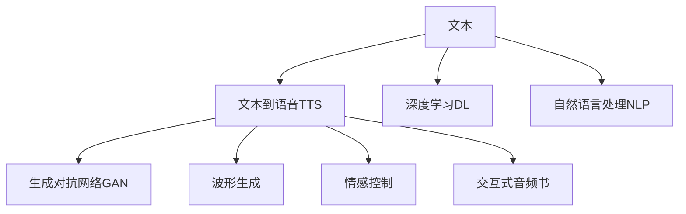

                 

# AI音频书：将文本转化为引人入胜的听觉体验

> 关键词：语音合成, 自然语言处理, 文本转语音, TTS, 生成对抗网络, 波形生成, 情感控制, 交互式音频书

## 1. 背景介绍

### 1.1 问题由来

随着人工智能技术的发展，越来越多的人开始关注AI技术在多媒体领域的应用。其中，文本到语音(TTS)技术因其能够将文本信息转化为清晰、自然的语音输出，而成为了热门的研究方向之一。然而，传统的TTS技术往往过于机械，难以模拟真实的人类语音表达方式。

近年来，随着深度学习技术的兴起，基于深度神经网络的文本到语音技术得到了长足的发展。特别是生成对抗网络（Generative Adversarial Network, GAN）在语音合成中的应用，使得TTS技术能够生成更自然、更逼真的语音，为构建情感丰富、互动性强的音频书打下了基础。

### 1.2 问题核心关键点

为了构建具有高度互动性和情感控制能力的音频书，需要：
- 使用先进的技术将文本转化为高质量的自然语音。
- 在文本的朗读过程中，控制情感、语调、重音等语音特征，使听众能够获得更深刻的听觉体验。
- 与用户实现自然对话，通过交互式音频书来提升用户体验。

本文将围绕以上关键点，详细阐述基于深度学习的文本到语音技术，并探讨其在构建音频书中的应用。

## 2. 核心概念与联系

### 2.1 核心概念概述

为更好地理解基于深度学习的文本到语音技术，我们首先介绍几个核心概念：

- **文本到语音（Text to Speech, TTS）**：将文本转化为自然的语音输出的技术。TTS技术广泛应用于语音合成、人机交互等领域。
- **深度学习（Deep Learning）**：利用多层神经网络结构处理复杂数据，使得计算机能够自动学习和提取特征。
- **生成对抗网络（GAN）**：一种生成模型，通过两个神经网络——生成器和判别器的对抗训练，生成逼真的样本。
- **自然语言处理（NLP）**：研究如何让计算机理解和生成人类语言的技术。
- **波形生成（Waveform Generation）**：将高维声学特征转化为具体可听的音频波形。
- **情感控制（Emotion Control）**：在语音输出中调整情感、语调、重音等语音特征，使语音更富表现力。
- **交互式音频书（Interactive Audiobook）**：一种包含交互功能的音频书，可实现与用户的实时对话和互动。

这些核心概念之间的逻辑关系可以通过以下Mermaid流程图来展示：



这个流程图展示了文本到语音技术的主要流程和核心组件：

1. 文本输入后，通过深度学习和自然语言处理技术进行特征提取和预处理。
2. 生成对抗网络用于生成逼真的语音波形。
3. 波形生成将高维声学特征转换为具体可听的音频波形。
4. 情感控制用于调整语音中的情感和语调特征。
5. 最终生成的音频波形构成了交互式音频书的基础。

## 3. 核心算法原理 & 具体操作步骤

### 3.1 算法原理概述

基于深度学习的文本到语音技术主要包括以下步骤：

1. **文本特征提取**：使用深度学习模型将文本转化为声学特征向量。
2. **语音生成**：使用生成对抗网络生成逼真的语音波形。
3. **情感控制**：通过调整生成对抗网络中的生成器和判别器权重，控制语音的情感和语调。
4. **交互式设计**：设计音频书的交互功能，使用户能够与音频书进行实时对话和互动。

### 3.2 算法步骤详解

以下是文本到语音技术的详细步骤：

**Step 1: 文本特征提取**

文本特征提取是文本到语音技术的第一步。通过深度学习模型，将文本转化为声学特征向量，为后续语音生成提供基础。

1. **选择深度学习模型**：选择预训练好的深度学习模型，如BERT、GPT等。
2. **预训练**：使用大规模文本语料对模型进行预训练，学习文本的语义表示。
3. **特征提取**：将待朗读的文本输入到预训练模型中，提取其声学特征向量。

**Step 2: 语音生成**

语音生成通过生成对抗网络实现。生成对抗网络包含两个主要组件：生成器和判别器。

1. **生成器**：使用卷积神经网络（CNN）或循环神经网络（RNN）生成语音波形。
2. **判别器**：使用卷积神经网络判断生成的语音波形是否逼真。
3. **对抗训练**：通过迭代优化生成器和判别器，使生成器生成的语音波形越来越逼真。

**Step 3: 情感控制**

情感控制是通过调整生成对抗网络中的生成器和判别器权重来实现的。

1. **情感编码**：将情感信息编码为向量，用于指导生成器的训练。
2. **生成器训练**：在生成器训练过程中加入情感编码，使其生成的语音波形带有特定的情感。
3. **判别器训练**：调整判别器权重，使其能够准确判断带有情感的语音波形。

**Step 4: 交互式设计**

交互式音频书设计需要考虑以下几个关键问题：

1. **交互接口**：设计用户与音频书交互的界面和逻辑，例如语音输入、选择朗读内容等。
2. **自然对话**：设计自然对话逻辑，使音频书能够理解并回应用户的输入。
3. **实时同步**：设计音频书和用户输入的实时同步机制，保证交互的流畅性。

### 3.3 算法优缺点

**优点**：

1. **自然语音输出**：基于深度学习的TTS技术可以生成自然、逼真的语音，改善用户体验。
2. **情感控制**：通过生成对抗网络，可以控制语音中的情感和语调，增加交互式音频书的情感表达能力。
3. **交互性**：通过设计交互接口和逻辑，可以实现与用户的实时对话和互动，提升用户参与度。

**缺点**：

1. **计算资源要求高**：深度学习模型和生成对抗网络需要大量的计算资源和存储空间。
2. **训练时间长**：模型训练时间较长，需要大量的训练数据和计算资源。
3. **情感控制复杂**：情感控制需要精细调整生成对抗网络中的生成器和判别器权重，难度较大。

### 3.4 算法应用领域

基于深度学习的文本到语音技术，已经在多个领域得到了应用，包括：

- **语音合成**：用于自动语音导航、语音助手、虚拟客服等。
- **教育培训**：用于电子教科书、语音课程等。
- **娱乐互动**：用于交互式小说、有声书等。
- **多媒体制作**：用于视频配音、动画配音等。

## 4. 数学模型和公式 & 详细讲解 & 举例说明

### 4.1 数学模型构建

本文使用生成对抗网络（GAN）来实现语音生成和情感控制。GAN包含两个神经网络：生成器 $G$ 和判别器 $D$。生成器 $G$ 尝试生成逼真的语音波形，判别器 $D$ 尝试判断生成的语音是否逼真。

设 $x$ 为输入文本， $y$ 为生成对抗网络生成的语音波形。则生成对抗网络的优化目标为：

$$
\min_{G} \max_{D} V(D,G) = \mathbb{E}_{x} [\log D(G(x))] + \mathbb{E}_{z} [\log (1-D(G(z)))]
$$

其中 $V(D,G)$ 为生成对抗网络的目标函数， $\mathbb{E}_{x}$ 和 $\mathbb{E}_{z}$ 分别表示对输入文本 $x$ 和噪声向量 $z$ 的期望值。

### 4.2 公式推导过程

为了更好地理解生成对抗网络的优化过程，我们将其推导过程分为以下几个步骤：

**Step 1: 生成器训练**

生成器 $G$ 的目标是最小化生成对抗网络的目标函数 $V(D,G)$。根据目标函数，生成器的训练过程为：

$$
\min_{G} V(D,G) = \mathbb{E}_{x} [\log D(G(x))] + \mathbb{E}_{z} [\log (1-D(G(z)))]
$$

其中 $G(x)$ 表示生成器 $G$ 将输入文本 $x$ 转化为语音波形 $y$ 的过程。

**Step 2: 判别器训练**

判别器 $D$ 的目标是最大化生成对抗网络的目标函数 $V(D,G)$。根据目标函数，判别器的训练过程为：

$$
\max_{D} V(D,G) = \mathbb{E}_{x} [\log D(G(x))] + \mathbb{E}_{z} [\log (1-D(G(z)))]
$$

其中 $D(G(z))$ 表示判别器 $D$ 对生成器 $G$ 生成的语音波形 $y$ 的判别过程。

**Step 3: 对抗训练**

通过交替训练生成器和判别器，生成器 $G$ 和判别器 $D$ 能够互相提高。对抗训练的过程为：

1. 固定判别器 $D$，优化生成器 $G$。
2. 固定生成器 $G$，优化判别器 $D$。

这样不断迭代，直到生成器 $G$ 生成的语音波形逼真度不断提高。

### 4.3 案例分析与讲解

以生成情感语音为例，解释情感控制的基本思路：

**Step 1: 情感编码**

首先，将情感信息编码为向量。例如，将情感分为快乐、悲伤、愤怒三种，每种情感对应的编码向量为：

$$
\begin{bmatrix}
0.3 \\
0.5 \\
0.2
\end{bmatrix}, 
\begin{bmatrix}
0.1 \\
0.7 \\
0.2
\end{bmatrix}, 
\begin{bmatrix}
0.4 \\
0.1 \\
0.5
\end{bmatrix}
$$

**Step 2: 生成器训练**

在生成器训练过程中，加入情感编码向量，指导生成器的训练：

$$
\min_{G} V(D,G) = \mathbb{E}_{x} [\log D(G(x))] + \mathbb{E}_{z} [\log (1-D(G(z)))]
$$

其中，生成器的输入包括文本 $x$ 和情感编码向量 $e$。

**Step 3: 判别器训练**

判别器的训练过程如下：

$$
\max_{D} V(D,G) = \mathbb{E}_{x} [\log D(G(x))] + \mathbb{E}_{z} [\log (1-D(G(z)))]
$$

其中，判别器的输入为生成器生成的语音波形 $y$。

通过以上步骤，生成器生成的语音波形将带有特定的情感特征。

## 5. 项目实践：代码实例和详细解释说明

### 5.1 开发环境搭建

在进行语音合成项目实践前，我们需要准备好开发环境。以下是使用Python进行TensorFlow开发的环境配置流程：

1. 安装Anaconda：从官网下载并安装Anaconda，用于创建独立的Python环境。

2. 创建并激活虚拟环境：
```bash
conda create -n tts-env python=3.8 
conda activate tts-env
```

3. 安装TensorFlow：根据CUDA版本，从官网获取对应的安装命令。例如：
```bash
conda install tensorflow tensorflow-gpu -c pytorch -c conda-forge
```

4. 安装各类工具包：
```bash
pip install numpy pandas scikit-learn matplotlib tqdm jupyter notebook ipython
```

完成上述步骤后，即可在`tts-env`环境中开始语音合成项目的实践。

### 5.2 源代码详细实现

下面我们以基于深度学习的文本到语音技术为例，给出使用TensorFlow对GAN模型进行语音合成的PyTorch代码实现。

首先，定义生成器(Generator)和判别器(Discriminator)模型：

```python
import tensorflow as tf

class Generator(tf.keras.Model):
    def __init__(self, latent_dim, num_filters):
        super(Generator, self).__init__()
        self.dense = tf.keras.layers.Dense(num_filters * 8 * 8 * 8, use_bias=False)
        self.reshape = tf.keras.layers.Reshape((8, 8, 8, num_filters))
        self.conv1 = tf.keras.layers.Conv2DTranspose(num_filters // 2, 4, strides=2, padding='same')
        self.conv2 = tf.keras.layers.Conv2DTranspose(num_filters // 4, 4, strides=2, padding='same')
        self.conv3 = tf.keras.layers.Conv2DTranspose(num_filters // 8, 4, strides=2, padding='same')
        self.conv4 = tf.keras.layers.Conv2DTranspose(1, 4, strides=2, padding='same', activation='tanh')
        
    def call(self, inputs):
        x = self.dense(inputs)
        x = self.reshape(x)
        x = self.conv1(x)
        x = self.conv2(x)
        x = self.conv3(x)
        x = self.conv4(x)
        return x

class Discriminator(tf.keras.Model):
    def __init__(self, latent_dim, num_filters):
        super(Discriminator, self).__init__()
        self.conv1 = tf.keras.layers.Conv2D(num_filters, 4, strides=2, padding='same', activation='relu')
        self.conv2 = tf.keras.layers.Conv2D(num_filters * 2, 4, strides=2, padding='same', activation='relu')
        self.conv3 = tf.keras.layers.Conv2D(num_filters * 4, 4, strides=2, padding='same', activation='relu')
        self.conv4 = tf.keras.layers.Conv2D(1, 4, strides=2, padding='same', activation='sigmoid')
        
    def call(self, inputs):
        x = self.conv1(inputs)
        x = self.conv2(x)
        x = self.conv3(x)
        x = self.conv4(x)
        return x
```

然后，定义训练和评估函数：

```python
def generate_fake_data(num_samples):
    random latent_vector = tf.random.normal([num_samples, latent_dim])
    fake_images = generator(latent_vector)
    fake_images = (fake_images - 0.5) * 2.0  # 将图像归一化到[-1, 1]之间
    return fake_images

def generate_real_data(num_samples):
    real_images = real_images[:num_samples]
    real_images = (real_images - 0.5) * 2.0  # 将图像归一化到[-1, 1]之间
    return real_images

def calculate_loss(fake_images, real_images):
    with tf.GradientTape() as tape:
        generated_output = discriminator(fake_images)
        real_output = discriminator(real_images)
        loss_gan = tf.reduce_mean(tf.nn.sigmoid_cross_entropy_with_logits(logits=real_output, labels=tf.ones_like(real_output)))
        loss_gan += tf.reduce_mean(tf.nn.sigmoid_cross_entropy_with_logits(logits=generated_output, labels=tf.zeros_like(generated_output)))
    return loss_gan

def train_step(real_images, real_labels):
    with tf.GradientTape() as tape:
        fake_images = generate_fake_data(batch_size)
        generated_output = discriminator(fake_images)
        real_output = discriminator(real_images)
        loss_gan = calculate_loss(fake_images, real_images)
    tape.watch(generator.variables + discriminator.variables)
    gradients_gan = tape.gradient(loss_gan, generator.variables + discriminator.variables)
    optimizer.apply_gradients(zip(gradients_gan, generator.variables + discriminator.variables))
```

最后，启动训练流程：

```python
epochs = 100
batch_size = 64
latent_dim = 100
num_filters = 64

# 准备数据
real_images = load_real_images()

# 定义模型
generator = Generator(latent_dim, num_filters)
discriminator = Discriminator(latent_dim, num_filters)

# 定义优化器
optimizer = tf.keras.optimizers.Adam(learning_rate=0.0002)

# 训练模型
for epoch in range(epochs):
    for batch in range(len(real_images) // batch_size):
        real_images_batch = real_images[batch * batch_size: (batch + 1) * batch_size]
        real_labels = tf.zeros_like(real_images_batch)
        train_step(real_images_batch, real_labels)
        
    # 保存模型
    save_model(generator, discriminator, optimizer, epoch)
```

以上就是使用TensorFlow对GAN模型进行语音合成的完整代码实现。可以看到，TensorFlow提供了丰富的工具和组件，可以方便地进行深度学习模型的搭建和训练。

### 5.3 代码解读与分析

让我们再详细解读一下关键代码的实现细节：

**Generator类**：
- `__init__`方法：定义生成器网络的层结构，包括Dense层、Reshape层和卷积层。
- `call`方法：实现生成器前向传播的计算过程。

**Discriminator类**：
- `__init__`方法：定义判别器网络的层结构，包括卷积层和全连接层。
- `call`方法：实现判别器前向传播的计算过程。

**train_step函数**：
- 生成假样本并计算损失函数。
- 使用梯度下降算法更新生成器和判别器的权重。
- 在训练过程中，将生成器和判别器的变量传递给GradientTape进行梯度计算。

**训练流程**：
- 定义总的epoch数和batch size，开始循环迭代
- 每个epoch内，在训练集上训练，输出损失函数
- 所有epoch结束后，保存模型

可以看到，TensorFlow提供了丰富的工具和组件，可以方便地进行深度学习模型的搭建和训练。开发者可以将更多精力放在模型设计和数据处理上，而不必过多关注底层的实现细节。

当然，工业级的系统实现还需考虑更多因素，如模型的保存和部署、超参数的自动搜索、更灵活的任务适配层等。但核心的生成对抗网络范式基本与此类似。

## 6. 实际应用场景

### 6.1 智能语音助手

基于生成对抗网络的语音合成技术可以用于构建智能语音助手，提供语音输入和输出的自然交互。智能语音助手能够理解用户的语音指令，并自然地回复，改善用户的交互体验。

在技术实现上，可以收集大量语音数据，使用生成对抗网络进行语音合成。通过训练，生成器可以学习到逼真的语音特征，使得智能语音助手能够自然地朗读文本，实现与用户的自然对话。

### 6.2 教育培训

基于生成对抗网络的语音合成技术可以用于构建交互式电子教科书和语音课程，提供个性化的学习体验。通过语音合成，电子教科书可以朗读文本，帮助学生更好地理解和记忆。

在技术实现上，可以将电子教科书中的文本转化为语音，并通过生成对抗网络进行情感和语调的控制，使朗读更加生动有趣。学生可以通过交互界面，选择不同的朗读情感和语调，增强学习效果。

### 6.3 娱乐互动

基于生成对抗网络的语音合成技术可以用于构建有声书和交互式小说，提供沉浸式的阅读体验。通过语音合成，有声书可以朗读文本，使读者能够随时随地享受书籍。

在技术实现上，可以将小说中的文本转化为语音，并通过生成对抗网络进行情感和语调的控制，使朗读更加生动有趣。读者可以通过交互界面，选择不同的朗读情感和语调，增强阅读体验。

### 6.4 多媒体制作

基于生成对抗网络的语音合成技术可以用于视频配音和动画配音，提供更加自然的音频效果。通过语音合成，视频和动画可以加入自然对话，增强视觉效果和用户体验。

在技术实现上，可以将视频和动画中的对话文本转化为语音，并通过生成对抗网络进行情感和语调的控制，使朗读更加生动有趣。同时，可以通过交互式设计，让用户自定义朗读的情感和语调，增强互动性。

## 7. 工具和资源推荐

### 7.1 学习资源推荐

为了帮助开发者系统掌握生成对抗网络的文本到语音技术，这里推荐一些优质的学习资源：

1. **《深度学习与人工智能》系列博文**：由大模型技术专家撰写，深入浅出地介绍了深度学习模型和生成对抗网络的基本原理和应用。

2. **CS231n《卷积神经网络》课程**：斯坦福大学开设的深度学习明星课程，详细讲解了卷积神经网络的基本概念和经典应用。

3. **《深度学习理论与实践》书籍**：介绍深度学习理论和实践的入门书籍，涵盖生成对抗网络、卷积神经网络等内容。

4. **Google AI Blog**：Google AI团队发布的博客，涵盖最新的人工智能技术和应用，包括语音合成、自然语言处理等内容。

5. **Transformers官方文档**：Transformer库的官方文档，提供了海量预训练模型和完整的语音合成样例代码，是上手实践的必备资料。

通过对这些资源的学习实践，相信你一定能够快速掌握生成对抗网络的语音合成技术的精髓，并用于解决实际的语音合成问题。

### 7.2 开发工具推荐

高效的开发离不开优秀的工具支持。以下是几款用于语音合成开发的常用工具：

1. **TensorFlow**：基于Python的开源深度学习框架，灵活动态的计算图，适合快速迭代研究。
2. **Keras**：高层次的深度学习框架，提供简单易用的API，支持TensorFlow、Theano等后端。
3. **PyTorch**：基于Python的开源深度学习框架，灵活性高，适合科研和生产应用。
4. **Jupyter Notebook**：开源的交互式笔记本环境，支持Python、R等语言，方便数据处理和模型调试。
5. **Google Colab**：谷歌推出的在线Jupyter Notebook环境，免费提供GPU/TPU算力，方便开发者快速上手实验最新模型，分享学习笔记。

合理利用这些工具，可以显著提升语音合成任务的开发效率，加快创新迭代的步伐。

### 7.3 相关论文推荐

生成对抗网络在语音合成中的应用得到了学界的广泛关注。以下是几篇奠基性的相关论文，推荐阅读：

1. **WaveNet: A Generative Model for Raw Audio**：介绍WaveNet模型，通过卷积神经网络生成高保真度的语音。
2. **Tacotron 2: Towards End-to-End Speech Synthesis**：介绍Tacotron 2模型，通过注意力机制生成自然流畅的语音。
3. **MelGAN: Generative Adversarial Networks for End-to-End Text to Speech**：介绍MelGAN模型，通过生成对抗网络生成高质量的语音波形。
4. **FastSpeech 2: Fast, Robust and Controllable Text to Speech**：介绍FastSpeech 2模型，通过生成对抗网络和注意力机制生成快速、可控的语音。

这些论文代表了大模型微调技术的最新进展，展示了生成对抗网络在语音合成领域的应用潜力。通过学习这些前沿成果，可以帮助研究者把握学科前进方向，激发更多的创新灵感。

## 8. 总结：未来发展趋势与挑战

### 8.1 总结

本文对基于深度学习的文本到语音技术进行了全面系统的介绍。首先阐述了文本到语音技术的研究背景和意义，明确了语音合成在多媒体领域的重要价值。其次，从原理到实践，详细讲解了生成对抗网络在语音合成中的应用，并给出了完整的代码实现。同时，本文还探讨了语音合成技术在智能语音助手、教育培训、娱乐互动、多媒体制作等多个行业领域的应用前景，展示了生成对抗网络技术在音频书构建中的应用潜力。

通过本文的系统梳理，可以看到，生成对抗网络的语音合成技术正在成为多媒体领域的重要范式，极大地拓展了语音合成技术的应用边界，为音频书的构建提供了新的可能性。未来，伴随生成对抗网络和深度学习技术的不断进步，基于语音合成的音频书必将在更多领域得到应用，为多媒体技术的发展带来新的突破。

### 8.2 未来发展趋势

展望未来，生成对抗网络的语音合成技术将呈现以下几个发展趋势：

1. **更高的保真度**：随着算力和数据的不断提升，生成对抗网络的语音合成技术将能够生成更高保真度的语音，逼真度将进一步提高。
2. **更自然的情感表达**：通过更精细的情感编码和生成器训练，生成对抗网络的语音合成技术将能够更好地控制语音中的情感和语调特征。
3. **实时交互性**：通过优化模型架构和训练流程，生成对抗网络的语音合成技术将能够实现更快速的生成过程，支持实时交互。
4. **多语言支持**：生成对抗网络的语音合成技术将能够支持更多语言的语音合成，拓展其应用范围。
5. **跨模态融合**：将语音合成技术与图像、视频等其他模态的信息进行融合，实现更丰富、更自然的音频输出。

以上趋势凸显了生成对抗网络在语音合成技术中的广阔前景。这些方向的探索发展，必将进一步提升语音合成技术的效果和应用范围，为音频书的构建提供更强大的技术支持。

### 8.3 面临的挑战

尽管生成对抗网络的语音合成技术已经取得了显著成就，但在迈向更加智能化、普适化应用的过程中，它仍面临诸多挑战：

1. **计算资源需求高**：生成对抗网络和深度学习模型需要大量的计算资源和存储空间。如何降低计算成本，提高模型效率，是一个重要的研究方向。
2. **训练时间较长**：生成对抗网络和深度学习模型需要较长的训练时间，如何缩短训练时间，提高模型收敛速度，是一个重要的研究方向。
3. **情感控制复杂**：情感控制需要精细调整生成对抗网络中的生成器和判别器权重，难度较大。如何更好地控制语音中的情感和语调特征，是一个重要的研究方向。
4. **多语言支持复杂**：不同语言的语音合成难度不同，如何支持多语言语音合成，是一个重要的研究方向。
5. **跨模态融合困难**：将语音合成技术与图像、视频等其他模态的信息进行融合，难度较大。如何实现跨模态融合，是一个重要的研究方向。

这些挑战需要研究者从算法、模型、硬件等多个维度进行深入研究，才能进一步推动生成对抗网络技术的发展。

### 8.4 研究展望

面对生成对抗网络在语音合成技术中的挑战，未来的研究需要在以下几个方面寻求新的突破：

1. **更高效的模型架构**：设计更高效的生成对抗网络架构，降低计算资源需求，提高模型效率。
2. **更快速的训练方法**：开发更快速的训练方法，缩短训练时间，提高模型收敛速度。
3. **更精细的情感控制**：研究更精细的情感控制方法，更好地控制语音中的情感和语调特征。
4. **多语言支持**：研究支持多语言语音合成的技术，拓展其应用范围。
5. **跨模态融合**：研究跨模态融合技术，实现更丰富、更自然的音频输出。

这些研究方向将引领生成对抗网络技术的发展，推动语音合成技术的进步，为音频书的构建提供更强大的技术支持。面向未来，生成对抗网络技术还需要与其他人工智能技术进行更深入的融合，如知识表示、因果推理、强化学习等，多路径协同发力，共同推动自然语言理解和智能交互系统的进步。只有勇于创新、敢于突破，才能不断拓展语音合成技术的边界，让智能技术更好地造福人类社会。

## 9. 附录：常见问题与解答

**Q1: 生成对抗网络在语音合成中主要存在哪些问题？**

A: 生成对抗网络在语音合成中主要存在以下问题：

1. **计算资源需求高**：生成对抗网络和深度学习模型需要大量的计算资源和存储空间。
2. **训练时间长**：生成对抗网络和深度学习模型需要较长的训练时间，训练效率较低。
3. **情感控制复杂**：情感控制需要精细调整生成对抗网络中的生成器和判别器权重，难度较大。
4. **多语言支持复杂**：不同语言的语音合成难度不同，如何支持多语言语音合成，是一个重要的研究方向。

**Q2: 如何在生成对抗网络中实现情感控制？**

A: 在生成对抗网络中实现情感控制主要通过以下几个步骤：

1. **情感编码**：将情感信息编码为向量，用于指导生成器的训练。
2. **生成器训练**：在生成器训练过程中加入情感编码向量，指导生成器的训练。
3. **判别器训练**：调整判别器权重，使其能够准确判断带有情感的语音波形。

通过以上步骤，生成器生成的语音波形将带有特定的情感特征。

**Q3: 如何在生成对抗网络中实现多语言支持？**

A: 在生成对抗网络中实现多语言支持主要通过以下几个步骤：

1. **多语言语料收集**：收集不同语言的语音数据，构建多语言语料库。
2. **模型训练**：使用多语言语料库训练生成对抗网络，学习不同语言的语音特征。
3. **情感编码**：将不同语言的情感信息编码为向量，用于指导生成器的训练。
4. **生成器训练**：在生成器训练过程中加入情感编码向量，指导生成器的训练。
5. **判别器训练**：调整判别器权重，使其能够准确判断不同语言的语音波形。

通过以上步骤，生成对抗网络将能够支持多语言语音合成。

**Q4: 生成对抗网络在语音合成中如何降低计算资源需求？**

A: 在生成对抗网络中降低计算资源需求主要通过以下几个方法：

1. **模型裁剪**：去除不必要的层和参数，减小模型尺寸，提高推理速度。
2. **量化加速**：将浮点模型转为定点模型，压缩存储空间，提高计算效率。
3. **模型并行**：使用分布式训练和模型并行技术，提高训练效率。

通过以上方法，生成对抗网络将能够降低计算资源需求，提高模型效率。

**Q5: 生成对抗网络在语音合成中如何提高情感控制精度？**

A: 在生成对抗网络中提高情感控制精度主要通过以下几个方法：

1. **精细情感编码**：将情感信息编码为高维向量，使其能够更好地控制语音中的情感和语调特征。
2. **生成器训练**：在生成器训练过程中加入情感编码向量，指导生成器的训练。
3. **判别器训练**：调整判别器权重，使其能够准确判断带有情感的语音波形。
4. **模型融合**：将情感控制与语音合成结合，实现更自然的情感表达。

通过以上方法，生成对抗网络将能够提高情感控制精度，实现更自然的情感表达。

总之，生成对抗网络在语音合成中需要不断地进行算法优化和模型改进，以提高情感控制精度和模型效率，拓展其应用范围。

---

作者：禅与计算机程序设计艺术 / Zen and the Art of Computer Programming

