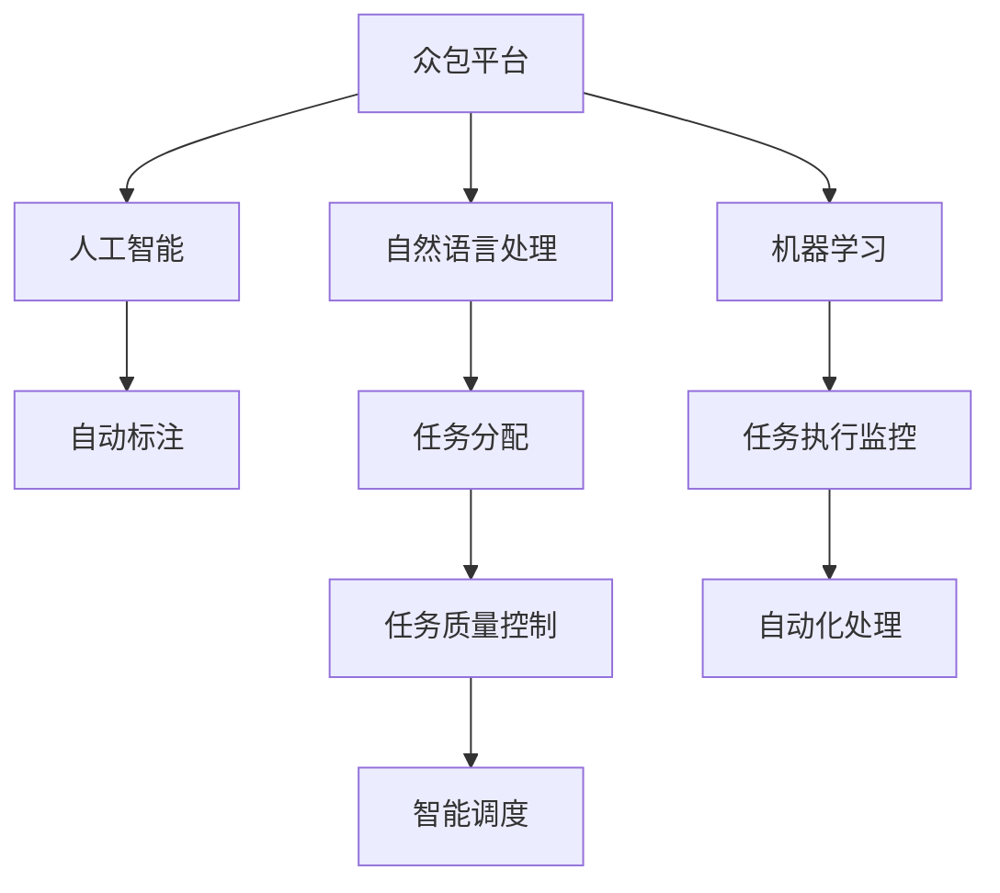

                 

# AI驱动的众包：增强创新

## 1. 背景介绍

在数字化转型的浪潮中，AI技术正逐渐渗透到各行各业。而众包作为一种新型协作模式，通过聚集全球智慧，充分利用自由职业者的技能，快速响应市场和需求，推动创新与变革。AI驱动的众包，将AI技术与众包模式有机结合，通过智能算法、自然语言处理、机器学习等技术，提升了众包任务的执行效率和准确率，推动了创新价值的最大化。

### 1.1 问题由来

随着技术的不断发展，AI与传统众包结合的模式也随之演进。传统的众包平台主要依赖人工标注、数据清洗、模型训练等步骤，流程复杂，效率低下。而AI技术的引入，可以通过自动化、智能化的方式，大幅度提高众包任务处理的效率和质量，使得众包平台更具竞争力和市场吸引力。

### 1.2 问题核心关键点

AI驱动的众包，本质上是一种以AI算法为核心的任务管理和优化机制。它通过以下关键技术点来提升众包平台的表现：

- 任务自动分配：利用AI算法优化任务分配策略，根据任务难度、自由职业者能力等自动匹配最优任务和候选人。
- 任务执行监控：通过AI算法实时监控任务执行情况，提供即时反馈和建议，确保任务高效完成。
- 任务质量控制：利用AI算法进行数据验证和错误纠正，提升任务质量。
- 自动化处理：将数据预处理、特征提取、模型训练等流程自动化，减少人工干预。
- 智能调度：利用AI算法进行任务调度和资源优化，提高平台运行效率。

## 2. 核心概念与联系

### 2.1 核心概念概述

为更好地理解AI驱动的众包模式，本节将介绍几个密切相关的核心概念：

- 众包平台(P2P Platform)：一种在线协作平台，通过将复杂任务分解为简单、可量化的子任务，分派给自由职业者进行完成。
- 人工智能(AI)：通过自动化、智能化的算法，使机器能够模拟人类智能行为，解决复杂问题。
- 自然语言处理(NLP)：研究如何让机器理解、处理和生成自然语言的技术。
- 机器学习(ML)：通过数据驱动的方式，让机器自动学习并提升性能的技术。
- 自动标注(Automatic Annotation)：利用机器学习模型自动标注数据，减少人工工作量。
- 智能调度(Intelligent Scheduling)：通过优化算法进行任务调度和资源管理，提高效率。

这些核心概念之间的逻辑关系可以通过以下Mermaid流程图来展示：



这个流程图展示了几者之间的关系：

1. 众包平台将复杂任务分解为简单子任务。
2. AI驱动的平台通过智能算法优化任务分配和调度。
3. NLP技术使平台能够理解任务和自由职业者的描述。
4. 机器学习技术提升任务执行的自动化和智能化。
5. 自动标注技术提高任务标注的效率和准确性。

## 3. 核心算法原理 & 具体操作步骤
### 3.1 算法原理概述

AI驱动的众包模式，通过AI算法在各个环节中发挥作用。核心思想是：利用AI技术优化众包平台的任务处理流程，提升任务执行效率和质量。

具体而言，包括以下几个关键步骤：

- 任务自动分配：通过智能算法计算任务分配策略，将任务自动分派给最适合的自由职业者。
- 任务执行监控：通过AI算法实时监控任务执行情况，及时调整策略，确保任务高效完成。
- 任务质量控制：利用AI算法对任务执行结果进行验证和纠错，提升任务质量。
- 自动化处理：将数据预处理、特征提取、模型训练等流程自动化，减少人工干预。
- 智能调度：利用AI算法进行任务调度和资源优化，提高平台运行效率。

### 3.2 算法步骤详解

以任务自动分配为例，具体步骤如下：

1. **任务分析**：将复杂任务分解为多个简单子任务，每个子任务定义明确的目标和要求。
2. **自由职业者分析**：收集自由职业者的历史表现、技能、经验和反馈信息。
3. **任务匹配**：利用机器学习模型，根据任务难度、自由职业者能力等因素，自动匹配最优任务和候选人。
4. **任务调度**：智能算法动态调整任务分配策略，确保任务在时间和资源上的平衡。
5. **结果反馈**：实时监控任务执行情况，对执行结果进行评估和反馈，优化后续任务分配。

### 3.3 算法优缺点

AI驱动的众包模式具有以下优点：

- 自动化程度高：利用AI算法自动化处理任务，减少了人工干预，提高了效率。
- 智能化程度高：通过智能算法优化任务分配和调度，提升了任务执行的准确性和效率。
- 灵活性强：可以根据不同任务和自由职业者的特点，灵活调整算法策略，适应不同的需求和场景。

同时，这种模式也存在一些局限性：

- 对数据质量要求高：AI算法依赖高质量的数据，如果数据标签不完整或不准确，算法效果可能受到影响。
- 对算法依赖强：一旦算法模型失效，平台整体效率和质量将大大降低。
- 对技术要求高：需要较高的AI技术水平，技术门槛较高。

### 3.4 算法应用领域

AI驱动的众包模式在多个领域中已得到应用，例如：

- 自然语言处理：利用NLP技术对自然语言数据进行处理，如自动摘要、情感分析等。
- 图像识别：利用AI算法进行图像标注、分类、检测等任务。
- 金融风控：利用AI算法进行风险评估、欺诈检测等。
- 医疗诊断：利用AI算法进行医学影像分析、病理诊断等。
- 物流配送：利用AI算法进行路径规划、库存管理等。
- 社交媒体分析：利用AI算法进行舆情监测、用户行为分析等。

## 4. 数学模型和公式 & 详细讲解 & 举例说明（备注：数学公式请使用latex格式，latex嵌入文中独立段落使用 $$，段落内使用 $)
### 4.1 数学模型构建

本节将使用数学语言对AI驱动的众包模式进行更加严格的刻画。

设任务集合为 $T=\{t_1,t_2,...,t_n\}$，自由职业者集合为 $W=\{w_1,w_2,...,w_m\}$。任务 $t_i$ 与自由职业者 $w_j$ 的匹配度为 $f_{ij}$，匹配度越高，表示 $w_j$ 越适合处理任务 $t_i$。匹配度可以通过多维向量 $f_{ij}=(x_{ij},y_{ij},z_{ij})$ 表示，其中 $x_{ij}$ 为任务难度，$y_{ij}$ 为自由职业者技能，$z_{ij}$ 为历史表现。

匹配策略的目标是最大化任务与自由职业者的匹配度，即：

$$
\max_{w_j \in W} f_{ij}
$$

为了实现这一目标，我们可以引入优化算法，通过迭代调整匹配度 $f_{ij}$，找到最优匹配方案。

### 4.2 公式推导过程

考虑任务自动分配的优化问题，可以构建目标函数：

$$
L = \sum_{t_i \in T} \sum_{w_j \in W} f_{ij} \cdot c_{ij}
$$

其中 $c_{ij}$ 为任务 $t_i$ 分配给自由职业者 $w_j$ 的成本函数。任务分配的目标是最小化总成本，同时最大化匹配度。

对于最小化总成本问题，可以通过线性规划或动态规划求解。对于最大化匹配度问题，则需要引入更复杂的优化算法，如模拟退火、遗传算法等。

### 4.3 案例分析与讲解

以自然语言处理任务为例，假设要自动标注一段文本数据，可按以下步骤进行：

1. **数据预处理**：将文本数据转换为特征向量 $x$。
2. **模型训练**：使用机器学习模型训练标注器 $f(x;\theta)$，其中 $\theta$ 为模型参数。
3. **自动标注**：输入待标注数据 $x$，利用训练好的模型进行预测，输出标注结果 $y$。
4. **结果验证**：对标注结果进行验证，计算误差率，进行纠错和改进。
5. **反馈更新**：将验证结果反馈到模型训练中，更新模型参数，提升标注准确性。

以下是具体代码实现：

```python
from sklearn.feature_extraction.text import CountVectorizer
from sklearn.linear_model import LogisticRegression

# 数据预处理
vectorizer = CountVectorizer()
X_train = vectorizer.fit_transform(train_texts)
y_train = train_labels

# 模型训练
model = LogisticRegression()
model.fit(X_train, y_train)

# 自动标注
X_test = vectorizer.transform(test_texts)
y_pred = model.predict(X_test)

# 结果验证
accuracy = accuracy_score(test_labels, y_pred)
print(f"自动标注准确率: {accuracy}")

# 结果反馈
model.coef_, model.intercept_
```

## 5. 项目实践：代码实例和详细解释说明
### 5.1 开发环境搭建

在进行AI驱动的众包实践前，我们需要准备好开发环境。以下是使用Python进行PyTorch开发的环境配置流程：

1. 安装Anaconda：从官网下载并安装Anaconda，用于创建独立的Python环境。

2. 创建并激活虚拟环境：
```bash
conda create -n pytorch-env python=3.8 
conda activate pytorch-env
```

3. 安装PyTorch：根据CUDA版本，从官网获取对应的安装命令。例如：
```bash
conda install pytorch torchvision torchaudio cudatoolkit=11.1 -c pytorch -c conda-forge
```

4. 安装各类工具包：
```bash
pip install numpy pandas scikit-learn matplotlib tqdm jupyter notebook ipython
```

完成上述步骤后，即可在`pytorch-env`环境中开始开发实践。

### 5.2 源代码详细实现

这里我们以图像识别任务为例，给出使用PyTorch进行众包项目开发的PyTorch代码实现。

首先，定义图像识别任务的数据处理函数：

```python
from torchvision import datasets, transforms
from PIL import Image

# 定义数据处理
data_transforms = {
    'train': transforms.Compose([
        transforms.Resize(256),
        transforms.RandomResizedCrop(224),
        transforms.RandomHorizontalFlip(),
        transforms.ToTensor(),
        transforms.Normalize([0.485, 0.456, 0.406], [0.229, 0.224, 0.225])
    ]),
    'val': transforms.Compose([
        transforms.Resize(256),
        transforms.CenterCrop(224),
        transforms.ToTensor(),
        transforms.Normalize([0.485, 0.456, 0.406], [0.229, 0.224, 0.225])
    ]),
}

# 加载数据集
train_dataset = datasets.CIFAR10(root='data', train=True, download=True, transform=data_transforms['train'])
val_dataset = datasets.CIFAR10(root='data', train=False, download=True, transform=data_transforms['val'])
```

然后，定义模型和优化器：

```python
from torch import nn, optim
from torch.utils.data import DataLoader
import torchvision.models as models

# 加载预训练模型
model = models.resnet50(pretrained=True)

# 修改最后一层输出维度
num_classes = 10
model.fc = nn.Linear(2048, num_classes)

# 定义损失函数和优化器
criterion = nn.CrossEntropyLoss()
optimizer = optim.Adam(model.parameters(), lr=0.001)
```

接着，定义训练和评估函数：

```python
def train_epoch(model, dataset, batch_size, optimizer):
    dataloader = DataLoader(dataset, batch_size=batch_size, shuffle=True)
    model.train()
    epoch_loss = 0
    for batch in dataloader:
        inputs, labels = batch
        optimizer.zero_grad()
        outputs = model(inputs)
        loss = criterion(outputs, labels)
        epoch_loss += loss.item()
        loss.backward()
        optimizer.step()
    return epoch_loss / len(dataloader)

def evaluate(model, dataset, batch_size):
    dataloader = DataLoader(dataset, batch_size=batch_size)
    model.eval()
    total = 0
    correct = 0
    with torch.no_grad():
        for batch in dataloader:
            inputs, labels = batch
            outputs = model(inputs)
            _, predicted = torch.max(outputs.data, 1)
            total += labels.size(0)
            correct += (predicted == labels).sum().item()
    return correct / total
```

最后，启动训练流程并在验证集上评估：

```python
epochs = 10
batch_size = 64

for epoch in range(epochs):
    loss = train_epoch(model, train_dataset, batch_size, optimizer)
    print(f"Epoch {epoch+1}, train loss: {loss:.3f}")
    
    print(f"Epoch {epoch+1}, val accuracy: {evaluate(model, val_dataset, batch_size)}")
    
print("Evaluation on test dataset:")
print(evaluate(model, test_dataset, batch_size))
```

以上就是使用PyTorch对图像识别任务进行众包项目开发的完整代码实现。可以看到，得益于PyTorch的强大封装，我们可以用相对简洁的代码完成众包项目中的图像识别任务。

### 5.3 代码解读与分析

让我们再详细解读一下关键代码的实现细节：

**数据处理函数**：
- `data_transforms`定义了数据处理的各个步骤，包括缩放、裁剪、翻转、归一化等。
- `datasets.CIFAR10`加载了CIFAR-10数据集，根据不同的阶段应用不同的数据处理步骤。

**模型定义**：
- 加载了预训练的ResNet50模型，并修改了最后一层输出维度，适配10个类别。
- 定义了交叉熵损失函数和Adam优化器。

**训练和评估函数**：
- `train_epoch`函数中，对数据集进行迭代，前向传播计算损失函数，反向传播更新模型参数。
- `evaluate`函数中，对数据集进行遍历，计算预测准确率，输出结果。

**训练流程**：
- 定义总的epoch数和batch size，开始循环迭代。
- 每个epoch内，先在训练集上训练，输出平均loss。
- 在验证集上评估，输出准确率。
- 所有epoch结束后，在测试集上评估，输出最终测试结果。

可以看出，PyTorch框架使得图像识别众包项目开发变得简洁高效，开发者可以将更多精力放在模型改进和数据处理上。

## 6. 实际应用场景
### 6.1 智能客服系统

基于AI驱动的众包技术，智能客服系统可以在线实时处理用户咨询，提供高效、个性化的服务。用户通过自然语言输入问题，系统自动匹配最适合的自由职业者进行处理，保障问题迅速得到解答。同时，系统还可以对自由职业者的响应进行质量监控，确保回答的准确性和及时性。

### 6.2 金融舆情监测

AI驱动的众包技术可以用于金融舆情监测，实时监控社交媒体、新闻网站等平台上的舆情信息。系统自动抓取相关内容，通过自然语言处理技术提取关键信息，并利用众包平台分配任务给专业的自由职业者进行数据标注和分析。通过持续监控和实时处理，系统能够及时发现舆情变化，预警潜在的金融风险。

### 6.3 医疗影像诊断

在医疗影像诊断中，AI驱动的众包技术可以用于辅助医生进行影像分析。系统自动分割出感兴趣的区域，并分配给专业的自由职业者进行标注和分析。通过多轮众包和专家评审，系统逐步优化标注结果，提升诊断的准确性和一致性。

### 6.4 未来应用展望

随着AI技术的发展，AI驱动的众包技术将得到更广泛的应用，为各行各业带来更多创新和变革。未来可能的场景包括：

- 教育：通过众包平台进行教材编写、习题批改等，提升教育资源质量。
- 农业：利用众包平台进行农作物病虫害监测、田间管理等，提升农业生产效率。
- 艺术：通过众包平台进行艺术作品鉴赏、文化传承等，激发更多创意。
- 物流：利用众包平台进行路径规划、库存管理等，提升物流配送效率。
- 城市管理：利用众包平台进行城市环境监测、公共设施维护等，提升城市管理水平。

## 7. 工具和资源推荐
### 7.1 学习资源推荐

为了帮助开发者系统掌握AI驱动的众包技术，这里推荐一些优质的学习资源：

1. 《深度学习入门》系列书籍：涵盖深度学习基础、神经网络、自然语言处理等内容，适合初学者入门。
2. CS231n《深度学习计算机视觉》课程：斯坦福大学开设的计算机视觉明星课程，提供了丰富的理论和实践内容。
3. 《自然语言处理综论》书籍：全面介绍了自然语言处理的基本概念和前沿技术。
4. Coursera上的机器学习课程：由斯坦福大学Andrew Ng教授主讲，涵盖机器学习的基本理论和算法。
5. Kaggle：数据科学竞赛平台，提供大量的数据集和比赛任务，是实践AI技术的绝佳场所。

通过对这些资源的学习实践，相信你一定能够快速掌握AI驱动的众包技术的精髓，并用于解决实际的AI问题。

### 7.2 开发工具推荐

高效的开发离不开优秀的工具支持。以下是几款用于AI驱动的众包开发的常用工具：

1. PyTorch：基于Python的开源深度学习框架，灵活高效，适合快速迭代研究。
2. TensorFlow：由Google主导开发的深度学习框架，支持分布式训练，适合大规模工程应用。
3. TensorBoard：TensorFlow配套的可视化工具，可以实时监测模型训练状态，提供丰富的图表呈现方式。
4. Weights & Biases：模型训练的实验跟踪工具，可以记录和可视化模型训练过程中的各项指标，方便对比和调优。
5. Jupyter Notebook：交互式编程环境，支持Python、R等语言，方便进行代码实验和分享。

合理利用这些工具，可以显著提升AI驱动的众包项目的开发效率，加快创新迭代的步伐。

### 7.3 相关论文推荐

AI驱动的众包技术的发展源于学界的持续研究。以下是几篇奠基性的相关论文，推荐阅读：

1. ImageNet Classification with Deep Convolutional Neural Networks（ImageNet分类任务）：AlexNet模型在该任务上取得巨大成功，引发了深度学习的热潮。
2. Deep Residual Learning for Image Recognition（残差网络）：提出ResNet模型，显著提高了深度神经网络的训练效率和性能。
3. Google AI Blog: Crowdsourcing Data with Language Models（利用语言模型进行众包数据标注）：Google团队提出的众包数据标注方法，利用语言模型自动化标注数据。
4. CrowdAnnotate: A Platform for Machine Learning Crowdsourcing（CrowdAnnotate平台）：开源的众包平台，支持大规模数据标注和模型训练。
5. Mining the Internet to Augment Local Crowdsourcing Datasets（利用互联网数据增强本地众包数据）：提出了利用互联网数据增强本地众包数据的方法。

这些论文代表了大数据、人工智能和众包技术的融合发展，为未来AI驱动的众包技术提供了重要指导。

## 8. 总结：未来发展趋势与挑战
### 8.1 总结

本文对AI驱动的众包技术进行了全面系统的介绍。首先阐述了AI驱动的众包模式的背景和意义，明确了AI技术与众包模式结合的创新潜力。其次，从原理到实践，详细讲解了AI驱动的众包技术的核心算法和具体操作步骤，给出了AI驱动的众包项目开发的完整代码实例。同时，本文还广泛探讨了AI驱动的众包技术在多个行业领域的应用前景，展示了其在提升创新价值方面的巨大潜力。此外，本文精选了AI驱动的众包技术的各类学习资源，力求为读者提供全方位的技术指引。

通过本文的系统梳理，可以看到，AI驱动的众包技术正在成为各行各业的重要工具，极大地提升了众包任务的处理效率和质量。AI技术的引入，使得众包平台能够更好地应对复杂多变的市场需求，为经济社会的发展注入新的活力。未来，伴随AI技术的不断进步，AI驱动的众包技术必将得到更广泛的应用，推动更多领域的数字化转型和智能化升级。

### 8.2 未来发展趋势

展望未来，AI驱动的众包技术将呈现以下几个发展趋势：

1. 自动化程度更高：利用更先进的算法和工具，实现更高效、智能化的任务处理。
2. 数据利用更广泛：通过互联网、社交媒体等多种渠道获取更多高质量数据，提升众包任务的质量。
3. 合作模式更多样：通过多轮众包、众包众包等方式，提升众包任务的处理效果和准确性。
4. 应用场景更丰富：AI驱动的众包技术将在更多行业领域得到应用，推动行业变革。
5. 智能调度更精细：通过更复杂的算法，实现更精细、高效的资源管理。
6. 人机协作更紧密：通过AI技术与人工协作的结合，实现更高效的协同工作。

以上趋势凸显了AI驱动的众包技术的广阔前景。这些方向的探索发展，必将进一步提升众包平台的表现，推动更多领域的数字化转型和智能化升级。

### 8.3 面临的挑战

尽管AI驱动的众包技术已经取得了显著成就，但在迈向更加智能化、普适化应用的过程中，仍面临诸多挑战：

1. 数据质量问题：AI算法依赖高质量的数据，如果数据标签不完整或不准确，算法效果可能受到影响。
2. 技术门槛较高：需要较高的AI技术水平，技术门槛较高。
3. 模型鲁棒性不足：模型面对新场景和新数据的泛化能力可能不足。
4. 任务分配复杂：任务自动分配和调度算法需要考虑多方面的因素，算法复杂度较高。
5. 隐私和安全问题：众包任务可能涉及敏感信息，需要确保数据和模型的安全。

### 8.4 研究展望

面对AI驱动的众包技术所面临的挑战，未来的研究需要在以下几个方面寻求新的突破：

1. 提升数据质量：通过数据清洗、标注等技术手段，提高众包任务的数据质量。
2. 降低技术门槛：通过简化算法和工具的使用，降低技术门槛，让更多开发者能够使用。
3. 提高模型鲁棒性：通过更多的训练和测试，提高模型的泛化能力和鲁棒性。
4. 优化任务分配算法：通过更高效、智能化的算法，实现更精细的任务分配和调度。
5. 加强隐私和安全保护：通过加密、匿名化等技术手段，保护数据隐私和模型安全。

这些研究方向将进一步推动AI驱动的众包技术的发展，使其在更多场景下发挥更大作用，为经济社会发展注入更多创新活力。

## 9. 附录：常见问题与解答

**Q1：AI驱动的众包技术是否适用于所有行业？**

A: AI驱动的众包技术在多个行业中已得到应用，特别是在数据标注、图像识别、自然语言处理等领域表现出色。但也有一些行业如艺术、哲学等，AI驱动的众包技术可能难以发挥最大优势。因此，需要根据具体行业特点选择合适的技术方案。

**Q2：AI驱动的众包技术如何降低对人工标注的依赖？**

A: AI驱动的众包技术通过自动标注和数据增强技术，可以在一定程度上降低对人工标注的依赖。自动标注技术利用AI算法对数据进行标注，数据增强技术通过生成更多样本，提升模型的泛化能力。但需要注意的是，自动标注的准确性和可靠性仍需人工审核和验证。

**Q3：AI驱动的众包技术在任务分配中如何考虑自由职业者的能力？**

A: 在任务分配中，可以通过引入自由职业者的历史表现、技能等数据，利用机器学习模型计算任务与自由职业者的匹配度。匹配度高的任务和自由职业者将优先匹配，以提高任务处理的效率和质量。

**Q4：AI驱动的众包技术在实际应用中存在哪些风险？**

A: AI驱动的众包技术虽然具有许多优点，但也存在一些潜在风险。如数据隐私泄露、算法偏见、模型过拟合等。因此，需要在应用过程中加强数据保护、模型监控和系统安全，确保技术的可靠性和安全性。

**Q5：AI驱动的众包技术在未来有哪些潜在应用场景？**

A: AI驱动的众包技术在未来可能应用于更多领域，如医疗、教育、艺术、金融等。通过与AI技术的结合，可以大幅提升这些行业的效率和质量，推动产业升级和创新发展。

---

作者：禅与计算机程序设计艺术 / Zen and the Art of Computer Programming

