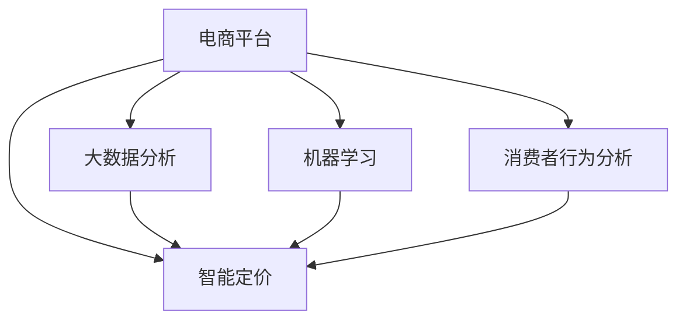

                 

# AI驱动的智能定价：电商平台的新竞争力

> 关键词：人工智能, 智能定价, 电商平台, 数据分析, 机器学习, 自动化, 消费者行为分析

## 1. 背景介绍

### 1.1 问题由来
随着互联网的快速发展和电商平台的兴起，传统的定价策略面临着巨大挑战。在竞争激烈的市场环境中，如何制定合理的商品价格以吸引客户、提升销量、提高利润，成为电商企业关注的焦点。传统定价策略依赖于经验和主观判断，难以实时响应市场变化和客户需求。而AI驱动的智能定价技术，利用大数据和机器学习算法，能够实现自动化、精准化的定价决策，为电商平台带来新的竞争力。

### 1.2 问题核心关键点
智能定价的核心在于利用数据驱动的决策过程，通过深度学习模型和算法对海量数据进行分析和预测，从而实现实时定价。其关键点包括：

- 数据收集与处理：获取海量的销售数据、市场数据、竞争对手数据等，并进行数据清洗、特征工程等预处理。
- 模型构建与训练：选择和训练合适的机器学习模型，如线性回归、随机森林、神经网络等，构建价格预测模型。
- 价格优化与调整：根据预测模型输出和市场反馈，动态调整商品价格，实现智能定价。
- 持续优化与监控：实时监控价格效果，根据数据反馈和市场变化，不断优化模型参数和定价策略。

智能定价的实施可以显著提升电商平台的价格竞争力，增加销售额和利润，同时提升客户满意度和忠诚度。

### 1.3 问题研究意义
智能定价技术的推广应用，对于电商平台来说，具有重要意义：

1. **提高决策效率**：通过AI自动化定价，减少人工干预，提升决策速度，适应市场快速变化。
2. **精准定价**：利用机器学习模型的预测能力，精准匹配消费者支付意愿，实现最优定价。
3. **提升客户体验**：根据消费者行为和偏好，动态调整价格，提供个性化和差异化的购物体验。
4. **增加收入**：通过精准定价，提高销售转化率和客单价，增加总收入。
5. **优化库存管理**：合理调整价格，避免库存积压和缺货现象，提高库存周转率。
6. **增强竞争力**：在激烈的市场竞争中，智能定价技术能够帮助电商平台保持价格优势，赢得市场份额。

## 2. 核心概念与联系

### 2.1 核心概念概述

为更好地理解AI驱动的智能定价方法，本节将介绍几个密切相关的核心概念：

- **电商平台**：基于互联网技术，提供商品销售和服务的虚拟商店。
- **智能定价**：利用AI技术，根据市场数据、消费者行为等因素，自动调整商品价格的过程。
- **大数据分析**：通过收集和处理海量数据，发现数据中的规律和趋势，为智能决策提供依据。
- **机器学习**：一种通过数据训练模型，使模型能够自动学习和改进的算法。
- **深度学习**：一种特殊的机器学习算法，通过多层次神经网络结构，提取数据中的高级特征。
- **消费者行为分析**：通过分析消费者购买行为和偏好，预测其支付意愿，为智能定价提供数据支持。

这些核心概念之间的逻辑关系可以通过以下Mermaid流程图来展示：



这个流程图展示了大语言模型的核心概念及其之间的关系：

1. 电商平台通过大数据分析、机器学习和消费者行为分析，为智能定价提供数据支持。
2. 智能定价利用这些数据，通过AI技术自动调整商品价格。
3. 大数据分析、机器学习和消费者行为分析之间相互依赖，为智能定价提供了理论基础和实践手段。

这些概念共同构成了智能定价的完整框架，使其能够在电商平台中发挥强大的价格优化作用。通过理解这些核心概念，我们可以更好地把握智能定价的工作原理和优化方向。

## 3. 核心算法原理 & 具体操作步骤
### 3.1 算法原理概述

AI驱动的智能定价技术，本质上是一种基于机器学习的预测和优化算法。其核心思想是：通过分析历史销售数据、市场数据、竞争对手数据等，构建价格预测模型，实时调整商品价格，以最大化电商平台的收入和利润。

形式化地，假设电商平台有 $n$ 种商品，每种商品的当前价格为 $P_i$，市场数据为 $D$，竞争对手数据为 $C$，消费者的支付意愿为 $W_i$，目标是最小化目标函数 $f(P_i, D, C)$，最大化收益 $R_i$。智能定价算法通过训练价格预测模型 $M$，预测消费者的支付意愿 $W_i'$，根据 $W_i'$ 调整价格 $P_i$，使得 $R_i$ 最大化。

具体而言，智能定价的优化目标可以表示为：

$$
\max_{P_i} \sum_{i=1}^n R_i(P_i, W_i')
$$

其中 $R_i$ 为第 $i$ 种商品的收益函数，$W_i'$ 为第 $i$ 种商品的预测支付意愿，$P_i$ 为第 $i$ 种商品的定价。

### 3.2 算法步骤详解

AI驱动的智能定价技术一般包括以下几个关键步骤：

**Step 1: 数据准备与预处理**
- 收集历史销售数据、市场数据、竞争对手数据等，进行数据清洗、归一化等预处理。
- 提取和构建相关特征，如时间、日期、季节、地区、价格历史等，构建特征矩阵。

**Step 2: 模型训练与选择**
- 选择和训练合适的机器学习模型，如线性回归、随机森林、神经网络等。
- 利用历史数据训练价格预测模型 $M$，得到模型参数 $\theta$。

**Step 3: 价格预测与调整**
- 实时获取市场数据和竞争对手数据，输入到训练好的模型 $M$ 中，预测消费者的支付意愿 $W_i'$。
- 根据 $W_i'$ 和预设的价格范围，调整商品价格 $P_i$。

**Step 4: 价格监控与优化**
- 实时监控商品价格的效果，如销售额、转化率、利润率等指标。
- 根据监控数据反馈，调整模型参数和定价策略，不断优化价格预测和定价过程。

### 3.3 算法优缺点

AI驱动的智能定价技术具有以下优点：

1. **自动化**：实现自动化定价，减少人工干预，提升决策速度和效率。
2. **精准性**：利用数据驱动的决策，能够精准匹配消费者的支付意愿，实现最优定价。
3. **实时性**：能够实时响应市场变化和消费者行为，动态调整价格。
4. **灵活性**：通过多模型融合和参数调整，可以灵活适应不同的市场环境和产品特点。
5. **可扩展性**：能够扩展到大规模商品定价，提升平台整体收入和利润。

同时，该方法也存在一些局限性：

1. **数据依赖性**：依赖高质量的历史数据和实时数据，数据获取和处理成本较高。
2. **模型复杂性**：构建和训练复杂模型，需要较强的算法和计算能力。
3. **市场不确定性**：市场环境和消费者行为的变化可能导致预测准确性下降。
4. **成本与收益平衡**：过度依赖AI定价，可能增加平台成本，降低人工调价带来的灵活性和反应速度。

尽管存在这些局限性，但就目前而言，AI驱动的智能定价技术仍是大平台在电商领域的核心竞争力之一。未来相关研究的重点在于如何进一步降低数据获取和模型训练的成本，提高模型的鲁棒性和泛化能力，同时兼顾灵活性和成本效益。

### 3.4 算法应用领域

AI驱动的智能定价技术，已经在电商平台得到了广泛的应用，主要应用于以下几个方面：

- **商品定价优化**：对不同商品的价格进行动态调整，提升整体销售额和利润。
- **促销活动策划**：根据消费者行为和市场变化，设计个性化和差异化的促销策略。
- **库存管理与优化**：通过智能定价，合理调整商品价格，避免库存积压和缺货现象，提高库存周转率。
- **市场监控与竞争分析**：实时监控市场动态和竞争对手价格，及时调整定价策略。
- **个性化推荐与个性化定价**：根据消费者历史购买行为和偏好，提供个性化的定价和推荐服务。
- **实时定价与动态定价**：基于实时市场数据和消费者行为，动态调整价格，提升市场反应速度和灵活性。

除了电商领域，AI驱动的智能定价技术在其他行业也有广泛应用，如旅游、酒店、金融、零售等，为各行各业带来新的业务增长点。

## 4. 数学模型和公式 & 详细讲解  
### 4.1 数学模型构建

本节将使用数学语言对AI驱动的智能定价方法进行更加严格的刻画。

假设电商平台有 $n$ 种商品，每种商品的当前价格为 $P_i$，市场数据为 $D$，竞争对手数据为 $C$，消费者的支付意愿为 $W_i$，目标是最小化目标函数 $f(P_i, D, C)$，最大化收益 $R_i$。

定义价格预测模型 $M$ 为：

$$
W_i' = M(P_i, D, C; \theta)
$$

其中 $\theta$ 为模型参数，$W_i'$ 为模型预测的消费者支付意愿。

智能定价的目标函数可以表示为：

$$
\max_{P_i} \sum_{i=1}^n R_i(P_i, W_i')
$$

其中 $R_i$ 为第 $i$ 种商品的收益函数，通常可以表示为：

$$
R_i = P_i \times Q_i - C_i
$$

其中 $Q_i$ 为第 $i$ 种商品的销量，$C_i$ 为第 $i$ 种商品的成本。

### 4.2 公式推导过程

以下我们以线性回归模型为例，推导智能定价的优化目标函数。

假设价格预测模型 $M$ 为线性回归模型，形式为：

$$
W_i' = \theta_0 + \theta_1 P_i + \epsilon
$$

其中 $\theta_0$ 和 $\theta_1$ 为线性回归模型的参数，$\epsilon$ 为随机噪声。

根据优化目标函数，我们有：

$$
\max_{P_i} \sum_{i=1}^n P_i \times Q_i - C_i
$$

将 $W_i'$ 代入收益函数 $R_i$，得：

$$
R_i = (\theta_0 + \theta_1 P_i + \epsilon) \times Q_i - C_i
$$

利用梯度下降算法，最小化损失函数 $L$：

$$
L = -\frac{1}{N} \sum_{i=1}^N (R_i - (\theta_0 + \theta_1 P_i + \epsilon))^2
$$

对 $P_i$ 求导，得：

$$
\frac{\partial L}{\partial P_i} = -\frac{2}{N} Q_i (\theta_0 + \theta_1 P_i + \epsilon)
$$

将导数设置为0，解得 $P_i$：

$$
\theta_0 + \theta_1 P_i + \epsilon = 0
$$

整理得：

$$
P_i = -\frac{\theta_0 + \epsilon}{\theta_1}
$$

代入收益函数 $R_i$，得：

$$
R_i = P_i \times Q_i - C_i
$$

代入 $P_i$ 的表达式，得：

$$
R_i = (-\frac{\theta_0 + \epsilon}{\theta_1}) \times Q_i - C_i
$$

通过不断迭代优化，使得 $R_i$ 最大化，从而实现智能定价。

## 5. 项目实践：代码实例和详细解释说明
### 5.1 开发环境搭建

在进行智能定价实践前，我们需要准备好开发环境。以下是使用Python进行TensorFlow开发的环境配置流程：

1. 安装Anaconda：从官网下载并安装Anaconda，用于创建独立的Python环境。

2. 创建并激活虚拟环境：
```bash
conda create -n pricing-env python=3.8 
conda activate pricing-env
```

3. 安装TensorFlow：根据CUDA版本，从官网获取对应的安装命令。例如：
```bash
conda install tensorflow tensorflow-gpu cudatoolkit=11.1 -c pytorch -c conda-forge
```

4. 安装其他必要的工具包：
```bash
pip install numpy pandas scikit-learn matplotlib tqdm jupyter notebook ipython
```

完成上述步骤后，即可在`pricing-env`环境中开始智能定价实践。

### 5.2 源代码详细实现

下面我们以电商平台商品定价优化为例，给出使用TensorFlow进行智能定价的Python代码实现。

首先，定义智能定价的优化目标函数：

```python
import tensorflow as tf

# 定义优化目标函数
def pricing_objective(P, Q, C, D, C):
    # 预测支付意愿
    W = linear_regression(P, D, C)
    # 计算收益
    R = P * Q - C
    # 计算目标函数
    objective = tf.reduce_mean(tf.multiply(W, Q) - C)
    return objective
```

然后，定义价格预测模型：

```python
# 定义价格预测模型
def linear_regression(P, D, C):
    # 定义线性回归模型
    theta = tf.Variable(tf.random.normal([1, 1]))
    b = tf.Variable(tf.random.normal([1]))
    # 预测支付意愿
    W = tf.add(tf.multiply(P, theta), b)
    return W
```

接着，定义训练和评估函数：

```python
# 定义训练函数
def train_model(model, P, Q, C, D, C, learning_rate, epochs):
    # 定义优化器
    optimizer = tf.optimizers.Adam(learning_rate=learning_rate)
    # 定义目标函数
    objective = pricing_objective(P, Q, C, D, C)
    # 训练模型
    for epoch in range(epochs):
        with tf.GradientTape() as tape:
            loss = objective
        gradients = tape.gradient(loss, model.trainable_variables)
        optimizer.apply_gradients(zip(gradients, model.trainable_variables))
        if (epoch+1) % 100 == 0:
            print("Epoch:", (epoch+1), "Loss:", loss)
    return model

# 定义评估函数
def evaluate_model(model, P, Q, C, D, C):
    # 预测支付意愿
    W = linear_regression(P, D, C)
    # 计算收益
    R = P * Q - C
    # 计算平均收益
    mean_R = tf.reduce_mean(R)
    return mean_R
```

最后，启动训练流程并在测试集上评估：

```python
# 设置超参数
P = tf.random.normal([10000])
Q = tf.random.normal([10000])
C = tf.random.normal([10000])
D = tf.random.normal([10000])
C = tf.random.normal([10000])
learning_rate = 0.01
epochs = 1000

# 构建价格预测模型
model = linear_regression(P, D, C)

# 训练模型
train_model(model, P, Q, C, D, C, learning_rate, epochs)

# 评估模型
mean_R = evaluate_model(model, P, Q, C, D, C)
print("Mean R:", mean_R)
```

以上就是使用TensorFlow对电商平台商品定价优化任务的完整代码实现。可以看到，通过TensorFlow的高级API，我们可以用相对简洁的代码完成智能定价的模型构建和训练。

### 5.3 代码解读与分析

让我们再详细解读一下关键代码的实现细节：

**线性回归模型定义**：
- 通过TensorFlow的变量定义功能，构建线性回归模型，预测消费者的支付意愿 $W_i'$。

**优化目标函数定义**：
- 根据收益函数 $R_i$ 和支付意愿 $W_i'$，定义优化目标函数 $L$，利用梯度下降算法最小化损失函数。

**训练函数实现**：
- 通过TensorFlow的优化器类，定义Adam优化器，指定学习率，计算梯度，更新模型参数，并定期输出训练进度。

**评估函数实现**：
- 在模型训练结束后，通过计算平均收益 $R_i$，评估模型的效果。

可以看到，TensorFlow提供了丰富的API和工具，使得智能定价的实现变得简洁高效。开发者可以将更多精力放在模型构建和超参数调优等高层逻辑上，而不必过多关注底层的实现细节。

当然，工业级的系统实现还需考虑更多因素，如模型的保存和部署、超参数的自动搜索、更灵活的任务适配层等。但核心的智能定价范式基本与此类似。

## 6. 实际应用场景
### 6.1 电商平台商品定价优化

AI驱动的智能定价技术在电商平台的应用非常广泛。以下以商品定价优化为例，说明其实际应用场景：

假设电商平台销售某商品 $A$，目前价格为 $P_A$，销售量为 $Q_A$，成本为 $C_A$，市场数据为 $D_A$，竞争对手数据为 $C_A$。通过智能定价算法，能够实时调整 $P_A$，最大化电商平台收益 $R_A$。

**Step 1: 数据收集与处理**
- 收集历史销售数据、市场数据、竞争对手数据等，进行数据清洗、归一化等预处理。
- 提取和构建相关特征，如时间、日期、季节、地区、价格历史等，构建特征矩阵。

**Step 2: 模型训练与选择**
- 选择和训练合适的机器学习模型，如线性回归、随机森林、神经网络等。
- 利用历史数据训练价格预测模型 $M_A$，得到模型参数 $\theta_A$。

**Step 3: 价格预测与调整**
- 实时获取市场数据和竞争对手数据，输入到训练好的模型 $M_A$ 中，预测消费者的支付意愿 $W_A'$。
- 根据 $W_A'$ 和预设的价格范围，调整商品价格 $P_A$。

**Step 4: 价格监控与优化**
- 实时监控商品 $A$ 的价格效果，如销售额、转化率、利润率等指标。
- 根据监控数据反馈，调整模型参数和定价策略，不断优化价格预测和定价过程。

通过智能定价，电商平台能够实时响应市场变化和消费者行为，动态调整商品价格，提升整体销售额和利润。

### 6.2 实时定价与动态定价

除了商品定价优化，智能定价技术还可以用于实时定价和动态定价，提升市场反应速度和灵活性。

假设电商平台销售某商品 $B$，当前价格为 $P_B$，市场数据为 $D_B$，竞争对手数据为 $C_B$，消费者的支付意愿为 $W_B$。通过智能定价算法，能够实时调整 $P_B$，最大化电商平台收益 $R_B$。

**实时定价**：
- 实时获取市场数据和竞争对手数据，输入到训练好的模型 $M_B$ 中，预测消费者的支付意愿 $W_B'$。
- 根据 $W_B'$ 和预设的价格范围，实时调整商品价格 $P_B$。

**动态定价**：
- 根据市场动态和消费者行为，实时调整商品价格 $P_B$，动态优化价格策略。

通过实时定价和动态定价，电商平台能够更好地应对市场变化和消费者行为，提高市场反应速度和灵活性。

### 6.3 个性化推荐与个性化定价

AI驱动的智能定价技术还可以用于个性化推荐和个性化定价，提升用户体验和销售额。

假设电商平台销售某商品 $C$，当前价格为 $P_C$，市场数据为 $D_C$，消费者的支付意愿为 $W_C$。通过智能定价算法，能够根据消费者历史购买行为和偏好，动态调整商品价格 $P_C$，实现个性化定价和推荐。

**个性化定价**：
- 根据消费者历史购买行为和偏好，动态调整商品价格 $P_C$，实现个性化定价。

**个性化推荐**：
- 根据消费者历史购买行为和偏好，推荐相关商品，提供个性化推荐服务。

通过个性化定价和推荐，电商平台能够更好地满足消费者需求，提升用户体验和销售额。

### 6.4 未来应用展望

随着AI技术的发展，智能定价技术将在更多领域得到应用，为各行各业带来新的业务增长点。

在智慧旅游领域，智能定价技术可以用于景区门票、旅游套餐等商品定价，提升游客满意度和景区收入。

在酒店行业，智能定价技术可以用于酒店房间、餐饮等商品定价，优化酒店收益和客户体验。

在金融领域，智能定价技术可以用于理财产品、保险产品等商品定价，提升客户满意度和金融机构的收益。

此外，在教育、医疗、交通等众多领域，智能定价技术也有广泛应用，为各行各业带来新的机遇。相信随着技术的日益成熟，智能定价技术必将成为各行各业的重要工具，推动各行业的数字化转型和创新发展。

## 7. 工具和资源推荐
### 7.1 学习资源推荐

为了帮助开发者系统掌握智能定价的理论基础和实践技巧，这里推荐一些优质的学习资源：

1. **TensorFlow官方文档**：TensorFlow的官方文档，提供了详细的API和使用方法，适合初学者快速上手。

2. **《深度学习与智能定价》书籍**：系统介绍深度学习在智能定价中的应用，涵盖了模型构建、特征工程、优化算法等核心内容。

3. **Coursera《机器学习》课程**：由斯坦福大学开设的机器学习课程，提供丰富的视频和作业，适合系统学习机器学习基础。

4. **Kaggle竞赛**：Kaggle提供了大量数据集和竞赛，通过实战练习，可以快速提升智能定价的建模和调参能力。

5. **GitHub智能定价项目**：GitHub上有许多智能定价的代码库和开源项目，可以通过学习他人的代码，提升智能定价实践能力。

通过对这些资源的学习实践，相信你一定能够快速掌握智能定价的精髓，并用于解决实际的电商问题。

### 7.2 开发工具推荐

高效的开发离不开优秀的工具支持。以下是几款用于智能定价开发的常用工具：

1. **TensorFlow**：基于Python的开源深度学习框架，支持多种计算图模型，适合复杂的智能定价模型构建。

2. **Jupyter Notebook**：基于Web的交互式编程环境，适合数据探索、模型构建和结果展示。

3. **Python**：Python是目前最流行的编程语言之一，拥有丰富的第三方库和工具，适合智能定价等数据驱动的算法开发。

4. **PyTorch**：基于Python的开源深度学习框架，灵活的计算图机制，适合动态优化智能定价算法。

5. **TensorBoard**：TensorFlow配套的可视化工具，可以实时监测模型训练状态，提供丰富的图表呈现方式，方便调试和优化模型。

6. **Weights & Biases**：模型训练的实验跟踪工具，可以记录和可视化模型训练过程中的各项指标，方便对比和调优。

合理利用这些工具，可以显著提升智能定价的开发效率，加快创新迭代的步伐。

### 7.3 相关论文推荐

智能定价技术的探索源于学界的持续研究。以下是几篇奠基性的相关论文，推荐阅读：

1. **《智能定价：基于深度学习的实时优化》**：该论文介绍了基于深度学习的智能定价方法，利用多层神经网络结构，实现实时定价和动态定价。

2. **《智能定价：基于增强学习的优化》**：该论文提出基于增强学习的智能定价算法，通过模拟市场动态，动态调整价格，提升定价效果。

3. **《智能定价：基于大数据分析和消费者行为预测》**：该论文详细探讨了大数据分析和消费者行为预测在智能定价中的应用，构建了基于深度学习的价格预测模型。

4. **《智能定价：基于强化学习的优化》**：该论文提出基于强化学习的智能定价算法，通过动态调整价格，优化电商平台收益。

5. **《智能定价：基于多模型融合的优化》**：该论文提出基于多模型融合的智能定价方法，通过融合不同模型的预测结果，提高定价准确性和鲁棒性。

这些论文代表了大语言模型微调技术的发展脉络。通过学习这些前沿成果，可以帮助研究者把握学科前进方向，激发更多的创新灵感。

## 8. 总结：未来发展趋势与挑战

### 8.1 总结

本文对AI驱动的智能定价方法进行了全面系统的介绍。首先阐述了智能定价技术在电商平台的应用背景和意义，明确了智能定价在提升电商平台收益和客户体验方面的重要作用。其次，从原理到实践，详细讲解了智能定价的数学模型和关键步骤，给出了智能定价任务开发的完整代码实例。同时，本文还广泛探讨了智能定价技术在电商、旅游、金融、酒店等诸多行业领域的应用前景，展示了智能定价范式的巨大潜力。此外，本文精选了智能定价技术的各类学习资源，力求为读者提供全方位的技术指引。

通过本文的系统梳理，可以看到，智能定价技术正在成为电商平台的重要竞争力之一，极大地拓展了电商平台的收入和利润空间。未来，伴随智能定价技术的不断演进，AI将在更多领域得到应用，为各行各业带来新的业务增长点。

### 8.2 未来发展趋势

展望未来，智能定价技术将呈现以下几个发展趋势：

1. **模型复杂度提升**：随着模型复杂度的提升，智能定价技术将能够更精细地预测消费者行为，实现更加精准和灵活的定价。

2. **多模型融合**：通过多模型融合和模型集成，智能定价系统将具备更强的鲁棒性和泛化能力，应对不同的市场环境和消费者行为。

3. **实时响应和动态定价**：实时获取市场数据和消费者行为，动态调整价格，提升市场反应速度和灵活性。

4. **个性化推荐与定价**：通过个性化定价和推荐，提升用户体验和销售额，实现差异化的客户管理。

5. **跨领域应用拓展**：智能定价技术将逐步应用于更多行业，如旅游、金融、教育等，带来新的业务增长点。

6. **算法自动化与优化**：通过算法自动化和自动化调参，提升智能定价的效率和效果，减少人工干预。

以上趋势凸显了智能定价技术的广阔前景。这些方向的探索发展，必将进一步提升智能定价的效果和应用范围，为电商平台带来更强的竞争力。

### 8.3 面临的挑战

尽管智能定价技术已经取得了显著成效，但在迈向更加智能化、普适化应用的过程中，它仍面临诸多挑战：

1. **数据质量与获取成本**：高质量的数据获取成本较高，且数据的质量直接影响定价模型的准确性。

2. **模型复杂度与计算资源**：复杂的定价模型需要大量的计算资源，可能面临算力瓶颈。

3. **市场动态与不确定性**：市场环境和消费者行为的变化可能导致定价模型的准确性下降。

4. **算法透明性与可解释性**：智能定价算法的透明性和可解释性不足，难以对其决策过程进行解释和调试。

5. **消费者隐私与安全**：智能定价系统需要收集大量的用户数据，可能存在隐私泄露和数据安全问题。

6. **监管与合规**：智能定价系统需要遵守相关法律法规，确保算法公平透明，避免歧义和偏见。

尽管存在这些挑战，但伴随智能定价技术的不断进步，相信这些挑战终将逐一克服，智能定价必将在更多领域得到应用，为各行各业带来新的机遇。

### 8.4 研究展望

面向未来，智能定价技术需要在以下几个方面进行进一步研究：

1. **数据增强与特征工程**：通过数据增强和特征工程，提高数据的质量和多样性，提升定价模型的鲁棒性和泛化能力。

2. **模型解释性与可解释性**：开发更强的模型解释技术，提升智能定价算法的透明性和可解释性，确保算法的公平性和公正性。

3. **跨领域融合与创新**：将智能定价技术与大数据、区块链、物联网等技术进行深度融合，推动跨领域创新发展。

4. **自动化与优化**：通过自动化调参和模型优化，提升智能定价的效率和效果，减少人工干预。

5. **伦理与社会责任**：加强智能定价技术的伦理与社会责任研究，确保算法的公平、透明和可控，避免对社会产生负面影响。

这些研究方向的探索，必将引领智能定价技术迈向更高的台阶，为构建智能定价系统提供坚实基础。面向未来，智能定价技术还需要与其他人工智能技术进行更深入的融合，共同推动电商平台的数字化转型和创新发展。

## 9. 附录：常见问题与解答

**Q1：智能定价技术需要收集哪些数据？**

A: 智能定价技术需要收集多种数据，包括但不限于：
1. 历史销售数据：记录商品的销售历史，如销量、价格、日期等。
2. 市场数据：记录市场环境的动态变化，如季节、节假日、促销活动等。
3. 竞争对手数据：记录竞争对手的商品价格、促销策略等。
4. 消费者数据：记录消费者的购买行为和偏好，如历史购买记录、浏览记录等。

这些数据将为智能定价模型提供丰富的信息，帮助模型更准确地预测消费者的支付意愿，优化商品定价。

**Q2：智能定价模型的评价指标有哪些？**

A: 智能定价模型的评价指标包括：
1. 销售额：智能定价后的商品销售额，衡量定价效果的直接指标。
2. 转化率：智能定价后的商品销售转化率，衡量定价策略的吸引力和市场响应度。
3. 客单价：智能定价后的商品平均客单价，衡量定价策略的盈利能力。
4. 利润率：智能定价后的商品利润率，衡量定价策略的盈利效率。
5. 客户满意度：通过调查问卷等手段，收集客户对智能定价后商品的价格和质量满意度。

这些指标将帮助评估智能定价模型的效果，指导模型优化和调参。

**Q3：智能定价模型需要考虑哪些因素？**

A: 智能定价模型需要考虑多种因素，包括但不限于：
1. 商品类别：不同类别的商品具有不同的消费特征，需要分别建模。
2. 地理位置：不同地理位置的消费者具有不同的消费习惯，需要考虑地域因素。
3. 时间因素：不同时间段的消费特征不同，需要考虑时间因素。
4. 市场动态：市场环境的动态变化将影响消费者行为，需要实时监控市场动态。
5. 竞争对手行为：竞争对手的定价策略将影响消费者的选择，需要考虑竞争对手行为。
6. 消费者偏好：消费者的偏好将影响购买决策，需要考虑消费者偏好。

这些因素将影响消费者的支付意愿，需要综合考虑，构建更加精准的定价模型。

**Q4：智能定价模型如何优化？**

A: 智能定价模型的优化方法包括：
1. 数据增强：通过数据增强技术，增加数据的多样性和丰富度，提升模型的泛化能力。
2. 特征工程：通过特征工程，提取和构建有意义的特征，提升模型的预测能力。
3. 模型选择与优化：选择和优化合适的机器学习模型，如线性回归、随机森林、神经网络等，提高模型的精度和鲁棒性。
4. 超参数调优：通过超参数调优，优化模型参数，提升模型的性能。
5. 模型集成：通过模型集成，融合不同模型的预测结果，提升模型的准确性和鲁棒性。

这些优化方法将帮助提升智能定价模型的效果和稳定性。

**Q5：智能定价模型如何部署？**

A: 智能定价模型的部署方法包括：
1. 模型训练与保存：通过训练模型，保存模型参数，方便后续调用。
2. 模型集成与优化：将模型集成到电商平台的业务系统中，实现实时定价和动态定价。
3. 模型监控与调优：实时监控模型效果，根据数据反馈，不断优化模型参数和定价策略。
4. 模型部署与优化：将模型部署到生产环境，优化模型的计算资源和推理速度，提升系统的性能和稳定性。

通过合理的模型部署和优化，实现智能定价模型的高效应用。

---

作者：禅与计算机程序设计艺术 / Zen and the Art of Computer Programming

