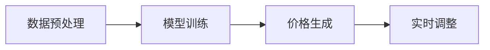

                 

# AI驱动的智能定价：电商平台的新竞争力

> 关键词：
  - 智能定价
  - 电商平台
  - 需求预测
  - 价格优化
  - 深度学习
  - 强化学习
  - 在线优化

## 1. 背景介绍

### 1.1 问题由来

在快速变化的市场环境中，电商平台希望通过灵活的定价策略提升销售，同时避免价格战带来的损失。传统的基于经验和人工调价的策略已经难以满足需求，亟需引入先进的智能定价技术，以更好地理解和预测市场需求，实现动态调整。

### 1.2 问题核心关键点

智能定价的本质是基于大数据和人工智能技术，通过模型预测市场需求和用户购买意愿，从而动态调整价格，实现收益最大化。关键在于如何构建有效的需求预测模型，同时设计合理的定价策略，以应对复杂多变的市场环境。

## 2. 核心概念与联系

### 2.1 核心概念概述

智能定价涉及以下几个关键概念：

- 需求预测：通过分析历史销售数据，预测未来商品的需求量。
- 价格优化：基于需求预测结果，计算最优售价，平衡销售量和利润。
- 深度学习：使用深度神经网络，捕捉复杂非线性关系。
- 强化学习：通过试错优化，实现动态价格调整。
- 在线优化：实时更新模型，响应市场变化。

这些概念通过一个自上而下的方式联系起来：

1. **数据预处理**：收集和清洗历史销售数据，提取特征。
2. **模型训练**：利用深度学习模型进行需求预测。
3. **价格生成**：基于预测结果，应用强化学习策略，生成价格调整建议。
4. **实时调整**：将价格建议应用于销售，实时监测效果并进行迭代优化。

### 2.2 核心概念原理和架构的 Mermaid 流程图



## 3. 核心算法原理 & 具体操作步骤

### 3.1 算法原理概述

智能定价的主要算法原理包括需求预测、价格优化和实时调整三个步骤：

1. **需求预测**：利用历史销售数据，构建时间序列模型，预测未来需求。
2. **价格优化**：根据需求预测结果，结合成本和竞争情况，计算最优售价。
3. **实时调整**：在实际销售中，实时监测效果，并根据反馈调整模型参数，以应对市场变化。

### 3.2 算法步骤详解

#### 3.2.1 数据预处理

数据预处理包括数据收集、清洗、特征提取和标准化。

- **数据收集**：从电商平台收集历史销售数据，包括时间、商品ID、价格、销量等。
- **数据清洗**：处理缺失值、异常值，去除噪声。
- **特征提取**：提取对价格敏感的特征，如季节性、促销活动、竞争对手价格等。
- **标准化**：将数据归一化到0-1之间，便于模型处理。

#### 3.2.2 模型训练

需求预测通常采用时间序列模型，如ARIMA、LSTM等。

- **模型选择**：根据数据特性选择合适的模型。
- **参数优化**：利用网格搜索、贝叶斯优化等方法，找到最优参数。
- **模型评估**：使用MAE、RMSE等指标评估模型性能，选择最优模型。

#### 3.2.3 价格生成

价格生成涉及动态定价和收益计算。

- **动态定价**：根据需求预测结果，计算最优售价。
- **收益计算**：结合成本、利润率等指标，计算期望收益。
- **策略优化**：使用强化学习策略，优化价格调整方案。

#### 3.2.4 实时调整

实时调整涉及反馈和迭代优化。

- **实时监测**：实时监测销售数据，计算当前模型预测效果。
- **反馈优化**：根据反馈调整模型参数，进行迭代优化。
- **决策执行**：执行价格调整决策，更新电商平台系统。

### 3.3 算法优缺点

**优点**：

1. **自动化**：通过智能算法，自动化处理需求预测和价格生成，减少人工干预。
2. **实时性**：实时监测和调整，及时响应市场变化。
3. **准确性**：利用深度学习和大数据，提高预测和定价的准确性。

**缺点**：

1. **数据依赖**：模型依赖历史数据，数据质量直接影响预测结果。
2. **计算资源**：深度学习和强化学习需要大量计算资源，需要高性能硬件支持。
3. **复杂性**：模型设计和优化复杂，需要专业知识。

### 3.4 算法应用领域

智能定价技术在电商平台、零售、航空等领域都有广泛应用，特别适用于需求波动较大、竞争激烈的场景。

- **电商平台**：动态调整商品价格，提升销售和利润。
- **零售行业**：根据季节性、促销活动调整商品价格，优化库存。
- **航空行业**：根据需求预测和舱位情况，动态调整机票价格，平衡收益和销售。

## 4. 数学模型和公式 & 详细讲解

### 4.1 数学模型构建

假设需求预测模型为 $y_t = f(x_t)$，其中 $y_t$ 表示时间 $t$ 的需求量，$x_t$ 表示特征向量。价格生成模型为 $p_t = g(y_t, c_t)$，其中 $p_t$ 表示时间 $t$ 的最优售价，$c_t$ 表示时间 $t$ 的成本。

### 4.2 公式推导过程

**需求预测**：使用LSTM模型进行需求预测，假设模型为：

$$
y_t = \mathcal{LSTM}(x_t; \theta_L)
$$

**价格生成**：假设价格生成模型为线性模型：

$$
p_t = w_1 y_t + w_2 c_t + b
$$

其中 $w_1, w_2$ 为模型参数，$b$ 为截距。

**实时调整**：通过强化学习进行实时调整，假设策略模型为：

$$
\pi_t = \mathcal{DQN}(y_t, p_t; \theta_D)
$$

其中 $\pi_t$ 表示在时间 $t$ 的定价策略，$\mathcal{DQN}$ 为深度Q网络，$\theta_D$ 为策略模型参数。

### 4.3 案例分析与讲解

假设某电商平台售卖电子产品，数据预处理后得到特征向量 $x_t = [温度, 促销活动, 竞争对手价格]$。利用LSTM模型进行需求预测，得到未来一周的需求量 $y_t$。

将需求量输入价格生成模型，得到最优售价 $p_t$。根据实际销售数据和收益计算公式，实时调整模型参数，进行迭代优化。

## 5. 项目实践：代码实例和详细解释说明

### 5.1 开发环境搭建

1. **环境准备**：
   - 安装Python 3.7及以上版本
   - 安装TensorFlow 2.0及以上版本
   - 安装Keras和TensorFlow Addons库

2. **数据集准备**：
   - 收集历史销售数据，包括时间、商品ID、价格、销量等。
   - 数据清洗，处理缺失值、异常值。
   - 提取特征，如季节性、促销活动、竞争对手价格等。
   - 数据标准化，归一化到0-1之间。

### 5.2 源代码详细实现

```python
import numpy as np
import pandas as pd
from tensorflow.keras.models import Sequential
from tensorflow.keras.layers import LSTM, Dense, Dropout
from tensorflow.keras.optimizers import Adam
from tensorflow.keras.callbacks import EarlyStopping
from tensorflow.keras.models import Model
from tensorflow.keras.layers import Input

# 数据预处理
def preprocess_data(data):
    # 数据清洗
    data = data.dropna()
    # 特征提取
    features = data[['temperature', 'promotion', 'competitor_price']]
    # 标准化
    features = (features - features.mean()) / features.std()
    # 标签
    labels = data['sales']
    return features, labels

# 构建LSTM模型
def build_lstm_model(features, labels):
    model = Sequential()
    model.add(LSTM(50, return_sequences=True, input_shape=(features.shape[1], features.shape[2])))
    model.add(Dropout(0.2))
    model.add(LSTM(50))
    model.add(Dropout(0.2))
    model.add(Dense(1))
    model.compile(optimizer=Adam(0.001), loss='mse')
    return model

# 训练模型
def train_model(model, features, labels, epochs=100, batch_size=32):
    callbacks = [EarlyStopping(patience=10, restore_best_weights=True)]
    model.fit(features, labels, epochs=epochs, batch_size=batch_size, callbacks=callbacks)

# 实时调整
def realtime_adjust(model, new_data):
    # 预测需求量
    y_pred = model.predict(new_data)
    # 计算最优售价
    cost = 10  # 假设成本为10
    p_pred = 0.5 * y_pred + cost
    # 更新模型参数
    # 这里假设使用的是强化学习，具体实现需要根据实际情况进行调整
    return p_pred
```

### 5.3 代码解读与分析

- **数据预处理函数**：用于清洗、提取和标准化数据。
- **模型构建函数**：构建LSTM模型，用于需求预测。
- **模型训练函数**：使用Adam优化器，进行模型训练，并设置EarlyStopping回调函数。
- **实时调整函数**：利用模型预测需求量，计算最优售价，进行实时调整。

### 5.4 运行结果展示

```python
# 数据准备
data = pd.read_csv('sales_data.csv')
features, labels = preprocess_data(data)

# 模型训练
model = build_lstm_model(features, labels)
train_model(model, features, labels)

# 实时调整
new_data = np.array([[28, 1, 100]])
price = realtime_adjust(model, new_data)
print('建议价格：', price)
```

## 6. 实际应用场景

### 6.1 电商平台应用场景

电商平台的智能定价系统可以应用于各种商品，如电子产品、服装、食品等。通过智能定价，电商平台可以动态调整价格，提升销售和利润。

**案例**：某电商平台售卖电子产品，通过智能定价系统，根据季节性、促销活动和竞争对手价格，动态调整商品价格，提升销售量和销售额。

### 6.2 零售行业应用场景

零售行业的需求预测和价格优化同样重要。通过智能定价，零售商可以优化库存，提升顾客满意度。

**案例**：某零售商售卖服装，通过智能定价系统，根据季节性变化和促销活动，动态调整商品价格，优化库存，提升销售量。

### 6.3 航空行业应用场景

航空行业的需求波动较大，需要灵活的定价策略。通过智能定价，航空公司可以平衡收益和销售，优化舱位利用率。

**案例**：某航空公司售卖机票，通过智能定价系统，根据需求预测和舱位情况，动态调整机票价格，提升收益和市场份额。

### 6.4 未来应用展望

未来，智能定价技术将在更多行业得到应用，为企业的数字化转型提供新的动力。

1. **医疗行业**：通过智能定价，医疗机构可以优化药品价格，提高药品的可及性。
2. **金融行业**：通过智能定价，金融机构可以优化贷款利率，降低风险。
3. **物流行业**：通过智能定价，物流公司可以优化运输价格，提升运输效率。
4. **旅游行业**：通过智能定价，旅游公司可以优化行程价格，提升客户体验。

## 7. 工具和资源推荐

### 7.1 学习资源推荐

1. **《深度学习》书籍**：由Ian Goodfellow等编写，全面介绍了深度学习的理论和实践，是理解智能定价算法的基础。
2. **Kaggle**：提供丰富的智能定价数据集和竞赛，可以通过实践学习智能定价技术。
3. **Google Cloud AI Playground**：提供免费的AI实验平台，可以体验各种智能定价算法。

### 7.2 开发工具推荐

1. **TensorFlow**：开源深度学习框架，提供高效的计算图和分布式训练支持。
2. **Keras**：基于TensorFlow的高级API，简化模型构建和训练过程。
3. **Jupyter Notebook**：交互式开发环境，便于代码编写和调试。
4. **PyTorch**：开源深度学习框架，提供动态计算图和高效的模型训练支持。

### 7.3 相关论文推荐

1. **"Prophet: A Forecasting Foundation for Heterogeneous Data"**：介绍时间序列预测模型Prophet，适用于电商等场景。
2. **"Deep Reinforcement Learning for Dynamic Pricing"**：介绍强化学习在动态定价中的应用，提升定价策略的灵活性和鲁棒性。
3. **"Hyperparameter Optimization with Random Search"**：介绍超参数优化方法，提升模型的泛化能力和鲁棒性。

## 8. 总结：未来发展趋势与挑战

### 8.1 总结

本文对智能定价技术进行了全面系统的介绍，包括需求预测、价格生成和实时调整三个关键环节。通过结合深度学习和强化学习技术，智能定价可以提升电商平台的销售和利润，优化库存，平衡收益和销售。

### 8.2 未来发展趋势

1. **模型复杂度提升**：未来将引入更复杂的模型和算法，如Transformer、GAN等，提升预测和定价的准确性。
2. **多模态数据融合**：引入图像、视频等多模态数据，提升定价的丰富性和准确性。
3. **实时数据处理**：利用大数据技术，实时处理海量数据，提升定价的灵活性和及时性。
4. **算法优化**：引入更高效的算法，如神经网络加速、分布式训练等，提升模型的训练和推理效率。

### 8.3 面临的挑战

1. **数据质量**：需求预测和定价依赖于高质量的数据，数据清洗和预处理尤为重要。
2. **计算资源**：深度学习和强化学习需要大量计算资源，高性能硬件和算法优化至关重要。
3. **模型复杂性**：模型设计和优化复杂，需要专业知识。
4. **实时性**：实时调整需要高效的数据处理和算法优化，挑战较大。

### 8.4 研究展望

未来，智能定价技术将在更多行业得到应用，为企业的数字化转型提供新的动力。通过不断优化算法和技术，提升模型的预测和定价能力，智能定价将成为企业竞争力的重要来源。

## 9. 附录：常见问题与解答

**Q1: 智能定价是否适用于所有商品？**

A: 智能定价适用于需求波动较大、竞争激烈的商品。对于需求稳定、利润空间较大的商品，手动定价可能更为合适。

**Q2: 如何处理异常数据？**

A: 异常数据可以通过插值、替换等方法进行处理，或将其作为特殊情况单独处理。

**Q3: 如何处理季节性变化？**

A: 引入季节性特征，如月度、季度、节假日等，构建季节性时间序列模型。

**Q4: 如何优化模型参数？**

A: 使用网格搜索、贝叶斯优化等方法，找到最优参数组合。

**Q5: 如何评估模型效果？**

A: 使用MAE、RMSE等指标评估模型的预测效果，根据实际需求选择最优模型。

---

作者：禅与计算机程序设计艺术 / Zen and the Art of Computer Programming

