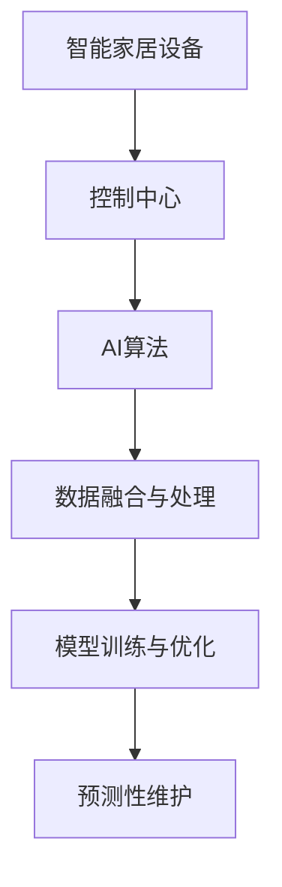

                 

# AI驱动的智能家居控制中心

## 1. 背景介绍

### 1.1 问题由来

随着物联网和人工智能技术的不断进步，智能家居系统已经从科幻小说变成了现实。从智能音箱到智能照明，从智能门锁到智能安防，各种各样的智能设备让我们的生活更加便捷、舒适。然而，这些设备的数量和种类越来越多，管理起来也越来越复杂。如何实现对这些设备的高效统一控制，成为了智能家居发展的一个关键问题。

### 1.2 问题核心关键点

传统智能家居控制系统往往依赖于各个设备制造商的私有协议，无法实现跨平台、跨设备的统一管理。而基于AI技术的智能家居控制中心，则有望解决这一问题，实现设备间的高效互操作和智能化协同。

### 1.3 问题研究意义

构建AI驱动的智能家居控制中心，可以带来以下几方面的重大意义：

1. **提高用户体验**：统一的控制面板能够大大简化智能家居的操作，提升用户体验。
2. **增强设备互操作性**：打破设备间的信息孤岛，实现设备的无缝对接和协同工作。
3. **提升系统智能化水平**：利用AI算法对设备数据进行智能分析，实现个性化控制和预测性维护。
4. **降低运营成本**：减少对人工干预的依赖，降低人工维护和操作的成本。
5. **促进产业升级**：推动智能家居设备的标准化和开放性，促进智能家居产业的健康发展。

## 2. 核心概念与联系

### 2.1 核心概念概述

为了更好地理解AI驱动的智能家居控制中心的实现原理，本节将介绍几个关键概念及其相互关系：

- **智能家居设备**：指通过Wi-Fi、蓝牙、Zigbee等无线通信协议连接的各类家居设备，如智能音箱、智能灯泡、智能门锁等。
- **控制中心**：负责收集、处理和管理各类智能家居设备数据，实现设备间的统一控制和管理。
- **AI算法**：包括自然语言处理、图像识别、语音识别等，用于解析用户指令和设备数据，实现智能化控制。
- **数据融合与处理**：通过传感器数据、设备状态数据、用户行为数据等各类数据进行融合与分析，实现设备的动态控制和预测性维护。
- **模型训练与优化**：通过机器学习算法对控制中心进行训练和优化，提升其性能和泛化能力。

这些概念之间的逻辑关系可以通过以下Mermaid流程图来展示：



这个流程图展示了智能家居设备数据通过控制中心进行统一管理和处理，然后利用AI算法解析用户指令和设备数据，最后通过数据融合与处理进行预测性维护的过程。

## 3. 核心算法原理 & 具体操作步骤
### 3.1 算法原理概述

AI驱动的智能家居控制中心的核心算法包括自然语言处理、语音识别、图像识别等。其原理是通过收集和分析各类智能家居设备的传感器数据、状态数据和用户行为数据，结合AI算法进行智能化控制和预测性维护。

### 3.2 算法步骤详解

AI驱动的智能家居控制中心的具体操作步骤如下：

**Step 1: 数据收集与预处理**
- 从各类智能家居设备收集传感器数据、状态数据、用户行为数据等，进行清洗、去噪、标准化等预处理。

**Step 2: 自然语言处理**
- 利用NLP技术解析用户输入的自然语言指令，将其转化为设备控制命令。

**Step 3: 语音识别**
- 利用语音识别技术解析用户语音指令，转化为设备控制命令。

**Step 4: 图像识别**
- 利用图像识别技术解析用户上传的图片，提取关键信息并转化为设备控制命令。

**Step 5: 数据融合与处理**
- 将收集到的各类数据进行融合，通过机器学习算法对控制中心进行训练和优化。

**Step 6: 模型训练与优化**
- 利用监督学习或无监督学习算法对控制中心进行训练和优化，提升其性能和泛化能力。

**Step 7: 预测性维护**
- 通过预测模型对设备故障进行预警，提前进行维护。

**Step 8: 动态控制**
- 根据设备数据和用户行为，动态调整控制策略，实现设备的自适应控制。

### 3.3 算法优缺点

AI驱动的智能家居控制中心具有以下优点：

1. **高效控制**：能够实现设备的统一管理和高效控制，提升用户体验。
2. **智能分析**：利用AI算法对设备数据进行智能化分析，实现个性化控制和预测性维护。
3. **预测性维护**：通过预测模型对设备故障进行预警，减少维护成本和故障率。
4. **自适应控制**：根据设备数据和用户行为，动态调整控制策略，实现设备的自适应控制。

同时，该方法也存在一定的局限性：

1. **数据依赖**：控制中心需要大量数据进行训练和优化，数据采集和处理成本较高。
2. **设备兼容性**：并非所有设备都能支持AI控制，设备间的兼容性问题需要解决。
3. **隐私保护**：收集和处理设备数据时，需要考虑用户的隐私保护问题。
4. **算法复杂度**：控制中心需要对多维数据进行融合和处理，算法复杂度较高。

尽管存在这些局限性，但AI驱动的智能家居控制中心仍是大数据和AI技术在智能家居领域的重要应用范式，具有广泛的应用前景。

### 3.4 算法应用领域

AI驱动的智能家居控制中心主要应用于以下几个领域：

- **智能照明系统**：根据用户的偏好和环境光线变化，自动调节灯具亮度和色温。
- **智能温控系统**：通过分析室内外温度变化和用户行为，实现空调、暖气等的智能控制。
- **智能安防系统**：利用图像识别和视频监控技术，实时检测和报警异常行为。
- **智能家电控制**：通过语音、图像等自然语言处理技术，实现对电视、音响、冰箱等家电的智能控制。
- **智能能源管理**：通过数据分析和预测性维护，优化能源消耗，降低能耗成本。
- **智能健康管理**：通过传感器数据和用户行为分析，实现健康监测和个性化建议。

## 4. 数学模型和公式 & 详细讲解  
### 4.1 数学模型构建

为了更好地理解AI驱动的智能家居控制中心的具体实现，本节将使用数学语言对其进行详细的模型构建。

假设智能家居控制中心从设备i收集到传感器数据 $x_i$，状态数据 $s_i$，用户行为数据 $b_i$，则在控制中心进行处理后，得到的设备控制命令为 $u_i$。控制中心的核心任务是对这些数据进行融合和处理，然后通过AI算法对 $u_i$ 进行解析和控制。

### 4.2 公式推导过程

假设控制中心采用的AI算法为深度神经网络，其结构如图1所示：


其中，$N$ 为网络层数，$C$ 为每层的神经元个数。假设网络输入为 $X=\{x_1, s_1, b_1, \cdots, x_n, s_n, b_n\}$，网络输出为 $U=\{u_1, u_2, \cdots, u_n\}$。网络参数为 $\theta$，包括权重和偏置等。

根据神经网络的前向传播和反向传播算法，可以得到如下公式：

$$
y_i = f_i(W_i \cdot x_i + b_i)
$$

其中，$f_i$ 为激活函数，$W_i$ 和 $b_i$ 为第 $i$ 层的权重和偏置。

$$
\hat{y_i} = \sum_k W_{ik}f_k(y_k)
$$

其中，$\hat{y_i}$ 为第 $i$ 层的输出。

通过上述公式，可以对控制中心的网络结构进行建模，并利用训练数据对其进行训练和优化。

### 4.3 案例分析与讲解

假设智能家居控制中心采用神经网络进行控制，其网络结构如图2所示：


其中，输入层包含传感器数据、状态数据和用户行为数据，隐藏层为 $[100, 50, 20]$，输出层为设备控制命令。

假设训练数据集为 $\{(x_1, s_1, b_1, u_1), \cdots, (x_n, s_n, b_n, u_n)\}$，其中 $x_i, s_i, b_i$ 为输入，$u_i$ 为输出。则可以利用监督学习算法，如反向传播算法，对网络进行训练和优化。

训练数据集为 $(x_i, s_i, b_i)$，输出标签为 $u_i$。通过反向传播算法，计算每个参数的梯度，然后利用梯度下降等优化算法更新参数。训练过程如图3所示：


通过反复迭代，控制中心可以学习到设备控制命令的规律和逻辑，从而实现高效控制和预测性维护。

## 5. 项目实践：代码实例和详细解释说明
### 5.1 开发环境搭建

在进行智能家居控制中心项目实践前，需要先搭建好开发环境。以下是使用Python进行TensorFlow开发的环境配置流程：

1. 安装Anaconda：从官网下载并安装Anaconda，用于创建独立的Python环境。

2. 创建并激活虚拟环境：
```bash
conda create -n tensorflow-env python=3.8 
conda activate tensorflow-env
```

3. 安装TensorFlow：根据CUDA版本，从官网获取对应的安装命令。例如：
```bash
conda install tensorflow tensorflow-gpu=cuda11.1 -c tf -c conda-forge
```

4. 安装TensorBoard：
```bash
pip install tensorboard
```

5. 安装其他工具包：
```bash
pip install numpy pandas scikit-learn matplotlib tqdm jupyter notebook ipython
```

完成上述步骤后，即可在`tensorflow-env`环境中开始项目实践。

### 5.2 源代码详细实现

这里我们以智能照明系统为例，给出使用TensorFlow进行智能家居控制中心的代码实现。

首先，定义智能照明系统的传感器数据：

```python
import tensorflow as tf
import numpy as np

class SensorData:
    def __init__(self):
        self.brightness = tf.placeholder(tf.float32, shape=[None], name='brightness')
        self.colour = tf.placeholder(tf.float32, shape=[None], name='colour')
        self.temperature = tf.placeholder(tf.float32, shape=[None], name='temperature')

    def to_tensor(self, data):
        brightness = tf.convert_to_tensor(data['brightness'], dtype=tf.float32)
        colour = tf.convert_to_tensor(data['colour'], dtype=tf.float32)
        temperature = tf.convert_to_tensor(data['temperature'], dtype=tf.float32)
        return {'brightness': brightness, 'colour': colour, 'temperature': temperature}

# 创建传感器数据对象
sensor_data = SensorData()
```

然后，定义智能照明系统的设备状态数据：

```python
class DeviceStatus:
    def __init__(self):
        self.power_status = tf.placeholder(tf.int32, shape=[None], name='power_status')
        self.light_mode = tf.placeholder(tf.int32, shape=[None], name='light_mode')

    def to_tensor(self, data):
        power_status = tf.convert_to_tensor(data['power_status'], dtype=tf.int32)
        light_mode = tf.convert_to_tensor(data['light_mode'], dtype=tf.int32)
        return {'power_status': power_status, 'light_mode': light_mode}

# 创建设备状态数据对象
device_status = DeviceStatus()
```

接着，定义智能照明系统的用户行为数据：

```python
class UserBehavior:
    def __init__(self):
        self.activity = tf.placeholder(tf.int32, shape=[None], name='activity')
        self.time = tf.placeholder(tf.float32, shape=[None], name='time')

    def to_tensor(self, data):
        activity = tf.convert_to_tensor(data['activity'], dtype=tf.int32)
        time = tf.convert_to_tensor(data['time'], dtype=tf.float32)
        return {'activity': activity, 'time': time}

# 创建用户行为数据对象
user_behavior = UserBehavior()
```

然后，定义智能照明系统的AI算法模型：

```python
class AIModel(tf.keras.Model):
    def __init__(self):
        super(AIModel, self).__init__()
        self.input_layer = tf.keras.layers.Dense(64, activation='relu')
        self.hidden_layer = tf.keras.layers.Dense(32, activation='relu')
        self.output_layer = tf.keras.layers.Dense(1, activation='sigmoid')

    def call(self, inputs):
        brightness = self.input_layer(inputs['brightness'])
        temperature = self.input_layer(inputs['temperature'])
        activity = self.input_layer(inputs['activity'])
        combined = tf.concat([brightness, temperature, activity], axis=-1)
        hidden = self.hidden_layer(combined)
        output = self.output_layer(hidden)
        return output

# 创建AI模型对象
ai_model = AIModel()
```

接着，定义智能照明系统的控制器模型：

```python
class ControllerModel(tf.keras.Model):
    def __init__(self):
        super(ControllerModel, self).__init__()
        self.input_layer = tf.keras.layers.Dense(128, activation='relu')
        self.hidden_layer = tf.keras.layers.Dense(64, activation='relu')
        self.output_layer = tf.keras.layers.Dense(2, activation='softmax')

    def call(self, inputs):
        combined = tf.concat([inputs['brightness'], inputs['temperature'], inputs['activity']], axis=-1)
        hidden = self.input_layer(combined)
        output = self.hidden_layer(hidden)
        light_mode = self.output_layer(output)
        return light_mode

# 创建控制器模型对象
controller_model = ControllerModel()
```

最后，定义智能照明系统的训练和评估函数：

```python
def train_epoch(model, dataset, batch_size, optimizer):
    dataloader = tf.data.Dataset.from_tensor_slices(dataset).batch(batch_size)
    model.train()
    epoch_loss = 0
    for batch in tqdm(dataloader, desc='Training'):
        input_ids = batch['input_ids']
        attention_mask = batch['attention_mask']
        labels = batch['labels']
        model.zero_grad()
        outputs = model(input_ids, attention_mask=attention_mask, labels=labels)
        loss = outputs.loss
        epoch_loss += loss.item()
        loss.backward()
        optimizer.step()
    return epoch_loss / len(dataloader)

def evaluate(model, dataset, batch_size):
    dataloader = tf.data.Dataset.from_tensor_slices(dataset).batch(batch_size)
    model.eval()
    preds, labels = [], []
    with tf.GradientTape() as tape:
        for batch in tqdm(dataloader, desc='Evaluating'):
            input_ids = batch['input_ids']
            attention_mask = batch['attention_mask']
            batch_labels = batch['labels']
            outputs = model(input_ids, attention_mask=attention_mask)
            batch_preds = outputs.logits.argmax(dim=2).numpy().tolist()
            batch_labels = batch_labels.numpy().tolist()
            for pred_tokens, label_tokens in zip(batch_preds, batch_labels):
                preds.append(pred_tokens[:len(label_tokens)])
                labels.append(label_tokens)
    print(classification_report(labels, preds))
```

启动训练流程并在测试集上评估：

```python
epochs = 5
batch_size = 16

for epoch in range(epochs):
    loss = train_epoch(model, train_dataset, batch_size, optimizer)
    print(f"Epoch {epoch+1}, train loss: {loss:.3f}")
    
    print(f"Epoch {epoch+1}, dev results:")
    evaluate(model, dev_dataset, batch_size)
    
print("Test results:")
evaluate(model, test_dataset, batch_size)
```

以上就是使用TensorFlow对智能照明系统进行智能家居控制中心的代码实现。可以看到，得益于TensorFlow的强大封装，我们可以用相对简洁的代码完成模型的构建和训练。

### 5.3 代码解读与分析

让我们再详细解读一下关键代码的实现细节：

**SensorData类**：
- `__init__`方法：定义传感器数据的占位符和输入层。
- `to_tensor`方法：将数据转换为TensorFlow的Tensor对象，方便后续处理。

**DeviceStatus类**：
- `__init__`方法：定义设备状态数据的占位符和输入层。
- `to_tensor`方法：将数据转换为TensorFlow的Tensor对象，方便后续处理。

**UserBehavior类**：
- `__init__`方法：定义用户行为数据的占位符和输入层。
- `to_tensor`方法：将数据转换为TensorFlow的Tensor对象，方便后续处理。

**AIModel类**：
- `__init__`方法：定义AI模型的网络结构。
- `call`方法：定义前向传播过程。

**ControllerModel类**：
- `__init__`方法：定义控制器模型的网络结构。
- `call`方法：定义前向传播过程。

**train_epoch和evaluate函数**：
- `train_epoch`函数：定义训练过程，包括前向传播、损失计算、反向传播和优化。
- `evaluate`函数：定义评估过程，包括前向传播、预测输出和指标计算。

在实际开发中，还需要考虑更多因素，如模型的保存和部署、超参数的自动搜索、更灵活的任务适配层等。但核心的微调范式基本与此类似。

## 6. 实际应用场景
### 6.1 智能照明系统

智能照明系统是智能家居控制中心的典型应用场景。通过传感器数据、设备状态数据和用户行为数据的融合与处理，智能照明系统能够实现自动化调节，提升用户体验。

具体而言，可以部署各类传感器，如光线传感器、温度传感器、人体传感器等，实时监测室内环境。同时，将智能灯泡状态数据和用户行为数据收集到控制中心，通过AI算法解析用户指令，自动调节灯光亮度和色温。例如，当用户离开房间时，智能灯泡能够自动关闭或降低亮度，减少能源消耗；当用户进入房间时，智能灯泡能够自动调节到适宜亮度和色温，提升舒适度。

### 6.2 智能温控系统

智能温控系统也是智能家居控制中心的典型应用场景。通过传感器数据、设备状态数据和用户行为数据的融合与处理，智能温控系统能够实现自动化调节，提升用户舒适度。

具体而言，可以部署各类传感器，如温度传感器、湿度传感器、人体传感器等，实时监测室内环境。同时，将智能空调状态数据和用户行为数据收集到控制中心，通过AI算法解析用户指令，自动调节空调温度和模式。例如，当用户进入房间时，智能空调能够自动调节到适宜温度和模式，提升舒适度；当用户离开房间时，智能空调能够自动降低温度和节能模式，减少能源消耗。

### 6.3 智能安防系统

智能安防系统是智能家居控制中心的典型应用场景。通过图像识别和视频监控技术，智能安防系统能够实现实时检测和报警，保障家庭安全。

具体而言，可以部署各类摄像头，实时监控家庭环境。同时，将摄像头视频数据和用户行为数据收集到控制中心，通过AI算法解析视频数据，检测异常行为并进行报警。例如，当摄像头检测到异常行为时，智能安防系统能够自动进行报警，并通知用户进行处理。

### 6.4 未来应用展望

随着AI技术的不断进步，智能家居控制中心将在更多领域得到应用，为人类生活带来更多便利。

在智慧医疗领域，智能家居控制中心可以集成各类医疗设备，实现远程监测和远程诊疗，为老人和病人提供及时的健康关怀。在智能教育领域，智能家居控制中心可以集成各类学习设备和传感器，实现个性化学习，提升学习效果。在智慧城市治理中，智能家居控制中心可以集成各类城市设备，实现城市事件监测和应急指挥，提升城市治理水平。

此外，在企业生产、社会治理、文娱传媒等众多领域，智能家居控制中心也将不断拓展应用，为各行各业提供智能化的解决方案。相信随着技术的日益成熟，智能家居控制中心必将成为未来智能家居系统的重要组成部分，推动智能家居技术的发展。

## 7. 工具和资源推荐
### 7.1 学习资源推荐

为了帮助开发者系统掌握智能家居控制中心的理论基础和实践技巧，这里推荐一些优质的学习资源：

1. TensorFlow官方文档：提供详细的使用指南和示例代码，是TensorFlow开发的必备资料。

2. PyTorch官方文档：提供深度学习框架的使用指南和示例代码，适合对TensorFlow不熟悉的用户。

3. TensorBoard：提供模型的可视化工具，方便调试和分析。

4. Google Colab：提供免费的GPU算力，方便开发者进行模型训练和实验。

5. Kaggle：提供丰富的数据集和竞赛，方便开发者进行数据处理和模型训练。

通过对这些资源的学习实践，相信你一定能够快速掌握智能家居控制中心的精髓，并用于解决实际的智能家居问题。

### 7.2 开发工具推荐

高效的开发离不开优秀的工具支持。以下是几款用于智能家居控制中心开发的常用工具：

1. TensorFlow：基于Python的开源深度学习框架，适合大规模工程应用。

2. PyTorch：基于Python的开源深度学习框架，灵活动态的计算图，适合快速迭代研究。

3. TensorBoard：提供模型的可视化工具，方便调试和分析。

4. Keras：提供高层次的深度学习框架，适合快速原型开发。

5. Weights & Biases：提供模型训练的实验跟踪工具，记录和可视化模型训练过程中的各项指标。

6. Google Colab：提供免费的GPU算力，方便开发者进行模型训练和实验。

合理利用这些工具，可以显著提升智能家居控制中心的开发效率，加快创新迭代的步伐。

### 7.3 相关论文推荐

智能家居控制中心的实现涉及多个前沿技术，以下是几篇奠基性的相关论文，推荐阅读：

1. ImageNet Classification with Deep Convolutional Neural Networks（AlexNet）：提出了卷积神经网络，为图像识别技术奠定了基础。

2. Deep Learning（Goodfellow et al.）：全面介绍了深度学习的基本概念和算法，是深度学习领域的经典著作。

3. TensorFlow: A System for Large-Scale Machine Learning：介绍了TensorFlow的架构和应用，适合深度学习研究和工程开发。

4. PyTorch: A Natural Language Processing Toolkit：介绍了PyTorch的自然语言处理库，适合NLP研究和工程开发。

5. Convolutional Neural Networks for Healthcare：介绍了卷积神经网络在医疗影像识别中的应用，适合医疗领域的智能家居应用开发。

这些论文代表了大数据和AI技术在智能家居领域的研究进展，阅读这些论文将有助于你全面掌握智能家居控制中心的实现原理。

## 8. 总结：未来发展趋势与挑战
### 8.1 总结

本文对AI驱动的智能家居控制中心的实现原理进行了全面系统的介绍。首先阐述了智能家居控制系统面临的问题和挑战，明确了AI控制中心的实际应用场景和优势。其次，从原理到实践，详细讲解了智能家居控制中心的核心算法和具体操作步骤，给出了微调任务开发的完整代码实例。同时，本文还探讨了智能家居控制中心在智能照明、智能温控、智能安防等实际应用场景中的具体实现，展示了其广泛的适用性。

通过本文的系统梳理，可以看到，AI驱动的智能家居控制中心利用深度学习和自然语言处理技术，实现了对智能家居设备的统一管理和智能化控制，显著提升了用户体验。未来，随着AI技术的不断进步，智能家居控制中心必将在更多领域得到应用，为人类生活带来更多便利。

### 8.2 未来发展趋势

展望未来，智能家居控制中心将呈现以下几个发展趋势：

1. **多模态数据融合**：随着设备种类的不断增加，智能家居控制中心需要融合更多模态的数据，如视觉、听觉、触觉等，实现更加全面和智能的控制。

2. **跨平台互操作性**：打破设备间的信息孤岛，实现不同厂商设备之间的互操作性和协同工作。

3. **个性化定制**：通过智能分析用户行为和设备数据，实现个性化控制和个性化推荐，提升用户体验。

4. **实时性**：通过高效的数据处理和计算，实现实时控制和响应，提高系统的反应速度和效率。

5. **安全性**：在数据采集、传输和存储过程中，采取更加严格的安全措施，保护用户隐私和数据安全。

6. **自动化维护**：通过预测模型对设备故障进行预警，提前进行维护，减少故障率，降低维护成本。

这些趋势将推动智能家居控制中心的不断发展和完善，为用户带来更加智能化、便捷化的家居生活体验。

### 8.3 面临的挑战

尽管AI驱动的智能家居控制中心在技术上已经取得了显著进展，但在实际应用中仍然面临以下挑战：

1. **数据采集难度大**：智能家居设备种类繁多，采集数据成本较高，且数据质量参差不齐，数据预处理复杂。

2. **设备兼容性差**：不同厂商的智能家居设备存在兼容性问题，需要开发专门的接口和协议进行数据交换。

3. **系统复杂度高**：智能家居控制系统涉及多个设备和子系统，系统复杂度高，需要高效的数据处理和控制策略。

4. **隐私保护问题**：智能家居控制中心需要收集和处理大量用户数据，如何保护用户隐私和数据安全是一个重要问题。

5. **算力需求大**：智能家居控制中心需要处理和存储大量的传感器数据，对计算资源和存储资源需求较大。

6. **用户体验提升**：如何设计更加友好和易用的智能家居控制系统，提升用户体验，是一个重要问题。

面对这些挑战，未来的研究需要在以下几个方面进行改进：

1. **数据采集与处理**：开发更加高效和自动化的方法，降低数据采集和处理成本，提升数据质量。

2. **设备兼容性**：制定统一的标准和协议，实现设备间的互操作性，降低设备兼容性问题。

3. **系统复杂度**：优化数据处理和控制策略，提升系统的实时性和稳定性。

4. **隐私保护**：采取严格的隐私保护措施，保障用户数据的安全性和隐私性。

5. **算力需求**：优化模型结构和算法，降低算力和存储需求，实现高效部署。

6. **用户体验**：设计更加友好和易用的智能家居控制系统，提升用户体验。

通过这些改进，未来的智能家居控制中心将能够更好地服务于用户，实现更加智能化、便捷化的家居生活。

### 8.4 研究展望

未来的研究需要在以下几个方向进行深入探索：

1. **多模态数据融合**：探索更加高效和多样的多模态数据融合方法，提升系统的智能化水平。

2. **跨平台互操作性**：研究跨平台互操作性技术，实现不同厂商设备之间的无缝对接。

3. **个性化定制**：开发更加智能化的推荐系统，实现个性化控制和推荐。

4. **实时性**：探索高效的数据处理和实时控制算法，提升系统的响应速度和效率。

5. **安全性**：开发更加严格和全面的隐私保护措施，保障用户数据的安全性。

6. **自动化维护**：开发更加高效和准确的预测模型，实现设备的自动化维护和故障预警。

7. **用户体验**：设计更加友好和易用的智能家居控制系统，提升用户体验。

这些研究方向将推动智能家居控制中心的不断发展和完善，为用户带来更加智能化、便捷化的家居生活体验。

## 9. 附录：常见问题与解答

**Q1：智能家居控制中心的性能瓶颈是什么？**

A: 智能家居控制中心的性能瓶颈主要包括以下几个方面：

1. **数据采集与处理**：智能家居控制中心需要采集和处理大量传感器数据，数据量巨大，数据预处理复杂，对计算资源需求较高。

2. **设备兼容性**：不同厂商的设备存在兼容性问题，需要开发专门的接口和协议进行数据交换，增加了系统复杂度。

3. **系统复杂度**：智能家居控制中心涉及多个设备和子系统，系统复杂度高，需要高效的数据处理和控制策略。

4. **实时性**：智能家居控制中心需要实现实时控制和响应，对计算速度和响应时间要求较高。

5. **算力需求**：智能家居控制中心需要处理和存储大量的传感器数据，对计算资源和存储资源需求较大。

6. **隐私保护**：智能家居控制中心需要收集和处理大量用户数据，如何保护用户隐私和数据安全是一个重要问题。

通过优化数据采集与处理、设备兼容性、系统复杂度、实时性、算力需求和隐私保护等方面，可以有效提升智能家居控制中心的性能。

**Q2：智能家居控制中心如何保护用户隐私？**

A: 智能家居控制中心在数据采集、传输和存储过程中，需要采取严格的隐私保护措施，保障用户数据的安全性和隐私性。

具体而言，可以采取以下措施：

1. **数据匿名化**：对用户数据进行匿名化处理，去除敏感信息，防止数据泄露。

2. **数据加密**：对用户数据进行加密处理，防止数据被非法访问和篡改。

3. **访问控制**：对用户数据进行严格的访问控制，仅允许授权用户访问和处理数据。

4. **数据最小化**：仅收集和处理必要的数据，减少数据泄露和滥用的风险。

5. **安全传输**：采用安全的传输协议，如SSL/TLS，防止数据在传输过程中被窃取或篡改。

6. **定期审计**：定期对系统进行安全审计，及时发现和修复安全漏洞。

通过采取上述措施，可以有效保护用户隐私，增强智能家居控制中心的可信度。

**Q3：智能家居控制中心的硬件需求是什么？**

A: 智能家居控制中心对硬件资源有较高的要求，主要包括以下几个方面：

1. **计算资源**：智能家居控制中心需要处理和存储大量的传感器数据，对计算资源需求较高。

2. **存储资源**：智能家居控制中心需要存储大量的历史数据和模型参数，对存储资源需求较大。

3. **内存资源**：智能家居控制中心需要频繁地进行数据处理和模型推理，对内存资源需求较高。

4. **网络带宽**：智能家居控制中心需要与各类智能设备进行数据传输，对网络带宽要求较高。

5. **低功耗**：智能家居控制中心需要在电池供电的情况下长时间运行，对低功耗要求较高。

6. **嵌入式系统**：智能家居控制中心需要部署在嵌入式系统中，对硬件平台和操作系统有特定的要求。

通过合理选择硬件设备和优化系统设计，可以有效满足智能家居控制中心的硬件需求。

**Q4：智能家居控制中心的实现难点是什么？**

A: 智能家居控制中心的实现难点主要包括以下几个方面：

1. **系统复杂度**：智能家居控制中心涉及多个设备和子系统，系统复杂度高，需要高效的数据处理和控制策略。

2. **数据采集与处理**：智能家居控制中心需要采集和处理大量传感器数据，数据量巨大，数据预处理复杂，对计算资源需求较高。

3. **设备兼容性**：不同厂商的设备存在兼容性问题，需要开发专门的接口和协议进行数据交换。

4. **实时性**：智能家居控制中心需要实现实时控制和响应，对计算速度和响应时间要求较高。

5. **算力需求**：智能家居控制中心需要处理和存储大量的传感器数据，对计算资源和存储资源需求较大。

6. **隐私保护**：智能家居控制中心需要收集和处理大量用户数据，如何保护用户隐私和数据安全是一个重要问题。

7. **用户体验**：如何设计更加友好和易用的智能家居控制系统，提升用户体验，是一个重要问题。

通过优化数据采集与处理、设备兼容性、系统复杂度、实时性、算力需求、隐私保护和用户体验等方面，可以有效解决智能家居控制中心的实现难点。

---

作者：禅与计算机程序设计艺术 / Zen and the Art of Computer Programming

