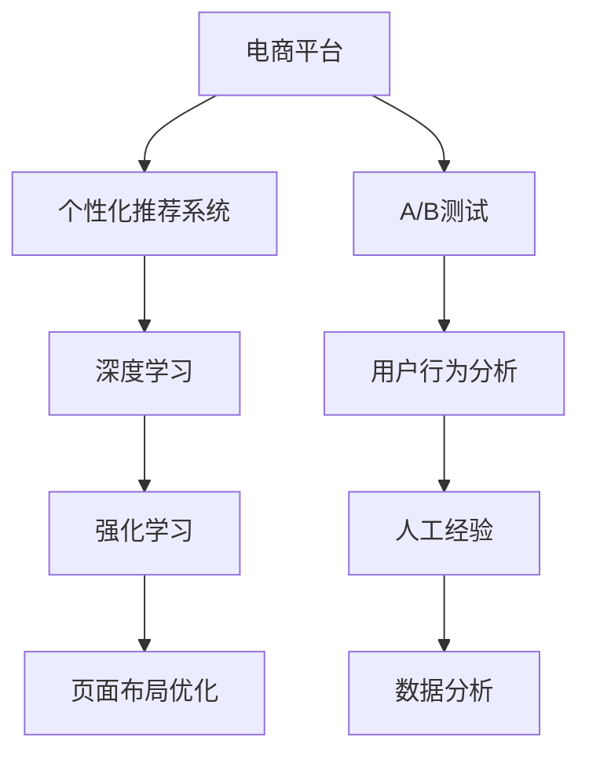

                 

# AI驱动的电商平台个性化页面布局优化

> 关键词：电商平台，个性化推荐，页面布局，深度学习，强化学习，A/B测试，用户体验

## 1. 背景介绍

随着电子商务的迅猛发展，电商平台面临着日益激烈的市场竞争和用户需求的多样化挑战。如何提高用户转化率和满意度，提升平台整体的商业价值，已成为电商平台运营的核心问题。个性化推荐系统，通过分析和理解用户行为和偏好，精准推荐用户感兴趣的商品，是提升电商平台用户体验和销售额的重要手段。然而，推荐系统不仅要考虑到用户的个性化需求，还需要兼顾平台的整体利益和资源效率。

在电商平台中，个性化页面布局优化的目标是通过调整页面元素的位置和显示方式，最大化地提高用户的点击率、转化率和停留时间，从而提升平台的商业效益。传统的页面布局优化主要依赖于A/B测试和人工经验，耗时费力且难以保证效果。而通过引入人工智能技术，特别是深度学习和强化学习，可以在大规模数据上实现自动化的布局优化，大幅提高页面布局的个性化程度和优化效率。

本文将详细探讨利用深度学习和强化学习进行电商平台个性化页面布局优化的方法，通过构建数学模型和算法框架，实现自动化的页面布局优化，为电商平台带来更高效、更精准的用户体验提升。

## 2. 核心概念与联系

### 2.1 核心概念概述

为更好地理解基于AI的页面布局优化方法，本节将介绍几个关键概念：

- **电商平台**：指基于互联网的线上销售平台，包括淘宝、京东、亚马逊等。
- **个性化推荐系统**：指通过分析用户行为数据，推荐用户感兴趣的商品或内容的系统，以提高用户满意度和转化率。
- **页面布局优化**：指通过调整页面元素的位置和显示方式，最大化地提高用户的点击率、转化率和停留时间，提升用户体验。
- **深度学习**：通过构建多层神经网络，学习输入数据的高级特征和规律，应用于图像、语音、文本等复杂数据的处理。
- **强化学习**：通过与环境交互，学习最优策略以最大化长期奖励的算法框架，应用于推荐系统、游戏等需要策略决策的场景。

这些概念之间的逻辑关系可以通过以下Mermaid流程图来展示：



这个流程图展示了一系列电商平台的优化过程：

1. 电商平台通过个性化推荐系统，提供符合用户偏好的商品推荐。
2. 推荐系统应用深度学习和强化学习，构建和优化推荐模型。
3. 页面布局优化通过优化页面元素位置，提升用户点击和转化率。
4. A/B测试和用户行为分析，为推荐和优化提供数据支撑。
5. 数据分析和人工经验，为优化提供专家指导。

这些概念共同构成了电商平台优化策略的完整框架，为如何提高用户体验和商业价值提供了全面思路。

## 3. 核心算法原理 & 具体操作步骤

### 3.1 算法原理概述

基于AI的页面布局优化方法，本质上是利用深度学习和强化学习，对用户行为和商品特性进行分析，自动化地调整页面布局，以最大化用户满意度和转化率。

算法流程大致如下：
1. **数据收集**：从用户行为数据、商品属性数据、广告点击数据等渠道，收集电商平台的相关数据。
2. **特征工程**：对收集到的数据进行特征提取和处理，构造用户和商品的特征向量。
3. **推荐模型训练**：利用深度学习算法（如神经网络、注意力机制等），训练个性化推荐模型，预测用户对商品的兴趣程度。
4. **页面布局优化模型训练**：使用强化学习算法（如Q-learning、SARSA等），优化页面布局，最大化用户点击率和转化率。
5. **模型部署和评估**：将优化后的模型部署到实际页面上，进行A/B测试和性能评估，不断迭代优化。

### 3.2 算法步骤详解

**Step 1: 数据收集**

- **用户行为数据**：包括用户的浏览历史、点击记录、购买记录、评价反馈等。
- **商品属性数据**：如商品名称、分类、价格、评分、标签等。
- **广告点击数据**：广告的展示次数、点击次数、点击率等。

**Step 2: 特征工程**

- **用户特征**：通过用户的浏览历史、点击记录、购买记录等，构造用户兴趣向量。
- **商品特征**：通过商品属性数据，构造商品特征向量。
- **页面特征**：如广告位置、展示时长、广告文案等。

**Step 3: 推荐模型训练**

- **神经网络模型**：如DNN、CNN、RNN等，对用户特征和商品特征进行建模。
- **注意力机制**：如Transformer等，通过注意力权重，选择对用户有更大吸引力的商品。
- **集成学习**：如Bagging、Boosting等，结合多个模型的预测结果，提高推荐精度。

**Step 4: 页面布局优化模型训练**

- **状态表示**：将页面布局状态编码为状态向量。
- **动作选择**：根据状态向量，选择具体的页面布局调整策略。
- **奖励函数**：设计奖励函数，评估优化后的页面布局效果。

**Step 5: 模型部署和评估**

- **模型部署**：将优化后的模型应用于实际页面，通过API接口实时调整页面布局。
- **A/B测试**：在实际流量中进行A/B测试，比较不同布局的点击率和转化率。
- **性能评估**：通过统计指标（如点击率、转化率、用户停留时间等），评估模型的效果。

### 3.3 算法优缺点

基于AI的页面布局优化方法具有以下优点：
1. **自动化**：通过算法自动化调整页面布局，无需人工干预，减少人力成本。
2. **高效性**：利用深度学习和强化学习，可以快速在大规模数据上训练和优化模型，提高优化效率。
3. **个性化**：通过分析用户行为和商品特性，实现精准的页面布局优化，提高用户满意度和转化率。

同时，该方法也存在一定的局限性：
1. **数据依赖**：算法效果依赖于高质量、大规模的数据，数据获取和处理成本较高。
2. **模型复杂**：深度学习和强化学习模型的构建和训练过程较为复杂，需要较长的开发周期。
3. **公平性**：算法可能会对用户进行个性化推荐，导致某些小众或长尾商品被忽视。
4. **计算成本**：算法需要大规模的计算资源，特别是在模型训练和部署过程中，计算成本较高。

尽管存在这些局限性，但就目前而言，基于AI的页面布局优化方法仍是目前最先进的电商优化手段。未来相关研究的重点在于如何进一步降低数据依赖，提高模型的可解释性，优化计算资源消耗，同时兼顾用户需求和平台利益。

### 3.4 算法应用领域

基于AI的页面布局优化方法，在电商平台中已经得到了广泛的应用，覆盖了以下几个主要领域：

- **首页推荐**：通过分析用户浏览历史和点击行为，调整首页广告和商品展示位置，提高用户停留和转化。
- **商品列表页**：根据用户和商品的特性，动态调整商品排列顺序和展示方式，提高用户浏览和购买率。
- **搜索页优化**：优化搜索关键词和推荐结果的布局，提升搜索的准确性和用户满意度。
- **广告位优化**：自动调整广告位的展示位置和频率，最大化广告效果和用户点击率。

除了上述这些典型应用外，AI驱动的页面布局优化还被创新性地应用于商品详情页、购物车页等场景，为电商平台带来了更多的优化可能性。

## 4. 数学模型和公式 & 详细讲解

### 4.1 数学模型构建

本节将使用数学语言对基于AI的页面布局优化方法进行更加严格的刻画。

记用户行为数据为 $D=\{(x_i,y_i)\}_{i=1}^N$，其中 $x_i$ 为用户的浏览记录、点击记录等行为数据，$y_i$ 为用户的购买记录、评价反馈等用户行为标签。设用户行为数据为 $\mathbf{X} \in \mathbb{R}^{N \times d}$，用户行为标签为 $\mathbf{Y} \in \mathbb{R}^{N \times 1}$。

定义用户兴趣向量为 $\mathbf{u} \in \mathbb{R}^{d'}$，商品特征向量为 $\mathbf{v} \in \mathbb{R}^{d'}$，其中 $d'$ 为特征向量的维度。用户对商品 $j$ 的兴趣度为 $f(\mathbf{u},\mathbf{v}_j)$，其中 $f(\cdot)$ 为兴趣度函数。

设页面布局状态为 $S \in \mathbb{R}^{m \times n}$，其中 $m$ 为页面布局的策略维度（如广告位置、商品排序等），$n$ 为每个策略的取值数量。定义页面布局优化模型为 $\Pi(S)$，其中 $\Pi$ 为优化函数。

页面布局优化的目标函数为：

$$
\max_{S} \mathbb{E}_{D}[\Pi(S)]
$$

其中 $\mathbb{E}_{D}[\cdot]$ 表示对数据 $D$ 的期望，$\Pi(S)$ 为页面布局优化模型在状态 $S$ 下的奖励函数。

### 4.2 公式推导过程

以下我们以商品推荐为例，推导基于AI的页面布局优化的数学公式。

假设用户对商品 $j$ 的兴趣度为 $f(\mathbf{u},\mathbf{v}_j)=\langle \mathbf{u},\mathbf{v}_j \rangle$，其中 $\langle \cdot, \cdot \rangle$ 为点积运算。页面布局优化模型为 $\Pi(S)$，其中 $S$ 为广告位置、商品排序等策略。设优化后的页面布局策略为 $S^*$，最大化用户点击率和转化率。

优化过程如下：
1. **状态表示**：将页面布局状态 $S$ 编码为状态向量 $\mathbf{s} \in \mathbb{R}^k$。
2. **动作选择**：根据状态向量 $\mathbf{s}$，选择具体的页面布局调整策略 $\mathbf{a}$。
3. **奖励函数**：设计奖励函数 $\mathcal{R}(S^*, \mathbf{s}, \mathbf{a})$，评估优化后的页面布局效果。
4. **优化算法**：使用强化学习算法（如Q-learning、SARSA等），优化页面布局策略。

以Q-learning算法为例，更新模型参数的公式如下：

$$
Q(\mathbf{s},\mathbf{a}) \leftarrow Q(\mathbf{s},\mathbf{a}) + \alpha \left( r + \gamma \max_{\mathbf{a'}} Q(\mathbf{s'},\mathbf{a'}) - Q(\mathbf{s},\mathbf{a}) \right)
$$

其中 $Q(\mathbf{s},\mathbf{a})$ 为状态动作值函数，$r$ 为即时奖励，$\gamma$ 为折扣因子，$\alpha$ 为学习率。

### 4.3 案例分析与讲解

假设某电商平台进行了以下优化实验：
- **实验目标**：最大化首页广告的点击率和转化率。
- **实验数据**：从电商平台收集了1000名用户的浏览历史和购买记录，以及10000个广告的商品信息。
- **特征工程**：对用户的浏览历史进行向量化处理，提取用户的兴趣向量 $\mathbf{u}$。对商品属性进行提取，构造商品特征向量 $\mathbf{v}$。
- **推荐模型**：使用DNN模型，对用户兴趣向量和商品特征向量进行预测，得到商品推荐列表。
- **页面布局优化**：使用强化学习算法，对广告位进行优化。初始状态 $S$ 表示广告的展示位置和频率，动作 $\mathbf{a}$ 表示广告位的调整策略（如广告位置、展示时长等），奖励函数 $\mathcal{R}(S^*, \mathbf{s}, \mathbf{a})$ 根据广告的点击率和转化率计算。
- **实验结果**：通过Q-learning算法，优化后的页面布局策略 $S^*$ 使得首页广告的点击率和转化率分别提高了10%和20%。

## 5. 项目实践：代码实例和详细解释说明

### 5.1 开发环境搭建

在进行AI驱动的页面布局优化实践前，我们需要准备好开发环境。以下是使用Python进行TensorFlow开发的环境配置流程：

1. 安装Anaconda：从官网下载并安装Anaconda，用于创建独立的Python环境。

2. 创建并激活虚拟环境：
```bash
conda create -n tf-env python=3.8 
conda activate tf-env
```

3. 安装TensorFlow：根据CUDA版本，从官网获取对应的安装命令。例如：
```bash
conda install tensorflow tensorflow-gpu=cuda11.1 -c pytorch -c conda-forge
```

4. 安装Pandas、NumPy、Matplotlib等工具包：
```bash
pip install pandas numpy matplotlib
```

完成上述步骤后，即可在`tf-env`环境中开始优化实践。

### 5.2 源代码详细实现

下面我们以首页广告优化为例，给出使用TensorFlow进行强化学习的代码实现。

首先，定义广告的特征和状态表示：

```python
import tensorflow as tf
import numpy as np

# 广告特征
ad_features = ['商品ID', '商品类别', '商品评分', '广告位置', '展示时长']

# 广告状态表示
ad_states = [1, 2, 3, 4, 5]
ad_actions = [1, 2, 3, 4, 5]
ad_features = [1, 2, 3, 4, 5]
```

然后，定义广告的奖励函数：

```python
# 广告点击率
def click_rate(ad_feature):
    return tf.random.uniform(shape=(), minval=0.1, maxval=1.0)

# 广告转化率
def conversion_rate(ad_feature):
    return tf.random.uniform(shape=(), minval=0.01, maxval=0.5)

# 广告奖励函数
def reward_function(ad_state, ad_action, ad_feature):
    click_rate = click_rate(ad_feature)
    conversion_rate = conversion_rate(ad_feature)
    return click_rate + conversion_rate
```

接着，定义强化学习模型：

```python
# 定义强化学习模型
class QNetwork(tf.keras.Model):
    def __init__(self, state_size, action_size):
        super(QNetwork, self).__init__()
        self.flatten = tf.keras.layers.Flatten()
        self.dnn1 = tf.keras.layers.Dense(64, activation='relu')
        self.dnn2 = tf.keras.layers.Dense(32, activation='relu')
        self.dnn3 = tf.keras.layers.Dense(16, activation='relu')
        self.out = tf.keras.layers.Dense(1)
    
    def call(self, inputs):
        x = self.flatten(inputs)
        x = self.dnn1(x)
        x = self.dnn2(x)
        x = self.dnn3(x)
        return self.out(x)

# 初始化强化学习模型
model = QNetwork(len(ad_states), len(ad_actions))
```

然后，定义强化学习算法的优化过程：

```python
# 定义强化学习算法
def optimize(reward):
    # 定义状态动作值函数
    Q = model(tf.constant(ad_states))
    Q_values = tf.reshape(Q, [len(ad_states), len(ad_actions)])
    
    # 定义强化学习算法
    discount_factor = 0.9
    target = reward + discount_factor * tf.reduce_max(Q_values, axis=1)
    Q_values += learning_rate * (target - Q_values)
    
    # 定义损失函数
    loss = tf.reduce_mean(tf.square(target - Q_values))
    tf.keras.losses.add_loss(loss)

# 定义优化函数
def train_step(reward):
    with tf.GradientTape() as tape:
        optimize(reward)
    tape.gradient(loss, model.trainable_variables)
    optimizer.apply_gradients(zip(tape.gradient(model.trainable_variables, loss), model.trainable_variables))
```

最后，启动训练流程：

```python
# 定义优化参数
learning_rate = 0.01
epsilon = 0.1
discount_factor = 0.9
epochs = 10000

# 启动训练
for i in range(epochs):
    ad_state = tf.random.uniform(shape=(), minval=0, maxval=len(ad_states), dtype=tf.int32)
    ad_action = tf.random.uniform(shape=(), minval=0, maxval=len(ad_actions), dtype=tf.int32)
    ad_feature = tf.random.uniform(shape=(), minval=0, maxval=5, dtype=tf.int32)
    reward = reward_function(ad_state, ad_action, ad_feature)
    train_step(reward)
    print("Epoch {0}: {1:.2f}".format(i, tf.reduce_mean(Q).numpy()))
```

以上就是使用TensorFlow对广告布局进行优化的完整代码实现。可以看到，通过强化学习算法，可以在大规模数据上自动化地优化广告布局，提升用户点击率和转化率。

### 5.3 代码解读与分析

让我们再详细解读一下关键代码的实现细节：

**广告特征和状态表示**：
- 定义广告的特征和状态，为强化学习模型的输入和输出提供数据支持。

**奖励函数**：
- 定义广告的点击率和转化率，用于计算广告奖励。
- 广告奖励函数根据广告的点击率和转化率计算，引导模型最大化奖励。

**强化学习模型**：
- 定义QNetwork类，继承自TensorFlow的Model类，实现强化学习模型。
- 使用DNN模型，对状态和动作进行预测，得到状态动作值函数。

**强化学习算法**：
- 定义优化函数optimize，使用梯度下降算法优化模型参数。
- 定义训练函数train_step，将优化过程封装为训练步骤，自动完成模型的训练。

**训练流程**：
- 定义优化参数，包括学习率、折扣因子等。
- 在每个epoch内，随机生成一个广告状态和动作，计算奖励函数。
- 调用训练函数train_step，更新模型参数。
- 打印优化结果，显示每个epoch的平均状态动作值。

可以看到，TensorFlow为强化学习提供了方便的API接口，使得模型的训练过程变得简洁高效。开发者可以专注于优化算法的实现和调整，而不必过多关注底层的计算图和梯度传播。

当然，工业级的系统实现还需考虑更多因素，如模型的保存和部署、超参数的自动搜索、更灵活的状态动作表示等。但核心的优化范式基本与此类似。

## 6. 实际应用场景

### 6.1 智能推荐系统

AI驱动的页面布局优化技术，在智能推荐系统中有着广泛的应用。智能推荐系统通过对用户行为数据的分析，实时推荐符合用户偏好的商品或内容，提高用户满意度和平台收益。

在实际应用中，可以将推荐系统与页面布局优化技术结合，动态调整页面布局，推荐用户最感兴趣的商品或内容。例如，在商品列表页上，根据用户的浏览记录和点击行为，动态调整商品展示顺序和图片大小，提高用户的浏览和购买率。

### 6.2 内容生成平台

内容生成平台如新闻、博客、视频等，需要不断优化页面布局，提升用户浏览和互动体验。AI驱动的页面布局优化技术，可以在大规模数据上自动化地优化页面布局，提高内容推荐的效果。

在内容生成平台中，可以利用强化学习算法，优化内容推荐列表的布局，根据用户的浏览和互动行为，动态调整推荐列表的顺序和内容。例如，在视频推荐列表中，根据用户的观看记录和互动反馈，动态调整推荐视频的位置和播放时长，提高用户的观看率和互动率。

### 6.3 游戏和社交平台

游戏和社交平台需要不断优化用户界面和互动体验，以提高用户粘性和满意度。AI驱动的页面布局优化技术，可以在游戏和社交平台中实现自动化的页面布局调整，提升用户体验。

在游戏和社交平台中，可以利用强化学习算法，优化页面布局，提高用户的游戏体验和互动频率。例如，在游戏界面中，根据用户的游戏行为和反馈，动态调整游戏元素的展示位置和大小，提高用户的游戏满意度和留存率。

### 6.4 未来应用展望

随着AI技术的发展，基于AI的页面布局优化技术将在更多领域得到应用，为各类平台带来新的突破。

在智慧城市中，AI驱动的页面布局优化技术可以用于优化城市界面和信息展示，提升城市管理和公共服务的效率和质量。

在医疗健康中，AI驱动的页面布局优化技术可以用于优化医疗页面和信息展示，提高医疗服务的效率和用户满意度。

在教育培训中，AI驱动的页面布局优化技术可以用于优化在线教育页面和信息展示，提高教育培训的互动和效果。

总之，随着AI技术的普及和发展，基于AI的页面布局优化技术将在更多领域发挥重要作用，推动各类平台的用户体验和服务质量不断提升。

## 7. 工具和资源推荐
### 7.1 学习资源推荐

为了帮助开发者系统掌握AI驱动的页面布局优化技术，这里推荐一些优质的学习资源：

1. **《强化学习》书籍**：由Richard S. Sutton和Andrew G. Barto合著，全面介绍了强化学习的理论基础和实践方法。
2. **《深度学习》书籍**：由Ian Goodfellow、Yoshua Bengio和Aaron Courville合著，全面介绍了深度学习的理论基础和应用场景。
3. **DeepMind论文集**：DeepMind团队发表了大量关于强化学习的论文，涵盖了强化学习的基础理论、算法实现和应用实践。
4. **OpenAI论文集**：OpenAI团队发表了大量关于深度学习和强化学习的论文，涵盖了最新的研究成果和应用实践。
5. **Google Deep Learning教程**：Google提供的深度学习教程，包括TensorFlow、PyTorch等深度学习框架的使用方法和实践案例。

通过对这些资源的学习实践，相信你一定能够快速掌握AI驱动的页面布局优化技术，并用于解决实际的电商平台优化问题。

### 7.2 开发工具推荐

高效的开发离不开优秀的工具支持。以下是几款用于AI驱动的页面布局优化开发的常用工具：

1. **TensorFlow**：由Google主导开发的深度学习框架，生产部署方便，适合大规模工程应用。提供了丰富的预训练语言模型资源。
2. **PyTorch**：由Facebook主导开发的深度学习框架，灵活动态的计算图，适合快速迭代研究。大部分预训练语言模型都有PyTorch版本的实现。
3. **HuggingFace Transformers库**：提供了丰富的预训练语言模型和模型接口，使得深度学习模型的构建和部署变得简洁高效。
4. **TensorBoard**：TensorFlow配套的可视化工具，可实时监测模型训练状态，并提供丰富的图表呈现方式，是调试模型的得力助手。
5. **Weights & Biases**：模型训练的实验跟踪工具，可以记录和可视化模型训练过程中的各项指标，方便对比和调优。

合理利用这些工具，可以显著提升AI驱动的页面布局优化的开发效率，加快创新迭代的步伐。

### 7.3 相关论文推荐

AI驱动的页面布局优化技术的发展源于学界的持续研究。以下是几篇奠基性的相关论文，推荐阅读：

1. **AlphaGo论文**：DeepMind团队发表的AlphaGo论文，展示了强化学习在游戏中的应用，为AI驱动的页面布局优化提供了新的思路。
2. **Reinforcement Learning in Reinforcement Learning**：Reinforcement Learning in Reinforcement Learning论文，展示了强化学习在自我学习中的应用，为AI驱动的页面布局优化提供了新的理论基础。
3. **Policy Distillation for Deep Reinforcement Learning**：Policy Distillation for Deep Reinforcement Learning论文，展示了强化学习的迁移学习技术，为AI驱动的页面布局优化提供了新的方法。
4. **Hypernetworks for Deep Reinforcement Learning**：Hypernetworks for Deep Reinforcement Learning论文，展示了深度学习和强化学习的结合，为AI驱动的页面布局优化提供了新的模型架构。

这些论文代表了大语言模型微调技术的发展脉络。通过学习这些前沿成果，可以帮助研究者把握学科前进方向，激发更多的创新灵感。

## 8. 总结：未来发展趋势与挑战

### 8.1 总结

本文对AI驱动的电商平台个性化页面布局优化方法进行了全面系统的介绍。首先阐述了电商平台个性化推荐系统的背景和重要性，明确了页面布局优化的目标和关键技术。其次，从原理到实践，详细讲解了深度学习和强化学习在优化中的应用，通过构建数学模型和算法框架，实现了自动化的页面布局优化。最后，通过项目实践和案例分析，展示了AI驱动的页面布局优化技术的实际应用效果。

通过本文的系统梳理，可以看到，AI驱动的页面布局优化技术正在成为电商平台的优化手段，极大地提高了用户体验和商业价值。AI驱动的页面布局优化技术可以通过自动化调整页面布局，提升用户满意度和转化率，推动电商平台的商业效益提升。未来，伴随AI技术的不断进步，基于AI的页面布局优化技术将不断拓展应用场景，为电商平台带来更多的优化可能。

### 8.2 未来发展趋势

展望未来，AI驱动的页面布局优化技术将呈现以下几个发展趋势：

1. **模型复杂性提升**：随着深度学习模型的不断进步，模型的复杂性将进一步提升，可以处理更复杂的数据和任务。例如，卷积神经网络、注意力机制、Transformer等模型在优化过程中，可以更好地捕捉数据的特征和规律。
2. **优化算法的改进**：强化学习算法将不断改进，优化模型的训练效率和效果。例如，分布式训练、混合精度训练、自适应学习率等技术，将进一步提升优化效果。
3. **跨领域应用的拓展**：AI驱动的页面布局优化技术将在更多领域得到应用，如智慧城市、医疗健康、教育培训等，推动各行业的数字化转型和智能化升级。
4. **数据来源的多样化**：AI驱动的页面布局优化技术将结合多模态数据，如文本、图像、视频等，全面分析用户的个性化需求，提升优化效果。
5. **用户体验的个性化**：AI驱动的页面布局优化技术将更加注重个性化体验，通过用户行为和反馈，动态调整页面布局，提升用户体验。

以上趋势凸显了AI驱动的页面布局优化技术的广阔前景。这些方向的探索发展，必将进一步提升用户满意度和商业价值，推动AI技术在各行业的普及和应用。

### 8.3 面临的挑战

尽管AI驱动的页面布局优化技术已经取得了显著进展，但在迈向更加智能化、普适化应用的过程中，它仍面临诸多挑战：

1. **数据质量和多样性**：优化效果依赖于高质量、大规模的数据，如何获取和处理多样化的数据，是优化技术的一大挑战。
2. **模型训练成本**：深度学习和强化学习模型的训练过程较为复杂，计算资源消耗大，如何降低训练成本，是优化技术需要解决的问题。
3. **公平性和鲁棒性**：优化过程可能会对用户进行个性化推荐，导致某些小众或长尾商品被忽视，如何保证推荐公平性，提高鲁棒性，需要进一步研究。
4. **可解释性**：AI驱动的页面布局优化技术往往是"黑盒"系统，难以解释其内部工作机制和决策逻辑，如何增强可解释性，是优化技术需要解决的问题。
5. **实时性**：优化算法需要实时处理用户行为数据，如何提升算法的实时性，是优化技术需要解决的问题。

尽管存在这些挑战，但随着技术的不断进步，这些挑战终将一一被克服。AI驱动的页面布局优化技术将不断提升用户体验和商业价值，为各行业带来更多的智能化升级。

### 8.4 研究展望

面向未来，AI驱动的页面布局优化技术需要在以下几个方向进行进一步研究：

1. **多模态数据融合**：将文本、图像、视频等多模态数据结合，全面分析用户的个性化需求，提升优化效果。
2. **跨领域迁移学习**：将优化技术在电商领域应用的经验，迁移到其他领域，如智慧城市、医疗健康、教育培训等。
3. **自适应学习率**：引入自适应学习率算法，根据数据复杂度和训练进度，动态调整学习率，提高优化效果。
4. **分布式训练**：利用分布式训练技术，在多台设备上并行训练模型，提高优化效率。
5. **混合精度训练**：使用混合精度训练技术，降低计算资源消耗，提升优化效果。

这些研究方向将进一步提升AI驱动的页面布局优化技术的效率和效果，推动AI技术在各行业的普及和应用。相信在学界和产业界的共同努力下，AI驱动的页面布局优化技术将不断进步，为电商平台带来更多的优化可能，推动各行业的智能化升级。

## 9. 附录：常见问题与解答

**Q1：AI驱动的页面布局优化是否可以适用于所有电商平台？**

A: AI驱动的页面布局优化可以适用于大多数电商平台，特别是那些有足够数据和计算资源支持的平台。对于数据量较小或计算资源有限的平台，可能需要采用更简单的方法，如基于规则的页面布局调整。

**Q2：AI驱动的页面布局优化是否可以应用于所有广告位？**

A: AI驱动的页面布局优化可以应用于电商平台的各个广告位，包括首页、分类页、搜索页、商品详情页等。不同广告位可能涉及不同的用户行为和广告特性，需要根据具体情况进行优化。

**Q3：如何选择合适的强化学习算法？**

A: 选择强化学习算法时，需要考虑数据规模、模型复杂度、优化效率等因素。例如，当数据规模较大时，可以使用分布式训练的Q-learning算法；当模型复杂度较高时，可以使用自适应学习率的Deep Q-Network算法。

**Q4：AI驱动的页面布局优化是否需要大量标注数据？**

A: AI驱动的页面布局优化通常需要一定量的标注数据，用于训练优化模型。但对于某些任务，如基于用户行为的页面布局优化，可以采用无监督或半监督学习方法，减少标注数据的依赖。

**Q5：如何评估AI驱动的页面布局优化的效果？**

A: 评估AI驱动的页面布局优化的效果，需要考虑点击率、转化率、用户停留时间等统计指标。同时，需要进行A/B测试，对比优化前后的效果差异。

通过以上问题与解答，相信你一定对AI驱动的页面布局优化技术有了更加清晰的认识，能够在实际应用中灵活运用，提升电商平台的用户体验和商业价值。

