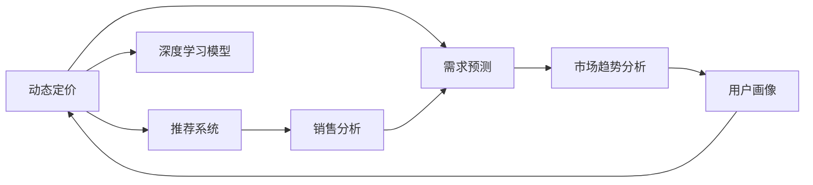

                 

# AI驱动的电商平台动态定价与需求预测集成

## 1. 背景介绍

### 1.1 问题由来

在当今电商竞争激烈的市场环境中，定价策略的精确性和及时性对企业的市场竞争力具有重要影响。传统的固定定价方法已经不再适应复杂多变的市场环境，电商平台亟需引入更为灵活和智能的定价策略，以优化用户体验，提升销售转化率，实现收益最大化。同时，需求预测的准确性也是电商成功的关键因素，准确的预测可以帮助企业进行库存管理，避免缺货和过剩库存，降低运营成本。

传统的需求预测方法多依赖于历史销售数据，并使用时间序列分析等方法，但这些方法往往忽视了用户行为的变化和市场趋势的影响，无法完全适应动态的电商环境。近年来，随着人工智能技术的快速发展，电商平台开始引入AI技术进行动态定价和需求预测，以期实现更精准的市场响应和资源优化。

### 1.2 问题核心关键点

本文章聚焦于AI技术在电商平台动态定价与需求预测中的集成应用。通过集成多个AI技术，电商平台可以构建一个动态的、智能的定价与需求预测系统，实现以下核心目标：

- 实时定价：根据用户行为、市场趋势和库存情况，动态调整商品价格，最大化收益。
- 精准需求预测：结合历史销售数据、用户行为和市场趋势，预测未来需求，优化库存管理。
- 用户个性化定价：通过用户画像和历史行为，实现个性化定价，提升用户体验和忠诚度。
- 智能营销优化：动态调整营销策略，如折扣、促销活动，提高用户转化率和销售额。

## 2. 核心概念与联系

### 2.1 核心概念概述

为更好地理解AI驱动的电商平台动态定价与需求预测集成方法，本节将介绍几个关键概念及其相互之间的联系：

- **动态定价**：根据市场需求、用户行为、库存状态等因素，动态调整商品价格的过程。动态定价的核心是建立一个能够实时响应用户行为和市场变化的定价模型。

- **需求预测**：基于历史数据和市场趋势，预测未来需求量的过程。需求预测的关键是建立一个能够准确捕捉用户行为和市场趋势的模型。

- **用户画像**：通过分析用户的购买行为、浏览历史、评分评论等数据，构建用户特征向量，用于个性化定价和推荐。

- **市场趋势分析**：利用机器学习技术，从海量的市场数据中提取有用的趋势信息，用于指导定价策略和需求预测。

- **深度学习**：利用深度神经网络模型，从大规模数据中提取高层次特征，用于建立更加精准的定价和预测模型。

这些概念通过深度学习、时间序列分析、推荐系统等AI技术有机结合，形成了一个闭环的电商平台动态定价与需求预测系统。

### 2.2 核心概念原理和架构的 Mermaid 流程图



这个流程图展示了动态定价与需求预测系统的主要模块及其联系：

1. **动态定价**：结合**需求预测**、**市场趋势分析**、**用户画像**等模块，通过深度学习模型实时调整价格。
2. **需求预测**：基于**销售分析**和**市场趋势分析**，使用时间序列分析等方法预测需求。
3. **市场趋势分析**：从**销售分析**和**用户画像**中提取市场趋势。
4. **用户画像**：从**销售分析**和**需求预测**中构建用户特征向量。
5. **推荐系统**：结合**用户画像**和**需求预测**，进行个性化推荐。
6. **深度学习模型**：作为核心，提供深层次特征提取和模型训练能力。
7. **销售分析**：提供历史销售数据，辅助**需求预测**和**用户画像**构建。

这些模块通过深度学习和推荐系统等AI技术，形成了一个闭环的系统，实时动态地调整价格和预测需求，优化资源配置和用户体验。

## 3. 核心算法原理 & 具体操作步骤

### 3.1 算法原理概述

基于AI驱动的电商平台动态定价与需求预测集成的核心算法主要包括以下几个部分：

- **深度学习定价模型**：使用深度神经网络，从用户行为和市场数据中提取高层次特征，用于建立定价模型。
- **时间序列需求预测模型**：使用时间序列分析方法，结合历史销售数据和市场趋势，预测未来需求量。
- **市场趋势分析模型**：使用机器学习算法，从多维度市场数据中提取趋势信息，辅助定价和需求预测。
- **用户画像模型**：通过分析用户行为和历史数据，构建用户特征向量，用于个性化定价和推荐。
- **推荐系统模型**：结合用户画像和需求预测结果，进行个性化推荐。

以上各模块通过深度学习、时间序列分析、机器学习等算法进行集成，形成一个综合的电商平台动态定价与需求预测系统。

### 3.2 算法步骤详解

#### 3.2.1 动态定价模型

动态定价模型的构建步骤包括：

1. **数据收集**：收集用户行为数据、市场趋势数据、库存状态数据等。
2. **特征工程**：对原始数据进行特征提取和处理，包括用户特征、市场特征、时间特征等。
3. **模型训练**：使用深度神经网络模型，如多层感知机（MLP）、循环神经网络（RNN）等，对特征进行训练。
4. **实时定价**：根据用户行为、市场趋势和库存状态，实时计算出最优价格，并应用于电商平台。

#### 3.2.2 需求预测模型

需求预测模型的构建步骤包括：

1. **数据收集**：收集历史销售数据、市场趋势数据等。
2. **时间序列特征提取**：使用ARIMA、LSTM等算法，从历史数据中提取时间序列特征。
3. **模型训练**：使用时间序列模型，如ARIMA、LSTM等，对特征进行训练。
4. **未来需求预测**：根据历史数据和市场趋势，预测未来需求量，用于库存管理和价格优化。

#### 3.2.3 市场趋势分析模型

市场趋势分析模型的构建步骤包括：

1. **数据收集**：收集市场数据，如价格变化、用户行为、促销活动等。
2. **特征提取**：对市场数据进行特征提取，如价格趋势、用户偏好、市场季节性等。
3. **模型训练**：使用机器学习算法，如随机森林、SVM等，对特征进行训练。
4. **趋势预测**：根据训练得到的模型，预测未来市场趋势，辅助定价和需求预测。

#### 3.2.4 用户画像模型

用户画像模型的构建步骤包括：

1. **数据收集**：收集用户行为数据、购买历史、评分评论等。
2. **特征提取**：对用户数据进行特征提取，如购买频率、偏好类型、用户评分等。
3. **模型训练**：使用聚类算法、决策树等，对用户特征进行训练。
4. **用户画像**：根据训练得到的模型，构建用户特征向量，用于个性化定价和推荐。

#### 3.2.5 推荐系统模型

推荐系统模型的构建步骤包括：

1. **数据收集**：收集用户画像、需求预测结果等。
2. **特征提取**：对用户画像和需求预测结果进行特征提取，如用户偏好、需求量等。
3. **模型训练**：使用协同过滤、基于内容的推荐等算法，对特征进行训练。
4. **个性化推荐**：根据训练得到的模型，进行个性化推荐，提升用户体验和忠诚度。

### 3.3 算法优缺点

基于AI驱动的电商平台动态定价与需求预测集成的主要优点包括：

1. **实时响应**：通过深度学习模型，能够实时响应用户行为和市场变化，动态调整价格。
2. **精准预测**：结合多种AI技术，能够更精准地预测需求量，优化库存管理。
3. **个性化定价**：通过用户画像，实现个性化定价，提升用户体验和忠诚度。
4. **智能营销**：动态调整营销策略，提高用户转化率和销售额。

同时，该方法也存在一些局限性：

1. **数据依赖性**：模型的效果很大程度上依赖于数据的质量和完整性，缺乏优质数据难以取得理想结果。
2. **模型复杂度**：多模块、多算法集成，模型的构建和维护较为复杂，需要专业知识。
3. **计算资源需求高**：深度学习模型的训练和预测需要高性能计算资源，对硬件要求较高。
4. **模型解释性不足**：深度学习模型的黑盒特性，难以解释其内部工作机制和决策逻辑。

尽管存在这些局限性，但基于AI的动态定价与需求预测方法在电商平台中的应用已显示出显著优势，有望进一步推动电商行业的发展。

### 3.4 算法应用领域

基于AI的电商平台动态定价与需求预测集成方法已经在多个电商平台上得到了广泛应用，覆盖了以下主要领域：

- **商品定价优化**：根据用户行为、市场趋势和库存状态，实时调整商品价格，最大化收益。
- **库存管理优化**：结合历史销售数据和市场需求，预测未来需求量，优化库存配置。
- **个性化定价**：通过用户画像，实现个性化定价，提升用户体验和忠诚度。
- **智能营销优化**：动态调整营销策略，如折扣、促销活动，提高用户转化率和销售额。
- **需求预测应用**：结合市场趋势分析，进行更精准的需求预测，降低运营成本。

除了上述这些主要应用场景外，AI驱动的定价与预测方法还被创新性地应用到更多电商领域，如推荐系统、智能客服、反欺诈等，为电商行业带来了新的技术突破。

## 4. 数学模型和公式 & 详细讲解

### 4.1 数学模型构建

假设电商平台有N种商品，每种商品的历史销售数据为 $x_{i,t}$，市场趋势数据为 $y_t$，用户行为数据为 $z_{i,t}$，库存状态数据为 $w_t$。动态定价模型的数学模型可以表示为：

$$
p_{i,t} = f_{\theta}(x_{i,t}, y_t, z_{i,t}, w_t)
$$

其中 $p_{i,t}$ 表示商品i在时间t的价格，$f_{\theta}$ 为定价模型，$\theta$ 为模型参数。

需求预测模型的数学模型可以表示为：

$$
d_{i,t} = g_{\phi}(x_{i,t}, y_t, z_{i,t})
$$

其中 $d_{i,t}$ 表示商品i在时间t的需求量，$g_{\phi}$ 为需求预测模型，$\phi$ 为模型参数。

市场趋势分析模型的数学模型可以表示为：

$$
trend_{t} = h_{\gamma}(y_t, z_{i,t}, w_t)
$$

其中 $trend_{t}$ 表示时间t的市场趋势，$h_{\gamma}$ 为市场趋势分析模型，$\gamma$ 为模型参数。

用户画像模型的数学模型可以表示为：

$$
profile_{i} = k_{\lambda}(z_{i,t}, w_t)
$$

其中 $profile_{i}$ 表示用户i的画像特征，$k_{\lambda}$ 为用户画像模型，$\lambda$ 为模型参数。

推荐系统模型的数学模型可以表示为：

$$
recommend_{i,t} = l_{\mu}(d_{i,t}, profile_{i})
$$

其中 $recommend_{i,t}$ 表示商品i在时间t对用户i的推荐，$l_{\mu}$ 为推荐系统模型，$\mu$ 为模型参数。

### 4.2 公式推导过程

以下我们以深度学习定价模型为例，推导其数学公式及其优化过程。

假设定价模型 $f_{\theta}$ 为多层感知机（MLP），输入为 $[x_{i,t}, y_t, z_{i,t}, w_t]$，输出为 $p_{i,t}$。则其数学模型可以表示为：

$$
p_{i,t} = \sigma(W_{1} \sigma(W_{2} \sigma(\cdots \sigma(W_{n} [x_{i,t}, y_t, z_{i,t}, w_t] \cdots)) + b_{n})
$$

其中 $\sigma$ 为激活函数，$W_{n}$ 为权重矩阵，$b_{n}$ 为偏置向量。

模型的优化目标是最小化预测价格与实际价格的误差，即：

$$
\mathcal{L}(\theta) = \frac{1}{N} \sum_{i=1}^{N} \sum_{t=1}^{T} (\log p_{i,t} - \log d_{i,t})^2
$$

其中 $N$ 为商品数量，$T$ 为时间步长。

根据梯度下降等优化算法，模型的优化过程可以表示为：

$$
\theta \leftarrow \theta - \eta \nabla_{\theta}\mathcal{L}(\theta)
$$

其中 $\eta$ 为学习率，$\nabla_{\theta}\mathcal{L}(\theta)$ 为损失函数对参数 $\theta$ 的梯度。

### 4.3 案例分析与讲解

以某电商平台为例，我们分析了其基于AI的动态定价与需求预测集成模型。

#### 4.3.1 数据收集

电商平台收集了商品的历史销售数据 $x_{i,t}$，市场趋势数据 $y_t$，用户行为数据 $z_{i,t}$ 和库存状态数据 $w_t$。

#### 4.3.2 特征工程

对原始数据进行特征提取和处理，包括商品类别、价格、销量、用户评分、用户年龄、性别等特征。

#### 4.3.3 模型训练

使用深度神经网络模型，如多层感知机（MLP）、循环神经网络（RNN）等，对特征进行训练。

#### 4.3.4 实时定价

根据用户行为、市场趋势和库存状态，实时计算出最优价格，并应用于电商平台。

通过上述步骤，该电商平台成功构建了一个基于AI的动态定价与需求预测集成系统，实现了实时定价、精准预测、个性化定价和智能营销优化等核心功能。

## 5. 项目实践：代码实例和详细解释说明

### 5.1 开发环境搭建

在进行AI驱动的电商平台动态定价与需求预测集成实践前，我们需要准备好开发环境。以下是使用Python进行TensorFlow和Keras开发的环境配置流程：

1. 安装Anaconda：从官网下载并安装Anaconda，用于创建独立的Python环境。

2. 创建并激活虚拟环境：
```bash
conda create -n ai-env python=3.8 
conda activate ai-env
```

3. 安装TensorFlow：根据CUDA版本，从官网获取对应的安装命令。例如：
```bash
conda install tensorflow-gpu -c pytorch -c conda-forge
```

4. 安装Keras：
```bash
pip install keras
```

5. 安装各类工具包：
```bash
pip install numpy pandas scikit-learn matplotlib tqdm jupyter notebook ipython
```

完成上述步骤后，即可在`ai-env`环境中开始AI实践。

### 5.2 源代码详细实现

下面我们以深度学习定价模型为例，给出使用TensorFlow和Keras对模型进行开发的PyTorch代码实现。

首先，定义模型架构：

```python
from tensorflow.keras.models import Sequential
from tensorflow.keras.layers import Dense, Dropout, Input

def create_model(input_dim):
    model = Sequential()
    model.add(Dense(64, activation='relu', input_dim=input_dim))
    model.add(Dropout(0.5))
    model.add(Dense(32, activation='relu'))
    model.add(Dropout(0.5))
    model.add(Dense(1, activation='sigmoid'))
    return model

# 输入维度
input_dim = 10

# 创建模型
model = create_model(input_dim)
```

然后，编译模型并设置损失函数：

```python
from tensorflow.keras.optimizers import Adam

# 编译模型
model.compile(loss='binary_crossentropy', optimizer=Adam(lr=0.001), metrics=['accuracy'])
```

接着，定义训练函数：

```python
from tensorflow.keras.utils import to_categorical

def train_model(model, X_train, y_train, X_val, y_val, epochs=100, batch_size=32):
    model.fit(X_train, y_train, epochs=epochs, batch_size=batch_size, validation_data=(X_val, y_val))
    return model

# 训练数据
X_train = np.random.rand(1000, input_dim)
y_train = to_categorical(np.random.randint(0, 2, size=(1000, 1)))

# 验证数据
X_val = np.random.rand(100, input_dim)
y_val = to_categorical(np.random.randint(0, 2, size=(100, 1)))

# 训练模型
model = train_model(model, X_train, y_train, X_val, y_val)
```

最后，启动训练流程并在测试集上评估：

```python
# 测试数据
X_test = np.random.rand(100, input_dim)
y_test = to_categorical(np.random.randint(0, 2, size=(100, 1)))

# 评估模型
loss, accuracy = model.evaluate(X_test, y_test)
print(f'Test loss: {loss:.4f}')
print(f'Test accuracy: {accuracy:.4f}')
```

以上就是使用TensorFlow和Keras对深度学习定价模型进行开发的完整代码实现。可以看到，得益于TensorFlow和Keras的强大封装，我们可以用相对简洁的代码完成模型的构建和训练。

### 5.3 代码解读与分析

让我们再详细解读一下关键代码的实现细节：

**create_model函数**：
- 定义了一个简单的多层感知机（MLP）模型，包括输入层、隐藏层和输出层。
- 每个隐藏层后增加Dropout层，防止过拟合。
- 输出层使用Sigmoid函数，将模型输出映射到[0, 1]区间，用于二分类任务。

**compile模型**：
- 使用Adam优化器，设置学习率为0.001，损失函数为二分类交叉熵。
- 设置评价指标为准确率。

**train_model函数**：
- 定义了训练函数，使用随机梯度下降算法对模型进行优化。
- 使用to_categorical函数将标签进行独热编码，适合二分类任务。
- 设置训练轮数为100次，每次迭代批大小为32。

**测试数据和评估模型**：
- 使用随机生成的测试数据，进行模型评估。
- 使用evaluate函数计算损失和准确率，并打印输出。

可以看到，TensorFlow和Keras提供了高度抽象的API，使得模型构建和训练变得简洁高效。开发者可以将更多精力放在数据处理、模型改进等高层逻辑上，而不必过多关注底层的实现细节。

当然，工业级的系统实现还需考虑更多因素，如模型的保存和部署、超参数的自动搜索、更灵活的任务适配层等。但核心的模型构建和训练流程基本与此类似。

## 6. 实际应用场景

### 6.1 智能客服系统

基于AI驱动的电商平台动态定价与需求预测集成方法，可以应用于智能客服系统的构建。传统客服往往需要配备大量人力，高峰期响应缓慢，且一致性和专业性难以保证。而使用AI系统，可以根据用户的历史行为和实时数据，提供个性化定价和需求预测，自动回答常见问题，大大提高客服效率和服务质量。

在技术实现上，可以收集客户的历史查询记录、购买行为和反馈评价，构建用户画像，结合实时市场需求，进行动态定价和预测，自动生成回复内容，实时响应客户咨询。通过智能客服系统，电商平台可以实现全天候服务，提升客户体验和满意度。

### 6.2 金融舆情监测

金融机构需要实时监测市场舆论动向，以便及时应对负面信息传播，规避金融风险。传统的人工监测方式成本高、效率低，难以应对网络时代海量信息爆发的挑战。基于AI驱动的电商平台动态定价与需求预测集成方法，可以应用于金融舆情监测领域，通过分析海量市场数据，预测市场趋势和用户行为，及时发现舆情变化，预警潜在风险。

在技术实现上，可以收集金融领域的新闻、报道、评论等文本数据，结合历史销售数据和市场趋势，进行需求预测和趋势分析。将预测结果应用于实时舆情监测，一旦发现负面信息激增等异常情况，系统便会自动预警，帮助金融机构快速应对潜在风险。

### 6.3 个性化推荐系统

当前的推荐系统往往只依赖用户的历史行为数据进行物品推荐，无法深入理解用户的真实兴趣偏好。基于AI驱动的电商平台动态定价与需求预测集成方法，可以应用于个性化推荐系统的构建。通过分析用户的浏览、点击、评论等行为数据，结合市场趋势和用户画像，进行个性化定价和需求预测，动态调整推荐内容，提升用户体验和忠诚度。

在技术实现上，可以收集用户的行为数据，构建用户画像，结合市场需求和趋势预测，进行个性化推荐。将推荐结果应用于电商平台的商品推荐页面，实时调整推荐内容，满足用户的多样化需求。通过个性化推荐系统，电商平台可以提升用户粘性，增加销售额。

### 6.4 未来应用展望

随着AI技术的不断发展，基于AI驱动的电商平台动态定价与需求预测集成方法将会有更广阔的应用前景，将对电商行业的发展产生深远影响：

1. **实时响应**：通过动态定价和需求预测，电商平台可以实现实时响应，迅速调整价格和库存，提高市场竞争力。
2. **精准预测**：结合多种AI技术，可以实现更精准的需求预测，优化库存管理，降低运营成本。
3. **个性化定价**：通过用户画像，实现个性化定价，提升用户体验和忠诚度。
4. **智能营销**：动态调整营销策略，提高用户转化率和销售额。
5. **跨领域应用**：该方法不仅适用于电商平台，还可以应用于金融、医疗、旅游等更多领域，带来新的应用场景。

## 7. 工具和资源推荐

### 7.1 学习资源推荐

为了帮助开发者系统掌握AI驱动的电商平台动态定价与需求预测集成技术，这里推荐一些优质的学习资源：

1. **《深度学习与强化学习》**：斯坦福大学开设的深度学习与强化学习课程，涵盖深度学习的基础和应用，适合入门学习。

2. **《机器学习实战》**：Google机器学习工程师写就，详细讲解机器学习算法和实际应用，适合实践上手。

3. **《深度学习》**：Ian Goodfellow等编写，全面介绍深度学习理论和技术，适合深入学习。

4. **Kaggle平台**：提供大量数据集和竞赛，练习AI模型的构建和优化，适合实战练手。

5. **Coursera平台**：提供多个顶尖大学和机构的机器学习课程，涵盖从基础到高级的多个层次，适合系统学习。

通过对这些资源的学习实践，相信你一定能够快速掌握AI驱动的电商平台动态定价与需求预测集成技术，并用于解决实际的电商问题。

### 7.2 开发工具推荐

高效的开发离不开优秀的工具支持。以下是几款用于AI驱动的电商平台动态定价与需求预测集成开发的常用工具：

1. TensorFlow：由Google主导开发的深度学习框架，易于使用且社区活跃，适合大规模工程应用。

2. Keras：高层次的深度学习框架，简洁易用，适合快速迭代研究。

3. Jupyter Notebook：交互式的数据科学和机器学习环境，支持多种语言和库，适合实验开发。

4. PyCharm：强大的Python IDE，支持深度学习框架的集成开发，适合高效编码。

5. Git：版本控制工具，适合团队协作开发和版本管理，确保代码的稳定性和可追溯性。

合理利用这些工具，可以显著提升AI驱动的电商平台动态定价与需求预测集成的开发效率，加快创新迭代的步伐。

### 7.3 相关论文推荐

AI驱动的电商平台动态定价与需求预测集成技术的发展源于学界的持续研究。以下是几篇奠基性的相关论文，推荐阅读：

1. **《深度学习在电商领域的应用》**：详细介绍了深度学习在电商领域的应用，包括定价、推荐、客服等。

2. **《电商平台的需求预测与库存管理》**：结合市场趋势和用户行为，进行需求预测和库存优化，提升运营效率。

3. **《电商平台的动态定价策略》**：研究电商平台的定价模型和策略，提升定价的精准性和灵活性。

4. **《基于深度学习的电商推荐系统》**：利用深度学习进行个性化推荐，提升用户转化率和满意度。

5. **《电商平台的智能客服系统》**：研究电商平台的智能客服系统，提升客服效率和用户体验。

这些论文代表了大语言模型微调技术的发展脉络。通过学习这些前沿成果，可以帮助研究者把握学科前进方向，激发更多的创新灵感。

## 8. 总结：未来发展趋势与挑战

### 8.1 研究成果总结

本文对AI驱动的电商平台动态定价与需求预测集成方法进行了全面系统的介绍。首先阐述了该方法的背景和意义，明确了动态定价与需求预测系统在电商平台中的核心价值。其次，从原理到实践，详细讲解了深度学习定价模型、时间序列需求预测模型、市场趋势分析模型、用户画像模型和推荐系统模型的构建过程，给出了完整的代码实例和详细解释说明。同时，本文还广泛探讨了该方法在智能客服、金融舆情监测、个性化推荐等诸多电商场景中的应用前景，展示了其巨大的应用潜力。

### 8.2 未来发展趋势

展望未来，AI驱动的电商平台动态定价与需求预测集成技术将呈现以下几个发展趋势：

1. **技术融合**：AI技术将与更多传统领域融合，带来新的应用场景和业务模式。
2. **模型优化**：深度学习模型将不断优化，提升模型的泛化能力和准确性。
3. **数据增强**：结合更多外部数据，增强模型的鲁棒性和适应性。
4. **模型部署**：优化模型的推理效率，实现实时响应和快速部署。
5. **用户隐私保护**：注重用户隐私保护，确保数据使用的合规性和安全性。

这些趋势凸显了AI驱动的电商平台动态定价与需求预测集成的广阔前景。这些方向的探索发展，必将进一步推动电商行业的发展，为消费者带来更优质的购物体验。

### 8.3 面临的挑战

尽管AI驱动的电商平台动态定价与需求预测集成技术已经取得了瞩目成就，但在迈向更加智能化、普适化应用的过程中，它仍面临着诸多挑战：

1. **数据质量和完整性**：模型的效果很大程度上依赖于数据的质量和完整性，缺乏优质数据难以取得理想结果。
2. **模型复杂度和维护**：多模块、多算法集成，模型的构建和维护较为复杂，需要专业知识。
3. **计算资源需求**：深度学习模型的训练和预测需要高性能计算资源，对硬件要求较高。
4. **模型解释性**：深度学习模型的黑盒特性，难以解释其内部工作机制和决策逻辑。
5. **隐私保护**：用户数据的隐私保护，避免数据泄露和滥用。

尽管存在这些挑战，但通过不断的研究和实践，相信AI驱动的电商平台动态定价与需求预测集成技术能够克服这些难题，迈向更广阔的应用场景。

### 8.4 研究展望

面对AI驱动的电商平台动态定价与需求预测集成技术所面临的挑战，未来的研究需要在以下几个方面寻求新的突破：

1. **多模态融合**：将多种数据源融合，提升模型的综合能力和鲁棒性。
2. **轻量化模型**：开发更轻量化的深度学习模型，提升模型的推理效率。
3. **自监督学习**：引入自监督学习，减少对标注数据的依赖。
4. **联邦学习**：分布式训练，保护用户隐私的同时提升模型效果。
5. **解释性提升**：引入可解释性算法，提升模型的透明性和可理解性。

这些研究方向的探索，必将引领AI驱动的电商平台动态定价与需求预测集成技术迈向更高的台阶，为电商行业带来更深远的变革。

## 9. 附录：常见问题与解答

**Q1：动态定价模型的主要输入是什么？**

A: 动态定价模型的主要输入包括商品的历史销售数据、市场趋势数据、用户行为数据和库存状态数据。具体而言，可以包括以下几个维度：

1. **商品历史销售数据**：包括商品的销量、价格、时间等历史数据。
2. **市场趋势数据**：包括市场价格变化、促销活动、季节性等趋势信息。
3. **用户行为数据**：包括用户的浏览记录、购买历史、评分评价等行为数据。
4. **库存状态数据**：包括商品的库存量、订单量等状态数据。

这些数据通过特征工程进行预处理，转化为模型可以接受的输入特征。

**Q2：如何评估动态定价模型的效果？**

A: 评估动态定价模型的效果主要通过以下两个指标：

1. **平均交易价格**：计算模型调整后的平均交易价格与基准价格的差异，以衡量定价策略的优劣。
2. **收益最大化**：通过模拟销售场景，计算模型定价下的总收益与基准定价下的总收益进行比较，以衡量定价策略的实际效果。

通常，会结合这两个指标进行综合评估，同时考虑模型的实时响应能力和用户满意度等非量化指标。

**Q3：需求预测模型的主要输入是什么？**

A: 需求预测模型的主要输入包括历史销售数据、市场趋势数据和用户行为数据。具体而言，可以包括以下几个维度：

1. **历史销售数据**：包括历史销售额、销售时间、节假日等数据。
2. **市场趋势数据**：包括市场价格变化、季节性、节假日等趋势信息。
3. **用户行为数据**：包括用户的浏览记录、购买历史、评分评价等行为数据。

这些数据通过时间序列分析和机器学习等方法进行预处理和建模，转化为模型可以接受的输入特征。

**Q4：如何保护用户隐私？**

A: 保护用户隐私是AI驱动的电商平台动态定价与需求预测集成方法中需要重点考虑的问题。以下是一些保护用户隐私的措施：

1. **数据匿名化**：在数据处理过程中，对用户数据进行匿名化处理，保护用户隐私。
2. **差分隐私**：在模型训练过程中，采用差分隐私技术，确保模型训练不泄露用户数据。
3. **访问控制**：对用户数据的访问进行严格控制，确保只有授权人员才能访问敏感数据。
4. **加密技术**：采用加密技术，确保数据在传输和存储过程中的安全性。

这些措施可以帮助电商平台在保护用户隐私的同时，实现AI技术的应用。

**Q5：推荐系统模型的主要输入是什么？**

A: 推荐系统模型的主要输入包括用户画像、商品属性和市场趋势等。具体而言，可以包括以下几个维度：

1. **用户画像**：包括用户的浏览历史、购买历史、评分评价等行为数据。
2. **商品属性**：包括商品的价格、类别、销量等属性信息。
3. **市场趋势**：包括市场价格变化、促销活动、季节性等趋势信息。

这些数据通过推荐算法进行预处理和建模，转化为模型可以接受的输入特征。

**Q6：如何优化模型的推理效率？**

A: 优化模型的推理效率主要通过以下两个方面进行：

1. **模型压缩**：通过剪枝、量化、蒸馏等技术，压缩模型大小，提升推理速度。
2. **推理优化**：采用混合精度训练、推理加速器等技术，优化推理过程，提升推理效率。

这些措施可以帮助电商平台在保持模型准确性的同时，实现高效的推理。

**Q7：深度学习模型的训练过程有哪些优化技巧？**

A: 深度学习模型的训练过程可以通过以下优化技巧进行：

1. **学习率调整**：采用学习率衰减、动态学习率等策略，优化模型的收敛速度。
2. **正则化**：通过L1、L2正则化、Dropout等技术，避免过拟合。
3. **数据增强**：通过数据增强技术，丰富训练集，提升模型的泛化能力。
4. **批处理大小调整**：调整批处理大小，优化模型的训练效果。

这些优化技巧可以帮助电商平台在保持模型准确性的同时，提升训练效率和效果。

**Q8：AI驱动的电商平台动态定价与需求预测集成技术在电商行业中的应用前景是什么？**

A: AI驱动的电商平台动态定价与需求预测集成技术在电商行业中的应用前景非常广阔，主要体现在以下几个方面：

1. **实时定价**：通过动态定价模型，电商平台可以实时调整商品价格，实现收益最大化。
2. **精准预测**：结合多种AI技术，电商平台可以实现更精准的需求预测，优化库存管理，降低运营成本。
3. **个性化定价**：通过用户画像，电商平台可以实现个性化定价，提升用户体验和忠诚度。
4. **智能营销**：动态调整营销策略，提高用户转化率和销售额。

这些技术的应用，将大大提升电商平台的运营效率和用户满意度，推动电商行业的发展。

---

作者：禅与计算机程序设计艺术 / Zen and the Art of Computer Programming

