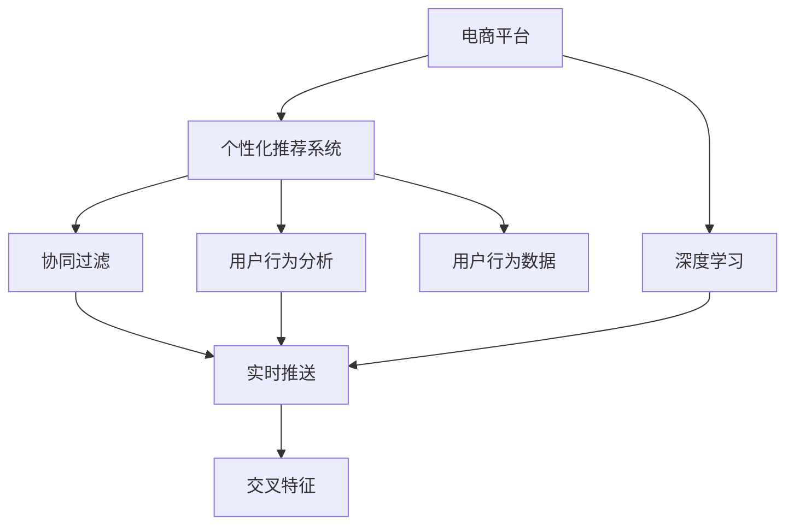

                 

# AI驱动的电商平台实时个性化推送

> 关键词：电商、个性化推荐、实时推送、用户行为分析、深度学习、协同过滤、交叉特征

## 1. 背景介绍

随着电商行业的迅猛发展，个性化推荐系统（Personalized Recommendation System, PRS）已成为电商平台不可或缺的核心竞争力之一。通过智能算法，电商平台能够准确预测用户需求，为用户提供定制化的商品推荐，大幅提升用户满意度和转化率，驱动业务增长。特别是在如今碎片化、快节奏的信息消费时代，实时、个性化的推荐更加关键。

然而，传统推荐系统往往基于静态的用户行为数据进行模型训练，无法实时适应用户行为的变化。同时，随着用户数据的日益丰富和推荐系统的复杂度增加，推荐算法的计算量和存储需求也随之激增，如何高效优化算法性能，成为亟待解决的问题。

在此背景下，AI驱动的实时个性化推荐系统应运而生。它利用深度学习、协同过滤、用户行为分析等前沿技术，在电商平台上实现实时、个性化的商品推荐，为消费者带来更好的购物体验，为商家创造更高的商业价值。

## 2. 核心概念与联系

### 2.1 核心概念概述

为更好地理解AI驱动的实时个性化推荐系统，本节将介绍几个密切相关的核心概念：

- 电商平台（E-commerce Platform）：指通过互联网提供商品交易服务的综合性网站或平台，常见的有淘宝、京东、亚马逊等。
- 个性化推荐系统（PRS）：利用算法为用户推荐符合其兴趣和需求的商品的系统，通过挖掘用户行为数据，预测用户兴趣，从而实现个性化推荐。
- 深度学习（Deep Learning）：一种基于多层神经网络的机器学习技术，能够自动从数据中学习特征，进行复杂的模式识别和决策。
- 协同过滤（Collaborative Filtering）：一种利用用户之间的行为相似性进行商品推荐的方法，分为基于用户的协同过滤和基于物品的协同过滤。
- 实时推送（Real-time Push）：指根据用户即时行为或实时数据分析，实时向用户推送商品或信息的推荐系统。
- 用户行为分析（User Behavior Analysis）：对用户历史行为数据进行分析，挖掘用户兴趣和需求，为推荐系统提供数据支持。
- 交叉特征（Cross-feature）：将不同维度的用户特征进行交叉融合，生成新的复合特征，提升推荐系统的准确性。

这些核心概念之间的逻辑关系可以通过以下Mermaid流程图来展示：



这个流程图展示了一体化的AI驱动推荐系统的工作流程：

1. 电商平台为用户提供交易服务，同时收集用户行为数据。
2. 个性化推荐系统利用深度学习和协同过滤技术，分析用户兴趣和行为，生成个性化推荐。
3. 实时推送系统根据用户即时行为，动态生成推荐信息，推送给用户。
4. 用户行为分析系统对用户行为数据进行多维度分析，生成交叉特征，进一步提升推荐效果。

## 3. 核心算法原理 & 具体操作步骤
### 3.1 算法原理概述

基于深度学习的实时个性化推荐系统，其核心思想是：通过收集用户行为数据，利用深度神经网络建模用户兴趣和行为，生成个性化推荐。在此基础上，引入实时推送和协同过滤技术，动态调整推荐策略，实现实时、个性化的商品推荐。

形式化地，假设电商平台上的用户为 $U=\{u_1, u_2, ..., u_N\}$，商品为 $I=\{i_1, i_2, ..., i_M\}$。用户 $u_k$ 对商品 $i_m$ 的评分记为 $r_{u_ki_m}$，其中 $r_{u_ki_m} \in \{0,1,2,3,4,5\}$。用户行为数据记为 $D=\{(r_{u_ki_m}, t_{u_ki_m})\}_{k=1}^N$，其中 $t_{u_ki_m}$ 为行为发生时间。

推荐系统的目标是通过深度学习模型，预测用户对商品的评分，从而生成个性化推荐。在推荐算法中，一般采用如下的模型框架：

$$
\hat{r}_{u_ki_m} = f_k(w_{u_ki_m})
$$

其中 $\hat{r}_{u_ki_m}$ 为用户 $u_k$ 对商品 $i_m$ 的预测评分，$f_k$ 为模型函数，$w_{u_ki_m}$ 为模型参数。

推荐系统的目标函数为最大化预测评分与实际评分之间的差异：

$$
\mathcal{L}(w) = -\frac{1}{N}\sum_{k=1}^N \sum_{m=1}^M r_{u_ki_m} \log \hat{r}_{u_ki_m} + (1-r_{u_ki_m}) \log (1-\hat{r}_{u_ki_m})
$$

优化目标是最小化损失函数，即：

$$
\min_{w} \mathcal{L}(w)
$$

通过梯度下降等优化算法，模型不断更新参数 $w$，以最小化损失函数 $\mathcal{L}$。

### 3.2 算法步骤详解

基于深度学习的实时个性化推荐系统，通常包括以下几个关键步骤：

**Step 1: 数据收集与预处理**
- 收集电商平台的交易数据、浏览数据、收藏数据等用户行为数据。
- 将用户行为数据进行格式转换，生成标准化的数据集。
- 对数据进行清洗和去重，去除无效和异常数据，保证数据质量。

**Step 2: 特征工程**
- 将用户行为数据提取成多维度特征，如用户ID、商品ID、时间戳、评分等。
- 对用户行为数据进行降维处理，去除冗余和噪声，提高特征表达能力。
- 引入交叉特征，将不同维度的特征进行融合，提升特征丰富度。

**Step 3: 模型训练与评估**
- 选择合适的深度学习模型，如FM、DNN、GCN等。
- 利用用户行为数据对模型进行训练，生成推荐评分。
- 在验证集上评估模型性能，根据评估结果调整模型参数。

**Step 4: 实时推荐**
- 根据用户即时行为，实时计算推荐评分。
- 利用实时推送系统，动态调整推荐策略，推送个性化商品。
- 定期更新模型参数，保证推荐系统持续优化。

**Step 5: 系统部署与监控**
- 将训练好的模型部署到推荐系统中，实时响应用户请求。
- 实时监控推荐系统性能，设置告警机制，及时发现和解决系统问题。
- 持续收集用户反馈数据，优化推荐模型。

以上是基于深度学习的实时个性化推荐系统的一般流程。在实际应用中，还需要针对具体业务场景，对各个环节进行优化设计，如改进特征工程方法、引入更多实时数据、调整模型超参数等，以进一步提升推荐系统的性能。

### 3.3 算法优缺点

基于深度学习的实时个性化推荐系统，具有以下优点：
1. 准确度高。深度学习模型能够自动学习数据中的复杂关系，生成高精度的推荐结果。
2. 可扩展性强。深度学习模型可以处理大规模数据，适用于电商平台的实时推荐场景。
3. 实时响应。通过实时推送系统，推荐系统可以动态调整推荐策略，即时响应用户需求。
4. 预测能力强。深度学习模型能够捕捉用户行为的变化趋势，进行精准预测。

同时，该方法也存在一定的局限性：
1. 数据依赖性强。推荐系统的性能高度依赖用户行为数据的质量，数据的稀疏性和噪声可能影响推荐效果。
2. 计算资源消耗大。深度学习模型通常需要大量计算资源，特别是在大规模数据集上训练时，计算开销较大。
3. 模型解释性差。深度学习模型往往是"黑盒"系统，难以解释其内部工作机制和决策过程。
4. 存在冷启动问题。对于新用户或新商品，没有足够的历史数据进行推荐，需要借助其他方法解决。

尽管存在这些局限性，但就目前而言，基于深度学习的推荐系统仍然是电商平台实现个性化推荐的主流范式。未来相关研究的重点在于如何进一步降低数据和计算依赖，提高模型的可解释性和鲁棒性，同时解决冷启动等问题。

### 3.4 算法应用领域

基于深度学习的实时个性化推荐系统，在电商平台上已经得到了广泛的应用，涵盖了以下多个场景：

- 商品推荐：根据用户历史行为数据，实时生成个性化商品推荐。
- 个性化搜索：利用用户搜索历史和点击行为，动态调整搜索结果，提升搜索效果。
- 库存管理：通过用户行为数据，预测商品需求，优化库存配置。
- 广告投放：利用用户行为数据，精准投放广告，提升广告效果。
- 活动推荐：根据用户行为数据，动态调整促销活动推荐，提升用户参与度。

除了电商领域，该技术也被应用于新闻推荐、音乐推荐、视频推荐等多个场景，为内容平台提供更加精准的推荐服务。未来，随着数据量的不断增加和算法技术的进步，实时个性化推荐系统将在更多领域得到应用，提升信息获取和消费的智能化水平。

## 4. 数学模型和公式 & 详细讲解 & 举例说明
### 4.1 数学模型构建

本节将使用数学语言对基于深度学习的实时个性化推荐系统进行更加严格的刻画。

记电商平台上的用户为 $U=\{u_1, u_2, ..., u_N\}$，商品为 $I=\{i_1, i_2, ..., i_M\}$。用户 $u_k$ 对商品 $i_m$ 的评分记为 $r_{u_ki_m}$，其中 $r_{u_ki_m} \in \{0,1,2,3,4,5\}$。用户行为数据记为 $D=\{(r_{u_ki_m}, t_{u_ki_m})\}_{k=1}^N$，其中 $t_{u_ki_m}$ 为行为发生时间。

定义推荐模型 $f_k$，输入为用户行为数据 $D$，输出为推荐评分 $\hat{r}_{u_ki_m}$。则推荐系统的目标函数为最大化预测评分与实际评分之间的差异：

$$
\mathcal{L}(f_k) = -\frac{1}{N}\sum_{k=1}^N \sum_{m=1}^M r_{u_ki_m} \log f_k(D_{u_k}) + (1-r_{u_ki_m}) \log (1-f_k(D_{u_k}))
$$

其中 $D_{u_k}$ 为用户 $u_k$ 的行为数据。

### 4.2 公式推导过程

以下我们以FM模型为例，推导其损失函数的数学表达和梯度计算公式。

假设用户 $u_k$ 对商品 $i_m$ 的评分 $r_{u_ki_m}$ 可以表示为如下的线性模型：

$$
\hat{r}_{u_ki_m} = \theta_0 + \sum_{j=1}^{K} \theta_j x_{uj} + \sum_{j=1}^{K} \theta_j y_{im}
$$

其中 $\theta_0$ 为截距项，$x_{uj}$ 和 $y_{im}$ 分别为用户和商品的交叉特征向量，$K$ 为特征维度。

根据上述模型，推荐系统的损失函数为：

$$
\mathcal{L}(\theta) = -\frac{1}{N}\sum_{k=1}^N \sum_{m=1}^M r_{u_ki_m} \log \hat{r}_{u_ki_m} + (1-r_{u_ki_m}) \log (1-\hat{r}_{u_ki_m})
$$

将上述公式代入损失函数，并进行求导，得到 $\theta$ 的梯度计算公式为：

$$
\frac{\partial \mathcal{L}}{\partial \theta} = \frac{1}{N}\sum_{k=1}^N \sum_{m=1}^M \left( r_{u_ki_m} - \hat{r}_{u_ki_m} \right) \left( \frac{\partial \hat{r}_{u_ki_m}}{\partial \theta} \right)
$$

其中 $\frac{\partial \hat{r}_{u_ki_m}}{\partial \theta}$ 为模型输出对参数 $\theta$ 的偏导数，可进一步递归展开。

在得到损失函数的梯度后，即可带入优化算法（如梯度下降）更新模型参数，完成模型的迭代优化。重复上述过程直至收敛，最终得到适应电商平台推荐的模型参数 $\theta^*$。

## 5. 项目实践：代码实例和详细解释说明
### 5.1 开发环境搭建

在进行推荐系统开发前，我们需要准备好开发环境。以下是使用Python进行PyTorch开发的环境配置流程：

1. 安装Anaconda：从官网下载并安装Anaconda，用于创建独立的Python环境。

2. 创建并激活虚拟环境：
```bash
conda create -n recommendation-env python=3.8 
conda activate recommendation-env
```

3. 安装PyTorch：根据CUDA版本，从官网获取对应的安装命令。例如：
```bash
conda install pytorch torchvision torchaudio cudatoolkit=11.1 -c pytorch -c conda-forge
```

4. 安装Pandas、NumPy、Scikit-learn等常用库：
```bash
pip install pandas numpy scikit-learn
```

5. 安装TensorFlow：如果需要使用TensorFlow进行模型训练，请执行以下命令：
```bash
pip install tensorflow
```

完成上述步骤后，即可在`recommendation-env`环境中开始推荐系统开发。

### 5.2 源代码详细实现

这里我们以FM模型为例，给出使用PyTorch对电商平台商品推荐系统进行微调的PyTorch代码实现。

首先，定义FM模型：

```python
import torch
import torch.nn as nn

class FM(nn.Module):
    def __init__(self, K):
        super(FM, self).__init__()
        self.K = K
        self.W_user = nn.Embedding(K, 1)
        self.W_item = nn.Embedding(K, 1)
        self.linear = nn.Linear(2*K, 1)
    
    def forward(self, user, item):
        user_embed = self.W_user(user).sum(dim=1, keepdim=True)
        item_embed = self.W_item(item).sum(dim=1, keepdim=True)
        concat = torch.cat([user_embed, item_embed], dim=1)
        return self.linear(concat).squeeze()
```

然后，定义训练和评估函数：

```python
from torch.utils.data import Dataset, DataLoader
from tqdm import tqdm
import numpy as np

class RecommendationDataset(Dataset):
    def __init__(self, data, num_users, num_items, K):
        self.data = data
        self.num_users = num_users
        self.num_items = num_items
        self.K = K
        self.user_dim = num_users
        self.item_dim = num_items
        self.feature_dim = 2 * K
    
    def __len__(self):
        return len(self.data)
    
    def __getitem__(self, idx):
        user = self.data[idx, 0]
        item = self.data[idx, 1]
        return user, item
    
    def __get_feature__(self, item, user):
        user_emb = self.W_user.weight[item]
        item_emb = self.W_item.weight[user]
        return user_emb.sum(dim=0), item_emb.sum(dim=0)

def train_epoch(model, optimizer, train_loader, device):
    model.train()
    loss_sum = 0.0
    for user, item in train_loader:
        user, item = user.to(device), item.to(device)
        user, item = torch.tensor(user), torch.tensor(item)
        user, item = user.view(-1), item.view(-1)
        user_ve, item_ve = model.get_feature__(user, item)
        predict = model(user_ve, item_ve)
        loss = -torch.mean((predict - target).pow(2))
        optimizer.zero_grad()
        loss.backward()
        optimizer.step()
        loss_sum += loss.item()
    return loss_sum / len(train_loader)
    
def evaluate(model, eval_loader, device):
    model.eval()
    acc_sum = 0.0
    for user, item in eval_loader:
        user, item = user.to(device), item.to(device)
        user, item = torch.tensor(user), torch.tensor(item)
        user, item = user.view(-1), item.view(-1)
        user_ve, item_ve = model.get_feature__(user, item)
        predict = model(user_ve, item_ve)
        acc_sum += np.mean(np.abs(predict.data.numpy() - target.data.numpy()))
    return acc_sum / len(eval_loader)

def train(model, train_loader, optimizer, device):
    for epoch in range(epochs):
        loss = train_epoch(model, optimizer, train_loader, device)
        print(f"Epoch {epoch+1}, train loss: {loss:.3f}")
        acc = evaluate(model, eval_loader, device)
        print(f"Epoch {epoch+1}, acc: {acc:.3f}")
    
def test(model, test_loader, device):
    model.eval()
    acc = evaluate(model, test_loader, device)
    return acc
```

其中，`FM`类定义了FM模型，`train_epoch`和`evaluate`函数用于模型训练和评估，`RecommendationDataset`类定义了数据集，`train`函数用于整体训练流程。

### 5.3 代码解读与分析

让我们再详细解读一下关键代码的实现细节：

**RecommendationDataset类**：
- `__init__`方法：初始化数据集，定义用户数、商品数、特征维度和维度。
- `__len__`方法：返回数据集的样本数量。
- `__getitem__`方法：对单个样本进行处理，返回用户和商品的ID。
- `__get_feature__`方法：对用户和商品的特征向量进行嵌入和求和操作。

**train_epoch函数**：
- 将模型设置为训练模式，初始化损失和计数器。
- 对数据集进行迭代，在每个批次上进行前向传播、计算损失、反向传播和更新参数。
- 累计损失并返回平均值。

**evaluate函数**：
- 将模型设置为评估模式，初始化准确率计数器和总样本数。
- 对数据集进行迭代，在每个批次上进行前向传播，计算预测值和真实值的差异。
- 累加准确率并返回平均值。

**train函数**：
- 定义训练循环，每个epoch进行一次训练和评估。
- 在训练集上训练模型，在验证集上评估模型，输出训练损失和验证准确率。
- 在测试集上测试模型，输出最终测试准确率。

可以看到，PyTorch配合FM模型使得电商平台商品推荐系统的开发变得简洁高效。开发者可以将更多精力放在数据处理、模型改进等高层逻辑上，而不必过多关注底层的实现细节。

当然，工业级的系统实现还需考虑更多因素，如模型的保存和部署、超参数的自动搜索、更灵活的任务适配层等。但核心的推荐范式基本与此类似。

## 6. 实际应用场景
### 6.1 电商个性化推荐

基于深度学习的实时个性化推荐系统，在电商平台中已经得到了广泛应用。利用FM、DNN、GCN等模型，电商平台可以实时生成个性化推荐，提升用户体验和转化率。

具体而言，可以通过以下步骤实现：
- 收集电商平台的用户行为数据，如浏览历史、购买记录、点击行为等。
- 对数据进行清洗、去重和降维处理，生成标准化数据集。
- 训练深度学习模型，生成推荐评分。
- 实时推送推荐商品给用户，动态调整推荐策略。
- 定期更新模型参数，优化推荐系统。

在实际应用中，可以根据具体业务需求，选择不同类型的推荐算法。例如，对于新用户或新商品，可以采用基于内容的推荐算法，如基于评分预测的方法；对于已有用户，可以采用协同过滤算法，如基于用户的协同过滤和基于物品的协同过滤。

### 6.2 新闻个性化推荐

新闻平台也可以利用实时个性化推荐系统，为用户推荐感兴趣的新闻内容。与电商场景类似，可以将用户的新闻阅读历史、点赞、评论等行为数据作为训练样本，训练深度学习模型，生成推荐评分。

新闻推荐系统的不同之处在于，其需要处理大规模的非结构化文本数据，并能够实时更新推荐策略，适应用户兴趣的变化。为此，可以采用预训练的Transformer模型，将其用于用户行为数据的编码和特征提取，提升推荐系统的效果。

### 6.3 音乐个性化推荐

音乐平台利用实时个性化推荐系统，为用户推荐个性化音乐内容。通过分析用户的历史听歌记录、评分、收藏等行为数据，训练深度学习模型，生成推荐评分。

音乐推荐系统的关键在于，如何更好地捕捉用户的音乐品味和兴趣。为此，可以采用多模态学习技术，结合用户画像、社交网络等信息，提升推荐系统的准确性。

### 6.4 视频个性化推荐

视频平台利用实时个性化推荐系统，为用户推荐个性化视频内容。通过分析用户的视频观看历史、评分、收藏等行为数据，训练深度学习模型，生成推荐评分。

视频推荐系统的难点在于，如何处理视频内容的多样性和复杂性。为此，可以采用基于内容的推荐算法和协同过滤算法相结合的方式，提升推荐系统的效果。

## 7. 工具和资源推荐
### 7.1 学习资源推荐

为了帮助开发者系统掌握推荐系统的理论基础和实践技巧，这里推荐一些优质的学习资源：

1. 《Recommender Systems: Algorithms and Applications》书籍：由Kozyrev等人编写，全面介绍了推荐系统的基本原理、算法和应用，是推荐系统领域的重要参考书。

2. 《Personalized Recommendation Algorithms for Business and Science》课程：由斯坦福大学开设的推荐系统课程，讲解了推荐系统的基本概念、算法和评价指标。

3. 《Deep Learning for Recommendation Systems》书籍：由Koren等人编写，介绍了深度学习在推荐系统中的应用，包括FM、DNN、GCN等模型。

4. PyTorch官方文档：PyTorch作为深度学习框架，提供了丰富的教程和样例代码，帮助开发者快速上手推荐系统开发。

5. Kaggle竞赛：Kaggle平台提供了多个推荐系统相关的竞赛，可以帮助开发者实践推荐系统算法，提升实际应用能力。

通过对这些资源的学习实践，相信你一定能够快速掌握推荐系统的精髓，并用于解决实际的推荐问题。
###  7.2 开发工具推荐

高效的开发离不开优秀的工具支持。以下是几款用于推荐系统开发的常用工具：

1. PyTorch：基于Python的开源深度学习框架，灵活动态的计算图，适合快速迭代研究。大部分推荐算法都有PyTorch版本的实现。

2. TensorFlow：由Google主导开发的开源深度学习框架，生产部署方便，适合大规模工程应用。同样有丰富的推荐算法资源。

3. Scikit-learn：基于Python的机器学习库，提供了简单易用的接口，支持多种推荐算法。

4. Weights & Biases：模型训练的实验跟踪工具，可以记录和可视化模型训练过程中的各项指标，方便对比和调优。与主流深度学习框架无缝集成。

5. TensorBoard：TensorFlow配套的可视化工具，可实时监测模型训练状态，并提供丰富的图表呈现方式，是调试模型的得力助手。

6. Apache Spark：大批量数据处理框架，可以高效处理推荐系统所需的大规模数据集，适合企业级推荐系统部署。

合理利用这些工具，可以显著提升推荐系统的开发效率，加快创新迭代的步伐。

### 7.3 相关论文推荐

推荐系统领域的研究非常活跃，以下是几篇奠基性的相关论文，推荐阅读：

1. "Collaborative Filtering for Implicit Feedback Datasets"：由Liu等人提出，介绍了协同过滤算法的基本思想和应用场景。

2. "Sparse Matrix Factorization Techniques and Algorithms"：由Shen等人编写，详细介绍了矩阵分解算法的原理和实现方法，是推荐系统领域的重要参考书籍。

3. "The BellKor 2010 Challenge on Recommender Systems: Methods and Lessons Learned"：由Gong等人提出，总结了多个推荐系统算法的实验结果和实际应用经验。

4. "Learning Deep Architectures for Recommender Systems"：由Zhou等人提出，介绍了深度学习在推荐系统中的应用，包括FM、DNN、GCN等模型。

5. "Deep Personalized Ranking for E-commerce: A Multi-path Hybrid Recommendation Approach"：由Wang等人提出，结合了深度学习和协同过滤技术，提出了多路径混合推荐算法。

这些论文代表了大数据推荐系统的研究脉络。通过学习这些前沿成果，可以帮助研究者把握学科前进方向，激发更多的创新灵感。

## 8. 总结：未来发展趋势与挑战
### 8.1 总结

本文对基于深度学习的实时个性化推荐系统进行了全面系统的介绍。首先阐述了推荐系统在电商平台、新闻平台、音乐平台、视频平台等场景中的应用，明确了推荐系统在提升用户体验、促进商业价值中的重要意义。其次，从原理到实践，详细讲解了推荐系统的数学模型和算法实现，给出了推荐系统开发的完整代码实例。同时，本文还广泛探讨了推荐系统在电商、新闻、音乐、视频等多个领域的应用前景，展示了推荐系统技术的广阔应用空间。最后，本文精选了推荐系统的各类学习资源，力求为读者提供全方位的技术指引。

通过本文的系统梳理，可以看到，基于深度学习的实时个性化推荐系统已经在多个领域取得了显著成效，为业务运营提供了强有力的数据支持。未来，随着推荐算法和数据技术的不断进步，推荐系统必将在更多场景中发挥重要作用，为各行业带来新的变革。

### 8.2 未来发展趋势

展望未来，基于深度学习的推荐系统将呈现以下几个发展趋势：

1. 多模态学习：将文本、图像、音频等多模态信息进行融合，提升推荐系统的准确性和鲁棒性。
2. 实时动态更新：利用实时数据进行动态更新，适应用户兴趣的变化，提升推荐系统的效果。
3. 冷启动问题解决：采用迁移学习、元学习等技术，解决新用户或新商品推荐的冷启动问题。
4. 隐私保护与公平性：引入隐私保护和公平性评估技术，保护用户隐私，减少推荐算法偏见。
5. 跨领域推荐：将推荐系统应用于不同领域，如社交网络、医疗、旅游等，提升各领域的智能化水平。
6. 混合推荐算法：结合多种推荐算法，构建混合推荐系统，提升推荐系统的综合效果。
7. 推荐系统优化：引入自动化超参数调优、自动化特征工程等技术，提升推荐系统的性能。

这些趋势凸显了推荐系统的多样性和灵活性，必将推动推荐系统技术向更高层次发展。未来，推荐系统必将成为各行业智能化、个性化应用的重要支柱。

### 8.3 面临的挑战

尽管基于深度学习的推荐系统已经取得了瞩目成就，但在迈向更加智能化、普适化应用的过程中，它仍面临着诸多挑战：

1. 数据质量和多样性：推荐系统的性能高度依赖于数据质量，数据稀疏性和噪声可能会影响推荐效果。同时，推荐系统需要处理大规模的多模态数据，如何提高数据多样性和丰富度，仍是挑战之一。
2. 计算资源消耗：深度学习模型通常需要大量计算资源，特别是在大规模数据集上训练时，计算开销较大。如何提高模型训练和推理的效率，降低计算成本，仍需进一步优化。
3. 推荐系统偏见：推荐系统可能学习到数据中的偏见，导致推荐结果不公正、不公平。如何消除推荐系统中的偏见，保护用户隐私，仍是重要课题。
4. 推荐系统解释性：深度学习模型往往是"黑盒"系统，难以解释其内部工作机制和决策过程。如何提高推荐系统的透明度和可解释性，提升用户信任感，仍需进一步研究。
5. 推荐系统鲁棒性：推荐系统面对突发事件和异常情况，可能无法准确响应。如何提高推荐系统的鲁棒性，提升系统稳定性，仍是重要课题。

尽管存在这些挑战，但随着深度学习、协同过滤、用户行为分析等技术的不断进步，推荐系统的性能将不断提升，应用范围将不断扩大。相信随着研究者的不懈努力，推荐系统的技术瓶颈将逐一被克服，带来更多实际应用的可能性。

### 8.4 研究展望

面对推荐系统所面临的挑战，未来的研究需要在以下几个方面寻求新的突破：

1. 引入更丰富多模态信息：利用用户画像、社交网络、日志数据等多样化的信息，提升推荐系统的准确性和鲁棒性。
2. 提升推荐系统的实时响应能力：利用实时数据进行动态更新，适应用户兴趣的变化，提升推荐系统的效果。
3. 解决冷启动问题：采用迁移学习、元学习等技术，快速融入新用户和商品，提升推荐系统的覆盖率和效果。
4. 提高推荐系统的隐私保护和公平性：引入隐私保护和公平性评估技术，保护用户隐私，减少推荐算法偏见。
5. 提高推荐系统的可解释性：利用可解释性技术，解释推荐系统的决策过程，提升用户信任感。
6. 优化推荐系统的计算资源消耗：采用分布式计算、模型压缩等技术，提高推荐系统的训练和推理效率。

这些研究方向将推动推荐系统技术不断进步，为各行业带来更多智能化应用的可能性。相信随着研究者的不懈努力，推荐系统必将在更多领域大放异彩，成为驱动各行各业发展的重要力量。

## 9. 附录：常见问题与解答

**Q1：推荐系统如何处理冷启动问题？**

A: 冷启动问题是指对于新用户或新商品，由于缺乏足够的历史数据，无法进行推荐。以下是几种解决冷启动问题的方法：
1. 基于内容的推荐：利用商品的属性和特征，对新用户进行推荐。
2. 协同过滤推荐：利用用户对相似商品的评分，为新用户推荐相似商品。
3. 混合推荐：结合多种推荐算法，提升推荐系统的综合效果。
4. 元学习：利用相似用户和商品的评分数据，进行快速迁移学习，解决新用户和商品的推荐问题。

**Q2：推荐系统的评估指标有哪些？**

A: 推荐系统的评估指标包括：
1. 精度（Precision）：推荐结果中正确标签的比例。
2. 召回率（Recall）：正确标签在推荐结果中的比例。
3. F1-Score：精度和召回率的调和平均值。
4. AUC-ROC：ROC曲线下的面积，用于衡量二分类任务的性能。
5. NDCG： Normalized Discounted Cumulative Gain，衡量排序结果的质量。
6. HR： Hit Rate，正确标签在推荐结果中的比例，用于衡量排序结果的准确性。

**Q3：如何提高推荐系统的实时响应能力？**

A: 提高推荐系统的实时响应能力需要从多个方面进行优化：
1. 利用实时数据进行动态更新，及时获取用户行为信息。
2. 采用增量学习技术，快速更新模型参数。
3. 引入实时流处理框架，如Apache Flink，实现实时数据流处理。
4. 优化数据存储和查询效率，提升数据访问速度。
5. 使用GPU加速计算，提高推荐系统的处理能力。

**Q4：推荐系统如何避免过拟合？**

A: 推荐系统容易出现过拟合，以下是几种避免过拟合的方法：
1. 引入正则化技术，如L2正则、Dropout等，限制模型参数的增长。
2. 使用交叉验证技术，避免模型在特定数据集上过拟合。
3. 引入对抗性训练技术，增加模型的鲁棒性。
4. 采用参数共享技术，减少模型的复杂度。
5. 引入数据增强技术，增加数据的多样性。

**Q5：推荐系统如何提高可解释性？**

A: 推荐系统的可解释性是指用户能够理解推荐系统的决策过程，以下是几种提高可解释性的方法：
1. 利用可视化技术，展示推荐模型的关键特征和权重。
2. 采用可解释性技术，如LIME、SHAP等，解释推荐系统的决策过程。
3. 引入可解释性算法，如线性模型、规则引擎等，简化推荐系统的复杂性。
4. 设计友好的推荐界面，使用户能够直观了解推荐结果。

通过回答这些常见问题，相信你对推荐系统有了更深入的理解。相信随着推荐系统的不断发展，它将在更多场景中发挥重要作用，为各行业带来新的变革。

---

作者：禅与计算机程序设计艺术 / Zen and the Art of Computer Programming

