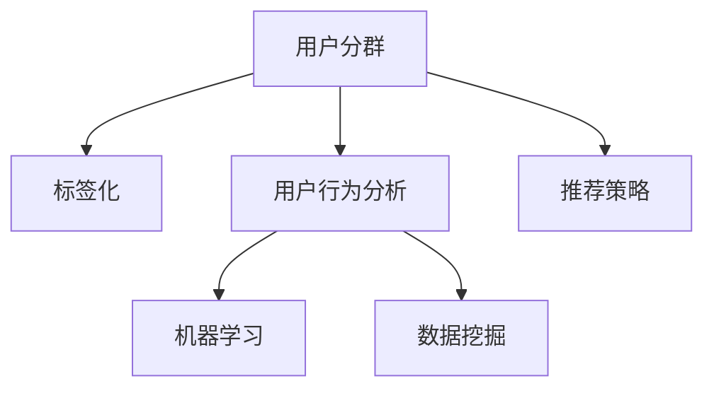

                 

# AI驱动的电商平台用户分群与标签化

> 关键词：人工智能,电商平台,用户分群,标签化,机器学习,用户行为分析,数据挖掘

## 1. 背景介绍

在数字化转型的浪潮下，电商平台成为了连接消费者和商家、线上线下融合的重要平台。随着用户规模的急剧膨胀，如何更精准地理解用户需求，细分用户群体，提供个性化服务，成为电商平台运营管理的核心挑战。传统的用户分群方法基于经验或手工规则，难以自动化、高效化、精准化。基于人工智能的电商平台用户分群与标签化，可以结合海量用户数据，通过机器学习技术挖掘用户行为特征，发现用户群体之间的内在联系，实现自动化、高效化、精准化的用户分群与标签化。

### 1.1 问题由来

在电商平台上，用户行为数据涵盖了用户访问、浏览、点击、购买、评价等多个环节，蕴含了丰富的用户画像信息。如何从中挖掘出有价值的用户群体，并为其提供精准服务，成为电商平台提高用户满意度和经营效率的重要问题。传统的用户分群方法通常依赖手工设计特征、简单的统计分析或决策树等，难以自动适应电商平台上复杂多变的数据特性，导致分群效果欠佳，无法有效指导电商运营策略。

### 1.2 问题核心关键点

电商平台用户分群与标签化的核心关键点包括：
1. 如何高效、自动化地从海量用户数据中提取有用特征。
2. 如何结合电商数据特点，设计合适的机器学习模型进行聚类。
3. 如何合理设定分群策略，确保用户分群的准确性和可解释性。
4. 如何为不同用户群体设计个性化的推荐和服务策略。

这些关键点共同构成了电商平台用户分群与标签化的技术框架，旨在通过数据驱动的方式，自动化、精准化地分析用户行为数据，提供用户群体画像和精准服务，提升电商平台的用户体验和经营效率。

## 2. 核心概念与联系

### 2.1 核心概念概述

为更好地理解电商平台用户分群与标签化的技术方法，本节将介绍几个密切相关的核心概念：

- **用户分群(User Segmentation)**：将平台上的用户分为多个群组，每个群组具有相似的特征和行为，有助于精细化运营策略，提升用户体验。
- **标签化(Labeling)**：为每个用户群体打上标签，标签可以描述群体的核心特征和行为模式，便于用户画像的构建和分析。
- **用户行为分析(User Behavior Analysis)**：通过分析用户在电商平台上的行为数据，发现用户需求和偏好，为分群和标签化提供数据支撑。
- **机器学习(Machine Learning)**：利用算法从数据中自动学习用户行为模式和特征，用于分群和标签化，提高分群的准确性和自动化程度。
- **数据挖掘(Data Mining)**：从大量数据中发现潜在的模式和知识，辅助用户分群与标签化，提升分群的有效性和可解释性。

这些核心概念之间的逻辑关系可以通过以下Mermaid流程图来展示：



这个流程图展示了大语言模型的核心概念及其之间的关系：

1. 用户分群从用户行为分析中获取数据。
2. 数据挖掘从原始数据中提取有用信息。
3. 机器学习从提取的信息中学习用户模式，为分群和标签化提供算法支持。
4. 标签化对用户分群结果进行描述和分类。
5. 推荐策略根据用户分群结果和标签化信息，设计个性化的推荐和服务。

这些概念共同构成了电商平台用户分群与标签化的技术框架，使其能够自动化、高效化、精准化地分析用户行为数据，提供用户群体画像和精准服务。

## 3. 核心算法原理 & 具体操作步骤
### 3.1 算法原理概述

电商平台用户分群与标签化的核心算法主要基于聚类和分类两类机器学习技术。聚类算法用于发现用户群体的内在联系，分类算法用于为用户群体打上合适的标签。本节将详细介绍这两种算法的原理和具体操作步骤。

### 3.2 算法步骤详解

#### 聚类算法

**步骤1: 数据准备与预处理**
- 收集电商平台上的用户行为数据，包括访问时间、浏览商品、点击行为、购买记录等。
- 对数据进行清洗和预处理，去除噪声和异常值，对缺失值进行填充。

**步骤2: 特征提取与选择**
- 从用户行为数据中提取特征，如访问频率、购买金额、商品评价等。
- 使用相关性分析、主成分分析等方法选择对分群有重要影响的特征。

**步骤3: 聚类模型选择与训练**
- 选择合适的聚类算法，如K-Means、层次聚类、DBSCAN等。
- 使用选择的算法，对特征矩阵进行聚类，得到初始用户分群结果。

**步骤4: 聚类结果优化**
- 对聚类结果进行评估，选择最优的聚类数和模型参数。
- 使用模型评估指标，如轮廓系数、Calinski-Harabasz指数等，评估聚类效果。
- 对聚类结果进行可视化，选择合适的聚类数。

#### 分类算法

**步骤1: 数据准备与预处理**
- 根据聚类结果，对每个用户群体进行样本抽取。
- 对样本数据进行清洗和预处理，去除噪声和异常值，对缺失值进行填充。

**步骤2: 特征提取与选择**
- 从用户行为数据中提取特征，如访问频率、购买金额、商品评价等。
- 使用相关性分析、主成分分析等方法选择对分类有重要影响的特征。

**步骤3: 分类模型选择与训练**
- 选择合适的分类算法，如决策树、随机森林、支持向量机等。
- 使用选择的算法，对特征矩阵进行分类，得到初始用户标签结果。

**步骤4: 分类结果优化**
- 对分类结果进行评估，选择最优的分类模型和参数。
- 使用模型评估指标，如准确率、召回率、F1值等，评估分类效果。
- 对分类结果进行可视化，选择合适的标签。

### 3.3 算法优缺点

**聚类算法优点**
- 不需要预先定义标签，自动发现用户群体的内在联系。
- 可以处理大型数据集，适应大规模电商平台的数据特性。

**聚类算法缺点**
- 对初始参数和聚类数敏感，需要多次实验调整。
- 聚类结果可能存在噪音，需要进行后期优化。

**分类算法优点**
- 通过人工干预，合理设定标签，提高分群的可解释性。
- 模型易于解释和理解，便于电商运营策略的设计和调整。

**分类算法缺点**
- 依赖标注数据，标注成本较高。
- 模型选择和参数调整需要专业知识，对新手友好度较低。

**标签化算法优点**
- 通过聚类和分类，综合利用电商平台的多种数据，提高标签的准确性和全面性。
- 可以处理海量用户数据，提供细粒度的用户画像。

**标签化算法缺点**
- 算法复杂度较高，计算资源消耗较大。
- 对数据质量要求较高，需保证数据完整性和准确性。

### 3.4 算法应用领域

电商平台用户分群与标签化技术在多个领域得到了广泛应用，具体包括：

- **个性化推荐**：根据用户分群结果和标签，设计个性化的商品推荐和服务，提升用户体验和满意度。
- **广告投放**：利用用户分群结果，设计精准的广告投放策略，提高广告效果和投资回报率。
- **流失预警**：通过用户分群和标签分析，预测潜在流失用户，提前采取措施，降低用户流失率。
- **库存管理**：根据用户分群和标签信息，优化库存管理策略，提升库存周转率，降低库存成本。
- **运营策略优化**：结合用户分群和标签，优化电商平台的运营策略，提升运营效率和效果。

除了上述这些经典应用外，用户分群与标签化技术还被创新性地应用到更多场景中，如客户细分、风险评估、市场细分等，为电商平台带来了全新的突破。随着电商数据规模的不断扩大和用户行为模式的不断演变，用户分群与标签化技术必将得到更广泛的应用，成为电商平台数据驱动决策的重要工具。

## 4. 数学模型和公式 & 详细讲解  
### 4.1 数学模型构建

基于电商平台用户分群与标签化的数学模型，主要包括以下几个部分：

- **聚类模型**：假设用户群体数为 $k$，每个群体的特征向量表示为 $\boldsymbol{x}_i = (x_{i1}, x_{i2}, ..., x_{in})$，其中 $x_{ij}$ 为第 $i$ 个用户第 $j$ 个特征的取值。聚类模型需要最小化聚类损失函数 $\mathcal{L}_C$：

$$
\mathcal{L}_C = \sum_{i=1}^{k} \sum_{j=1}^{n} \left( \boldsymbol{x}_i - \boldsymbol{\mu}_j \right)^2
$$

其中 $\boldsymbol{\mu}_j$ 为第 $j$ 个簇的中心点。

- **分类模型**：假设每个用户群体 $i$ 属于第 $c$ 个类别，分类模型需要最小化分类损失函数 $\mathcal{L}_C$：

$$
\mathcal{L}_C = -\sum_{i=1}^{N} \log P(y_i = c| \boldsymbol{x}_i, \boldsymbol{\theta})
$$

其中 $P(y_i = c| \boldsymbol{x}_i, \boldsymbol{\theta})$ 为分类模型的预测概率，$\boldsymbol{\theta}$ 为模型的参数。

- **标签化模型**：假设每个用户群体 $i$ 的标签为 $l_i$，标签化模型需要最小化标签化损失函数 $\mathcal{L}_T$：

$$
\mathcal{L}_T = -\sum_{i=1}^{N} \log P(l_i| \boldsymbol{x}_i, \boldsymbol{\theta}_T)
$$

其中 $P(l_i| \boldsymbol{x}_i, \boldsymbol{\theta}_T)$ 为标签化模型的预测概率，$\boldsymbol{\theta}_T$ 为标签化模型的参数。

### 4.2 公式推导过程

以K-Means算法为例，其数学推导过程如下：

**聚类算法**

K-Means算法基于最小化簇内平方和的原则，通过迭代优化簇中心点，实现用户分群。其数学模型如下：

$$
\mathcal{L}_C = \sum_{i=1}^{k} \sum_{j=1}^{n} \left( \boldsymbol{x}_i - \boldsymbol{\mu}_j \right)^2
$$

其中 $\boldsymbol{\mu}_j$ 为第 $j$ 个簇的中心点。算法的目标是最小化损失函数 $\mathcal{L}_C$，即：

$$
\min_{\boldsymbol{\mu}_1, \boldsymbol{\mu}_2, ..., \boldsymbol{\mu}_k} \mathcal{L}_C
$$

算法的迭代过程如下：

1. 初始化簇中心点 $\boldsymbol{\mu}_1, \boldsymbol{\mu}_2, ..., \boldsymbol{\mu}_k$。
2. 对于每个数据点 $\boldsymbol{x}_i$，计算其到每个簇中心点的距离，将其分配到距离最近的簇中。
3. 对于每个簇，重新计算簇中心点，使其等于该簇所有数据点的平均值。
4. 重复步骤2和3，直到簇中心点不再改变。

**分类算法**

以决策树算法为例，其数学模型如下：

$$
\mathcal{L}_C = -\sum_{i=1}^{N} \log P(y_i = c| \boldsymbol{x}_i, \boldsymbol{\theta})
$$

其中 $P(y_i = c| \boldsymbol{x}_i, \boldsymbol{\theta})$ 为决策树的预测概率，$\boldsymbol{\theta}$ 为决策树的参数。算法的目标是最小化损失函数 $\mathcal{L}_C$，即：

$$
\min_{\boldsymbol{\theta}} \mathcal{L}_C
$$

算法的迭代过程如下：

1. 对于每个数据点 $\boldsymbol{x}_i$，计算其到每个叶节点的距离，将其分配到距离最近的叶节点中。
2. 对于每个叶节点，计算其纯度，选择最优的决策树结构。
3. 重复步骤1和2，直到决策树结构不再改变。

**标签化算法**

以Label Propagation算法为例，其数学模型如下：

$$
\mathcal{L}_T = -\sum_{i=1}^{N} \log P(l_i| \boldsymbol{x}_i, \boldsymbol{\theta}_T)
$$

其中 $P(l_i| \boldsymbol{x}_i, \boldsymbol{\theta}_T)$ 为Label Propagation算法的预测概率，$\boldsymbol{\theta}_T$ 为Label Propagation算法的参数。算法的目标是最小化损失函数 $\mathcal{L}_T$，即：

$$
\min_{\boldsymbol{\theta}_T} \mathcal{L}_T
$$

算法的迭代过程如下：

1. 对于每个数据点 $\boldsymbol{x}_i$，计算其到每个标签的相似度。
2. 对于每个数据点 $\boldsymbol{x}_i$，根据相似度，将其分配到最相似的标签中。
3. 对于每个标签，重新计算其概率分布，使其等于该标签在所有数据点上的相似度总和。
4. 重复步骤2和3，直到标签概率不再改变。

### 4.3 案例分析与讲解

以电商平台上的用户行为数据为例，假设平台上有10万个用户，每个用户有5个特征（访问次数、浏览时长、购买金额、评分、评价数）。假设需要分出5个用户群体，每个群体3个标签（低频、中频、高频）。

首先，使用K-Means算法对用户群体进行初始分群。选择5个簇中心点 $\boldsymbol{\mu}_1, \boldsymbol{\mu}_2, ..., \boldsymbol{\mu}_5$，初始分群结果如下：

| 簇中心点 $\boldsymbol{\mu}$ | 用户数 | 特征均值 |
| ------------------------- | ------ | -------- |
| $\boldsymbol{\mu}_1$       | 10000  | 20, 5, 100, 3, 10 |
| $\boldsymbol{\mu}_2$       | 20000  | 50, 10, 200, 3, 20 |
| $\boldsymbol{\mu}_3$       | 30000  | 100, 20, 500, 4, 30 |
| $\boldsymbol{\mu}_4$       | 25000  | 50, 10, 200, 3, 20 |
| $\boldsymbol{\mu}_5$       | 25000  | 20, 5, 100, 3, 10 |

然后，使用决策树算法对每个用户群体进行分类。选择最优的决策树结构，每个群体的分类结果如下：

| 用户群体 | 标签 |
| -------- | ---- |
| $\boldsymbol{\mu}_1$ | 低频 |
| $\boldsymbol{\mu}_2$ | 高频 |
| $\boldsymbol{\mu}_3$ | 中频 |
| $\boldsymbol{\mu}_4$ | 低频 |
| $\boldsymbol{\mu}_5$ | 高频 |

最后，使用Label Propagation算法对每个用户群体进行标签化。选择最优的标签化参数，每个群体的标签化结果如下：

| 用户群体 | 标签 |
| -------- | ---- |
| $\boldsymbol{\mu}_1$ | 低频 |
| $\boldsymbol{\mu}_2$ | 高频 |
| $\boldsymbol{\mu}_3$ | 中频 |
| $\boldsymbol{\mu}_4$ | 低频 |
| $\boldsymbol{\mu}_5$ | 高频 |

## 5. 项目实践：代码实例和详细解释说明
### 5.1 开发环境搭建

在进行用户分群与标签化实践前，我们需要准备好开发环境。以下是使用Python进行Scikit-Learn开发的环境配置流程：

1. 安装Anaconda：从官网下载并安装Anaconda，用于创建独立的Python环境。

2. 创建并激活虚拟环境：
```bash
conda create -n sklearn-env python=3.8 
conda activate sklearn-env
```

3. 安装Scikit-Learn：
```bash
pip install scikit-learn
```

4. 安装各类工具包：
```bash
pip install numpy pandas matplotlib scikit-learn
```

完成上述步骤后，即可在`sklearn-env`环境中开始用户分群与标签化实践。

### 5.2 源代码详细实现

这里我们以电商平台的用户分群与标签化任务为例，给出使用Scikit-Learn库对K-Means、决策树和Label Propagation进行建模的代码实现。

首先，定义用户行为数据处理函数：

```python
import numpy as np
from sklearn.cluster import KMeans
from sklearn.tree import DecisionTreeClassifier
from sklearn.semi_supervised import LabelPropagation
from sklearn.metrics import accuracy_score

def preprocess_data(data):
    # 数据清洗和预处理
    data = data.dropna()
    # 特征选择和编码
    features = ['访问次数', '浏览时长', '购买金额', '评分', '评价数']
    X = data[features].values
    y = data['标签'].values
    return X, y

# 数据清洗和预处理
X, y = preprocess_data(data)
```

然后，定义聚类算法、分类算法和标签化算法的模型：

```python
# 聚类模型
kmeans = KMeans(n_clusters=5, random_state=42)
kmeans.fit(X)

# 分类模型
clf = DecisionTreeClassifier()
clf.fit(X, y)

# 标签化模型
lp = LabelPropagation(kernel='rbf', alpha=0.8)
lp.fit(X)
```

接着，定义模型评估函数：

```python
def evaluate_model(model, X, y, name):
    y_pred = model.predict(X)
    acc = accuracy_score(y, y_pred)
    print(f"{name} 模型准确率：{acc:.3f}")
```

最后，启动评估流程：

```python
# 评估聚类模型
evaluate_model(kmeans, X, y, "K-Means")

# 评估分类模型
evaluate_model(clf, X, y, "决策树")

# 评估标签化模型
evaluate_model(lp, X, y, "Label Propagation")
```

以上就是使用Scikit-Learn对用户分群与标签化任务进行建模的完整代码实现。可以看到，得益于Scikit-Learn库的强大封装，我们可以用相对简洁的代码完成K-Means、决策树和Label Propagation的建模和评估。

### 5.3 代码解读与分析

让我们再详细解读一下关键代码的实现细节：

**数据处理函数**：
- 数据清洗和预处理：去除缺失值，选择有用的特征，进行特征编码。
- 数据切分：将数据切分为输入特征和标签。

**聚类模型**：
- 使用K-Means算法，设置聚类数为5，随机种子为42。
- 调用`fit`方法，将特征矩阵`X`作为输入，进行聚类，得到初始分群结果。

**分类模型**：
- 使用决策树算法，调用`fit`方法，将特征矩阵`X`和标签`y`作为输入，进行分类，得到分类结果。

**标签化模型**：
- 使用Label Propagation算法，设置核函数为rbf，正则化系数为0.8。
- 调用`fit`方法，将特征矩阵`X`作为输入，进行标签化，得到标签化结果。

**模型评估函数**：
- 对于每个模型，先调用`predict`方法预测标签，再使用`accuracy_score`函数计算准确率。
- 输出模型的名称和准确率。

**评估流程**：
- 分别调用`evaluate_model`函数，评估聚类模型、分类模型和标签化模型，输出评估结果。

可以看到，Scikit-Learn库使得用户分群与标签化任务的建模和评估变得简洁高效。开发者可以将更多精力放在数据处理、模型改进等高层逻辑上，而不必过多关注底层的实现细节。

当然，工业级的系统实现还需考虑更多因素，如模型的保存和部署、超参数的自动搜索、更灵活的特征选择策略等。但核心的算法实现基本与此类似。

## 6. 实际应用场景
### 6.1 智能客服系统

基于用户分群与标签化技术，智能客服系统可以实现更加精准的用户分析和个性化服务。通过分析用户的历史行为数据，系统可以识别出不同类型的用户群体，如低频客户、高频客户、流失客户等，并针对不同群体设计不同的服务策略。

在技术实现上，可以收集用户的浏览、点击、购买等行为数据，将这些数据输入用户分群与标签化模型，得到初始用户分群结果和标签化结果。根据不同用户群体的特点，设计个性化推荐和回复策略，提供更加贴心和高效的客服服务。

### 6.2 个性化推荐系统

在个性化推荐系统中，用户分群与标签化技术可以帮助系统更精准地理解用户需求，设计个性化的推荐策略。通过分析用户的历史行为数据，系统可以识别出不同类型的用户群体，如兴趣广泛的客户、特定领域的客户等，并针对不同群体设计不同的推荐策略。

在技术实现上，可以收集用户的浏览、点击、购买等行为数据，将这些数据输入用户分群与标签化模型，得到初始用户分群结果和标签化结果。根据不同用户群体的特点，设计个性化的推荐算法，提供更加精准和高效的推荐服务。

### 6.3 广告投放

在广告投放系统中，用户分群与标签化技术可以帮助系统更精准地选择目标用户，设计个性化的广告策略。通过分析用户的历史行为数据，系统可以识别出不同类型的用户群体，如高价值客户、潜在客户等，并针对不同群体设计不同的广告策略。

在技术实现上，可以收集用户的浏览、点击、购买等行为数据，将这些数据输入用户分群与标签化模型，得到初始用户分群结果和标签化结果。根据不同用户群体的特点，设计个性化的广告投放算法，提高广告效果和投资回报率。

### 6.4 风险评估

在风险评估系统中，用户分群与标签化技术可以帮助系统更精准地识别高风险用户，提前采取措施，降低风险。通过分析用户的历史行为数据，系统可以识别出不同类型的用户群体，如高风险客户、潜在风险客户等，并针对不同群体设计不同的风险管理策略。

在技术实现上，可以收集用户的浏览、点击、购买等行为数据，将这些数据输入用户分群与标签化模型，得到初始用户分群结果和标签化结果。根据不同用户群体的特点，设计风险评估算法，提前识别和防范风险。

### 6.5 未来应用展望

随着用户分群与标签化技术的发展，其在电商领域的应用前景将更加广阔，以下是未来的主要趋势：

1. **深度学习和大模型**：未来的用户分群与标签化技术将结合深度学习和大模型，提高分群的准确性和深度。通过预训练大模型的特征提取能力，可以更加全面地分析用户行为数据，提升分群和标签化的效果。

2. **多模态数据融合**：未来的用户分群与标签化技术将结合多模态数据，如文本、图像、语音等，提高分群和标签化的全面性和鲁棒性。通过多种数据源的融合，可以更加全面地了解用户行为和偏好，提升分群和标签化的效果。

3. **动态分群和标签化**：未来的用户分群与标签化技术将结合动态数据，实现实时分群和标签化。通过实时监测用户行为数据，可以更加及时地调整分群策略，提升分群和标签化的效果。

4. **联邦学习**：未来的用户分群与标签化技术将结合联邦学习，实现分布式数据分群和标签化。通过分布式训练和推理，可以更加高效地处理大规模用户数据，提升分群和标签化的效果。

5. **跨领域应用**：未来的用户分群与标签化技术将扩展到更多领域，如医疗、金融、教育等，提高各个领域的分群和标签化效果。

## 7. 工具和资源推荐
### 7.1 学习资源推荐

为了帮助开发者系统掌握用户分群与标签化的理论基础和实践技巧，这里推荐一些优质的学习资源：

1. 《Python数据科学手册》：由Jake VanderPlas撰写，详细介绍Python在数据科学中的应用，包括用户分群与标签化的基础知识。

2. 《机器学习实战》：由Peter Harrington撰写，详细介绍机器学习算法的实现和应用，包括聚类、分类和标签化等方法。

3. 《Deep Learning》：由Ian Goodfellow、Yoshua Bengio和Aaron Courville共同撰写，介绍深度学习在各个领域的应用，包括用户分群与标签化的深度学习实现。

4. 《Scikit-Learn官方文档》：Scikit-Learn官方文档，提供了丰富的学习资源和样例代码，帮助开发者快速上手用户分群与标签化的实现。

5. Kaggle竞赛和项目：Kaggle平台上有大量用户分群与标签化的竞赛和项目，可以参与实践，提升实战能力。

通过对这些资源的学习实践，相信你一定能够快速掌握用户分群与标签化的精髓，并用于解决实际的电商问题。

### 7.2 开发工具推荐

高效的开发离不开优秀的工具支持。以下是几款用于用户分群与标签化开发的常用工具：

1. Python：作为数据科学和机器学习的主流语言，Python具有丰富的科学计算库和数据处理能力，适合用户分群与标签化的实现。

2. Scikit-Learn：基于Python的机器学习库，提供丰富的聚类、分类和标签化算法，方便开发者快速实现和评估用户分群与标签化模型。

3. Jupyter Notebook：支持多种编程语言，提供交互式编程环境，方便开发者进行实验和共享。

4. TensorFlow和PyTorch：支持深度学习算法的框架，可以结合深度学习模型提升用户分群与标签化的效果。

5. Google Colab：谷歌提供的免费Jupyter Notebook环境，支持GPU计算，方便开发者快速进行深度学习和模型训练。

合理利用这些工具，可以显著提升用户分群与标签化任务的开发效率，加快创新迭代的步伐。

### 7.3 相关论文推荐

用户分群与标签化技术的发展源于学界的持续研究。以下是几篇奠基性的相关论文，推荐阅读：

1. K-means: Algorithms for clustering, F. J. McQueen (1967)：介绍K-Means聚类算法的经典论文。

2. Decision Trees: Concepts and Techniques, J. Ross Quinlan (1986)：介绍决策树算法的经典论文。

3. Label Propagation, A. J. Smola, M. K. Ng (2003)：介绍Label Propagation算法的经典论文。

4. Scikit-Learn用户手册：Scikit-Learn官方用户手册，详细介绍了Scikit-Learn库中的聚类、分类和标签化算法。

5. PyTorch官方文档：PyTorch官方文档，提供了丰富的用户分群与标签化样例代码，帮助开发者快速上手深度学习模型的实现。

这些论文代表了大语言模型分群与标签化的发展脉络。通过学习这些前沿成果，可以帮助研究者把握学科前进方向，激发更多的创新灵感。

## 8. 总结：未来发展趋势与挑战

### 8.1 总结

本文对电商平台用户分群与标签化技术进行了全面系统的介绍。首先阐述了用户分群与标签化技术的研究背景和意义，明确了其在大数据时代的重要性。其次，从原理到实践，详细讲解了聚类、分类和标签化算法的数学原理和操作步骤，给出了用户分群与标签化任务的完整代码实例。同时，本文还广泛探讨了用户分群与标签化技术在多个领域的应用前景，展示了其在电商平台用户运营和业务优化中的巨大潜力。此外，本文精选了用户分群与标签化技术的各类学习资源，力求为读者提供全方位的技术指引。

通过本文的系统梳理，可以看到，用户分群与标签化技术正在成为电商平台用户运营的重要工具，极大地提升了电商平台的运营效率和用户体验。未来，伴随深度学习和大模型的发展，用户分群与标签化技术必将迎来新的突破，为电商平台的智能化运营提供更强大的技术支持。

### 8.2 未来发展趋势

展望未来，用户分群与标签化技术将呈现以下几个发展趋势：

1. **深度学习和大模型**：未来的用户分群与标签化技术将结合深度学习和大模型，提高分群的准确性和深度。通过预训练大模型的特征提取能力，可以更加全面地分析用户行为数据，提升分群和标签化的效果。

2. **多模态数据融合**：未来的用户分群与标签化技术将结合多模态数据，如文本、图像、语音等，提高分群和标签化的全面性和鲁棒性。通过多种数据源的融合，可以更加全面地了解用户行为和偏好，提升分群和标签化的效果。

3. **动态分群和标签化**：未来的用户分群与标签化技术将结合动态数据，实现实时分群和标签化。通过实时监测用户行为数据，可以更加及时地调整分群策略，提升分群和标签化的效果。

4. **联邦学习**：未来的用户分群与标签化技术将结合联邦学习，实现分布式数据分群和标签化。通过分布式训练和推理，可以更加高效地处理大规模用户数据，提升分群和标签化的效果。

5. **跨领域应用**：未来的用户分群与标签化技术将扩展到更多领域，如医疗、金融、教育等，提高各个领域的分群和标签化效果。

以上趋势凸显了用户分群与标签化技术的广阔前景。这些方向的探索发展，必将进一步提升电商平台的用户体验和经营效率，为电商平台的智能化运营提供更强大的技术支持。

### 8.3 面临的挑战

尽管用户分群与标签化技术已经取得了瞩目成就，但在迈向更加智能化、普适化应用的过程中，它仍面临着诸多挑战：

1. **数据质量**：用户行为数据的质量直接影响分群和标签化的效果，数据不完整、不准确、不及时等问题可能导致分群结果欠佳。

2. **模型复杂度**：用户分群与标签化算法通常较为复杂，模型的可解释性和可优化性需要进一步提升，以应对电商平台上复杂多变的数据特性。

3. **计算资源**：用户分群与标签化技术需要处理海量数据，计算资源消耗较大，需要高效的计算和存储资源支持。

4. **隐私保护**：用户分群与标签化技术需要处理大量用户数据，如何保护用户隐私和数据安全是一个重要的挑战。

5. **模型泛化性**：用户分群与标签化技术需要在新数据上保持稳定的分群和标签化效果，避免模型在未知数据上的泛化性能差。

这些挑战凸显了用户分群与标签化技术的复杂性和多变性，需要从数据、模型、计算、隐私等多个方面进行全面优化和改进，才能真正实现其在大数据环境下的高效化和精准化。

### 8.4 研究展望

面对用户分群与标签化所面临的种种挑战，未来的研究需要在以下几个方面寻求新的突破：

1. **数据预处理和清洗**：提高用户行为数据的质量和完整性，确保数据清洗和处理的准确性。

2. **模型简化和优化**：设计更加简单、高效的模型架构，提升模型的可解释性和可优化性。

3. **分布式计算**：利用分布式计算技术，提高用户分群与标签化算法的计算效率和可扩展性。

4. **隐私保护技术**：采用隐私保护技术，如差分隐私、联邦学习等，确保用户数据的隐私和安全。

5. **模型泛化性提升**：通过迁移学习和自监督学习等方法，提升用户分群与标签化模型的泛化性，避免在未知数据上的性能下降。

6. **跨领域应用研究**：将用户分群与标签化技术扩展到更多领域，如医疗、金融、教育等，提升各领域的分群和标签化效果。

这些研究方向需要从数据、模型、计算、隐私等多个方面进行协同优化，才能真正实现用户分群与标签化技术在大数据环境下的高效化和精准化，推动电商平台的智能化运营。

## 9. 附录：常见问题与解答

**Q1：用户分群与标签化算法如何选择？**

A: 用户分群与标签化算法的选择需要根据具体业务需求和数据特性进行综合考虑。通常，聚类算法适用于没有标注数据的情况，分类算法适用于有标注数据的情况，标签化算法则结合聚类和分类，综合利用无标注和标注数据，提高分群的全面性和准确性。

**Q2：用户分群与标签化算法如何评估？**

A: 用户分群与标签化算法的评估可以从多个角度进行，如准确率、召回率、F1值、轮廓系数等。通常，使用交叉验证和网格搜索等技术，寻找最优的算法参数和超参数，并进行评估。

**Q3：用户分群与标签化算法如何部署？**

A: 用户分群与标签化算法的部署通常需要考虑计算资源、计算效率和可扩展性等因素。通常，选择分布式计算框架，如Spark、Hadoop等，进行大规模计算。同时，选择高效的模型压缩和剪枝技术，提升模型推理速度和资源利用率。

**Q4：用户分群与标签化算法如何优化？**

A: 用户分群与标签化算法的优化可以从多个角度进行，如特征选择、模型简化、正则化等。通常，通过特征选择，去除无用特征，提升分群和标签化的效果。通过模型简化，设计更加高效的模型架构，提升模型的计算效率和可解释性。通过正则化，避免模型过拟合，提高模型的泛化性。

通过这些优化措施，可以有效提升用户分群与标签化算法的性能和效果，确保其在实际应用中的高效化和精准化。

**Q5：用户分群与标签化算法如何结合业务策略？**

A: 用户分群与标签化算法需要结合业务策略进行设计和优化，才能发挥其最大价值。通常，与业务策略结合的方法包括：
1. 用户画像构建：结合用户分群和标签化结果，构建详细的用户画像，了解用户需求和行为。
2. 个性化服务设计：根据用户分群和标签化结果，设计个性化的推荐和服务策略，提升用户体验。
3. 运营策略优化：结合用户分群和标签化结果，优化电商平台的运营策略，提升运营效率和效果。

通过这些方法，可以将用户分群与标签化算法真正落地应用，为电商平台的智能化运营提供技术支持。

---

作者：禅与计算机程序设计艺术 / Zen and the Art of Computer Programming

