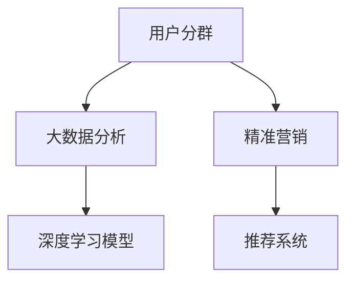
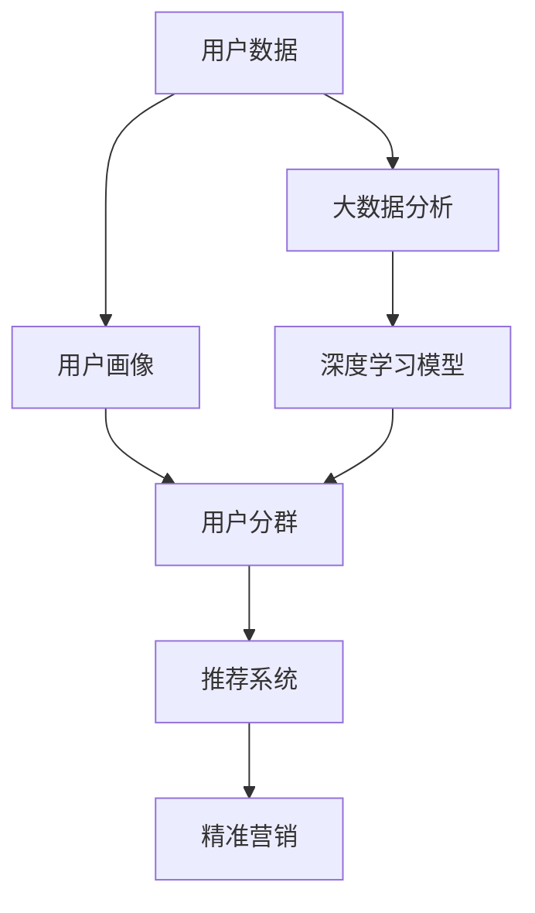

                 

# AI驱动的电商平台用户分群与精准营销

> 关键词：人工智能,用户分群,精准营销,电商平台,大数据分析

## 1. 背景介绍

### 1.1 问题由来
随着电子商务的快速发展，电商平台的数据量呈指数级增长。如何从海量数据中挖掘出有价值的用户信息，对用户进行有效的分群和精准营销，成为电商企业关注的焦点。传统的用户分群方式依赖于人工标注，耗时耗力且无法充分发挥数据的潜力。利用人工智能技术，特别是机器学习和深度学习模型，可以从用户行为、交易记录、浏览历史等大数据中自动识别用户特征，进行用户分群和个性化推荐，从而大幅提升营销效果和用户体验。

### 1.2 问题核心关键点
- 用户分群：根据用户的行为、交易、兴趣等因素，将用户分成不同群体。
- 精准营销：通过分析用户特征和行为，对不同群体实施差异化营销策略。
- 电商平台：指通过互联网进行的商品和服务的在线销售平台，如淘宝、京东等。
- 大数据分析：利用算法对大规模数据集进行分析，提取有价值的信息。
- 深度学习模型：利用多层神经网络结构，自动从数据中学习特征和模式。
- 推荐系统：根据用户历史行为和偏好，推荐相关商品和服务。

这些核心概念之间的逻辑关系可以通过以下Mermaid流程图来展示：



这个流程图展示了大数据驱动的用户分群和精准营销流程：

1. 从电商平台获取用户数据。
2. 对数据进行大数据分析，提取用户特征。
3. 利用深度学习模型，自动学习和提取用户行为模式。
4. 根据用户特征和行为模式进行用户分群。
5. 对不同群体进行精准营销，提供个性化推荐服务。

## 2. 核心概念与联系

### 2.1 核心概念概述

为更好地理解用户分群与精准营销的核心技术，本节将介绍几个关键概念：

- 用户分群：根据用户的行为、兴趣、特征等，将用户分为多个子群。
- 用户画像：描述用户特征和行为的数据集，用于个性化推荐和精准营销。
- 推荐系统：利用用户历史数据和行为模式，为用户推荐相关商品和服务。
- 大数据分析：对大规模数据集进行分析和处理，提取有价值的信息。
- 深度学习模型：多层神经网络结构，自动学习数据中的模式和特征。
- 个性化推荐：根据用户偏好和历史行为，推荐个性化的商品和服务。

这些概念之间的关系和交互可以通过以下Mermaid流程图来展示：



这个流程图展示了大数据驱动的用户分群和精准营销流程：

1. 从电商平台获取用户数据。
2. 对数据进行大数据分析，提取用户画像。
3. 利用深度学习模型，自动学习和提取用户行为模式。
4. 根据用户画像和行为模式进行用户分群。
5. 利用推荐系统，对不同群体提供个性化推荐服务。
6. 对不同群体进行精准营销，提升用户体验和转化率。

## 3. 核心算法原理 & 具体操作步骤
### 3.1 算法原理概述

用户分群与精准营销的核心算法是机器学习和深度学习模型。其核心思想是：通过分析用户的行为数据，识别用户的特征和行为模式，将其分为不同群体，并根据不同群体的特征和行为模式，制定个性化的营销策略。

具体而言，流程包括以下几个关键步骤：

1. 数据收集：从电商平台获取用户行为、交易记录、浏览历史等数据。
2. 数据预处理：对原始数据进行清洗、去噪、归一化等处理，以便后续建模。
3. 特征工程：提取用户的基本特征和行为特征，如年龄、性别、购买频率、浏览时长等。
4. 模型训练：利用机器学习或深度学习模型，训练用户分群模型和推荐系统模型。
5. 用户分群：利用训练好的模型，对用户进行分群。
6. 精准营销：根据不同群体的特征，制定差异化的营销策略。

### 3.2 算法步骤详解

#### 3.2.1 数据收集

从电商平台获取用户数据是用户分群和精准营销的基础。具体来说，需要收集以下几类数据：

1. 用户基本信息：如年龄、性别、地区等。
2. 用户行为数据：如浏览记录、点击次数、停留时间等。
3. 交易记录：如购买时间、商品类别、购买金额等。
4. 评价数据：如用户对商品的评价、打分等。

为了保证数据的完整性和准确性，需要在数据收集过程中注意以下几点：

1. 数据来源：从可信的第三方平台或内部系统获取数据，避免数据质量问题。
2. 数据格式：保证数据格式的一致性，便于后续处理。
3. 数据量：确保数据量足够大，以保证模型的泛化能力。

#### 3.2.2 数据预处理

数据预处理是用户分群和精准营销的重要环节。通过预处理，可以提高数据的质量和一致性，便于后续建模和分析。具体来说，数据预处理包括以下几个步骤：

1. 数据清洗：去除重复数据、无效数据和异常数据，以保证数据的质量。
2. 数据归一化：对数据进行归一化处理，以保证不同特征的数值在同一量级。
3. 特征选择：选择对用户分群和推荐系统有用的特征，避免冗余和噪声。
4. 数据采样：对数据进行采样，以保证样本分布的均衡性。

#### 3.2.3 特征工程

特征工程是用户分群和精准营销的核心步骤。通过特征工程，可以将原始数据转化为可用于建模的特征，提高模型的性能和效果。具体来说，特征工程包括以下几个步骤：

1. 特征提取：从原始数据中提取有用的特征，如年龄、性别、浏览次数等。
2. 特征转换：对特征进行转换，如将年龄转换为年龄组、将购买金额转换为消费水平等。
3. 特征选择：选择对用户分群和推荐系统有用的特征，避免冗余和噪声。
4. 特征编码：将特征转换为模型可以处理的数值或类别。

#### 3.2.4 模型训练

模型训练是用户分群和精准营销的关键步骤。通过训练模型，可以从数据中学习出用户分群和推荐系统的规则和模式。具体来说，模型训练包括以下几个步骤：

1. 模型选择：选择适合用户分群和推荐系统的模型，如协同过滤、深度学习模型等。
2. 数据划分：将数据划分为训练集、验证集和测试集，以保证模型的泛化能力。
3. 参数调整：调整模型的参数，如学习率、正则化系数等，以优化模型的性能。
4. 模型评估：在验证集和测试集上评估模型的性能，选择最优模型。

#### 3.2.5 用户分群

用户分群是用户分群和精准营销的核心步骤。通过用户分群，可以将用户分为多个群体，以便进行个性化的营销和推荐。具体来说，用户分群包括以下几个步骤：

1. 模型训练：利用训练好的模型，对用户进行分群。
2. 群内特征分析：分析不同群体的特征和行为模式，以便制定个性化的营销策略。
3. 群间比较：比较不同群体之间的特征和行为模式，以便进行差异化的营销策略。

#### 3.2.6 精准营销

精准营销是用户分群和推荐系统的最终目标。通过精准营销，可以根据不同群体的特征，制定差异化的营销策略，提升用户体验和转化率。具体来说，精准营销包括以下几个步骤：

1. 个性推荐：利用推荐系统，对不同群体提供个性化的推荐服务。
2. 营销策略：制定差异化的营销策略，如优惠活动、促销信息等。
3. 用户体验：提升用户体验，提高用户满意度和转化率。

### 3.3 算法优缺点

基于机器学习和深度学习模型的用户分群和精准营销，具有以下优点：

1. 自动化程度高：自动化地从数据中提取特征和模式，减少了人工干预。
2. 性能稳定：利用机器学习和深度学习模型的强大泛化能力，保证了模型的稳定性和可靠性。
3. 高效可扩展：模型可以根据数据规模进行扩展，适应大规模数据处理的需要。

同时，该方法也存在一定的局限性：

1. 数据依赖性高：模型需要大量的标注数据进行训练，数据质量对模型的效果有较大影响。
2. 解释性不足：模型通常视为黑箱，难以解释其内部工作机制和决策逻辑。
3. 需要持续维护：模型需要定期更新和维护，以保证其性能和效果。

尽管存在这些局限性，但就目前而言，基于机器学习和深度学习模型的用户分群和精准营销方法仍然是大规模电商平台应用的主流范式。未来相关研究的重点在于如何进一步降低对标注数据的依赖，提高模型的解释性和可维护性。

### 3.4 算法应用领域

基于机器学习和深度学习模型的用户分群和精准营销方法，已经在电商、金融、社交网络等多个领域得到广泛应用。以下是几个典型的应用场景：

- 电商：电商平台通过用户分群和推荐系统，提升用户购买率和转化率。如亚马逊的推荐引擎，利用协同过滤和深度学习模型，对用户进行分群和推荐。
- 金融：金融平台通过用户分群和精准营销，提升用户忠诚度和转化率。如银行利用客户画像和推荐系统，对不同客户进行差异化的营销策略。
- 社交网络：社交平台通过用户分群和精准营销，提升用户活跃度和留存率。如Facebook利用机器学习模型，对用户进行分群和推荐。

除了上述这些经典应用外，基于用户分群和精准营销的方法也在更多场景中得到创新性应用，如可控推荐、少样本推荐、跨域推荐等，为电商和社交网络技术带来了全新的突破。随着模型的持续演进，相信用户分群和精准营销技术将在更多领域得到应用，为电商和社交网络带来新的增长点。

## 4. 数学模型和公式 & 详细讲解  
### 4.1 数学模型构建

本节将使用数学语言对用户分群和精准营销过程进行更加严格的刻画。

假设电商平台的数据集为 $D=\{(x_i,y_i)\}_{i=1}^N$，其中 $x_i$ 表示用户行为数据， $y_i$ 表示用户特征标签。定义模型 $M_{\theta}$，其中 $\theta$ 为模型参数。

用户分群的目标是找到最优的模型参数 $\theta^*$，使得模型能够准确地将用户分为多个群体。具体而言，模型的目标函数为：

$$
\theta^* = \mathop{\arg\min}_{\theta} \mathcal{L}(M_{\theta},D)
$$

其中 $\mathcal{L}$ 为损失函数，用于衡量模型预测结果与真实标签之间的差异。常见的损失函数包括交叉熵损失、均方误差损失等。

### 4.2 公式推导过程

以协同过滤模型为例，推导推荐系统的损失函数及其梯度计算公式。

假设推荐系统有 $K$ 个用户，$M$ 个物品，用户对物品的评分矩阵为 $R \in \mathbb{R}^{K \times M}$，其中 $R_{ij}$ 表示用户 $i$ 对物品 $j$ 的评分。模型的目标是最小化预测评分与实际评分之间的差异，即：

$$
\min_{\theta} \frac{1}{KM} \sum_{i,j} \left|R_{ij} - \hat{R}_{ij}\right|^2
$$

其中 $\hat{R}_{ij} = M_{\theta}(i,j)$，表示模型预测的用户 $i$ 对物品 $j$ 的评分。

根据链式法则，损失函数对模型参数 $\theta$ 的梯度为：

$$
\frac{\partial \mathcal{L}}{\partial \theta} = \frac{2}{KM} \sum_{i,j} (R_{ij} - \hat{R}_{ij}) M_{\theta}(i,j)
$$

在得到损失函数的梯度后，即可带入模型更新公式，完成推荐系统的迭代优化。重复上述过程直至收敛，最终得到适应推荐任务的最优模型参数 $\theta^*$。

## 5. 项目实践：代码实例和详细解释说明
### 5.1 开发环境搭建

在进行用户分群和精准营销实践前，我们需要准备好开发环境。以下是使用Python进行Scikit-learn开发的环境配置流程：

1. 安装Anaconda：从官网下载并安装Anaconda，用于创建独立的Python环境。

2. 创建并激活虚拟环境：
```bash
conda create -n usergroup-env python=3.8 
conda activate usergroup-env
```

3. 安装Scikit-learn：从官网获取对应的安装命令。例如：
```bash
pip install scikit-learn
```

4. 安装其他必要的工具包：
```bash
pip install numpy pandas scipy matplotlib scikit-learn jupyter notebook ipython
```

完成上述步骤后，即可在`usergroup-env`环境中开始用户分群和精准营销实践。

### 5.2 源代码详细实现

下面我们以用户分群为例，给出使用Scikit-learn对用户进行分群的Python代码实现。

首先，定义用户分群的数据处理函数：

```python
import pandas as pd
from sklearn.preprocessing import StandardScaler
from sklearn.decomposition import PCA
from sklearn.cluster import KMeans

def preprocess_data(data):
    # 数据预处理
    data = data.fillna(0)  # 填充缺失值
    data = data.dropna()  # 删除缺失值
    data = pd.get_dummies(data, columns=['gender'])  # 将类别型特征转换为数值型特征
    data = pd.concat([data.drop(['gender'], axis=1), data['gender']], axis=1)  # 合并特征列
    
    # 数据标准化
    scaler = StandardScaler()
    data = scaler.fit_transform(data)
    
    # 数据降维
    pca = PCA(n_components=2)  # 使用PCA进行降维
    data = pca.fit_transform(data)
    
    return data
```

然后，定义用户分群的模型训练函数：

```python
from sklearn.cluster import KMeans

def train_model(data, k=5):
    # 数据预处理
    data = preprocess_data(data)
    
    # K-means聚类
    model = KMeans(n_clusters=k, random_state=42)
    model.fit(data)
    
    return model.labels_
```

接着，定义用户分群和精准营销的函数：

```python
def user_grouping(data, k=5):
    # 用户分群
    labels = train_model(data, k=k)
    
    # 精准营销
    # 根据用户分群结果，制定个性化的营销策略
    
    return labels
```

最后，启动用户分群和精准营销流程：

```python
data = pd.read_csv('user_data.csv')  # 读取用户数据
labels = user_grouping(data)  # 用户分群
```

以上就是使用Scikit-learn进行用户分群的完整代码实现。可以看到，Scikit-learn封装了常用的机器学习算法，使我们能够快速搭建和训练模型。

### 5.3 代码解读与分析

让我们再详细解读一下关键代码的实现细节：

**preprocess_data函数**：
- 数据预处理：填充缺失值、删除缺失值、类别型特征转换为数值型特征。
- 数据标准化：利用StandardScaler对数据进行标准化处理。
- 数据降维：利用PCA对数据进行降维处理，减少计算量和模型复杂度。

**train_model函数**：
- K-means聚类：利用K-means算法对用户进行分群，得到每个用户的标签。
- 参数设置：设置聚类的数量和随机种子，以保证结果的可重复性。

**user_grouping函数**：
- 用户分群：调用train_model函数进行用户分群，得到每个用户的标签。
- 精准营销：根据用户分群结果，制定个性化的营销策略。

**启动流程**：
- 读取用户数据。
- 调用user_grouping函数进行用户分群。

可以看到，Scikit-learn库封装了各种机器学习算法，极大地方便了用户分群和精准营销的实践。开发者只需关注业务逻辑和模型优化，而不必过多关注底层实现细节。

当然，工业级的系统实现还需考虑更多因素，如模型的保存和部署、超参数的自动搜索、更灵活的任务适配层等。但核心的用户分群和精准营销范式基本与此类似。

## 6. 实际应用场景
### 6.1 智能推荐系统

智能推荐系统是电商平台的核心功能之一。通过用户分群和精准营销，可以大幅提升推荐系统的精准度和用户满意度。

在技术实现上，可以收集用户的历史浏览记录、购买记录、评价记录等数据，利用协同过滤和深度学习模型进行用户分群和推荐。微调模型和用户分群模型，可以实现更加精准和个性化的推荐服务。对于新用户或历史数据较少的用户，利用嵌入式稀疏矩阵（Embedded Sparse Matrix）和隐式反馈模型（Implicit Feedback Model）进行推荐。

### 6.2 个性化广告投放

电商平台还可以通过用户分群和精准营销，进行个性化广告投放。根据不同群体的特征和行为模式，制定不同的广告策略，提高广告投放的效果和转化率。

具体而言，可以收集用户的浏览历史、点击记录、购买记录等数据，利用机器学习模型进行用户分群和精准营销。在广告投放时，针对不同群体制定不同的广告策略，如价格优惠、限时折扣、精准展示等。通过A/B测试，不断优化广告效果，提高广告转化率。

### 6.3 商品召回系统

商品召回系统是电商平台的重要功能之一，可以帮助用户快速找到所需商品，提升用户体验和满意度。

在技术实现上，可以收集用户的搜索记录、浏览历史、购买记录等数据，利用机器学习模型进行用户分群和精准营销。根据不同群体的特征和行为模式，制定不同的召回策略，如商品推荐、价格优惠、限时折扣等。通过A/B测试，不断优化召回效果，提高用户满意度。

### 6.4 未来应用展望

随着用户分群和精准营销技术的不断发展，基于大模型的推荐系统也在不断进步。未来的推荐系统将更注重个性化、实时性和多样性，利用深度学习模型和大模型进行推荐。大模型的使用，将进一步提升推荐系统的性能和效果。

此外，基于用户分群和精准营销的方法也将应用到更多场景中，如可控推荐、少样本推荐、跨域推荐等，为电商平台带来更多的增长点和创新。

## 7. 工具和资源推荐
### 7.1 学习资源推荐

为了帮助开发者系统掌握用户分群和精准营销的理论基础和实践技巧，这里推荐一些优质的学习资源：

1. 《推荐系统：算法与实现》书籍：详细介绍推荐系统的基本原理和实现方法，是推荐系统的入门必读。

2. 《用户画像：大数据时代的用户研究方法》书籍：介绍如何利用大数据技术构建用户画像，是用户分群的重要参考资料。

3. 《机器学习实战》书籍：基于Python的机器学习实战指南，适合初学者入门。

4. Kaggle竞赛平台：提供大量的数据集和竞赛项目，是实践推荐系统和用户分群的好地方。

5. Scikit-learn官方文档：详细介绍了Scikit-learn库的各种算法和工具，是用户分群和精准营销的必备参考资料。

通过对这些资源的学习实践，相信你一定能够快速掌握用户分群和精准营销的精髓，并用于解决实际的推荐和营销问题。

### 7.2 开发工具推荐

高效的开发离不开优秀的工具支持。以下是几款用于用户分群和精准营销开发的常用工具：

1. Scikit-learn：基于Python的机器学习库，提供了丰富的算法和工具，适合用户分群和精准营销的实践。

2. TensorFlow：由Google主导开发的深度学习框架，适合大规模工程应用。可以用于构建复杂的深度学习模型。

3. PyTorch：基于Python的深度学习框架，灵活便捷，适合快速迭代研究。可以用于构建各种深度学习模型。

4. Jupyter Notebook：基于Web的交互式开发工具，适合快速实验和数据可视化。可以用于代码编写和数据探索。

5. Tableau：数据可视化工具，可以将数据转化为直观的图表和报表，方便数据分析和决策。

6. Pandas：基于Python的数据处理库，支持数据清洗、数据筛选、数据合并等操作。适合用户分群和精准营销的数据预处理。

合理利用这些工具，可以显著提升用户分群和精准营销任务的开发效率，加快创新迭代的步伐。

### 7.3 相关论文推荐

用户分群和精准营销的研究源于学界的持续研究。以下是几篇奠基性的相关论文，推荐阅读：

1. "Collaborative Filtering for Implicit Feedback Datasets"：介绍协同过滤算法，是推荐系统的重要基础。

2. "A Survey of Matrix Factorization Techniques for Recommender Systems"：详细介绍矩阵分解算法，是推荐系统的经典综述。

3. "Deep Learning Recommender Systems"：介绍深度学习在推荐系统中的应用，是推荐系统的最新进展。

4. "User Modeling with Clustering in Recommendation Systems"：介绍用户分群算法，是用户分群的重要参考资料。

5. "Personalization with Clustering and Retrieval in Recommender Systems"：介绍基于聚类的个性化推荐算法，是推荐系统的创新方法。

这些论文代表了大数据驱动的用户分群和精准营销技术的发展脉络。通过学习这些前沿成果，可以帮助研究者把握学科前进方向，激发更多的创新灵感。

## 8. 总结：未来发展趋势与挑战

### 8.1 总结

本文对用户分群和精准营销的机器学习和深度学习模型进行了全面系统的介绍。首先阐述了用户分群和精准营销的研究背景和意义，明确了模型在电商平台上的重要应用。其次，从原理到实践，详细讲解了用户分群和推荐系统的数学原理和关键步骤，给出了用户分群和精准营销的完整代码实例。同时，本文还广泛探讨了用户分群和精准营销方法在智能推荐、个性化广告投放、商品召回等电商平台应用场景中的应用前景，展示了方法的高效性和创新性。此外，本文精选了用户分群和精准营销技术的各类学习资源，力求为读者提供全方位的技术指引。

通过本文的系统梳理，可以看到，基于机器学习和深度学习模型的用户分群和精准营销方法正在成为电商平台应用的重要范式，极大地提升了电商平台的推荐效果和用户满意度。未来，伴随模型技术的持续演进，基于大模型的推荐系统将在更多领域得到应用，为电商和社交网络带来新的增长点。

### 8.2 未来发展趋势

展望未来，用户分群和精准营销技术将呈现以下几个发展趋势：

1. 深度学习模型的应用：深度学习模型能够从大规模数据中学习更复杂的特征和模式，提升推荐系统的性能和效果。

2. 多模态数据融合：将用户的历史行为数据、社交网络数据、外部知识库等多种数据源进行融合，提升推荐系统的全面性和准确性。

3. 实时性需求增加：用户行为数据实时变化，推荐系统需要实时更新，以保持推荐结果的时效性。

4. 跨平台推荐：将电商平台的推荐系统扩展到社交网络、视频网站等多个平台，形成跨平台推荐系统。

5. 个性化推荐算法优化：不断优化个性化推荐算法，提高推荐系统的个性化和多样性，提升用户体验。

6. 用户隐私保护：在推荐过程中，需要考虑用户隐私和数据安全，合理使用用户数据，保护用户隐私。

以上趋势凸显了用户分群和精准营销技术的广阔前景。这些方向的探索发展，必将进一步提升推荐系统的性能和效果，为用户带来更好的购物体验和满意度。

### 8.3 面临的挑战

尽管用户分群和精准营销技术已经取得了瞩目成就，但在迈向更加智能化、普适化应用的过程中，它仍面临着诸多挑战：

1. 数据质量和完整性：电商平台数据存在缺失、噪声等问题，对模型训练效果有较大影响。

2. 模型复杂度和可解释性：深度学习模型通常较复杂，难以解释其内部工作机制和决策逻辑。

3. 推荐效果的多样性和个性化：推荐系统需要平衡多样性和个性化，过度个性化可能导致推荐结果单一。

4. 实时性需求增加：实时推荐系统对计算资源和算法复杂度要求较高，需要不断优化推荐算法和硬件资源。

5. 用户隐私和数据安全：推荐系统需要合理使用用户数据，保护用户隐私和数据安全。

6. 算法公平性和可控性：推荐算法需要避免推荐结果的不公平，控制推荐过程中的偏见和歧视。

正视用户分群和精准营销面临的这些挑战，积极应对并寻求突破，将是大规模电商平台推荐系统走向成熟的必由之路。相信随着学界和产业界的共同努力，这些挑战终将一一被克服，用户分群和精准营销技术必将实现新的突破。

### 8.4 研究展望

面对用户分群和精准营销技术面临的挑战，未来的研究需要在以下几个方面寻求新的突破：

1. 引入先验知识：将符号化的先验知识，如知识图谱、逻辑规则等，与神经网络模型进行融合，提升推荐系统的全面性和准确性。

2. 引入因果分析：利用因果分析方法，识别推荐结果的关键特征，增强推荐系统的稳定性和鲁棒性。

3. 引入对抗学习：利用对抗学习技术，提高推荐系统的鲁棒性和安全性，抵御恶意攻击。

4. 引入跨域推荐：利用跨域推荐技术，将推荐系统扩展到跨平台、跨领域、跨时间等多个维度。

5. 引入多任务学习：利用多任务学习技术，同时优化多个推荐任务，提高推荐系统的泛化能力和效果。

6. 引入可解释性：利用可解释性技术，提高推荐系统的透明性和可解释性，增强用户信任。

这些研究方向的探索，必将引领用户分群和精准营销技术迈向更高的台阶，为构建安全、可靠、可解释、可控的智能推荐系统铺平道路。面向未来，用户分群和精准营销技术还需要与其他人工智能技术进行更深入的融合，如知识表示、因果推理、强化学习等，多路径协同发力，共同推动智能推荐系统的进步。只有勇于创新、敢于突破，才能不断拓展推荐系统的边界，让智能技术更好地造福人类社会。

## 9. 附录：常见问题与解答

**Q1：电商平台的用户数据是否会影响用户隐私？**

A: 电商平台需要收集大量的用户数据，包括浏览记录、购买记录、评价记录等。在数据收集和处理过程中，需要注意用户隐私保护，避免数据泄露和滥用。通常的做法包括：

1. 数据匿名化：在数据收集时，去除敏感信息，如姓名、电话等。
2. 数据加密：对敏感数据进行加密处理，防止数据泄露。
3. 用户同意：在数据收集时，征得用户同意，保护用户隐私权。
4. 数据审计：对数据收集和使用过程进行审计，确保数据安全和合规。

通过合理的数据处理和隐私保护措施，电商平台可以安全地收集和利用用户数据，提高推荐系统的精准度和用户体验。

**Q2：如何衡量用户分群和推荐系统的性能？**

A: 用户分群和推荐系统的性能评估，通常使用以下指标：

1. 准确率（Accuracy）：推荐系统预测结果与实际结果的一致性。
2. 召回率（Recall）：推荐系统成功预测出用户感兴趣商品的占比。
3. F1-score：准确率和召回率的调和平均值，综合评估推荐系统的性能。
4. 覆盖率（Coverage）：推荐系统推荐的商品占所有商品的占比。
5. DCG（Discounted Cumulative Gain）：考虑推荐结果的排序和多样性，综合评估推荐系统的性能。
6. NDCG（Normalized Discounted Cumulative Gain）：标准化DCG指标，综合评估推荐系统的排序性能。

这些指标可以结合具体业务场景进行综合评估，选择最优的推荐策略。

**Q3：用户分群和推荐系统面临的主要技术挑战是什么？**

A: 用户分群和推荐系统面临的主要技术挑战包括：

1. 数据质量问题：电商平台数据存在缺失、噪声等问题，对模型训练效果有较大影响。
2. 模型复杂度和可解释性：深度学习模型通常较复杂，难以解释其内部工作机制和决策逻辑。
3. 推荐效果的多样性和个性化：推荐系统需要平衡多样性和个性化，过度个性化可能导致推荐结果单一。
4. 实时性需求增加：实时推荐系统对计算资源和算法复杂度要求较高，需要不断优化推荐算法和硬件资源。
5. 用户隐私和数据安全：推荐系统需要合理使用用户数据，保护用户隐私和数据安全。
6. 算法公平性和可控性：推荐算法需要避免推荐结果的不公平，控制推荐过程中的偏见和歧视。

这些挑战凸显了用户分群和精准营销技术的复杂性和多样性，需要在技术、工程、业务等多个维度进行综合优化。只有不断优化技术，才能提高推荐系统的性能和效果。

**Q4：如何设计合理的用户分群策略？**

A: 设计合理的用户分群策略，需要考虑以下几个方面：

1. 用户特征选择：选择对用户分群有用的特征，如年龄、性别、浏览次数等。
2. 用户行为模式分析：分析用户的行为模式，如购买频率、浏览时间等，以便识别用户群体的差异性。
3. 聚类算法选择：选择合适的聚类算法，如K-means、层次聚类等，以便对用户进行分群。
4. 聚类参数调整：调整聚类的数量和模型参数，以优化聚类效果。
5. 用户验证和优化：通过用户验证和测试，不断优化用户分群策略，提高分群效果。

通过合理的用户分群策略，可以更好地理解用户的特征和行为，制定个性化的推荐和营销策略，提升用户体验和转化率。

**Q5：用户分群和推荐系统如何适应多模态数据融合？**

A: 用户分群和推荐系统可以利用多模态数据融合技术，提升推荐系统的全面性和准确性。具体来说，可以采用以下方法：

1. 数据整合：将用户的历史行为数据、社交网络数据、外部知识库等多种数据源进行整合，形成多模态数据集。
2. 特征融合：将不同模态的数据进行特征融合，生成综合特征向量。
3. 模型融合：将不同的推荐模型进行融合，生成综合推荐结果。
4. 评估和优化：对多模态推荐系统进行评估和优化，提高推荐效果。

通过多模态数据融合技术，可以更好地利用多种数据源，提升推荐系统的全面性和准确性，为用户带来更好的购物体验。

**Q6：推荐系统如何优化个性化推荐？**

A: 个性化推荐系统可以通过以下方法优化：

1. 协同过滤：利用用户的历史行为数据，推荐用户可能感兴趣的商品。
2. 深度学习模型：利用深度学习模型，自动从数据中学习特征和模式，提高推荐系统的性能。
3. 可解释性：利用可解释性技术，提高推荐系统的透明性和可解释性，增强用户信任。
4. 多任务学习：利用多任务学习技术，同时优化多个推荐任务，提高推荐系统的泛化能力和效果。
5. 推荐策略优化：根据不同用户的特征和行为，制定不同的推荐策略，提高推荐系统的个性化和多样性。

通过优化个性化推荐策略，可以提高推荐系统的性能和效果，提升用户体验和转化率。

**Q7：如何提升推荐系统的实时性和可扩展性？**

A: 推荐系统的实时性和可扩展性可以通过以下方法提升：

1. 分布式计算：利用分布式计算技术，将推荐系统的计算任务分配到多台机器上进行并行处理，提高计算效率。
2. 缓存机制：利用缓存机制，将热门商品数据缓存到内存中，减少计算量和响应时间。
3. 异步处理：利用异步处理技术，将推荐系统的计算任务异步处理，提高响应速度。
4. 增量更新：利用增量更新技术，实时更新推荐系统，提高推荐结果的时效性。
5. 硬件优化：利用GPU、TPU等高性能设备，提高推荐系统的计算效率。

通过合理的分布式计算、缓存机制、异步处理等技术，可以提升推荐系统的实时性和可扩展性，满足用户的多样化需求。

**Q8：推荐系统如何平衡多样性和个性化？**

A: 推荐系统需要平衡多样性和个性化，以提升推荐系统的整体效果。具体来说，可以采用以下方法：

1. 多样性约束：在推荐算法中加入多样性约束，保证推荐结果的多样性。
2. 个性化优化：根据不同用户的特征和行为，制定不同的推荐策略，提高推荐系统的个性化。
3. 反馈机制：通过用户反馈机制，不断优化推荐策略，提高推荐系统的个性化和多样性。
4. 推荐列表排序：对推荐结果进行排序，平衡多样性和个性化，提高推荐效果。

通过合理的推荐策略和反馈机制，可以平衡推荐系统中的多样性和个性化，提升推荐系统的整体效果和用户体验。

---

作者：禅与计算机程序设计艺术 / Zen and the Art of Computer Programming

