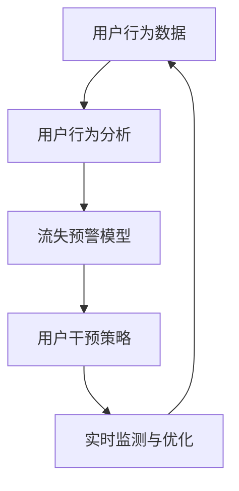

                 

# AI驱动的电商平台用户流失预警

## 1. 背景介绍

### 1.1 问题由来

在互联网快速发展的今天，电商平台已成为人们日常生活中不可或缺的一部分。然而，用户流失现象在电商平台中普遍存在，对平台的用户增长、收入和市场份额产生了严重影响。用户流失是一个复杂的系统问题，受到众多因素的影响，包括产品质量、服务体验、价格竞争、市场环境等。如何准确预测用户流失，并及时采取措施挽留用户，是电商平台亟需解决的核心挑战之一。

### 1.2 问题核心关键点

为有效应对用户流失问题，电商平台需要构建一个高效、准确的流失预警系统。该系统应具备以下几个核心功能：
1. **用户行为分析**：通过数据分析识别用户的行为特征，筛选出潜在流失用户。
2. **流失预警模型**：基于历史数据训练预测模型，对流失风险进行评估。
3. **用户干预策略**：根据模型预测结果，制定针对性的用户干预策略，减少用户流失。
4. **实时监测与优化**：系统应具备实时监测和动态优化能力，不断提升流失预警的准确性和及时性。

## 2. 核心概念与联系

### 2.1 核心概念概述

在构建流失预警系统时，需要涉及多个关键概念：

- **用户行为分析**：通过分析用户的行为数据，识别出流失的潜在迹象。常用的行为特征包括登录频率、浏览行为、购买记录、评价反馈等。
- **流失预警模型**：利用机器学习算法对用户流失风险进行预测。常见的算法包括逻辑回归、随机森林、神经网络等。
- **用户干预策略**：基于预警结果，制定相应的策略进行用户挽留，如优惠券、折扣活动、个性化推荐等。
- **实时监测与优化**：通过不断收集和分析用户数据，优化预警模型，提升系统的准确性和响应速度。

这些概念之间的逻辑关系可以通过以下Mermaid流程图来展示：



这个流程图展示了从用户行为数据到最终预警系统的流程：

1. 首先收集用户行为数据。
2. 对数据进行行为分析，识别出流失风险较高的用户。
3. 基于分析结果，训练流失预警模型，对用户流失风险进行评估。
4. 根据模型预测结果，制定并执行用户干预策略。
5. 实时监测并不断优化预警模型，以适应数据变化和用户行为变化。

## 3. 核心算法原理 & 具体操作步骤
### 3.1 算法原理概述

流失预警系统的核心算法原理基于机器学习中的监督学习。其核心思想是：利用历史用户数据，构建一个预测模型，对新用户的流失风险进行评估。通过不断迭代训练模型，提升模型的准确性和泛化能力。

具体而言，设历史用户数据为 $D=\{(x_i, y_i)\}_{i=1}^N$，其中 $x_i$ 为用户的特征向量，$y_i$ 为流失标签（1表示流失，0表示未流失）。我们的目标是构建一个预测模型 $M$，使得对于新用户 $x_{new}$，模型能准确预测其流失概率 $P(y_{new}=1|x_{new})$。

通过损失函数 $\mathcal{L}(M)$ 和优化算法，最小化模型在历史数据集上的预测误差，从而得到最优的预测模型。常用的损失函数包括交叉熵损失、对数损失等。优化算法包括梯度下降、Adam、Adagrad等。

### 3.2 算法步骤详解

流失预警系统的构建过程主要包括以下几个步骤：

**Step 1: 数据预处理**
- 收集用户行为数据，包括登录频率、浏览行为、购买记录、评价反馈等。
- 对数据进行清洗和处理，去除噪声和异常值。
- 对用户特征进行标准化处理，提升数据的可解释性和模型性能。

**Step 2: 特征工程**
- 根据业务需求，选择和构造合适的特征，如购买频率、评价情绪、购买金额等。
- 利用维度缩减技术，如主成分分析（PCA）、特征选择算法，提升模型性能。
- 构建特征矩阵 $X$ 和标签向量 $Y$。

**Step 3: 模型训练**
- 选择合适的机器学习算法，如逻辑回归、随机森林、神经网络等。
- 定义损失函数，如交叉熵损失。
- 使用优化算法，如Adam，最小化损失函数。
- 设置训练轮数、学习率等超参数，进行模型训练。

**Step 4: 模型评估**
- 使用验证集评估模型的准确性、召回率和F1分数等性能指标。
- 根据评估结果，调整模型超参数，优化模型性能。
- 使用测试集验证模型效果，评估模型的泛化能力。

**Step 5: 实时监测与优化**
- 实时收集新用户的行为数据，更新模型。
- 定期更新模型，适应数据分布变化和用户行为变化。
- 动态调整模型参数，提升预警效果。

### 3.3 算法优缺点

基于机器学习的流失预警系统具有以下优点：
1. 精度高：利用机器学习算法，可以更准确地预测用户流失风险。
2. 可扩展性：模型可以根据业务需求和数据特征进行灵活调整，适应不同的电商场景。
3. 实时性：通过实时监测和模型优化，能够及时发现和应对用户流失风险。

同时，该方法也存在一些缺点：
1. 数据依赖性高：模型的性能很大程度上依赖于数据的质量和数量。
2. 特征工程复杂：需要根据业务需求选择和构造合适的特征，工程量大。
3. 模型解释性差：机器学习模型通常是"黑盒"模型，难以解释模型决策过程。
4. 过度拟合风险：在样本量较小的情况下，模型容易发生过拟合。

尽管存在这些局限性，但就目前而言，基于机器学习的流失预警系统仍是最主流的方法之一。未来相关研究的重点在于如何进一步降低数据依赖，提升模型的泛化能力，同时兼顾可解释性和鲁棒性等因素。

### 3.4 算法应用领域

基于机器学习的流失预警方法，在电商平台用户流失预测中已经得到了广泛的应用，覆盖了各个电商领域，包括B2C、B2B、C2C等。

这些模型被广泛应用于以下场景中：
1. **客户关系管理(CRM)**：通过用户流失预测，优化客户服务和关系维护策略，提升客户满意度。
2. **市场营销**：针对流失风险较高的用户，制定精准的营销策略，提升用户留存率。
3. **产品迭代**：通过流失分析，识别产品缺陷和改进点，指导产品迭代和优化。
4. **客户细分**：对用户进行细分，针对不同群体制定差异化的留存策略。
5. **风险管理**：评估潜在的高风险客户，制定相应的风险管理措施，降低流失率。

除了以上应用场景外，基于机器学习的流失预警系统还被创新性地应用到更多场景中，如智能客服、个性化推荐、实时定价等，为电商平台的业务决策提供了有力支持。

## 4. 数学模型和公式 & 详细讲解 & 举例说明

### 4.1 数学模型构建

本节将使用数学语言对流失预警系统的构建过程进行更加严格的刻画。

设历史用户数据为 $D=\{(x_i, y_i)\}_{i=1}^N$，其中 $x_i$ 为用户的特征向量，$y_i$ 为流失标签（1表示流失，0表示未流失）。我们的目标是构建一个预测模型 $M$，使得对于新用户 $x_{new}$，模型能准确预测其流失概率 $P(y_{new}=1|x_{new})$。

定义模型 $M$ 在数据样本 $(x,y)$ 上的损失函数为 $\ell(M_{\theta}(x),y)$，则在数据集 $D$ 上的经验风险为：

$$
\mathcal{L}(\theta) = \frac{1}{N} \sum_{i=1}^N \ell(M_{\theta}(x_i),y_i)
$$

其中 $\theta$ 为模型的参数，$M_{\theta}(x)$ 为模型对输入特征 $x$ 的预测输出。

### 4.2 公式推导过程

以下我们以逻辑回归模型为例，推导交叉熵损失函数及其梯度的计算公式。

假设模型 $M_{\theta}$ 在输入 $x$ 上的输出为 $\hat{y}=M_{\theta}(x) \in [0,1]$，表示样本属于流失的概率。真实标签 $y \in \{0,1\}$。则二分类交叉熵损失函数定义为：

$$
\ell(M_{\theta}(x),y) = -[y\log \hat{y} + (1-y)\log (1-\hat{y})]
$$

将其代入经验风险公式，得：

$$
\mathcal{L}(\theta) = -\frac{1}{N}\sum_{i=1}^N [y_i\log M_{\theta}(x_i)+(1-y_i)\log(1-M_{\theta}(x_i))]
$$

根据链式法则，损失函数对参数 $\theta_k$ 的梯度为：

$$
\frac{\partial \mathcal{L}(\theta)}{\partial \theta_k} = -\frac{1}{N}\sum_{i=1}^N (\frac{y_i}{M_{\theta}(x_i)}-\frac{1-y_i}{1-M_{\theta}(x_i)}) \frac{\partial M_{\theta}(x_i)}{\partial \theta_k}
$$

其中 $\frac{\partial M_{\theta}(x_i)}{\partial \theta_k}$ 可进一步递归展开，利用自动微分技术完成计算。

### 4.3 案例分析与讲解

下面通过一个具体的案例，来分析如何使用逻辑回归模型进行用户流失预测。

假设我们有一个电商平台的客户流失数据集，包含了用户的性别、年龄、购买次数、最近购买时间等特征，以及流失标签。我们希望构建一个流失预测模型，以预测新用户的流失概率。

首先，对数据进行预处理，将数值型特征归一化，将分类特征转换为独热编码。然后，选择购买次数、最近购买时间等特征，构建特征矩阵 $X$ 和标签向量 $Y$。

接着，定义逻辑回归模型，并设置超参数，如学习率、迭代轮数等。使用交叉熵损失函数进行模型训练。训练过程中，不断计算损失函数对模型参数的梯度，并使用优化算法更新参数，直到收敛。

最后，在测试集上评估模型性能，使用准确率、召回率、F1分数等指标评估模型效果。

## 5. 项目实践：代码实例和详细解释说明
### 5.1 开发环境搭建

在进行流失预警系统开发前，我们需要准备好开发环境。以下是使用Python进行Scikit-learn开发的环境配置流程：

1. 安装Anaconda：从官网下载并安装Anaconda，用于创建独立的Python环境。

2. 创建并激活虚拟环境：
```bash
conda create -n sklearn-env python=3.8 
conda activate sklearn-env
```

3. 安装Scikit-learn：
```bash
conda install scikit-learn
```

4. 安装numpy、pandas、matplotlib等各类工具包：
```bash
pip install numpy pandas matplotlib scikit-learn tqdm jupyter notebook ipython
```

完成上述步骤后，即可在`sklearn-env`环境中开始流失预警系统的开发。

### 5.2 源代码详细实现

下面我们以逻辑回归模型为例，给出使用Scikit-learn进行用户流失预测的PyTorch代码实现。

首先，定义数据预处理和特征工程函数：

```python
import pandas as pd
from sklearn.model_selection import train_test_split
from sklearn.preprocessing import StandardScaler, OneHotEncoder
from sklearn.compose import ColumnTransformer
from sklearn.pipeline import Pipeline

# 读取数据集
data = pd.read_csv('customer_churn.csv')

# 分离特征和标签
X = data.drop('churn', axis=1)
Y = data['churn'].values

# 构建特征工程管道
numeric_transformer = Pipeline(steps=[('scaler', StandardScaler())])
categorical_transformer = Pipeline(steps=[('onehot', OneHotEncoder(handle_unknown='ignore'))])
preprocessor = ColumnTransformer(transformers=[
    ('num', numeric_transformer, ['age', 'days_since_last_purchase']),
    ('cat', categorical_transformer, ['gender', 'plan_type'])])

# 将预处理后的数据集分成训练集和验证集
X_train, X_val, y_train, y_val = train_test_split(X, Y, test_size=0.2, random_state=42)
```

然后，定义模型和优化器：

```python
from sklearn.linear_model import LogisticRegression
from sklearn.metrics import accuracy_score, precision_score, recall_score, f1_score

# 定义逻辑回归模型
model = LogisticRegression(solver='liblinear', max_iter=1000)

# 定义训练和评估函数
def train_model(X_train, y_train, X_val, y_val, model):
    # 训练模型
    model.fit(X_train, y_train)
    # 评估模型
    y_val_pred = model.predict(X_val)
    accuracy = accuracy_score(y_val, y_val_pred)
    precision = precision_score(y_val, y_val_pred)
    recall = recall_score(y_val, y_val_pred)
    f1 = f1_score(y_val, y_val_pred)
    return accuracy, precision, recall, f1

# 训练模型
accuracy, precision, recall, f1 = train_model(X_train, y_train, X_val, y_val, model)

print('Accuracy:', accuracy)
print('Precision:', precision)
print('Recall:', recall)
print('F1 Score:', f1)
```

最后，启动训练流程并在验证集上评估：

```python
# 训练模型
model.fit(X_train, y_train)

# 评估模型
y_val_pred = model.predict(X_val)
accuracy = accuracy_score(y_val, y_val_pred)
precision = precision_score(y_val, y_val_pred)
recall = recall_score(y_val, y_val_pred)
f1 = f1_score(y_val, y_val_pred)

print('Accuracy:', accuracy)
print('Precision:', precision)
print('Recall:', recall)
print('F1 Score:', f1)
```

以上就是使用Scikit-learn进行逻辑回归模型用户流失预测的完整代码实现。可以看到，Scikit-learn提供了丰富的工具和函数，使得数据预处理、模型训练和评估过程变得非常简洁高效。

### 5.3 代码解读与分析

让我们再详细解读一下关键代码的实现细节：

**特征工程管道**：
- `numeric_transformer` 管道对数值型特征进行标准化处理，使用 `StandardScaler` 归一化特征值。
- `categorical_transformer` 管道对分类特征进行独热编码，使用 `OneHotEncoder` 将分类变量转换为独热向量。
- `ColumnTransformer` 将预处理后的数值型和分类型特征组合成一个完整的特征矩阵。

**模型训练**：
- 使用 `LogisticRegression` 定义逻辑回归模型，设置优化器 `solver='liblinear'` 使用Lib线性算法，加快训练速度。
- 定义训练和评估函数 `train_model`，计算模型在验证集上的准确率、精确率、召回率和F1分数。

**训练流程**：
- 使用 `fit` 方法训练模型，并保存训练好的模型。
- 在验证集上评估模型性能，计算各种指标并打印输出。

可以看到，Scikit-learn提供了丰富的工具和函数，使得数据预处理、模型训练和评估过程变得非常简洁高效。开发者可以将更多精力放在模型改进和算法优化上，而不必过多关注底层的实现细节。

当然，工业级的系统实现还需考虑更多因素，如模型的保存和部署、超参数的自动搜索、更灵活的特征工程等。但核心的流程基本与此类似。

## 6. 实际应用场景
### 6.1 智能客服系统

基于流失预警系统的智能客服系统，可以在用户流失风险较高时主动发起对话，进行挽留干预。系统可以根据用户的历史行为和当前状态，自动生成挽留话术，并通过智能客服机器人进行对话。对话过程中，系统可以实时收集用户反馈，不断优化对话策略，提高挽留成功率。

在技术实现上，可以收集历史客服对话记录，将问题和最佳答复构建成监督数据，在此基础上对预训练客服模型进行微调。微调后的对话模型能够自动理解用户意图，匹配最合适的答复，引导用户按期望方式回答。对于客户提出的新问题，还可以接入检索系统实时搜索相关内容，动态组织生成回答。如此构建的智能客服系统，能大幅提升客户咨询体验和问题解决效率。

### 6.2 个性化推荐系统

流失预警系统在个性化推荐系统中也有广泛应用。通过用户流失预警，可以识别出对推荐内容不满意的潜在流失用户，并及时调整推荐策略，提升用户满意度。

在实践过程中，可以收集用户浏览、点击、评论、分享等行为数据，提取和推荐物品标题、描述、标签等文本内容。将文本内容作为模型输入，用户的后续行为（如是否点击、购买等）作为监督信号，在此基础上微调预训练语言模型。微调后的模型能够从文本内容中准确把握用户的兴趣点。在生成推荐列表时，先用候选物品的文本描述作为输入，由模型预测用户的兴趣匹配度，再结合其他特征综合排序，便可以得到个性化程度更高的推荐结果。

### 6.3 风险管理

在金融、保险等领域，流失预警系统可以用于识别潜在的高风险客户，制定相应的风险管理措施，降低流失率。通过分析用户行为数据，可以构建风险评估模型，对用户流失风险进行预测。风险管理策略可以包括信用评估、贷款优惠、账户监控等，帮助机构及时防范和化解潜在风险。

### 6.4 未来应用展望

随着流失预警系统技术的不断发展，其在电商平台中的应用场景将更加丰富。未来，该系统可能与大数据分析、AI推荐、实时定价等技术深度融合，提供更加精准的用户挽留和风险管理方案。

例如，结合大数据分析技术，可以进行用户行为分析和细分，制定更精准的挽留策略。结合AI推荐技术，可以实时调整推荐内容，提升用户满意度。结合实时定价技术，可以针对流失风险较高的用户，提供更有吸引力的价格优惠，增强用户黏性。

## 7. 工具和资源推荐
### 7.1 学习资源推荐

为了帮助开发者系统掌握流失预警系统的理论基础和实践技巧，这里推荐一些优质的学习资源：

1. 《机器学习实战》系列博文：由机器学习专家撰写，深入浅出地介绍了机器学习模型的构建和应用，包括逻辑回归、随机森林、神经网络等。

2. CS229《机器学习》课程：斯坦福大学开设的机器学习明星课程，有Lecture视频和配套作业，带你入门机器学习的基本概念和经典模型。

3. 《Python数据科学手册》书籍：数据科学领域的经典之作，全面介绍了数据预处理、特征工程、模型训练等技术细节。

4. Scikit-learn官方文档：机器学习库的官方文档，提供了海量的学习资源和样例代码，是上手实践的必备资料。

5. Kaggle：机器学习竞赛平台，提供了大量的数据集和样例代码，是实践数据科学和机器学习的好地方。

通过对这些资源的学习实践，相信你一定能够快速掌握流失预警系统的精髓，并用于解决实际的电商问题。

### 7.2 开发工具推荐

高效的开发离不开优秀的工具支持。以下是几款用于流失预警系统开发的常用工具：

1. Python：强大的编程语言，拥有丰富的机器学习库和数据分析工具。
2. Scikit-learn：Python机器学习库，提供了丰富的数据预处理、特征工程和模型训练工具。
3. Pandas：Python数据分析库，支持高效的数据处理和分析。
4. NumPy：Python数值计算库，提供了高效的数值计算和数组操作。
5. Jupyter Notebook：交互式笔记本，支持代码编写和数据可视化。
6. TensorBoard：TensorFlow配套的可视化工具，可实时监测模型训练状态，并提供丰富的图表呈现方式。

合理利用这些工具，可以显著提升流失预警系统的开发效率，加快创新迭代的步伐。

### 7.3 相关论文推荐

流失预警系统技术的发展源于学界的持续研究。以下是几篇奠基性的相关论文，推荐阅读：

1. "Customer Churn Prediction Using Machine Learning Algorithms"：详细介绍了多种机器学习算法在客户流失预测中的应用，包括逻辑回归、决策树、随机森林等。

2. "A Survey on Predictive Analytics for Customer Churn"：综述了流失预警系统的各种技术和应用，提供了丰富的案例和经验。

3. "Predicting Customer Churn in E-commerce: A Multi-level Analysis"：从多个维度分析了电商客户流失的因素，提供了详尽的特征工程和模型构建方法。

4. "Customer Churn Prediction in Subscription Services: A Review of State-of-the-Art Approaches"：综述了订阅服务领域中流失预警的最新技术，提供了大量的实验结果和评估指标。

5. "Customer Churn Prediction Using Ensemble Methods"：介绍多种集成学习方法在流失预警中的应用，提供了实验结果和比较分析。

这些论文代表了大规模流失预警技术的发展脉络。通过学习这些前沿成果，可以帮助研究者把握学科前进方向，激发更多的创新灵感。

## 8. 总结：未来发展趋势与挑战
### 8.1 总结

本文对基于机器学习的用户流失预警系统进行了全面系统的介绍。首先阐述了用户流失问题的背景和影响，明确了流失预警系统的核心功能。其次，从原理到实践，详细讲解了机器学习模型的构建过程和关键步骤，给出了流失预警系统开发的完整代码实例。同时，本文还广泛探讨了流失预警系统在智能客服、个性化推荐、风险管理等多个电商领域的应用前景，展示了流失预警系统的巨大潜力。

通过本文的系统梳理，可以看到，基于机器学习的流失预警系统正在成为电商领域的重要工具，极大地提升了用户留存率和业务效率。未来，伴随机器学习技术的发展，流失预警系统将不断优化和扩展，成为电商平台不可或缺的一部分。

### 8.2 未来发展趋势

展望未来，流失预警系统技术将呈现以下几个发展趋势：

1. 数据驱动：随着数据量的增加和数据质量的提升，基于大数据分析和机器学习模型的流失预警系统将变得更加精准和高效。
2. 多模态融合：结合图像、视频、语音等多模态数据，提升模型对用户行为和情感的全面理解。
3. 实时性增强：利用流式数据处理技术，实时监测用户行为，动态调整预警策略，提升系统响应速度。
4. 模型集成：利用集成学习方法，融合多种模型，提升系统的稳定性和鲁棒性。
5. 用户反馈循环：结合用户行为数据和反馈数据，持续优化模型，提高系统效果。

这些趋势将进一步推动流失预警系统技术的发展，为电商平台提供更加全面、精准的用户管理方案。

### 8.3 面临的挑战

尽管基于机器学习的流失预警系统已经取得了一定的成效，但在迈向更加智能化、普适化应用的过程中，仍面临以下挑战：

1. 数据质量和数量：流失预警系统的性能很大程度上依赖于数据的质量和数量。如何获取高质量、高规模的数据，成为系统发展的瓶颈。
2. 特征工程复杂：需要根据业务需求选择和构造合适的特征，工程量大且复杂。
3. 模型鲁棒性：在面对数据分布变化和用户行为变化时，模型可能出现鲁棒性不足的问题。
4. 实时性要求高：需要实时处理大量数据，计算资源和系统架构的优化成为关键。
5. 可解释性差：机器学习模型通常是"黑盒"模型，难以解释模型决策过程。

尽管存在这些挑战，但通过持续的技术创新和实践积累，这些问题有望逐步得到解决。

### 8.4 研究展望

面对流失预警系统所面临的挑战，未来的研究需要在以下几个方面寻求新的突破：

1. 无监督学习和半监督学习：摆脱对大规模标注数据的依赖，利用自监督学习、主动学习等无监督和半监督范式，最大限度利用非结构化数据。
2. 参数高效和计算高效：开发更加参数高效的微调方法，如AdaLoRA、Self-Normalization等，在固定大部分预训练参数的同时，只更新极少量的任务相关参数。同时优化模型的计算图，减少前向传播和反向传播的资源消耗。
3. 多模态数据融合：结合图像、视频、语音等多模态数据，提升模型对用户行为和情感的全面理解。
4. 因果推理：利用因果推断方法，增强模型建立稳定因果关系的能力，学习更加普适、鲁棒的语言表征。
5. 用户行为动态建模：结合用户历史行为数据和实时行为数据，动态建模用户行为，提高模型预测准确性。

这些研究方向的探索，将进一步推动流失预警系统技术的发展，为电商平台提供更加全面、精准的用户管理方案。

## 9. 附录：常见问题与解答

**Q1：流失预警系统在电商平台的实际应用中，是否存在数据隐私和安全性问题？**

A: 是的，流失预警系统在电商平台的实际应用中，确实存在数据隐私和安全性问题。电商平台涉及大量的用户个人信息和交易记录，如何保护这些敏感数据，是系统开发的关键挑战之一。

为应对这些问题，可以采取以下措施：
1. 数据匿名化：对用户数据进行匿名化处理，去除或模糊化敏感信息。
2. 数据加密：对存储和传输的数据进行加密处理，防止数据泄露。
3. 访问控制：严格控制数据访问权限，确保只有授权人员才能访问敏感数据。
4. 安全审计：定期进行安全审计，发现并修复潜在的安全漏洞。
5. 合规性保障：确保系统符合相关法律法规和行业标准，如GDPR、CCPA等。

通过以上措施，可以有效保护用户数据隐私和系统安全性，确保平台运营的合规性和可信度。

**Q2：流失预警系统在构建过程中，如何应对数据不平衡问题？**

A: 数据不平衡是流失预警系统在构建过程中常见的挑战之一。如果数据集中流失用户和未流失用户的比例不平衡，模型可能会偏向于预测未流失用户，导致预测效果不佳。

为应对数据不平衡问题，可以采取以下措施：
1. 重采样：通过过采样或欠采样，使数据集中流失用户和未流失用户的比例更加均衡。
2. 集成学习：利用集成学习方法，结合多个模型的预测结果，提升系统的鲁棒性和准确性。
3. 成本敏感学习：对不同类别的错误成本进行加权，提升模型对流失用户的预测精度。
4. 阈值调整：根据实际业务需求，调整模型的预测阈值，平衡系统的准确率和召回率。

通过以上措施，可以有效应对数据不平衡问题，提高流失预警系统的预测效果。

**Q3：流失预警系统在实际部署中，如何保证实时性？**

A: 保证流失预警系统的实时性，需要优化系统的架构和计算资源。以下是一些常见的方法：
1. 流式数据处理：利用流式数据处理技术，实时处理新数据，动态调整模型参数。
2. 分布式计算：采用分布式计算架构，如Spark、Flink等，并行处理大量数据，提升计算效率。
3. 模型压缩：采用模型压缩技术，如知识蒸馏、剪枝等，减小模型大小，加速推理速度。
4. 硬件加速：利用GPU、TPU等高性能设备，加速模型计算和推理。

通过以上措施，可以有效提升流失预警系统的实时性，确保系统能够及时发现和应对用户流失风险。

**Q4：流失预警系统在实际应用中，如何进行模型优化？**

A: 模型优化是流失预警系统开发中的重要环节，通过持续优化模型，提升系统的性能和准确性。以下是一些常见的优化方法：
1. 特征工程优化：不断调整和优化特征，提高模型的预测能力。
2. 模型结构优化：改进模型架构，如增加深度、调整层数等，提升模型表达能力。
3. 超参数调优：利用网格搜索、贝叶斯优化等方法，寻找最优的超参数组合。
4. 模型集成：利用集成学习方法，结合多个模型的预测结果，提升系统的鲁棒性和准确性。
5. 持续学习：通过持续收集新数据，不断训练和优化模型，保持系统的时效性和适应性。

通过以上措施，可以有效提升流失预警系统的性能和准确性，确保系统能够更好地应对用户流失风险。

---

作者：禅与计算机程序设计艺术 / Zen and the Art of Computer Programming

