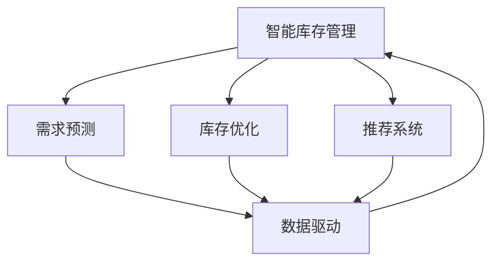

                 

# AI驱动的电商智能库存管理系统

> 关键词：智能库存管理, 电商系统, 库存优化, 需求预测, 推荐系统, 数据驱动, 实时处理, 自动化

## 1. 背景介绍

随着电子商务的迅速发展，各大电商平台面临库存管理的巨大挑战。库存过高会增加资金占用，带来仓储和物流成本；库存过低则可能无法满足用户需求，影响销售和用户体验。传统的库存管理依赖于人工经验，难以应对复杂多变的市场环境。因此，借助人工智能技术实现库存的智能化、精细化管理，成为电商企业的共同需求。

AI驱动的电商智能库存管理系统（AI-Driven E-commerce Smart Inventory Management System）通过整合需求预测、库存优化、推荐系统等技术，能够实时、动态地调整库存水平，提升供应链的效率和响应速度，实现库存管理的最优化。该系统基于数据驱动的算法模型，能够在海量数据中挖掘出深层次的业务规律，为电商企业提供精确的库存预测和决策支持。

## 2. 核心概念与联系

### 2.1 核心概念概述

为更好地理解AI-Driven E-commerce Smart Inventory Management System，本节将介绍几个关键概念：

- **智能库存管理**：利用人工智能技术，实现库存的动态调整和优化，避免库存过高或过低，提升库存管理的精准度和效率。

- **需求预测**：通过机器学习算法，预测未来一段时间内商品的需求量，为库存管理提供数据支持。

- **库存优化**：基于需求预测结果，优化库存水平，确保在满足销售需求的同时，最小化库存成本。

- **推荐系统**：根据用户历史行为和偏好，推荐相关商品，提高用户满意度和购买转化率。

- **数据驱动**：以电商平台上积累的海量数据为基础，通过算法模型挖掘出业务规律，为库存管理提供科学依据。

- **实时处理**：利用流式计算和实时数据处理技术，确保库存管理系统对市场变化做出及时响应。

- **自动化**：通过AI算法自动化处理库存管理任务，减少人工干预，提升运营效率。

这些概念之间的关系可以通过以下Mermaid流程图来展示：



这个流程图展示了智能库存管理的核心流程和数据流向：

1. 智能库存管理通过需求预测和库存优化等模块实现动态库存调整。
2. 需求预测基于数据驱动，挖掘历史销售数据中的规律。
3. 库存优化进一步利用需求预测结果，最小化库存成本。
4. 推荐系统提升用户体验，增加销售转化。
5. 数据驱动贯穿整个系统，保证决策的科学性和准确性。
6. 实时处理和自动化提升系统的响应速度和运营效率。

## 3. 核心算法原理 & 具体操作步骤
### 3.1 算法原理概述

AI-Driven E-commerce Smart Inventory Management System的算法原理基于以下几个关键模块：

1. **需求预测**：采用时间序列分析、机器学习等方法，预测未来商品的需求量。
2. **库存优化**：基于需求预测结果，应用优化算法调整库存水平。
3. **推荐系统**：利用协同过滤、内容推荐等技术，推荐相关商品。
4. **实时处理**：采用流式计算框架，实时处理数据流，保证系统的及时响应。
5. **自动化**：通过自动化流程管理，减少人工干预，提升效率。

这些模块相互协同，共同实现库存的智能管理。

### 3.2 算法步骤详解

#### 3.2.1 需求预测

需求预测是库存管理的基础，其核心算法步骤如下：

1. **数据准备**：收集历史销售数据、季节性因素、促销活动等相关信息，作为训练数据集。
2. **特征工程**：选择和构建预测模型的特征，如时间、星期、节假日等。
3. **模型训练**：选择合适的时间序列模型（如ARIMA、LSTM等）或机器学习模型（如随机森林、梯度提升等），训练需求预测模型。
4. **模型评估**：使用交叉验证、均方误差等指标评估模型性能，选择最优模型。
5. **预测更新**：定期更新模型参数，重新训练预测模型，保持预测准确性。

#### 3.2.2 库存优化

库存优化通过优化算法调整库存水平，其核心步骤如下：

1. **需求预测结果**：获取需求预测结果，作为库存优化的基础。
2. **库存目标设置**：根据销售目标和成本考虑，设置库存目标水平。
3. **库存调整策略**：根据库存目标，结合订单处理速度、供应商交货时间等因素，制定库存调整策略。
4. **库存动态调整**：通过算法模型（如Q优化算法、ABC分析等），动态调整库存水平。
5. **库存监控**：实时监控库存水平，及时调整策略。

#### 3.2.3 推荐系统

推荐系统通过协同过滤、内容推荐等技术，提升用户满意度，其核心步骤如下：

1. **用户行为数据收集**：收集用户浏览、购买、评分等行为数据。
2. **用户画像构建**：通过聚类、降维等技术，构建用户画像，描述用户兴趣和偏好。
3. **物品特征提取**：提取商品的属性、标签等信息，作为推荐模型的特征。
4. **推荐模型训练**：选择合适推荐算法（如协同过滤、矩阵分解等），训练推荐模型。
5. **推荐结果生成**：根据用户画像和商品特征，生成推荐结果。
6. **推荐效果评估**：通过A/B测试、点击率等指标评估推荐效果，持续优化推荐模型。

#### 3.2.4 实时处理

实时处理通过流式计算框架，确保系统的及时响应，其核心步骤如下：

1. **数据流管理**：设计数据流图，定义数据流的输入、处理、输出。
2. **流式计算引擎选择**：选择适合的流式计算框架（如Apache Flink、Apache Kafka等），搭建实时处理系统。
3. **实时数据处理**：通过流式计算引擎，实时处理数据流，生成预测结果、库存水平等信息。
4. **数据存储与访问**：将处理结果存储至分布式数据库，供需求预测、库存优化等模块使用。
5. **系统监控与优化**：实时监控系统性能，发现问题及时优化。

#### 3.2.5 自动化

自动化通过流程管理工具，提升系统的运营效率，其核心步骤如下：

1. **工作流设计**：设计自动化流程，涵盖需求预测、库存优化、推荐系统等环节。
2. **流程编排工具选择**：选择适合的流程编排工具（如Airflow、Kubernetes等），搭建自动化系统。
3. **自动化任务实现**：编写自动化脚本，实现各模块的自动运行。
4. **系统监控与告警**：通过监控工具（如Prometheus、Grafana等），实时监控系统状态，设置告警阈值。
5. **异常处理与修复**：设计异常处理机制，及时修复系统问题。

### 3.3 算法优缺点

AI-Driven E-commerce Smart Inventory Management System具有以下优点：

1. **预测准确性高**：通过机器学习算法，能够准确预测未来需求，为库存管理提供科学依据。
2. **库存优化效果好**：结合库存目标和订单处理速度等因素，实现库存的最优化。
3. **推荐效果显著**：通过推荐系统提升用户体验，增加销售转化。
4. **实时响应快**：通过流式计算，实时处理数据流，保证系统的及时响应。
5. **自动化程度高**：通过流程管理工具，减少人工干预，提升效率。

同时，该系统也存在一些局限性：

1. **数据质量要求高**：需求预测和库存优化依赖于高质量的数据，数据质量对系统性能有重要影响。
2. **模型复杂度高**：预测模型和优化算法复杂度高，需要较高的计算资源和专业知识。
3. **系统稳定性挑战**：实时处理和自动化流程需要较高的系统稳定性，任何故障都可能导致系统崩溃。
4. **用户隐私问题**：推荐系统需要收集用户行为数据，可能涉及隐私保护问题。

### 3.4 算法应用领域

AI-Driven E-commerce Smart Inventory Management System在多个领域中具有广泛的应用前景：

1. **电子商务**：通过库存管理提升运营效率，增加用户满意度和销售额。
2. **物流管理**：优化库存水平，减少仓储和物流成本。
3. **供应链管理**：实现供应链的动态调整和优化，提升供应链的响应速度。
4. **零售业**：通过推荐系统提升用户购买体验，增加交叉销售机会。
5. **在线教育**：通过需求预测和库存管理，优化课程资源配置。
6. **医疗健康**：通过需求预测，优化医疗资源配置，提升服务质量。

## 4. 数学模型和公式 & 详细讲解 & 举例说明

### 4.1 数学模型构建

本节将使用数学语言对AI-Driven E-commerce Smart Inventory Management System的算法模型进行更加严格的刻画。

记需求预测模型为 $P_t = f(X_t)$，其中 $X_t$ 为时间 $t$ 的特征向量，$P_t$ 为预测的需求量。库存优化模型为 $I_{t+1} = g(I_t, P_t)$，其中 $I_t$ 为时间 $t$ 的库存水平，$I_{t+1}$ 为时间 $t+1$ 的库存水平。推荐系统模型为 $R_u = h(U_u, P_t)$，其中 $U_u$ 为用户 $u$ 的特征向量，$R_u$ 为用户 $u$ 的推荐结果。

### 4.2 公式推导过程

以下我们以ARIMA模型为例，推导需求预测的数学公式。

假设需求量 $D_t$ 服从ARIMA$(1,1,1)(0,1,0)[1]模型，则有：

$$
D_t = \phi D_{t-1} + \theta \epsilon_{t-1} + \epsilon_t
$$

其中 $\phi$ 和 $\theta$ 为模型参数，$\epsilon_t$ 为误差项。对上述模型进行差分和回归，可以得到ARIMA模型：

$$
\Delta D_t = \phi \Delta D_{t-1} + \theta \epsilon_{t-1} + \epsilon_t
$$

$$
D_t = D_{t-1} + \Delta D_t
$$

将 $D_t$ 分解为趋势项 $D_{t-1}$ 和随机项 $\Delta D_t$，可以得到：

$$
D_t = D_{t-1} + \phi (D_{t-2} - D_{t-1}) + \theta (\epsilon_{t-1} - \phi \epsilon_{t-2}) + \epsilon_t
$$

将上述公式进行简化，可以得到ARIMA模型的递推式：

$$
D_t = (1-\phi)D_{t-1} + \phi D_{t-2} + \theta \epsilon_{t-1} + \epsilon_t
$$

### 4.3 案例分析与讲解

假设某电商平台销售某商品，收集了近一年的销售数据，包括每天的销售额、季节性因素等。将这些数据作为训练数据集，使用ARIMA模型进行需求预测。

具体步骤如下：

1. **数据准备**：将销售数据进行预处理，去除异常值和缺失值，划分训练集和测试集。
2. **特征工程**：选择时间、星期、节假日等特征，构建特征向量 $X_t$。
3. **模型训练**：使用训练集数据训练ARIMA模型，得到模型参数 $\phi$ 和 $\theta$。
4. **模型评估**：使用测试集数据评估模型性能，计算均方误差。
5. **预测更新**：定期更新模型参数，重新训练预测模型，保持预测准确性。

通过上述步骤，可以得到每天的预测需求量，为库存管理提供科学依据。

## 5. 项目实践：代码实例和详细解释说明

### 5.1 开发环境搭建

在进行AI-Driven E-commerce Smart Inventory Management System的开发前，我们需要准备好开发环境。以下是使用Python进行PyTorch开发的环境配置流程：

1. 安装Anaconda：从官网下载并安装Anaconda，用于创建独立的Python环境。

2. 创建并激活虚拟环境：
```bash
conda create -n pytorch-env python=3.8 
conda activate pytorch-env
```

3. 安装PyTorch：根据CUDA版本，从官网获取对应的安装命令。例如：
```bash
conda install pytorch torchvision torchaudio cudatoolkit=11.1 -c pytorch -c conda-forge
```

4. 安装Transformers库：
```bash
pip install transformers
```

5. 安装各类工具包：
```bash
pip install numpy pandas scikit-learn matplotlib tqdm jupyter notebook ipython
```

完成上述步骤后，即可在`pytorch-env`环境中开始项目实践。

### 5.2 源代码详细实现

下面我们以需求预测模块为例，给出使用PyTorch进行ARIMA模型训练的代码实现。

首先，定义需求预测的数据处理函数：

```python
import pandas as pd
from statsmodels.tsa.arima_model import ARIMA
from sklearn.metrics import mean_squared_error

def predict_demand(train_data, test_data, order=(1, 1, 1)):
    # 将数据转换为时间序列
    train_data = train_data['Sales'].values.reshape(-1, 1)
    test_data = test_data['Sales'].values.reshape(-1, 1)

    # 建立ARIMA模型
    model = ARIMA(train_data, order=order)
    model_fit = model.fit()

    # 预测需求量
    train_pred = model_fit.predict(start=0, end=len(train_data) - 1)
    test_pred = model_fit.predict(start=len(train_data), end=len(train_data) + len(test_data) - 1)

    # 计算误差
    train_mse = mean_squared_error(train_data, train_pred)
    test_mse = mean_squared_error(test_data, test_pred)

    return train_mse, test_mse
```

然后，定义需求预测的主函数：

```python
from datetime import datetime
from sklearn.metrics import mean_squared_error

def main():
    # 加载数据
    train_data = pd.read_csv('train.csv', parse_dates=['Date'], index_col='Date')
    test_data = pd.read_csv('test.csv', parse_dates=['Date'], index_col='Date')

    # 划分数据集
    train_data = train_data['Sales']
    test_data = test_data['Sales']

    # 预测需求量
    train_mse, test_mse = predict_demand(train_data, test_data)

    # 输出结果
    print(f'训练集均方误差: {train_mse:.4f}')
    print(f'测试集均方误差: {test_mse:.4f}')

if __name__ == '__main__':
    main()
```

运行上述代码，即可在终端输出预测结果和误差指标。

### 5.3 代码解读与分析

让我们再详细解读一下关键代码的实现细节：

**ARIMA模型训练函数**：
- `predict_demand`函数：接收训练集和测试集数据，指定ARIMA模型阶数，使用`statsmodels`库建立ARIMA模型。
- `model_fit.fit()`方法：对模型进行拟合，得到模型参数。
- `model_fit.predict()`方法：使用模型预测训练集和测试集的需求量。
- `mean_squared_error`函数：计算预测误差。

**主函数**：
- `main`函数：加载数据，划分数据集，调用`predict_demand`函数进行需求预测，输出误差结果。

**数据处理**：
- `parse_dates`参数：将日期列转换为时间序列，方便模型的处理。
- `index_col`参数：指定时间序列的索引列，方便数据的切片和访问。

**结果输出**：
- `print`语句：输出训练集和测试集的需求预测误差，用于评估模型的性能。

通过上述代码，我们可以清晰地看到使用PyTorch进行ARIMA模型训练的完整流程。开发者可以根据具体需求，进一步优化代码，提升模型预测精度。

## 6. 实际应用场景

### 6.1 智能仓储管理

AI-Driven E-commerce Smart Inventory Management System在智能仓储管理中具有广泛的应用前景。通过实时监控库存水平和需求预测，系统可以自动调整补货计划，减少人工干预，提升仓储效率。

在技术实现上，可以将需求预测和库存优化模块集成到仓储管理系统，实时更新库存状态和补货策略。通过自动化流程管理，确保库存水平始终处于最优状态，避免缺货或库存积压。

### 6.2 个性化推荐

推荐系统是AI-Driven E-commerce Smart Inventory Management System的重要组成部分。通过推荐系统，电商平台能够提升用户体验，增加销售转化。

在实际应用中，可以根据用户历史行为和兴趣，生成个性化推荐列表。通过协同过滤、内容推荐等技术，推荐相关商品，提升用户满意度。对于热门商品，可以进一步优化补货策略，确保库存水平满足市场需求。

### 6.3 供应链优化

AI-Driven E-commerce Smart Inventory Management System能够优化供应链管理，提升整体运营效率。通过需求预测和库存优化，系统能够实时调整供应链的供需平衡，减少库存成本。

在实际应用中，可以将需求预测和库存优化模块集成到供应链管理系统，实时监控供应链状态，动态调整订单处理速度和供应商交货时间。通过自动化流程管理，确保供应链的顺畅运行，提升物流效率。

### 6.4 未来应用展望

随着AI-Driven E-commerce Smart Inventory Management System的发展，未来将拓展到更多领域，带来更深远的变革：

1. **智能制造**：通过需求预测和库存管理，优化生产计划，提升制造效率。
2. **智慧物流**：通过实时处理和自动化管理，提升物流网络的响应速度和效率。
3. **智能客服**：通过推荐系统和自动化流程，提升客户服务质量，减少人工干预。
4. **智慧城市**：通过需求预测和库存管理，优化城市物资配置，提升应急响应能力。
5. **智能医疗**：通过需求预测和库存管理，优化医疗资源配置，提升医疗服务质量。

未来，随着技术的不断进步和应用场景的拓展，AI-Driven E-commerce Smart Inventory Management System必将在更广泛的领域发挥重要作用，为社会创造更多价值。

## 7. 工具和资源推荐
### 7.1 学习资源推荐

为了帮助开发者系统掌握AI-Driven E-commerce Smart Inventory Management System的理论基础和实践技巧，这里推荐一些优质的学习资源：

1. **《机器学习实战》系列书籍**：系统介绍机器学习的基本概念和算法，涵盖时间序列分析、协同过滤等内容。

2. **CS231n《深度学习与计算机视觉》课程**：斯坦福大学开设的计算机视觉课程，详细讲解图像处理、推荐系统等内容。

3. **《深度学习》书籍**：Ian Goodfellow等人编写，全面介绍深度学习的理论基础和实践方法。

4. **HuggingFace官方文档**：Transformer库的官方文档，提供了海量预训练模型和完整的微调样例代码。

5. **PyTorch官方文档**：PyTorch的官方文档，提供了丰富的API和教程，适合深度学习开发。

通过对这些资源的学习实践，相信你一定能够快速掌握AI-Driven E-commerce Smart Inventory Management System的精髓，并用于解决实际的库存管理问题。

### 7.2 开发工具推荐

高效的开发离不开优秀的工具支持。以下是几款用于AI-Driven E-commerce Smart Inventory Management System开发的常用工具：

1. **PyTorch**：基于Python的开源深度学习框架，灵活动态的计算图，适合快速迭代研究。

2. **TensorFlow**：由Google主导开发的开源深度学习框架，生产部署方便，适合大规模工程应用。

3. **Transformers库**：HuggingFace开发的NLP工具库，集成了众多SOTA语言模型，支持PyTorch和TensorFlow，是进行AI-Driven E-commerce Smart Inventory Management System开发的利器。

4. **Prometheus**：监控系统，实时采集和分析系统指标，确保系统稳定运行。

5. **Grafana**：可视化工具，实时展示系统性能，帮助开发人员快速定位问题。

6. **Airflow**：流程编排工具，设计自动化流程，管理任务调度。

合理利用这些工具，可以显著提升AI-Driven E-commerce Smart Inventory Management System的开发效率，加快创新迭代的步伐。

### 7.3 相关论文推荐

AI-Driven E-commerce Smart Inventory Management System的研究源于学界的持续研究。以下是几篇奠基性的相关论文，推荐阅读：

1. **《深度学习》**：Ian Goodfellow等人编写，全面介绍深度学习的理论基础和实践方法。

2. **《时间序列分析与预测》**：Box和Jenkins的经典著作，详细讲解时间序列分析的方法和应用。

3. **《协同过滤推荐系统》**：Adams等人编写，详细介绍协同过滤推荐算法的原理和实现。

4. **《流式计算》**：Chen等人编写，讲解流式计算的基本原理和应用场景。

5. **《智能供应链管理》**：Li和Hu编写，介绍智能供应链管理的基本概念和优化算法。

这些论文代表了大语言模型微调技术的发展脉络。通过学习这些前沿成果，可以帮助研究者把握学科前进方向，激发更多的创新灵感。

## 8. 总结：未来发展趋势与挑战

### 8.1 总结

本文对AI-Driven E-commerce Smart Inventory Management System进行了全面系统的介绍。首先阐述了智能库存管理在电子商务中的应用背景和需求，明确了需求预测、库存优化、推荐系统等模块的重要性。其次，从原理到实践，详细讲解了各个模块的算法模型和实现步骤，给出了具体的代码实例和详细解读。同时，本文还探讨了AI-Driven E-commerce Smart Inventory Management System在智能仓储、个性化推荐、供应链优化等多个领域的应用前景，展示了系统的广泛价值。此外，本文精选了系统的学习资源、开发工具和相关论文，力求为读者提供全方位的技术指引。

通过本文的系统梳理，可以看到，AI-Driven E-commerce Smart Inventory Management System通过整合需求预测、库存优化、推荐系统等技术，能够实现智能库存管理的最优化。该系统基于数据驱动的算法模型，能够在海量数据中挖掘出深层次的业务规律，为电商企业提供精确的库存预测和决策支持。未来，伴随技术的不断演进和应用场景的拓展，AI-Driven E-commerce Smart Inventory Management System必将在更多领域发挥重要作用，为人类生产生活方式带来深远影响。

### 8.2 未来发展趋势

展望未来，AI-Driven E-commerce Smart Inventory Management System将呈现以下几个发展趋势：

1. **数据规模扩大**：随着物联网和智能设备的普及，数据规模将进一步扩大，提供更多的数据来源和业务规律。

2. **算法模型优化**：未来的需求预测和库存优化算法将更加复杂，结合深度学习、强化学习等技术，提升模型的准确性和鲁棒性。

3. **实时处理能力提升**：流式计算和实时数据处理技术将进一步提升，确保系统对市场变化的及时响应。

4. **自动化流程完善**：自动化流程管理将更加精细化，减少人工干预，提升运营效率。

5. **边缘计算应用**：通过边缘计算，将智能库存管理部署到本地设备，提升系统的响应速度和数据安全。

6. **跨领域融合**：与其他AI技术（如知识图谱、因果推理等）进行更深层次的融合，提升系统的综合性能。

以上趋势凸显了AI-Driven E-commerce Smart Inventory Management System的广阔前景。这些方向的探索发展，必将进一步提升系统的性能和应用范围，为电商企业带来更高效、更智能的库存管理解决方案。

### 8.3 面临的挑战

尽管AI-Driven E-commerce Smart Inventory Management System已经取得了一定成果，但在迈向更加智能化、普适化应用的过程中，仍面临诸多挑战：

1. **数据质量问题**：需求预测和库存优化依赖于高质量的数据，数据质量对系统性能有重要影响。

2. **模型复杂度高**：算法模型复杂度高，需要较高的计算资源和专业知识。

3. **系统稳定性挑战**：实时处理和自动化流程需要较高的系统稳定性，任何故障都可能导致系统崩溃。

4. **用户隐私问题**：推荐系统需要收集用户行为数据，可能涉及隐私保护问题。

5. **计算资源需求高**：大规模数据的处理和实时计算需要高性能计算资源，资源需求较高。

6. **业务需求复杂**：不同电商平台的业务需求各异，系统需要灵活适应，满足多样化需求。

面对这些挑战，需要不断优化算法模型，提升系统稳定性，保障数据安全，满足用户隐私需求，降低资源消耗，才能确保系统的长期稳定运行。

### 8.4 研究展望

面向未来，AI-Driven E-commerce Smart Inventory Management System的研究需要在以下几个方面寻求新的突破：

1. **数据预处理优化**：提升数据质量，减少噪声，优化特征工程，提高预测准确性。

2. **算法模型改进**：结合深度学习、强化学习等技术，提升算法模型的鲁棒性和泛化能力。

3. **实时处理技术优化**：提升流式计算和实时数据处理技术，确保系统对市场变化的及时响应。

4. **自动化流程管理优化**：优化自动化流程管理，减少人工干预，提升运营效率。

5. **边缘计算应用研究**：研究边缘计算在智能库存管理中的应用，提升系统的响应速度和数据安全。

6. **跨领域融合研究**：与其他AI技术进行更深层次的融合，提升系统的综合性能。

这些研究方向的研究和突破，必将引领AI-Driven E-commerce Smart Inventory Management System迈向更高的台阶，为人类生产生活方式带来更深刻的变革。

## 9. 附录：常见问题与解答

**Q1：AI-Driven E-commerce Smart Inventory Management System是如何进行需求预测的？**

A: AI-Driven E-commerce Smart Inventory Management System通过时间序列分析、机器学习等方法进行需求预测。具体步骤如下：

1. **数据准备**：收集历史销售数据、季节性因素、促销活动等相关信息，作为训练数据集。

2. **特征工程**：选择和构建预测模型的特征，如时间、星期、节假日等。

3. **模型训练**：选择合适的时间序列模型（如ARIMA、LSTM等）或机器学习模型（如随机森林、梯度提升等），训练需求预测模型。

4. **模型评估**：使用交叉验证、均方误差等指标评估模型性能，选择最优模型。

5. **预测更新**：定期更新模型参数，重新训练预测模型，保持预测准确性。

通过上述步骤，可以得到每天的预测需求量，为库存管理提供科学依据。

**Q2：AI-Driven E-commerce Smart Inventory Management System的库存优化算法有哪些？**

A: AI-Driven E-commerce Smart Inventory Management System的库存优化算法主要包括以下几种：

1. **Q优化算法**：通过最小化补货成本和缺货成本，实现库存的最优化。

2. **ABC分析**：将库存分为A、B、C三类，针对不同类别的商品采取不同的库存策略。

3. **经济订货批量模型**：通过优化订货量和订货时间，最小化库存成本。

4. **模拟退火算法**：通过模拟退火过程，寻找最优库存水平。

这些算法可以根据具体场景进行选择和优化，确保库存水平的合理性和经济性。

**Q3：AI-Driven E-commerce Smart Inventory Management System的推荐系统有哪些类型？**

A: AI-Driven E-commerce Smart Inventory Management System的推荐系统主要包括以下几种类型：

1. **协同过滤推荐系统**：基于用户行为数据，推荐相似用户喜欢的商品。

2. **内容推荐系统**：基于商品属性、标签等特征，推荐相关商品。

3. **混合推荐系统**：结合协同过滤和内容推荐，提升推荐效果。

4. **基于深度学习的推荐系统**：利用深度神经网络，提升推荐精度。

这些推荐系统可以根据具体场景进行选择和优化，确保推荐结果的准确性和多样性。

**Q4：AI-Driven E-commerce Smart Inventory Management System的实时处理技术有哪些？**

A: AI-Driven E-commerce Smart Inventory Management System的实时处理技术主要包括以下几种：

1. **流式计算框架**：采用Apache Flink、Apache Kafka等流式计算框架，实时处理数据流。

2. **实时数据存储**：采用分布式数据库，如Hadoop、Spark，存储和访问实时数据。

3. **数据流处理引擎**：采用流式处理引擎，如Storm、Spark Streaming，实时处理数据流。

4. **实时监控工具**：采用Prometheus、Grafana等监控工具，实时监控系统状态，确保系统稳定运行。

这些技术可以确保系统对市场变化的及时响应，提升系统的实时处理能力。

**Q5：AI-Driven E-commerce Smart Inventory Management System的自动化流程管理有哪些工具？**

A: AI-Driven E-commerce Smart Inventory Management System的自动化流程管理主要包括以下几种工具：

1. **流程编排工具**：采用Airflow、Kubernetes等流程编排工具，设计和管理自动化流程。

2. **任务调度工具**：采用Crontab、Kubernetes CronJob等任务调度工具，定时执行自动化任务。

3. **自动化监控工具**：采用Zabbix、Prometheus等监控工具，实时监控自动化流程状态。

4. **自动化告警工具**：采用PagerDuty、Slack等告警工具，设置告警阈值，及时处理异常情况。

这些工具可以确保自动化流程的稳定运行，提升系统的运营效率。

---

作者：禅与计算机程序设计艺术 / Zen and the Art of Computer Programming

