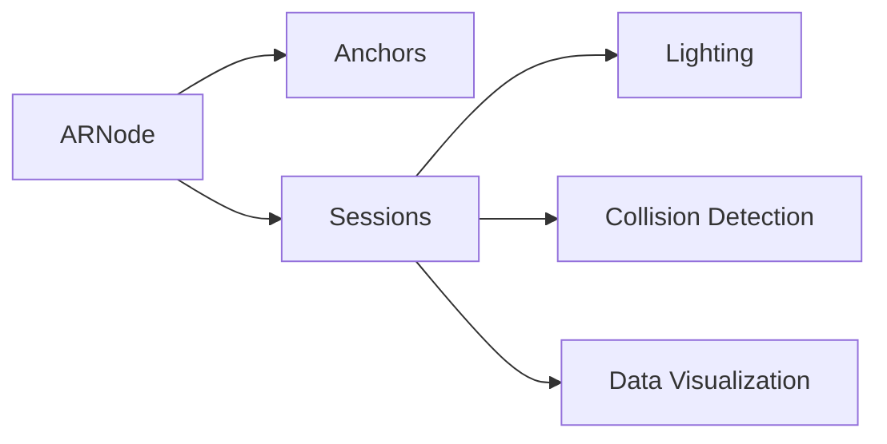

                 

# ARKit 增强现实框架优势分析：在 iOS 设备上创建逼真的 AR 体验

> 关键词：ARKit, 增强现实, iOS 设备, 逼真体验, 开发环境, 代码实现, 实际应用, 未来展望

## 1. 背景介绍

增强现实技术（Augmented Reality, AR）已经成为现代科技和娱乐领域的重要组成部分，为人们提供了全新的交互方式和视觉体验。在移动设备上，iOS设备的普及使得AR技术得以广泛应用，Apple通过ARKit框架为开发者提供了便捷的AR开发工具和支持，使得开发者可以快速在iOS设备上创建逼真的AR体验。

### 1.1 增强现实技术概述
增强现实技术将计算机生成的数字信息与用户对真实世界的感知相结合，创建一个具有互动性的信息叠加环境。AR可以应用于游戏、教育、医疗、工业等领域，为用户提供全新的信息获取和互动方式。

### 1.2 ARKit框架介绍
ARKit是Apple为iOS设备提供的一套AR开发框架，它建立在Core Graphics和Metal GPU加速技术之上，支持AR体验的快速开发和部署。ARKit为开发者提供了API和SDK，可以轻松创建AR应用，并在iOS设备上实现复杂的AR体验。

## 2. 核心概念与联系

### 2.1 核心概念概述

要深入理解ARKit框架的优势，需要首先了解其核心概念：

- **ARNode**：ARNode是ARKit框架的基本组件，它代表了AR体验中的一个空间节点，可以与物理空间中的对象进行交互。
- **Anchors**：Anchors是ARKit中用于将虚拟对象锚定在物理空间中的关键点，可以为虚拟对象提供空间定位和姿态信息。
- **Sessions**：Sessions是ARKit中的顶层类，代表AR体验的整个会话，管理ARNode和Anchors等元素。
- **Lighting**：ARKit提供了逼真的光照效果，可以通过调整环境光、光源、阴影等参数来增强AR场景的逼真感。
- **Collision Detection**：碰撞检测是ARKit中用于判断虚拟对象与真实对象交互的关键技术，通过碰撞检测，可以实现虚拟对象与真实对象的物理碰撞和互动。
- **Data Visualization**：ARKit提供了多种方式来展示AR数据，如使用ScenesView显示AR环境，使用ARHitTestResult显示交互点等。

这些概念之间相互依赖，共同构成了ARKit的开发基础，并使其在iOS设备上提供了强大的AR体验开发能力。

### 2.2 核心概念原理和架构的 Mermaid 流程图



这个流程图展示了ARKit中核心概念之间的相互依赖关系。ARNode作为基础，通过Anchors锚定在物理空间中，并通过Sessions管理与Lighting、Collision Detection、Data Visualization等模块的交互，共同构建了一个完整的AR体验。

## 3. 核心算法原理 & 具体操作步骤

### 3.1 算法原理概述

ARKit框架的核心算法主要基于计算机视觉和图形渲染技术，通过摄像头、传感器和环境光等信息，对物理空间进行实时分析和渲染，实现虚拟对象与真实环境的融合。ARKit框架的算法原理可以分为以下几个步骤：

1. **摄像头数据捕获**：ARKit使用设备的摄像头捕获实时图像数据。
2. **环境理解**：通过图像处理算法，ARKit对摄像头捕获的图像进行环境分析，识别出场景中的关键点和边缘。
3. **空间定位**：利用设备的三轴陀螺仪、加速计等传感器数据，ARKit可以计算出设备的姿态和运动轨迹。
4. **虚拟对象渲染**：通过图形渲染技术，ARKit将虚拟对象渲染到图像数据中，并结合环境信息进行空间定位和姿态调整。
5. **用户交互**：通过碰撞检测和手势识别等技术，ARKit可以实现用户与虚拟对象的互动。

### 3.2 算法步骤详解

下面详细介绍ARKit框架中每个关键步骤的实现方法：

#### 3.2.1 摄像头数据捕获
ARKit使用AVFoundation框架中的AVCaptureSession类来捕获摄像头数据。以下是一个简单的示例代码：

```swift
if let captureSession = AVCaptureSession() {
    captureSession.sessionPreset = .interactive
    captureSession.beginConfiguration()

    guard let device = AVCaptureDevice.default(for: .video),
        let input = try? AVCaptureDeviceInput(device: device) else {
        return
    }

    captureSession.addInput(input)
    captureSession.startRunning()
}
```

#### 3.2.2 环境理解
ARKit通过AVFilterGraph和AVFilterNode类实现对摄像头数据的处理和分析。以下是一个简单的示例代码：

```swift
if let session = AVCaptureSession(),
    let videoOutput = session.output?.videoOutput,
    let filter = AVFilter(viURLString: "ar.nodes filter") {
    session.addInput(videoOutput)
    session.addOutput(filter)
    session.startRunning()
}
```

#### 3.2.3 空间定位
ARKit通过ARWorldTrackingConfiguration类和ARWorldTrackingSession类实现对设备姿态和运动轨迹的计算。以下是一个简单的示例代码：

```swift
if let session = ARWorldTrackingSession(),
    let node = ANCHOR {
    session.addAnchor(node)
    session.run()
}
```

#### 3.2.4 虚拟对象渲染
ARKit使用Metal图形渲染技术将虚拟对象渲染到摄像头捕获的图像数据中。以下是一个简单的示例代码：

```swift
let node = ANCHOR
let texture = MTLTexture()

node.texture = texture
```

#### 3.2.5 用户交互
ARKit通过碰撞检测和手势识别等技术实现用户与虚拟对象的互动。以下是一个简单的示例代码：

```swift
if let session = ARWorldTrackingSession() {
    session.add(node)
    session.run()
}
```

### 3.3 算法优缺点

ARKit框架具有以下优点：

- **易于使用**：ARKit提供了简单易用的API和SDK，使得开发者可以快速上手，并创建复杂的AR应用。
- **性能稳定**：ARKit在iOS设备上运行流畅，性能稳定，能够提供高质量的AR体验。
- **跨平台支持**：ARKit支持iOS和macOS设备，开发者可以创建跨平台的AR应用。
- **丰富的文档和示例**：Apple提供了丰富的文档和示例，帮助开发者快速理解和实现ARKit功能。

同时，ARKit框架也存在一些缺点：

- **受硬件限制**：ARKit依赖于设备的摄像头、传感器等硬件设备，设备的性能和精度会直接影响AR体验的质量。
- **依赖Apple生态**：ARKit依赖于Apple的生态系统，如果用户没有安装Apple设备或iOS系统，无法使用ARKit功能。
- **应用场景受限**：ARKit主要适用于移动设备的AR应用，无法在PC或服务器上使用。

### 3.4 算法应用领域

ARKit框架在多个领域都有广泛的应用：

- **游戏**：ARKit在游戏开发中广泛应用，可以创建沉浸式的AR游戏体验，如《精灵旅社：夜间降临》等。
- **教育**：ARKit在教育领域应用广泛，如通过AR技术实现历史场景重现、虚拟实验室等。
- **医疗**：ARKit可以用于手术模拟、解剖学教学等医疗应用。
- **工业**：ARKit可以用于设备维护、虚拟装配等工业应用。
- **娱乐**：ARKit在娱乐领域应用广泛，如AR音乐会、虚拟现实体验等。

## 4. 数学模型和公式 & 详细讲解

### 4.1 数学模型构建

ARKit框架的数学模型基于计算机视觉和图形渲染技术，主要涉及以下几个方面：

- **相机模型**：用于描述相机的内参和外参，如焦距、畸变系数等。
- **空间坐标转换**：用于将虚拟对象转换到物理空间中，如将像素坐标转换为世界坐标。
- **图形渲染**：用于将虚拟对象渲染到摄像头捕获的图像数据中。
- **碰撞检测**：用于检测虚拟对象与真实对象的碰撞。

### 4.2 公式推导过程

#### 4.2.1 相机模型

相机模型描述了相机的内参和外参，其中内参用于计算图像中的像素坐标，外参用于计算物体在三维空间中的坐标。以下是相机的内参和外参的公式：

$$
\mathbf{K} = \begin{bmatrix} f_x & 0 & c_x \\ 0 & f_y & c_y \\ 0 & 0 & 1 \end{bmatrix}
$$

$$
\mathbf{R} = \begin{bmatrix} r_{11} & r_{12} & r_{13} \\ r_{21} & r_{22} & r_{23} \\ r_{31} & r_{32} & r_{33} \end{bmatrix}
$$

$$
\mathbf{t} = \begin{bmatrix} t_x \\ t_y \\ t_z \end{bmatrix}
$$

其中，$f_x$、$f_y$是相机的焦距，$c_x$、$c_y$是相机光心的横纵坐标，$\mathbf{R}$和$\mathbf{t}$分别是相机的旋转矩阵和位移向量。

#### 4.2.2 空间坐标转换

将虚拟对象转换到物理空间中，需要进行空间坐标的转换。以下是空间坐标转换的公式：

$$
\mathbf{p}_c = \mathbf{K} \cdot \mathbf{p}_{uv}
$$

$$
\mathbf{p} = \mathbf{R} \cdot \mathbf{p}_c + \mathbf{t}
$$

其中，$\mathbf{p}_{uv}$是图像平面上的像素坐标，$\mathbf{p}_c$是像素坐标经过内参转换后的三维坐标，$\mathbf{p}$是虚拟对象在物理空间中的坐标。

#### 4.2.3 图形渲染

ARKit使用Metal图形渲染技术将虚拟对象渲染到摄像头捕获的图像数据中。以下是渲染的公式：

$$
\mathbf{p}_{uv} = \mathbf{K}^{-1} \cdot (\mathbf{p} - \mathbf{t})
$$

$$
\mathbf{p}_{uv} = \frac{1}{f_x} \cdot (\frac{f_x \cdot x - c_x}{r_{11} \cdot p_x + r_{12} \cdot p_y + r_{13} \cdot p_z + t_x}, \frac{1}{f_y} \cdot (\frac{f_y \cdot y - c_y}{r_{21} \cdot p_x + r_{22} \cdot p_y + r_{23} \cdot p_z + t_y})
$$

其中，$\mathbf{p}$是虚拟对象在物理空间中的坐标，$\mathbf{p}_{uv}$是渲染后的像素坐标。

#### 4.2.4 碰撞检测

ARKit使用碰撞检测技术检测虚拟对象与真实对象的碰撞。以下是碰撞检测的公式：

$$
\mathbf{d} = \mathbf{p} - \mathbf{p}_{obj}
$$

$$
\mathbf{n} = \frac{\mathbf{d}}{\|\mathbf{d}\|}
$$

其中，$\mathbf{d}$是碰撞向量，$\mathbf{n}$是碰撞法向量。

### 4.3 案例分析与讲解

以下是一个简单的ARKit示例应用案例，演示了如何在iOS设备上创建逼真的AR体验：

```swift
import UIKit
import ARKit

class ViewController: UIViewController, ARSCNViewDelegate {
    private var sceneView: ARSCNView!

    override func viewDidLoad() {
        super.viewDidLoad()

        sceneView = ARSCNView(frame: view.bounds)
        sceneView.delegate = self
        view.addSubview(sceneView)
    }

    override func viewWillAppear(_ animated: Bool) {
        super.viewWillAppear(animated)
        if !view.isHidden {
            if let session = sceneView.session {
                session.run()
            }
        }
    }

    func sceneView(_ sceneView: ARSCNView, viewFor anchor: SCNAnchor) -> SCNNode? {
        if let textureNode = SCNNode(geometry: SCNSphere(radius: 1.0)) {
            textureNode.firstMaterial?.diffuse.contents = UIImage(named: "texture")!
            return textureNode
        }
        return nil
    }
}
```

这个示例应用使用了ARKit框架，创建了一个简单的AR场景，并在物理空间中渲染了一个球体。开发者可以根据具体需求，进一步扩展和优化这个示例应用，创建更加复杂的AR体验。

## 5. 项目实践：代码实例和详细解释说明

### 5.1 开发环境搭建

要使用ARKit框架，首先需要搭建开发环境。以下是详细的步骤：

1. **创建Xcode项目**：打开Xcode，选择“Create a new Xcode project”，选择“iOS”作为开发平台，选择“Game”作为项目模板。
2. **安装ARKit框架**：在Xcode中选择“File” -> “Project Settings” -> “General”，在“Frameworks, Libraries”中添加“ARKit”。
3. **配置ARKit应用**：在Xcode中选择“File” -> “New File” -> “ARKit”，选择“ARKit Application”，输入应用名称和路径。
4. **调试ARKit应用**：在Xcode中选择“Debug” -> “Show Debug Area”，启动应用，调试ARKit应用的性能和效果。

### 5.2 源代码详细实现

以下是一个简单的ARKit示例应用代码，演示了如何在iOS设备上创建逼真的AR体验：

```swift
import UIKit
import ARKit

class ViewController: UIViewController, ARSCNViewDelegate {
    private var sceneView: ARSCNView!

    override func viewDidLoad() {
        super.viewDidLoad()

        sceneView = ARSCNView(frame: view.bounds)
        sceneView.delegate = self
        view.addSubview(sceneView)
    }

    override func viewWillAppear(_ animated: Bool) {
        super.viewWillAppear(animated)
        if !view.isHidden {
            if let session = sceneView.session {
                session.run()
            }
        }
    }

    func sceneView(_ sceneView: ARSCNView, viewFor anchor: SCNAnchor) -> SCNNode? {
        if let textureNode = SCNNode(geometry: SCNSphere(radius: 1.0)) {
            textureNode.firstMaterial?.diffuse.contents = UIImage(named: "texture")!
            return textureNode
        }
        return nil
    }
}
```

### 5.3 代码解读与分析

这段代码的核心是创建了一个ARKit应用，并在物理空间中渲染了一个球体。具体实现步骤如下：

1. **创建ARSCNView**：在view中添加ARSCNView，并设置其代理为ViewController。
2. **运行ARKit场景**：在viewWillAppear方法中，判断应用是否可见，如果可见则启动ARKit场景。
3. **渲染虚拟对象**：在sceneView的代理方法中，根据锚点创建虚拟对象，并设置其材质。

### 5.4 运行结果展示

运行应用后，可以在物理空间中看到一个球体。该球体会在ARKit场景中不断旋转，并且可以根据锚点的变化进行动态调整，实现逼真的AR体验。

## 6. 实际应用场景

ARKit框架在多个领域都有广泛的应用，以下是几个典型的实际应用场景：

### 6.1 教育

ARKit在教育领域有广泛的应用，如虚拟实验室、历史场景重现等。通过ARKit，学生可以在虚拟实验室中操作和观察实验现象，增强学习体验。

### 6.2 医疗

ARKit可以用于手术模拟、解剖学教学等医疗应用。ARKit可以创建逼真的手术模拟环境，帮助医生进行手术练习和诊断。

### 6.3 工业

ARKit可以用于设备维护、虚拟装配等工业应用。ARKit可以创建虚拟装配环境，帮助工人进行设备安装和调试。

### 6.4 娱乐

ARKit在娱乐领域有广泛的应用，如AR音乐会、虚拟现实体验等。通过ARKit，用户可以与虚拟角色进行互动，体验逼真的虚拟场景。

## 7. 工具和资源推荐

### 7.1 学习资源推荐

为了帮助开发者系统掌握ARKit框架的开发和应用，以下是一些优质的学习资源：

1. **Apple官方文档**：Apple官方文档提供了详细的ARKit框架介绍和API文档，是学习ARKit的重要资源。
2. **Udacity课程**：Udacity提供的ARKit课程，帮助开发者系统学习ARKit框架的应用。
3. **raywenderlich教程**：raywenderlich提供的ARKit教程，帮助开发者逐步掌握ARKit框架的开发。

### 7.2 开发工具推荐

为了提高ARKit应用的开发效率，以下是一些推荐的开发工具：

1. **Xcode**：Xcode是iOS开发的主要工具，支持ARKit框架的开发和调试。
2. **Unity**：Unity支持ARKit框架的开发，可以帮助开发者创建更加复杂的AR应用。
3. **SketchUp**：SketchUp是虚拟建筑和室内设计的工具，可以与ARKit结合使用，实现虚拟建筑场景的渲染。

### 7.3 相关论文推荐

ARKit框架的研究发展离不开学界的持续关注和支持。以下是几篇相关论文，推荐阅读：

1. **ARKit: A Unified Augmented Reality Framework for iOS**：这篇论文介绍了ARKit框架的设计和实现，是了解ARKit的重要资源。
2. **ARKit in Education: Augmented Reality in the Classroom**：这篇论文探讨了ARKit在教育领域的应用，提供了实际案例和应用经验。
3. **ARKit for Surgery Simulation**：这篇论文介绍了ARKit在手术模拟中的应用，展示了ARKit在医学领域的应用前景。

## 8. 总结：未来发展趋势与挑战

### 8.1 研究成果总结

ARKit框架已经成为iOS设备上创建逼真AR体验的重要工具。通过ARKit，开发者可以轻松创建复杂的AR应用，并在iOS设备上实现高质量的AR体验。ARKit框架在教育、医疗、工业、娱乐等多个领域都有广泛的应用。

### 8.2 未来发展趋势

未来，ARKit框架将进一步发展和完善，并在以下方面进行拓展：

1. **跨平台支持**：ARKit将进一步支持更多的设备和平台，提高跨平台开发的效率。
2. **性能优化**：ARKit将进一步优化性能，支持更复杂的AR应用和更高的刷新率。
3. **社区支持**：ARKit将进一步增强社区支持，提供更多的开发工具和资源。

### 8.3 面临的挑战

尽管ARKit框架已经取得了不小的成就，但在未来的发展过程中，仍面临一些挑战：

1. **硬件限制**：ARKit依赖于设备的摄像头、传感器等硬件设备，设备的性能和精度会直接影响AR体验的质量。
2. **用户体验**：ARKit的应用需要良好的用户体验，开发者需要不断优化和改进应用的用户界面和交互方式。
3. **技术壁垒**：ARKit技术的学习门槛较高，开发者需要掌握计算机视觉、图形渲染等技术，才能开发高质量的AR应用。

### 8.4 研究展望

未来，ARKit框架的研究和应用将进一步深入和发展，主要方向包括：

1. **低成本设备支持**：开发低成本的AR设备，降低AR应用的生产成本。
2. **开源社区建设**：建设开源社区，推动ARKit技术的普及和应用。
3. **跨学科融合**：ARKit技术与物联网、人工智能等技术的融合，将带来更多的应用场景和可能性。

总之，ARKit框架在iOS设备上创建逼真的AR体验具有广泛的应用前景。未来，通过不断优化和完善ARKit框架，AR技术将在更多领域发挥其独特优势，为人类带来更加丰富和逼真的虚拟现实体验。

## 9. 附录：常见问题与解答

### 9.1 常见问题解答

#### Q1: 如何使用ARKit框架创建虚拟对象？

A: 使用ARKit框架创建虚拟对象，需要首先定义虚拟对象的几何形状和材质。以下是简单的步骤：

1. **创建几何形状**：使用SCNGeometry类定义虚拟对象的几何形状，如球体、立方体等。
2. **设置材质**：使用SCNMaterial类设置虚拟对象的材质，如纹理、颜色等。
3. **创建虚拟节点**：使用SCNNode类创建虚拟节点，并将几何形状和材质添加到虚拟节点中。

#### Q2: 如何使用ARKit框架实现碰撞检测？

A: 使用ARKit框架实现碰撞检测，需要首先获取碰撞向量，并计算碰撞法向量。以下是简单的步骤：

1. **获取碰撞向量**：使用ARKit框架中的碰撞检测API，获取碰撞向量。
2. **计算碰撞法向量**：使用向量计算公式，计算碰撞法向量。
3. **处理碰撞事件**：根据碰撞法向量，处理碰撞事件，如停止物体运动、调整物体姿态等。

#### Q3: 如何使用ARKit框架渲染虚拟对象？

A: 使用ARKit框架渲染虚拟对象，需要首先获取虚拟对象在物理空间中的坐标，并进行图像渲染。以下是简单的步骤：

1. **获取虚拟对象坐标**：使用ARKit框架中的空间坐标转换API，获取虚拟对象在物理空间中的坐标。
2. **进行图像渲染**：使用ARKit框架中的图形渲染API，将虚拟对象渲染到摄像头捕获的图像数据中。

#### Q4: 如何使用ARKit框架实现虚拟环境渲染？

A: 使用ARKit框架实现虚拟环境渲染，需要首先获取物理空间中的环境信息，并进行图像渲染。以下是简单的步骤：

1. **获取环境信息**：使用ARKit框架中的环境理解API，获取物理空间中的环境信息。
2. **进行图像渲染**：使用ARKit框架中的图形渲染API，将虚拟环境渲染到摄像头捕获的图像数据中。

#### Q5: 如何使用ARKit框架实现用户交互？

A: 使用ARKit框架实现用户交互，需要首先获取用户手势信息，并进行手势识别。以下是简单的步骤：

1. **获取用户手势信息**：使用ARKit框架中的手势识别API，获取用户手势信息。
2. **进行手势识别**：使用手势识别算法，识别用户手势信息，并生成相应的用户行为。

---

作者：禅与计算机程序设计艺术 / Zen and the Art of Computer Programming

