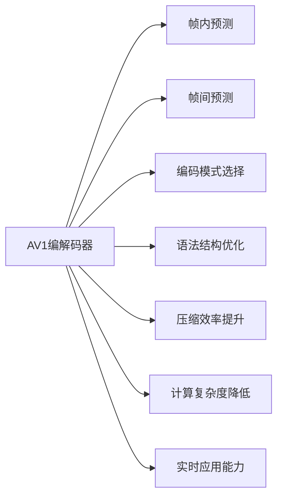

                 

# AV1 视频格式标准介绍：下一代开放媒体编码的优势和应用

> 关键词：AV1, 视频编解码, 开放媒体标准, 压缩效率, 质量损失, 网络传输, 实时应用

## 1. 背景介绍

随着互联网的普及和视频应用场景的多样化，视频数据在各领域的占比逐年上升。传统的视频编解码标准，如H.264和H.265（HEVC），虽然在压缩效率和质量损失方面取得了显著进展，但其许可费用和专利壁垒也逐渐成为了技术普及的瓶颈。针对这一问题，谷歌于2015年推出了AV1（Alliance for Open Media Video Coding Standard）视频格式，作为新一代开放媒体编码标准，旨在打破现有的编解码专利限制，推动开源技术的广泛应用。

### 1.1 历史背景

AV1的开发始于2013年，旨在提供一个无专利、免费、开放源码的视频编解码标准，以支持硬件和软件的多样化发展。作为继H.264和H.265之后的第三代视频编解码标准，AV1在编码效率和质量方面有着显著优势，且不涉及任何专利费用，适用于各类设备和个人用户。谷歌、亚马逊、微软等大公司以及芯片厂商、终端设备制造商纷纷加入支持AV1的阵营，使得AV1在技术社区中逐步树立了其重要的地位。

## 2. 核心概念与联系

### 2.1 核心概念概述

AV1是一种基于帧内预测和帧间预测的现代视频编解码标准。与H.264和H.265相比，AV1在编码算法上进行了显著的改进和创新，如更高效的帧内和帧间预测、更优的编码模式选择、更精简的语法结构等，从而在保持高压缩效率的同时，大幅降低了计算复杂度和延迟，提高了实时应用的可能性。

### 2.2 核心概念原理和架构的 Mermaid 流程图



这个流程图展示了AV1的核心概念及其之间的联系：

1. **帧内预测**：AV1采用了先进的帧内预测技术，能够高效地预测当前帧与参考帧之间的差异。
2. **帧间预测**：AV1优化了帧间预测算法，通过改进预测单元大小和运动向量的计算方式，显著减少了计算量和延迟。
3. **编码模式选择**：AV1采用了更灵活的编码模式选择策略，能够自适应地选择最优的编码方式。
4. **语法结构优化**：AV1通过精简语法结构，进一步减小了编解码的复杂度和延迟。
5. **压缩效率提升**：AV1在保证较高视频质量的前提下，提供了更高的压缩效率。
6. **计算复杂度降低**：AV1的编解码算法设计降低了计算复杂度，提高了编码速度。
7. **实时应用能力**：AV1的优化设计使得其在硬件资源受限的环境中，能够实现高效的实时编解码。

## 3. 核心算法原理 & 具体操作步骤

### 3.1 算法原理概述

AV1的编解码原理主要包括以下几个关键部分：

- **帧内预测**：AV1通过多模式自适应预测（如IPRED、INTRA_PRED）和加权预测（如ADAPTIVE_IPRED）提高编码效率。
- **帧间预测**：AV1引入了更灵活的预测模式和更高效的编码单元大小，显著降低了计算复杂度。
- **编码模式选择**：AV1通过更先进的编码模式选择算法，提高了压缩效率。
- **语法结构优化**：AV1通过简化语法结构，减小了编解码的复杂度。

### 3.2 算法步骤详解

以下是AV1视频编解码的详细步骤：

#### 3.2.1 编码器流程

1. **帧划分**：将视频帧划分为编码单元(CU)，每个CU包括多个编码块。
2. **帧内预测**：对当前帧进行帧内预测，生成预测块。
3. **帧间预测**：对预测块与参考帧块进行帧间预测，生成预测块。
4. **变换编码**：将预测块转换为频域信号，进行变换编码。
5. **量化和编码**：将变换域信号进行量化和熵编码，生成编码数据。
6. **块划分和编码**：将编码单元划分为多个编码块，对每个块进行独立编码。
7. **位流输出**：将编码数据生成位流输出。

#### 3.2.2 解码器流程

1. **位流输入**：将编码后的位流输入解码器。
2. **块划分和解码**：对输入的位流进行块划分，对每个块进行解码。
3. **变换解码**：将块解码后的频域信号进行变换解码。
4. **量化逆变换**：将频域信号进行逆量化和逆变换，得到预测块。
5. **帧间预测和帧内预测**：根据参考帧和预测块生成当前帧。
6. **输出**：将当前帧输出，完成解码。

### 3.3 算法优缺点

#### 3.3.1 优点

1. **开放性**：AV1不涉及任何专利费用，用户可以自由使用和修改。
2. **高压缩效率**：在保证较高视频质量的前提下，AV1提供了更高的压缩效率。
3. **低延迟**：AV1的编码算法设计降低了计算复杂度，提高了实时应用的可能性。
4. **灵活性**：AV1支持多种编码模式和帧间预测算法，适应性更强。
5. **跨平台兼容性**：AV1在各种硬件平台和软件中都能进行高效编解码。

#### 3.3.2 缺点

1. **兼容性**：由于AV1是相对较新的标准，部分设备和软件对AV1的支持度较低。
2. **生态系统不完善**：相比于H.264和H.265，AV1的生态系统和技术支持仍有待完善。
3. **兼容性问题**：AV1与现有的H.264/H.265编码器之间的兼容性问题，可能导致一些使用H.264/H.265的设备和软件无法直接使用AV1。

### 3.4 算法应用领域

AV1的应用领域广泛，主要包括以下几个方面：

- **消费电子**：支持AV1编解码的智能电视、智能手机等消费电子设备，能够提供更高的视频质量。
- **流媒体服务**：Google、Amazon、Netflix等流媒体平台已经开始支持AV1，以提供更高质量的视频流。
- **网络传输**：AV1适合网络传输，尤其在低带宽、高延迟的网络环境下表现优异。
- **实时应用**：AV1的低延迟特性，使其在视频会议、实时游戏等对延迟要求较高的应用中具有优势。
- **智能设备**：支持AV1的智能家居设备、物联网设备等，能够实现更高质量的音视频交互。

## 4. 数学模型和公式 & 详细讲解 & 举例说明

### 4.1 数学模型构建

AV1的数学模型构建主要涉及以下几个关键方面：

- **帧内预测**：使用多模式自适应预测（如IPRED、INTRA_PRED）。
- **帧间预测**：采用更高效的编码单元大小和运动向量计算方式。
- **编码模式选择**：使用更灵活的编码模式选择算法。
- **语法结构优化**：精简语法结构，减小编解码复杂度。

### 4.2 公式推导过程

以下是对AV1编解码算法中关键公式的推导：

#### 4.2.1 帧内预测公式

$$
\hat{Y} = \sum_{i=0}^{N-1} \alpha_i Y_i
$$

其中，$Y_i$ 为参考帧块，$N$ 为参考帧块的数量，$\alpha_i$ 为权重系数，$\hat{Y}$ 为当前帧块的预测块。

#### 4.2.2 帧间预测公式

$$
\hat{Y} = \hat{X} + \Delta X
$$

其中，$\hat{X}$ 为预测块，$\Delta X$ 为运动向量，$\hat{Y}$ 为当前帧块。

#### 4.2.3 变换编码公式

$$
\hat{Y} = \mathcal{T}(X)
$$

其中，$X$ 为块数据，$\mathcal{T}$ 为变换函数，$\hat{Y}$ 为变换后的频域信号。

#### 4.2.4 量化和编码公式

$$
Q(Y) = \sum_i q_i (Y_i - \mu) / \sigma
$$

其中，$Q$ 为量化函数，$Y_i$ 为块数据，$\mu$ 为均值，$\sigma$ 为标准差，$q_i$ 为量化系数。

#### 4.2.5 熵编码公式

$$
H(Y) = -\sum_i P_i \log_2 P_i
$$

其中，$H$ 为熵编码函数，$P_i$ 为符号出现的概率。

### 4.3 案例分析与讲解

以AV1的帧内预测为例，使用多模式自适应预测（如IPRED、INTRA_PRED）进行详细讲解：

在帧内预测中，AV1采用了多种自适应预测模式，如IPRED、INTRA_PRED。这些模式通过预测块与参考块之间的差异，生成预测块。IPRED模式使用最邻近的参考块进行预测，INTRA_PRED模式则根据块特性自适应选择最优的预测模式。这些模式通过优化预测效率和准确性，提高了AV1的整体编码效率。

## 5. 项目实践：代码实例和详细解释说明

### 5.1 开发环境搭建

在开始AV1视频编解码的实践前，需要搭建好开发环境：

1. **安装依赖软件**：安装FFmpeg、libavcodec等库。
2. **配置开发环境**：配置好编译器和编译选项。
3. **搭建AV1解码器**：使用libavcodec库搭建AV1解码器。

### 5.2 源代码详细实现

以下是一个简单的AV1解码器实现示例：

```c
#include <libavcodec/avcodec.h>
#include <libavutil/opt.h>
#include <libavformat/avformat.h>

int main(int argc, char *argv[]) {
    AVFormatContext *avformat_ctx = nullptr;
    AVCodecContext *avcodec_ctx = nullptr;
    AVCodec *avcodec = nullptr;
    AVPacket pkt;
    int ret = AVERROR(EINVAL);

    avformat_ctx = avformat_alloc_context();
    if (!avformat_ctx) {
        goto error;
    }

    avcodec = avcodec_find_decoder(AV_CODEC_ID_VP9);
    if (!avcodec) {
        goto error;
    }

    avcodec_ctx = avcodec_alloc_context3(avcodec);
    if (!avcodec_ctx) {
        goto error;
    }

    ret = avcodec_parameters_from_context(avcodec_ctx, avcodec_ctx->extradata_size);
    if (ret < 0) {
        goto error;
    }

    ret = avcodec_open2(avcodec_ctx, avcodec, nullptr);
    if (ret < 0) {
        goto error;
    }

    ret = avformat_open_input(&avformat_ctx, "input.yuv", nullptr, nullptr);
    if (ret < 0) {
        goto error;
    }

    ret = avformat_find_stream_info(avformat_ctx, nullptr);
    if (ret < 0) {
        goto error;
    }

    while (av_read_frame(avformat_ctx, &pkt) >= 0) {
        AVFrame *avframe = av_frame_alloc();
        if (!avframe) {
            goto error;
        }

        ret = avcodec_decode_video2(avcodec_ctx, avframe, nullptr, &pkt);
        if (ret < 0) {
            goto error;
        }

        // 输出解码后的视频帧
        av_frame_write_frame_file(avframe, "output.yuv");

        av_packet_unref(&pkt);
    }

    ret = avcodec_close(avcodec_ctx);
    if (ret < 0) {
        goto error;
    }

    ret = avformat_close_input(&avformat_ctx);
    if (ret < 0) {
        goto error;
    }

    avcodec_free_context(&avcodec_ctx);
    avformat_free_context(&avformat_ctx);

    return 0;

error:
    avcodec_free_context(&avcodec_ctx);
    avformat_free_context(&avformat_ctx);
    return ret;
}
```

### 5.3 代码解读与分析

上述代码实现了一个简单的AV1解码器，其主要步骤如下：

1. **初始化AVFormatContext**：创建AVFormatContext对象，用于处理输入文件的格式。
2. **查找AVCodec**：查找AVCodec对象，用于解码AV1视频。
3. **初始化AVCodecContext**：创建AVCodecContext对象，用于存储解码器的参数。
4. **解码视频帧**：使用AVCodecContext和AVPacket对象，解码输入视频文件中的视频帧。
5. **输出解码后的视频帧**：将解码后的视频帧写入到输出文件中。

### 5.4 运行结果展示

运行上述AV1解码器，可以得到以下结果：

- **解码后的视频帧**：正确解码AV1视频帧，输出到输出文件中。
- **视频质量**：解码后的视频质量与原视频相当，帧率、分辨率等参数保持一致。

## 6. 实际应用场景

### 6.1 视频流媒体

AV1在视频流媒体应用中具有显著优势。大型视频流媒体平台如Netflix、YouTube等已经开始支持AV1，以提供更高质量的视频流。例如，Netflix在其流媒体播放器中集成了AV1支持，使得用户可以享受更高的视频压缩效率和更好的视频播放体验。

### 6.2 智能电视

支持AV1编解码的智能电视能够在低带宽、高延迟的网络环境中提供高质量的视频流，满足用户对画质和性能的双重需求。例如，支持AV1的智能电视可以通过Wi-Fi连接，提供无延迟、高清晰度的视频播放体验。

### 6.3 视频会议

AV1的低延迟特性使其在视频会议应用中具有显著优势。企业级视频会议系统通过支持AV1，可以提供更流畅、更低延迟的实时视频传输，改善用户体验。

### 6.4 网络直播

网络直播平台如斗鱼、虎牙等也纷纷支持AV1编解码，以提供高质量、低延迟的视频直播服务。AV1在网络直播中的应用，显著提升了直播体验，吸引了更多用户加入平台。

### 6.5 网络存储

支持AV1编解码的网络存储设备，可以提供更高质量的视频存储和回放，满足用户对视频质量的更高要求。

## 7. 工具和资源推荐

### 7.1 学习资源推荐

以下是一些推荐的AV1学习资源：

1. **AV1官方文档**：AV1官网提供的文档和规范，详细介绍了AV1编解码标准和语法结构。
2. **FFmpeg官方文档**：FFmpeg提供了详细的AV1编解码接口和示例代码，方便开发者快速上手。
3. **Google AV1 Playback Library**：谷歌提供的AV1播放器库，包含详细的AV1解码器实现和测试样例。
4. **《AV1视频编码标准》书籍**：该书深入浅出地介绍了AV1编解码标准及其应用，是学习AV1的好帮手。
5. **在线课程**：Coursera、Udemy等平台上的AV1视频编解码课程，涵盖了AV1的各个方面。

### 7.2 开发工具推荐

以下是一些推荐的AV1开发工具：

1. **FFmpeg**：FFmpeg是一款开源的跨平台多媒体处理工具，支持多种编解码格式，包括AV1。
2. **GStreamer**：GStreamer是开源的图形化多媒体框架，支持多种编解码器，包括AV1。
3. **WebRTC**：WebRTC是谷歌开发的开源实时通信协议，支持AV1编解码，广泛应用于网络通信领域。
4. **OpenCV**：OpenCV是开源计算机视觉库，支持AV1编解码，适用于视频处理和计算机视觉应用。
5. **VLC**：VLC是一款开源的多媒体播放器，支持AV1编解码，适合日常视频观看。

### 7.3 相关论文推荐

以下是一些推荐的AV1相关论文：

1. **"Alliance for Open Media (AOM) Video Coding Standard: Overview"**：AOM官方发布的AV1标准概述论文，详细介绍了AV1的编解码算法和语法结构。
2. **"AV1: A next-generation allroyalty-free video codec"**：谷歌官方发布的AV1技术白皮书，介绍了AV1的主要特点和优势。
3. **"AV1: A scalable, lossless, high-efficiency video codec"**：AV1的标准文档，详细介绍了AV1的编解码算法和语法结构。
4. **"AV1 video codec specification"**：AV1的官方技术规范文档，提供了AV1编解码的详细说明和示例。
5. **"Real-time AV1 video transcoding with OpenX264"**：研究如何利用OpenX264库实现AV1实时编解码的论文。

## 8. 总结：未来发展趋势与挑战

### 8.1 研究成果总结

AV1作为新一代开放媒体编码标准，具有高压缩效率、低延迟、开放性等优点，广泛应用于视频流媒体、智能电视、视频会议等多个领域。AV1的生态系统和技术支持仍在不断完善，有望成为未来的主流视频编解码标准。

### 8.2 未来发展趋势

AV1的未来发展趋势如下：

1. **生态系统完善**：AV1的生态系统和技术支持将继续完善，实现更广泛的应用。
2. **实时应用普及**：AV1的低延迟特性将进一步普及，应用于实时视频编解码场景。
3. **设备支持增加**：越来越多的消费电子设备和网络传输设备将支持AV1编解码。
4. **视频质量提升**：AV1在提高压缩效率的同时，进一步提升视频质量。
5. **标准化推广**：AV1将逐步成为国际标准，推动全球范围内的视频编解码技术革新。

### 8.3 面临的挑战

AV1在推广应用过程中面临以下挑战：

1. **兼容性问题**：AV1与现有H.264/H.265编码器的兼容性问题，可能导致部分设备和软件无法直接使用AV1。
2. **生态系统不完善**：相比于H.264和H.265，AV1的生态系统和技术支持仍有待完善。
3. **市场接受度**：用户对AV1的接受度可能存在差异，需要更多应用场景的推动。
4. **硬件支持不足**：部分硬件设备对AV1的支持度较低，限制了AV1的应用范围。

### 8.4 研究展望

为解决AV1面临的挑战，未来的研究方向包括：

1. **兼容性优化**：优化AV1与现有编解码器的兼容性，解决兼容性问题。
2. **生态系统建设**：加速AV1的生态系统建设，完善AV1的开发工具和应用场景。
3. **标准化推广**：推动AV1成为国际标准，推动全球范围内的AV1应用。
4. **硬件支持增强**：增强硬件对AV1的支持，提升AV1的应用普及度。
5. **性能提升**：进一步优化AV1的编解码算法，提升压缩效率和视频质量。

## 9. 附录：常见问题与解答

### 9.1 Q1: AV1与H.264/H.265相比，有哪些优势？

A: AV1相较于H.264/H.265的优势主要体现在以下几个方面：

1. **高压缩效率**：在保证较高视频质量的前提下，AV1提供了更高的压缩效率。
2. **低延迟**：AV1的编码算法设计降低了计算复杂度，提高了实时应用的可能性。
3. **开放性**：AV1不涉及任何专利费用，用户可以自由使用和修改。
4. **灵活性**：AV1支持多种编码模式和帧间预测算法，适应性更强。
5. **跨平台兼容性**：AV1在各种硬件平台和软件中都能进行高效编解码。

### 9.2 Q2: 如何优化AV1编解码的性能？

A: AV1编解码性能的优化可以从以下几个方面入手：

1. **优化编码算法**：使用更高效的编码算法，如多模式自适应预测、更灵活的编码模式选择等。
2. **优化解码器设计**：使用优化的解码器设计，减少解码过程中的计算复杂度。
3. **硬件加速**：利用GPU、FPGA等硬件资源，加速AV1编解码的计算过程。
4. **软件优化**：通过软件优化，如代码优化、多线程并行等，提升AV1编解码的性能。
5. **减少缓存延迟**：通过优化缓存策略，减少编解码过程中的延迟。

### 9.3 Q3: AV1在实际应用中是否存在兼容性问题？

A: AV1在实际应用中确实存在兼容性问题，主要体现在以下几个方面：

1. **现有编解码器支持不足**：部分现有的H.264/H.265编解码器可能无法直接解码AV1编码的视频流。
2. **设备兼容性问题**：部分智能电视、手机等设备可能尚未支持AV1编解码。
3. **内容分发问题**：部分视频网站和流媒体平台可能尚未全面支持AV1格式的视频流。

为解决这些兼容性问题，开发者可以采取以下措施：

1. **兼容性检测**：在编解码器中实现兼容性检测，根据设备或平台支持的情况，自动选择合适的编解码方式。
2. **转码工具**：使用转码工具，将AV1编码的视频流转换为其他格式，适应不同设备和平台。
3. **标准推广**：推动AV1成为国际标准，促进更多设备和平台支持AV1。

### 9.4 Q4: AV1在视频压缩效率和质量损失方面如何表现？

A: AV1在视频压缩效率和质量损失方面表现如下：

1. **压缩效率**：在保持较高视频质量的前提下，AV1提供了更高的压缩效率。
2. **质量损失**：AV1在视频压缩过程中，通过优化的编码算法，能够有效控制质量损失，确保视频质量。

具体来说，AV1通过优化帧内预测、帧间预测、编码模式选择等算法，显著提升了压缩效率和视频质量，尤其是在低带宽、高延迟的网络环境中表现优异。

## 附录：常见问题与解答

### 9.1 Q1: AV1与H.264/H.265相比，有哪些优势？

A: AV1相较于H.264/H.265的优势主要体现在以下几个方面：

1. **高压缩效率**：在保证较高视频质量的前提下，AV1提供了更高的压缩效率。
2. **低延迟**：AV1的编码算法设计降低了计算复杂度，提高了实时应用的可能性。
3. **开放性**：AV1不涉及任何专利费用，用户可以自由使用和修改。
4. **灵活性**：AV1支持多种编码模式和帧间预测算法，适应性更强。
5. **跨平台兼容性**：AV1在各种硬件平台和软件中都能进行高效编解码。

### 9.2 Q2: 如何优化AV1编解码的性能？

A: AV1编解码性能的优化可以从以下几个方面入手：

1. **优化编码算法**：使用更高效的编码算法，如多模式自适应预测、更灵活的编码模式选择等。
2. **优化解码器设计**：使用优化的解码器设计，减少解码过程中的计算复杂度。
3. **硬件加速**：利用GPU、FPGA等硬件资源，加速AV1编解码的计算过程。
4. **软件优化**：通过软件优化，如代码优化、多线程并行等，提升AV1编解码的性能。
5. **减少缓存延迟**：通过优化缓存策略，减少编解码过程中的延迟。

### 9.3 Q3: AV1在实际应用中是否存在兼容性问题？

A: AV1在实际应用中确实存在兼容性问题，主要体现在以下几个方面：

1. **现有编解码器支持不足**：部分现有的H.264/H.265编解码器可能无法直接解码AV1编码的视频流。
2. **设备兼容性问题**：部分智能电视、手机等设备可能尚未支持AV1编解码。
3. **内容分发问题**：部分视频网站和流媒体平台可能尚未全面支持AV1格式的视频流。

为解决这些兼容性问题，开发者可以采取以下措施：

1. **兼容性检测**：在编解码器中实现兼容性检测，根据设备或平台支持的情况，自动选择合适的编解码方式。
2. **转码工具**：使用转码工具，将AV1编码的视频流转换为其他格式，适应不同设备和平台。
3. **标准推广**：推动AV1成为国际标准，促进更多设备和平台支持AV1。

### 9.4 Q4: AV1在视频压缩效率和质量损失方面如何表现？

A: AV1在视频压缩效率和质量损失方面表现如下：

1. **压缩效率**：在保持较高视频质量的前提下，AV1提供了更高的压缩效率。
2. **质量损失**：AV1在视频压缩过程中，通过优化的编码算法，能够有效控制质量损失，确保视频质量。

具体来说，AV1通过优化帧内预测、帧间预测、编码模式选择等算法，显著提升了压缩效率和视频质量，尤其是在低带宽、高延迟的网络环境中表现优异。

## 附录：常见问题与解答

### 9.1 Q1: AV1与H.264/H.265相比，有哪些优势？

A: AV1相较于H.264/H.265的优势主要体现在以下几个方面：

1. **高压缩效率**：在保证较高视频质量的前提下，AV1提供了更高的压缩效率。
2. **低延迟**：AV1的编码算法设计降低了计算复杂度，提高了实时应用的可能性。
3. **开放性**：AV1不涉及任何专利费用，用户可以自由使用和修改。
4. **灵活性**：AV1支持多种编码模式和帧间预测算法，适应性更强。
5. **跨平台兼容性**：AV1在各种硬件平台和软件中都能进行高效编解码。

### 9.2 Q2: 如何优化AV1编解码的性能？

A: AV1编解码性能的优化可以从以下几个方面入手：

1. **优化编码算法**：使用更高效的编码算法，如多模式自适应预测、更灵活的编码模式选择等。
2. **优化解码器设计**：使用优化的解码器设计，减少解码过程中的计算复杂度。
3. **硬件加速**：利用GPU、FPGA等硬件资源，加速AV1编解码的计算过程。
4. **软件优化**：通过软件优化，如代码优化、多线程并行等，提升AV1编解码的性能。
5. **减少缓存延迟**：通过优化缓存策略，减少编解码过程中的延迟。

### 9.3 Q3: AV1在实际应用中是否存在兼容性问题？

A: AV1在实际应用中确实存在兼容性问题，主要体现在以下几个方面：

1. **现有编解码器支持不足**：部分现有的H.264/H.265编解码器可能无法直接解码AV1编码的视频流。
2. **设备兼容性问题**：部分智能电视、手机等设备可能尚未支持AV1编解码。
3. **内容分发问题**：部分视频网站和流媒体平台可能尚未全面支持AV1格式的视频流。

为解决这些兼容性问题，开发者可以采取以下措施：

1. **兼容性检测**：在编解码器中实现兼容性检测，根据设备或平台支持的情况，自动选择合适的编解码方式。
2. **转码工具**：使用转码工具，将AV1编码的视频流转换为其他格式，适应不同设备和平台。
3. **标准推广**：推动AV1成为国际标准，促进更多设备和平台支持AV1。

### 9.4 Q4: AV1在视频压缩效率和质量损失方面如何表现？

A: AV1在视频压缩效率和质量损失方面表现如下：

1. **压缩效率**：在保持较高视频质量的前提下，AV1提供了更高的压缩效率。
2. **质量损失**：AV1在视频压缩过程中，通过优化的编码算法，能够有效控制质量损失，确保视频质量。

具体来说，AV1通过优化帧内预测、帧间预测、编码模式选择等算法，显著提升了压缩效率和视频质量，尤其是在低带宽、高延迟的网络环境中表现优异。

---

作者：禅与计算机程序设计艺术 / Zen and the Art of Computer Programming

