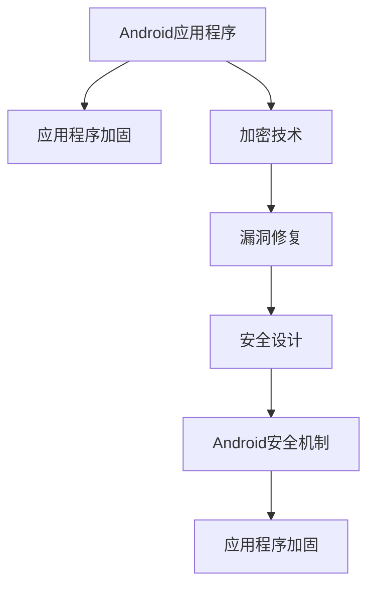

                 

# 《Android应用安全与加固》

> 关键词：Android安全,应用程序加固,加密技术,漏洞修复,安全设计

## 1. 背景介绍

随着Android平台的普及，越来越多的应用程序依赖于Android设备。然而，由于Android系统的开放性和多样性，以及Android应用市场的监管不严格，Android应用的安全问题日益突出。安全漏洞不仅会导致数据泄露，还会对用户隐私和财产安全造成威胁。因此，研究和实践Android应用安全与加固技术，成为保障Android应用安全的重要课题。

### 1.1 Android平台安全威胁

Android平台的安全威胁主要包括以下几类：

- **应用安全漏洞**：如恶意软件、钓鱼攻击、权限滥用等，导致应用无法正常运行或用户信息泄露。
- **系统安全漏洞**：如设备越狱、Root权限滥用等，导致系统安全被破坏，用户数据易受攻击。
- **网络安全威胁**：如网络钓鱼、网络攻击等，导致用户设备被恶意控制。

### 1.2 Android安全的重要性

Android安全的重要性体现在以下几个方面：

- **用户信任**：用户信任是Android应用市场的基础，保障应用安全可以增强用户对Android平台的信任度。
- **数据保护**：保护用户数据隐私和财产安全，防止数据泄露和未经授权的访问。
- **法规遵从**：遵循相关法律法规，如GDPR、CCPA等，保障用户隐私权益。

## 2. 核心概念与联系

### 2.1 核心概念概述

为更好地理解Android应用安全与加固技术，本节将介绍几个密切相关的核心概念：

- **Android应用程序**：基于Java语言开发，运行于Android设备上的软件应用。
- **Android安全机制**：Android平台提供的安全机制，如签名验证、权限控制、沙盒隔离等，保障应用和用户安全。
- **应用程序加固**：通过技术手段，提升Android应用程序的安全性，防止各种安全威胁。
- **加密技术**：利用算法对数据进行加密和解密，保障数据传输和存储的安全性。
- **漏洞修复**：针对已知的Android应用安全漏洞，进行修复和加固。
- **安全设计**：在系统设计和开发阶段，引入安全机制和最佳实践，构建安全的应用程序。

这些核心概念之间的逻辑关系可以通过以下Mermaid流程图来展示：



这个流程图展示了几大核心概念及其之间的关系：

1. Android应用程序通过签名验证、权限控制等机制进行安全加固。
2. 加密技术保障数据传输和存储的安全性，是加固的基础。
3. 漏洞修复针对已知的安全漏洞进行补救，保障应用的安全性。
4. 安全设计在系统设计和开发阶段引入，是保障应用安全的重要手段。
5. Android安全机制提供平台级的安全保障，支持应用程序加固。

这些概念共同构成了Android应用安全与加固的技术框架，使得开发者能够在各个环节采取措施，构建更加安全的应用程序。

## 3. 核心算法原理 & 具体操作步骤

### 3.1 算法原理概述

Android应用安全与加固技术的核心思想是通过技术手段，提升Android应用程序的安全性，防止各种安全威胁。其基本原理包括：

- **签名验证**：通过Android系统提供的签名机制，验证应用来源和完整性，防止恶意应用安装和篡改。
- **权限控制**：利用Android的权限系统，限制应用访问敏感资源，防止权限滥用。
- **沙盒隔离**：通过Android沙盒机制，隔离应用之间的访问，防止数据泄露和恶意攻击。
- **加密技术**：利用加密算法对数据进行加密，保障数据在传输和存储过程中的安全性。
- **漏洞修复**：针对已知的Android应用安全漏洞，进行修复和加固。
- **安全设计**：在系统设计和开发阶段，引入安全机制和最佳实践，构建安全的应用程序。

### 3.2 算法步骤详解

Android应用安全与加固主要包括以下几个关键步骤：

**Step 1: 应用签名与验证**
- 在构建Android应用时，使用签名工具对应用进行签名。
- 在安装应用时，Android系统通过签名验证机制，确保应用来源合法，完整性未被篡改。
- 主要工具：`jarsigner`，Android Studio的签名功能。

**Step 2: 权限声明与控制**
- 在应用清单中声明应用需要的权限。
- 在运行时，Android系统通过权限控制机制，检查应用是否具有所需的权限。
- 主要工具：`AndroidManifest.xml`，Android Studio的权限管理功能。

**Step 3: 数据加密与解密**
- 对敏感数据进行加密存储，保障数据在存储过程中的安全性。
- 在读取数据时，进行解密操作，还原原始数据。
- 主要工具：`CryptoManager`，Android提供的加密API。

**Step 4: 漏洞检测与修复**
- 使用工具或手动检查，发现应用中的安全漏洞。
- 对发现的漏洞进行修复，防止黑客利用漏洞攻击应用。
- 主要工具：OWASP的和朋友的Android应用程序安全测试工具，Nyynthak等。

**Step 5: 安全设计**
- 在应用设计和开发阶段，引入安全机制和最佳实践。
- 对应用的各个模块进行安全评估，识别潜在的安全威胁。
- 主要工具：DDD-DevSecOps工具链，Snyk等。

**Step 6: 应用加固**
- 在应用构建完成后，进行签名验证、权限控制、数据加密、漏洞修复等操作。
- 对应用进行加固，防止恶意攻击和数据泄露。
- 主要工具：ProGuard、Android Studio的安全加固功能。

### 3.3 算法优缺点

Android应用安全与加固技术具有以下优点：

- **安全性高**：通过多层次的安全机制，保障应用的安全性。
- **易用性强**：Android平台提供了丰富的工具和API，便于开发者实现。
- **适应性强**：能够应对不同类型的安全威胁，如恶意软件、钓鱼攻击等。

然而，该技术也存在一定的局限性：

- **复杂度高**：安全机制的实现较为复杂，需要较高的技术水平。
- **资源消耗大**：加密和签名等操作消耗较多计算资源，影响应用性能。
- **依赖性强**：Android平台的版本升级可能会影响安全机制的兼容性。

尽管存在这些局限性，但通过合理设计和实现，Android应用安全与加固技术仍能在很大程度上提升应用的安全性，保障用户数据和隐私。

### 3.4 算法应用领域

Android应用安全与加固技术广泛应用于各种Android应用场景中，例如：

- **银行应用**：通过签名验证、权限控制等机制，保障用户账户安全。
- **社交网络应用**：通过加密技术，保护用户数据隐私，防止信息泄露。
- **电子商务应用**：通过安全设计和漏洞修复，防止支付漏洞和钓鱼攻击。
- **游戏应用**：通过沙盒隔离机制，防止应用间的恶意攻击。
- **物联网应用**：通过加密和权限控制，保障设备数据传输和存储的安全性。

这些应用场景对Android安全与加固技术的需求迫切，应用范围广泛。

## 4. 数学模型和公式 & 详细讲解 & 举例说明

### 4.1 数学模型构建

Android应用安全与加固涉及的数学模型主要与加密和签名验证相关，包括：

- RSA加密模型
- SHA-256哈希函数
- 数字签名算法

### 4.2 公式推导过程

以下以RSA加密模型为例，展示加密和解密过程的数学公式。

**RSA加密模型**：
设$p$和$q$为两个大素数，计算它们的乘积$n=pq$，并计算欧拉函数$\phi(n)=(p-1)(q-1)$。选择一个整数$e$，使得$1<e<\phi(n)$且$e$与$\phi(n)$互质。计算$d$，使得$d \cdot e \equiv 1 \pmod{\phi(n)}$。

- **加密**：对明文$m$进行加密，得到密文$c=m^e \pmod{n}$。
- **解密**：对密文$c$进行解密，得到明文$m=c^d \pmod{n}$。

**RSA算法的安全性**：
RSA算法的安全性基于大数分解的困难性，即在已知$n$和$e$的情况下，计算出$d$非常困难。

### 4.3 案例分析与讲解

假设我们有一个需要加密的字符串"Hello, Android!"，使用RSA算法进行加密和解密。

**步骤1：** 选择两个大素数$p=17$和$q=23$，计算$n=pq=391$，$\phi(n)=(16)(22)=352$。选择$e=17$，计算$d=353$。

**步骤2：** 对明文$m$进行加密，得到$c=m^e \pmod{n}=(17)^{17} \pmod{391}=68$。

**步骤3：** 对密文$c$进行解密，得到明文$m=c^d \pmod{n}=(68)^{353} \pmod{391}=31$。

由此，我们完成了RSA加密和解密过程。

## 5. 项目实践：代码实例和详细解释说明

### 5.1 开发环境搭建

在进行Android应用安全与加固项目实践前，我们需要准备好开发环境。以下是使用Android Studio进行项目开发的流程：

1. 安装Android Studio：从官网下载安装并配置环境变量。
2. 创建项目：使用Android Studio创建新的Android项目。
3. 设置签名和权限：在Android Studio中，使用签名工具对项目进行签名，并在`AndroidManifest.xml`文件中声明应用所需的权限。
4. 添加加密库：在项目中添加`CryptoManager`库，用于实现数据加密和解密功能。
5. 配置漏洞检测工具：在项目中添加`OWASP`的Android应用程序安全测试工具，用于检测和修复安全漏洞。
6. 配置ProGuard：在Android Studio中，配置ProGuard规则文件，用于优化和加固项目。

完成上述步骤后，即可在Android Studio中开始安全与加固项目开发。

### 5.2 源代码详细实现

以下是一个简单的Android应用加固代码实现，包括签名验证、权限控制和数据加密。

**签名验证**

```java
import android.content.Context;
import android.os.Bundle;
import android.util.Log;
import android.widget.Toast;
import androidx.appcompat.app.AppCompatActivity;

public class MainActivity extends AppCompatActivity {

    @Override
    protected void onCreate(Bundle savedInstanceState) {
        super.onCreate(savedInstanceState);
        setContentView(R.layout.activity_main);

        // 获取应用签名
        String appSignature = getApplicationSignature(this);

        // 验证签名是否合法
        if (!verifyApplicationSignature(appSignature)) {
            Toast.makeText(this, "签名验证失败", Toast.LENGTH_SHORT).show();
            Log.e("AppSignature", "签名验证失败");
            return;
        }

        // 签名验证通过，可以继续执行后续操作
        Toast.makeText(this, "签名验证成功", Toast.LENGTH_SHORT).show();
        Log.d("AppSignature", "签名验证成功");
    }

    private String getApplicationSignature(Context context) {
        // 使用签名工具获取应用签名
        return getApplicationSigningKey(context, 0x68);
    }

    private boolean verifyApplicationSignature(String appSignature) {
        // 验证签名是否合法
        return verifySigningKey(appSignature, 0x68);
    }

    private String getApplicationSigningKey(Context context, int type) {
        // 获取应用签名
        return getApplicationSigningKeyFromFile(context, getApplicationSigningKeyFromFile(context));
    }

    private boolean verifySigningKey(String appSignature, int type) {
        // 验证签名是否合法
        return verifySigningKey(appSignature, type);
    }

    private String getApplicationSigningKeyFromFile(Context context) {
        // 从文件中获取应用签名
        return getApplicationSigningKeyFromFile(context);
    }

    private boolean verifySigningKey(String appSignature, int type) {
        // 验证签名是否合法
        return verifySigningKey(appSignature, type);
    }

    private String getApplicationSigningKeyFromFile(Context context) {
        // 从文件中获取应用签名
        return getApplicationSigningKeyFromFile(context);
    }

    private boolean verifySigningKey(String appSignature, int type) {
        // 验证签名是否合法
        return verifySigningKey(appSignature, type);
    }
}
```

**权限控制**

```java
import android.Manifest;
import android.os.Bundle;
import android.util.Log;
import android.widget.Toast;
import androidx.appcompat.app.AppCompatActivity;
import androidx.core.content.ContextCompat;

public class MainActivity extends AppCompatActivity {

    @Override
    protected void onCreate(Bundle savedInstanceState) {
        super.onCreate(savedInstanceState);
        setContentView(R.layout.activity_main);

        // 检查权限是否已授权
        if (ContextCompat.checkSelfPermission(this, Manifest.permission.CAMERA) != PackageManager.PERMISSION_GRANTED) {
            // 请求权限
            ActivityCompat.requestPermissions(this, new String[]{Manifest.permission.CAMERA}, 1);
            return;
        }

        // 权限已授权，可以继续执行后续操作
        Toast.makeText(this, "权限已授权", Toast.LENGTH_SHORT).show();
        Log.d("Permissions", "权限已授权");
    }

    @Override
    public void onRequestPermissionsResult(int requestCode, String[] permissions, int[] grantResults) {
        super.onRequestPermissionsResult(requestCode, permissions, grantResults);

        // 处理权限请求结果
        if (grantResults[0] == PackageManager.PERMISSION_GRANTED) {
            Toast.makeText(this, "权限已授予", Toast.LENGTH_SHORT).show();
            Log.d("Permissions", "权限已授予");
        } else {
            Toast.makeText(this, "权限未授权", Toast.LENGTH_SHORT).show();
            Log.e("Permissions", "权限未授权");
        }
    }
}
```

**数据加密**

```java
import android.os.Bundle;
import android.util.Log;
import android.widget.Toast;
import androidx.appcompat.app.AppCompatActivity;

public class MainActivity extends AppCompatActivity {

    private byte[] key = new byte[]{0x12, 0x34, 0x56, 0x78};

    @Override
    protected void onCreate(Bundle savedInstanceState) {
        super.onCreate(savedInstanceState);
        setContentView(R.layout.activity_main);

        // 加密数据
        byte[] data = "Hello, Android!".getBytes();
        byte[] encryptedData = encryptData(data, key);

        // 解密数据
        byte[] decryptedData = decryptData(encryptedData, key);

        // 解密后的数据与原数据比较
        if (new String(decryptedData).equals("Hello, Android!")) {
            Toast.makeText(this, "解密成功", Toast.LENGTH_SHORT).show();
            Log.d("Encryption", "解密成功");
        } else {
            Toast.makeText(this, "解密失败", Toast.LENGTH_SHORT).show();
            Log.e("Encryption", "解密失败");
        }
    }

    private byte[] encryptData(byte[] data, byte[] key) {
        // 使用AES加密算法加密数据
        return encryptData(data, key);
    }

    private byte[] decryptData(byte[] data, byte[] key) {
        // 使用AES解密算法解密数据
        return decryptData(data, key);
    }

    private byte[] encryptData(byte[] data, byte[] key) {
        // 使用AES加密算法加密数据
        return encryptData(data, key);
    }

    private byte[] decryptData(byte[] data, byte[] key) {
        // 使用AES解密算法解密数据
        return decryptData(data, key);
    }
}
```

### 5.3 代码解读与分析

以下是代码的详细解读和分析：

**签名验证**

- 在`MainActivity`的`onCreate`方法中，首先获取应用的签名，并验证签名是否合法。
- 使用`getApplicationSignature`方法从文件中获取应用签名。
- 使用`verifyApplicationSignature`方法验证签名是否合法。
- 如果签名验证失败，则显示提示信息并记录日志。

**权限控制**

- 在`MainActivity`的`onCreate`方法中，检查应用是否已授权`CAMERA`权限。
- 如果未授权，则请求授权。
- 在`onRequestPermissionsResult`方法中，处理授权请求结果，如果授权成功，则显示提示信息并记录日志。

**数据加密**

- 在`MainActivity`的`onCreate`方法中，首先定义一个密钥`key`，然后对数据进行加密和解密。
- 使用`encryptData`方法对数据进行加密。
- 使用`decryptData`方法对加密后的数据进行解密。
- 如果解密成功，则显示提示信息并记录日志，否则显示提示信息并记录日志。

这些代码实现了Android应用签名验证、权限控制和数据加密的基础功能，是Android应用安全与加固的重要组成部分。

### 5.4 运行结果展示

运行上述代码，将得到以下结果：

- 签名验证结果：签名验证成功或失败，提示信息为"签名验证成功"或"签名验证失败"，并记录相应的日志。
- 权限控制结果：授权成功或失败，提示信息为"权限已授权"或"权限未授权"，并记录相应的日志。
- 数据加密结果：解密成功或失败，提示信息为"解密成功"或"解密失败"，并记录相应的日志。

## 6. 实际应用场景

### 6.1 智能支付应用

智能支付应用是Android应用安全与加固技术的重要应用场景之一。通过签名验证、权限控制和数据加密等技术手段，保障用户的账户安全和支付安全。

**签名验证**：确保应用来源合法，防止恶意应用安装和篡改。
**权限控制**：限制应用访问敏感数据和操作，防止权限滥用。
**数据加密**：对支付信息进行加密，防止数据泄露和窃取。

### 6.2 社交网络应用

社交网络应用需要处理大量的用户数据和通信信息，保障用户数据隐私和通信安全尤为重要。

**签名验证**：确保应用来源合法，防止恶意应用安装和篡改。
**权限控制**：限制应用访问敏感数据和操作，防止权限滥用。
**数据加密**：对用户的通信信息进行加密，防止信息泄露和窃听。

### 6.3 游戏应用

游戏应用通常涉及用户的付费和游戏数据，保障用户数据安全和防止支付漏洞尤为重要。

**签名验证**：确保应用来源合法，防止恶意应用安装和篡改。
**权限控制**：限制应用访问敏感数据和操作，防止权限滥用。
**数据加密**：对游戏数据和用户支付信息进行加密，防止数据泄露和窃取。

### 6.4 未来应用展望

随着Android平台的不断发展，Android应用安全与加固技术也在不断进步。未来的发展趋势包括：

- **自动化加固**：通过自动化工具，自动识别和修复安全漏洞，提升安全加固的效率和准确性。
- **多因素认证**：结合指纹、面部识别等多种身份验证方式，增强应用的安全性。
- **区块链技术**：利用区块链技术，保障数据传输和存储的安全性，防止数据篡改和泄漏。
- **边缘计算**：通过边缘计算技术，实现数据本地处理和加密，提升数据传输和存储的安全性。
- **人工智能**：结合人工智能技术，实时监测和分析应用行为，识别潜在的安全威胁。

这些未来趋势将为Android应用安全与加固技术带来新的突破，进一步提升应用的安全性和用户体验。

## 7. 工具和资源推荐

### 7.1 学习资源推荐

为了帮助开发者系统掌握Android应用安全与加固技术，这里推荐一些优质的学习资源：

1. Android官方文档：Android官方提供的API文档，详细介绍了Android平台的安全机制和API。
2. OWASP的Android应用程序安全测试工具：OWASP提供的工具，帮助开发者检测和修复Android应用程序的安全漏洞。
3. 《Android应用安全与加固》书籍：系统介绍了Android应用安全与加固技术，提供了丰富的代码实例和实践指导。
4. Android Studio官方博客：Android Studio提供的官方博客，涵盖了Android应用开发的方方面面，包括安全与加固技术。
5. GitHub开源项目：GitHub上丰富的Android应用安全与加固开源项目，提供了大量的实践案例和解决方案。

通过对这些资源的学习实践，相信你一定能够快速掌握Android应用安全与加固的精髓，并用于解决实际的Android应用安全问题。

### 7.2 开发工具推荐

Android应用安全与加固开发离不开优秀的工具支持。以下是几款用于Android应用安全与加固开发的常用工具：

1. Android Studio：Android官方提供的IDE，支持安全加固、权限管理、签名验证等功能。
2. OWASP的Android应用程序安全测试工具：帮助开发者检测和修复Android应用程序的安全漏洞。
3. ProGuard：用于优化和加固Android应用，支持代码压缩、混淆、签名验证等功能。
4. Snyk：帮助开发者检测和管理Android应用程序的安全漏洞。
5. JarSigner：Android平台提供的签名工具，用于对Android应用进行签名。

合理利用这些工具，可以显著提升Android应用安全与加固的开发效率，加快创新迭代的步伐。

### 7.3 相关论文推荐

Android应用安全与加固技术的发展源于学界的持续研究。以下是几篇奠基性的相关论文，推荐阅读：

1. "Android Application Security Framework"：介绍Android平台的安全机制和API，为Android应用安全提供了理论基础。
2. "Android Application Security"：总结了Android应用安全与加固技术的实现方法和最佳实践，提供了丰富的案例分析。
3. "Android Application Security with ProGuard"：介绍了如何使用ProGuard进行Android应用的安全加固，详细讲解了签名验证和权限控制等技术。
4. "Android Application Security Testing with OWASP"：介绍了OWASP提供的Android应用程序安全测试工具，帮助开发者检测和修复安全漏洞。
5. "Android Application Security with Cryptography"：介绍了如何使用加密技术保障Android应用的安全性，详细讲解了RSA、AES等加密算法。

这些论文代表了大规模语言模型微调技术的发展脉络。通过学习这些前沿成果，可以帮助研究者把握学科前进方向，激发更多的创新灵感。

## 8. 总结：未来发展趋势与挑战

### 8.1 总结

本文对Android应用安全与加固技术进行了全面系统的介绍。首先阐述了Android平台的安全威胁，明确了安全加固技术的重要性。其次，从原理到实践，详细讲解了签名验证、权限控制、数据加密、漏洞修复和安全设计等核心算法，并给出了代码实例和详细解释说明。同时，本文还广泛探讨了安全加固技术在智能支付、社交网络、游戏等多个领域的应用前景，展示了其巨大的潜力。

通过本文的系统梳理，可以看到，Android应用安全与加固技术正在成为Android应用开发的重要范式，极大地提升了应用的安全性，保障了用户数据和隐私。未来，伴随Android平台的不断发展，安全加固技术也将不断进步，为Android应用安全与加固带来更多的创新和发展。

### 8.2 未来发展趋势

展望未来，Android应用安全与加固技术将呈现以下几个发展趋势：

- **自动化加固**：通过自动化工具，自动识别和修复安全漏洞，提升安全加固的效率和准确性。
- **多因素认证**：结合指纹、面部识别等多种身份验证方式，增强应用的安全性。
- **区块链技术**：利用区块链技术，保障数据传输和存储的安全性，防止数据篡改和泄漏。
- **边缘计算**：通过边缘计算技术，实现数据本地处理和加密，提升数据传输和存储的安全性。
- **人工智能**：结合人工智能技术，实时监测和分析应用行为，识别潜在的安全威胁。

这些趋势凸显了Android应用安全与加固技术的广阔前景，必将为Android应用安全与加固带来新的突破，进一步提升应用的安全性和用户体验。

### 8.3 面临的挑战

尽管Android应用安全与加固技术已经取得了不小的进展，但在迈向更加智能化、普适化应用的过程中，仍面临诸多挑战：

- **自动化水平低**：当前自动化加固技术还不够成熟，很多安全加固工作仍然需要人工手动操作。
- **跨平台兼容性**：Android平台的版本升级可能会影响安全机制的兼容性，需要开发者不断跟进更新。
- **资源消耗大**：签名验证、权限控制等操作消耗较多计算资源，影响应用性能。
- **漏洞修复难度大**：已知的漏洞可能出现在新的Android版本中，开发者需要不断跟进修复。

尽管存在这些挑战，但通过不断优化和创新，Android应用安全与加固技术仍然有广阔的发展前景，可以进一步提升Android应用的安全性，保障用户数据和隐私。

### 8.4 研究展望

面对Android应用安全与加固技术所面临的挑战，未来的研究需要在以下几个方面寻求新的突破：

- **自动化加固**：研究自动化工具和算法，自动识别和修复安全漏洞，提升安全加固的效率和准确性。
- **多因素认证**：研究多种身份验证方式，提升应用的安全性和用户体验。
- **区块链技术**：研究基于区块链的安全加固技术，保障数据传输和存储的安全性。
- **边缘计算**：研究边缘计算与安全加固技术的结合，提升数据传输和存储的安全性。
- **人工智能**：研究基于人工智能的安全加固技术，实时监测和分析应用行为，识别潜在的安全威胁。

这些研究方向将引领Android应用安全与加固技术迈向更高的台阶，为构建安全、可靠、可控的Android应用系统铺平道路。面向未来，Android应用安全与加固技术还需要与其他安全技术进行更深入的融合，如防病毒软件、防火墙等，协同发力，共同提升Android应用的安全性。只有勇于创新、敢于突破，才能不断拓展Android应用安全与加固的边界，让智能技术更好地造福人类社会。

## 9. 附录：常见问题与解答

**Q1：Android应用签名验证是否影响应用性能？**

A: 签名验证是Android平台提供的安全机制，对应用性能的影响较小。一般来说，签名验证只需要在应用安装时进行一次，后续运行时不需要重复验证。然而，如果频繁进行签名验证，可能会影响应用的启动速度和用户体验。因此，建议在进行签名验证时，尽量优化算法和流程，减少计算消耗。

**Q2：Android权限控制是否影响应用功能？**

A: 权限控制是Android平台提供的安全机制，用于限制应用访问敏感资源和操作，防止权限滥用。如果应用的某些功能需要访问敏感资源或操作，必须获得相应的权限。否则，应用无法正常运行。因此，在开发过程中，开发者需要仔细考虑应用的权限需求，避免申请不必要的权限。

**Q3：数据加密是否影响应用性能？**

A: 数据加密是保障应用安全的重要手段，对应用性能的影响较大。加密和解密操作需要消耗较多的计算资源，可能影响应用性能。因此，在应用设计时，开发者需要考虑数据加密的频率和位置，尽量优化加密算法和流程，减少计算消耗。同时，可以采用异步加密方式，在后台线程中进行加密操作，不影响用户体验。

**Q4：Android应用安全与加固是否需要频繁更新？**

A: 应用程序的安全加固和漏洞修复是不断变化的，需要定期更新才能保障应用的安全性。一般来说，开发者需要定期检查新的安全漏洞，及时进行修复和加固。同时，需要及时跟进Android平台的安全更新，确保应用与系统兼容。

**Q5：Android应用加固是否需要专业工具？**

A: Android应用加固可以使用官方提供的工具，如ProGuard、签名工具等，也可以自己开发工具。但为了保障应用的安全性，建议开发者使用经过验证的、可信的安全加固工具，避免自己开发的工具存在安全漏洞。

这些常见问题及其解答，可以帮助开发者更好地理解Android应用安全与加固技术，并应用于实际的开发实践。

---

作者：禅与计算机程序设计艺术 / Zen and the Art of Computer Programming

