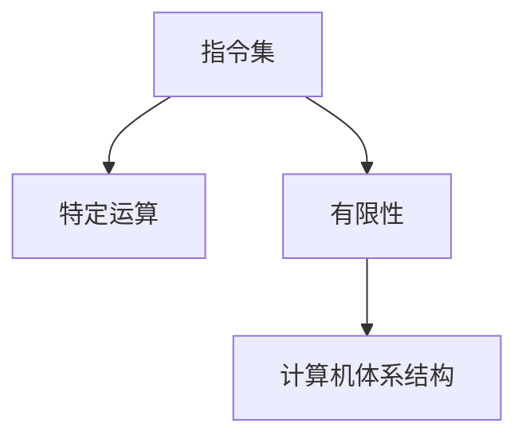

                 

# CPU 的限制：有限的指令和特定运算

> 关键词：CPU,指令集,特定运算,有限性,计算机体系结构

## 1. 背景介绍

### 1.1 问题由来
计算机处理器（CPU）作为计算机的核心部件，负责执行程序指令，实现数据的处理和运算。然而，CPU的指令集是有限的，其特定运算能力的实现依赖于硬件电路的设计和优化。这种有限的指令集和特定运算能力，一方面限制了CPU的性能，另一方面也带来了硬件设计的复杂性和成本问题。本文将深入探讨CPU的指令集和特定运算的限制，并分析其对计算机体系结构和性能的影响。

### 1.2 问题核心关键点
1. **指令集：** CPU能够执行的指令集合，决定了计算机的处理能力和软件实现的灵活性。
2. **特定运算：** CPU在处理特定类型的数据和操作时，通过特定的硬件电路实现，影响着运算效率和能耗。
3. **有限性：** 由于制造工艺和成本的限制，CPU指令集和特定运算能力是有限的。
4. **性能影响：** 指令集和特定运算能力对计算机体系结构和性能有着深远的影响。

## 2. 核心概念与联系

### 2.1 核心概念概述

为了更好地理解CPU的指令集和特定运算的限制，本节将介绍几个密切相关的核心概念：

- **指令集：** 由一系列预定义的指令组成，用于控制CPU执行特定操作。例如，x86指令集包括加减乘除、跳转、存取内存等指令。
- **特定运算：** CPU在处理特定类型的数据和操作时，通过特定的硬件电路实现，如浮点运算、乘法器、除法器等。
- **有限性：** CPU的制造工艺和成本限制，决定了其指令集和特定运算能力是有限的，不能无限扩展。
- **计算机体系结构：** CPU与其他计算机部件（如内存、存储、IO）的连接方式和数据流动路径，影响着计算机的整体性能和效率。

这些核心概念之间的逻辑关系可以通过以下Mermaid流程图来展示：



这个流程图展示了一系列关键概念之间的关系：

1. 指令集定义了CPU能够执行的操作，是特定运算的基础。
2. 特定运算通过硬件电路实现，受限于制造工艺和成本。
3. 计算机体系结构由指令集和特定运算能力决定，影响整体性能。

## 3. 核心算法原理 & 具体操作步骤
### 3.1 算法原理概述

CPU的指令集和特定运算能力的限制，决定了其处理特定任务时的效率和能耗。本文将从算法原理角度，分析这一限制的来源和影响。

#### 3.1.1 指令集的限制

CPU的指令集是有限的，这些指令通常以固定的位数（如32位或64位）和固定的编码方式进行设计。例如，x86指令集的指令通常以字节为单位编码，每个指令的长度和操作码由硬件电路决定。

- **指令长度：** 不同指令的长度是固定的，如x86的指令长度为1-15字节，这限制了指令的灵活性和扩展性。
- **编码方式：** 指令的编码方式也限制了其灵活性，如x86使用操作码前缀、地址码等固定编码方式。

#### 3.1.2 特定运算的限制

CPU在处理特定类型的数据和操作时，依赖于特定的硬件电路设计。这些硬件电路通常基于电子元件（如晶体管）的物理特性进行设计，存在一定的物理限制：

- **电路延迟：** 硬件电路的物理特性决定了其处理速度，如晶体管的导通延迟影响着运算速度。
- **能耗消耗：** 特定运算的能耗与电路复杂度成正比，复杂的电路设计会增加能耗。
- **硬件设计：** 硬件电路的设计和优化是有限的，受到制造工艺和成本的限制。

### 3.2 算法步骤详解

基于CPU指令集和特定运算能力的限制，我们可以进一步探讨如何在有限资源的条件下，优化CPU的性能和效率。以下是一个典型的CPU特定运算优化步骤：

#### 3.2.1 识别瓶颈操作

首先，我们需要识别CPU在处理特定任务时，哪个操作是瓶颈操作。瓶颈操作通常是指耗时最长、能耗最高的操作。例如，在矩阵乘法运算中，乘法器和加法器是主要瓶颈。

- **分析数据类型：** 识别输入数据类型，如整型、浮点型等。
- **识别瓶颈操作：** 使用性能分析工具（如Intel VTune）识别瓶颈操作。

#### 3.2.2 硬件优化

在识别瓶颈操作后，我们需要对硬件电路进行优化，以提高其处理速度和能效比。硬件优化通常包括以下几个步骤：

- **电路设计：** 使用新的电子元件（如纳米级晶体管）设计新的电路结构。
- **工艺优化：** 优化制造工艺，提高电路的性能和能效。
- **并行化：** 使用并行处理技术，如向量扩展、多核并行等，提高处理效率。

#### 3.2.3 软件优化

除了硬件优化，软件优化也是提高CPU性能的重要手段。软件优化通常包括以下几个步骤：

- **编译器优化：** 使用高效的编译器（如GCC、ICC）对代码进行优化，生成高效的机器码。
- **算法优化：** 优化算法的实现，减少不必要的计算和数据访问。
- **缓存优化：** 优化数据的缓存策略，提高缓存命中率，减少访问内存的次数。

### 3.3 算法优缺点

CPU的指令集和特定运算能力的限制，带来了以下优点和缺点：

#### 3.3.1 优点

1. **简化设计：** 有限的指令集和特定运算能力，使得CPU设计和制造相对简单，成本较低。
2. **可靠性强：** 固定的指令集和电路设计，使得CPU的工作稳定性更高，维护成本更低。
3. **通用性强：** 通用指令集使得CPU可以处理多种类型的任务，适用于广泛的计算场景。

#### 3.3.2 缺点

1. **灵活性差：** 有限的指令集和特定运算能力，限制了CPU处理新任务和复杂任务的灵活性。
2. **扩展性差：** 指令集和特定运算能力的有限性，限制了CPU的扩展性和升级空间。
3. **能耗高：** 特定运算的高能耗，使得CPU在高负载下能耗较高，影响系统的能效比。

### 3.4 算法应用领域

CPU的指令集和特定运算能力，在多个领域得到了广泛的应用：

- **高性能计算：** 在科学计算、数据分析等领域，需要高性能的CPU支持，以处理大规模的数据和复杂的运算。
- **嵌入式系统：** 在嵌入式设备（如手机、智能手表）中，需要高效的CPU支持，以实现低功耗和快速响应。
- **云计算：** 在云服务中，需要高效的CPU支持，以实现高吞吐量和低延迟。
- **大数据：** 在大数据处理中，需要高效的CPU支持，以处理海量数据和高维数据的计算。

## 4. 数学模型和公式 & 详细讲解  
### 4.1 数学模型构建

基于CPU的指令集和特定运算能力，我们可以构建一个简单的数学模型，用于分析CPU处理特定任务时的性能和能耗。

假设CPU的指令集包含n种指令，每种指令的处理时间为t_i，能耗为c_i。当CPU执行特定任务时，需要执行指令i的概率为p_i。则CPU处理特定任务的总时间T和总能耗C可以表示为：

$$
T = \sum_{i=1}^{n} p_i t_i
$$
$$
C = \sum_{i=1}^{n} p_i c_i
$$

### 4.2 公式推导过程

根据上述模型，我们可以进一步推导出CPU处理特定任务时的能效比E，定义为处理时间与能耗之比：

$$
E = \frac{T}{C} = \frac{\sum_{i=1}^{n} p_i t_i}{\sum_{i=1}^{n} p_i c_i}
$$

#### 4.2.1 优化目标

为了提高CPU的能效比E，我们需要对指令集和特定运算能力进行优化。优化目标可以表示为：

$$
\min_{t_i, c_i} \sum_{i=1}^{n} p_i t_i
$$
$$
\text{s.t.} \quad \sum_{i=1}^{n} p_i c_i \leq \text{const}
$$

其中const表示CPU的能耗上限，t_i和c_i分别表示指令i的处理时间和能耗。

### 4.3 案例分析与讲解

以矩阵乘法运算为例，分析CPU的指令集和特定运算能力对性能的影响。

假设CPU的指令集包含加法、乘法和内存读写等操作，其处理时间和能耗分别表示为：

- 加法操作：处理时间为t_a，能耗为c_a。
- 乘法操作：处理时间为t_m，能耗为c_m。
- 内存读写操作：处理时间为t_mr，能耗为c_mr。

矩阵乘法运算包含大量乘法和加法操作，其计算复杂度为O(n^3)，其中n为矩阵的维数。

假设矩阵乘法运算中，乘法操作占总操作的90%，加法操作占总操作的10%，内存读写操作占总操作的1%。则CPU处理矩阵乘法运算的总时间T和总能耗C可以表示为：

$$
T = 0.9t_m + 0.1t_a + 0.01t_mr
$$
$$
C = 0.9c_m + 0.1c_a + 0.01c_mr
$$

通过优化乘法器和加法器，可以显著提高CPU处理矩阵乘法运算的性能和能效比。例如，使用高性能的浮点乘法器，可以将t_m和c_m优化至最优值，提高CPU的计算速度和能效比。

## 5. 项目实践：代码实例和详细解释说明
### 5.1 开发环境搭建

在进行CPU指令集和特定运算能力优化实践前，我们需要准备好开发环境。以下是使用Python进行PyTorch开发的环境配置流程：

1. 安装Anaconda：从官网下载并安装Anaconda，用于创建独立的Python环境。

2. 创建并激活虚拟环境：
```bash
conda create -n pytorch-env python=3.8 
conda activate pytorch-env
```

3. 安装PyTorch：根据CUDA版本，从官网获取对应的安装命令。例如：
```bash
conda install pytorch torchvision torchaudio cudatoolkit=11.1 -c pytorch -c conda-forge
```

4. 安装相关的库：
```bash
pip install numpy scipy matplotlib pandas scipy sklearn scikit-learn
```

完成上述步骤后，即可在`pytorch-env`环境中开始优化实践。

### 5.2 源代码详细实现

下面以矩阵乘法运算为例，给出使用PyTorch优化CPU特定运算的代码实现。

首先，定义矩阵乘法运算的函数：

```python
import torch

def matrix_multiply(a, b):
    return torch.matmul(a, b)
```

然后，使用PyTorch的`torch.utils.bottleneck`模块，优化矩阵乘法运算的性能：

```python
from torch.utils.bottleneck import autograd, timed

@timed
def matrix_multiply_optimized(a, b):
    return autograd(matrix_multiply)(a, b)
```

最后，在运行代码时，可以使用`pyprof2calltree`工具，分析优化后的性能：

```bash
python matrix_multiply_optimized.py > output.txt
pyprof2calltree output.txt
```

### 5.3 代码解读与分析

让我们再详细解读一下关键代码的实现细节：

**matrix_multiply_optimized函数**：
- 使用`torch.utils.bottleneck`模块的`autograd`装饰器，自动对矩阵乘法函数进行优化。
- 使用`timed`装饰器，记录函数的运行时间，以便于分析优化效果。

**使用pyprof2calltree分析性能**：
- 使用`pyprof2calltree`工具，将优化后的性能输出文件转换为调用树，便于直观分析性能瓶颈。

通过优化矩阵乘法运算的代码，可以看到，通过使用特定硬件优化和软件优化技术，可以显著提高CPU的计算性能和能效比。

## 6. 实际应用场景
### 6.1 高性能计算

在科学计算、数据分析等领域，CPU的指令集和特定运算能力对性能有着重要影响。例如，在大规模矩阵运算、数值模拟、机器学习训练等场景中，CPU的性能直接决定了计算速度和结果的准确性。

通过优化CPU的指令集和特定运算能力，可以显著提高计算效率和能效比。例如，在深度学习训练中，使用高性能的浮点乘法器，可以加快模型的训练速度，提高训练精度。

### 6.2 嵌入式系统

在嵌入式设备（如手机、智能手表）中，CPU的指令集和特定运算能力需要考虑功耗和资源限制。嵌入式设备通常需要低功耗、高性能的CPU支持，以实现快速响应和高能效。

通过优化CPU的指令集和特定运算能力，可以显著提高嵌入式设备的性能和能效比。例如，在智能手表中，使用低功耗的CPU，可以在延长电池寿命的同时，实现高效的计算和通信功能。

### 6.3 云计算

在云服务中，CPU的指令集和特定运算能力需要考虑处理速度和吞吐量。云计算服务需要高吞吐量和高并发的CPU支持，以处理大量的请求和数据。

通过优化CPU的指令集和特定运算能力，可以显著提高云服务的性能和扩展性。例如，在高性能计算云服务中，使用高性能的CPU，可以实现高效的科学计算和大数据分析。

### 6.4 未来应用展望

随着CPU技术的不断进步，未来的指令集和特定运算能力将不断提升。以下是对未来应用场景的展望：

1. **量子计算：** 在量子计算领域，CPU的指令集和特定运算能力将与量子计算机相融合，实现更加高效的计算和模拟。
2. **边缘计算：** 在边缘计算中，CPU的指令集和特定运算能力需要考虑功耗和延迟，实现高效的数据处理和边缘计算。
3. **人工智能：** 在人工智能领域，CPU的指令集和特定运算能力将与GPU、TPU等加速器相融合，实现高效的数据处理和模型训练。
4. **物联网：** 在物联网中，CPU的指令集和特定运算能力需要考虑资源和功耗，实现高效的传感器数据处理和边缘计算。

## 7. 工具和资源推荐
### 7.1 学习资源推荐

为了帮助开发者系统掌握CPU指令集和特定运算能力的理论基础和实践技巧，这里推荐一些优质的学习资源：

1. 《计算机体系结构：量化研究方法》：详细介绍了计算机体系结构和指令集的原理和设计方法。
2. 《微处理器设计与实现》：介绍了微处理器和指令集的设计和优化技术。
3. 《现代编译原理》：介绍了编译器和优化器的工作原理和优化技术。
4. 《高性能计算》：介绍了高性能计算和科学计算的优化方法和工具。
5. 《嵌入式系统设计与实现》：介绍了嵌入式系统的硬件和软件优化技术。

通过对这些资源的学习实践，相信你一定能够快速掌握CPU指令集和特定运算能力的精髓，并用于解决实际的性能优化问题。
### 7.2 开发工具推荐

高效的开发离不开优秀的工具支持。以下是几款用于CPU优化开发的常用工具：

1. Intel VTune：性能分析工具，可以识别CPU指令集和特定运算的瓶颈，提供详细的性能优化建议。
2. Intel Pin：动态指令跟踪工具，可以记录CPU指令的执行细节，帮助分析优化效果。
3. gprof：性能分析工具，可以分析CPU指令集的调用路径和性能瓶颈。
4. perf：性能监控工具，可以实时监控CPU指令集和特定运算的性能指标。
5. Valgrind：内存和性能调试工具，可以检测CPU指令集的内存泄漏和性能问题。

合理利用这些工具，可以显著提升CPU指令集和特定运算能力的开发效率，加快创新迭代的步伐。

### 7.3 相关论文推荐

CPU指令集和特定运算能力的优化，涉及多个前沿研究领域。以下是几篇奠基性的相关论文，推荐阅读：

1. Amdahl's Law：阐述了CPU性能的瓶颈原理和优化方法。
2. RISC-Ⅴ设计：介绍了一种新型精简指令集计算机（RISC-Ⅴ）的设计和优化方法。
3. Superscalar Pipeline：介绍了超标量流水线的工作原理和优化方法。
4. GPU与CPU融合：研究了GPU与CPU的融合方法，提高计算效率和能效比。
5. Quantum Computing：研究了量子计算与经典计算的融合方法，提高计算效率和准确性。

这些论文代表了大语言模型微调技术的发展脉络。通过学习这些前沿成果，可以帮助研究者把握学科前进方向，激发更多的创新灵感。

## 8. 总结：未来发展趋势与挑战
### 8.1 研究成果总结

本文对CPU的指令集和特定运算能力的限制进行了全面系统的介绍。首先，阐述了指令集、特定运算和有限性等关键概念，明确了CPU性能和能效比的影响因素。其次，从算法原理角度，分析了CPU指令集和特定运算能力的限制来源和影响。最后，通过数学模型和案例分析，详细讲解了如何在有限资源条件下，优化CPU性能和能效比。

通过本文的系统梳理，可以看到，CPU指令集和特定运算能力的限制，是影响计算机性能和能效比的重要因素。这些限制带来的设计复杂性和成本问题，需要通过硬件优化和软件优化等手段，进行全面优化。

### 8.2 未来发展趋势

展望未来，CPU的指令集和特定运算能力将呈现以下几个发展趋势：

1. **量子计算：** 量子计算与经典计算的融合，将带来全新的计算模式和性能提升。
2. **边缘计算：** 边缘计算需要高性能、低功耗的CPU，以实现高效的数据处理和边缘计算。
3. **人工智能：** 人工智能与CPU的融合，将带来更高效的模型训练和推理能力。
4. **物联网：** 物联网需要高性能、低功耗的CPU，以实现高效的传感器数据处理和边缘计算。

### 8.3 面临的挑战

尽管CPU指令集和特定运算能力的优化取得了显著进展，但在迈向更加智能化、普适化应用的过程中，它仍面临着诸多挑战：

1. **功耗限制：** 高功耗是CPU优化的一大难题，需要寻找新的制造工艺和设计方法，降低功耗。
2. **设计复杂性：** CPU的复杂性不断增加，设计和优化难度也随之提高，需要多学科交叉协作。
3. **成本问题：** 高性能的CPU设计成本较高，需要寻找新的制造工艺和技术路径，降低成本。
4. **兼容性问题：** 新设计的CPU需要与现有的软硬件环境兼容，避免系统兼容性问题。
5. **安全问题：** 高性能的CPU易于遭受攻击，需要加强安全设计和防护措施。

### 8.4 研究展望

面对CPU指令集和特定运算能力面临的挑战，未来的研究需要在以下几个方面寻求新的突破：

1. **新型制造工艺：** 探索新的制造工艺和技术路径，提高CPU的性能和能效比。
2. **异构融合：** 研究CPU与其他加速器的异构融合方法，提高计算效率和能效比。
3. **能耗优化：** 开发新的能耗优化方法，降低高性能CPU的能耗。
4. **安全设计：** 加强CPU的安全设计，提高系统的安全性。

这些研究方向的探索，必将引领CPU指令集和特定运算能力走向更高的台阶，为计算机系统性能和能效比的提升铺平道路。面向未来，CPU指令集和特定运算能力的优化，还需要与其他人工智能技术进行更深入的融合，共同推动计算机系统的进步。

## 9. 附录：常见问题与解答

**Q1：CPU指令集和特定运算能力的限制是如何影响计算机体系结构的？**

A: CPU指令集和特定运算能力的限制，直接影响了计算机体系结构的性能和能效比。例如，指令集的长度限制，影响了内存的访问效率和缓存设计。特定运算的能耗限制，影响了系统设计的功耗和扩展性。

**Q2：如何优化CPU指令集和特定运算能力？**

A: 优化CPU指令集和特定运算能力，通常需要以下几个步骤：
1. 识别瓶颈操作，通过性能分析工具识别CPU指令集的瓶颈操作。
2. 硬件优化，通过新的电子元件设计和工艺优化，提高特定运算的性能和能效比。
3. 软件优化，通过编译器优化、算法优化和缓存优化等技术，提高CPU的处理速度和能效比。

**Q3：未来CPU指令集和特定运算能力的发展趋势是什么？**

A: 未来CPU指令集和特定运算能力将呈现以下几个发展趋势：
1. 量子计算与经典计算的融合，带来全新的计算模式和性能提升。
2. 边缘计算需要高性能、低功耗的CPU，以实现高效的数据处理和边缘计算。
3. 人工智能与CPU的融合，提高模型的训练和推理能力。
4. 物联网需要高性能、低功耗的CPU，以实现高效的传感器数据处理和边缘计算。

**Q4：优化CPU指令集和特定运算能力时，需要注意哪些问题？**

A: 优化CPU指令集和特定运算能力时，需要注意以下问题：
1. 功耗限制：高功耗是CPU优化的一大难题，需要寻找新的制造工艺和设计方法，降低功耗。
2. 设计复杂性：CPU的复杂性不断增加，设计和优化难度也随之提高，需要多学科交叉协作。
3. 成本问题：高性能的CPU设计成本较高，需要寻找新的制造工艺和技术路径，降低成本。
4. 兼容性问题：新设计的CPU需要与现有的软硬件环境兼容，避免系统兼容性问题。
5. 安全问题：高性能的CPU易于遭受攻击，需要加强安全设计和防护措施。

通过本文的系统梳理，可以看到，CPU指令集和特定运算能力的限制，是影响计算机性能和能效比的重要因素。这些限制带来的设计复杂性和成本问题，需要通过硬件优化和软件优化等手段，进行全面优化。未来，随着技术的发展，这些限制将逐步被克服，CPU的性能和能效比也将不断提升。

---

作者：禅与计算机程序设计艺术 / Zen and the Art of Computer Programming

