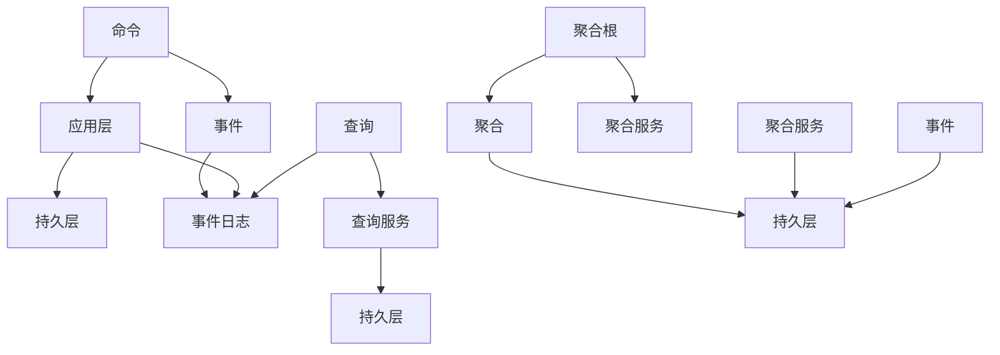

                 

# CQRS模式：读写分离的系统设计

## 1. 背景介绍

### 1.1 问题由来
随着互联网应用的不断发展，对数据处理能力的要求越来越高。传统单体应用的设计理念已经无法满足复杂的系统需求。在系统设计中，读写分离成为了一种常见的优化策略。CQRS（Command Query Responsibility Segregation）模式作为读写分离的一种具体实现，近年来被广泛应用于各种场景，特别是微服务架构中。

CQRS模式的核心思想是将系统的命令和查询职责进行分离。命令（Command）用于更新数据，而查询（Query）用于读取数据。这种分离不仅能够提高系统性能，还能带来更清晰的设计思路和更好的维护性。

### 1.2 问题核心关键点
CQRS模式的核心在于如何合理分离命令和查询，并保证二者之间的数据一致性。具体来说，包括：
- 命令如何提交和处理？
- 查询如何高效获取？
- 读写分离后如何保证数据一致性？
- CQRS在微服务架构中的应用和局限性？

本文将从原理、实现、应用和未来展望等多个角度，深入探讨CQRS模式的精髓和应用细节。

## 2. 核心概念与联系

### 2.1 核心概念概述

CQRS模式的设计理念源于 Domain-Driven Design（DDD）领域驱动设计，旨在将系统的命令和查询职责分离，从而提高系统的性能和可维护性。其核心概念包括：

- 命令(Command)：用于更新数据的操作，如创建、更新、删除等。
- 查询(Query)：用于读取数据的请求，如获取数据、统计数据等。
- 事件(Event)：系统状态变化时产生的日志，通过事件可以帮助查询服务了解系统的状态。
- 聚合(Aggregate)：表示业务实体的数据结构，由多个字段和事件组成，聚合内的数据在提交命令后保持一致。

### 2.2 核心概念原理和架构的 Mermaid 流程图(Mermaid 流程节点中不要有括号、逗号等特殊字符)

这个流程图展示了CQRS模式的基本架构：
- 命令通过应用层处理后，由持久层存储数据并产生事件。
- 查询通过查询服务访问持久层，获取聚合的数据。
- 聚合根管理聚合的数据，事件流在聚合内保持一致性。

## 3. 核心算法原理 & 具体操作步骤
### 3.1 算法原理概述

CQRS模式的核心算法原理可以分为两个部分：命令的提交和查询的读取。

- 命令的提交：通过应用层处理命令，更新持久层的数据，并记录事件日志。
- 查询的读取：通过查询服务从持久层获取聚合数据，并根据事件流恢复聚合的状态。

### 3.2 算法步骤详解

#### 3.2.1 命令的提交
命令的提交通常包括以下步骤：

1. 接收用户请求：用户通过API或事件流发送命令请求。
2. 解析命令：应用层解析命令，确定命令类型和参数。
3. 处理命令：应用层根据命令类型调用相应的服务处理逻辑。
4. 更新数据：持久层执行命令，更新数据并产生事件日志。
5. 发送事件：持久层将事件发送给消息队列或直接传递给查询服务。

#### 3.2.2 查询的读取
查询的读取通常包括以下步骤：

1. 接收查询请求：用户通过API发送查询请求。
2. 解析查询：应用层解析查询，确定查询类型和参数。
3. 获取数据：查询服务从持久层获取聚合数据。
4. 恢复状态：查询服务根据事件流恢复聚合的状态。
5. 返回结果：查询服务将聚合数据返回给应用层，由应用层展示给用户。

### 3.3 算法优缺点

#### 3.3.1 优点

- 性能提升：通过读写分离，命令和查询可以并发处理，提高系统整体性能。
- 分离职责：命令和查询职责分离，便于维护和扩展。
- 数据一致性：事件日志和聚合服务保证数据一致性。
- 事件驱动：基于事件驱动的架构，使得系统具有更好的可测试性和可维护性。

#### 3.3.2 缺点

- 复杂度增加：CQRS模式增加了系统的复杂度，需要分别设计和维护命令和查询的服务。
- 事务处理：跨服务的读写操作需要特殊处理，增加了事务处理的复杂性。
- 数据同步：命令和查询的数据同步需要额外注意，确保数据一致性。
- 学习曲线：CQRS模式需要理解DDD和事件驱动的概念，有一定学习成本。

### 3.4 算法应用领域

CQRS模式广泛应用于微服务架构、分布式系统、高并发系统等场景。具体应用领域包括：

- 电商系统：通过命令处理订单创建、支付、发货等操作，查询处理商品信息、订单详情等。
- 社交网络：通过命令处理用户注册、发布消息、关注好友等操作，查询处理用户信息、消息流等。
- 金融系统：通过命令处理交易、结算等操作，查询处理账户余额、交易历史等。
- IoT系统：通过命令处理设备创建、数据采集等操作，查询处理设备状态、数据流等。

## 4. 数学模型和公式 & 详细讲解 & 举例说明

### 4.1 数学模型构建

CQRS模式的数学模型主要涉及事件流和聚合根的设计。事件流（Event Stream）表示系统的历史状态变化，聚合根（Aggregate Root）是业务实体，包含多个字段和事件。

以电商系统为例，事件流可能包括：
- 用户注册事件
- 商品上架事件
- 订单创建事件
- 订单支付事件
- 订单发货事件

聚合根可能包括：
- 用户聚合：用户ID、用户名、邮箱等
- 商品聚合：商品ID、名称、描述、价格等
- 订单聚合：订单ID、用户ID、商品ID、金额、状态等

### 4.2 公式推导过程

#### 4.2.1 事件流
事件流的定义如下：
$$
E = \lbrace e_1, e_2, \ldots, e_n \rbrace
$$
其中 $e_i$ 表示第 $i$ 个事件，包含事件类型和事件数据。

#### 4.2.2 聚合根
聚合根的定义如下：
$$
A = \lbrace a_1, a_2, \ldots, a_n \rbrace
$$
其中 $a_i$ 表示第 $i$ 个字段，包含字段的当前值。

聚合根和事件流的关系可以用以下公式表示：
$$
A_n = A_0 \oplus E
$$
其中 $\oplus$ 表示事件流对聚合根的更新操作。

### 4.3 案例分析与讲解

以电商系统为例，假设用户提交了一个订单，触发了以下事件流：
- 用户注册事件：
  ```json
  {"type": "user.register", "data": {"id": 1, "name": "Tom", "email": "tom@example.com"}}
  ```
- 商品上架事件：
  ```json
  {"type": "product上架", "data": {"id": 1001, "name": "iPhone 12", "price": 999}}}
  ```
- 订单创建事件：
  ```json
  {"type": "order.create", "data": {"id": 1001, "user_id": 1, "product_id": 1001, "amount": 1}}
  ```
- 订单支付事件：
  ```json
  {"type": "order.pay", "data": {"id": 1001, "amount": 999}}
  ```
- 订单发货事件：
  ```json
  {"type": "order.ship", "data": {"id": 1001, "status": "shipped"}}
  ```

事件流对聚合根的更新操作如下：
- 用户聚合：
  ```json
  {"id": 1, "name": "Tom", "email": "tom@example.com"}
  ```
- 商品聚合：
  ```json
  {"id": 1001, "name": "iPhone 12", "price": 999}
  ```
- 订单聚合：
  ```json
  {"id": 1001, "user_id": 1, "product_id": 1001, "amount": 1, "status": "shipped"}
  ```

## 5. 项目实践：代码实例和详细解释说明

### 5.1 开发环境搭建

首先需要搭建一个CQRS模式的开发环境。以下是基本步骤：

1. 安装Docker和Kubernetes：用于容器化和编排管理。
2. 安装消息队列：如RabbitMQ、Kafka等，用于事件流传输。
3. 安装关系型数据库：如MySQL、PostgreSQL等，用于持久化命令操作。
4. 安装NoSQL数据库：如MongoDB、Cassandra等，用于持久化聚合数据。
5. 安装微服务框架：如Spring Boot、Django等，用于服务开发。

### 5.2 源代码详细实现

#### 5.2.1 命令服务

以下是使用Spring Boot实现订单创建命令服务的示例代码：
```java
@RestController
@RequestMapping("/orders")
public class OrderCommandService {
    
    @Autowired
    private OrderRepository orderRepository;
    
    @PostMapping("/create")
    public ResponseEntity<String> createOrder(@RequestBody Order order) {
        // 解析订单命令
        OrderCommand command = new OrderCommand(order);
        
        // 处理订单命令
        Order savedOrder = orderRepository.save(command);
        
        // 返回订单ID
        return ResponseEntity.ok(savedOrder.getId());
    }
}
```

#### 5.2.2 聚合服务

以下是使用Spring Boot实现订单聚合服务的示例代码：
```java
@RestController
@RequestMapping("/orders")
public class OrderAggregateService {
    
    @Autowired
    private OrderRepository orderRepository;
    
    @GetMapping("/{id}")
    public ResponseEntity<Order> getOrder(@PathVariable("id") String id) {
        // 获取订单聚合
        Order order = orderRepository.findById(id).orElse(null);
        
        // 如果订单不存在，则返回404
        if (order == null) {
            return ResponseEntity.notFound().build();
        }
        
        // 返回订单聚合
        return ResponseEntity.ok(order);
    }
}
```

### 5.3 代码解读与分析

#### 5.3.1 命令服务

命令服务的核心逻辑包括：

1. 解析订单命令：将订单请求转换为订单命令，包含订单信息、命令类型和参数。
2. 处理订单命令：调用订单处理服务，更新订单状态并产生事件日志。
3. 返回订单ID：将订单ID返回给API，供查询服务获取。

#### 5.3.2 聚合服务

聚合服务的核心逻辑包括：

1. 获取订单聚合：从持久层获取订单聚合，包含订单ID和订单状态。
2. 返回订单聚合：将订单聚合返回给API，供用户展示。

### 5.4 运行结果展示

#### 5.4.1 订单创建
通过API发送订单创建请求，返回订单ID：
```json
POST /orders/create HTTP/1.1
Host: localhost:8080
Content-Type: application/json

{"amount": 1, "product_id": 1001, "user_id": 1}

HTTP/1.1 200 OK
Content-Type: application/json

{"id": "1001"}
```

#### 5.4.2 订单查询
通过API获取订单详情，返回订单聚合：
```json
GET /orders/{id} HTTP/1.1
Host: localhost:8080

HTTP/1.1 200 OK
Content-Type: application/json

{"id": "1001", "amount": 1, "product_id": 1001, "user_id": 1, "status": "shipped"}
```

## 6. 实际应用场景

### 6.1 电商平台

电商平台通过CQRS模式实现了订单管理的读写分离，具体应用场景包括：

1. 命令服务：处理用户下单、支付、退货等操作。
2. 聚合服务：查询订单详情、订单历史等数据。
3. 事件服务：记录订单事件，供查询服务恢复订单状态。

### 6.2 金融系统

金融系统通过CQRS模式实现了交易管理的读写分离，具体应用场景包括：

1. 命令服务：处理交易下单、结算、撤销等操作。
2. 聚合服务：查询账户余额、交易历史等数据。
3. 事件服务：记录交易事件，供查询服务恢复账户状态。

### 6.3 物联网

物联网通过CQRS模式实现了设备管理的读写分离，具体应用场景包括：

1. 命令服务：处理设备创建、数据采集等操作。
2. 聚合服务：查询设备状态、数据流等数据。
3. 事件服务：记录设备事件，供查询服务恢复设备状态。

## 7. 工具和资源推荐

### 7.1 学习资源推荐

#### 7.1.1 DDD与事件驱动设计
- 《Implementing Domain-Driven Design: Tackling Complexity in the Heart of Software》
- 《Event-Driven Architecture in Practice》

#### 7.1.2 CQRS模式
- 《Domain-Driven Design: Tackling Complexity in the Heart of Software》
- 《Introduction to CQRS》

### 7.2 开发工具推荐

#### 7.2.1 容器化与编排
- Docker
- Kubernetes

#### 7.2.2 消息队列
- RabbitMQ
- Kafka

#### 7.2.3 数据库
- MySQL
- PostgreSQL
- MongoDB
- Cassandra

#### 7.2.4 微服务框架
- Spring Boot
- Django

### 7.3 相关论文推荐

#### 7.3.1 领域驱动设计
- 《Domain-Driven Design: Tackling Complexity in the Heart of Software》
- 《Implementing Domain-Driven Design: Tackling Complexity in the Heart of Software》

#### 7.3.2 CQRS模式
- 《Introduction to CQRS》
- 《Event-Driven Architecture in Practice》

## 8. 总结：未来发展趋势与挑战

### 8.1 总结

本文详细探讨了CQRS模式的原理和应用，展示了其在读写分离、事件驱动、高并发等场景中的卓越表现。CQRS模式通过分离命令和查询，实现了更高效的读写操作和更清晰的设计思路。然而，CQRS模式也面临一些挑战，如复杂度增加、数据同步等，需要开发者在实际应用中注意。

### 8.2 未来发展趋势

CQRS模式的发展趋势包括：

1. 无状态化：将命令服务设计为无状态，以提高系统的伸缩性和可维护性。
2. 事件流化：通过事件流实现数据的持久化和恢复，提升系统的灵活性和可扩展性。
3. 云原生：采用云原生架构，利用容器化和微服务化提高系统的弹性、自动化和可扩展性。
4. 分布式事务：解决跨服务的读写操作事务问题，保证数据的完整性和一致性。
5. 智能编排：利用人工智能和机器学习技术，实现更智能化的系统编排和优化。

### 8.3 面临的挑战

CQRS模式面临的挑战包括：

1. 复杂度增加：CQRS模式增加了系统的复杂度，需要分别设计和维护命令和查询的服务。
2. 数据同步：跨服务的读写操作需要特殊处理，增加了事务处理的复杂性。
3. 学习曲线：CQRS模式需要理解DDD和事件驱动的概念，有一定学习成本。
4. 性能优化：如何优化命令和查询的性能，保证系统的高并发和低延迟。
5. 数据一致性：如何保证命令和查询的数据一致性，避免数据冲突和重复。

### 8.4 研究展望

未来的研究需要在以下几个方面寻求新的突破：

1. 跨服务的读写操作：解决跨服务的读写操作事务问题，保证数据的完整性和一致性。
2. 智能编排和优化：利用人工智能和机器学习技术，实现更智能化的系统编排和优化。
3. 分布式事务处理：设计更高效的分布式事务处理机制，保证系统的可靠性。
4. 无状态命令服务：将命令服务设计为无状态，以提高系统的伸缩性和可维护性。
5. 事件流化设计：通过事件流实现数据的持久化和恢复，提升系统的灵活性和可扩展性。

总之，CQRS模式作为一种读写分离的优秀设计理念，将在未来的系统中发挥更大的作用。随着技术的不断演进和成熟，CQRS模式将与更多先进理念和技术融合，带来更高效、更灵活、更可靠的系统设计。

## 9. 附录：常见问题与解答

### 9.1 常见问题

1. 什么是CQRS模式？
2. CQRS模式如何实现读写分离？
3. CQRS模式在微服务架构中的应用？
4. CQRS模式的优缺点？

### 9.2 常见问题解答

1. **什么是CQRS模式？**
   CQRS模式是一种读写分离的设计理念，通过将系统的命令和查询职责进行分离，提高系统性能和可维护性。

2. **CQRS模式如何实现读写分离？**
   CQRS模式通过将命令和查询分别处理，命令通过应用层处理后，更新持久层的数据，并记录事件日志。查询通过查询服务从持久层获取聚合数据，并根据事件流恢复聚合的状态。

3. **CQRS模式在微服务架构中的应用？**
   CQRS模式广泛应用于微服务架构，通过将命令和查询分别部署在不同的服务中，实现分布式处理，提高系统的伸缩性和可用性。

4. **CQRS模式的优缺点？**
   优点：
   - 性能提升：通过读写分离，命令和查询可以并发处理，提高系统整体性能。
   - 分离职责：命令和查询职责分离，便于维护和扩展。
   - 数据一致性：事件日志和聚合服务保证数据一致性。
   - 事件驱动：基于事件驱动的架构，使得系统具有更好的可测试性和可维护性。

   缺点：
   - 复杂度增加：CQRS模式增加了系统的复杂度，需要分别设计和维护命令和查询的服务。
   - 事务处理：跨服务的读写操作需要特殊处理，增加了事务处理的复杂性。
   - 数据同步：命令和查询的数据同步需要额外注意，确保数据一致性。
   - 学习曲线：CQRS模式需要理解DDD和事件驱动的概念，有一定学习成本。

---

作者：禅与计算机程序设计艺术 / Zen and the Art of Computer Programming

