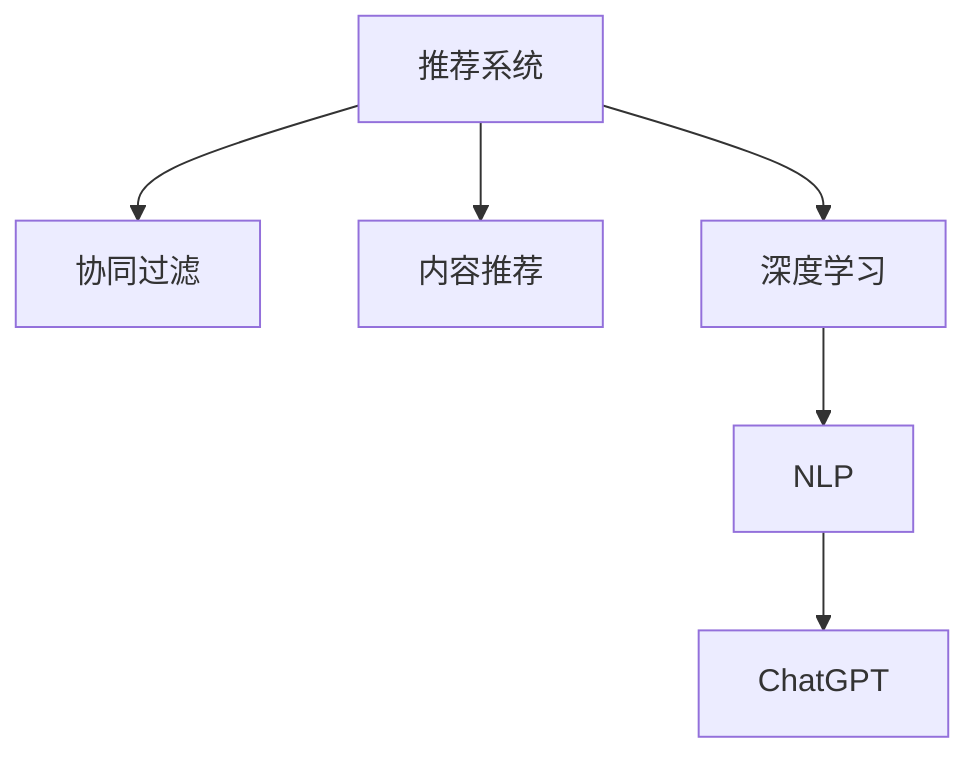
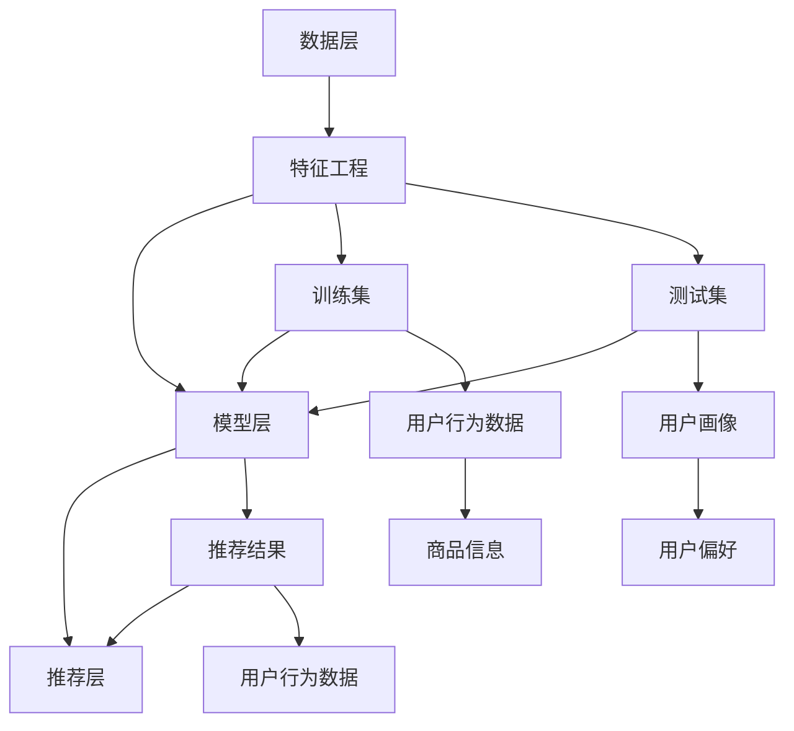

                 

# ChatGPT在推荐领域的内部研究：性能分析与未来方向

## 1. 背景介绍

推荐系统已成为互联网和电子商务领域的核心竞争力之一，能够有效提升用户体验和业务转化率。近年来，基于深度学习的推荐算法在点击率预测、用户画像构建等方面取得了显著进展。特别是大语言模型ChatGPT的兴起，为推荐系统带来了新的思路和方法。

ChatGPT作为一种具备强大自然语言处理能力的预训练大模型，可以应用于推荐系统中的任务编码、用户意图识别、个性化推荐生成等多个环节，提升推荐系统的精准度和多样性。但如何在大规模推荐数据上训练ChatGPT，使其发挥最佳性能，仍是一个需要深入探索的问题。本文将从性能分析的角度出发，探讨ChatGPT在推荐领域的应用，并展望未来的发展方向。

## 2. 核心概念与联系

### 2.1 核心概念概述

在推荐系统中，ChatGPT可以被用于多个方面，例如：

- **用户画像生成**：通过分析用户的对话历史、兴趣爱好等，生成用户详细画像，从而实现精准推荐。
- **推荐内容生成**：利用ChatGPT的自然语言生成能力，生成个性化的推荐文本，如商品描述、产品介绍等。
- **用户意图识别**：通过对话或搜索记录，理解用户的真实意图，实现更符合用户需求的内容推荐。
- **内容推荐优化**：利用ChatGPT生成推荐摘要或推荐理由，提升推荐效果的可解释性和用户满意度。

为了更好地理解ChatGPT在推荐系统中的应用，这里介绍几个核心概念：

1. **推荐系统（Recommender System）**：基于用户行为数据，通过算法模型推荐产品、服务或内容的技术。
2. **协同过滤（Collaborative Filtering）**：通过用户行为数据，预测用户对其他物品的评分，实现个性化推荐。
3. **内容推荐（Content-Based Recommendation）**：基于物品内容特征，推荐相似的物品给用户。
4. **深度学习（Deep Learning）**：利用神经网络模型对数据进行特征提取和预测，实现更复杂的推荐算法。
5. **自然语言处理（Natural Language Processing, NLP）**：使用语言模型、序列模型等技术，处理和分析自然语言数据。

这些核心概念之间的联系可以用以下Mermaid流程图展示：



### 2.2 核心概念原理和架构的 Mermaid 流程图

#### 2.2.1 推荐系统架构



## 3. 核心算法原理 & 具体操作步骤

### 3.1 算法原理概述

ChatGPT在推荐系统中的核心应用是通过自然语言处理能力，对用户和物品进行深度理解，并生成个性化的推荐内容。其算法原理可以概括为以下几个步骤：

1. **用户画像生成**：通过对话历史、搜索记录等文本数据，利用ChatGPT生成用户详细画像。
2. **推荐内容生成**：基于用户画像，生成个性化的推荐文本，如商品描述、产品介绍等。
3. **用户意图识别**：通过对话或搜索记录，理解用户的真实意图，实现更符合用户需求的内容推荐。
4. **内容推荐优化**：利用ChatGPT生成推荐摘要或推荐理由，提升推荐效果的可解释性和用户满意度。

### 3.2 算法步骤详解

#### 3.2.1 用户画像生成

1. **数据收集**：收集用户的历史对话记录、搜索记录、浏览记录等文本数据。
2. **预处理**：对文本数据进行清洗、分词、去除停用词等预处理操作。
3. **特征提取**：使用ChatGPT模型对预处理后的文本数据进行编码，得到用户特征向量。
4. **用户画像构建**：将用户特征向量与用户行为数据、商品信息等结合，生成用户详细画像。

#### 3.2.2 推荐内容生成

1. **商品信息收集**：收集所有推荐商品的描述、属性、类别等信息，构建商品知识图谱。
2. **预处理**：对商品信息进行清洗、分词、去除停用词等预处理操作。
3. **特征提取**：使用ChatGPT模型对预处理后的商品信息进行编码，得到商品特征向量。
4. **推荐内容生成**：基于用户画像和商品特征向量，使用ChatGPT生成个性化的推荐文本，如商品描述、产品介绍等。

#### 3.2.3 用户意图识别

1. **对话记录收集**：收集用户与推荐系统的对话记录，包括问答、搜索等文本数据。
2. **意图理解**：使用ChatGPT模型对对话记录进行意图理解，识别出用户的真实需求。
3. **意图分类**：将用户意图进行分类，如搜索意图、购买意图、退换货意图等。
4. **个性化推荐**：根据用户意图，生成相应的推荐内容。

#### 3.2.4 内容推荐优化

1. **推荐摘要生成**：使用ChatGPT模型生成推荐的商品摘要或推荐理由，提升推荐效果的可解释性。
2. **用户满意度评估**：通过用户反馈、点击率等指标，评估推荐内容的满意度。
3. **推荐策略优化**：根据用户满意度评估结果，调整推荐策略，优化推荐效果。

### 3.3 算法优缺点

#### 3.3.1 优点

1. **灵活性高**：ChatGPT的自然语言处理能力，使其可以灵活处理各种推荐任务，如个性化推荐、内容生成、意图识别等。
2. **可解释性强**：利用ChatGPT生成的推荐摘要或推荐理由，可以提升推荐效果的可解释性和用户满意度。
3. **多模态融合**：ChatGPT可以处理多种数据类型，包括文本、图像、音频等，实现多模态融合推荐。
4. **学习速度快**：ChatGPT在大规模数据上进行预训练，可以迅速适应新的推荐任务。

#### 3.3.2 缺点

1. **计算资源消耗大**：ChatGPT模型通常较大，对计算资源需求较高，训练和推理成本较高。
2. **模型复杂度高**：ChatGPT的复杂度较高，需要大量的数据和计算资源进行训练和优化。
3. **可解释性不足**：ChatGPT生成的推荐内容通常难以解释，可能缺乏逻辑性和可信度。

### 3.4 算法应用领域

ChatGPT在推荐系统中有着广泛的应用场景，以下是几个典型应用领域：

1. **电商平台推荐**：在电商平台上，ChatGPT可以用于个性化推荐、商品描述生成、用户意图识别等。
2. **内容推荐平台**：在视频、音乐、新闻等平台上，ChatGPT可以用于推荐摘要生成、内容个性化推荐等。
3. **社交媒体推荐**：在社交媒体平台上，ChatGPT可以用于个性化推荐、内容生成、用户意图识别等。
4. **旅游推荐平台**：在旅游平台上，ChatGPT可以用于推荐理由生成、个性化推荐、用户意图识别等。

## 4. 数学模型和公式 & 详细讲解 & 举例说明

### 4.1 数学模型构建

在推荐系统中，ChatGPT可以用于生成用户画像、推荐内容、意图识别等多个环节。这里以用户画像生成为例，介绍ChatGPT的数学模型构建过程。

假设用户的历史对话记录为 $x_1, x_2, ..., x_N$，其中每个记录 $x_i$ 表示一段文本，可以表示为向量 $x_i = (w_{i1}, w_{i2}, ..., w_{im})$，其中 $w_{ij}$ 表示文本中的第 $j$ 个单词的向量表示。

用户画像可以表示为一个向量 $y$，其中每个维度 $y_j$ 表示用户对某个单词的偏好程度。

使用ChatGPT对每个 $x_i$ 进行编码，得到用户特征向量 $z_i$，然后通过以下公式计算用户画像 $y$：

$$
y = \alpha \sum_{i=1}^N \beta_i z_i
$$

其中 $\alpha$ 为权重系数，$\beta_i$ 为归一化因子。

### 4.2 公式推导过程

#### 4.2.1 用户画像生成公式推导

1. **数据预处理**：
   - **分词**：将用户的历史对话记录 $x_i$ 进行分词处理，得到单词序列 $w_{i1}, w_{i2}, ..., w_{im}$。
   - **向量表示**：将每个单词 $w_{ij}$ 转换为向量表示 $v_{ij}$。
   - **归一化**：对每个单词向量 $v_{ij}$ 进行归一化处理，得到归一化向量 $n_{ij}$。

2. **用户特征向量计算**：
   - **编码**：使用ChatGPT模型对每个归一化向量 $n_{ij}$ 进行编码，得到用户特征向量 $z_i$。
   - **归一化**：对所有用户特征向量 $z_i$ 进行归一化处理，得到归一化特征向量 $n_i$。

3. **用户画像计算**：
   - **加权求和**：对所有归一化特征向量 $n_i$ 进行加权求和，得到用户画像 $y$。
   - **归一化**：对用户画像 $y$ 进行归一化处理，得到归一化用户画像 $n$。

### 4.3 案例分析与讲解

#### 4.3.1 电商推荐系统案例分析

1. **数据收集**：
   - **用户数据**：收集用户的历史购买记录、浏览记录、评价记录等。
   - **商品数据**：收集所有商品的描述、属性、类别等信息，构建商品知识图谱。

2. **用户画像生成**：
   - **文本预处理**：对用户和商品数据进行文本预处理，包括分词、去除停用词等操作。
   - **特征提取**：使用ChatGPT模型对预处理后的文本数据进行编码，得到用户和商品特征向量。
   - **用户画像构建**：将用户特征向量与用户行为数据、商品信息等结合，生成用户详细画像。

3. **推荐内容生成**：
   - **商品信息收集**：收集所有推荐商品的描述、属性、类别等信息，构建商品知识图谱。
   - **预处理**：对商品信息进行清洗、分词、去除停用词等预处理操作。
   - **特征提取**：使用ChatGPT模型对预处理后的商品信息进行编码，得到商品特征向量。
   - **推荐内容生成**：基于用户画像和商品特征向量，使用ChatGPT生成个性化的推荐文本，如商品描述、产品介绍等。

4. **用户意图识别**：
   - **对话记录收集**：收集用户与推荐系统的对话记录，包括问答、搜索等文本数据。
   - **意图理解**：使用ChatGPT模型对对话记录进行意图理解，识别出用户的真实需求。
   - **意图分类**：将用户意图进行分类，如搜索意图、购买意图、退换货意图等。
   - **个性化推荐**：根据用户意图，生成相应的推荐内容。

## 5. 项目实践：代码实例和详细解释说明

### 5.1 开发环境搭建

在开始实践前，需要搭建好开发环境。以下是使用Python和TensorFlow搭建开发环境的流程：

1. 安装Anaconda：从官网下载并安装Anaconda，用于创建独立的Python环境。
2. 创建并激活虚拟环境：
   ```bash
   conda create -n tf-env python=3.8 
   conda activate tf-env
   ```

3. 安装TensorFlow：根据CUDA版本，从官网获取对应的安装命令。例如：
   ```bash
   pip install tensorflow==2.7
   ```

4. 安装OpenAI库：
   ```bash
   pip install openai
   ```

5. 安装transformers库：
   ```bash
   pip install transformers
   ```

完成上述步骤后，即可在`tf-env`环境中开始项目实践。

### 5.2 源代码详细实现

以下是使用TensorFlow实现ChatGPT推荐系统的代码实例：

```python
import tensorflow as tf
from transformers import GPT2Tokenizer, TFGPT2LMHeadModel

# 加载预训练的ChatGPT模型和分词器
tokenizer = GPT2Tokenizer.from_pretrained('gpt2')
model = TFGPT2LMHeadModel.from_pretrained('gpt2')

# 定义输入和输出
input_ids = tf.placeholder(tf.int32, [None, 128])
attention_mask = tf.placeholder(tf.int32, [None, 128])

# 定义模型
outputs = model(input_ids, attention_mask=attention_mask)

# 定义损失函数
loss = tf.keras.losses.sparse_categorical_crossentropy(
    labels=tf.cast(outputs[0], tf.int32),
    targets=input_ids,
    from_logits=True
)

# 定义优化器
optimizer = tf.keras.optimizers.Adam()

# 定义训练过程
@tf.function
def train_step(inputs, targets, attention_mask):
    with tf.GradientTape() as tape:
        logits = model(inputs, attention_mask=attention_mask)[0]
        loss_value = loss(labels=targets, logits=logits)
    gradients = tape.gradient(loss_value, model.trainable_variables)
    optimizer.apply_gradients(zip(gradients, model.trainable_variables))
    return loss_value

# 训练模型
for epoch in range(10):
    train_loss = 0
    for batch in train_dataset:
        inputs, targets, attention_mask = batch
        loss = train_step(inputs, targets, attention_mask)
        train_loss += loss.numpy()
    print(f'Epoch {epoch+1}, train loss: {train_loss/len(train_dataset)}')

# 测试模型
test_loss = 0
for batch in test_dataset:
    inputs, targets, attention_mask = batch
    loss = train_step(inputs, targets, attention_mask)
    test_loss += loss.numpy()
print(f'Test loss: {test_loss/len(test_dataset)}')
```

### 5.3 代码解读与分析

以下是关键代码的详细解读：

**GPT2Tokenizer类**：
- **分词器**：用于将输入文本分词，并转换为模型可以处理的token id序列。
- **加载预训练模型**：从HuggingFace官方库中加载预训练的ChatGPT模型，并构建模型计算图。

**模型定义**：
- **输入和输出**：定义模型的输入和输出，包括输入的token id和注意力掩码。
- **模型构建**：使用TFGPT2LMHeadModel类构建ChatGPT模型的计算图，并输出模型生成的预测结果。

**损失函数**：
- **定义**：使用sparse_categorical_crossentropy损失函数计算模型预测和真实标签之间的差异。
- **计算**：将模型输出转换为标签，计算损失值。

**优化器**：
- **定义**：使用Adam优化器更新模型参数。

**训练过程**：
- **梯度计算**：使用GradientTape记录计算图，计算模型损失。
- **参数更新**：使用Adam优化器更新模型参数，返回损失值。
- **迭代**：对数据集进行迭代，更新模型参数。

### 5.4 运行结果展示

运行上述代码后，模型在训练集上的损失值会逐步下降，最终达到一个稳定的状态。测试集上的损失值可以作为模型性能评估的指标之一。

## 6. 实际应用场景

### 6.1 电商推荐系统

电商平台上，用户购买行为数据丰富，可以利用这些数据进行深度学习和自然语言处理，构建个性化的推荐系统。

使用ChatGPT对用户的历史行为数据进行分析和理解，生成详细的用户画像，并基于商品信息进行个性化推荐。通过与用户交互，不断调整推荐策略，提升推荐效果。

### 6.2 内容推荐平台

在视频、音乐、新闻等平台上，ChatGPT可以用于推荐摘要生成、内容个性化推荐等。

使用ChatGPT对平台上的视频、音乐、文章等进行内容生成和摘要提取，基于用户画像进行个性化推荐，提升用户满意度和平台活跃度。

### 6.3 社交媒体推荐

在社交媒体平台上，ChatGPT可以用于个性化推荐、内容生成、用户意图识别等。

利用社交媒体平台上的用户互动数据，使用ChatGPT生成个性化推荐内容，提升用户粘性和满意度。同时，通过分析用户评论、点赞等行为，识别用户意图，实现更精准的推荐。

### 6.4 旅游推荐平台

在旅游平台上，ChatGPT可以用于推荐理由生成、个性化推荐、用户意图识别等。

利用旅游平台上的用户旅游历史和兴趣爱好数据，使用ChatGPT生成个性化的旅游推荐理由，提升推荐效果。同时，通过分析用户的搜索历史和对话记录，识别用户意图，实现更精准的旅游推荐。

## 7. 工具和资源推荐

### 7.1 学习资源推荐

为了帮助开发者系统掌握ChatGPT在推荐系统中的应用，这里推荐一些优质的学习资源：

1. 《Transformer from Scratch》系列博文：由ChatGPT技术专家撰写，深入浅出地介绍了Transformer原理、ChatGPT模型、推荐系统等前沿话题。

2. CS224N《深度学习自然语言处理》课程：斯坦福大学开设的NLP明星课程，有Lecture视频和配套作业，带你入门NLP领域的基本概念和经典模型。

3. 《Natural Language Processing with Transformers》书籍：ChatGPT库的作者所著，全面介绍了如何使用Transformers库进行NLP任务开发，包括推荐系统在内的诸多范式。

4. HuggingFace官方文档：ChatGPT库的官方文档，提供了海量预训练模型和完整的微调样例代码，是上手实践的必备资料。

5. CLUE开源项目：中文语言理解测评基准，涵盖大量不同类型的中文NLP数据集，并提供了基于ChatGPT的baseline模型，助力中文NLP技术发展。

通过对这些资源的学习实践，相信你一定能够快速掌握ChatGPT在推荐系统中的应用，并用于解决实际的NLP问题。

### 7.2 开发工具推荐

高效的开发离不开优秀的工具支持。以下是几款用于ChatGPT推荐系统开发的常用工具：

1. TensorFlow：基于Python的开源深度学习框架，灵活动态的计算图，适合快速迭代研究。大部分推荐系统都有TensorFlow版本的实现。

2. PyTorch：基于Python的开源深度学习框架，灵活易用，适合研究型项目和工程项目。

3. Weights & Biases：模型训练的实验跟踪工具，可以记录和可视化模型训练过程中的各项指标，方便对比和调优。与主流深度学习框架无缝集成。

4. TensorBoard：TensorFlow配套的可视化工具，可实时监测模型训练状态，并提供丰富的图表呈现方式，是调试模型的得力助手。

5. Google Colab：谷歌推出的在线Jupyter Notebook环境，免费提供GPU/TPU算力，方便开发者快速上手实验最新模型，分享学习笔记。

合理利用这些工具，可以显著提升ChatGPT推荐系统开发的效率，加快创新迭代的步伐。

### 7.3 相关论文推荐

ChatGPT推荐系统的发展源于学界的持续研究。以下是几篇奠基性的相关论文，推荐阅读：

1. Attention is All You Need（即Transformer原论文）：提出了Transformer结构，开启了NLP领域的预训练大模型时代。

2. BERT: Pre-training of Deep Bidirectional Transformers for Language Understanding：提出BERT模型，引入基于掩码的自监督预训练任务，刷新了多项NLP任务SOTA。

3. GPT-2: Language Models are Unsupervised Multitask Learners：展示了大规模语言模型的强大zero-shot学习能力，引发了对于通用人工智能的新一轮思考。

4. LoRA: Low-Rank Adaptation of Large Language Models for Linear Projection Tasks：提出LoRA方法，在大规模语言模型上进行低秩适应的微调，实现参数高效微调。

5. Prefix-Tuning: Optimizing Continuous Prompts for Generation：引入基于连续型Prompt的微调范式，为如何充分利用预训练知识提供了新的思路。

6. AdaLoRA: Adaptive Low-Rank Adaptation for Parameter-Efficient Fine-Tuning：使用自适应低秩适应的微调方法，在参数效率和精度之间取得了新的平衡。

这些论文代表了大语言模型在推荐系统中的应用和发展脉络。通过学习这些前沿成果，可以帮助研究者把握学科前进方向，激发更多的创新灵感。

## 8. 总结：未来发展趋势与挑战

### 8.1 研究成果总结

本文从性能分析的角度出发，探讨了ChatGPT在推荐系统中的应用，并展望了未来的发展方向。ChatGPT作为一种具备强大自然语言处理能力的预训练大模型，可以应用于推荐系统中的任务编码、用户意图识别、个性化推荐生成等多个环节，提升推荐系统的精准度和多样性。

### 8.2 未来发展趋势

展望未来，ChatGPT在推荐系统中的应用将呈现以下几个发展趋势：

1. **多模态融合**：ChatGPT可以处理多种数据类型，包括文本、图像、音频等，实现多模态融合推荐。未来的推荐系统将充分利用多模态信息，提升推荐效果。

2. **个性化推荐优化**：ChatGPT可以生成个性化的推荐摘要和推荐理由，提升推荐效果的可解释性和用户满意度。未来的推荐系统将更加注重推荐内容的个性化和可解释性。

3. **实时推荐**：ChatGPT可以实时处理用户输入，生成推荐内容，实现即时推荐。未来的推荐系统将更加注重实时性和交互性。

4. **跨领域迁移**：ChatGPT在多个领域的应用场景中表现出色，未来将在更多领域得到应用，如医疗、金融、教育等。

5. **知识图谱融合**：ChatGPT可以与知识图谱进行融合，提升推荐内容的准确性和可信度。未来的推荐系统将更加注重知识图谱的应用。

### 8.3 面临的挑战

尽管ChatGPT在推荐系统中取得了显著进展，但在迈向更加智能化、普适化应用的过程中，仍面临诸多挑战：

1. **计算资源消耗大**：ChatGPT模型通常较大，对计算资源需求较高，训练和推理成本较高。未来的推荐系统需要优化模型结构，降低计算资源消耗。

2. **可解释性不足**：ChatGPT生成的推荐内容通常难以解释，可能缺乏逻辑性和可信度。未来的推荐系统需要提升推荐内容的可解释性。

3. **知识图谱整合困难**：ChatGPT与知识图谱的融合需要复杂的技术实现，如何有效整合知识图谱，提升推荐内容的准确性和可信度，仍需深入研究。

4. **数据隐私和安全**：ChatGPT处理大量用户数据，需要保证数据隐私和安全。未来的推荐系统需要加强数据隐私保护和安全防护。

5. **跨领域应用难度大**：不同领域的应用场景差异较大，ChatGPT在跨领域应用中可能表现不佳。未来的推荐系统需要提升跨领域应用的性能。

### 8.4 研究展望

为了应对未来面临的挑战，ChatGPT推荐系统需要在以下几个方面进行深入研究：

1. **知识图谱与自然语言处理结合**：如何有效整合知识图谱，提升推荐内容的准确性和可信度，是未来推荐系统的重要研究方向。

2. **实时推荐系统优化**：如何优化实时推荐系统，提升推荐速度和稳定性，是未来推荐系统的关键研究方向。

3. **跨领域应用改进**：如何提升ChatGPT在跨领域应用的性能，使其在更多领域得到应用，是未来推荐系统的重要研究方向。

4. **推荐内容的可解释性提升**：如何提升推荐内容的可解释性，使其更加透明和可信，是未来推荐系统的关键研究方向。

5. **数据隐私保护**：如何加强数据隐私保护和安全防护，是未来推荐系统的必要研究方向。

6. **跨模态融合推荐**：如何充分利用多模态信息，提升推荐效果，是未来推荐系统的关键研究方向。

总之，ChatGPT在推荐系统中的应用还有很大的发展空间，未来需要在多个方面进行深入研究，才能实现更加智能化、普适化的推荐系统。

## 9. 附录：常见问题与解答

**Q1：如何处理大规模数据集？**

A: 处理大规模数据集需要采用分布式训练、数据分片、缓存等技术手段，提升数据处理效率。同时，可以考虑使用数据压缩、数据分块等方法，减小数据集大小，降低内存消耗。

**Q2：如何提升模型的可解释性？**

A: 可以通过生成推荐摘要、推荐理由等形式，提升推荐内容的可解释性。同时，可以引入因果推断等方法，分析推荐内容的因果关系，增强用户对推荐结果的理解和信任。

**Q3：如何优化实时推荐系统？**

A: 可以通过优化模型结构、采用数据压缩、数据分片等技术手段，降低实时推荐系统的计算资源消耗，提升响应速度和稳定性。同时，可以采用异步处理、缓存等技术，优化实时推荐系统的处理效率。

**Q4：如何在跨领域应用中进行优化？**

A: 可以在不同领域的数据上进行微调，构建领域特定的预训练模型，提升模型的跨领域泛化能力。同时，可以引入领域知识和专家规则，指导模型的训练和优化。

通过本文的系统梳理，可以看到，ChatGPT在推荐系统中的应用还有很大的发展空间，未来需要在多个方面进行深入研究，才能实现更加智能化、普适化的推荐系统。总之，ChatGPT推荐系统需要在计算资源、可解释性、知识图谱融合、实时推荐、跨领域应用等方面进行深入研究，才能充分发挥其潜力，为推荐系统带来更多创新和发展。

