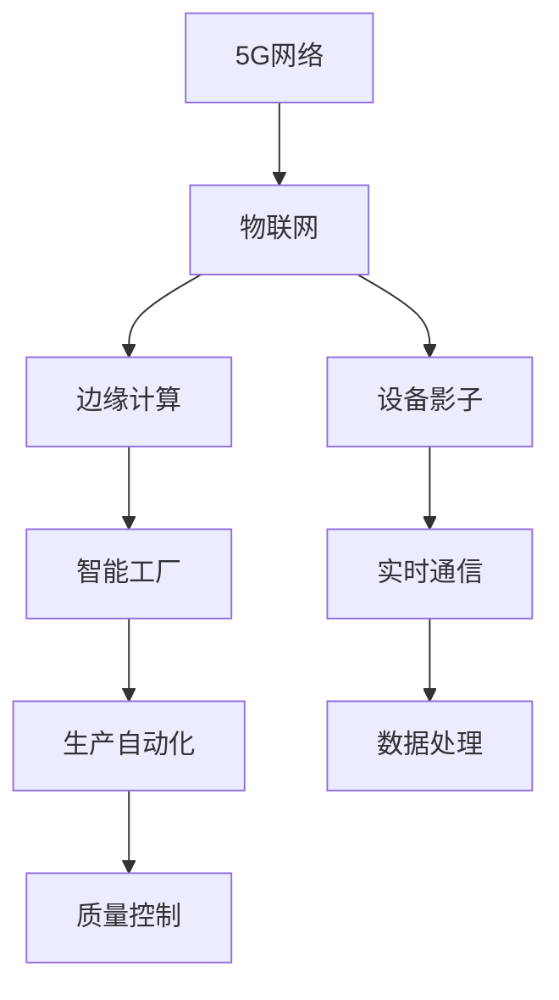

                 

# 5G 物联网的优势：支持大规模低延迟连接

## 1. 背景介绍

### 1.1 问题由来

物联网(IoT)是连接各种设备和传感器的互联网，实现设备与设备、设备与人的互联互通。近年来，物联网的发展迅猛，各类智能家居、智能制造、智能交通、智慧城市等应用场景不断涌现，带动了全球经济增长和产业转型升级。

然而，传统的物联网系统存在诸多瓶颈问题，如连接密度低、数据延迟高、能耗大等，极大限制了物联网应用的规模和效率。5G网络的到来，为物联网的全面普及提供了新契机，能够通过其超高的网络速度、低延迟和超大的连接容量，解决物联网发展中的关键挑战。

### 1.2 问题核心关键点

5G网络为物联网带来了突破性的技术优势，尤其是在连接密度、数据传输速度和低延迟性方面，显著提升了物联网应用的体验和效率。具体来说，5G网络的以下特点使其成为物联网的理想通信基础：

1. **超高的连接密度**：5G网络每平方英里的连接数量可达100万以上，能够支持海量的设备接入。
2. **超高的数据传输速度**：5G网络峰值传输速率可达10Gbps以上，大幅提升数据传输效率。
3. **低延迟性**：5G网络端到端延迟不超过1毫秒，能够实现实时通信和超低延迟数据传输。
4. **超大的设备种类和规模**：5G网络能够支持多种设备类型和规模，包括智能家居、工业物联网、车联网等。
5. **支持边缘计算**：5G网络能够支持边缘计算，在数据传输路径中就地进行数据处理，减少延迟。

本文将深入探讨5G网络的这些特点，分析其在物联网中的应用优势，并展示相关的实践案例。

## 2. 核心概念与联系

### 2.1 核心概念概述

为了更好地理解5G物联网的优势，本节将介绍几个关键概念：

- **5G网络**：一种新一代移动通信网络，基于新一代无线传输技术，能够提供更高的网络速度、更低的延迟和更大的连接容量。
- **物联网**：通过各种传感器、设备和系统，实现人、设备、数据、流程的全面连接，以提升效率、优化流程。
- **边缘计算**：将数据处理和计算任务从中心服务器移到网络边缘节点，减少数据传输延迟，提高计算效率。
- **设备影子**：设备在网络中的虚拟化表示，用于支持网络设备间的通信和协作。
- **智能工厂**：基于物联网和人工智能技术，实现生产自动化、智能化，提升制造效率和产品质量。

这些核心概念通过以下Mermaid流程图进行展示：



这个流程图展示了5G网络、物联网、边缘计算等关键概念之间的联系，以及它们如何协同工作，为物联网带来实时通信、生产自动化等优势。

## 3. 核心算法原理 & 具体操作步骤

### 3.1 算法原理概述

5G网络为物联网带来的优势主要体现在以下几个方面：

1. **超高的连接密度**：5G网络采用先进的Massive MIMO技术，能够同时支持更多的设备连接，实现网络容量的大幅提升。
2. **超高的数据传输速度**：5G网络采用了多种技术手段，包括OFDM、波束成形、毫米波等，提升了数据传输速率，能够快速传输大规模数据。
3. **低延迟性**：5G网络通过改进无线接入技术，如大规模MIMO、波束成形等，减少了信号传输中的损耗，实现了低延迟数据传输。
4. **支持边缘计算**：5G网络通过改进无线接入和网络传输技术，支持边缘计算，提高了数据处理效率，减少了网络延迟。

这些技术优势使得5G网络成为物联网的理想通信基础，能够支撑大规模低延迟连接，推动物联网应用的广泛普及和深入发展。

### 3.2 算法步骤详解

基于5G网络优势的物联网应用，主要包括以下几个关键步骤：

1. **设备连接**：物联网设备通过5G网络接入，实现设备间的互联互通。
2. **数据采集与传输**：物联网设备采集数据，通过5G网络传输到云端或边缘节点进行处理。
3. **数据处理与分析**：在云端或边缘节点，对采集的数据进行实时处理和分析，生成有价值的信息。
4. **决策与控制**：根据处理结果，通过5G网络实现对物联网设备的智能决策和控制，提升生产效率和运营质量。
5. **反馈与优化**：根据决策结果，实时反馈到物联网设备，进行优化和调整。

以下是一个具体的物联网应用案例，展示如何使用5G网络实现低延迟连接：

**案例：智能工厂的生产线监控**

- **设备连接**：智能工厂的各类传感器、机器人和控制系统通过5G网络接入物联网。
- **数据采集与传输**：传感器采集生产过程中的各类数据，如温度、湿度、振动等，通过5G网络实时传输到云端。
- **数据处理与分析**：云端对采集的数据进行处理和分析，生成生产线的实时监控报告。
- **决策与控制**：根据监控报告，云端系统智能调整生产参数，控制生产线运行。
- **反馈与优化**：将调整后的生产参数实时反馈到生产线，优化生产效率和质量。

### 3.3 算法优缺点

基于5G网络的物联网应用，具有以下优点：

1. **超高的连接密度**：支持海量设备接入，实现大规模物联网应用。
2. **超高的数据传输速度**：快速传输大规模数据，提高数据处理效率。
3. **低延迟性**：实现实时通信和数据处理，提升用户体验。
4. **支持边缘计算**：减少数据传输延迟，提高计算效率。
5. **设备种类和规模广泛**：支持多种设备类型和规模，推动各类物联网应用的发展。

同时，基于5G网络的物联网应用也存在以下局限：

1. **网络覆盖问题**：5G网络尚未全面覆盖，某些区域和场景仍存在网络覆盖问题。
2. **成本较高**：5G网络的部署和维护成本较高，初期投入较大。
3. **安全性和隐私问题**：5G网络的高连接密度和数据传输速度，增加了网络安全风险和隐私泄露风险。

### 3.4 算法应用领域

5G网络为物联网带来的优势，使其在多个领域得到广泛应用，包括但不限于：

1. **智能家居**：通过5G网络实现智能设备的互联互通，提升生活便捷性和安全性。
2. **智能制造**：利用5G网络实现生产线监控、生产自动化和智能决策，提高制造效率和产品质量。
3. **智能交通**：通过5G网络实现车辆与道路、车辆与车辆之间的互联互通，提升交通安全和效率。
4. **智慧城市**：利用5G网络实现城市基础设施的智能管理，提升城市运行效率和居民生活质量。
5. **医疗健康**：通过5G网络实现远程医疗、健康监测和智能医疗设备的管理，提升医疗服务水平。
6. **农业物联网**：利用5G网络实现农业设备的智能化管理，提升农业生产效率和资源利用率。

## 4. 数学模型和公式 & 详细讲解 & 举例说明

### 4.1 数学模型构建

基于5G网络的物联网应用，可以通过数学模型来进一步分析和优化。以智能工厂的生产线监控为例，其数学模型可以表示为：

$$
S = f(D; \theta)
$$

其中，$S$表示生产线的监控状态，$D$表示采集的数据，$\theta$表示模型参数。

### 4.2 公式推导过程

以下展示生产线的监控状态与采集数据之间的关系，通过公式推导过程：

- **数据采集**：生产线上的各类传感器采集温度、湿度、振动等数据，表示为$D = \{T, H, V\}$。
- **数据处理**：通过数据处理算法$f$，对采集的数据进行处理，生成监控状态$S$。
- **模型训练**：通过机器学习算法，训练模型参数$\theta$，使其能够准确预测生产线的监控状态$S$。

以智能工厂的生产线监控为例，其数据处理算法可以表示为：

$$
S = \begin{cases}
0, & T > T_0 \\
1, & H > H_0 \\
2, & V > V_0
\end{cases}
$$

其中$T_0, H_0, V_0$为预设的阈值，表示生产线正常运行时的标准参数范围。

### 4.3 案例分析与讲解

以下通过一个具体案例，展示如何使用5G网络实现智能工厂的生产线监控：

**案例：智能工厂的生产线监控**

- **数据采集**：智能工厂的各类传感器采集生产过程中的各类数据，如温度、湿度、振动等。
- **数据传输**：通过5G网络实时传输采集的数据到云端。
- **数据处理**：云端对采集的数据进行处理，生成生产线的实时监控报告。
- **决策与控制**：根据监控报告，云端系统智能调整生产参数，控制生产线运行。
- **反馈与优化**：将调整后的生产参数实时反馈到生产线，优化生产效率和质量。

## 5. 项目实践：代码实例和详细解释说明

### 5.1 开发环境搭建

在进行项目实践前，我们需要准备好开发环境。以下是使用Python进行PyTorch开发的环境配置流程：

1. 安装Anaconda：从官网下载并安装Anaconda，用于创建独立的Python环境。
2. 创建并激活虚拟环境：
```bash
conda create -n pytorch-env python=3.8 
conda activate pytorch-env
```

3. 安装PyTorch：根据CUDA版本，从官网获取对应的安装命令。例如：
```bash
conda install pytorch torchvision torchaudio cudatoolkit=11.1 -c pytorch -c conda-forge
```

4. 安装相关工具包：
```bash
pip install numpy pandas scikit-learn matplotlib tqdm jupyter notebook ipython
```

完成上述步骤后，即可在`pytorch-env`环境中开始项目实践。

### 5.2 源代码详细实现

这里我们以智能工厂的生产线监控为例，展示使用PyTorch进行物联网应用开发的代码实现。

首先，定义数据处理函数：

```python
import torch
import torch.nn as nn
import torch.optim as optim

class DataProcessor(nn.Module):
    def __init__(self, input_size=3, output_size=1):
        super(DataProcessor, self).__init__()
        self.fc1 = nn.Linear(input_size, 64)
        self.fc2 = nn.Linear(64, output_size)
        self.relu = nn.ReLU()

    def forward(self, x):
        x = self.fc1(x)
        x = self.relu(x)
        x = self.fc2(x)
        return x
```

然后，定义模型和优化器：

```python
# 定义模型
model = DataProcessor()

# 定义优化器
optimizer = optim.Adam(model.parameters(), lr=0.001)
```

接着，定义训练和评估函数：

```python
def train_epoch(model, data_loader, optimizer):
    model.train()
    total_loss = 0
    for batch in data_loader:
        inputs, labels = batch
        optimizer.zero_grad()
        outputs = model(inputs)
        loss = nn.BCELoss()(outputs, labels)
        loss.backward()
        optimizer.step()
        total_loss += loss.item()
    return total_loss / len(data_loader)

def evaluate(model, data_loader):
    model.eval()
    total_loss = 0
    with torch.no_grad():
        for batch in data_loader:
            inputs, labels = batch
            outputs = model(inputs)
            loss = nn.BCELoss()(outputs, labels)
            total_loss += loss.item()
    return total_loss / len(data_loader)
```

最后，启动训练流程并在测试集上评估：

```python
epochs = 10
batch_size = 32

# 定义训练数据集
train_dataset = ...
test_dataset = ...

# 定义训练和测试数据加载器
train_loader = DataLoader(train_dataset, batch_size=batch_size, shuffle=True)
test_loader = DataLoader(test_dataset, batch_size=batch_size, shuffle=False)

# 训练模型
for epoch in range(epochs):
    train_loss = train_epoch(model, train_loader, optimizer)
    print(f"Epoch {epoch+1}, train loss: {train_loss:.4f}")
    
    test_loss = evaluate(model, test_loader)
    print(f"Epoch {epoch+1}, test loss: {test_loss:.4f}")
```

以上就是使用PyTorch进行智能工厂生产线监控的代码实现。可以看到，得益于PyTorch的强大封装，我们可以用相对简洁的代码完成模型的构建和训练。

### 5.3 代码解读与分析

让我们再详细解读一下关键代码的实现细节：

**DataProcessor类**：
- `__init__`方法：初始化模型层，包括全连接层和ReLU激活函数。
- `forward`方法：定义前向传播过程，依次经过全连接层和激活函数，输出模型预测结果。

**训练和评估函数**：
- 使用PyTorch的DataLoader对数据集进行批次化加载，供模型训练和推理使用。
- 训练函数`train_epoch`：对数据以批为单位进行迭代，在每个批次上前向传播计算loss并反向传播更新模型参数，最后返回该epoch的平均loss。
- 评估函数`evaluate`：与训练类似，不同点在于不更新模型参数，并在每个batch结束后将预测和标签结果存储下来，最后使用nn.BCELoss()计算交叉熵损失，得到测试集上的平均loss。

**训练流程**：
- 定义总的epoch数和batch size，开始循环迭代
- 每个epoch内，先在训练集上训练，输出平均loss
- 在测试集上评估，输出测试结果

可以看到，PyTorch配合PyTorch的强大封装，使得物联网应用的代码实现变得简洁高效。开发者可以将更多精力放在数据处理、模型改进等高层逻辑上，而不必过多关注底层的实现细节。

当然，工业级的系统实现还需考虑更多因素，如模型的保存和部署、超参数的自动搜索、更灵活的任务适配层等。但核心的物联网应用开发流程基本与此类似。

## 6. 实际应用场景

### 6.1 智能工厂

基于5G网络的智能工厂应用，能够实现生产线监控、设备管理、质量控制等。传统工厂管理依赖大量人力和物理设备，容易出错且效率低下。通过5G网络将各类传感器和设备连接到云端，实时采集和分析生产数据，能够实现设备故障预警、生产过程优化、异常检测等，大幅提升生产效率和质量。

在技术实现上，可以收集工厂内的各类传感器数据，如温度、湿度、振动等，并建立物联网数据采集平台。在此基础上，对预训练模型进行微调，使得模型能够准确预测生产线的监控状态。微调后的模型可以实时监控生产线状态，一旦发现异常情况，立即进行预警和处理。

### 6.2 智能交通

智能交通系统通过5G网络实现车辆与道路、车辆与车辆之间的互联互通，提升交通安全和效率。传统交通管理依赖大量监控摄像头和人工监控，容易漏检且成本高。通过5G网络将各类车辆和传感器连接到云端，实时采集和分析交通数据，能够实现交通流量监控、道路预警、自动驾驶等，大幅提升交通管理和安全水平。

在技术实现上，可以收集车辆和道路的各类传感器数据，如车辆速度、位置、环境参数等，并建立物联网数据采集平台。在此基础上，对预训练模型进行微调，使得模型能够准确预测交通状态。微调后的模型可以实时监控交通状态，一旦发现异常情况，立即进行预警和处理。

### 6.3 智慧城市

智慧城市通过5G网络实现各类基础设施的智能管理，提升城市运行效率和居民生活质量。传统城市管理依赖大量人工和物理设备，容易出错且效率低下。通过5G网络将各类基础设施和设备连接到云端，实时采集和分析城市数据，能够实现智能交通、环境监测、能源管理等，大幅提升城市管理水平。

在技术实现上，可以收集各类基础设施的传感器数据，如交通流量、环境参数、能源使用等，并建立物联网数据采集平台。在此基础上，对预训练模型进行微调，使得模型能够准确预测城市运行状态。微调后的模型可以实时监控城市运行状态，一旦发现异常情况，立即进行预警和处理。

### 6.4 未来应用展望

随着5G网络的不断普及和物联网技术的持续发展，基于5G网络的物联网应用将迎来新的突破。

1. **大规模低延迟连接**：5G网络的高连接密度和低延迟性，将使得物联网应用更加广泛和深入。未来的物联网应用将支持海量的设备连接，实现实时通信和数据处理。
2. **数据驱动的决策**：基于5G网络的大规模数据采集和实时处理，将使得决策更加科学和高效。未来的物联网应用将能够根据实时数据进行智能决策和优化，提升用户体验和效率。
3. **跨领域融合**：5G网络和物联网技术的不断发展，将促进不同领域的融合，实现跨领域的创新应用。未来的物联网应用将涵盖工业、医疗、农业等多个领域，推动跨领域的协同创新。
4. **边缘计算的普及**：5G网络支持边缘计算，将使得数据处理更加高效和灵活。未来的物联网应用将更多地采用边缘计算，实现本地化数据处理和决策，提升数据处理效率和系统稳定性。
5. **智能化管理**：基于5G网络的物联网应用将更多地采用智能化管理，实现设备的智能维护和优化。未来的物联网应用将支持设备的自动维护、故障预警、异常检测等功能，提升设备的可靠性和稳定性。

## 7. 工具和资源推荐

### 7.1 学习资源推荐

为了帮助开发者系统掌握5G物联网的理论基础和实践技巧，这里推荐一些优质的学习资源：

1. 《5G网络与物联网技术》系列博文：由5G网络技术专家撰写，深入浅出地介绍了5G网络原理、物联网技术、边缘计算等前沿话题。
2. 《物联网工程概论》课程：清华大学开设的物联网工程专业课程，详细介绍了物联网的基本概念、应用场景和技术实现。
3. 《物联网数据采集与处理》书籍：介绍物联网数据采集和处理的原理与技术，涵盖多种物联网应用案例。
4. 《5G网络与物联网应用》报告：权威机构发布的5G网络与物联网应用报告，提供了丰富的应用场景和解决方案。
5. 《5G网络与物联网技术》书籍：全面介绍了5G网络原理、物联网技术、边缘计算等前沿话题，适合深入学习。

通过对这些资源的学习实践，相信你一定能够快速掌握5G网络与物联网技术的基础和应用。

### 7.2 开发工具推荐

高效的开发离不开优秀的工具支持。以下是几款用于5G物联网开发常用的工具：

1. PyTorch：基于Python的开源深度学习框架，灵活的计算图设计，适合快速迭代研究。大多数物联网模型都有PyTorch版本的实现。
2. TensorFlow：由Google主导开发的开源深度学习框架，适用于大规模工程应用，提供丰富的预训练模型资源。
3. Flask：轻量级的Web框架，适合搭建物联网应用的前端接口。
4. OpenTSDB：开源的时间序列数据库，用于物联网数据的存储和查询。
5. InfluxDB：开源的分布式时间序列数据库，适用于物联网数据的高效存储和查询。

合理利用这些工具，可以显著提升5G物联网应用的开发效率，加快创新迭代的步伐。

### 7.3 相关论文推荐

5G网络与物联网技术的发展源于学界的持续研究。以下是几篇奠基性的相关论文，推荐阅读：

1. "5G Core Network Architectures and Service Capabilities"：介绍5G网络的核心架构和服务能力，是理解5G网络的关键文献。
2. "Massive Machine-Type Communications in 5G Networks"：分析5G网络中大规模物联网设备的通信需求和挑战，提出了相应的优化策略。
3. "5G-Based V2X Communication System"：探讨5G网络在智能交通中的应用，分析了其技术优势和应用前景。
4. "Edge Computing for 5G IoT Applications"：介绍5G网络与边缘计算的结合，探讨其对物联网应用的影响。
5. "5G Connected Healthcare: A Survey"：分析5G网络在医疗健康中的应用，涵盖了各类物联网应用场景。

这些论文代表了大规模物联网应用的研究进展，通过学习这些前沿成果，可以帮助研究者把握学科前进方向，激发更多的创新灵感。

## 8. 总结：未来发展趋势与挑战

### 8.1 总结

本文对5G网络与物联网的优势进行了全面系统的介绍。首先阐述了5G网络带来的超高的连接密度、超高的数据传输速度和低延迟性等优势，明确了其在物联网中的应用前景。其次，从原理到实践，详细讲解了基于5G网络的物联网应用的数学模型和算法步骤，展示了具体的实践案例。同时，本文还广泛探讨了5G网络在智能工厂、智能交通、智慧城市等多个领域的应用前景，展示了5G网络与物联网技术的巨大潜力。此外，本文精选了5G网络与物联网技术的各类学习资源，力求为读者提供全方位的技术指引。

通过本文的系统梳理，可以看到，5G网络与物联网技术正在成为物联网应用的重要基础，能够支撑大规模低延迟连接，推动物联网应用的广泛普及和深入发展。未来，伴随5G网络的不断普及和物联网技术的持续发展，基于5G网络与物联网技术的应用将迎来新的突破。

### 8.2 未来发展趋势

展望未来，5G网络与物联网技术将呈现以下几个发展趋势：

1. **大规模低延迟连接**：5G网络的高连接密度和低延迟性，将使得物联网应用更加广泛和深入。未来的物联网应用将支持海量的设备连接，实现实时通信和数据处理。
2. **数据驱动的决策**：基于5G网络的大规模数据采集和实时处理，将使得决策更加科学和高效。未来的物联网应用将能够根据实时数据进行智能决策和优化，提升用户体验和效率。
3. **跨领域融合**：5G网络和物联网技术的不断发展，将促进不同领域的融合，实现跨领域的创新应用。未来的物联网应用将涵盖工业、医疗、农业等多个领域，推动跨领域的协同创新。
4. **边缘计算的普及**：5G网络支持边缘计算，将使得数据处理更加高效和灵活。未来的物联网应用将更多地采用边缘计算，实现本地化数据处理和决策，提升数据处理效率和系统稳定性。
5. **智能化管理**：基于5G网络的物联网应用将更多地采用智能化管理，实现设备的智能维护和优化。未来的物联网应用将支持设备的自动维护、故障预警、异常检测等功能，提升设备的可靠性和稳定性。

以上趋势凸显了5G网络与物联网技术的广阔前景。这些方向的探索发展，必将进一步提升物联网系统的性能和应用范围，为人类社会的智能化和数字化进程注入新的动力。

### 8.3 面临的挑战

尽管5G网络与物联网技术已经取得了瞩目成就，但在迈向更加智能化、普适化应用的过程中，它仍面临着诸多挑战：

1. **网络覆盖问题**：5G网络尚未全面覆盖，某些区域和场景仍存在网络覆盖问题。
2. **成本较高**：5G网络的部署和维护成本较高，初期投入较大。
3. **安全性和隐私问题**：5G网络的高连接密度和数据传输速度，增加了网络安全风险和隐私泄露风险。
4. **数据管理和隐私保护**：物联网数据的庞大数据量和多样性，对数据管理和隐私保护提出了更高要求。
5. **标准化和互操作性**：不同厂商的设备和网络系统存在标准化和互操作性问题，难以实现无缝连接和协同工作。

### 8.4 研究展望

面对5G网络与物联网技术所面临的挑战，未来的研究需要在以下几个方面寻求新的突破：

1. **提高网络覆盖和覆盖质量**：推动5G网络的全面覆盖和优化，提升网络覆盖质量，减少网络覆盖盲区。
2. **降低部署和维护成本**：优化5G网络部署方案，降低初始投资和维护成本，推动大规模应用。
3. **增强网络安全性和隐私保护**：研究新的网络安全技术和隐私保护方法，提升网络安全性和隐私保护水平。
4. **数据管理和隐私保护**：研究大规模物联网数据的存储、管理和隐私保护技术，确保数据安全。
5. **推动标准化和互操作性**：制定统一的技术标准和互操作性规范，推动不同厂商设备和网络系统的协同工作。

这些研究方向的探索，必将引领5G网络与物联网技术迈向更高的台阶，为构建智能、安全、可靠的物联网应用提供坚实的技术基础。面向未来，5G网络与物联网技术还需要与其他人工智能技术进行更深入的融合，如知识表示、因果推理、强化学习等，多路径协同发力，共同推动自然语言理解和智能交互系统的进步。只有勇于创新、敢于突破，才能不断拓展物联网应用的边界，让智能技术更好地造福人类社会。

## 9. 附录：常见问题与解答

**Q1：5G网络与物联网的优势主要体现在哪些方面？**

A: 5G网络为物联网带来的优势主要体现在以下几个方面：
1. 超高的连接密度：5G网络采用先进的Massive MIMO技术，能够同时支持更多的设备连接，实现网络容量的大幅提升。
2. 超高的数据传输速度：5G网络采用了多种技术手段，包括OFDM、波束成形、毫米波等，提升了数据传输速率，能够快速传输大规模数据。
3. 低延迟性：5G网络通过改进无线接入技术，如大规模MIMO、波束成形等，减少了信号传输中的损耗，实现了低延迟数据传输。
4. 支持边缘计算：5G网络通过改进无线接入和网络传输技术，支持边缘计算，提高了数据处理效率，减少了网络延迟。

**Q2：5G网络在实际应用中需要注意哪些问题？**

A: 在实际应用中，5G网络需要注意以下几个问题：
1. 网络覆盖问题：5G网络尚未全面覆盖，某些区域和场景仍存在网络覆盖问题，需要通过优化网络部署方案，提高网络覆盖率。
2. 成本较高：5G网络的部署和维护成本较高，初期投入较大，需要通过技术优化和规模化应用，降低成本。
3. 安全性和隐私问题：5G网络的高连接密度和数据传输速度，增加了网络安全风险和隐私泄露风险，需要加强网络安全防护和隐私保护。
4. 数据管理和隐私保护：物联网数据的庞大数据量和多样性，对数据管理和隐私保护提出了更高要求，需要研究新的数据管理和隐私保护技术。
5. 标准化和互操作性：不同厂商的设备和网络系统存在标准化和互操作性问题，难以实现无缝连接和协同工作，需要制定统一的技术标准和互操作性规范。

**Q3：5G网络与物联网技术的应用前景如何？**

A: 5G网络与物联网技术的应用前景非常广阔，未来将涵盖多个领域，包括但不限于：
1. 智能工厂：通过5G网络实现生产线监控、设备管理、质量控制等，提升生产效率和质量。
2. 智能交通：通过5G网络实现车辆与道路、车辆与车辆之间的互联互通，提升交通安全和效率。
3. 智慧城市：通过5G网络实现各类基础设施的智能管理，提升城市运行效率和居民生活质量。
4. 医疗健康：通过5G网络实现远程医疗、健康监测和智能医疗设备的管理，提升医疗服务水平。
5. 农业物联网：通过5G网络实现农业设备的智能化管理，提升农业生产效率和资源利用率。

**Q4：5G网络与物联网技术的挑战和解决方案是什么？**

A: 5G网络与物联网技术在应用过程中面临的挑战和解决方案如下：
1. 网络覆盖问题：通过优化网络部署方案，提高网络覆盖率，减少网络覆盖盲区。
2. 成本较高：通过技术优化和规模化应用，降低成本，推动大规模应用。
3. 安全性和隐私问题：加强网络安全防护和隐私保护，提升网络安全性和隐私保护水平。
4. 数据管理和隐私保护：研究新的数据管理和隐私保护技术，确保数据安全。
5. 标准化和互操作性：制定统一的技术标准和互操作性规范，推动不同厂商设备和网络系统的协同工作。

通过这些解决方案，可以克服5G网络与物联网技术的应用挑战，推动其在大规模低延迟连接中的广泛应用。

---

作者：禅与计算机程序设计艺术 / Zen and the Art of Computer Programming

