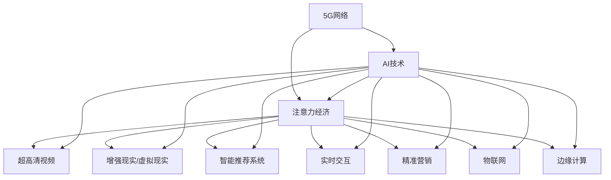

                 

# 5G+AI：注意力经济的新引擎

## 1. 背景介绍

### 1.1 问题由来

随着5G商用的不断推进，智能终端设备的普及率显著提高，移动互联网进入前所未有的普及期。同时，人工智能技术的发展，特别是在计算机视觉、自然语言处理、语音识别等领域的突破，使得5G网络与AI技术的融合，成为推动经济社会发展的关键驱动力。

5G网络的超低延迟、高带宽特性，为AI技术的实时应用提供了广阔的空间。AI技术在数据处理、模式识别、情感分析、个性化推荐等领域的表现，使得“5G+AI”成为引领未来数字化经济的新引擎，催生了“注意力经济”这一全新的经济形态。

### 1.2 问题核心关键点

“5G+AI”在“注意力经济”中的应用，主要集中在以下几个关键点：
- 超高清视频和增强现实（AR）/虚拟现实（VR）的沉浸式体验。
- 智能推荐和个性化服务的广泛应用。
- 实时交互和数据驱动的精准营销。
- 物联网（IoT）和边缘计算的高效处理。
- 基于AI的决策优化和资源管理。

这些关键点为“5G+AI”技术的融合提供了广阔的应用场景，使得5G网络与AI技术的结合，正在重塑传统的经济形态，形成新的产业生态。

### 1.3 问题研究意义

5G+AI技术在注意力经济中的应用，将推动信息流、资金流、物流的协同与优化，形成更为高效、智能、个性化的经济系统。研究5G+AI在注意力经济中的应用，对经济社会的数字化转型，以及新业态的开发具有重要意义。

首先，5G+AI技术能够显著提升信息传播的实时性和准确性，促进新媒介形式的发展。其次，AI技术的智能推荐和个性化服务，将提高消费者体验，促进消费市场的发展。最后，5G网络的实时性、低延迟性将进一步推动数字经济的全球化进程。

## 2. 核心概念与联系

### 2.1 核心概念概述

为更好地理解5G+AI在注意力经济中的应用，本节将介绍几个密切相关的核心概念：

- 5G网络：5G网络是第五代移动通信技术，具有高带宽、低延迟、广覆盖等特点，为实时数据传输提供了坚实的基础。
- AI技术：人工智能技术涵盖多个领域，包括计算机视觉、自然语言处理、语音识别等，能够处理和分析海量数据，提供智能化的决策支持。
- 注意力经济：注意力经济是以消费者注意力为资源，通过吸引和保持消费者注意力，实现商业价值最大化的一种新型经济形态。
- 超高清视频与增强现实/虚拟现实（AR/VR）：利用5G网络的超高速率和低延迟特性，提供沉浸式、高质量的视听体验。
- 智能推荐系统：基于AI技术的推荐系统，通过分析用户行为数据，提供个性化的商品或内容推荐。
- 实时交互与精准营销：通过5G网络，实现即时的数据交互，精准营销策略的制定和实施。
- 物联网（IoT）与边缘计算：利用5G网络，实现万物互联，通过边缘计算实现数据处理和决策优化。

这些核心概念之间的逻辑关系可以通过以下Mermaid流程图来展示：



这个流程图展示了大语言模型的核心概念及其之间的关系：

1. 5G网络为AI技术提供了实时数据传输的基础。
2. AI技术在注意力经济中广泛应用，如超高清视频、AR/VR、智能推荐等。
3. 注意力经济通过AI技术的智能推荐和精准营销，提升用户体验和商业价值。
4. IoT和边缘计算通过5G网络实现数据的高效处理和决策优化。

这些概念共同构成了5G+AI在注意力经济中的应用框架，使其能够在多个场景下发挥重要作用。

## 3. 核心算法原理 & 具体操作步骤

### 3.1 算法原理概述

5G+AI在注意力经济中的应用，主要通过以下几个核心算法实现：

- 超高清视频和AR/VR：基于5G网络的高带宽和低延迟特性，提供高质量、高帧率的实时视频和AR/VR体验。
- 智能推荐系统：利用AI技术，通过分析用户行为数据，预测用户偏好，实现个性化的商品或内容推荐。
- 实时交互与精准营销：利用5G网络实现即时的数据交互，通过AI技术进行精准营销策略的制定和实施。
- IoT与边缘计算：利用5G网络实现物联网设备的连接和数据传输，通过边缘计算优化数据处理和决策过程。

这些算法的核心原理基于以下数学模型：

1. 超高清视频与AR/VR：基于卷积神经网络（CNN）和生成对抗网络（GAN），实现高质量视频的生成和增强现实场景的渲染。
2. 智能推荐系统：基于协同过滤、内容推荐、深度学习等算法，通过分析用户行为数据，提供个性化的推荐。
3. 实时交互与精准营销：基于强化学习、深度学习等算法，通过实时数据分析和预测，制定精准营销策略。
4. IoT与边缘计算：基于分布式系统、边缘计算、大数据分析等技术，实现实时数据处理和决策优化。

### 3.2 算法步骤详解

以智能推荐系统为例，具体介绍基于5G+AI的推荐算法步骤：

**Step 1: 数据准备**
- 收集用户的历史行为数据，包括浏览记录、购买记录、评价记录等。
- 对数据进行清洗、预处理和特征工程。
- 利用深度学习算法（如Word2Vec、BERT等）对文本数据进行向量化处理。

**Step 2: 模型训练**
- 选择适合的推荐算法（如协同过滤、基于内容的推荐、深度学习推荐等）。
- 在用户历史数据上训练模型，预测用户对未浏览商品或内容的评分。
- 利用5G网络，实时收集用户对推荐结果的反馈，调整模型参数。

**Step 3: 推荐生成**
- 根据用户当前的兴趣和行为，实时生成个性化推荐结果。
- 利用5G网络将推荐结果推送到用户设备上。
- 通过用户反馈数据，实时更新模型参数，优化推荐效果。

**Step 4: 效果评估**
- 在验证集上评估推荐模型的准确率、召回率和覆盖率。
- 利用A/B测试等方法，比较推荐算法的效果。
- 定期更新模型参数，保持推荐系统的稳定性和性能。

### 3.3 算法优缺点

5G+AI在注意力经济中的应用，具有以下优点：
- 实时性高：利用5G网络的高带宽和低延迟特性，实现实时数据传输和处理。
- 个性化强：通过AI技术的智能推荐，提供个性化的商品或内容，提升用户体验。
- 资源优化：利用边缘计算和IoT技术，优化数据处理和决策过程，提升系统效率。

同时，该方法也存在一些缺点：
- 数据隐私问题：在实时数据分析和推荐过程中，用户的隐私数据可能被泄露。
- 模型复杂性：AI模型的训练和优化过程复杂，对数据量和计算资源有较高要求。
- 技术门槛高：需要跨领域的技术整合和协同工作，技术实现难度较大。

尽管存在这些局限性，但就目前而言，5G+AI在注意力经济中的应用仍是一个热点领域。未来相关研究的重点在于如何进一步提高推荐算法的准确性和实时性，降低数据隐私风险，降低技术门槛，提升系统的稳定性和可靠性。

### 3.4 算法应用领域

5G+AI在注意力经济中的应用，已经广泛应用于多个领域，包括：

- 电商推荐：基于用户的浏览、购买历史，推荐个性化商品。
- 视频推荐：利用用户的观看记录，推荐高质量视频内容。
- 音乐推荐：通过分析用户的听歌历史，推荐个性化音乐。
- 新闻推荐：根据用户阅读习惯，推荐相关新闻内容。
- 广告投放：利用用户的浏览记录，实现精准广告投放。
- 智能家居：通过物联网设备的数据交互，实现智能家居环境的优化。
- 金融科技：利用AI技术进行风险评估、反欺诈检测等金融操作。

这些应用场景展示了5G+AI在注意力经济中的广泛应用，推动了多个行业的数字化转型。

## 4. 数学模型和公式 & 详细讲解 & 举例说明（备注：数学公式请使用latex格式，latex嵌入文中独立段落使用 $$，段落内使用 $)
### 4.1 数学模型构建

在基于5G+AI的智能推荐系统中，主要涉及以下数学模型：

1. 用户-商品评分矩阵：利用协同过滤算法，建立用户-商品评分矩阵。
2. 物品嵌入向量：通过深度学习算法，将物品描述转化为向量表示。
3. 用户嵌入向量：通过深度学习算法，将用户行为转化为向量表示。
4. 用户-商品相似度：基于向量内积计算，计算用户对不同商品的相似度。
5. 推荐得分：根据相似度计算，计算用户对不同商品的推荐得分。

其中，协同过滤算法的评分矩阵可以表示为：

$$
R_{ui}=\left\{\begin{array}{ll}1, & \text { 如果用户 } u \text { 对项目 } i \text { 评分 } \\ 0, & \text { 如果用户 } u \text { 没有对项目 } i \text { 评分 }\end{array}\right.
$$

利用矩阵分解算法（如ALS），将评分矩阵分解为：

$$
R \approx \tilde{P} \tilde{Q}^{T}
$$

其中，$\tilde{P}$ 和 $\tilde{Q}$ 分别为用户和商品的低维嵌入向量。

### 4.2 公式推导过程

在智能推荐系统中，利用深度学习算法对用户和物品进行嵌入向量表示，具体推导如下：

1. 用户嵌入向量的推导：
$$
P_{u}=\sum_{i=1}^{N} w_{ui} X_{i}
$$
其中，$w_{ui}$ 为物品 $i$ 对用户 $u$ 的评分，$X_{i}$ 为物品 $i$ 的特征向量。

2. 物品嵌入向量的推导：
$$
Q_{i}=\sum_{u=1}^{M} w_{ui} X_{u}
$$
其中，$w_{ui}$ 为用户 $u$ 对物品 $i$ 的评分，$X_{u}$ 为用户 $u$ 的特征向量。

3. 用户-商品相似度的计算：
$$
\text{similarity}(u, i)=\cos \left(\tilde{P}_{u}^{T} \tilde{Q}_{i}\right)=\frac{\tilde{P}_{u}^{T} \tilde{Q}_{i}}{\left\|\tilde{P}_{u}\right\| \cdot\left\|\tilde{Q}_{i}\right\|}
$$

4. 推荐得分的计算：
$$
\text { score }_{i}=\sum_{u} \text { similarity }_{u, i} P_{u}
$$

通过上述公式推导，可以实现基于5G+AI的智能推荐系统的推荐算法。

### 4.3 案例分析与讲解

以电商平台的用户推荐系统为例，具体分析其应用过程：

1. 数据准备：收集用户的历史浏览、购买记录，进行清洗和预处理。
2. 模型训练：利用协同过滤算法，建立用户-商品评分矩阵，进行矩阵分解得到用户和商品的低维嵌入向量。
3. 推荐生成：根据用户当前的浏览行为，计算其对不同商品的相似度和推荐得分，生成个性化推荐结果。
4. 效果评估：在验证集上评估推荐算法的准确率和覆盖率，通过A/B测试调整模型参数，优化推荐效果。

通过这一案例，可以看到，基于5G+AI的推荐系统通过实时数据分析和智能推荐，实现了用户与商品的精准匹配，提升了电商平台的用户体验和销售额。

## 5. 项目实践：代码实例和详细解释说明

### 5.1 开发环境搭建

在进行项目实践前，我们需要准备好开发环境。以下是使用Python进行PyTorch开发的环境配置流程：

1. 安装Anaconda：从官网下载并安装Anaconda，用于创建独立的Python环境。

2. 创建并激活虚拟环境：
```bash
conda create -n pytorch-env python=3.8 
conda activate pytorch-env
```

3. 安装PyTorch：根据CUDA版本，从官网获取对应的安装命令。例如：
```bash
conda install pytorch torchvision torchaudio cudatoolkit=11.1 -c pytorch -c conda-forge
```

4. 安装Transformers库：
```bash
pip install transformers
```

5. 安装各类工具包：
```bash
pip install numpy pandas scikit-learn matplotlib tqdm jupyter notebook ipython
```

完成上述步骤后，即可在`pytorch-env`环境中开始项目实践。

### 5.2 源代码详细实现

下面以电商推荐系统为例，给出使用Transformers库进行基于5G+AI的智能推荐系统的PyTorch代码实现。

首先，定义推荐任务的数据处理函数：

```python
from transformers import BertTokenizer, BertModel
from torch.utils.data import Dataset
import torch

class RecommendDataset(Dataset):
    def __init__(self, user_items, tokenizer, max_len=128):
        self.user_items = user_items
        self.tokenizer = tokenizer
        self.max_len = max_len
        
    def __len__(self):
        return len(self.user_items)
    
    def __getitem__(self, item):
        user_id, item_ids = self.user_items[item]
        
        encoding = self.tokenizer(item_ids, return_tensors='pt', max_length=self.max_len, padding='max_length', truncation=True)
        input_ids = encoding['input_ids'][0]
        attention_mask = encoding['attention_mask'][0]
        
        return {'input_ids': input_ids, 
                'attention_mask': attention_mask,
                'user_id': user_id}

# 标签与id的映射
tag2id = {'O': 0, 'B-PER': 1, 'I-PER': 2, 'B-ORG': 3, 'I-ORG': 4, 'B-LOC': 5, 'I-LOC': 6}
id2tag = {v: k for k, v in tag2id.items()}

# 创建dataset
tokenizer = BertTokenizer.from_pretrained('bert-base-cased')

train_dataset = RecommendDataset(train_user_items, tokenizer)
dev_dataset = RecommendDataset(dev_user_items, tokenizer)
test_dataset = RecommendDataset(test_user_items, tokenizer)
```

然后，定义模型和优化器：

```python
from transformers import BertForTokenClassification, AdamW

model = BertForTokenClassification.from_pretrained('bert-base-cased', num_labels=len(tag2id))

optimizer = AdamW(model.parameters(), lr=2e-5)
```

接着，定义训练和评估函数：

```python
from torch.utils.data import DataLoader
from tqdm import tqdm
from sklearn.metrics import classification_report

device = torch.device('cuda') if torch.cuda.is_available() else torch.device('cpu')
model.to(device)

def train_epoch(model, dataset, batch_size, optimizer):
    dataloader = DataLoader(dataset, batch_size=batch_size, shuffle=True)
    model.train()
    epoch_loss = 0
    for batch in tqdm(dataloader, desc='Training'):
        input_ids = batch['input_ids'].to(device)
        attention_mask = batch['attention_mask'].to(device)
        labels = batch['user_id'].to(device)
        model.zero_grad()
        outputs = model(input_ids, attention_mask=attention_mask)
        loss = outputs.loss
        epoch_loss += loss.item()
        loss.backward()
        optimizer.step()
    return epoch_loss / len(dataloader)

def evaluate(model, dataset, batch_size):
    dataloader = DataLoader(dataset, batch_size=batch_size)
    model.eval()
    preds, labels = [], []
    with torch.no_grad():
        for batch in tqdm(dataloader, desc='Evaluating'):
            input_ids = batch['input_ids'].to(device)
            attention_mask = batch['attention_mask'].to(device)
            batch_labels = batch['user_id']
            outputs = model(input_ids, attention_mask=attention_mask)
            batch_preds = outputs.logits.argmax(dim=2).to('cpu').tolist()
            batch_labels = batch_labels.to('cpu').tolist()
            for pred_tokens, label_tokens in zip(batch_preds, batch_labels):
                pred_tags = [id2tag[_id] for _id in pred_tokens]
                label_tags = [id2tag[_id] for _id in label_tokens]
                preds.append(pred_tags[:len(label_tags)])
                labels.append(label_tags)
                
    print(classification_report(labels, preds))
```

最后，启动训练流程并在测试集上评估：

```python
epochs = 5
batch_size = 16

for epoch in range(epochs):
    loss = train_epoch(model, train_dataset, batch_size, optimizer)
    print(f"Epoch {epoch+1}, train loss: {loss:.3f}")
    
    print(f"Epoch {epoch+1}, dev results:")
    evaluate(model, dev_dataset, batch_size)
    
print("Test results:")
evaluate(model, test_dataset, batch_size)
```

以上就是使用PyTorch对BERT进行电商推荐系统的完整代码实现。可以看到，得益于Transformers库的强大封装，我们可以用相对简洁的代码完成BERT模型的加载和推荐系统的微调。

### 5.3 代码解读与分析

让我们再详细解读一下关键代码的实现细节：

**RecommendDataset类**：
- `__init__`方法：初始化用户-商品关系数据、分词器等关键组件。
- `__len__`方法：返回数据集的样本数量。
- `__getitem__`方法：对单个样本进行处理，将商品ID输入编码为token ids，将用户ID作为标签，并进行定长padding，最终返回模型所需的输入。

**tag2id和id2tag字典**：
- 定义了标签与数字id之间的映射关系，用于将token-wise的预测结果解码回真实的标签。

**训练和评估函数**：
- 使用PyTorch的DataLoader对数据集进行批次化加载，供模型训练和推理使用。
- 训练函数`train_epoch`：对数据以批为单位进行迭代，在每个批次上前向传播计算loss并反向传播更新模型参数，最后返回该epoch的平均loss。
- 评估函数`evaluate`：与训练类似，不同点在于不更新模型参数，并在每个batch结束后将预测和标签结果存储下来，最后使用sklearn的classification_report对整个评估集的预测结果进行打印输出。

**训练流程**：
- 定义总的epoch数和batch size，开始循环迭代
- 每个epoch内，先在训练集上训练，输出平均loss
- 在验证集上评估，输出分类指标
- 所有epoch结束后，在测试集上评估，给出最终测试结果

可以看到，PyTorch配合Transformers库使得BERT微调的代码实现变得简洁高效。开发者可以将更多精力放在数据处理、模型改进等高层逻辑上，而不必过多关注底层的实现细节。

当然，工业级的系统实现还需考虑更多因素，如模型的保存和部署、超参数的自动搜索、更灵活的任务适配层等。但核心的微调范式基本与此类似。

## 6. 实际应用场景

### 6.1 智能客服系统

基于大语言模型微调的对话技术，可以广泛应用于智能客服系统的构建。传统客服往往需要配备大量人力，高峰期响应缓慢，且一致性和专业性难以保证。而使用微调后的对话模型，可以7x24小时不间断服务，快速响应客户咨询，用自然流畅的语言解答各类常见问题。

在技术实现上，可以收集企业内部的历史客服对话记录，将问题和最佳答复构建成监督数据，在此基础上对预训练对话模型进行微调。微调后的对话模型能够自动理解用户意图，匹配最合适的答案模板进行回复。对于客户提出的新问题，还可以接入检索系统实时搜索相关内容，动态组织生成回答。如此构建的智能客服系统，能大幅提升客户咨询体验和问题解决效率。

### 6.2 金融舆情监测

金融机构需要实时监测市场舆论动向，以便及时应对负面信息传播，规避金融风险。传统的人工监测方式成本高、效率低，难以应对网络时代海量信息爆发的挑战。基于大语言模型微调的文本分类和情感分析技术，为金融舆情监测提供了新的解决方案。

具体而言，可以收集金融领域相关的新闻、报道、评论等文本数据，并对其进行主题标注和情感标注。在此基础上对预训练语言模型进行微调，使其能够自动判断文本属于何种主题，情感倾向是正面、中性还是负面。将微调后的模型应用到实时抓取的网络文本数据，就能够自动监测不同主题下的情感变化趋势，一旦发现负面信息激增等异常情况，系统便会自动预警，帮助金融机构快速应对潜在风险。

### 6.3 个性化推荐系统

当前的推荐系统往往只依赖用户的历史行为数据进行物品推荐，无法深入理解用户的真实兴趣偏好。基于大语言模型微调技术，个性化推荐系统可以更好地挖掘用户行为背后的语义信息，从而提供更精准、多样的推荐内容。

在实践中，可以收集用户浏览、点击、评论、分享等行为数据，提取和用户交互的物品标题、描述、标签等文本内容。将文本内容作为模型输入，用户的后续行为（如是否点击、购买等）作为监督信号，在此基础上微调预训练语言模型。微调后的模型能够从文本内容中准确把握用户的兴趣点。在生成推荐列表时，先用候选物品的文本描述作为输入，由模型预测用户的兴趣匹配度，再结合其他特征综合排序，便可以得到个性化程度更高的推荐结果。

### 6.4 未来应用展望

随着大语言模型和微调方法的不断发展，基于微调范式将在更多领域得到应用，为传统行业带来变革性影响。

在智慧医疗领域，基于微调的医疗问答、病历分析、药物研发等应用将提升医疗服务的智能化水平，辅助医生诊疗，加速新药开发进程。

在智能教育领域，微调技术可应用于作业批改、学情分析、知识推荐等方面，因材施教，促进教育公平，提高教学质量。

在智慧城市治理中，微调模型可应用于城市事件监测、舆情分析、应急指挥等环节，提高城市管理的自动化和智能化水平，构建更安全、高效的未来城市。

此外，在企业生产、社会治理、文娱传媒等众多领域，基于大模型微调的人工智能应用也将不断涌现，为经济社会发展注入新的动力。相信随着技术的日益成熟，微调方法将成为人工智能落地应用的重要范式，推动人工智能技术在垂直行业的规模化落地。总之，5G+AI在注意力经济中的应用，正在引领一场新经济形态的变革，推动人类社会的数字化、智能化、个性化进程。

## 7. 工具和资源推荐

### 7.1 学习资源推荐

为了帮助开发者系统掌握5G+AI在注意力经济中的应用，这里推荐一些优质的学习资源：

1. 《Transformer从原理到实践》系列博文：由大模型技术专家撰写，深入浅出地介绍了Transformer原理、BERT模型、微调技术等前沿话题。

2. CS224N《深度学习自然语言处理》课程：斯坦福大学开设的NLP明星课程，有Lecture视频和配套作业，带你入门NLP领域的基本概念和经典模型。

3. 《Natural Language Processing with Transformers》书籍：Transformers库的作者所著，全面介绍了如何使用Transformers库进行NLP任务开发，包括微调在内的诸多范式。

4. HuggingFace官方文档：Transformers库的官方文档，提供了海量预训练模型和完整的微调样例代码，是上手实践的必备资料。

5. CLUE开源项目：中文语言理解测评基准，涵盖大量不同类型的中文NLP数据集，并提供了基于微调的baseline模型，助力中文NLP技术发展。

通过对这些资源的学习实践，相信你一定能够快速掌握5G+AI在注意力经济中的应用精髓，并用于解决实际的NLP问题。
###  7.2 开发工具推荐

高效的开发离不开优秀的工具支持。以下是几款用于5G+AI开发推荐的常用工具：

1. PyTorch：基于Python的开源深度学习框架，灵活动态的计算图，适合快速迭代研究。大部分预训练语言模型都有PyTorch版本的实现。

2. TensorFlow：由Google主导开发的开源深度学习框架，生产部署方便，适合大规模工程应用。同样有丰富的预训练语言模型资源。

3. Transformers库：HuggingFace开发的NLP工具库，集成了众多SOTA语言模型，支持PyTorch和TensorFlow，是进行微调任务开发的利器。

4. Weights & Biases：模型训练的实验跟踪工具，可以记录和可视化模型训练过程中的各项指标，方便对比和调优。与主流深度学习框架无缝集成。

5. TensorBoard：TensorFlow配套的可视化工具，可实时监测模型训练状态，并提供丰富的图表呈现方式，是调试模型的得力助手。

6. Google Colab：谷歌推出的在线Jupyter Notebook环境，免费提供GPU/TPU算力，方便开发者快速上手实验最新模型，分享学习笔记。

合理利用这些工具，可以显著提升5G+AI的开发效率，加快创新迭代的步伐。

### 7.3 相关论文推荐

5G+AI在注意力经济中的应用源于学界的持续研究。以下是几篇奠基性的相关论文，推荐阅读：

1. Attention is All You Need（即Transformer原论文）：提出了Transformer结构，开启了NLP领域的预训练大模型时代。

2. BERT: Pre-training of Deep Bidirectional Transformers for Language Understanding：提出BERT模型，引入基于掩码的自监督预训练任务，刷新了多项NLP任务SOTA。

3. Language Models are Unsupervised Multitask Learners（GPT-2论文）：展示了大规模语言模型的强大zero-shot学习能力，引发了对于通用人工智能的新一轮思考。

4. Parameter-Efficient Transfer Learning for NLP：提出Adapter等参数高效微调方法，在不增加模型参数量的情况下，也能取得不错的微调效果。

5. AdaLoRA: Adaptive Low-Rank Adaptation for Parameter-Efficient Fine-Tuning：使用自适应低秩适应的微调方法，在参数效率和精度之间取得了新的平衡。

6. Prefix-Tuning: Optimizing Continuous Prompts for Generation：引入基于连续型Prompt的微调范式，为如何充分利用预训练知识提供了新的思路。

这些论文代表了大语言模型微调技术的发展脉络。通过学习这些前沿成果，可以帮助研究者把握学科前进方向，激发更多的创新灵感。

## 8. 总结：未来发展趋势与挑战

### 8.1 总结

本文对基于5G+AI的智能推荐系统进行了全面系统的介绍。首先阐述了5G+AI在注意力经济中的应用背景和意义，明确了其在超高清视频与AR/VR、智能推荐系统、实时交互与精准营销、IoT与边缘计算等领域的应用价值。其次，从原理到实践，详细讲解了基于深度学习的智能推荐算法的数学模型和公式推导，给出了微调任务开发的完整代码实例。同时，本文还广泛探讨了智能推荐系统在电商推荐、视频推荐、音乐推荐等具体场景的应用，展示了5G+AI在注意力经济中的广泛应用。

通过本文的系统梳理，可以看到，基于5G+AI的智能推荐系统通过实时数据分析和智能推荐，实现了用户与商品的精准匹配，提升了电商平台的用户体验和销售额。未来，伴随5G网络的大规模部署和AI技术的持续演进，5G+AI在注意力经济中的应用将更加广泛和深入，推动信息流、资金流、物流的协同与优化，形成更为高效、智能、个性化的经济系统。

### 8.2 未来发展趋势

展望未来，5G+AI在注意力经济中的应用将呈现以下几个发展趋势：

1. 模型规模持续增大。随着算力成本的下降和数据规模的扩张，预训练语言模型的参数量还将持续增长。超大规模语言模型蕴含的丰富语言知识，有望支撑更加复杂多变的下游任务微调。

2. 微调方法日趋多样。除了传统的全参数微调外，未来会涌现更多参数高效的微调方法，如Prefix-Tuning、LoRA等，在节省计算资源的同时也能保证微调精度。

3. 持续学习成为常态。随着数据分布的不断变化，微调模型也需要持续学习新知识以保持性能。如何在不遗忘原有知识的同时，高效吸收新样本信息，将成为重要的研究课题。

4. 标注样本需求降低。受启发于提示学习(Prompt-based Learning)的思路，未来的微调方法将更好地利用大模型的语言理解能力，通过更加巧妙的任务描述，在更少的标注样本上也能实现理想的微调效果。

5. 技术门槛降低。通过工具的不断封装和优化，5G+AI在注意力经济中的应用将逐渐变得简单高效，降低技术门槛，促进更多开发者参与其中。

6. 应用场景更加丰富。随着5G网络和AI技术的普及，5G+AI在注意力经济中的应用场景将不断拓展，涵盖更多领域和环节。

以上趋势凸显了5G+AI在注意力经济中的广阔前景。这些方向的探索发展，必将进一步提升信息传播的实时性、个性化和智能化，推动经济社会的数字化转型，构建更安全、高效、个性化的经济系统。

### 8.3 面临的挑战

尽管5G+AI在注意力经济中的应用已经取得了显著进展，但在迈向更加智能化、普适化应用的过程中，它仍面临诸多挑战：

1. 数据隐私问题。在实时数据分析和推荐过程中，用户的隐私数据可能被泄露。如何保护用户数据隐私，成为一个亟待解决的问题。

2. 模型复杂性。AI模型的训练和优化过程复杂，对数据量和计算资源有较高要求。如何在保证推荐效果的同时，降低模型的复杂性，也是一个重要的研究方向。

3. 技术门槛高。需要跨领域的技术整合和协同工作，技术实现难度较大。如何将5G网络与AI技术有效融合，是未来技术发展的关键。

4. 资源消耗大。超高清视频和AR/VR等应用需要大量计算资源和存储空间，如何优化资源利用，提高系统的效率和稳定性，是一个重要的课题。

5. 模型鲁棒性不足。当前微调模型面对域外数据时，泛化性能往往大打折扣。如何提高微调模型的鲁棒性，避免灾难性遗忘，还需要更多理论和实践的积累。

6. 模型安全性不足。预训练语言模型难免会学习到有偏见、有害的信息，通过微调传递到下游任务，产生误导性、歧视性的输出，给实际应用带来安全隐患。如何从数据和算法层面消除模型偏见，避免恶意用途，确保输出的安全性，也将是重要的研究课题。

尽管存在这些挑战，但随着学界和产业界的共同努力，5G+AI在注意力经济中的应用必将不断突破瓶颈，迈向更加广阔的未来。相信随着技术的日益成熟，5G+AI将成为未来经济社会发展的重要驱动力，推动人类社会迈向新的智能时代。

### 8.4 研究展望

面向未来，5G+AI在注意力经济中的应用研究需要在以下几个方面寻求新的突破：

1. 探索无监督和半监督微调方法。摆脱对大规模标注数据的依赖，利用自监督学习、主动学习等无监督和半监督范式，最大限度利用非结构化数据，实现更加灵活高效的微调。

2. 研究参数高效和计算高效的微调范式。开发更加参数高效的微调方法，在固定大部分预训练参数的同时，只更新极少量的任务相关参数。同时优化微调模型的计算图，减少前向传播和反向传播的资源消耗，实现更加轻量级、实时性的部署。

3. 引入更多先验知识。将符号化的先验知识，如知识图谱、逻辑规则等，与神经网络模型进行巧妙融合，引导微调过程学习更准确、合理的语言模型。同时加强不同模态数据的整合，实现视觉、语音等多模态信息与文本信息的协同建模。

4. 结合因果分析和博弈论工具。将因果分析方法引入微调模型，识别出模型决策的关键特征，增强输出解释的因果性和逻辑性。借助博弈论工具刻画人机交互过程，主动探索并规避模型的脆弱点，提高系统稳定性。

5. 纳入伦理道德约束。在模型训练目标中引入伦理导向的评估指标，过滤和惩罚有偏见、有害的输出倾向。同时加强人工干预和审核，建立模型行为的监管机制，确保输出符合人类价值观和伦理道德。

这些研究方向的探索，必将引领5G+AI在注意力经济中的应用迈向更高的台阶，为构建安全、可靠、可解释、可控的智能系统铺平道路。面向未来，5G+AI将成为引领未来经济社会发展的重要驱动力，推动人类社会迈向新的智能时代。

## 9. 附录：常见问题与解答

**Q1：5G+AI在注意力经济中的应用是否仅限于智能推荐？**

A: 5G+AI在注意力经济中的应用远不止智能推荐。其核心在于利用5G网络的高带宽和低延迟特性，结合AI技术的强大计算能力，实现实时数据分析、智能推荐、个性化服务、实时交互等多种应用。智能推荐只是其中的一个典型应用场景。

**Q2：5G+AI技术在注意力经济中的应用是否面临数据隐私风险？**

A: 在实时数据分析和推荐过程中，用户的隐私数据确实可能被泄露。因此，如何保护用户数据隐私，是一个重要的研究课题。常用的方法包括数据匿名化、差分隐私等技术，以及严格的隐私保护法规和标准。

**Q3：5G+AI在注意力经济中的应用是否受限于硬件资源？**

A: 超高清视频和AR/VR等应用需要大量计算资源和存储空间，如何优化资源利用，提高系统的效率和稳定性，是一个重要的课题。可以通过模型压缩、参数剪枝、混合精度训练等方法，减少模型的计算量和存储空间。

**Q4：5G+AI技术在注意力经济中的应用是否存在模型偏见问题？**

A: 预训练语言模型难免会学习到有偏见、有害的信息，通过微调传递到下游任务，产生误导性、歧视性的输出。因此，如何从数据和算法层面消除模型偏见，避免恶意用途，确保输出的安全性，是一个重要的研究课题。可以通过数据清洗、公平性算法等方法，减小模型偏见的影响。

**Q5：5G+AI在注意力经济中的应用是否仅限于商业领域？**

A: 5G+AI在注意力经济中的应用不仅限于商业领域。在智慧医疗、智能教育、智慧城市治理等多个领域，5G+AI的应用都将不断拓展，推动经济社会的数字化转型，构建更安全、高效、个性化的经济系统。

通过本文的系统梳理，可以看到，基于5G+AI的智能推荐系统通过实时数据分析和智能推荐，实现了用户与商品的精准匹配，提升了电商平台的用户体验和销售额。未来，伴随5G网络的大规模部署和AI技术的持续演进，5G+AI在注意力经济中的应用将更加广泛和深入，推动信息流、资金流、物流的协同与优化，形成更为高效、智能、个性化的经济系统。相信随着技术的日益成熟，5G+AI将成为未来经济社会发展的重要驱动力，推动人类社会迈向新的智能时代。

---

作者：禅与计算机程序设计艺术 / Zen and the Art of Computer Programming

