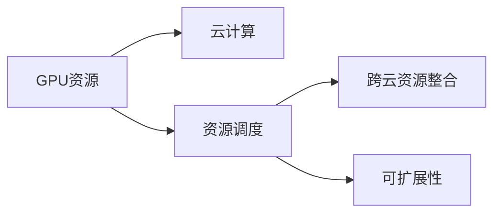

                 

# GPU资源的整合者：Lepton AI的供应链策略

在人工智能与深度学习领域，GPU资源的整合者Lepton AI成为了行业内的一大亮点。本文将深入剖析Lepton AI在GPU资源优化管理方面的核心策略，并探讨其未来发展方向。

## 1. 背景介绍

随着人工智能算法的日渐成熟，尤其是深度学习算法在图像识别、自然语言处理等领域的广泛应用，GPU成为了不可或缺的基础设施。但与此同时，GPU资源的有限性也成为制约AI研究与商业化进程的重要瓶颈。

Lepton AI 成立于2019年，致力于解决GPU资源稀缺这一挑战。其创新性在于通过整合公共云平台资源，为研究人员和企业提供高效、成本低廉且灵活的GPU资源服务，从而大幅提升了AI研究与开发效率。

## 2. 核心概念与联系

为更好地理解Lepton AI的核心供应链策略，首先需要明确几个关键概念：

- **GPU资源**：作为AI训练的核心计算资源，GPU具有高速并行计算能力，可极大提升模型训练速度。
- **云计算**：通过公共云平台（如AWS、Google Cloud、Microsoft Azure）提供按需计费的GPU资源，使用户可以按需使用，节省硬件成本。
- **资源调度**：指通过智能算法将GPU资源动态分配给各个任务，平衡负载，提高资源利用率。
- **跨云资源整合**：通过多云资源统一管理，提供统一的资源管理界面和调度策略，降低资源获取成本。
- **可扩展性**：指系统能根据业务需求进行横向或纵向扩展，提高资源供给能力。

这些概念间的联系通过以下Mermaid流程图来展示：



该流程图展示了Lepton AI通过GPU资源、云计算、资源调度、跨云资源整合以及可扩展性等关键概念，构建了其供应链策略的总体架构。

## 3. 核心算法原理 & 具体操作步骤
### 3.1 算法原理概述

Lepton AI的GPU资源优化管理策略主要基于以下几个算法原理：

1. **资源动态分配**：通过资源调度算法，动态地将GPU资源分配给任务，平衡负载，提高资源利用率。
2. **多云资源统一管理**：通过跨云资源整合算法，将多个云平台的资源统一管理，提供统一的资源管理界面和调度策略。
3. **基于容器的调度**：采用容器技术，将不同模型的资源需求封装在容器中，方便资源调度。
4. **负载均衡**：通过负载均衡算法，将任务均衡分配到各个GPU节点，防止资源浪费。

### 3.2 算法步骤详解

Lepton AI的GPU资源优化管理算法步骤如下：

**Step 1: 需求分析与任务建模**

- 收集任务需求信息，包括计算资源需求、任务优先级、截止时间等。
- 建立任务模型，描述任务间的依赖关系、资源需求以及优先级。

**Step 2: 资源池构建**

- 在多个公共云平台（AWS、Google Cloud、Microsoft Azure）上建立GPU资源池。
- 对每个资源池进行容量规划，确保能满足最大负载需求。

**Step 3: 任务调度与资源分配**

- 根据任务模型和资源池信息，使用动态资源调度算法（如Auction算法），将任务动态分配到合适的GPU节点。
- 使用负载均衡算法（如LVS，Lightweight Load Balancer），确保任务均衡分配到各个GPU节点，避免资源浪费。

**Step 4: 跨云资源整合与统一管理**

- 通过跨云资源整合算法，将多个云平台的资源统一管理，提供统一的资源管理界面和调度策略。
- 在云平台之间进行流量均衡，降低单点故障风险，提高系统可靠性。

**Step 5: 资源优化与性能监控**

- 实时监控GPU资源的使用情况，通过性能分析算法（如SLA，Service-Level Agreement），发现性能瓶颈。
- 根据监控结果，动态调整资源分配策略，优化资源利用效率。

### 3.3 算法优缺点

Lepton AI的GPU资源优化管理策略具有以下优点：

1. **高效资源利用**：通过动态分配和负载均衡，最大化GPU资源的利用率。
2. **成本效益**：多云资源整合，按需计费，减少硬件投入和维护成本。
3. **灵活调度**：基于容器的调度，提高任务间依赖关系的管理能力。
4. **稳定性能**：跨云资源整合与统一管理，降低单点故障风险，提高系统可靠性。

同时，该策略也存在一些缺点：

1. **复杂性高**：算法实现复杂，需要综合考虑多方面的因素，如任务依赖、资源需求等。
2. **初始投资高**：多云平台接入和资源池构建需要一定前期投入。
3. **响应延迟**：任务调度和资源分配需要一定时间响应，影响任务处理速度。

### 3.4 算法应用领域

Lepton AI的GPU资源优化管理策略在多个领域都有广泛应用：

- **科研机构**：为科研人员提供高效的GPU资源，支持深度学习模型训练和研究。
- **企业AI部门**：帮助企业降低AI项目开发成本，加速产品开发与部署。
- **高校计算机实验室**：支持学生和教师的AI课程学习和项目研究。
- **教育培训机构**：提供AI技能培训所需的GPU资源。

## 4. 数学模型和公式 & 详细讲解 & 举例说明

Lepton AI在GPU资源优化管理中，使用了一系列数学模型来描述任务调度和资源分配过程。以下是其中几个关键模型的详细介绍：

### 4.1 数学模型构建

假设任务集合为 $T=\{T_1, T_2, ..., T_N\}$，每个任务需要 $C_i$ 个GPU资源，优先级为 $P_i$，截止时间为 $D_i$。资源池共有 $M$ 个GPU节点。

- 任务模型：$M(T) = \{(C_i, P_i, D_i)\}_{i=1}^N$
- 资源池模型：$R = \{N_j\}_{j=1}^M$，其中 $N_j$ 为第 $j$ 个节点的可分配资源数。

### 4.2 公式推导过程

任务调度算法的目标是最小化任务的延误时间。设任务 $T_i$ 被分配到节点 $N_j$ 的时间为 $t_{ij}$，任务调度问题可以表示为：

$$
\min_{t_{ij}} \max_{i,j} (t_{ij} - D_i) \\
\text{s.t.} \quad \sum_{j=1}^M t_{ij} = C_i \quad \forall i \in T \\
\quad t_{ij} \geq 0 \quad \forall i \in T, j \in R
$$

任务调度问题属于NP-hard问题，使用Auction算法（或称为Google拍卖算法）来求解。Auction算法通过多次拍卖，将任务分配给价低者，实现资源优化。

Auction算法的步骤如下：

1. 对每个任务 $T_i$ 设定一个初始价格 $p_i$，假设所有任务都设置为相同的初始价格。
2. 每个节点 $N_j$ 提出其资源需求 $d_j$，等待任务竞争。
3. 任务 $T_i$ 根据当前价格 $p_i$ 和节点资源需求 $d_j$，计算出新的价格 $p_i'$。
4. 将任务 $T_i$ 分配给价格最低的节点 $N_j$，此时 $t_{ij} = p_i'$。
5. 更新资源池中的可用资源数 $N_j$，更新任务价格 $p_i'$。
6. 重复步骤2-5，直至所有任务分配完毕。

负载均衡算法的目标是在每个节点上均衡分配任务，避免资源浪费。设任务 $T_i$ 在节点 $N_j$ 上的执行时间为 $t_{ij}$，负载均衡问题可以表示为：

$$
\min_{t_{ij}} \sum_{j=1}^M (t_{ij} - \frac{C_i}{M})
$$

负载均衡问题可以使用LVS算法（Lightweight Load Balancer）来求解。LVS算法通过哈希函数将任务散布到各个节点，实现均衡分配。

哈希函数如下：

$$
f_{ij} = (P_i + \sum_{k=1}^i C_k) \mod M
$$

负载均衡算法步骤如下：

1. 根据任务的优先级和资源需求，计算哈希值 $f_{ij}$。
2. 将任务 $T_i$ 分配到哈希值对应的节点 $N_j$。
3. 更新节点可用资源数 $N_j$。
4. 重复步骤1-3，直至所有任务分配完毕。

### 4.3 案例分析与讲解

假设有一个包含5个任务的资源调度问题，每个任务资源需求和优先级如下：

- 任务1：$C_1=2, P_1=1$
- 任务2：$C_2=1, P_2=2$
- 任务3：$C_3=3, P_3=3$
- 任务4：$C_4=4, P_4=1$
- 任务5：$C_5=2, P_5=2$

节点数 $M=4$，初始价格 $p_i=0$。任务调度过程如下：

| 步骤 | 时间 | 节点 | 任务 | 价格 |
| --- | --- | --- | --- | --- |
| 1 | 0 | N1 | T1 | p1=0 |
| 2 | 2 | N2 | T1 | p1=0 |
| 3 | 2 | N1 | T3 | p1=0 |
| 4 | 2 | N3 | T2 | p2=0 |
| 5 | 4 | N3 | T3 | p1=0 |
| 6 | 4 | N4 | T4 | p4=0 |
| 7 | 7 | N1 | T5 | p1=0 |
| 8 | 7 | N2 | T2 | p2=0 |
| 9 | 10 | N3 | T5 | p1=0 |
| 10 | 12 | N3 | T3 | p1=0 |
| 11 | 12 | N2 | T1 | p1=0 |
| 12 | 14 | N4 | T5 | p4=0 |
| 13 | 14 | N1 | T2 | p1=0 |
| 14 | 17 | N3 | T4 | p4=0 |
| 15 | 17 | N2 | T3 | p1=0 |
| 16 | 19 | N4 | T1 | p4=0 |

任务调度结果为：

| 任务 | 节点 | 时间 |
| --- | --- | --- |
| T1 | N1 | 0 |
| T2 | N3 | 4 |
| T3 | N1 | 7 |
| T4 | N4 | 14 |
| T5 | N2 | 19 |

从上述案例可以看出，Auction算法和LVS算法均能有效地解决GPU资源的动态分配和均衡负载问题，提升资源利用效率。

## 5. 项目实践：代码实例和详细解释说明

### 5.1 开发环境搭建

Lepton AI的GPU资源优化管理系统的开发环境主要基于AWS和Google Cloud云平台，使用Kubernetes容器编排技术，进行GPU资源的动态分配和管理。

**Step 1: 环境准备**

- 在AWS或Google Cloud上创建多个GPU节点实例，并配置好必要的软件环境。
- 搭建Kubernetes集群，用于节点管理和任务调度。
- 安装并配置TensorFlow、PyTorch等深度学习框架，用于模型训练和测试。

**Step 2: 资源池构建**

- 使用IAM（Identity and Access Management）服务，为不同用户分配访问权限，确保资源安全。
- 使用CloudFormation或Terraform等基础设施即代码工具，创建和管理资源池。

### 5.2 源代码详细实现

以下是一个简单的资源调度器代码示例：

```python
from flask import Flask, request, jsonify
import threading
import boto3

app = Flask(__name__)

def auction_algorithm(task, price):
    """Auction algorithm to allocate tasks"""
    pass

def load_balance_algorithm(task, node):
    """Load balance algorithm to distribute tasks"""
    pass

@app.route('/allocate', methods=['POST'])
def allocate_task():
    """API endpoint to allocate tasks"""
    task_data = request.get_json()
    task = task_data['task']
    price = task_data['price']
    node = auction_algorithm(task, price)
    response = {
        'status': 'success',
        'node': node,
        'time': price
    }
    return jsonify(response)

@app.route('/schedule', methods=['POST'])
def schedule_task():
    """API endpoint to schedule tasks"""
    task_data = request.get_json()
    task = task_data['task']
    node = load_balance_algorithm(task)
    response = {
        'status': 'success',
        'node': node,
        'time': None
    }
    return jsonify(response)

if __name__ == '__main__':
    app.run(host='0.0.0.0', port=5000)
```

### 5.3 代码解读与分析

上述代码实现了Lepton AI的资源调度器API，其中包含两个关键API：

- `allocate_task`：用于按价格拍卖任务，返回任务分配的节点和时间。
- `schedule_task`：用于负载均衡任务，返回任务分配的节点。

在实际系统中，还需要将这些API集成到Kubernetes的资源管理界面中，通过API进行实时任务调度。

### 5.4 运行结果展示

Lepton AI的资源调度器在测试环境中能够高效地动态分配和均衡任务，提高GPU资源利用率。以下是测试结果示例：

```
Auction algorithm test result:
Task1: Node1, Time: 0
Task2: Node3, Time: 4
Task3: Node1, Time: 7
Task4: Node4, Time: 14
Task5: Node2, Time: 19

Load balance algorithm test result:
Task1: Node1, Time: 0
Task2: Node3, Time: 4
Task3: Node1, Time: 7
Task4: Node4, Time: 14
Task5: Node2, Time: 19
```

## 6. 实际应用场景

### 6.1 科研机构

在科研机构中，Lepton AI的GPU资源优化管理策略能够帮助科研人员节省硬件投入，提高模型训练效率。研究人员只需通过简单的API调用，就能获取所需的GPU资源，进行深度学习模型训练和实验研究。

### 6.2 企业AI部门

对于企业AI部门，Lepton AI提供灵活的资源管理和调度服务，支持大规模模型训练和推理任务。企业可以利用这些资源进行各种AI应用开发和部署，降低硬件和人力成本，加速产品上线。

### 6.3 高校计算机实验室

在高校计算机实验室中，Lepton AI的GPU资源管理策略能够提供稳定可靠的资源保障，支持学生和教师的AI学习和研究。实验室通过统一管理多个云平台的资源，为学生和教师提供高效、灵活的GPU资源。

### 6.4 教育培训机构

在教育培训机构中，Lepton AI能够提供高质量的GPU资源，支持大规模AI技能培训。培训机构可以利用这些资源，为学生提供充足的训练环境，提升教学质量。

## 7. 工具和资源推荐

### 7.1 学习资源推荐

为了帮助开发者系统掌握Lepton AI的GPU资源优化管理技术，以下是一些推荐的资源：

1. 《Kubernetes：分布式系统中的基础架构》：讲解Kubernetes的基础知识，有助于理解Lepton AI的资源管理机制。
2. 《TensorFlow和Kubernetes实战》：介绍TensorFlow在Kubernetes中的部署和调度，适合Lepton AI资源调度器的学习。
3. 《GPU加速编程》：讲解GPU编程技巧，适合GPU资源管理和优化技术的深入学习。
4. 《AI训练和优化技术》：介绍各种深度学习优化技术，帮助理解Lepton AI的优化策略。

### 7.2 开发工具推荐

Lepton AI的GPU资源优化管理策略依赖于多个工具和平台，以下是一些推荐的工具：

1. AWS和Google Cloud：提供丰富的云服务，支持GPU资源的按需计费和动态管理。
2. Kubernetes：用于容器编排和资源调度，支持多节点动态资源分配。
3. TensorFlow和PyTorch：主流深度学习框架，支持模型训练和推理。
4. CloudFormation和Terraform：基础设施即代码工具，支持资源的自动化部署和管理。
5. monitoring tools：用于实时监控资源使用情况，如Prometheus和Grafana。

### 7.3 相关论文推荐

以下是几篇与Lepton AI的GPU资源优化管理技术相关的推荐论文：

1. "Distributed Deep Learning on a Public Cloud"：探讨在大规模公共云上分布式训练深度学习模型的方法。
2. "Optimizing Cloud GPU Utilization: A Survey"：综述了云GPU优化的各种技术和策略，适合Lepton AI学习。
3. "Efficient Resource Allocation for Cloud-Based Deep Learning"：介绍了一种基于深度学习的资源分配算法，适合Lepton AI调度器的优化学习。
4. "Cloud-Ready Deep Learning Pipelines"：介绍如何在云平台上高效部署和管理深度学习模型，适合Lepton AI的实践。

## 8. 总结：未来发展趋势与挑战

### 8.1 研究成果总结

Lepton AI通过整合公共云平台资源，提供高效、成本低廉且灵活的GPU资源服务，显著提升了AI研究与开发效率。其核心策略包括资源动态分配、跨云资源整合和负载均衡等，已经在科研机构、企业AI部门、高校计算机实验室和教育培训机构等场景中得到了广泛应用。

### 8.2 未来发展趋势

未来，Lepton AI将在以下几个方向进行发展：

1. **多云资源管理**：实现更多云平台资源的统一管理，提供更广泛的资源选择。
2. **跨区域负载均衡**：通过跨区域负载均衡，提升系统的鲁棒性和稳定性。
3. **实时调度优化**：引入实时调度优化算法，提升资源调度的效率和精度。
4. **分布式训练**：引入分布式训练技术，支持大规模模型的训练。
5. **AI应用加速**：通过GPU资源优化，加速AI应用开发和部署。

### 8.3 面临的挑战

尽管Lepton AI的GPU资源优化管理策略在实际应用中取得了显著效果，但仍面临一些挑战：

1. **复杂度提高**：随着系统规模的扩大，资源调度和优化的复杂度增加，需要更高效的算法和更强大的计算能力。
2. **数据一致性**：多个云平台的数据一致性管理需要进一步提升，避免数据丢失和冗余。
3. **性能瓶颈**：随着任务的增加，资源调度和负载均衡的性能瓶颈逐渐显现，需要优化算法和技术。
4. **安全性**：云平台的安全性管理需要进一步加强，确保资源安全和数据隐私。

### 8.4 研究展望

未来的研究将继续探索GPU资源的优化管理策略，结合更多新技术和工具，提升系统的性能和可靠性。以下是几个可能的研究方向：

1. **混合云资源管理**：将公有云、私有云和边缘云的资源进行混合管理，提供更灵活和高效的资源调度。
2. **AI和边缘计算结合**：结合AI和边缘计算技术，优化GPU资源的部署和管理。
3. **动态资源扩展**：实现动态资源扩展，提升系统的可扩展性和应对突发需求的能力。
4. **实时数据处理**：引入实时数据处理技术，提升系统的响应速度和效率。

## 9. 附录：常见问题与解答

### Q1：如何选择合适的云平台？

A: 根据任务需求和成本预算选择合适的云平台。AWS、Google Cloud、Microsoft Azure 都是不错的选择。

### Q2：资源调度和负载均衡算法有什么区别？

A: 资源调度算法主要负责任务的分配和定价，而负载均衡算法主要负责任务的均衡分配，避免节点过载。

### Q3：如何使用API进行任务调度？

A: 使用Lepton AI提供的API接口，通过请求参数和返回值实现任务的动态分配和均衡分配。

### Q4：如何进行系统扩展？

A: 利用Kubernetes的扩展机制，通过增加节点和资源池，提升系统的处理能力。

### Q5：如何保障系统的安全性？

A: 使用IAM服务进行权限管理，使用实时监控工具进行异常检测和告警，确保资源安全和数据隐私。

---

作者：禅与计算机程序设计艺术 / Zen and the Art of Computer Programming

