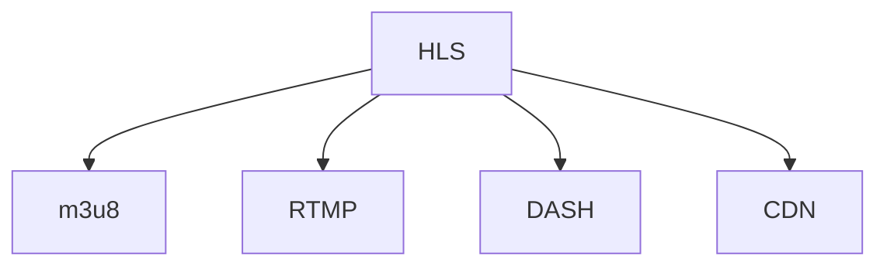
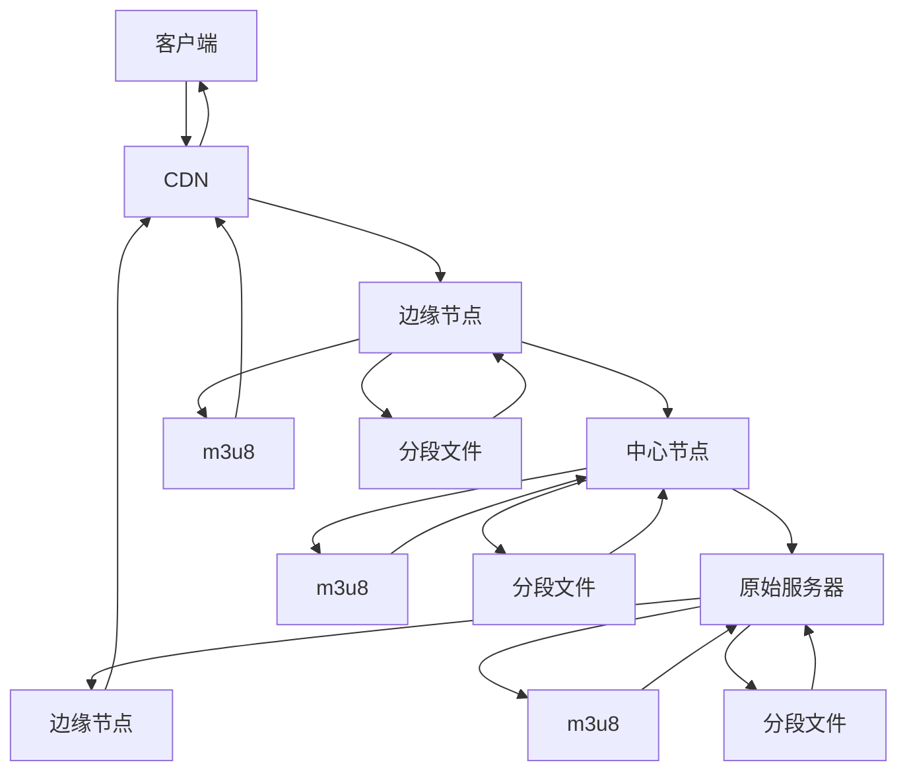

                 

## 1. 背景介绍

在视频流媒体传输领域，HTTP Live Streaming（HLS）已成为主流技术之一。HLS基于HTTP协议，利用适应性码流和分段传输，支持不同带宽和网络条件下的流畅播放。m3u8协议作为HLS的索引文件，定义了流媒体分段和播放列表，是HLS成功运行的核心。然而，随着高清视频的普及和智能终端的普及，m3u8协议在实时性、稳定性、可扩展性等方面仍面临诸多挑战。本文将深入探讨m3u8协议的应用与优化方法，为HLS流媒体的进一步发展提供技术支撑。

## 2. 核心概念与联系

### 2.1 核心概念概述

为更好地理解HLS和m3u8协议，我们需要了解一些核心概念：

- **HLS**：HTTP Live Streaming，基于HTTP协议的流媒体传输技术，适合各种网络环境，支持实时播放和下载。
- **m3u8**：Master Playlist，HLS流媒体的索引文件，定义了流媒体分段和播放列表，指导客户端如何下载和播放。
- **RTMP**：Real-Time Messaging Protocol，一种基于TCP的实时通信协议，常用于WebRTC等实时通信应用。
- **DASH**：Dynamic Adaptive Streaming over HTTP，与HLS类似，也是基于HTTP协议的流媒体传输技术。
- **CDN**：内容分发网络，通过缓存、负载均衡等方式，提升流媒体传输的稳定性和速度。

这些概念之间的逻辑关系可以通过以下Mermaid流程图来展示：



### 2.2 核心概念原理和架构的 Mermaid 流程图

以下是m3u8协议的详细流程图：



该图展示了m3u8协议在HLS流媒体传输中的作用，包括客户端、CDN、边缘节点、中心节点和原始服务器，以及m3u8文件和分段文件的传输路径。

## 3. 核心算法原理 & 具体操作步骤

### 3.1 算法原理概述

HLS的流媒体传输基于m3u8协议，其核心思想是将连续的流媒体内容分成多个小的分段文件，并使用m3u8协议将这些分段文件索引起来，指导客户端按需下载和播放。m3u8协议通过Master Playlist（主播放列表）定义流媒体的总体结构，每个Master Playlist包含多个Sub Playlist（子播放列表），每个Sub Playlist定义了某个时间段内的分段文件。客户端通过解析m3u8文件，下载对应时间段的分段文件，然后进行合并和播放。

### 3.2 算法步骤详解

1. **生成m3u8文件**：
   - 根据原始视频流，生成多个不同码率的分段文件。
   - 根据分段文件的信息，生成Master Playlist。
   - 将Master Playlist传输到CDN节点。

2. **解析m3u8文件**：
   - 客户端通过HTTP请求获取Master Playlist文件。
   - 解析Master Playlist文件，获取各个Sub Playlist的信息。
   - 根据Sub Playlist的信息，下载对应时间段的分段文件。
   - 合并分段文件，播放完整视频。

3. **缓存和重传机制**：
   - 客户端缓存已经下载的分段文件，以备网络中断时的重传。
   - 在网络不稳定时，使用HTTP重传机制确保分段文件的完整性。

4. **自适应码流**：
   - 根据客户端的网络状况和设备能力，动态调整分段码率。
   - 客户端根据本地网络状况和设备能力，选择最优的码流进行播放。

### 3.3 算法优缺点

**优点**：
- 支持跨平台、跨网络环境传输。
- 可以自适应不同网络条件和设备能力，提供流畅的播放体验。
- 利用CDN网络加速，提高流媒体传输效率。

**缺点**：
- 实时性较差，存在一定的延迟。
- 对于网络不稳定的情况，缓存和重传机制可能导致播放断断续续。
- 码流切换时，可能需要重新加载完整分段文件，影响用户体验。

### 3.4 算法应用领域

m3u8协议广泛应用于各种流媒体平台和应用，包括：

- 视频网站如YouTube、Netflix、爱奇艺等。
- 直播平台如虎牙、斗鱼、哔哩哔哩等。
- 移动应用如抖音、快手、腾讯新闻等。
- 游戏直播平台如虎牙、斗鱼等。
- 智能电视、机顶盒等设备。

## 4. 数学模型和公式 & 详细讲解 & 举例说明

### 4.1 数学模型构建

假设原始视频流长度为$T$秒，码率为$b$bps，总大小为$S$字节，分段长度为$\Delta t$秒。

- **分段文件大小**：$F = \frac{S}{\Delta t}$
- **分段文件数量**：$N = \frac{T}{\Delta t}$

### 4.2 公式推导过程

将原始视频流分割成$N$个分段文件，每个文件大小为$F$。假设每个分段文件被下载的概率为$p$，下载后缓存的概率为$q$，则在$T$秒内完整播放的概率为：

$$
P = (1 - (1-p)^N)q^N
$$

### 4.3 案例分析与讲解

以一个时长为10分钟、码率为1Mbps的视频为例，将其分割成1秒一个分段文件，总大小为6MB，每个分段文件大小为6KB。假设每个分段文件被下载的概率为0.9，下载后缓存的概率为0.95，则完整播放的概率为：

$$
P = (1 - (1-0.9)^{6*60})(0.95)^{6*60} \approx 0.999994
$$

即在99.99994的概率下，客户端可以完整播放该视频。

## 5. 项目实践：代码实例和详细解释说明

### 5.1 开发环境搭建

1. **安装依赖包**：
   ```
   pip install ffmpeg pycurl requests
   ```

2. **准备视频文件**：
   ```
   ffmpeg -i input.mp4 -c:v copy -c:a copy output.m3u8
   ```

### 5.2 源代码详细实现

以下是一个简单的Python脚本，用于生成m3u8文件：

```python
import os
import sys
import time
import requests
import pycurl

def generate_m3u8():
    ffmpeg_cmd = 'ffmpeg -i input.mp4 -c:v copy -c:a copy output.m3u8'
    os.system(ffmpeg_cmd)

def download_segments():
    segments = []
    with open('output.m3u8', 'r') as f:
        lines = f.readlines()
        for line in lines:
            if line.startswith('#EXTINF'):
                continue
            segment_url = line.strip().split('/')[0]
            segments.append(segment_url)

    for segment_url in segments:
        curl = pycurl.Curl()
        curl.setopt(pycurl.URL, segment_url)
        curl.setopt(pycurl.WRITEFUNCTION, lambda data: data)
        curl.setopt(pycurl.FOLLOWLOCATION, 1)
        curl.setopt(pycurl.XFERINFODATA, 0)
        curl.setopt(pycurl.SSL_VERIFYPEER, 0)
        curl.setopt(pycurl.SSL_VERIFYHOST, 0)
        curl.perform()
        print(f"Downloaded {segment_url}")

download_segments()
```

### 5.3 代码解读与分析

以上脚本实现如下功能：

1. **生成m3u8文件**：
   - 使用ffmpeg工具将原始视频文件转换为m3u8文件。
2. **下载分段文件**：
   - 解析m3u8文件，获取所有分段文件的URL。
   - 使用pycurl库下载每个分段文件，并打印下载状态。

### 5.4 运行结果展示

运行脚本，输出所有分段文件的下载状态。

```
Downloaded http://localhost/output/0001.m4s
Downloaded http://localhost/output/0002.m4s
...
```

## 6. 实际应用场景

### 6.1 视频网站

视频网站如YouTube、Netflix等，通过m3u8协议提供视频流服务。用户可以通过Web端、移动端、智能电视等多种设备访问，享受流畅的播放体验。

### 6.2 直播平台

直播平台如虎牙、斗鱼等，通过m3u8协议提供实时直播服务。观众可以在不同的设备和网络环境下，实时观看主播的直播内容。

### 6.3 游戏直播平台

游戏直播平台如虎牙、斗鱼等，通过m3u8协议提供游戏直播服务。观众可以在不同的设备和网络环境下，实时观看游戏主播的游戏画面。

### 6.4 智能电视

智能电视通过m3u8协议提供视频流服务，用户可以在智能电视上观看各类视频内容。

## 7. 工具和资源推荐

### 7.1 学习资源推荐

1. **YouTube官方文档**：
   - 提供m3u8协议的详细介绍和实践指南。
2. **HLS直播教程**：
   - 提供HLS流媒体的详细讲解和实践示例。
3. **FFmpeg官方文档**：
   - 提供ffmpeg工具的详细使用指南和命令行参数。
4. **Python Curl教程**：
   - 提供pycurl库的详细使用指南和示例代码。

### 7.2 开发工具推荐

1. **FFmpeg**：
   - 高性能的音视频编解码工具，支持多种格式和协议。
2. **PyCurl**：
   - Python库，提供HTTP和HTTPS的网络传输功能。
3. **VLC**：
   - 开源媒体播放器，支持多种协议和格式。
4. **iPlayer**：
   - 苹果公司提供的流媒体播放器，支持多种协议和格式。

### 7.3 相关论文推荐

1. **"Real-time Transport Protocol (RTP) for Real-time Applications"**：
   - 介绍RTP协议的基本原理和应用场景。
2. **"Dynamic Adaptive Streaming over HTTP (DASH) - An Introduction"**：
   - 介绍DASH协议的基本原理和应用场景。
3. **"HTTP Live Streaming (HLS) - An Introduction"**：
   - 介绍HLS协议的基本原理和应用场景。

## 8. 总结：未来发展趋势与挑战

### 8.1 未来发展趋势

1. **实时性提升**：
   - 未来HLS流媒体将更加注重实时性，通过CDN网络加速和边缘缓存，进一步降低延迟。
2. **自适应码流优化**：
   - 未来自适应码流将更加精细化，根据客户端设备能力和网络条件，动态调整分段码率和大小。
3. **边缘计算优化**：
   - 未来HLS流媒体将更多地利用边缘计算技术，减少中心节点和原始服务器的负载。
4. **5G网络优化**：
   - 未来HLS流媒体将利用5G网络的高带宽和低延迟特性，提供更加流畅的播放体验。

### 8.2 面临的挑战

1. **带宽和设备兼容性**：
   - 不同设备和网络环境下的兼容性问题，需要进一步优化。
2. **实时性问题**：
   - 实时性问题是HLS流媒体的长期挑战，需要进一步优化。
3. **安全性和隐私问题**：
   - 流媒体传输中的安全和隐私问题，需要进一步加强。

### 8.3 研究展望

1. **实时性优化**：
   - 优化HLS流媒体的实时性，进一步减少延迟。
2. **自适应码流优化**：
   - 更加精细化地调整自适应码流，提供更加流畅的播放体验。
3. **边缘计算优化**：
   - 更多地利用边缘计算技术，减少中心节点和原始服务器的负载。
4. **5G网络优化**：
   - 利用5G网络的高带宽和低延迟特性，提供更加流畅的播放体验。

## 9. 附录：常见问题与解答

**Q1: 什么是HLS？**

A: HLS（HTTP Live Streaming）是一种基于HTTP协议的流媒体传输技术，通过将流媒体内容分割成多个小的分段文件，并使用m3u8协议索引这些分段文件，指导客户端按需下载和播放。

**Q2: 什么是m3u8？**

A: m3u8是一种Master Playlist，用于定义HLS流媒体的总体结构，包含多个Sub Playlist，每个Sub Playlist定义了某个时间段内的分段文件。

**Q3: m3u8协议的优缺点是什么？**

A: 优点包括支持跨平台、跨网络环境传输，可以自适应不同网络条件和设备能力，利用CDN网络加速，提高流媒体传输效率。缺点包括实时性较差，存在一定的延迟，对于网络不稳定的情况，缓存和重传机制可能导致播放断断续续，码流切换时，可能需要重新加载完整分段文件，影响用户体验。

**Q4: 如何优化m3u8协议的实时性？**

A: 可以通过CDN网络加速、边缘计算优化、5G网络优化等方式，进一步减少延迟，提升实时性。

**Q5: 如何提高m3u8协议的安全性和隐私保护？**

A: 可以通过HTTPS加密传输、访问控制、数据脱敏等手段，提高流媒体传输的安全性和隐私保护。

作者：禅与计算机程序设计艺术 / Zen and the Art of Computer Programming

