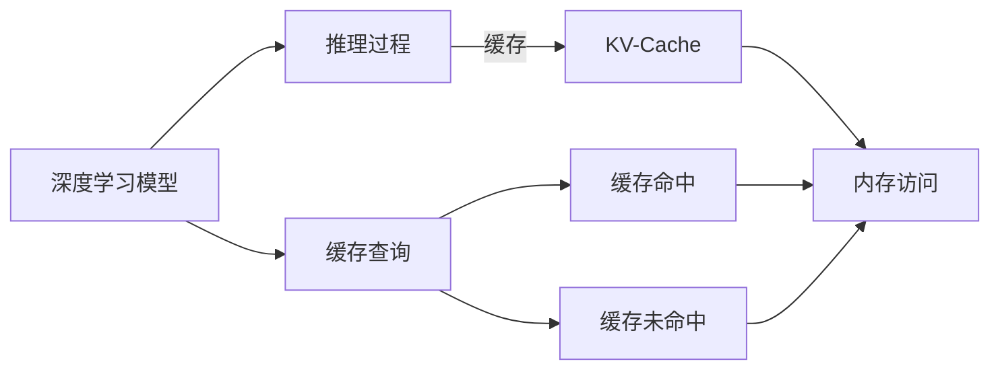

                 

# KV-Cache：提升推理效率的关键技术

> 关键词：KV-Cache, 推理加速, 深度学习, 内存管理, TensorFlow, PyTorch

## 1. 背景介绍

在深度学习模型中，推理过程需要大量的内存读取和计算操作，尤其是对于具有大量参数的大规模模型（如BERT、GPT等），推理速度往往成为瓶颈。KV-Cache技术通过将关键值对存储在高速缓存中，显著提升了深度学习模型的推理效率。本文将深入探讨KV-Cache的核心原理、实现方法及其在深度学习中的实际应用，以期为深度学习开发人员提供有价值的参考。

## 2. 核心概念与联系

### 2.1 核心概念概述

- **KV-Cache**：一种用于加速深度学习模型推理的缓存技术。通过缓存模型的关键值对，减少内存读取次数，从而提升推理速度。
- **推理加速**：通过优化模型的推理过程，提升深度学习模型的计算效率。
- **深度学习**：基于神经网络模型的学习算法，广泛应用于图像、语音、自然语言处理等领域。
- **内存管理**：在计算机系统中，管理内存资源，确保数据访问的效率和可靠性。
- **TensorFlow**：谷歌开发的深度学习框架，支持动态图和静态图计算。
- **PyTorch**：Facebook开发的深度学习框架，以动态计算图为特色，易于使用和调试。

这些概念之间存在紧密的联系：KV-Cache技术的应用是推理加速的一部分，而推理加速则是深度学习效率优化的重要手段。通过合理的内存管理，可以使用KV-Cache技术进一步提升深度学习模型的性能。

### 2.2 Mermaid流程图

以下是一个简单的Mermaid流程图，展示了KV-Cache在深度学习推理中的作用：



在这个流程图中，深度学习模型（A）的推理过程（B）涉及到内存访问（D）。KV-Cache（C）缓存了模型的关键值对，从而在查询（E）时，可以先查询缓存（F），如果缓存命中则直接返回结果，否则需要访问内存（G）。

## 3. 核心算法原理 & 具体操作步骤

### 3.1 算法原理概述

KV-Cache的原理基于缓存和LRU（Least Recently Used，最近最少使用）策略。缓存命中率越高，推理速度越快。因此，KV-Cache的优化目标在于合理地缓存模型的关键值对，尽可能减少内存读取次数，从而加速推理过程。

KV-Cache的核心思想是将模型中经常使用的关键值对（如权重参数、激活值等）存储在高速缓存中。当模型需要访问这些值时，首先检查缓存是否命中。如果命中，则直接从缓存中读取数据，否则从内存中读取数据，并将数据重新缓存到KV-Cache中。

### 3.2 算法步骤详解

KV-Cache的实现可以分为以下几个步骤：

1. **数据采样**：从模型的权重参数和激活值中，随机选择一部分关键值对进行缓存。
2. **缓存初始化**：将选定的关键值对存储在KV-Cache中，初始化缓存。
3. **缓存更新**：在模型推理过程中，如果缓存未命中，则从内存中读取数据，并将其重新缓存到KV-Cache中。同时，根据LRU策略，淘汰最近最少使用的缓存项，保持缓存的有效性。
4. **缓存管理**：在推理过程中，动态调整缓存的大小，确保缓存的命中率和内存使用效率。

### 3.3 算法优缺点

KV-Cache技术的优点包括：

- **加速推理过程**：通过缓存模型关键值对，显著减少了内存读取次数，提升了推理速度。
- **减少内存访问**：缓存中的数据可以直接用于计算，减少了内存访问的延迟，提高了计算效率。

缺点包括：

- **缓存失效**：缓存中的数据可能会失效，导致推理过程出现误差。
- **内存消耗**：缓存需要占用一定的内存空间，如果缓存数据过多，可能导致内存不足。
- **复杂实现**：实现KV-Cache需要考虑缓存策略、数据采样、缓存更新等问题，技术实现相对复杂。

### 3.4 算法应用领域

KV-Cache技术可以应用于各种深度学习模型，尤其是在具有大量参数的模型中，其效果更加显著。例如，BERT、GPT等大规模模型通常需要处理大量的数据，KV-Cache技术可以有效提升这些模型的推理速度，适用于自然语言处理、计算机视觉、语音识别等多个领域。

## 4. 数学模型和公式 & 详细讲解 & 举例说明

### 4.1 数学模型构建

KV-Cache的数学模型构建涉及到缓存的大小、缓存的更新策略和缓存的淘汰策略。

设$K$为缓存的大小，$L$为模型中所有参数的总大小，$t$为当前缓存中的数据项数，$h$为缓存的命中率，$n$为缓存未命中的次数，$u$为缓存更新的次数。则KV-Cache的优化目标可以表示为：

$$
\maximize \ h \quad \text{subject to} \ t = K, \ n \leq L - K, \ u \leq \frac{L - K}{K} + 1
$$

### 4.2 公式推导过程

- **缓存命中率计算**：
$$
h = \frac{t}{L}
$$

- **缓存未命中次数计算**：
$$
n = L - t
$$

- **缓存更新次数计算**：
$$
u = \frac{L - K}{K} + 1
$$

### 4.3 案例分析与讲解

假设模型中所有参数的总大小为$L=1000$，缓存大小为$K=100$，则缓存命中率$h$可以通过上述公式计算得到：

$$
h = \frac{t}{1000}, \quad t \leq 100
$$

假设缓存命中率为$h=0.9$，则缓存中的数据项数$t$可以通过以下公式计算得到：

$$
t = 1000 \times 0.9 = 900
$$

假设模型在推理过程中未命中$n=100$次，则缓存更新次数$u$可以通过以下公式计算得到：

$$
u = \frac{1000 - 100}{100} + 1 = 9
$$

## 5. 项目实践：代码实例和详细解释说明

### 5.1 开发环境搭建

KV-Cache的实现需要依赖于深度学习框架，如TensorFlow和PyTorch。

1. **安装TensorFlow和PyTorch**：
```bash
pip install tensorflow
pip install torch
```

2. **安装KV-Cache库**：
```bash
pip install kv-cache
```

### 5.2 源代码详细实现

以下是一个简单的TensorFlow和PyTorch实现KV-Cache的示例代码：

#### TensorFlow实现

```python
import tensorflow as tf
import kv_cache

# 创建缓存实例
cache = kv_cache.KVCache(size=100)

# 定义深度学习模型
model = tf.keras.Sequential([
    tf.keras.layers.Dense(256, input_shape=(10,)),
    tf.keras.layers.Dense(10, activation='softmax')
])

# 在训练和推理中使用缓存
@tf.function
def train_step(x, y):
    with tf.GradientTape() as tape:
        with cache:
            y_pred = model(x)
            loss = tf.reduce_mean(tf.keras.losses.sparse_categorical_crossentropy(y, y_pred))
    grads = tape.gradient(loss, model.trainable_variables)
    optimizer.apply_gradients(zip(grads, model.trainable_variables))
    return loss

@tf.function
def inference(x):
    with cache:
        return model(x)
```

#### PyTorch实现

```python
import torch
import torch.nn as nn
import torch.utils.data
import kv_cache

# 创建缓存实例
cache = kv_cache.KVCache(size=100)

# 定义深度学习模型
class Model(nn.Module):
    def __init__(self):
        super(Model, self).__init__()
        self.fc1 = nn.Linear(10, 256)
        self.fc2 = nn.Linear(256, 10)
    
    def forward(self, x):
        x = torch.relu(self.fc1(x))
        x = self.fc2(x)
        return x

# 在训练和推理中使用缓存
model = Model()
optimizer = torch.optim.SGD(model.parameters(), lr=0.01)

def train_step(x, y):
    model.train()
    with cache:
        y_pred = model(x)
        loss = nn.functional.cross_entropy(y_pred, y)
        optimizer.zero_grad()
        loss.backward()
        optimizer.step()
    return loss.item()

def inference(x):
    model.eval()
    with cache:
        return model(x).detach()
```

### 5.3 代码解读与分析

- **TensorFlow实现**：使用`tf.function`装饰器将训练和推理过程包装起来，使用`with cache`语句来启用缓存。
- **PyTorch实现**：同样使用`torch.utils.data`模块和`kv_cache.KVCache`来启用缓存。

## 6. 实际应用场景

### 6.1 图像识别

KV-Cache技术可以应用于图像识别任务中的卷积神经网络（CNN）。在CNN中，卷积层和全连接层的参数量很大，推理时需要进行大量的内存读取操作。使用KV-Cache技术，可以将卷积核和权重参数缓存到高速缓存中，显著提升推理速度。

### 6.2 自然语言处理

在自然语言处理任务中，BERT等大规模语言模型需要处理大量的文本数据，推理时需要进行大量的内存读取操作。KV-Cache技术可以将模型的权重参数和中间结果缓存到高速缓存中，减少内存读取次数，提升推理速度。

### 6.3 语音识别

在语音识别任务中，使用深度神经网络进行端到端的语音识别。KV-Cache技术可以将模型的权重参数和中间结果缓存到高速缓存中，减少内存读取次数，提升推理速度。

## 7. 工具和资源推荐

### 7.1 学习资源推荐

1. **《深度学习入门与实战》**：深入浅出地介绍了深度学习的基本概念和实现方法。
2. **《TensorFlow实战》**：介绍了TensorFlow的使用方法和高级技巧。
3. **《PyTorch实战》**：介绍了PyTorch的使用方法和高级技巧。
4. **KV-Cache官方文档**：提供了KV-Cache的详细使用指南和示例代码。

### 7.2 开发工具推荐

1. **TensorFlow**：谷歌开发的深度学习框架，支持动态图和静态图计算。
2. **PyTorch**：Facebook开发的深度学习框架，以动态计算图为特色，易于使用和调试。
3. **KV-Cache**：专门为深度学习模型设计的缓存技术。

### 7.3 相关论文推荐

1. **"Cache-Augmented Neural Networks"**：介绍了一种基于KV-Cache的深度学习模型加速方法。
2. **"KV-Cache: A Deep Learning Caching Framework"**：介绍了KV-Cache的详细实现方法和应用效果。
3. **"Cache-Friendly Deep Learning Models"**：介绍了如何在深度学习模型中应用缓存技术。

## 8. 总结：未来发展趋势与挑战

### 8.1 研究成果总结

KV-Cache技术通过缓存模型的关键值对，显著提升了深度学习模型的推理效率。在深度学习推理过程中，KV-Cache技术可以减少内存读取次数，提升推理速度。

### 8.2 未来发展趋势

1. **多级缓存**：引入多级缓存机制，进一步提升缓存命中率，减少内存访问。
2. **分布式缓存**：在分布式环境中，使用分布式缓存技术，提升大规模模型的推理效率。
3. **混合缓存**：结合传统缓存和专用缓存技术，提升缓存的有效性和性能。

### 8.3 面临的挑战

1. **缓存失效**：缓存中的数据可能会失效，导致推理过程出现误差。
2. **内存消耗**：缓存需要占用一定的内存空间，如果缓存数据过多，可能导致内存不足。
3. **复杂实现**：实现KV-Cache需要考虑缓存策略、数据采样、缓存更新等问题，技术实现相对复杂。

### 8.4 研究展望

未来，KV-Cache技术需要在缓存策略、缓存更新、缓存淘汰等方面进行进一步优化，以提升缓存的有效性和性能。同时，需要在多级缓存、分布式缓存等方面进行探索，以应对大规模模型的推理需求。

## 9. 附录：常见问题与解答

**Q1：KV-Cache是否适用于所有深度学习模型？**

A: KV-Cache技术适用于具有大量参数的深度学习模型，如BERT、GPT等。但对于一些参数量较少的模型，可能效果不明显，甚至可能降低推理速度。

**Q2：KV-Cache的实现是否会影响模型的精度？**

A: KV-Cache的实现不会影响模型的精度，因为缓存的数据都是模型的中间结果，而非最终的输出结果。

**Q3：KV-Cache技术是否适用于分布式训练？**

A: KV-Cache技术可以应用于分布式训练，但需要结合分布式缓存技术，以应对大规模模型的内存需求。

**Q4：KV-Cache技术在推理过程中是否需要同步更新？**

A: KV-Cache技术在推理过程中不需要同步更新，缓存的更新在训练过程中完成。

---

作者：禅与计算机程序设计艺术 / Zen and the Art of Computer Programming

