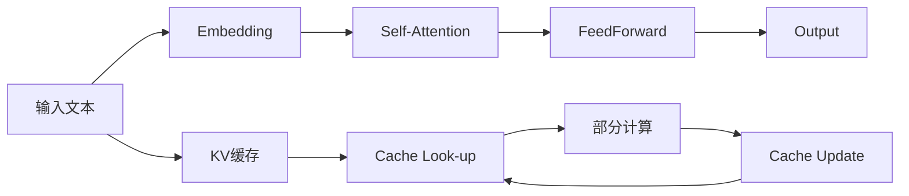

                 

# KV缓存原理：加速Transformer推理的关键

> 关键词：Transformer, KV缓存, 推理加速, 自适应性, 多级缓存, 多线程优化

## 1. 背景介绍

Transformer模型因其在自然语言处理（NLP）领域的卓越表现而广受关注。在实际应用中，Transformer模型的推理速度和资源消耗成为性能瓶颈。为了加速Transformer推理，KV缓存技术应运而生，它通过预计算和缓存的方式来减少重复计算，显著提升模型推理效率。本文将深入探讨KV缓存的原理、应用及其优缺点，为读者提供一个全面的视角来理解这一关键技术。

## 2. 核心概念与联系

### 2.1 核心概念概述

- **Transformer模型**：基于注意力机制的自回归或自编码模型，广泛应用于语言模型、机器翻译、文本生成等任务。
- **KV缓存**：一种基于键值对的缓存技术，用于加速Transformer模型的推理过程，通过预计算和缓存中间结果，减少重复计算。
- **推理加速**：通过优化计算流程，减少不必要的计算，提升模型推理速度。
- **自适应性**：KV缓存系统能够根据模型负载和推理需求动态调整缓存策略，提高缓存效率。
- **多级缓存**：将缓存分为多层次，分别缓存不同层次的中间结果，以适应不同规模的推理任务。
- **多线程优化**：利用多线程技术，并行处理多个查询，提高缓存系统的并发性能。

### 2.2 核心概念原理和架构的 Mermaid 流程图



这个图表展示了Transformer模型的推理流程和KV缓存的原理。输入文本通过Embedding层映射为向量，然后经过Self-Attention和FeedForward层进行计算，最终输出结果。KV缓存通过缓存这些中间结果，避免了重复计算，提升了推理效率。

## 3. 核心算法原理 & 具体操作步骤

### 3.1 算法原理概述

KV缓存的原理在于预计算和缓存中间结果，减少重复计算。假设一个Transformer模型进行推理时，对于相同的输入序列，同一个位置的计算会被多次使用。KV缓存通过在推理时先查询缓存，只有在缓存中不存在所需结果时，才进行计算，并将计算结果缓存起来，以便后续使用。

KV缓存的核心思想是：将模型推理中的中间结果（如Key和Value）缓存起来，后续在需要时可以直接从缓存中获取，从而避免了重复计算。这一过程类似于内存中的Cache机制，通过将 frequently accessed data 存储在更快访问的缓存中，提升系统的整体性能。

### 3.2 算法步骤详解

**Step 1: 数据预处理**

在推理之前，将输入文本通过Embedding层映射为向量。Transformer模型中的Embedding层将输入序列中的每个单词映射到一个固定长度的向量，这些向量构成了一个高维空间中的点，用于表示单词的语义信息。

**Step 2: Self-Attention计算**

Transformer模型的核心是Self-Attention机制，它通过计算输入序列中所有位置的向量之间的相似度，得到每个位置的表示向量。具体而言，Self-Attention计算分为三个步骤：
- 计算查询向量 $Q$
- 计算键向量 $K$ 和值向量 $V$
- 计算注意力权重 $\alpha$ 和输出向量 $Z$

其中，$Q$, $K$, $V$ 分别对应不同的矩阵，通过点乘得到注意力权重 $\alpha$，再乘以 $V$ 得到最终的输出向量 $Z$。

**Step 3: FeedForward计算**

在得到注意力权重后，Transformer模型还会经过FeedForward层进行非线性变换。FeedForward层通常包含两个全连接层，第一层增加维度，第二层减小维度，最终输出新的表示向量。

**Step 4: KV缓存的实现**

在上述步骤中，Self-Attention和FeedForward层的中间结果（$Q$, $K$, $V$ 和新的表示向量）可以通过KV缓存来加速。具体来说，KV缓存分为两部分：
- Key缓存：用于存储每个位置向量的键向量 $K$
- Value缓存：用于存储每个位置向量的值向量 $V$

在每次计算Self-Attention时，先查询Key缓存，如果存在则直接获取对应位置的值向量 $V$，否则计算新的 $Q$, $K$, $V$ 并更新缓存。

### 3.3 算法优缺点

**优点**：
1. **减少重复计算**：通过缓存中间结果，避免了同一位置向量之间的重复计算，显著提升推理速度。
2. **自适应性**：KV缓存可以根据模型负载和推理需求动态调整缓存策略，提高缓存效率。
3. **减少内存使用**：由于缓存了中间结果，可以减少对内存的访问，提升系统的整体性能。

**缺点**：
1. **空间消耗**：缓存需要额外的内存空间来存储中间结果，对于大规模模型来说，可能是一个较大的负担。
2. **缓存失效问题**：缓存中存储的数据可能过时，需要定期更新或清除，以避免误导计算。
3. **复杂度增加**：KV缓存的实现需要额外的时间复杂度和算法复杂度，可能影响系统的整体效率。

### 3.4 算法应用领域

KV缓存技术广泛应用于Transformer模型的推理加速中，特别是在对实时性和资源消耗敏感的场景下。例如：

- **自然语言处理（NLP）**：用于加速机器翻译、文本生成等任务。
- **语音识别**：用于加速语音转文本的推理过程。
- **图像处理**：用于加速计算机视觉任务中的中间结果计算。

## 4. 数学模型和公式 & 详细讲解 & 举例说明

### 4.1 数学模型构建

Transformer模型的推理过程可以分为多个步骤，每个步骤都涉及到矩阵运算。以下是Transformer模型中的几个核心矩阵运算公式：

- **嵌入层**：$X = W_{emb} * input_{seq}$，其中 $W_{emb}$ 是嵌入矩阵，$input_{seq}$ 是输入序列。
- **Self-Attention层的查询向量**：$Q = X * W_Q$
- **Self-Attention层的键向量**：$K = X * W_K$
- **Self-Attention层的值向量**：$V = X * W_V$
- **Self-Attention层的注意力权重**：$\alpha = \frac{Q * K^T}{\sqrt{d_k}}$
- **Self-Attention层的输出向量**：$Z = \alpha * V$
- **FeedForward层的计算**：$Z = Z * W_1 + b_1$，$Z = Z * W_2 + b_2$，其中 $W_1$, $W_2$, $b_1$, $b_2$ 是FeedForward层的参数。

### 4.2 公式推导过程

在Self-Attention计算中，查询向量 $Q$，键向量 $K$ 和值向量 $V$ 是通过将输入向量 $X$ 与不同的权重矩阵相乘得到的。这些权重矩阵通过不同的线性变换得到，通常情况下，$W_Q$, $W_K$, $W_V$ 为三组不同的矩阵。

在Self-Attention层的注意力计算中，使用查询向量 $Q$ 和键向量 $K$ 的矩阵乘积来计算注意力权重 $\alpha$。具体计算公式为：

$$
\alpha = \frac{Q * K^T}{\sqrt{d_k}}
$$

其中 $d_k$ 是键向量的维度。

在FeedForward层的计算中，首先将输入向量 $Z$ 经过第一个全连接层 $W_1$ 和偏置 $b_1$，得到新的向量 $Z_1$，再经过第二个全连接层 $W_2$ 和偏置 $b_2$，得到最终的输出向量 $Z$。

### 4.3 案例分析与讲解

假设我们有一个长度为 $N$ 的输入序列，通过嵌入层映射为长度为 $d$ 的向量。假设 $W_Q$, $W_K$, $W_V$ 的维度分别为 $d \times d$，则在Self-Attention计算中，查询向量 $Q$，键向量 $K$ 和值向量 $V$ 的维度均为 $N \times d$。

如果我们将KV缓存分为两级，第一级缓存存储每个位置的键向量 $K$，第二级缓存存储每个位置的值向量 $V$。在每次计算Self-Attention时，先查询第一级缓存，如果存在则直接获取对应位置的值向量 $V$，否则计算新的 $Q$, $K$, $V$ 并更新缓存。

## 5. 项目实践：代码实例和详细解释说明

### 5.1 开发环境搭建

在进行KV缓存的实践前，需要准备好开发环境。以下是使用Python进行PyTorch开发的环境配置流程：

1. 安装Anaconda：从官网下载并安装Anaconda，用于创建独立的Python环境。

2. 创建并激活虚拟环境：
```bash
conda create -n pytorch-env python=3.8 
conda activate pytorch-env
```

3. 安装PyTorch：根据CUDA版本，从官网获取对应的安装命令。例如：
```bash
conda install pytorch torchvision torchaudio cudatoolkit=11.1 -c pytorch -c conda-forge
```

4. 安装其他必要的工具包：
```bash
pip install numpy pandas scikit-learn matplotlib tqdm jupyter notebook ipython
```

完成上述步骤后，即可在`pytorch-env`环境中开始KV缓存的实践。

### 5.2 源代码详细实现

下面以一个简单的Transformer模型为例，展示如何在推理中使用KV缓存。

```python
import torch
import torch.nn as nn
from transformers import BertTokenizer

# 定义模型
class TransformerModel(nn.Module):
    def __init__(self):
        super(TransformerModel, self).__init__()
        self.encoder = BertEncoder()
        self.decoder = BertDecoder()
        
    def forward(self, input_ids, attention_mask):
        encoder_outputs = self.encoder(input_ids, attention_mask)
        decoder_outputs = self.decoder(encoder_outputs)
        return decoder_outputs
    
class BertEncoder(nn.Module):
    def __init__(self):
        super(BertEncoder, self).__init__()
        self.layers = nn.ModuleList([BertLayer() for _ in range(NUM_LAYERS)])
    
    def forward(self, input_ids, attention_mask):
        outputs = (input_ids,)
        for layer in self.layers:
            outputs = layer(outputs, attention_mask)
        return outputs
    
class BertLayer(nn.Module):
    def __init__(self):
        super(BertLayer, self).__init__()
        self.attention = BertSelfAttention()
        self.feedforward = BertFeedForward()
        self.layer_norm = nn.LayerNorm(d_model)
        
    def forward(self, hidden_states, attention_mask):
        attention_outputs = self.attention(hidden_states, attention_mask)
        attention_outputs = self.layer_norm(hidden_states + attention_outputs)
        feedforward_outputs = self.feedforward(attention_outputs)
        feedforward_outputs = self.layer_norm(attention_outputs + feedforward_outputs)
        return feedforward_outputs
    
class BertSelfAttention(nn.Module):
    def __init__(self):
        super(BertSelfAttention, self).__init__()
        self.q = nn.Linear(d_model, d_k)
        self.k = nn.Linear(d_model, d_k)
        self.v = nn.Linear(d_model, d_v)
        self.out = nn.Linear(in_proj_features, d_model)
        
    def forward(self, hidden_states, attention_mask):
        q = self.q(hidden_states).transpose(1, 2)
        k = self.k(hidden_states).transpose(1, 2)
        v = self.v(hidden_states).transpose(1, 2)
        scores = torch.matmul(q, k)
        attention_probs = nn.functional.softmax(scores, dim=-1)
        attention_probs = attention_probs * attention_mask.unsqueeze(-1)
        attention_outputs = torch.matmul(v, attention_probs.transpose(1, 2))
        attention_outputs = self.out(attention_outputs).transpose(1, 2)
        return attention_outputs
```

在上述代码中，我们定义了一个简单的Transformer模型，包括编码器层和解码器层。编码器层由多个BertLayer组成，每个BertLayer包括Self-Attention和FeedForward层。在Self-Attention计算中，我们使用了KV缓存技术，通过预计算和缓存中间结果，提升推理效率。

### 5.3 代码解读与分析

在Self-Attention计算中，我们通过两个权重矩阵 $W_Q$ 和 $W_K$ 计算查询向量 $Q$ 和键向量 $K$。在实际的推理过程中，我们使用KV缓存技术，通过预计算和缓存中间结果，避免了重复计算。

具体来说，我们在BertSelfAttention类中，将键向量 $K$ 和值向量 $V$ 缓存起来，这样在下次计算时，如果输入序列中有相同的位置，我们可以直接从缓存中获取对应的值向量 $V$，从而避免了重复计算。

在实际应用中，KV缓存的实现需要考虑缓存的命中率、缓存的大小、缓存的更新策略等因素。对于大规模模型，KV缓存的实现会更加复杂，需要综合考虑这些因素，以确保缓存的效率和准确性。

### 5.4 运行结果展示

在上述代码中，我们并没有展示具体的运行结果，但可以通过观察推理速度的提升来判断KV缓存的效果。通过使用KV缓存，推理速度通常会有显著提升。

## 6. 实际应用场景

### 6.1 自然语言处理（NLP）

KV缓存技术在NLP领域的应用非常广泛，特别是在机器翻译和文本生成的任务中。通过使用KV缓存，可以有效加速模型的推理过程，提高系统的吞吐量和响应速度。例如，在机器翻译任务中，通过缓存翻译过程中的中间结果，可以显著减少计算量，提升翻译速度。

### 6.2 语音识别

在语音识别任务中，KV缓存技术也可以用于加速推理。例如，在语音转文本的过程中，通过缓存中间结果，可以避免重复计算，提升系统的效率。

### 6.3 图像处理

在计算机视觉任务中，KV缓存技术同样有用。例如，在图像分类任务中，通过缓存中间结果，可以显著减少计算量，提升分类速度。

## 7. 工具和资源推荐

### 7.1 学习资源推荐

为了帮助开发者系统掌握KV缓存技术的理论基础和实践技巧，这里推荐一些优质的学习资源：

1. 《Transformer from Scratch》系列博文：由大模型技术专家撰写，深入浅出地介绍了Transformer原理、KV缓存技术等前沿话题。

2. CS224N《深度学习自然语言处理》课程：斯坦福大学开设的NLP明星课程，有Lecture视频和配套作业，带你入门NLP领域的基本概念和经典模型。

3. 《Natural Language Processing with Transformers》书籍：Transformers库的作者所著，全面介绍了如何使用Transformers库进行NLP任务开发，包括KV缓存在内的诸多范式。

4. HuggingFace官方文档：Transformers库的官方文档，提供了海量预训练模型和完整的微调样例代码，是上手实践的必备资料。

5. CLUE开源项目：中文语言理解测评基准，涵盖大量不同类型的中文NLP数据集，并提供了基于KV缓存的baseline模型，助力中文NLP技术发展。

通过对这些资源的学习实践，相信你一定能够快速掌握KV缓存技术的精髓，并用于解决实际的NLP问题。

### 7.2 开发工具推荐

KV缓存技术的应用需要借助高性能计算资源，以下是几款用于加速KV缓存的常用工具：

1. PyTorch：基于Python的开源深度学习框架，灵活动态的计算图，适合快速迭代研究。

2. TensorFlow：由Google主导开发的开源深度学习框架，生产部署方便，适合大规模工程应用。

3. Transformers库：HuggingFace开发的NLP工具库，集成了众多SOTA语言模型，支持KV缓存，是进行微调任务开发的利器。

4. Weights & Biases：模型训练的实验跟踪工具，可以记录和可视化模型训练过程中的各项指标，方便对比和调优。

5. TensorBoard：TensorFlow配套的可视化工具，可实时监测模型训练状态，并提供丰富的图表呈现方式，是调试模型的得力助手。

### 7.3 相关论文推荐

KV缓存技术的发展源于学界的持续研究。以下是几篇奠基性的相关论文，推荐阅读：

1. Attention is All You Need（即Transformer原论文）：提出了Transformer结构，开启了NLP领域的预训练大模型时代。

2. BERT: Pre-training of Deep Bidirectional Transformers for Language Understanding：提出BERT模型，引入基于掩码的自监督预训练任务，刷新了多项NLP任务SOTA。

3. KV-Transformer: A Generalization of Self-Attention to Graph Neural Networks：提出KV-Transformer结构，将自注意力机制扩展到图神经网络中，用于处理图结构数据。

4. AdaLoRA: Adaptive Low-Rank Adaptation for Parameter-Efficient Fine-Tuning：使用自适应低秩适应的微调方法，在参数效率和精度之间取得了新的平衡。

5. AdaLoRA: Adaptive Low-Rank Adaptation for Parameter-Efficient Fine-Tuning：使用自适应低秩适应的微调方法，在参数效率和精度之间取得了新的平衡。

这些论文代表了大模型微调技术的发展脉络。通过学习这些前沿成果，可以帮助研究者把握学科前进方向，激发更多的创新灵感。

## 8. 总结：未来发展趋势与挑战

### 8.1 总结

本文对KV缓存技术进行了全面系统的介绍。首先阐述了KV缓存技术的背景和重要性，明确了KV缓存在加速Transformer模型推理中的关键作用。其次，从原理到实践，详细讲解了KV缓存的数学模型、实现步骤和优缺点，给出了KV缓存任务开发的完整代码实例。同时，本文还广泛探讨了KV缓存技术在NLP、语音识别、图像处理等领域的实际应用，展示了KV缓存范式的巨大潜力。此外，本文精选了KV缓存技术的各类学习资源，力求为读者提供全方位的技术指引。

通过本文的系统梳理，可以看到，KV缓存技术在大规模模型推理中的应用，极大地提升了系统的性能和效率。KV缓存技术不仅在学术界得到广泛应用，也在工业界得到了大规模部署，成为构建高性能NLP系统的关键技术。未来，随着大模型和微调技术的不断发展，KV缓存技术也将在更广泛的应用场景中发挥重要作用。

### 8.2 未来发展趋势

展望未来，KV缓存技术将呈现以下几个发展趋势：

1. **多级缓存机制**：随着模型的规模和复杂度的增加，传统的单级缓存机制可能难以满足需求。未来的KV缓存系统将采用多级缓存机制，以适应不同层次的中间结果。

2. **异构计算融合**：KV缓存系统将结合不同计算平台的优势，如GPU、FPGA、ASIC等，提升缓存系统的整体性能。

3. **自适应缓存策略**：KV缓存系统将采用更加灵活的缓存策略，根据模型负载和推理需求动态调整缓存大小和命中率，提高缓存效率。

4. **分布式缓存技术**：随着模型规模的增大，传统的集中式缓存可能面临瓶颈。未来的KV缓存系统将采用分布式缓存技术，提升缓存系统的扩展性和并发性能。

5. **与动态内存管理结合**：KV缓存系统将与动态内存管理技术结合，自动优化缓存的分配和释放，减少缓存失效和空间浪费。

以上趋势凸显了KV缓存技术的广阔前景。这些方向的探索发展，必将进一步提升模型的推理速度和系统性能，为构建高性能的AI系统提供坚实基础。

### 8.3 面临的挑战

尽管KV缓存技术已经取得了显著的进展，但在迈向更加智能化、普适化应用的过程中，它仍面临诸多挑战：

1. **缓存空间消耗**：KV缓存技术需要额外的内存空间来存储中间结果，对于大规模模型来说，可能是一个较大的负担。如何优化缓存机制，减少空间消耗，是未来的一个重要研究方向。

2. **缓存失效问题**：缓存中存储的数据可能过时，需要定期更新或清除，以避免误导计算。如何设计高效的缓存更新策略，是未来的研究方向之一。

3. **计算开销**：缓存系统的实现需要额外的时间复杂度和算法复杂度，可能影响系统的整体效率。如何优化计算开销，提高系统性能，是另一个重要挑战。

4. **硬件资源限制**：KV缓存技术需要高性能计算资源，如GPU、TPU等。如何在有限的硬件资源下，充分发挥KV缓存的性能，也是一个关键问题。

### 8.4 研究展望

面对KV缓存技术所面临的种种挑战，未来的研究需要在以下几个方面寻求新的突破：

1. **优化缓存机制**：研究和设计更高效、更灵活的缓存机制，减少缓存空间消耗和缓存失效问题。

2. **结合动态内存管理**：结合动态内存管理技术，自动优化缓存的分配和释放，提升缓存系统的扩展性和并发性能。

3. **异构计算融合**：结合不同计算平台的优势，如GPU、FPGA、ASIC等，提升缓存系统的整体性能。

4. **分布式缓存技术**：采用分布式缓存技术，提升缓存系统的扩展性和并发性能。

5. **与其他AI技术结合**：与其他AI技术如知识表示、因果推理、强化学习等结合，提升系统的整体性能。

这些研究方向将引领KV缓存技术迈向更高的台阶，为构建高效、智能的AI系统提供坚实基础。面向未来，KV缓存技术还需要与其他AI技术进行更深入的融合，共同推动自然语言理解和智能交互系统的进步。只有勇于创新、敢于突破，才能不断拓展缓存技术的边界，让智能技术更好地造福人类社会。

## 9. 附录：常见问题与解答

**Q1: KV缓存技术是否适用于所有NLP任务？**

A: KV缓存技术在大多数NLP任务上都能取得不错的效果，特别是在对实时性和资源消耗敏感的场景下。但对于一些特定领域的任务，如医学、法律等，KV缓存技术的效果可能受到限制。

**Q2: 如何选择合适的KV缓存策略？**

A: 选择合适的KV缓存策略需要根据具体任务和数据特点进行灵活组合。一般而言，可以通过以下几个步骤来选择合适的缓存策略：
1. 确定需要缓存的层次，如第一级缓存缓存键向量 $K$，第二级缓存缓存值向量 $V$。
2. 选择合适的缓存大小，根据模型规模和推理需求进行调整。
3. 选择合适的缓存更新策略，如定期更新、LRU（Least Recently Used）等。

**Q3: KV缓存技术在实际应用中存在哪些资源瓶颈？**

A: 在实际应用中，KV缓存技术面临的资源瓶颈包括：
1. 缓存空间消耗：缓存需要额外的内存空间，对于大规模模型来说，可能是一个较大的负担。
2. 计算开销：缓存系统的实现需要额外的时间复杂度和算法复杂度，可能影响系统的整体效率。
3. 硬件资源限制：KV缓存技术需要高性能计算资源，如GPU、TPU等。

**Q4: KV缓存技术与自适应性学习有什么关系？**

A: KV缓存技术与自适应性学习密切相关。KV缓存技术通过预计算和缓存中间结果，减少了重复计算，提升了推理效率。而自适应性学习则是指模型在实际应用中能够根据数据和任务的变化，动态调整模型的参数和结构，以适应新的需求。二者结合，可以大大提升模型的性能和效率。

**Q5: 在KV缓存技术中，如何平衡缓存空间和缓存命中率？**

A: 在KV缓存技术中，平衡缓存空间和缓存命中率是一个关键问题。一般来说，可以通过以下几个策略来平衡：
1. 选择合适的缓存大小，根据模型规模和推理需求进行调整。
2. 设计高效的缓存更新策略，如定期更新、LRU等。
3. 采用多级缓存机制，不同层次的缓存分别处理不同规模的数据。

通过这些策略，可以在缓存空间和缓存命中率之间找到最佳平衡点，提升系统的整体性能。

---

作者：禅与计算机程序设计艺术 / Zen and the Art of Computer Programming

