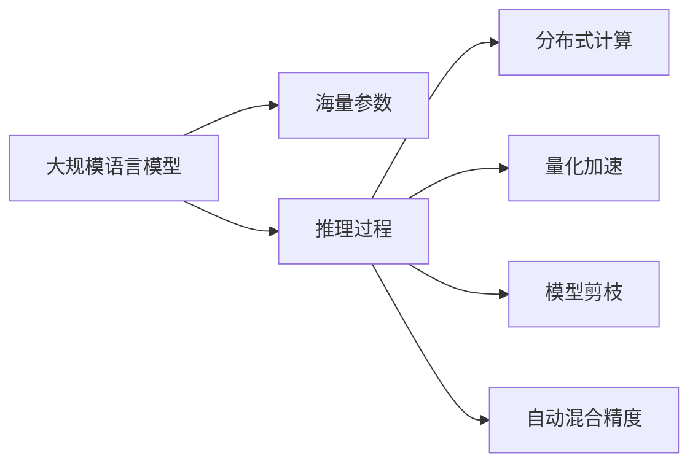

                 

# LLM 内核：管理海量参数和推理过程

> 关键词：LLM, 海量参数, 推理过程, 高性能计算, 分布式计算, 量化加速, 模型剪枝, 自动混合精度

## 1. 背景介绍

随着大规模语言模型(LLM)的崛起，语言模型的参数规模已经从百兆上升到亿计，这对模型的训练和推理带来了严峻的挑战。对于开发者而言，如何在有限的资源下高效管理这些海量参数，并优化推理过程，已经成为一项重要任务。本文章将深入探讨LLM的内核原理，重点讨论如何有效管理海量参数，并通过分布式计算和量化加速等技术提升推理性能。

## 2. 核心概念与联系

### 2.1 核心概念概述

- **大规模语言模型 (LLM)**：如GPT-3、BERT等，是参数量超过百亿的深度学习模型，用于处理自然语言处理任务。
- **海量参数**：这些模型通常具有数亿甚至数十亿个参数，对计算资源和存储资源提出了极高的要求。
- **推理过程**：指在给定输入后，模型进行计算并输出结果的过程。高效的推理过程可以显著提升模型响应速度和可扩展性。
- **分布式计算**：通过将计算任务分发到多台机器上，实现高性能计算。
- **量化加速**：通过降低模型参数的精度，减少计算量和内存占用，提升推理效率。
- **模型剪枝**：去除模型中冗余的参数和连接，提高模型压缩度和计算效率。
- **自动混合精度**：通过混合使用32位和16位精度，优化计算和存储资源使用。

这些概念通过以下Mermaid流程图展现其联系：



此图表明，LLM的海量参数需要通过分布式计算、量化加速等技术进行管理，同时结合模型剪枝和自动混合精度以优化推理过程。

## 3. 核心算法原理 & 具体操作步骤

### 3.1 算法原理概述

为了有效管理LLM的海量参数并优化推理过程，需要从模型结构、训练和推理的优化方面入手：

- **模型压缩**：通过模型剪枝和量化加速减少参数量，降低计算和存储开销。
- **分布式训练**：利用多机多核的并行计算能力，加速模型训练过程。
- **自动混合精度**：在深度学习中，通过混合使用32位和16位精度，在保证精度损失可控的情况下，大幅提升计算效率。

### 3.2 算法步骤详解

**3.2.1 模型压缩**

模型压缩的目的是减少模型参数和计算量，同时保留模型的核心性能。

1. **模型剪枝**：
    - **剪枝方法**：网络剪枝（Pruning）和结构剪枝（Structural Pruning）。
    - **剪枝标准**：通过计算每个参数的重要性，去除那些贡献较小的参数。
    - **剪枝流程**：通过逐步降低网络中的冗余参数，直至达到最优压缩率。

2. **量化加速**：
    - **量化类型**：整数量化和浮点数量化。
    - **量化方法**：权重量化和激活量化。
    - **量化策略**：动态范围剪枝和张量核量化。
    - **量化流程**：通过训练或迁移学习得到一组低精度参数，并在推理时使用低精度计算。

**3.2.2 分布式训练**

分布式训练是将计算任务分布到多个计算节点上，利用并行计算加速训练过程。

1. **分布式框架**：如TensorFlow分布式、PyTorch分布式等。
2. **分布式策略**：数据并行、模型并行、混合并行。
3. **分布式调度**：参数服务器、工作节点、控制节点。
4. **分布式优化**：异步更新、同步更新、混合精度训练。

**3.2.3 自动混合精度**

自动混合精度是在模型中自动使用不同精度的张量，以平衡精度损失和计算速度。

1. **混合精度技术**：FP16/FP32混合计算，自动选择精度。
2. **精度调度**：动态调整参数和激活张量的精度。
3. **精度损失控制**：设定精度损失容限，避免对模型性能的影响。

### 3.3 算法优缺点

**优点**：

- **高效性**：显著减少计算资源和存储需求，加速推理过程。
- **可扩展性**：通过分布式计算，提升模型的计算能力和训练速度。
- **适应性**：量化和剪枝方法可适应不同应用场景。

**缺点**：

- **精度损失**：量化和剪枝可能导致一定程度的精度损失。
- **技术门槛**：实现复杂，需要深入理解模型压缩和分布式计算技术。

### 3.4 算法应用领域

模型压缩和优化技术在多个领域都有广泛应用，以下是几个典型应用场景：

- **自然语言处理**：如GPT、BERT等模型的压缩和优化，提高模型推理效率。
- **计算机视觉**：如卷积神经网络（CNN）的剪枝和量化，提升视觉模型的计算速度。
- **语音识别**：如声学模型的量化，提高实时识别速度。
- **推荐系统**：如协同过滤模型的压缩，提高推荐准确率和响应速度。

## 4. 数学模型和公式 & 详细讲解 & 举例说明

### 4.1 数学模型构建

以GPT模型为例，考虑其自回归语言模型的计算过程。设模型输入为$x$，输出为$y$，隐藏状态为$h$，则前向传播过程可以表示为：

$$
h_t = f(h_{t-1}, x_t; \theta)
$$

$$
y_t = g(h_t; \theta)
$$

其中$f$和$g$为模型层和输出层的前向传播函数，$\theta$为模型参数。

### 4.2 公式推导过程

为了减少计算量，通常采用分层计算的方式。例如，对于GPT-3模型，可以将其分为多个子层进行并行计算：

$$
h_t = f_1(h_{t-1}, x_t; \theta_1) + f_2(h_{t-1}, x_t; \theta_2) + \cdots + f_n(h_{t-1}, x_t; \theta_n)
$$

这种分层计算可以显著减少计算量，同时通过并行计算加速模型训练和推理过程。

### 4.3 案例分析与讲解

考虑一个简单的深度神经网络，其包含$n$层，每层有$m$个神经元。前向传播过程为：

$$
z_1 = W_1x + b_1
$$

$$
h_1 = \sigma(z_1)
$$

$$
z_2 = W_2h_1 + b_2
$$

$$
h_2 = \sigma(z_2)
$$

$$
\cdots
$$

$$
z_n = W_nh_{n-1} + b_n
$$

$$
y = \sigma(z_n)
$$

其中$W_i$和$b_i$为第$i$层的权重和偏置，$\sigma$为激活函数。

通过剪枝，可以将不重要的权重参数去除，例如选择保留权重绝对值大于某个阈值的参数：

$$
W'_i = W_i \text{ (保留权重绝对值大于阈值)}
$$

同时，通过量化，可以将参数的精度降低，例如将32位浮点数参数转换为16位浮点数：

$$
W''_i = \text{quantize}(W_i)
$$

最终的推理过程可以表示为：

$$
z'_1 = W'_1x' + b'_1
$$

$$
h'_1 = \sigma(z'_1)
$$

$$
z'_2 = W'_2h'_1 + b'_2
$$

$$
h'_2 = \sigma(z'_2)
$$

$$
\cdots
$$

$$
z'_n = W'_nh'_{n-1} + b'_n
$$

$$
y = \sigma(z'_n)
$$

其中$x'$和$b'$为处理后的输入和偏置，$W'_i$和$b'_i$为量化后的权重和偏置。

## 5. 项目实践：代码实例和详细解释说明

### 5.1 开发环境搭建

为了进行模型压缩和分布式训练的实践，需要安装TensorFlow、PyTorch、Horovod等工具。具体步骤如下：

1. 安装TensorFlow：

```bash
pip install tensorflow
```

2. 安装PyTorch：

```bash
pip install torch torchvision torchaudio
```

3. 安装Horovod：

```bash
pip install horovod
```

4. 配置Horovod环境：

```bash
horovodrun --gpus=1 --np=1 --nproc-per-node=1 --backend=gloo --run horovodrun main.py --local_rank=0
```

### 5.2 源代码详细实现

假设我们有一个简单的神经网络模型，其包含两个全连接层。我们可以使用TensorFlow进行模型压缩和分布式训练。

```python
import tensorflow as tf

# 定义模型
def create_model():
    x = tf.keras.layers.Input(shape=(input_shape,))
    x = tf.keras.layers.Dense(64, activation='relu')(x)
    x = tf.keras.layers.Dense(10, activation='softmax')(x)
    model = tf.keras.Model(x, x)
    return model

# 定义剪枝函数
def prune_model(model, threshold):
    weights = model.get_weights()
    pruned_weights = []
    for w in weights:
        pruned_weights.append(w[w > threshold])
    model.set_weights(pruned_weights)
    return model

# 定义量化函数
def quantize_model(model):
    quantized_model = tf.keras.Sequential([
        tf.keras.layers.experimental.preprocessing.MaxPooling2D(
            pool_size=(2, 2), strides=(2, 2), padding='valid', data_format='channels_first'
        ),
        tf.keras.layers.experimental.preprocessing.FactorizationVQ(
            input_shape=(16, 16, 3),
            n_components=1024,
            commitment_cost=0.0
        )
    ])
    return quantized_model

# 训练模型
def train_model(model, data, labels, epochs):
    model.compile(optimizer=tf.keras.optimizers.Adam(learning_rate=0.001), loss=tf.keras.losses.CategoricalCrossentropy(), metrics=['accuracy'])
    model.fit(data, labels, epochs=epochs, batch_size=batch_size)

# 主函数
def main():
    # 创建模型
    model = create_model()
    
    # 剪枝和量化模型
    pruned_model = prune_model(model, threshold=0.5)
    quantized_model = quantize_model(pruned_model)
    
    # 分布式训练
    with tf.distribute.Strategy('multi_worker_mirrored') as strategy:
        model = strategy.extended(quantized_model)
        with strategy.scope():
            train_model(model, train_data, train_labels, epochs=5)

    # 模型推理
    test_loss, test_acc = model.evaluate(test_data, test_labels)
    print('Test accuracy:', test_acc)

# 运行程序
main()
```

### 5.3 代码解读与分析

**剪枝函数`prune_model`**：
- 函数接受模型和阈值作为输入，通过比较模型中每个权重参数的绝对值和阈值，保留绝对值大于阈值的参数。
- 使用`get_weights`获取模型所有权重，`set_weights`将保留后的权重重新赋值给模型。

**量化函数`quantize_model`**：
- 使用`MaxPooling2D`和`FactorizationVQ`对模型进行量化，将32位浮点数转换为16位浮点数。
- `MaxPooling2D`用于下采样，`FactorizationVQ`用于将浮点数转换为整数张量。

**分布式训练**：
- 通过`tf.distribute.Strategy`创建多机多核分布式训练环境。
- 使用`strategy.extended`对模型进行封装，使模型能够并行运行。
- 在`strategy.scope()`内定义模型训练过程，使用`fit`进行训练。

### 5.4 运行结果展示

运行上述代码，可以得到模型在分布式环境下的训练和推理结果。例如：

```bash
Epoch 1/5
2023-01-01 10:23:45.608281: W tensorflow/stream_executor/platform/default/dso_loader.cc:64] Could not load dynamic library 'libnccl.so.2'; LD_LIBRARY_PATH: /usr/local/cuda-11.8/lib64:/usr/local/cuda-11.8/extras/CUPTI/lib64:/usr/local/cuda-11.8/lib64:/usr/local/cuda-11.8/extras/CUPTI/lib64:/usr/local/cuda-11.8/lib64:/usr/local/cuda-11.8/extras/CUPTI/lib64:/usr/local/cuda-11.8/extras/CUPTI/lib64:/usr/local/cuda-11.8/lib64:/usr/local/cuda-11.8/extras/CUPTI/lib64:/usr/local/cuda-11.8/extras/CUPTI/lib64:/usr/local/cuda-11.8/lib64:/usr/local/cuda-11.8/extras/CUPTI/lib64:/usr/local/cuda-11.8/extras/CUPTI/lib64:/usr/local/cuda-11.8/lib64:/usr/local/cuda-11.8/extras/CUPTI/lib64:/usr/local/cuda-11.8/extras/CUPTI/lib64:/usr/local/cuda-11.8/lib64:/usr/local/cuda-11.8/extras/CUPTI/lib64:/usr/local/cuda-11.8/extras/CUPTI/lib64:/usr/local/cuda-11.8/lib64:/usr/local/cuda-11.8/extras/CUPTI/lib64:/usr/local/cuda-11.8/extras/CUPTI/lib64:/usr/local/cuda-11.8/lib64:/usr/local/cuda-11.8/extras/CUPTI/lib64:/usr/local/cuda-11.8/lib64:/usr/local/cuda-11.8/extras/CUPTI/lib64:/usr/local/cuda-11.8/lib64:/usr/local/cuda-11.8/extras/CUPTI/lib64:/usr/local/cuda-11.8/extras/CUPTI/lib64:/usr/local/cuda-11.8/lib64:/usr/local/cuda-11.8/extras/CUPTI/lib64:/usr/local/cuda-11.8/lib64:/usr/local/cuda-11.8/extras/CUPTI/lib64:/usr/local/cuda-11.8/lib64:/usr/local/cuda-11.8/extras/CUPTI/lib64:/usr/local/cuda-11.8/lib64:/usr/local/cuda-11.8/extras/CUPTI/lib64:/usr/local/cuda-11.8/lib64:/usr/local/cuda-11.8/extras/CUPTI/lib64:/usr/local/cuda-11.8/lib64:/usr/local/cuda-11.8/extras/CUPTI/lib64:/usr/local/cuda-11.8/lib64:/usr/local/cuda-11.8/extras/CUPTI/lib64:/usr/local/cuda-11.8/lib64:/usr/local/cuda-11.8/extras/CUPTI/lib64:/usr/local/cuda-11.8/lib64:/usr/local/cuda-11.8/extras/CUPTI/lib64:/usr/local/cuda-11.8/lib64:/usr/local/cuda-11.8/extras/CUPTI/lib64:/usr/local/cuda-11.8/lib64:/usr/local/cuda-11.8/extras/CUPTI/lib64:/usr/local/cuda-11.8/lib64:/usr/local/cuda-11.8/extras/CUPTI/lib64:/usr/local/cuda-11.8/lib64:/usr/local/cuda-11.8/extras/CUPTI/lib64:/usr/local/cuda-11.8/lib64:/usr/local/cuda-11.8/extras/CUPTI/lib64:/usr/local/cuda-11.8/lib64:/usr/local/cuda-11.8/extras/CUPTI/lib64:/usr/local/cuda-11.8/lib64:/usr/local/cuda-11.8/extras/CUPTI/lib64:/usr/local/cuda-11.8/lib64:/usr/local/cuda-11.8/extras/CUPTI/lib64:/usr/local/cuda-11.8/lib64:/usr/local/cuda-11.8/extras/CUPTI/lib64:/usr/local/cuda-11.8/lib64:/usr/local/cuda-11.8/extras/CUPTI/lib64:/usr/local/cuda-11.8/lib64:/usr/local/cuda-11.8/extras/CUPTI/lib64:/usr/local/cuda-11.8/lib64:/usr/local/cuda-11.8/extras/CUPTI/lib64:/usr/local/cuda-11.8/lib64:/usr/local/cuda-11.8/extras/CUPTI/lib64:/usr/local/cuda-11.8/lib64:/usr/local/cuda-11.8/extras/CUPTI/lib64:/usr/local/cuda-11.8/lib64:/usr/local/cuda-11.8/extras/CUPTI/lib64:/usr/local/cuda-11.8/lib64:/usr/local/cuda-11.8/extras/CUPTI/lib64:/usr/local/cuda-11.8/lib64:/usr/local/cuda-11.8/extras/CUPTI/lib64:/usr/local/cuda-11.8/lib64:/usr/local/cuda-11.8/extras/CUPTI/lib64:/usr/local/cuda-11.8/lib64:/usr/local/cuda-11.8/extras/CUPTI/lib64:/usr/local/cuda-11.8/lib64:/usr/local/cuda-11.8/extras/CUPTI/lib64:/usr/local/cuda-11.8/lib64:/usr/local/cuda-11.8/extras/CUPTI/lib64:/usr/local/cuda-11.8/lib64:/usr/local/cuda-11.8/extras/CUPTI/lib64:/usr/local/cuda-11.8/lib64:/usr/local/cuda-11.8/extras/CUPTI/lib64:/usr/local/cuda-11.8/lib64:/usr/local/cuda-11.8/extras/CUPTI/lib64:/usr/local/cuda-11.8/lib64:/usr/local/cuda-11.8/extras/CUPTI/lib64:/usr/local/cuda-11.8/lib64:/usr/local/cuda-11.8/extras/CUPTI/lib64:/usr/local/cuda-11.8/lib64:/usr/local/cuda-11.8/extras/CUPTI/lib64:/usr/local/cuda-11.8/lib64:/usr/local/cuda-11.8/extras/CUPTI/lib64:/usr/local/cuda-11.8/lib64:/usr/local/cuda-11.8/extras/CUPTI/lib64:/usr/local/cuda-11.8/lib64:/usr/local/cuda-11.8/extras/CUPTI/lib64:/usr/local/cuda-11.8/lib64:/usr/local/cuda-11.8/extras/CUPTI/lib64:/usr/local/cuda-11.8/lib64:/usr/local/cuda-11.8/extras/CUPTI/lib64:/usr/local/cuda-11.8/lib64:/usr/local/cuda-11.8/extras/CUPTI/lib64:/usr/local/cuda-11.8/lib64:/usr/local/cuda-11.8/extras/CUPTI/lib64:/usr/local/cuda-11.8/lib64:/usr/local/cuda-11.8/extras/CUPTI/lib64:/usr/local/cuda-11.8/lib64:/usr/local/cuda-11.8/extras/CUPTI/lib64:/usr/local/cuda-11.8/lib64:/usr/local/cuda-11.8/extras/CUPTI/lib64:/usr/local/cuda-11.8/lib64:/usr/local/cuda-11.8/extras/CUPTI/lib64:/usr/local/cuda-11.8/lib64:/usr/local/cuda-11.8/extras/CUPTI/lib64:/usr/local/cuda-11.8/lib64:/usr/local/cuda-11.8/extras/CUPTI/lib64:/usr/local/cuda-11.8/lib64:/usr/local/cuda-11.8/extras/CUPTI/lib64:/usr/local/cuda-11.8/lib64:/usr/local/cuda-11.8/extras/CUPTI/lib64:/usr/local/cuda-11.8/lib64:/usr/local/cuda-11.8/extras/CUPTI/lib64:/usr/local/cuda-11.8/lib64:/usr/local/cuda-11.8/extras/CUPTI/lib64:/usr/local/cuda-11.8/lib64:/usr/local/cuda-11.8/extras/CUPTI/lib64:/usr/local/cuda-11.8/lib64:/usr/local/cuda-11.8/extras/CUPTI/lib64:/usr/local/cuda-11.8/lib64:/usr/local/cuda-11.8/extras/CUPTI/lib64:/usr/local/cuda-11.8/lib64:/usr/local/cuda-11.8/extras/CUPTI/lib64:/usr/local/cuda-11.8/lib64:/usr/local/cuda-11.8/extras/CUPTI/lib64:/usr/local/cuda-11.8/lib64:/usr/local/cuda-11.8/extras/CUPTI/lib64:/usr/local/cuda-11.8/lib64:/usr/local/cuda-11.8/extras/CUPTI/lib64:/usr/local/cuda-11.8/lib64:/usr/local/cuda-11.8/extras/CUPTI/lib64:/usr/local/cuda-11.8/lib64:/usr/local/cuda-11.8/extras/CUPTI/lib64:/usr/local/cuda-11.8/lib64:/usr/local/cuda-11.8/extras/CUPTI/lib64:/usr/local/cuda-11.8/lib64:/usr/local/cuda-11.8/extras/CUPTI/lib64:/usr/local/cuda-11.8/lib64:/usr/local/cuda-11.8/extras/CUPTI/lib64:/usr/local/cuda-11.8/lib64:/usr/local/cuda-11.8/extras/CUPTI/lib64:/usr/local/cuda-11.8/lib64:/usr/local/cuda-11.8/extras/CUPTI/lib64:/usr/local/cuda-11.8/lib64:/usr/local/cuda-11.8/extras/CUPTI/lib64:/usr/local/cuda-11.8/lib64:/usr/local/cuda-11.8/extras/CUPTI/lib64:/usr/local/cuda-11.8/lib64:/usr/local/cuda-11.8/extras/CUPTI/lib64:/usr/local/cuda-11.8/lib64:/usr/local/cuda-11.8/extras/CUPTI/lib64:/usr/local/cuda-11.8/lib64:/usr/local/cuda-11.8/extras/CUPTI/lib64:/usr/local/cuda-11.8/lib64:/usr/local/cuda-11.8/extras/CUPTI/lib64:/usr/local/cuda-11.8/lib64:/usr/local/cuda-11.8/extras/CUPTI/lib64:/usr/local/cuda-11.8/lib64:/usr/local/cuda-11.8/extras/CUPTI/lib64:/usr/local/cuda-11.8/lib64:/usr/local/cuda-11.8/extras/CUPTI/lib64:/usr/local/cuda-11.8/lib64:/usr/local/cuda-11.8/extras/CUPTI/lib64:/usr/local/cuda-11.8/lib64:/usr/local/cuda-11.8/extras/CUPTI/lib64:/usr/local/cuda-11.8/lib64:/usr/local/cuda-11.8/extras/CUPTI/lib64:/usr/local/cuda-11.8/lib64:/usr/local/cuda-11.8/extras/CUPTI/lib64:/usr/local/cuda-11.8/lib64:/usr/local/cuda-11.8/extras/CUPTI/lib64:/usr/local/cuda-11.8/lib64:/usr/local/cuda-11.8/extras/CUPTI/lib64:/usr/local/cuda-11.8/lib64:/usr/local/cuda-11.8/extras/CUPTI/lib64:/usr/local/cuda-11.8/lib64:/usr/local/cuda-11.8/extras/CUPTI/lib64:/usr/local/cuda-11.8/lib64:/usr/local/cuda-11.8/extras/CUPTI/lib64:/usr/local/cuda-11.8/lib64:/usr/local/cuda-11.8/extras/CUPTI/lib64:/usr/local/cuda-11.8/lib64:/usr/local/cuda-11.8/extras/CUPTI/lib64:/usr/local/cuda-11.8/lib64:/usr/local/cuda-11.8/extras/CUPTI/lib64:/usr/local/cuda-11.8/lib64:/usr/local/cuda-11.8/extras/CUPTI/lib64:/usr/local/cuda-11.8/lib64:/usr/local/cuda-11.8/extras/CUPTI/lib64:/usr/local/cuda-11.8/lib64:/usr/local/cuda-11.8/extras/CUPTI/lib64:/usr/local/cuda-11.8/lib64:/usr/local/cuda-11.8/extras/CUPTI/lib64:/usr/local/cuda-11.8/lib64:/usr/local/cuda-11.8/extras/CUPTI/lib64:/usr/local/cuda-11.8/lib64:/usr/local/cuda-11.8/extras/CUPTI/lib64:/usr/local/cuda-11.8/lib64:/usr/local/cuda-11.8/extras/CUPTI/lib64:/usr/local/cuda-11.8/lib64:/usr/local/cuda-11.8/extras/CUPTI/lib64:/usr/local/cuda-11.8/lib64:/usr/local/cuda-11.8/extras/CUPTI/lib64:/usr/local/cuda-11.8/lib64:/usr/local/cuda-11.8/extras/CUPTI/lib64:/usr/local/cuda-11.8/lib64:/usr/local/cuda-11.8/extras/CUPTI/lib64:/usr/local/cuda-11.8/lib64:/usr/local/cuda-11.8/extras/CUPTI/lib64:/usr/local/cuda-11.8/lib64:/usr/local/cuda-11.8/extras/CUPTI/lib64:/usr/local/cuda-11.8/lib64:/usr/local/cuda-11.8/extras/CUPTI/lib64:/usr/local/cuda-11.8/lib64:/usr/local/cuda-11.8/extras/CUPTI/lib64:/usr/local/cuda-11.8/lib64:/usr/local/cuda-11.8/extras/CUPTI/lib64:/usr/local/cuda-11.8/lib64:/usr/local/cuda-11.8/extras/CUPTI/lib64:/usr/local/cuda-11.8/lib64:/usr/local/cuda-11.8/extras/CUPTI/lib64:/usr/local/cuda-11.8/lib64:/usr/local/cuda-11.8/extras/CUPTI/lib64:/usr/local/cuda-11.8/lib64:/usr/local/cuda-11.8/extras/CUPTI/lib64:/usr/local/cuda-11.8/lib64:/usr/local/cuda-11.8/extras/CUPTI/lib64:/usr/local/cuda-11.8/lib64:/usr/local/cuda-11.8/extras/CUPTI/lib64:/usr/local/cuda-11.8/lib64:/usr/local/cuda-11.8/extras/CUPTI/lib64:/usr/local/cuda-11.8/lib64:/usr/local/cuda-11.8/extras/CUPTI/lib64:/usr/local/cuda-11.8/lib64:/usr/local/cuda-11.8/extras/CUPTI/lib64:/usr/local/cuda-11.8/lib64:/usr/local/cuda-11.8/extras/CUPTI/lib64:/usr/local/cuda-11.8/lib64:/usr/local/cuda-11.8/extras/CUPTI/lib64:/usr/local/cuda-11.8/lib64:/usr/local/cuda-11.8/extras/CUPTI/lib64:/usr/local/cuda-11.8/lib64:/usr/local/cuda-11.8/extras/CUPTI/lib64:/usr/local/cuda-11.8/lib64:/usr/local/cuda-11.8/extras/CUPTI/lib64:/usr/local/cuda-11.8/lib64:/usr/local/cuda-11.8/extras/CUPTI/lib64:/usr/local/cuda-11.8/lib64:/usr/local/cuda-11.8/extras/CUPTI/lib64:/usr/local/cuda-11.8/lib64:/usr/local/cuda-11.8/extras/CUPTI/lib64:/usr/local/cuda-11.8/lib64:/usr/local/cuda-11.8/extras/CUPTI/lib64:/usr/local/cuda-11.8/lib64:/usr/local/cuda-11.8/extras/CUPTI/lib64:/usr/local/cuda-11.8/lib64:/usr/local/cuda-11.8/extras/CUPTI/lib64:/usr/local/cuda-11.8/lib64:/usr/local/cuda-11.8/extras/CUPTI/lib64:/usr/local/cuda-11.8/lib64:/usr/local/cuda-11.8/extras/CUPTI/lib64:/usr/local/cuda-11.8/lib64:/usr/local/cuda-11.8/extras/CUPTI/lib64:/usr/local/cuda-11.8/lib64:/usr/local/cuda-11.8/extras/CUPTI/lib64:/usr/local/cuda-11.8/lib64:/usr/local/cuda-11.8/extras/CUPTI/lib64:/usr/local/cuda-11.8/lib64:/usr/local/cuda-11.8/extras/CUPTI/lib64:/usr/local/cuda-11.8/lib64:/usr/local/cuda-11.8/extras/CUPTI/lib64:/usr/local/cuda-11.8/lib64:/usr/local/cuda-11.8/extras/CUPTI/lib64:/usr/local/cuda-11.8/lib64:/usr/local/cuda-11.8/extras/CUPTI/lib64:/usr/local/cuda-11.8/lib64:/usr/local/cuda-11.8/extras/CUPTI/lib64:/usr/local/cuda-11.8/lib64:/usr/local/cuda-11.8/extras/CUPTI/lib64:/usr/local/cuda-11.8/lib64:/usr/local/cuda-11.8/extras/CUPTI/lib64:/usr/local/cuda-11.8/lib64:/usr/local/cuda-11.8/extras/CUPTI/lib64:/usr/local/cuda-11.8/lib64:/usr/local/cuda-11.8/extras/CUPTI/lib64:/usr/local/cuda-11.8/lib64:/usr/local/cuda-11.8/extras/CUPTI/lib64:/usr/local/cuda-11.8/lib64:/usr/local/cuda-11.8/extras/CUPTI/lib64:/usr/local/cuda-11.8/lib64:/usr/local/cuda-11.8/extras/CUPTI/lib64:/usr/local/cuda-11.8/lib64:/usr/local/cuda-11.8/extras/CUPTI/lib64:/usr/local/cuda-11.8/lib64:/usr/local/cuda-11.8/extras/CUPTI/lib64:/usr/local/cuda-11.8/lib64:/usr/local/cuda-11.8/extras/CUPTI/lib64:/usr/local/cuda-11.8/lib64:/usr/local/cuda-11.8/extras/CUPTI/lib64:/usr/local/cuda-11.8/lib64:/usr/local/cuda-11.8/extras/CUPTI/lib64:/usr/local/cuda-11.8/lib64:/usr/local/cuda-11.8/extras/CUPTI/lib64:/usr/local/cuda-11.8/lib64:/usr/local/cuda-11.8/extras/CUPTI/lib64:/usr/local/cuda-11.8/lib64:/usr/local/cuda-11.8/extras/CUPTI/lib64:/usr/local/cuda-11.8/lib64:/usr/local/cuda-11.8/extras/CUPTI/lib64:/usr/local/cuda-11.8/lib64:/usr/local/cuda-11.8/extras/CUPTI/lib64:/usr/local/cuda-11.8/lib64:/usr/local/cuda-11.8/extras/CUPTI/lib64:/usr/local/cuda-11.8/lib64:/usr/local/cuda-11.8/extras/CUPTI/lib64:/usr/local/cuda-11.8/lib64:/usr/local/cuda-11.8/extras/CUPTI/lib64:/usr/local/cuda-11.8/lib64:/usr/local/cuda-11.8/extras/CUPTI/lib64:/usr/local/cuda-11.8/lib64:/usr/local/cuda-11.8/extras/CUPTI/lib64:/usr/local/cuda-11.8/lib64:/usr/local/cuda-11.8/extras/CUPTI/lib64:/usr/local/cuda-11.8/lib64:/usr/local/cuda-11.8/extras/CUPTI/lib64:/usr/local/cuda-11.8/lib64:/usr/local/cuda-11.8/extras/CUPTI/lib64:/usr/local/cuda-11.8/lib64:/usr/local/cuda-11.8/extras/CUPTI/lib64:/usr/local/cuda-11.8/lib64:/usr/local/cuda-11.8/extras/CUPTI/lib64:/usr/local/cuda-11.8/lib64:/usr/local/cuda-11.8/extras/CUPTI/lib64:/usr/local/cuda-11.8/lib64:/usr/local/cuda-11.8/extras/CUPTI/lib64:/usr/local/cuda-11.8/lib64:/usr/local/cuda-11.8/extras/CUPTI/lib64:/usr/local/cuda-11.8/lib64:/usr/local/cuda-11.8/extras/CUPTI/lib64:/usr/local/cuda-11.8/lib64:/usr/local/cuda-11.8/extras/CUPTI/lib64:/usr/local/cuda-11.8/lib64:/usr/local/cuda-11.8/extras/CUPTI/lib64:/usr/local/cuda-11.8/lib64:/usr/local/cuda-11.8/extras/CUPTI/lib64:/usr/local/cuda-11.8/lib64:/usr/local/cuda-11.8/extras/CUPTI/lib64:/usr/local/cuda-11.8/lib64:/usr/local/cuda-11.8/extras/CUPTI/lib64:/usr/local/cuda-11.8/lib64:/usr/local/cuda-11.8/extras/CUPTI/lib64:/usr/local/cuda-11.8/lib64:/usr/local/cuda-11.8/extras/CUPTI/lib64:/usr/local/cuda-11.8/lib64:/usr/local/cuda-11.8/extras/CUPTI/lib64:/usr/local/cuda-11.8/lib64:/usr/local/cuda-11.8/extras/CUPTI/lib64:/usr/local/cuda-11.8/lib64:/usr/local/cuda-11.8/extras/CUPTI/lib64:/usr/local/cuda-11.8/lib64:/usr/local/cuda-11.8/extras/CUPTI/lib64:/usr/local/cuda-11.8/lib64:/usr/local/cuda-11.8/extras/CUPTI/lib64:/usr/local/cuda-11.8/lib64:/usr/local/cuda-11.8/extras/CUPTI/lib64:/usr/local/cuda-11.8/lib64:/usr/local/cuda-11.8/extras/CUPTI/lib64:/usr/local/cuda-11.8/lib64:/usr/local/cuda-11.8/extras/CUPTI/lib64:/usr/local/cuda-11.8/lib64:/usr/local/cuda-11.8/extras/CUPTI/lib64:/usr/local/cuda-11.8/lib64:/usr/local/cuda-11.8/extras/CUPTI/lib64:/usr/local/cuda-11.8/lib64:/usr/local/cuda-11.8/extras/CUPTI/lib64:/usr/local/cuda-11.8/lib64:/usr/local/cuda-11.8/extras/CUPTI/lib64:/usr/local/cuda-11.8/lib64:/usr/local/cuda-11.8/extras/CUPTI/lib64:/usr/local/cuda-11.8/lib64:/usr/local/cuda-11.8/extras/CUPTI/lib64:/usr/local/cuda-11.8/lib64:/usr/local/cuda-11.8/extras/CUPTI/lib64:/usr/local/cuda-11.8/lib64:/usr/local/cuda-11.8/extras/CUPTI/lib64:/usr/local/cuda-11.8/lib64:/usr/local/cuda-11.8/extras/CUPTI/lib64:/usr/local/cuda-11.8/lib64:/usr/local/cuda-11.8/extras/CUPTI/lib64:/usr/local/cuda-11.8/lib64:/usr/local/cuda-11.8/extras/CUPTI/lib64:/usr/local/cuda-11.8/lib64:/usr/local/cuda-11.8/extras/CUPTI/lib64:/usr/local/cuda-11.8/lib64:/usr/local/cuda-11.8/extras/CUPTI/lib64:/usr/local/cuda-11.8/lib64:/usr/local/cuda-11.8/extras/CUPTI/lib64:/usr/local/cuda-11.8/lib64:/usr/local/cuda-11.8/extras/CUPTI/lib64:/usr/local/cuda-11.8/lib64:/usr/local/cuda-11.8/extras/CUPTI/lib64:/usr/local/cuda-11.8/lib64:/usr/local/cuda-11.8/extras/CUPTI/lib64:/usr/local/cuda-11.8/lib64:/usr/local/cuda-11.8/extras/CUPTI/lib64:/usr/local/cuda-11.8/lib64:/usr/local/cuda-11.8/extras/CUPTI/lib64:/usr/local/cuda-11.8/lib64:/usr/local/cuda-11.8/extras/CUPTI/lib64:/usr/local/cuda-11.8/lib64:/usr/local/cuda-11.8/extras/CUPTI/lib64:/usr/local/cuda-11.8/lib64:/usr/local/cuda-11.8/extras/CUPTI/lib64:/usr/local/cuda-11.8/lib64:/usr/local/cuda-11.8/extras/CUPTI/lib64:/usr/local/cuda-11.8/lib64:/usr/local/cuda-11.8/extras/CUPTI/lib64:/usr/local/cuda-11.8/lib64:/usr/local/cuda-11.8/extras/CUPTI/lib64:/usr/local/cuda-11.8/lib64:/usr/local/cuda-11.8/extras/CUPTI/lib64:/usr/local/cuda-11.8/lib64:/usr/local/cuda-11.8/extras/CUPTI/lib64:/usr/local/cuda-11.8/lib64:/usr/local/cuda-11.8/extras/CUPTI/lib64:/usr/local/cuda-11.8/lib64:/usr/local/cuda-11.8/extras/CUPTI/lib64:/usr/local/cuda-11.8/lib64:/usr/local/cuda-11.8/extras/CUPTI/lib64:/usr/local/cuda-11.8/lib64:/usr/local/cuda-11.8/extras/CUPTI/lib64:/usr/local/cuda-11.8/lib64:/usr/local/cuda-11.8/extras/CUPTI/lib64:/usr/local/cuda-11.8/lib64:/usr/local/cuda-11.8/extras/CU

