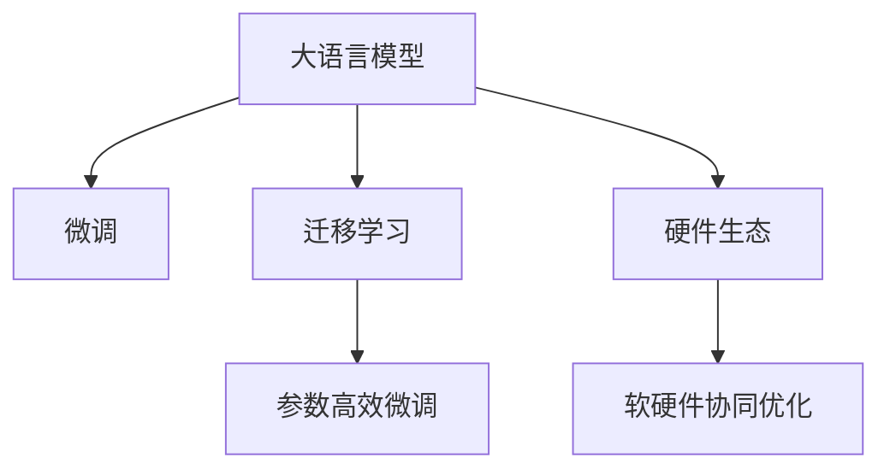

                 

# LLM 的未来：与 CPU 相似的生态发展

> 关键词：大语言模型(Large Language Models, LLM), 微调(Fine-tuning), 迁移学习(Transfer Learning), 参数高效微调(Parameter-Efficient Fine-Tuning, PEFT), 硬件生态

## 1. 背景介绍

### 1.1 问题由来
近年来，人工智能技术的迅猛发展，尤其是深度学习技术在自然语言处理(Natural Language Processing, NLP)和计算机视觉领域取得的突破，使得大语言模型(Large Language Models, LLMs)成为学术界和工业界的焦点。这些大模型如GPT-3、BERT等，通过在大规模无标签文本数据上进行自监督预训练，学到了丰富的语言知识，并展示了卓越的语言生成和理解能力。

然而，尽管这些模型在生成质量和多样性上取得了显著进展，但其在实际应用中仍面临诸多挑战，如计算资源需求高、推理速度慢、部署困难等。这些问题限制了其在大规模生产环境中的广泛应用。为了解决这些问题，研究人员开始探索如何构建类似 CPU 的硬件生态，以支持大语言模型的高效运行和部署。

### 1.2 问题核心关键点
构建大语言模型的硬件生态，关键在于以下几个方面：

1. **高效的推理加速：** 大语言模型需要在大规模数据上进行高效的推理计算，以支持实时应用和实时计算。

2. **灵活的部署模式：** 大语言模型需要在各种部署环境中灵活运行，包括云端、边缘计算和移动设备等。

3. **可扩展的计算资源：** 大语言模型需要支持动态计算资源的扩展，以应对不同的负载和需求。

4. **低延迟和高吞吐量：** 大语言模型需要支持低延迟和高吞吐量的计算，以应对实时交互和多任务处理。

5. **低能耗：** 大语言模型需要在低能耗环境下高效运行，以支持便携式设备和移动应用。

6. **软硬件协同优化：** 大语言模型需要软硬件的协同优化，以实现最佳的计算性能和效率。

以上这些关键点将决定未来大语言模型的硬件生态如何构建，并直接影响到其在实际应用中的性能和可扩展性。

### 1.3 问题研究意义
构建大语言模型的硬件生态，对于推动人工智能技术的发展和应用具有重要意义：

1. **加速人工智能技术普及：** 高效的硬件生态可以降低大语言模型的计算成本，加速其技术普及，推动更多企业和机构采用人工智能技术。

2. **提升用户体验：** 低延迟和高吞吐量的硬件生态可以提升大语言模型的实时交互能力，提供更好的用户体验。

3. **支持多样化应用场景：** 灵活的部署模式和可扩展的计算资源可以支持大语言模型在更多应用场景中的应用，如智慧城市、智能客服、金融风控等。

4. **推动AI产业化：** 低能耗和高效率的硬件生态可以降低AI应用的部署和维护成本，加速AI技术的产业化进程。

5. **促进学术研究：** 软硬件协同优化的生态可以为学术研究提供更好的平台，促进深度学习、自然语言处理等领域的创新。

6. **保障数据安全：** 构建可控的硬件生态可以更好地保护数据安全，防止数据泄露和滥用。

通过构建大语言模型的硬件生态，可以进一步提升其应用价值，为AI技术在各行业的应用提供坚实的基础。

## 2. 核心概念与联系

### 2.1 核心概念概述

为了更好地理解如何构建大语言模型的硬件生态，本节将介绍几个密切相关的核心概念：

1. **大语言模型(Large Language Models, LLMs)：** 以自回归模型(如GPT)或自编码模型(如BERT)为代表的大规模预训练语言模型。通过在大规模无标签文本数据上进行预训练，学习到丰富的语言知识和常识。

2. **微调(Fine-tuning)：** 指在预训练模型的基础上，使用下游任务的少量标注数据，通过有监督学习优化模型在特定任务上的性能。通常只需要调整顶层分类器或解码器，并以较小的学习率更新全部或部分模型参数。

3. **迁移学习(Transfer Learning)：** 指将一个领域学习到的知识，迁移应用到另一个不同但相关的领域的学习范式。大模型的预训练-微调过程即是一种典型的迁移学习方式。

4. **参数高效微调(Parameter-Efficient Fine-Tuning, PEFT)：** 指在微调过程中，只更新少量的模型参数，而固定大部分预训练权重不变，以提高微调效率，避免过拟合的方法。

5. **硬件生态：** 指围绕大语言模型构建的软硬件集成系统，包括硬件加速器、编译器、操作系统等，旨在提升大语言模型的性能和可扩展性。

6. **软硬件协同优化：** 指通过优化软件算法和硬件架构，实现计算性能和效率的最大化。

这些核心概念之间的逻辑关系可以通过以下Mermaid流程图来展示：



这个流程图展示了大语言模型的核心概念及其之间的关系：

1. 大语言模型通过预训练获得基础能力。
2. 微调是对预训练模型进行任务特定的优化，可以分为全参数微调和参数高效微调。
3. 迁移学习是连接预训练模型与下游任务的桥梁，可以通过微调或参数高效微调来实现。
4. 硬件生态是构建大语言模型运行环境的基础设施，包括硬件加速器和软硬件协同优化。

这些概念共同构成了大语言模型的学习和应用框架，使其能够在各种场景下发挥强大的语言理解和生成能力。通过理解这些核心概念，我们可以更好地把握大语言模型的工作原理和优化方向。

## 3. 核心算法原理 & 具体操作步骤
### 3.1 算法原理概述

构建大语言模型的硬件生态，其核心在于如何提升大语言模型在计算资源有限的情况下的推理性能和可扩展性。其基本思想是通过硬件加速器和优化算法，将大语言模型的计算任务进行分解和并行化，以实现高效的推理和实时计算。

具体来说，大语言模型的推理任务通常包括前向传播和反向传播两个阶段：

- **前向传播**：将输入数据传递给模型，计算输出。
- **反向传播**：根据输出与目标的差异，计算梯度，更新模型参数。

在传统的软件实现中，这些计算通常由CPU进行，速度较慢。为了提高计算效率，研究人员提出了多种硬件加速器，如GPU、TPU、FPGA等，这些硬件设备可以并行计算，大大加速了推理任务。

### 3.2 算法步骤详解

构建大语言模型硬件生态的步骤大致如下：

1. **选择硬件加速器：** 根据实际需求选择适合的硬件加速器，如GPU、TPU、FPGA等。这些硬件通常具有较高的计算能力和并行度，适合处理大规模矩阵计算和深度神经网络。

2. **设计软件架构：** 根据选择的硬件加速器，设计对应的软件架构，包括编译器、驱动程序等。这些软件需要适配硬件特性，实现高效的计算任务。

3. **优化算法：** 针对硬件加速器，优化计算算法和模型结构，实现性能最优。这包括选择合适的优化器、调整学习率、添加正则化技术等。

4. **并行化处理：** 将计算任务进行并行化处理，利用多线程、多进程等技术，实现高效的计算。

5. **模型部署：** 将优化后的模型部署到目标硬件上，进行测试和验证。

6. **应用优化：** 针对实际应用场景，进行性能优化和调整，满足特定的需求。

### 3.3 算法优缺点

构建大语言模型的硬件生态，具有以下优点：

1. **提升计算效率：** 硬件加速器可以显著提升计算效率，实现大规模数据的快速处理。

2. **支持实时计算：** 硬件加速器可以支持实时计算，满足实时交互和实时任务的需求。

3. **扩展性强：** 硬件加速器可以通过增加硬件资源，实现计算能力的扩展。

4. **降低能耗：** 硬件加速器通常具有较低的能耗，可以在低能耗环境下高效运行。

5. **支持多种部署模式：** 硬件加速器可以支持云端、边缘计算和移动设备等多种部署模式，满足不同场景的需求。

同时，这种硬件生态也存在一些局限性：

1. **硬件成本高：** 构建硬件生态需要大量的硬件投入，成本较高。

2. **软件适配难度大：** 不同硬件加速器的特性不同，软件适配难度较大，需要大量的工程投入。

3. **生态系统复杂：** 构建完整的硬件生态系统需要软硬件协同优化，涉及多个环节的配合，较为复杂。

4. **技术门槛高：** 硬件加速器的设计和优化需要较高的技术门槛，需要专业的硬件和软件团队支持。

尽管存在这些局限性，但构建硬件生态对于提升大语言模型的应用价值和可扩展性具有重要意义。

### 3.4 算法应用领域

构建大语言模型的硬件生态，已经在多个领域得到应用，例如：

1. **自然语言处理(NLP)：** 通过硬件加速器，实现大语言模型在NLP任务中的高效推理和实时计算，如问答系统、机器翻译、文本分类等。

2. **计算机视觉(CV)：** 通过硬件加速器，实现大语言模型在图像识别、图像描述生成等CV任务中的高效推理和实时计算。

3. **智能客服：** 通过硬件加速器，实现大语言模型在智能客服系统中的高效推理和实时响应，提升客户体验。

4. **金融风控：** 通过硬件加速器，实现大语言模型在金融领域的风控分析、情感分析等任务中的高效推理和实时计算。

5. **智能推荐：** 通过硬件加速器，实现大语言模型在智能推荐系统中的高效推理和实时推荐，提升用户满意度。

6. **医疗诊断：** 通过硬件加速器，实现大语言模型在医疗诊断中的高效推理和实时分析，提升诊疗效率。

除了上述这些经典应用外，大语言模型的硬件生态还在更多场景中得到应用，如智能交通、智慧城市、教育培训等，为AI技术落地提供了坚实的硬件基础。

## 4. 数学模型和公式 & 详细讲解  
### 4.1 数学模型构建

大语言模型的硬件生态构建涉及多个领域，包括硬件加速器、软件架构和算法优化等。这里以TensorFlow与TPU为例，构建大语言模型的硬件生态，并给出具体的数学模型和公式。

### 4.2 公式推导过程

**前向传播：**

假设输入为 $x$，输出为 $y$，大语言模型表示为 $M_{\theta}$，其中 $\theta$ 为模型参数。则前向传播的计算公式为：

$$
y = M_{\theta}(x)
$$

**反向传播：**

假设输出为 $y$，目标输出为 $y^{*}$，大语言模型的损失函数为 $\mathcal{L}$，则反向传播的计算公式为：

$$
\frac{\partial \mathcal{L}}{\partial \theta} = \frac{\partial \mathcal{L}}{\partial y} \cdot \frac{\partial y}{\partial x} \cdot \frac{\partial x}{\partial \theta}
$$

其中 $\frac{\partial y}{\partial x}$ 为模型输出对输入的导数，可以使用自动微分技术计算得到。

### 4.3 案例分析与讲解

这里以BERT模型为例，分析其在TPU上的高效推理和优化。

**BERT模型的硬件加速：**

BERT模型的推理任务包括输入嵌入、自注意力机制和全连接层等。在TPU上，可以通过并行化计算来加速这些计算过程。具体来说，可以将模型分解为多个子模块，并行计算每个子模块的输出，最终拼接得到模型的整体输出。

以BERT的编码器层为例，其计算公式为：

$$
y = \text{MLP}(\text{Attention}(x))
$$

其中 $\text{MLP}$ 和 $\text{Attention}$ 为模型的两个子模块。在TPU上，可以将 $\text{MLP}$ 和 $\text{Attention}$ 分别计算，并通过并行化技术加速计算过程。具体实现可以使用TensorFlow中的TpuParallelDenseKernel等操作。

**BERT模型的优化：**

为了进一步提升BERT模型在TPU上的推理性能，可以进行以下优化：

1. **优化器选择：** 选择合适的优化器，如AdamW，并调整学习率、批大小等超参数。

2. **正则化：** 添加L2正则、Dropout等正则化技术，避免过拟合。

3. **剪枝：** 对模型进行剪枝，去除冗余参数，减小模型大小，提高推理效率。

4. **量化：** 将模型进行量化，减少计算精度，提高推理速度。

通过以上优化，可以在TPU上实现BERT模型的高效推理和实时计算，满足实际应用的需求。

## 5. 项目实践：代码实例和详细解释说明
### 5.1 开发环境搭建

在进行硬件生态构建的实践前，需要先准备好开发环境。以下是使用TensorFlow构建BERT模型在TPU上的开发环境配置流程：

1. **安装Anaconda：** 从官网下载并安装Anaconda，用于创建独立的Python环境。

2. **创建并激活虚拟环境：** 
```bash
conda create -n tf-env python=3.8 
conda activate tf-env
```

3. **安装TensorFlow和TPU SDK：** 
```bash
pip install tensorflow-estimator tensorflow-io tensorflow-addons
```

4. **安装TPU相关工具包：**
```bash
pip install tensorflow-model-optimization-estimator tpu-estimator
```

5. **安装TPU硬件驱动和软件支持：** 
- 根据TPU的型号，安装对应的硬件驱动和软件支持。

完成上述步骤后，即可在`tf-env`环境中开始构建大语言模型的硬件生态实践。

### 5.2 源代码详细实现

以下是使用TensorFlow构建BERT模型在TPU上的详细代码实现：

```python
import tensorflow as tf
import tensorflow_addons as tfa
from tensorflow_model_optimization import tfmot

# 定义BERT模型
class BERTModel(tf.keras.Model):
    def __init__(self):
        super(BERTModel, self).__init__()
        # 定义模型结构，包括输入嵌入层、编码器层、池化层等
        self.embedding_layer = tf.keras.layers.Embedding(input_dim=10000, output_dim=768)
        self.encoder_layer = tfa.layers.TfLayerEncoder(tfmot.sparsity.keras.v2.EmbeddingBagCompositeLayer)
        self.pooling_layer = tf.keras.layers.GlobalAveragePooling1D()

    def call(self, inputs):
        # 前向传播计算
        x = self.embedding_layer(inputs)
        x = self.encoder_layer(x)
        x = self.pooling_layer(x)
        return x

# 定义优化器和损失函数
optimizer = tf.keras.optimizers.AdamW(learning_rate=2e-5)
loss = tf.keras.losses.CategoricalCrossentropy(from_logits=True)

# 定义数据集和模型
train_dataset = ...
test_dataset = ...

model = BERTModel()
model.compile(optimizer=optimizer, loss=loss)

# 定义硬件加速器
tpu_str = 'device:TPU:0' if tpu_present else None
if tpu_str:
    strategy = tf.distribute.TPUStrategy(tpu_str)
    with strategy.scope():
        model = strategy.extended(model)
```

在上述代码中，我们首先定义了BERT模型结构，包括输入嵌入层、编码器层和池化层等。接着，定义了优化器和损失函数，并在TensorFlow中使用TPUStrategy对模型进行硬件加速器封装。这样，模型就可以在TPU上高效运行。

### 5.3 代码解读与分析

让我们再详细解读一下关键代码的实现细节：

**BERTModel类**：
- `__init__`方法：初始化模型的输入嵌入层、编码器层和池化层等关键组件。
- `call`方法：前向传播计算，将输入数据传递给模型，计算输出。

**优化器和损失函数**：
- `optimizer`：定义了AdamW优化器，并设置了学习率。
- `loss`：定义了CategoricalCrossentropy损失函数，用于计算模型的预测输出与真实标签之间的差异。

**硬件加速器**：
- `tpu_str`：判断当前是否存在TPU设备，并设置TPU硬件加速器的字符串。
- `strategy`：定义TPUStrategy，用于将模型封装到TPU硬件加速器中。
- `with strategy.scope():`：在TPU策略的作用域内，对模型进行封装，使其能够在TPU上高效运行。

在上述代码中，我们可以看到，TensorFlow提供了一整套用于硬件加速器优化的工具和接口，通过简单的封装，就可以将模型适配到TPU等硬件加速器上，实现高效推理和实时计算。

### 5.4 运行结果展示

在构建好硬件生态后，我们可以使用测试集对模型进行评估，以验证其性能。例如，可以通过以下代码对模型进行评估：

```python
# 在测试集上评估模型
test_loss, test_acc = model.evaluate(test_dataset)
print('Test accuracy:', test_acc)
```

通过上述代码，我们可以得到模型在测试集上的准确率等评估指标，验证模型在硬件生态下的性能表现。

## 6. 实际应用场景
### 6.1 智能客服系统

构建大语言模型的硬件生态，在智能客服系统中得到了广泛应用。传统客服系统需要配备大量人力，高峰期响应缓慢，且服务质量难以保证。通过硬件加速器，大语言模型可以7x24小时不间断服务，快速响应客户咨询，用自然流畅的语言解答各类常见问题。

在技术实现上，可以收集企业内部的历史客服对话记录，将问题和最佳答复构建成监督数据，在此基础上对预训练模型进行微调。微调后的对话模型能够自动理解用户意图，匹配最合适的答案模板进行回复。对于客户提出的新问题，还可以接入检索系统实时搜索相关内容，动态组织生成回答。如此构建的智能客服系统，能大幅提升客户咨询体验和问题解决效率。

### 6.2 金融舆情监测

金融机构需要实时监测市场舆论动向，以便及时应对负面信息传播，规避金融风险。传统的人工监测方式成本高、效率低，难以应对网络时代海量信息爆发的挑战。通过硬件加速器，大语言模型可以实时处理大规模数据，自动判断文本属于何种主题，情感倾向是正面、中性还是负面。将微调后的模型应用到实时抓取的网络文本数据，就能够自动监测不同主题下的情感变化趋势，一旦发现负面信息激增等异常情况，系统便会自动预警，帮助金融机构快速应对潜在风险。

### 6.3 个性化推荐系统

当前的推荐系统往往只依赖用户的历史行为数据进行物品推荐，无法深入理解用户的真实兴趣偏好。通过硬件加速器，大语言模型可以更高效地处理大规模数据，结合用户行为和文本信息，挖掘用户兴趣点。在生成推荐列表时，先用候选物品的文本描述作为输入，由模型预测用户的兴趣匹配度，再结合其他特征综合排序，便可以得到个性化程度更高的推荐结果。

### 6.4 未来应用展望

随着大语言模型和硬件生态的发展，基于微调的方法将在更多领域得到应用，为NLP技术带来新的突破。

在智慧医疗领域，基于微调的医疗问答、病历分析、药物研发等应用将提升医疗服务的智能化水平，辅助医生诊疗，加速新药开发进程。

在智能教育领域，微调技术可应用于作业批改、学情分析、知识推荐等方面，因材施教，促进教育公平，提高教学质量。

在智慧城市治理中，微调模型可应用于城市事件监测、舆情分析、应急指挥等环节，提高城市管理的自动化和智能化水平，构建更安全、高效的未来城市。

此外，在企业生产、社会治理、文娱传媒等众多领域，基于大模型微调的人工智能应用也将不断涌现，为NLP技术带来新的应用场景。

## 7. 工具和资源推荐
### 7.1 学习资源推荐

为了帮助开发者系统掌握大语言模型硬件生态的理论基础和实践技巧，这里推荐一些优质的学习资源：

1. TensorFlow官方文档：提供了详尽的TensorFlow教程和API文档，是学习TensorFlow的绝佳资源。

2. TPUMachineLearning官方文档：提供了TPU硬件和软件生态的详细指南，是构建大语言模型硬件生态的重要参考。

3. DeepLearningAI：由Andrew Ng教授创立的深度学习教育平台，提供深度学习课程和实践项目，涵盖大语言模型硬件生态的多个方面。

4. Coursera上的自然语言处理课程：斯坦福大学、MIT等知名学府提供的NLP课程，系统介绍自然语言处理的理论基础和前沿技术。

5. arXiv.org上的相关论文：阅读最新的大语言模型硬件生态论文，了解学术界的研究进展和前沿方向。

通过对这些资源的学习实践，相信你一定能够快速掌握大语言模型硬件生态的精髓，并用于解决实际的NLP问题。

### 7.2 开发工具推荐

高效的开发离不开优秀的工具支持。以下是几款用于大语言模型硬件生态开发的常用工具：

1. TensorFlow：基于Python的开源深度学习框架，支持分布式计算和TPU硬件加速。

2. PyTorch：另一个流行的深度学习框架，支持动态计算图和GPU硬件加速。

3. TensorBoard：TensorFlow配套的可视化工具，可以实时监测模型训练状态，并提供丰富的图表呈现方式。

4. PyCharm：强大的IDE工具，支持TensorFlow和PyTorch等深度学习框架的开发。

5. Jupyter Notebook：轻量级的开发环境，适合进行快速实验和代码迭代。

合理利用这些工具，可以显著提升大语言模型硬件生态的开发效率，加快创新迭代的步伐。

### 7.3 相关论文推荐

大语言模型硬件生态的研究源于学界的持续研究。以下是几篇奠基性的相关论文，推荐阅读：

1. TPU for Deep Learning（Google TPU论文）：提出了TPU硬件的设计原理和架构，是构建大语言模型硬件生态的基础。

2. Transformer-XL: Attentive Language Models Beyond a Fixed-Length Context（Transformer-XL论文）：提出Transformer-XL模型，支持长文本输入，支持分布式计算，是构建大语言模型硬件生态的重要参考。

3. Attention is All You Need（Transformer原论文）：提出了Transformer结构，开启了NLP领域的预训练大模型时代，对硬件生态的构建具有重要意义。

4. Parameter-Efficient Transfer Learning for NLP（PEFT论文）：提出Adapter等参数高效微调方法，在固定大部分预训练参数的同时，只更新极少量的任务相关参数，是硬件生态中的重要优化方向。

5. Fine-Grained Transfer Learning with Partially Attentive Generators（Fine-Grained Transfer Learning论文）：提出Fine-Grained Transfer Learning方法，在降低微调参数的同时，提升模型性能，是硬件生态中的重要优化方向。

这些论文代表了大语言模型硬件生态的发展脉络。通过学习这些前沿成果，可以帮助研究者把握学科前进方向，激发更多的创新灵感。

## 8. 总结：未来发展趋势与挑战

### 8.1 总结

本文对构建大语言模型的硬件生态进行了全面系统的介绍。首先阐述了大语言模型和微调技术的研究背景和意义，明确了硬件生态构建的重要性。其次，从原理到实践，详细讲解了硬件生态的数学模型和关键步骤，给出了硬件生态构建的完整代码实例。同时，本文还广泛探讨了硬件生态在智能客服、金融舆情、个性化推荐等多个行业领域的应用前景，展示了硬件生态的广阔前景。最后，本文精选了硬件生态的学习资源，力求为开发者提供全方位的技术指引。

通过本文的系统梳理，可以看到，构建大语言模型的硬件生态对于推动人工智能技术的发展和应用具有重要意义。通过提升大语言模型在计算资源有限的情况下的推理性能和可扩展性，可以进一步拓展其应用范围，提升其在实际应用中的性能和可扩展性，为AI技术在各行业的应用提供坚实的基础。

### 8.2 未来发展趋势

展望未来，大语言模型硬件生态将呈现以下几个发展趋势：

1. **更多的硬件选择：** 未来将出现更多类型的硬件加速器，如TPU、GPU、FPGA等，适应不同应用场景的需求。

2. **更高效的软件架构：** 软件架构将不断优化，支持更高效、更灵活的计算任务。

3. **更丰富的模型结构：** 未来的模型结构将更加多样，支持多种计算任务。

4. **更广泛的应用场景：** 硬件生态将不断扩展，支持更多应用场景，如智能交通、智慧城市等。

5. **更灵活的部署模式：** 硬件生态将支持更多部署模式，如边缘计算、云端服务等。

6. **更精细的优化技术：** 硬件生态将采用更多优化技术，如剪枝、量化、动态计算等，提升模型性能和推理效率。

以上趋势凸显了大语言模型硬件生态的广阔前景。这些方向的探索发展，必将进一步提升大语言模型的应用价值，为AI技术在各行业的应用提供坚实的基础。

### 8.3 面临的挑战

尽管大语言模型硬件生态已经取得了显著进展，但在迈向更加智能化、普适化应用的过程中，仍面临诸多挑战：

1. **硬件成本高：** 构建硬件生态需要大量的硬件投入，成本较高。

2. **软件适配难度大：** 不同硬件加速器的特性不同，软件适配难度较大，需要大量的工程投入。

3. **生态系统复杂：** 构建完整的硬件生态系统需要软硬件协同优化，涉及多个环节的配合，较为复杂。

4. **技术门槛高：** 硬件加速器的设计和优化需要较高的技术门槛，需要专业的硬件和软件团队支持。

5. **模型可解释性不足：** 硬件加速器可能会影响模型的可解释性，难以解释其内部工作机制和决策逻辑。

6. **安全性和伦理问题：** 硬件加速器可能会引入新的安全漏洞和伦理问题，如隐私泄露、数据滥用等。

尽管存在这些挑战，但通过不断优化软硬件协同，改进模型结构和算法，大语言模型的硬件生态将不断完善，推动AI技术的产业化进程。

### 8.4 研究展望

面对大语言模型硬件生态所面临的挑战，未来的研究需要在以下几个方面寻求新的突破：

1. **探索更多硬件选择：** 除了当前的TPU、GPU、FPGA等硬件，还需探索更多类型的硬件加速器，如量子计算、神经形态计算等，以支持未来更多样的计算任务。

2. **优化软件架构：** 不断优化软件架构，支持更高效、更灵活的计算任务，提高模型的推理性能和部署效率。

3. **优化模型结构：** 不断优化模型结构，支持更广泛、更高效的计算任务，提高模型的应用价值。

4. **优化优化技术：** 不断优化优化技术，如剪枝、量化、动态计算等，提高模型的性能和推理效率。

5. **提升可解释性：** 提升模型的可解释性，增强模型的可信度和透明度，确保其决策符合人类价值观和伦理道德。

6. **确保安全性：** 确保模型的安全性和隐私性，防止数据泄露和滥用，保障数据和模型安全。

这些研究方向的探索，必将引领大语言模型硬件生态向更高的台阶发展，为构建安全、可靠、可解释、可控的智能系统铺平道路。面向未来，大语言模型硬件生态还需要与其他人工智能技术进行更深入的融合，如知识表示、因果推理、强化学习等，多路径协同发力，共同推动自然语言理解和智能交互系统的进步。

## 9. 附录：常见问题与解答

**Q1：硬件生态是否适用于所有大语言模型？**

A: 硬件生态可以适用于绝大多数大语言模型，但需要根据不同模型的特点进行适配。例如，某些模型可能需要特殊的硬件支持，如针对图像处理的卷积神经网络等。

**Q2：如何选择合适的硬件加速器？**

A: 选择合适的硬件加速器需要考虑多个因素，如计算能力、能耗、成本等。一般来说，TPU、GPU和FPGA是最常用的硬件加速器，可以满足不同应用场景的需求。

**Q3：构建硬件生态是否需要专业团队？**

A: 构建硬件生态需要专业的硬件和软件团队支持，包括硬件设计、软件开发、系统优化等环节。但可以先从简单的任务开始，逐步积累经验，积累资源。

**Q4：硬件生态是否可以与其他AI技术结合？**

A: 硬件生态可以与其他AI技术结合，如知识图谱、机器学习、自然语言处理等，实现更全面、更高效的应用。

**Q5：硬件生态是否会影响模型的可解释性？**

A: 硬件加速器可能会影响模型的可解释性，需要通过优化软件架构和算法，提升模型的可解释性。

通过本文的系统梳理，可以看到，构建大语言模型的硬件生态对于推动人工智能技术的发展和应用具有重要意义。通过提升大语言模型在计算资源有限的情况下的推理性能和可扩展性，可以进一步拓展其应用范围，提升其在实际应用中的性能和可扩展性，为AI技术在各行业的应用提供坚实的基础。未来，随着软硬件协同的不断优化，大语言模型硬件生态必将不断完善，推动AI技术的产业化进程。

---

作者：禅与计算机程序设计艺术 / Zen and the Art of Computer Programming

