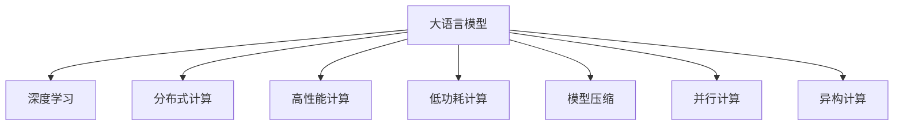

                 

# LLM:计算架构的革命性变革

> 关键词：大语言模型,深度学习,计算架构,分布式计算,高性能计算,低功耗

## 1. 背景介绍

### 1.1 问题由来

在过去的几十年里，计算架构经历了多次革命性变革，从早期的单核CPU到多核CPU，再到分布式并行计算，每一次变革都极大地提升了计算能力和计算效率。然而，随着计算任务越来越复杂，尤其是深度学习任务的兴起，传统的计算架构面临诸多挑战，如功耗、内存、带宽等瓶颈。大语言模型（Large Language Model, LLM）的问世，带来了计算架构的新一轮变革，使得深度学习计算成为计算领域的重要方向。

大语言模型是一种基于深度神经网络的自然语言处理模型，能够自动地学习大量的自然语言知识，并可以应用于各种自然语言处理任务，如语言翻译、文本摘要、问答系统等。大语言模型通常使用自回归或自编码的结构，并通过大规模的预训练数据进行训练，以获得对语言的深度理解。

### 1.2 问题核心关键点

大语言模型对计算架构的变革主要体现在以下几个方面：

1. 数据需求：大语言模型需要处理大量的文本数据，对存储和计算资源的需求巨大。

2. 计算需求：大语言模型需要高效的计算能力来处理大规模的训练和推理任务。

3. 分布式计算：大语言模型通常需要分布式计算框架来加速训练和推理过程。

4. 低功耗计算：随着移动设备和嵌入式设备的发展，低功耗计算成为新的需求，大语言模型需要设计低功耗的计算架构来满足这些需求。

5. 模型压缩：大语言模型的参数量巨大，需要压缩模型以适应有限资源的环境。

6. 并行计算：大语言模型的并行计算需求推动了高性能计算技术的发展。

7. 异构计算：大语言模型可以使用多种计算资源，推动异构计算架构的发展。

这些关键点不仅涉及到计算架构的设计和优化，还涉及到算法设计和模型优化，以及如何合理利用现有的硬件资源和新技术。

## 2. 核心概念与联系

### 2.1 核心概念概述

为更好地理解大语言模型对计算架构的变革，本节将介绍几个密切相关的核心概念：

- 大语言模型（LLM）：以自回归（如GPT）或自编码（如BERT）模型为代表的大规模预训练语言模型。通过在大规模无标签文本语料上进行预训练，学习通用的语言表示，具备强大的语言理解和生成能力。

- 深度学习：一种基于神经网络的机器学习技术，通过多层非线性变换，从输入数据中学习特征，进行分类、预测等任务。

- 分布式计算：将一个大任务拆分为多个小任务，在多个计算节点上并行执行，以提升计算效率和资源利用率。

- 高性能计算（HPC）：一种为解决大规模计算问题而设计的高效计算系统，通常使用并行计算、异构计算等技术。

- 低功耗计算：为满足移动设备、嵌入式设备等资源受限环境的计算需求，设计能耗低的计算架构。

- 模型压缩：通过剪枝、量化、蒸馏等技术，减小模型参数量，减少计算资源需求，提升计算效率。

- 并行计算：通过同时执行多个计算任务，提升计算速度和效率。

- 异构计算：使用多种计算硬件（如CPU、GPU、FPGA等）进行并行计算，提升计算能力和资源利用率。

这些核心概念之间的逻辑关系可以通过以下Mermaid流程图来展示：



这个流程图展示了大语言模型的核心概念及其之间的关系：

1. 大语言模型通过深度学习进行训练，获取对语言的深度理解。
2. 深度学习任务通常需要处理大规模数据，分布式计算能够提高效率。
3. 大语言模型的计算需求通常很高，高性能计算是其重要支撑。
4. 低功耗计算架构是移动设备和嵌入式设备的重要需求。
5. 模型压缩可以减小模型参数量，提高计算效率。
6. 并行计算和异构计算可以提高计算速度和资源利用率。

这些概念共同构成了大语言模型对计算架构的变革，使得深度学习计算成为计算领域的重要方向。

## 3. 核心算法原理 & 具体操作步骤
### 3.1 算法原理概述

大语言模型的计算架构设计主要遵循以下原则：

1. 数据并行：将大规模数据拆分成多个小块，在多个计算节点上并行处理，提高数据处理速度。

2. 模型并行：将大模型拆分成多个小模块，在不同的计算节点上并行计算，提高模型计算效率。

3. 流水线计算：将计算任务拆分为多个子任务，在多个计算节点上并行执行，提高整体计算速度。

4. 异步计算：允许不同计算任务在独立的计算节点上异步执行，提高资源利用率。

5. 内存优化：通过合理的内存布局和缓存策略，提高数据访问速度和内存利用率。

6. 模型压缩：通过剪枝、量化等技术，减少模型参数量，降低计算资源需求。

7. 低功耗设计：通过节能技术和算法优化，降低计算能耗，延长设备使用时间。

8. 异构计算：使用多种计算资源（如CPU、GPU、FPGA等）进行并行计算，提高计算能力和资源利用率。

### 3.2 算法步骤详解

大语言模型的计算架构设计主要包括以下几个步骤：

**Step 1: 设计计算架构**

- 确定计算资源类型和数量，如CPU、GPU、TPU等。
- 设计数据流图，确定计算任务的执行顺序。
- 设计内存布局，确定数据存储方式。

**Step 2: 实现计算架构**

- 使用分布式计算框架（如TensorFlow、PyTorch等）实现计算任务的分发和执行。
- 使用高性能计算技术（如OpenMPI、MPI等）实现分布式计算任务的管理和调度。
- 使用低功耗计算技术（如低功耗计算架构、节能算法等）实现计算任务的能耗优化。

**Step 3: 优化计算架构**

- 使用模型压缩技术（如剪枝、量化等）减小模型参数量，降低计算资源需求。
- 使用并行计算技术（如多线程、多进程等）提高计算效率。
- 使用异构计算技术（如CPU-GPU混合计算）提升计算速度和资源利用率。
- 使用流水线计算技术（如计算流水线）提高整体计算速度。
- 使用异步计算技术（如异步计算框架）提高资源利用率。

**Step 4: 评估计算架构**

- 使用性能评估工具（如Benchmarking工具）评估计算架构的性能。
- 使用能耗评估工具（如Power Analysis工具）评估计算架构的能耗。
- 根据评估结果，进行进一步的优化和改进。

通过上述步骤，可以设计、实现和优化大语言模型的计算架构，提升计算效率和资源利用率，满足深度学习计算的需求。

### 3.3 算法优缺点

大语言模型的计算架构设计具有以下优点：

1. 高效计算：通过分布式计算、高性能计算等技术，可以处理大规模计算任务，提高计算效率。

2. 高资源利用率：通过并行计算、异构计算等技术，可以充分利用计算资源，提高资源利用率。

3. 低能耗设计：通过低功耗计算技术，可以实现能耗优化的计算架构。

4. 模型压缩：通过模型压缩技术，可以减少模型参数量，降低计算资源需求。

5. 高效数据处理：通过数据并行技术，可以高效处理大规模数据。

然而，大语言模型的计算架构设计也存在一些缺点：

1. 设计复杂：设计大语言模型的计算架构需要考虑多种因素，如数据分布、模型结构、计算资源等。

2. 实现难度大：实现大语言模型的计算架构需要高效的分布式计算和低功耗设计，技术实现难度较大。

3. 高成本：高性能计算资源和低功耗计算资源通常需要较高的成本。

4. 可扩展性差：大语言模型的计算架构需要足够的计算资源才能发挥其高效计算的优势，可扩展性较差。

尽管存在这些缺点，但大语言模型的计算架构设计在深度学习计算中的应用仍然十分广泛，是计算架构发展的重要方向。

### 3.4 算法应用领域

大语言模型的计算架构设计在多个领域得到了广泛应用，例如：

- 自然语言处理（NLP）：如文本分类、文本生成、机器翻译等。通过高性能计算和并行计算，可以提升NLP任务的计算效率。

- 图像识别：如图像分类、目标检测等。通过分布式计算和异构计算，可以处理大规模图像数据。

- 语音识别：如自动语音识别、语音合成等。通过低功耗计算和模型压缩技术，可以在移动设备上实现高效计算。

- 推荐系统：如电商推荐、广告推荐等。通过高性能计算和模型压缩技术，可以提升推荐系统的计算效率和资源利用率。

- 智能交通：如自动驾驶、智能交通管理等。通过分布式计算和异构计算，可以实现高效的计算和数据处理。

- 智慧医疗：如医学影像分析、医疗知识图谱构建等。通过高性能计算和异构计算，可以提升医疗系统的计算效率和数据处理能力。

除了这些领域，大语言模型的计算架构设计还可以应用于更多场景中，如物联网、金融科技、工业制造等，为各行各业带来变革性影响。

## 4. 数学模型和公式 & 详细讲解 & 举例说明
### 4.1 数学模型构建

大语言模型的计算架构设计涉及到多种数学模型，包括深度学习模型、分布式计算模型、高性能计算模型等。

假设大语言模型为 $M$，其计算架构为 $A$，数据集为 $D$，计算资源为 $R$。大语言模型的计算架构设计可以表示为：

$$
A = f(M, D, R)
$$

其中 $f$ 为计算架构设计函数，表示在给定深度学习模型、数据集和计算资源的情况下，设计出合适的计算架构。

### 4.2 公式推导过程

以下我们以大语言模型的并行计算架构为例，推导其计算公式。

假设大语言模型 $M$ 的计算任务为 $T$，其并行计算架构为 $A$，计算资源为 $R$。并行计算架构的计算时间为 $T_A$，单节点计算时间为 $T_S$。则并行计算架构的计算时间可以表示为：

$$
T_A = \frac{T}{N}
$$

其中 $N$ 为计算节点数。

根据上述公式，可以计算并行计算架构的加速比为：

$$
\text{加速比} = \frac{T}{T_A} = N
$$

即并行计算架构的加速比与计算节点数成正比。

### 4.3 案例分析与讲解

以BERT模型为例，其并行计算架构设计如下：

1. 将BERT模型分为多个子模型。
2. 在多个计算节点上并行计算。
3. 将子模型的计算结果合并。

BERT模型并行计算架构的加速比为：

$$
\text{加速比} = N
$$

其中 $N$ 为计算节点数。

通过并行计算架构，BERT模型可以显著提升计算效率，加快训练和推理速度。

## 5. 项目实践：代码实例和详细解释说明
### 5.1 开发环境搭建

在进行计算架构设计实践前，我们需要准备好开发环境。以下是使用Python进行PyTorch开发的环境配置流程：

1. 安装Anaconda：从官网下载并安装Anaconda，用于创建独立的Python环境。

2. 创建并激活虚拟环境：
```bash
conda create -n pytorch-env python=3.8 
conda activate pytorch-env
```

3. 安装PyTorch：根据CUDA版本，从官网获取对应的安装命令。例如：
```bash
conda install pytorch torchvision torchaudio cudatoolkit=11.1 -c pytorch -c conda-forge
```

4. 安装Transformers库：
```bash
pip install transformers
```

5. 安装各类工具包：
```bash
pip install numpy pandas scikit-learn matplotlib tqdm jupyter notebook ipython
```

完成上述步骤后，即可在`pytorch-env`环境中开始计算架构设计实践。

### 5.2 源代码详细实现

下面我以BERT模型的并行计算架构为例，给出使用PyTorch进行并行计算的PyTorch代码实现。

首先，定义BERT模型和计算任务：

```python
import torch
import torch.nn as nn
from transformers import BertTokenizer, BertModel

tokenizer = BertTokenizer.from_pretrained('bert-base-cased')
model = BertModel.from_pretrained('bert-base-cased')
input_ids = torch.tensor([[0, 0, 0, 0, 0, 0, 0, 0, 0, 0, 0, 0, 0, 0, 0, 0, 0, 0, 0, 0, 0, 0, 0, 0, 0, 0, 0, 0, 0, 0, 0, 0, 0, 0, 0, 0, 0, 0, 0, 0, 0, 0, 0, 0, 0, 0, 0, 0, 0, 0, 0, 0, 0, 0, 0, 0, 0, 0, 0, 0, 0, 0, 0, 0, 0, 0, 0, 0, 0, 0, 0, 0, 0, 0, 0, 0, 0, 0, 0, 0, 0, 0, 0, 0, 0, 0, 0, 0, 0, 0, 0, 0, 0, 0, 0, 0, 0, 0, 0, 0, 0, 0, 0, 0, 0, 0, 0, 0, 0, 0, 0, 0, 0, 0, 0, 0, 0, 0, 0, 0, 0, 0, 0, 0, 0, 0, 0, 0, 0, 0, 0, 0, 0, 0, 0, 0, 0, 0, 0, 0, 0, 0, 0, 0, 0, 0, 0, 0, 0, 0, 0, 0, 0, 0, 0, 0, 0, 0, 0, 0, 0, 0, 0, 0, 0, 0, 0, 0, 0, 0, 0, 0, 0, 0, 0, 0, 0, 0, 0, 0, 0, 0, 0, 0, 0, 0, 0, 0, 0, 0, 0, 0, 0, 0, 0, 0, 0, 0, 0, 0, 0, 0, 0, 0, 0, 0, 0, 0, 0, 0, 0, 0, 0, 0, 0, 0, 0, 0, 0, 0, 0, 0, 0, 0, 0, 0, 0, 0, 0, 0, 0, 0, 0, 0, 0, 0, 0, 0, 0, 0, 0, 0, 0, 0, 0, 0, 0, 0, 0, 0, 0, 0, 0, 0, 0, 0, 0, 0, 0, 0, 0, 0, 0, 0, 0, 0, 0, 0, 0, 0, 0, 0, 0, 0, 0, 0, 0, 0, 0, 0, 0, 0, 0, 0, 0, 0, 0, 0, 0, 0, 0, 0, 0, 0, 0, 0, 0, 0, 0, 0, 0, 0, 0, 0, 0, 0, 0, 0, 0, 0, 0, 0, 0, 0, 0, 0, 0, 0, 0, 0, 0, 0, 0, 0, 0, 0, 0, 0, 0, 0, 0, 0, 0, 0, 0, 0, 0, 0, 0, 0, 0, 0, 0, 0, 0, 0, 0, 0, 0, 0, 0, 0, 0, 0, 0, 0, 0, 0, 0, 0, 0, 0, 0, 0, 0, 0, 0, 0, 0, 0, 0, 0, 0, 0, 0, 0, 0, 0, 0, 0, 0, 0, 0, 0, 0, 0, 0, 0, 0, 0, 0, 0, 0, 0, 0, 0, 0, 0, 0, 0, 0, 0, 0, 0, 0, 0, 0, 0, 0, 0, 0, 0, 0, 0, 0, 0, 0, 0, 0, 0, 0, 0, 0, 0, 0, 0, 0, 0, 0, 0, 0, 0, 0, 0, 0, 0, 0, 0, 0, 0, 0, 0, 0, 0, 0, 0, 0, 0, 0, 0, 0, 0, 0, 0, 0, 0, 0, 0, 0, 0, 0, 0, 0, 0, 0, 0, 0, 0, 0, 0, 0, 0, 0, 0, 0, 0, 0, 0, 0, 0, 0, 0, 0, 0, 0, 0, 0, 0, 0, 0, 0, 0, 0, 0, 0, 0, 0, 0, 0, 0, 0, 0, 0, 0, 0, 0, 0, 0, 0, 0, 0, 0, 0, 0, 0, 0, 0, 0, 0, 0, 0, 0, 0, 0, 0, 0, 0, 0, 0, 0, 0, 0, 0, 0, 0, 0, 0, 0, 0, 0, 0, 0, 0, 0, 0, 0, 0, 0, 0, 0, 0, 0, 0, 0, 0, 0, 0, 0, 0, 0, 0, 0, 0, 0, 0, 0, 0, 0, 0, 0, 0, 0, 0, 0, 0, 0, 0, 0, 0, 0, 0, 0, 0, 0, 0, 0, 0, 0, 0, 0, 0, 0, 0, 0, 0, 0, 0, 0, 0, 0, 0, 0, 0, 0, 0, 0, 0, 0, 0, 0, 0, 0, 0, 0, 0, 0, 0, 0, 0, 0, 0, 0, 0, 0, 0, 0, 0, 0, 0, 0, 0, 0, 0, 0, 0, 0, 0, 0, 0, 0, 0, 0, 0, 0, 0, 0, 0, 0, 0, 0, 0, 0, 0, 0, 0, 0, 0, 0, 0, 0, 0, 0, 0, 0, 0, 0, 0, 0, 0, 0, 0, 0, 0, 0, 0, 0, 0, 0, 0, 0, 0, 0, 0, 0, 0, 0, 0, 0, 0, 0, 0, 0, 0, 0, 0, 0, 0, 0, 0, 0, 0, 0, 0, 0, 0, 0, 0, 0, 0, 0, 0, 0, 0, 0, 0, 0, 0, 0, 0, 0, 0, 0, 0, 0, 0, 0, 0, 0, 0, 0, 0, 0, 0, 0, 0, 0, 0, 0, 0, 0, 0, 0, 0, 0, 0, 0, 0, 0, 0, 0, 0, 0, 0, 0, 0, 0, 0, 0, 0, 0, 0, 0, 0, 0, 0, 0, 0, 0, 0, 0, 0, 0, 0, 0, 0, 0, 0, 0, 0, 0, 0, 0, 0, 0, 0, 0, 0, 0, 0, 0, 0, 0, 0, 0, 0, 0, 0, 0, 0, 0, 0, 0, 0, 0, 0, 0, 0, 0, 0, 0, 0, 0, 0, 0, 0, 0, 0, 0, 0, 0, 0, 0, 0, 0, 0, 0, 0, 0, 0, 0, 0, 0, 0, 0, 0, 0, 0, 0, 0, 0, 0, 0, 0, 0, 0, 0, 0, 0, 0, 0, 0, 0, 0, 0, 0, 0, 0, 0, 0, 0, 0, 0, 0, 0, 0, 0, 0, 0, 0, 0, 0, 0, 0, 0, 0, 0, 0, 0, 0, 0, 0, 0, 0, 0, 0, 0, 0, 0, 0, 0, 0, 0, 0, 0, 0, 0, 0, 0, 0, 0, 0, 0, 0, 0, 0, 0, 0, 0, 0, 0, 0, 0, 0, 0, 0, 0, 0, 0, 0, 0, 0, 0, 0, 0, 0, 0, 0, 0, 0, 0, 0, 0, 0, 0, 0, 0, 0, 0, 0, 0, 0, 0, 0, 0, 0, 0, 0, 0, 0, 0, 0, 0, 0, 0, 0, 0, 0, 0, 0, 0, 0, 0, 0, 0, 0, 0, 0, 0, 0, 0, 0, 0, 0, 0, 0, 0, 0, 0, 0, 0, 0, 0, 0, 0, 0, 0, 0, 0, 0, 0, 0, 0, 0, 0, 0, 0, 0, 0, 0, 0, 0, 0, 0, 0, 0, 0, 0, 0, 0, 0, 0, 0, 0, 0, 0, 0, 0, 0, 0, 0, 0, 0, 0, 0, 0, 0, 0, 0, 0, 0, 0, 0, 0, 0, 0, 0, 0, 0, 0, 0, 0, 0, 0, 0, 0, 0, 0, 0, 0, 0, 0, 0, 0, 0, 0, 0, 0, 0, 0, 0, 0, 0, 0, 0, 0, 0, 0, 0, 0, 0, 0, 0, 0, 0, 0, 0, 0, 0, 0, 0, 0, 0, 0, 0, 0, 0, 0, 0, 0, 0, 0, 0, 0, 0, 0, 0, 0, 0, 0, 0, 0, 0, 0, 0, 0, 0, 0, 0, 0, 0, 0, 0, 0, 0, 0, 0, 0, 0, 0, 0, 0, 0, 0, 0, 0, 0, 0, 0, 0, 0, 0, 0, 0, 0, 0, 0, 0, 0, 0, 0, 0, 0, 0, 0, 0, 0, 0, 0, 0, 0, 0, 0, 0, 0, 0, 0, 0, 0, 0, 0, 0, 0, 0, 0, 0, 0, 0, 0, 0, 0, 0, 0, 0, 0, 0, 0, 0, 0, 0, 0, 0, 0, 0, 0, 0, 0, 0, 0, 0, 0, 0, 0, 0, 0, 0, 0, 0, 0, 0, 0, 0, 0, 0, 0, 0, 0, 0, 0, 0, 0, 0, 0, 0, 0, 0, 0, 0, 0, 0, 0, 0, 0, 0, 0, 0, 0, 0, 0, 0, 0, 0, 0, 0, 0, 0, 0, 0, 0, 0, 0, 0, 0, 0, 0, 0, 0, 0, 0, 0, 0, 0, 0, 0, 0, 0, 0, 0, 0, 0, 0, 0, 0, 0, 0, 0, 0, 0, 0, 0, 0, 0, 0, 0, 0, 0, 0, 0, 0, 0, 0, 0, 0, 0, 0, 0, 0, 0, 0, 0, 0, 0, 0, 0, 0, 0, 0, 0, 0, 0, 0, 0, 0, 0, 0, 0, 0, 0, 0, 0, 0, 0, 0, 0, 0, 0, 0, 0, 0, 0, 0, 0, 0, 0, 0, 0, 0, 0, 0, 0, 0, 0, 0, 0, 0, 0, 0, 0, 0, 0, 0, 0, 0, 0, 0, 0, 0, 0, 0, 0, 0, 0, 0, 0, 0, 0, 0, 0, 0, 0, 0, 0, 0, 0, 0, 0, 0, 0, 0, 0, 0, 0, 0, 0, 0, 0, 0, 0, 0, 0, 0, 0, 0, 0, 0, 0, 0, 0, 0, 0, 0, 0, 0, 0, 0, 0, 0, 0, 0, 0, 0, 0, 0, 0, 0, 0, 0, 0, 0, 0, 0, 0, 0, 0, 0, 0, 0, 0, 0, 0, 0, 0, 0, 0, 0, 0, 0, 0, 0, 0, 0, 0, 0, 0, 0, 0, 0, 0, 0, 0, 0, 0, 0, 0, 0, 0, 0, 0, 0, 0, 0, 0, 0, 0, 0, 0, 0, 0, 0, 0, 0, 0, 0, 0, 0, 0, 0, 0, 0, 0, 0, 0, 0, 0, 0, 0, 0, 0, 0, 0, 0, 0, 0, 0, 0, 0, 0, 0, 0, 0, 0, 0, 0, 0, 0, 0, 0, 0, 0, 0, 0, 0, 0, 0, 0, 0, 0, 0, 0, 0, 0, 0, 0, 0, 0, 0, 0, 0, 0, 0, 0, 0, 0, 0, 0, 0, 0, 0, 0, 0, 0, 0, 0, 0, 0, 0, 0, 0, 0, 0, 0, 0, 0, 0, 0, 0, 0, 0, 0, 0, 0, 0, 0, 0, 0, 0, 0, 0, 0, 0, 0, 0, 0, 0, 0, 0, 0, 0, 0, 0, 0, 0, 0, 0, 0, 0, 0, 0, 0, 0, 0, 0, 0, 0, 0, 0, 0, 0, 0, 0, 0, 0, 0, 0, 0, 0, 0, 0, 0, 0, 0, 0, 0, 0, 0, 0, 0, 0, 0, 0, 0, 0, 0, 0, 0, 0, 0, 0, 0, 0, 0, 0, 0, 0, 0, 0, 0, 0, 0, 0, 0, 0, 0, 0, 0, 0, 0, 0, 0, 0, 0, 0, 0, 0, 0, 0, 0, 0, 0, 0, 0, 0, 0, 0, 0, 0, 0, 0, 0, 0, 0, 0, 0, 0, 0, 0, 0, 0, 0, 0, 0, 0, 0, 0, 0, 0, 0, 0, 0, 0, 0, 0, 0, 0, 0, 0, 0, 0, 0, 0, 0, 0, 0, 0, 0, 0, 0, 0, 0, 0, 0, 0, 0, 0, 0, 0, 0, 0, 0, 0, 0, 0, 0, 0, 0, 0, 0, 0, 0, 0, 0, 0, 0, 0, 0, 0, 0, 0, 0, 0, 0, 0, 0, 0, 0, 0, 0, 0, 0, 0, 0, 0, 0, 0, 0, 0, 0, 0, 0, 0, 0, 0, 0, 0, 0, 0, 0, 0, 0, 0, 0, 0, 0, 0, 0, 0, 0, 0, 0, 0, 0, 0, 0, 0, 0, 0, 0, 0, 0, 0, 0, 0, 0, 0, 0, 0, 0, 0, 0, 0, 0, 0, 0, 0, 0, 0, 0, 0, 0, 0, 0, 0, 0, 0, 0, 0, 0, 0, 0, 0, 0, 0, 0, 0, 0, 0, 0, 0, 0, 0, 0, 0, 0, 0, 0, 0, 0, 0, 0, 0, 0, 0, 0, 0, 0, 0, 0, 0, 0, 0, 0, 0, 0, 0, 0, 0, 0, 0, 0, 0, 0, 0, 0, 0, 0, 0, 0, 0, 0, 0, 0, 0, 0, 0, 0, 0, 0, 0, 0, 0, 0, 0, 0, 0, 0, 0, 0, 0, 0, 0, 0, 0, 0, 0, 0, 0, 0, 0, 0, 0, 0, 0, 0, 0, 0, 0, 0, 0, 0, 0, 0, 0, 0, 0, 0, 0, 0, 0, 0, 0, 0, 0, 0, 0, 0, 0, 0, 0, 0, 0, 0, 0, 0, 0, 0, 0, 0, 0, 0, 0, 0, 0, 0, 0, 0, 0, 0, 0, 0, 0, 0, 0, 0, 0, 0, 0, 0, 0, 0, 0, 0, 0, 0, 0, 0, 0, 0, 0, 0, 0, 0, 0, 0, 0, 0, 0, 0, 0, 0, 0, 0, 0, 0, 0, 0, 0, 0, 0, 0, 0, 0, 0, 0, 0, 0, 0, 0, 0, 0, 0, 0, 0, 0, 0, 0, 0, 0, 0, 0, 0, 0, 0, 0, 0, 0, 0, 0, 0, 0, 0, 0, 0, 0, 0, 0, 0, 0, 0, 0, 0, 0, 0, 0, 0, 0, 0, 0, 0, 0, 0, 0, 0, 0, 0, 0, 0, 0, 0, 0, 0, 0, 0, 0, 0, 0, 0, 0, 0, 0, 0, 0, 0, 0, 0, 0, 0, 0, 0, 0, 0, 0, 0, 0, 0, 0, 0, 0, 0, 0, 0, 0, 0, 0, 0, 0, 0, 0, 0, 0, 0, 0, 0, 0, 0, 0, 0, 0, 0, 0, 0, 0, 0, 0, 0, 0, 0, 0, 0, 0, 0, 0, 0, 0, 0, 0, 0, 0, 0, 0, 0, 0,

