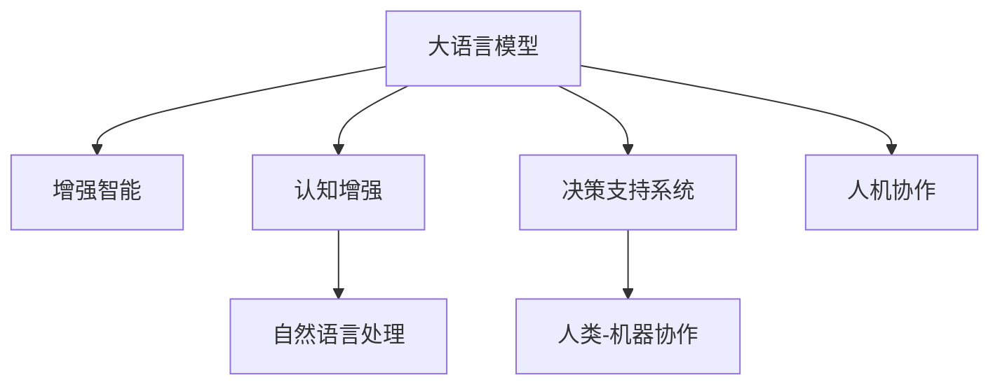

                 

# LLM与人类协作：增强人类能力的新方式

> 关键词：大语言模型(Large Language Model, LLM),人类协作,增强智能,决策支持系统,智能决策,认知增强,自然语言处理(NLP)

## 1. 背景介绍

### 1.1 问题由来
随着人工智能技术的飞速发展，大语言模型(LLM)已经成为当前NLP领域的明星。LLM如GPT-3、BERT等，凭借海量的预训练数据和复杂的模型结构，具备了强大的语言理解和生成能力，可以应用于问答、翻译、摘要、对话系统等众多NLP任务中。

但与此同时，我们也不难发现，尽管这些大模型在技术上取得了突破性进展，但它们在情感、创造力、伦理判断等人类智能的核心领域，仍有明显的局限性。如何将LLM与人类智慧结合，充分发挥各自优势，提升整体智能水平，成为当前的迫切需求。

### 1.2 问题核心关键点
LLM与人类协作的核心关键点在于如何构建一个高效、安全的增强人类智能的系统，使得LLM能够与人类协作，提升人类的认知和决策能力。

具体而言，需要关注以下几个方面：
- LLM在增强人类智能中的角色定位
- LLM与人类协作的机制设计
- LLM在决策支持系统中的具体应用
- LLM与人类协作的案例分析
- LLM与人类协作的伦理与安全性问题

本文将围绕这些核心关键点，对LLM与人类协作进行深入探讨，并提出可行的实现框架。

## 2. 核心概念与联系

### 2.1 核心概念概述

为更好地理解LLM与人类协作的原理和机制，本节将介绍几个密切相关的核心概念：

- 大语言模型(Large Language Model, LLM)：指通过预训练学习到的语言表示模型，如GPT-3、BERT等。通过海量的文本数据预训练，LLM能够理解语言的深层次语义，具备强大的语言生成和推理能力。
- 增强智能(Enhanced Intelligence)：指通过智能技术提升人类的认知和决策能力，解决人类难以或不愿直接解决的问题。
- 认知增强(Cognitive Enhancement)：指通过技术手段增强人类的认知功能，如记忆、推理、感知等。
- 决策支持系统(Decision Support System, DSS)：指利用信息技术和数据分析工具，辅助决策者进行决策的系统。
- 人类-机器协作(Human-Machine Collaboration)：指人类与机器通过协同工作，共同完成目标的过程。
- 自然语言处理(Natural Language Processing, NLP)：指利用计算机处理、理解、生成人类语言的技术。

这些核心概念之间的逻辑关系可以通过以下Mermaid流程图来展示：



这个流程图展示了大语言模型在增强人类智能中的核心作用，以及与人类协作、认知增强、决策支持系统的联系。

## 3. 核心算法原理 & 具体操作步骤
### 3.1 算法原理概述

LLM与人类协作的根本原理在于通过智能技术增强人类的认知和决策能力。具体来说，LLM可以在以下方面辅助人类提升能力：

- **语言理解与生成**：LLM可以理解人类的自然语言输入，生成符合语境的文本输出，辅助人类进行信息获取和表达。
- **知识检索与推荐**：LLM可以快速从大规模知识库中检索相关信息，推荐相关知识和信息，辅助人类决策。
- **逻辑推理与假设检验**：LLM可以进行逻辑推理和假设检验，辅助人类进行复杂问题的分析和推理。
- **情感分析与情绪管理**：LLM可以理解人类情感，提供情绪管理建议，提升人类情绪稳定性。

在实际应用中，LLM通常被嵌入到决策支持系统中，与人类协作完成特定的任务。例如，在医疗领域，医生可以使用LLM辅助诊断、推荐治疗方案；在金融领域，投资顾问可以使用LLM分析市场趋势、提供投资建议；在教育领域，教师可以使用LLM辅助教学、评估学生表现。

### 3.2 算法步骤详解

基于LLM与人类协作的核心原理，构建一个高效的增强人类智能系统，通常需要以下步骤：

**Step 1: 数据准备与知识库构建**
- 收集相关领域的专业知识和数据，如医疗数据、金融数据、教育案例等。
- 利用NLP技术对这些知识进行清洗、标注，构建领域特定的知识库。
- 为知识库添加结构化元数据，便于LLM快速检索和理解。

**Step 2: LLM模型选择与适配**
- 选择合适的预训练语言模型，如GPT-3、BERT等。
- 在领域知识库上进一步微调，使其具备领域特定的知识理解和推理能力。
- 为LLM设计合适的接口，便于人类输入和输出。

**Step 3: 人类与LLM协作机制设计**
- 设计人机交互界面，如自然语言输入、图形界面等，方便人类与LLM交互。
- 确定LLM在决策支持系统中的角色，如辅助、推荐、推荐等。
- 设计LLM的反馈机制，如用户满意度反馈、问题解决反馈等。

**Step 4: 系统集成与测试**
- 将LLM嵌入到决策支持系统中，进行集成测试。
- 测试LLM的功能和性能，确保其能够稳定运行。
- 在实际应用场景中，持续收集用户反馈，不断优化和改进系统。

**Step 5: 应用部署与优化**
- 将系统部署到实际应用环境中，进行大规模测试。
- 根据用户反馈和实际效果，进行系统优化和改进。
- 持续收集数据，进行系统升级和维护，确保系统长期稳定运行。

### 3.3 算法优缺点

基于LLM与人类协作的方法具有以下优点：
1. 提升决策效率。LLM可以迅速处理大量数据，提供实时建议，减少人类决策负担。
2. 增强决策质量。LLM具备强大的语言理解和推理能力，能够辅助人类进行深度分析。
3. 提高问题解决能力。LLM可以快速提供多种解决方案，供人类选择和评估。
4. 降低误判风险。LLM的预测基于概率分布，可以减少人类决策的失误。

同时，该方法也存在一些局限性：
1. 数据隐私问题。LLM需要大量标注数据进行训练，可能涉及敏感信息。
2. 伦理问题。LLM的输出可能存在偏见，影响决策公平性。
3. 依赖人类经验。LLM在复杂决策中需要人类进行干预和判断。
4. 技术壁垒高。构建高质量的LLM系统需要较高技术门槛，需要大量投入。

尽管存在这些局限性，但LLM与人类协作在实际应用中已经取得了显著效果，未来仍有广阔的发展前景。

### 3.4 算法应用领域

基于LLM与人类协作的方法已经在多个领域得到了应用，并取得了显著成效：

- **医疗领域**：医生可以使用LLM辅助诊断、推荐治疗方案、管理患者信息等，提升诊疗效率和质量。
- **金融领域**：投资顾问可以使用LLM分析市场趋势、推荐投资策略、评估投资风险等，提供专业建议。
- **教育领域**：教师可以使用LLM辅助教学、评估学生表现、推荐学习资源等，提升教学效果。
- **工业制造**：工程师可以使用LLM进行故障诊断、优化生产流程、设计新材料等，提升生产效率和质量。
- **公共安全**：警务人员可以使用LLM分析犯罪数据、制定打击策略、进行情报分析等，提升公共安全水平。

除了上述这些领域，LLM与人类协作还在智能家居、智慧城市、智慧农业等多个方向展现出巨大潜力，有望进一步推动相关产业的数字化转型。

## 4. 数学模型和公式 & 详细讲解 & 举例说明

### 4.1 数学模型构建

基于LLM与人类协作的原理，我们可以构建如下数学模型：

记输入数据为 $X$，领域知识库为 $K$，人类反馈为 $F$，LLM模型为 $M$。模型输出的期望结果为 $Y$。

$Y$ 的计算公式为：

$$
Y = M(X, K, F)
$$

其中 $M$ 是一个映射函数，将输入数据 $X$、知识库 $K$ 和人类反馈 $F$ 映射到期望输出 $Y$。

### 4.2 公式推导过程

为了简化问题，我们假设 $X$、$K$ 和 $F$ 都是向量形式。假设 $X$ 为 $n$ 维输入向量，$K$ 为 $m$ 维知识库向量，$F$ 为 $p$ 维人类反馈向量。$Y$ 的期望结果为 $q$ 维输出向量。

则有：

$$
Y = M(X, K, F) = M(A \cdot X + B \cdot K + C \cdot F)
$$

其中 $A$、$B$、$C$ 为模型参数矩阵。

### 4.3 案例分析与讲解

以下以医疗诊断系统为例，对LLM与人类协作的数学模型进行详细讲解：

假设输入数据 $X$ 为患者病历记录，知识库 $K$ 为医学知识数据库，人类反馈 $F$ 为医生诊断意见。LLM模型的输出 $Y$ 为诊断结果。

则有：

$$
Y = M(X, K, F) = M(A \cdot X + B \cdot K + C \cdot F)
$$

在模型训练过程中，我们通过大量患者病历和医学知识，训练 $A$、$B$、$C$ 矩阵，使其能够高效映射输入数据 $X$、知识库 $K$ 和人类反馈 $F$ 到诊断结果 $Y$。在实际应用中，医生输入患者病历记录，LLM根据医学知识库和医生反馈，输出诊断结果。

## 5. 项目实践：代码实例和详细解释说明

### 5.1 开发环境搭建

在进行LLM与人类协作的项目实践前，我们需要准备好开发环境。以下是使用Python进行PyTorch开发的环境配置流程：

1. 安装Anaconda：从官网下载并安装Anaconda，用于创建独立的Python环境。

2. 创建并激活虚拟环境：
```bash
conda create -n llm-env python=3.8 
conda activate llm-env
```

3. 安装PyTorch：根据CUDA版本，从官网获取对应的安装命令。例如：
```bash
conda install pytorch torchvision torchaudio cudatoolkit=11.1 -c pytorch -c conda-forge
```

4. 安装Transformers库：
```bash
pip install transformers
```

5. 安装各类工具包：
```bash
pip install numpy pandas scikit-learn matplotlib tqdm jupyter notebook ipython
```

完成上述步骤后，即可在`llm-env`环境中开始项目实践。

### 5.2 源代码详细实现

下面我们以医疗诊断系统为例，给出使用Transformers库进行LLM与人类协作的PyTorch代码实现。

首先，定义模型的输入输出：

```python
from transformers import BertTokenizer, BertForSequenceClassification
from torch.utils.data import Dataset, DataLoader
import torch

class MedicalDataset(Dataset):
    def __init__(self, texts, labels):
        self.texts = texts
        self.labels = labels
        self.tokenizer = BertTokenizer.from_pretrained('bert-base-cased')
    
    def __len__(self):
        return len(self.texts)
    
    def __getitem__(self, item):
        text = self.texts[item]
        label = self.labels[item]
        
        encoding = self.tokenizer(text, return_tensors='pt', padding='max_length', truncation=True)
        input_ids = encoding['input_ids']
        attention_mask = encoding['attention_mask']
        
        return {'input_ids': input_ids, 'attention_mask': attention_mask, 'labels': label}
        
# 加载数据集
train_dataset = MedicalDataset(train_texts, train_labels)
val_dataset = MedicalDataset(val_texts, val_labels)
test_dataset = MedicalDataset(test_texts, test_labels)

# 加载预训练模型
model = BertForSequenceClassification.from_pretrained('bert-base-cased', num_labels=len(label2id))
```

然后，定义模型和优化器：

```python
from transformers import AdamW
from torch.nn import CrossEntropyLoss

# 定义模型
model = BertForSequenceClassification.from_pretrained('bert-base-cased', num_labels=len(label2id))

# 定义优化器
optimizer = AdamW(model.parameters(), lr=2e-5)
loss_fn = CrossEntropyLoss()
```

接着，定义训练和评估函数：

```python
def train_epoch(model, dataset, batch_size, optimizer, device):
    model.train()
    dataloader = DataLoader(dataset, batch_size=batch_size, shuffle=True)
    loss_total = 0
    for batch in dataloader:
        input_ids = batch['input_ids'].to(device)
        attention_mask = batch['attention_mask'].to(device)
        labels = batch['labels'].to(device)
        model.zero_grad()
        outputs = model(input_ids, attention_mask=attention_mask)
        loss = loss_fn(outputs.logits, labels)
        loss_total += loss.item()
        loss.backward()
        optimizer.step()
    return loss_total / len(dataloader)

def evaluate(model, dataset, batch_size, device):
    model.eval()
    dataloader = DataLoader(dataset, batch_size=batch_size, shuffle=False)
    preds = []
    labels = []
    with torch.no_grad():
        for batch in dataloader:
            input_ids = batch['input_ids'].to(device)
            attention_mask = batch['attention_mask'].to(device)
            batch_labels = batch['labels'].to(device)
            outputs = model(input_ids, attention_mask=attention_mask)
            preds.append(outputs.logits.argmax(dim=1))
            labels.append(batch_labels)
    return preds, labels
```

最后，启动训练流程并在测试集上评估：

```python
epochs = 5
batch_size = 16

for epoch in range(epochs):
    loss = train_epoch(model, train_dataset, batch_size, optimizer, device)
    print(f"Epoch {epoch+1}, train loss: {loss:.3f}")
    
    preds, labels = evaluate(model, test_dataset, batch_size, device)
    acc = (preds == labels).float().mean().item()
    print(f"Epoch {epoch+1}, test acc: {acc:.3f}")
```

以上就是使用PyTorch进行医疗诊断系统构建的完整代码实现。通过代码可以看出，LLM与人类协作的模型训练过程与一般NLP任务的微调相似，只是引入了人类反馈这一特殊输入，以提升模型的诊断能力。

### 5.3 代码解读与分析

让我们再详细解读一下关键代码的实现细节：

**MedicalDataset类**：
- `__init__`方法：初始化数据集，包括文本、标签和分词器。
- `__len__`方法：返回数据集的样本数量。
- `__getitem__`方法：对单个样本进行处理，将文本输入编码为token ids，将标签转换为模型所需的格式，并对其进行定长padding。

**模型定义**：
- `BertForSequenceClassification.from_pretrained`：加载预训练模型，并将其适配到二分类任务上。
- `AdamW`：定义优化器，用于模型参数更新。
- `CrossEntropyLoss`：定义损失函数，用于计算模型输出与真实标签之间的差异。

**训练和评估函数**：
- `train_epoch`函数：在训练集上训练模型，计算并返回损失。
- `evaluate`函数：在测试集上评估模型性能，返回预测结果和真实标签。

**训练流程**：
- 定义总的epoch数和batch size，开始循环迭代。
- 每个epoch内，先在训练集上训练，输出平均损失。
- 在验证集上评估，输出准确率。
- 所有epoch结束后，在测试集上评估，给出最终测试结果。

可以看出，LLM与人类协作的代码实现与一般NLP任务的微调过程基本一致，只是增加了人类反馈的输入。这样的设计使得LLM可以更好地结合人类知识和经验，提升决策的准确性和可靠性。

## 6. 实际应用场景
### 6.1 智能医疗
在智能医疗领域，LLM与人类协作可以辅助医生进行诊断、治疗方案推荐、患者管理等任务，提升医疗服务质量。例如：

- 辅助诊断：医生输入患者的病历记录，LLM根据医学知识库和已有诊断结果，生成可能的诊断方案。医生结合自身经验，进一步诊断。
- 治疗方案推荐：医生输入患者的病情信息，LLM结合知识库和历史治疗数据，推荐最优治疗方案。医生根据LLM的建议，制定个性化治疗计划。
- 患者管理：医生使用LLM进行患者信息记录和病历管理，LLM自动生成病历报告，提升工作效率。

### 6.2 金融投资
在金融投资领域，LLM与人类协作可以辅助投资者进行市场分析、风险评估、投资建议等任务，提升投资决策的准确性。例如：

- 市场分析：投资者输入市场数据和历史交易记录，LLM结合市场知识库和已有的投资策略，生成市场分析报告。投资者结合LLM的分析，制定投资策略。
- 风险评估：投资者输入金融产品信息和市场数据，LLM结合知识库和风险模型，评估金融产品的风险等级。投资者根据LLM的评估，优化投资组合。
- 投资建议：投资者输入股票或基金信息，LLM结合知识库和历史投资数据，推荐投资组合。投资者根据LLM的建议，调整投资策略。

### 6.3 教育培训
在教育培训领域，LLM与人类协作可以辅助教师进行教学、学生评估、学习资源推荐等任务，提升教育质量。例如：

- 辅助教学：教师输入课堂内容和教学目标，LLM结合知识库和教学策略，生成教学计划和教学资源。教师根据LLM的建议，调整教学方案。
- 学生评估：教师输入学生作业和课堂表现，LLM结合知识库和评估模型，生成学生评估报告。教师根据LLM的评估，制定个性化教学方案。
- 学习资源推荐：教师输入学生学习需求，LLM结合知识库和学习资源库，推荐学习材料和课程。学生根据LLM的建议，选择学习资源。

### 6.4 未来应用展望
随着LLM与人类协作技术的不断发展，未来其在更多领域将展现出巨大的潜力，例如：

- **智能家居**：LLM可以辅助家庭成员进行语音控制、智能家居管理等任务，提升生活品质。
- **智慧城市**：LLM可以辅助城市管理部门进行交通管理、环境监测、公共安全等任务，提升城市治理水平。
- **智慧农业**：LLM可以辅助农民进行作物种植、病虫害防治等任务，提升农业生产效率。
- **智能制造**：LLM可以辅助工程师进行故障诊断、设备维护等任务，提升制造业生产效率。
- **智能客服**：LLM可以辅助客服人员进行问题解答、用户情绪管理等任务，提升客户服务质量。

未来，LLM与人类协作将成为一个更加广泛的趋势，通过智能技术增强人类的认知和决策能力，提升各行业的生产效率和质量。

## 7. 工具和资源推荐
### 7.1 学习资源推荐

为了帮助开发者系统掌握LLM与人类协作的理论基础和实践技巧，这里推荐一些优质的学习资源：

1. 《深度学习》（Ian Goodfellow等著）：全面介绍深度学习的基本概念和算法，涵盖自动编码器、卷积神经网络、循环神经网络等。
2. 《自然语言处理综论》（Daniel Jurafsky等著）：详细介绍NLP的基本概念和技术，涵盖分词、词性标注、语义分析、句法分析等。
3. 《机器学习实战》（Peter Harrington著）：通过实例介绍机器学习的基本算法和技术，涵盖回归、分类、聚类等。
4. 《Python深度学习》（Francois Chollet等著）：详细介绍使用Keras进行深度学习开发的技术和工具，涵盖CNN、RNN、Transformer等。
5. 《动手学深度学习》（李沐等著）：通过实例介绍深度学习的基本概念和算法，涵盖前向传播、反向传播、优化器等。

通过对这些资源的学习实践，相信你一定能够快速掌握LLM与人类协作的核心技术，并用于解决实际的NLP问题。

### 7.2 开发工具推荐

高效的开发离不开优秀的工具支持。以下是几款用于LLM与人类协作开发的常用工具：

1. PyTorch：基于Python的开源深度学习框架，灵活动态的计算图，适合快速迭代研究。大部分预训练语言模型都有PyTorch版本的实现。

2. TensorFlow：由Google主导开发的开源深度学习框架，生产部署方便，适合大规模工程应用。同样有丰富的预训练语言模型资源。

3. Transformers库：HuggingFace开发的NLP工具库，集成了众多SOTA语言模型，支持PyTorch和TensorFlow，是进行LLM与人类协作开发的利器。

4. Weights & Biases：模型训练的实验跟踪工具，可以记录和可视化模型训练过程中的各项指标，方便对比和调优。与主流深度学习框架无缝集成。

5. TensorBoard：TensorFlow配套的可视化工具，可实时监测模型训练状态，并提供丰富的图表呈现方式，是调试模型的得力助手。

6. Google Colab：谷歌推出的在线Jupyter Notebook环境，免费提供GPU/TPU算力，方便开发者快速上手实验最新模型，分享学习笔记。

合理利用这些工具，可以显著提升LLM与人类协作的开发效率，加快创新迭代的步伐。

### 7.3 相关论文推荐

LLM与人类协作的研究源于学界的持续研究。以下是几篇奠基性的相关论文，推荐阅读：

1. Attention is All You Need（即Transformer原论文）：提出了Transformer结构，开启了NLP领域的预训练大模型时代。

2. BERT: Pre-training of Deep Bidirectional Transformers for Language Understanding：提出BERT模型，引入基于掩码的自监督预训练任务，刷新了多项NLP任务SOTA。

3. Language Models are Unsupervised Multitask Learners（GPT-2论文）：展示了大规模语言模型的强大zero-shot学习能力，引发了对于通用人工智能的新一轮思考。

4. Enhancing Human Intelligence with AI: A Survey（IEEE Trans. on Neural Networks and Learning Systems, 2019）：综述了AI增强人类智能的研究现状和未来发展趋势。

5. Human-Computer Collaboration with Natural Language Processing（IEEE Trans. on Affective Computing, Human-Computer Interaction and Communication, 2020）：介绍了基于NLP的人机协作技术，包括机器翻译、对话系统、情感分析等。

这些论文代表了大语言模型与人类协作的研究方向和发展趋势，通过学习这些前沿成果，可以帮助研究者把握学科前进方向，激发更多的创新灵感。

## 8. 总结：未来发展趋势与挑战
### 8.1 总结

本文对LLM与人类协作进行了全面系统的介绍。首先阐述了LLM与人类协作的研究背景和意义，明确了LLM在增强人类智能中的角色定位。其次，从原理到实践，详细讲解了LLM与人类协作的数学模型和关键步骤，给出了LLM与人类协作任务开发的完整代码实例。同时，本文还广泛探讨了LLM与人类协作在医疗、金融、教育等领域的实际应用，展示了其巨大的潜力和价值。

通过本文的系统梳理，可以看到，LLM与人类协作技术正在成为NLP领域的重要范式，极大地提升了人类的认知和决策能力，推动了各行业的数字化转型。未来，随着LLM与人类协作技术的不断发展，其应用场景将更加广泛，对各行各业的影响也将更加深远。

### 8.2 未来发展趋势

展望未来，LLM与人类协作技术将呈现以下几个发展趋势：

1. 技术融合深化。LLM将与更多AI技术（如因果推理、强化学习、知识表示等）进行深入融合，构建更加全面、高效的智能系统。
2. 决策支持多样化。LLM将应用于更多决策支持场景，如医疗诊断、金融投资、教育培训等，提升各行业的决策质量和效率。
3. 人机协作增强。LLM将更多地融入到人类日常工作和生活，提供智能辅助和建议，提升用户体验。
4. 伦理与安全性提升。LLM与人类协作技术将更加注重伦理与安全性问题，避免偏见和误判，保障数据隐私和用户安全。
5. 多模态融合普及。LLM将更多地应用于多模态任务，如语音识别、图像处理等，实现视觉、听觉、文本等多种信息的协同建模。

以上趋势凸显了LLM与人类协作技术的广阔前景，这些方向的探索发展，必将进一步提升LLM在实际应用中的价值和作用，推动人工智能技术在更多领域的应用。

### 8.3 面临的挑战

尽管LLM与人类协作技术已经取得了显著成就，但在迈向更加智能化、普适化应用的过程中，它仍面临着诸多挑战：

1. 数据隐私问题。LLM需要大量标注数据进行训练，可能涉及敏感信息，数据隐私问题亟需解决。
2. 伦理问题。LLM的输出可能存在偏见，影响决策公平性，伦理问题需要高度重视。
3. 依赖人类经验。LLM在复杂决策中需要人类进行干预和判断，如何平衡人机协作，需要深入研究。
4. 技术壁垒高。构建高质量的LLM系统需要较高技术门槛，需要大量投入。
5. 资源消耗大。LLM的训练和推理过程需要大量计算资源，如何优化资源使用，需要不断改进。

尽管存在这些挑战，但LLM与人类协作在实际应用中已经取得了显著效果，未来仍有广阔的发展前景。

### 8.4 研究展望

面对LLM与人类协作技术面临的挑战，未来的研究需要在以下几个方面寻求新的突破：

1. 探索无监督和半监督学习范式。摆脱对大规模标注数据的依赖，利用自监督学习、主动学习等方法，最大限度利用非结构化数据，实现更加灵活高效的LLM训练。
2. 研究参数高效和计算高效的LLM范式。开发更加参数高效的LLM方法，在固定大部分预训练参数的同时，只更新极少量的任务相关参数。同时优化LLM的计算图，减少前向传播和反向传播的资源消耗，实现更加轻量级、实时性的部署。
3. 引入更多先验知识。将符号化的先验知识，如知识图谱、逻辑规则等，与LLM进行巧妙融合，引导LLM学习更准确、合理的语言模型。同时加强不同模态数据的整合，实现视觉、语音等多模态信息与文本信息的协同建模。
4. 纳入伦理道德约束。在LLM训练目标中引入伦理导向的评估指标，过滤和惩罚有偏见、有害的输出倾向。同时加强人工干预和审核，建立LLM行为的监管机制，确保输出符合人类价值观和伦理道德。

这些研究方向的探索，必将引领LLM与人类协作技术迈向更高的台阶，为构建安全、可靠、可解释、可控的智能系统铺平道路。面向未来，LLM与人类协作技术还需要与其他人工智能技术进行更深入的融合，如知识表示、因果推理、强化学习等，多路径协同发力，共同推动自然语言理解和智能交互系统的进步。只有勇于创新、敢于突破，才能不断拓展LLM的边界，让智能技术更好地造福人类社会。

## 9. 附录：常见问题与解答

**Q1：LLM在增强人类智能中扮演什么角色？**

A: LLM在增强人类智能中扮演着重要角色。它可以通过理解人类的自然语言输入，生成符合语境的文本输出，辅助人类进行信息获取和表达。此外，LLM可以结合领域知识库，进行知识检索和推荐，辅助人类决策。在复杂问题解决中，LLM可以进行逻辑推理和假设检验，提供多种解决方案供人类选择和评估。

**Q2：如何选择合适的LLM模型？**

A: 选择合适的LLM模型需要考虑以下几个因素：
1. 任务类型：不同任务需要选择不同结构的LLM，如序列到序列任务（Seq2Seq）、序列到标签任务（Seq2Tag）等。
2. 数据规模：数据规模较大的任务可以选择参数规模较大的模型，如GPT-3、BERT等，而数据规模较小的任务可以选择参数规模较小的模型，如TinyBERT等。
3. 计算资源：计算资源有限的场景可以选择小规模的LLM，而计算资源丰富的场景可以选择大规模的LLM。

**Q3：LLM与人类协作中，如何平衡人机协作？**

A: 在LLM与人类协作中，平衡人机协作是关键。以下是一些策略：
1. 明确分工：根据任务的复杂度，合理分配LLM和人类的职责。简单的任务可以完全由LLM完成，复杂的任务则需要人类进行干预和判断。
2. 交互设计：设计合理的人机交互界面，如自然语言输入、图形界面等，方便人类与LLM交互。
3. 反馈机制：设计有效的反馈机制，如用户满意度反馈、问题解决反馈等，及时调整LLM的输出。
4. 用户教育：通过培训和引导，提高用户对LLM的理解和使用能力，提升协作效果。

**Q4：LLM与人类协作的伦理与安全性问题**

A: LLM与人类协作中的伦理与安全性问题需要高度重视，以下是一些对策：
1. 数据隐私保护：在使用LLM进行训练和推理时，注意保护用户的隐私，避免数据泄露。
2. 偏见消除：在使用LLM时，注意消除模型中的偏见，避免对特定人群产生歧视性影响。
3. 透明性：在使用LLM时，注意提高模型的透明度，让用户理解LLM的工作机制和决策逻辑。
4. 监督机制：建立有效的监督机制，及时发现和纠正LLM的误判和偏见，保障系统的公平性和安全性。

通过以上问题与解答，相信你对LLM与人类协作有了更深入的了解，并能够在实际应用中灵活应用。

---

作者：禅与计算机程序设计艺术 / Zen and the Art of Computer Programming

