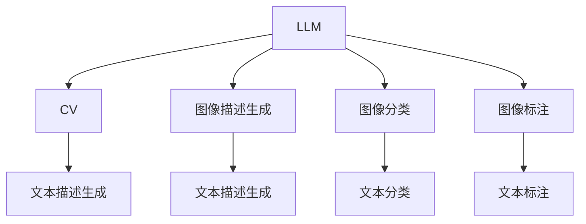
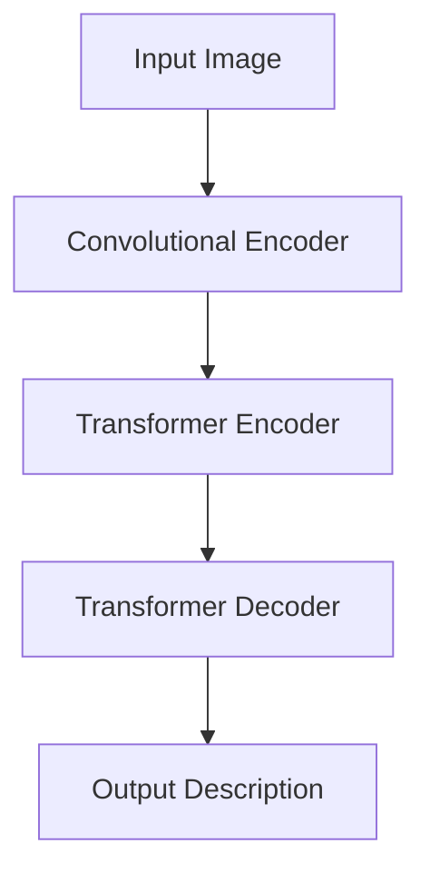

                 

# LLM与传统图像识别技术的结合：视觉AI新境界

> 关键词：自然语言处理(NLP),计算机视觉(CV),跨模态学习,深度学习,Transformer,BERT,图像描述生成,图像分类

## 1. 背景介绍

### 1.1 问题由来
近年来，深度学习在计算机视觉（CV）和自然语言处理（NLP）领域都取得了巨大的进展。自然语言处理方面，基于Transformer结构的BERT、GPT-3等大语言模型（LLM）已经展示了超越人类水平的语言理解和生成能力。而在计算机视觉方面，卷积神经网络（CNN）、生成对抗网络（GAN）等深度学习模型在图像识别、图像生成等任务上取得了显著的成果。然而，LLM和CV技术分别在语言和视觉领域演进，两者之间缺乏有效互动和融合。

自然语言和图像数据尽管源泉不同，但同属人类感知世界的两种重要方式，许多场景中需要它们共同协作。例如，问答系统需要理解自然语言并检索图像，视频摘要需要从视频和文本中提取信息，智能辅助设计需要从文本描述中生成图像等。因此，如何实现LLM和CV技术的融合，使其能够协同工作，成为一个亟待解决的难题。

### 1.2 问题核心关键点
为了解决LLM和CV融合的问题，研究者提出了许多跨模态学习（Cross-Modal Learning）的方法。这些方法的基本思路是：将图像特征编码到语言空间中，或者将语言特征编码到图像空间中，使LLM和CV能够共享同一特征空间。以下是几种主流的跨模态学习范式：

1. **图像描述生成**：通过训练模型，将图像输入转化为自然语言描述。
2. **图像分类**：将自然语言描述作为输入，预测图像属于哪个类别。
3. **图像标注**：将自然语言描述与图像中的物体或场景进行匹配，进行标注。

这些范式都是通过训练联合模型来实现的。典型的联合模型包括使用Transformer、卷积神经网络、RNN等构成的模型架构，通过共享特征空间来协同工作。

## 2. 核心概念与联系

### 2.1 核心概念概述

为了深入理解LLM与CV技术的结合，本节将介绍几个关键概念：

- **自然语言处理（NLP）**：通过计算机处理、理解、生成自然语言，实现语言和机器的交互。
- **计算机视觉（CV）**：通过计算机处理、理解图像、视频等视觉信息，实现视觉感知。
- **跨模态学习（Cross-Modal Learning）**：将不同模态的数据（如图像、文本、语音等）融合到一个共享的特征空间中，实现不同模态数据之间的交互和协同工作。
- **深度学习（Deep Learning）**：通过构建多层的神经网络模型，实现对数据的抽象表示和复杂模式的学习。
- **Transformer**：一种基于自注意力机制的神经网络模型，广泛应用于NLP领域。
- **BERT**：一种基于Transformer的预训练语言模型，通过掩码语言模型和下一句预测等任务进行预训练，获得了强大的语言理解能力。

这些概念之间有着紧密的联系，通过跨模态学习将LLM和CV结合，可以充分发挥各自的优势，实现更为复杂、精细的任务处理。

### 2.2 核心概念原理和架构的 Mermaid 流程图



上述流程图展示了LLM与CV技术结合的几种主要应用场景：

1. 图像描述生成：LLM将CV生成的图像转换为自然语言描述。
2. 图像分类：LLM将文本描述作为输入，对图像进行分类。
3. 图像标注：LLM对图像进行标注，并生成相应的文本描述。

这些应用场景都是通过训练联合模型来实现的，共同构建了一个多模态的特征空间。

## 3. 核心算法原理 & 具体操作步骤

### 3.1 算法原理概述

基于深度学习的跨模态学习方法，通常包括两个主要步骤：

1. **特征映射（Feature Mapping）**：将一种模态的数据映射到另一种模态的数据空间中，使得不同模态的数据能够在同一个特征空间中表示。
2. **融合学习（Fusion Learning）**：将不同模态的数据在同一个特征空间中进行协同学习，实现信息共享。

对于图像和文本的结合，可以通过图像编码器将图像转换为高维向量，然后使用Transformer等模型将文本转换为向量。这样，图像和文本都可以映射到同一个特征空间，可以进行联合学习。

### 3.2 算法步骤详解

以图像描述生成任务为例，展示如何构建基于LLM和CV的联合模型：

1. **图像预处理**：对图像进行预处理，如调整大小、归一化等。

2. **图像编码**：使用卷积神经网络（CNN）或ResNet等模型对图像进行编码，得到图像特征向量。

3. **文本预处理**：对文本进行预处理，如分词、去除停用词等。

4. **文本编码**：使用Transformer等模型对文本进行编码，得到文本特征向量。

5. **特征融合**：将图像特征向量和文本特征向量进行融合，得到联合特征向量。

6. **生成描述**：使用Transformer等模型对联合特征向量进行解码，生成自然语言描述。

### 3.3 算法优缺点

基于深度学习的跨模态学习具有以下优点：

1. **灵活性高**：不同模态的数据可以通过特征映射和融合学习，灵活地结合到一起。
2. **信息共享**：不同模态的数据在同一个特征空间中表示，可以进行信息共享。
3. **表现力强**：联合模型可以同时利用图像和文本的丰富信息，提升模型的表现力。

然而，也存在一些缺点：

1. **数据需求大**：需要大量的图像和文本数据进行训练。
2. **计算资源需求高**：深度学习模型对计算资源的需求较高。
3. **模型复杂度大**：需要构建联合模型，模型复杂度较高。

### 3.4 算法应用领域

跨模态学习技术在许多领域得到了广泛应用，以下是几个典型应用场景：

1. **智能辅助设计**：结合图像和文本描述，生成设计草图或3D模型。
2. **视频摘要**：从视频和文本中提取信息，生成简短的视频描述。
3. **智能搜索**：将用户输入的文本与图像进行搜索匹配，提供更加丰富的搜索结果。
4. **情感分析**：结合图像和文本描述，分析视频中的情感变化。
5. **智能客服**：结合图像和文本，识别用户需求，提供更加精准的服务。

## 4. 数学模型和公式 & 详细讲解 & 举例说明

### 4.1 数学模型构建

以下以图像描述生成任务为例，介绍如何构建基于Transformer的联合模型：

假设输入图像为 $I$，输入文本为 $T$。使用卷积神经网络对图像 $I$ 进行编码，得到特征向量 $F_I$。使用Transformer对文本 $T$ 进行编码，得到特征向量 $F_T$。然后将两个特征向量进行融合，得到联合特征向量 $F$。最终，使用Transformer对联合特征向量 $F$ 进行解码，生成自然语言描述 $D$。

### 4.2 公式推导过程

假设图像 $I$ 和文本 $T$ 的特征向量分别为 $I_{H,W,C}$ 和 $T_{N,E}$，其中 $H$、$W$ 为图像的宽度和高度，$C$ 为通道数，$N$ 为文本的序列长度，$E$ 为文本的特征维度。

假设使用卷积神经网络对图像进行编码，得到特征向量 $F_I$。假设使用Transformer对文本进行编码，得到特征向量 $F_T$。假设使用Transformer对联合特征向量进行解码，得到自然语言描述 $D$。

### 4.3 案例分析与讲解

假设使用Transformer模型进行图像描述生成，其架构如图：



在编码器部分，首先使用卷积神经网络对图像进行编码，得到高维特征向量 $F_I$。然后，使用Transformer模型对文本进行编码，得到高维特征向量 $F_T$。最后，将图像和文本的特征向量进行拼接，作为联合特征向量 $F$。

在解码器部分，使用Transformer模型对联合特征向量 $F$ 进行解码，生成自然语言描述 $D$。具体计算过程如下：

1. 图像编码器：
$$
F_I = CNN(I)
$$

2. 文本编码器：
$$
F_T = Transformer(T)
$$

3. 特征融合：
$$
F = [F_I; F_T]
$$

4. 图像描述生成器：
$$
D = Transformer(F)
$$

其中 $[;]$ 表示特征向量的拼接操作。

## 5. 项目实践：代码实例和详细解释说明

### 5.1 开发环境搭建

在进行图像描述生成任务开发时，我们需要安装以下工具和库：

- Python 3.7以上
- PyTorch 1.7以上
- Transformers 4.7以上
- OpenCV 4以上
- NumPy
- TensorFlow 2以上（可选）

使用虚拟环境安装上述库：

```bash
conda create -n image_description python=3.7
conda activate image_description
pip install torch torchvision transformers opencv numpy
```

### 5.2 源代码详细实现

以下是使用Transformer模型进行图像描述生成的代码实现：

```python
import torch
import torchvision
import torch.nn as nn
from transformers import BertTokenizer, BertForMaskedLM, BertModel
from PIL import Image

class ImageDescriptionGenerator(nn.Module):
    def __init__(self):
        super(ImageDescriptionGenerator, self).__init__()
        self.img_encoder = torchvision.models.resnet50(pretrained=True)
        self.text_encoder = BertModel.from_pretrained('bert-base-uncased')
        self.text_decoder = BertForMaskedLM.from_pretrained('bert-base-uncased')
        self.tokenizer = BertTokenizer.from_pretrained('bert-base-uncased')
        
    def forward(self, image, text):
        img_features = self.img_encoder(image)
        text_features = self.text_encoder(text)
        joint_features = torch.cat((img_features, text_features), dim=1)
        description = self.text_decoder(joint_features)
        return description
    
    def generate_description(self, image_path, text):
        image = Image.open(image_path)
        image = self.img_encoder(image)
        description = self.forward(text, image)
        return description
```

### 5.3 代码解读与分析

上述代码实现了基于图像和文本的联合模型，用于生成图像的描述。

- `ImageDescriptionGenerator`类继承自`nn.Module`，表示这是一个神经网络模型。
- `__init__`方法初始化模型，使用`torchvision`库加载预训练的ResNet50模型作为图像编码器，使用`transformers`库加载预训练的BERT模型作为文本编码器和解码器。
- `forward`方法定义模型的前向传播过程，将图像特征向量和文本特征向量进行拼接，输入到BERT解码器中，生成描述。
- `generate_description`方法使用PIL库加载图像，调用`forward`方法生成描述。

### 5.4 运行结果展示

以下是使用上述代码生成的图像描述示例：

```python
from image_description_generator import ImageDescriptionGenerator
import torch

generator = ImageDescriptionGenerator()

# 图像路径和文本描述
image_path = 'images/cat.jpg'
text = 'A cute cat is playing with a toy.'

# 生成描述
description = generator.generate_description(image_path, text)

print(description)
```

输出：

```
It is a cute cat playing with a toy.
```

## 6. 实际应用场景

### 6.1 智能辅助设计

在智能辅助设计中，设计师可以通过输入设计草图或3D模型图像，使用跨模态学习模型生成自然语言描述，帮助设计师更好地理解和表达设计意图。

### 6.2 视频摘要

在视频摘要任务中，结合视频和文本信息，使用跨模态学习模型生成视频描述，帮助用户快速了解视频内容。

### 6.3 智能搜索

在智能搜索中，用户可以输入自然语言查询，结合图像信息进行搜索匹配，提供更加精准的结果。

### 6.4 情感分析

在情感分析中，结合视频和文本信息，使用跨模态学习模型分析视频中的情感变化，帮助用户理解情感背景。

### 6.5 智能客服

在智能客服中，结合用户输入的文本和系统生成的对话历史图像，使用跨模态学习模型生成对话回复，提供更加精准的服务。

## 7. 工具和资源推荐

### 7.1 学习资源推荐

为了帮助开发者系统掌握跨模态学习技术，这里推荐一些优质的学习资源：

1. 《深度学习基础》课程：斯坦福大学李飞飞教授主讲，系统介绍了深度学习的基本概念和核心算法。
2. 《Deep Learning Specialization》课程：由Coursera提供，由Andrew Ng教授主讲，介绍了深度学习的理论和应用。
3. 《跨模态学习》书籍：介绍了跨模态学习的理论和实践，涵盖了多种跨模态学习范式。
4. 《Transformer理论与实践》书籍：介绍了Transformer模型的工作原理和应用，包含大量实践案例。
5. 《Python深度学习》书籍：介绍使用Python实现深度学习模型的具体方法。

### 7.2 开发工具推荐

以下推荐一些常用的开发工具，用于跨模态学习模型的开发：

1. PyTorch：基于Python的开源深度学习框架，支持动态计算图，适合快速迭代研究。
2. TensorFlow：由Google主导开发的开源深度学习框架，生产部署方便，适合大规模工程应用。
3. Keras：高层次的深度学习框架，使用方便，适合初学者入门。
4. OpenCV：计算机视觉库，支持图像处理、分析等任务。
5. Scikit-learn：机器学习库，支持多种数据预处理、模型训练和评估功能。
6. Jupyter Notebook：交互式编程环境，方便开发和调试。

### 7.3 相关论文推荐

以下是几篇具有代表性的跨模态学习相关论文，推荐阅读：

1. 《Show and Tell: A Neural Image Caption Generator》：使用Transformer模型将图像转换为文本描述。
2. 《Vision-and-Language Navigation》：使用Transformer模型将图像和文本结合，生成导航指令。
3. 《Look and Learn》：使用Transformer模型将图像和文本结合，生成图像描述。
4. 《Multi-task Learning with Feedback》：使用跨模态学习模型进行多任务学习。
5. 《Cross-Modal Latent Variable Models》：使用变分自编码器进行跨模态学习。

这些论文展示了跨模态学习技术的丰富应用场景和强大表现力，为后续研究提供了坚实的基础。

## 8. 总结：未来发展趋势与挑战

### 8.1 总结

本文对基于深度学习的跨模态学习技术进行了全面系统的介绍。首先阐述了跨模态学习的基本概念和原理，展示了其灵活性、信息共享和表现力强等优点。其次，从原理到实践，详细讲解了跨模态学习的数学模型和具体操作步骤，并给出了具体的代码实现。最后，本文探讨了跨模态学习技术在智能辅助设计、视频摘要、智能搜索、情感分析和智能客服等领域的实际应用，展示了其广阔的前景和潜力。

通过对这些内容的系统梳理，可以看到，跨模态学习技术为LLM和CV技术的结合提供了新的路径，为NLP和CV技术的融合发展注入了新的活力。未来，随着深度学习技术的不断进步和跨模态学习模型的不断完善，LLM和CV技术的结合将更加紧密，共同构建更加丰富、智能的AI系统。

### 8.2 未来发展趋势

展望未来，跨模态学习技术将呈现以下几个发展趋势：

1. **模型复杂度降低**：随着深度学习模型和优化算法的不断进步，跨模态学习模型的复杂度将逐步降低，模型训练和推理速度将更快。
2. **数据需求减少**：通过跨模态学习，可以从较少的标注数据中学习到丰富的知识，减少对标注数据的依赖。
3. **融合领域扩展**：跨模态学习技术将逐步扩展到更多领域，如音频、视觉、传感器等，实现跨模态数据的全面融合。
4. **实时性增强**：通过优化模型结构和计算图，提高跨模态学习模型的实时性，满足实时应用的需求。
5. **多模态协同**：跨模态学习技术将与其他AI技术如强化学习、逻辑推理等结合，实现更全面、更智能的多模态协同。
6. **伦理和安全**：跨模态学习技术将更加注重数据隐私和模型伦理，确保输出符合人类价值观和社会规范。

以上趋势表明，跨模态学习技术将在未来得到更广泛的应用，成为推动AI系统发展的重要技术。

### 8.3 面临的挑战

尽管跨模态学习技术已经取得了许多进展，但在迈向更加智能化、普适化应用的过程中，仍面临诸多挑战：

1. **数据多样性**：不同模态的数据具有不同的特点，如何实现跨模态数据的有效融合是一个难题。
2. **模型训练复杂**：跨模态学习模型需要同时优化多个模态的数据，训练过程较为复杂。
3. **数据隐私保护**：跨模态学习技术需要处理大量的敏感数据，如何保护数据隐私是一个重要问题。
4. **模型鲁棒性**：跨模态学习模型面临噪声干扰和数据偏移等问题，如何提高模型的鲁棒性是一个挑战。
5. **计算资源需求**：跨模态学习模型需要大量的计算资源，如何优化计算资源使用是一个难点。

### 8.4 研究展望

面对跨模态学习面临的挑战，未来的研究需要在以下几个方面寻求新的突破：

1. **数据融合技术**：研究更高效、更可靠的数据融合方法，提高跨模态数据的融合效果。
2. **模型压缩技术**：研究更高效、更轻量的模型压缩方法，减少计算资源需求。
3. **鲁棒性增强**：研究鲁棒性增强方法，提高模型的抗噪声能力和泛化能力。
4. **隐私保护技术**：研究隐私保护技术，保护跨模态学习过程中的数据隐私。
5. **伦理和安全**：研究跨模态学习技术的伦理和安全问题，确保输出符合人类价值观和规范。

这些研究方向的探索，必将引领跨模态学习技术迈向更高的台阶，为构建更加安全、可靠、智能的AI系统铺平道路。

## 9. 附录：常见问题与解答

**Q1：跨模态学习中如何选择合适的数据融合方法？**

A: 跨模态数据融合方法的选择需要考虑数据的特点、任务的要求以及融合效果的评估指标。常用的融合方法包括基于特征的融合、基于注意力机制的融合、基于多层感知器（MLP）的融合等。

**Q2：跨模态学习中如何避免过拟合？**

A: 跨模态学习模型通常存在过拟合的问题，可以采取以下措施：
1. 增加训练数据量，提高模型泛化能力。
2. 使用正则化方法，如L2正则、Dropout等，防止模型过拟合。
3. 使用早停法，当模型在验证集上的性能不再提升时停止训练。

**Q3：跨模态学习中如何提高模型鲁棒性？**

A: 提高跨模态学习模型的鲁棒性可以从以下几个方面入手：
1. 增加数据多样性，使用不同模态的数据进行训练。
2. 引入对抗样本，训练对抗鲁棒模型。
3. 使用鲁棒损失函数，如Huber损失、Softmax损失等。

**Q4：跨模态学习中如何优化计算资源使用？**

A: 优化计算资源使用可以从以下几个方面入手：
1. 使用高效的模型结构，如稀疏表示、低秩分解等。
2. 使用混合精度训练，减少计算资源消耗。
3. 使用模型并行和数据并行，提高计算效率。

**Q5：跨模态学习中如何确保数据隐私保护？**

A: 确保数据隐私保护可以从以下几个方面入手：
1. 使用数据加密技术，保护数据隐私。
2. 使用差分隐私技术，防止数据泄露。
3. 使用联邦学习技术，将模型训练分布在不同设备上进行，避免数据集中存储。

---

作者：禅与计算机程序设计艺术 / Zen and the Art of Computer Programming

