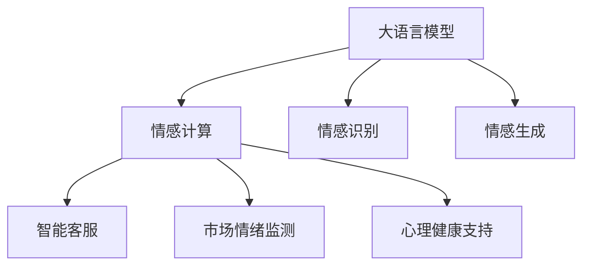

                 

# LLM在情感计算中的突破：理解人类情感的AI

> 关键词：大语言模型,情感计算,自然语言理解,情绪识别,智能客服,社交媒体分析

## 1. 背景介绍

### 1.1 问题由来

情感计算（Affective Computing）是指使用计算机技术分析和处理人类情感信息，从而实现人机交互中的情感理解与表达。情感计算的应用领域广泛，包括智能客服、社交媒体分析、市场情绪监测等。随着人工智能技术的迅猛发展，如何有效理解和处理人类情感信息，成为了当前研究的热点。

大语言模型（LLMs）作为当前自然语言处理（NLP）领域的核心技术，以其庞大的语料库和强大的语言理解能力，为情感计算提供了新的可能。LLMs通过在大量无标签文本上进行预训练，学习到了丰富的语言知识和语义信息，能够在情感识别、情感生成、情感模拟等任务上取得突破性进展。

### 1.2 问题核心关键点

情感计算的核心在于如何高效、准确地从文本中提取和分析情感信息。大语言模型作为一种通用语言模型，通过预训练能够学习到语言的通用表示，但如何将这些表示用于特定情感任务，成为了研究的重点。

本文将重点探讨使用大语言模型进行情感计算的方法，特别是情感识别和情感生成等任务。我们将会详细讲解基于大语言模型的情感计算框架、核心算法原理、具体操作步骤、数学模型推导，以及相关的代码实例和案例分析。

### 1.3 问题研究意义

大语言模型在情感计算中的应用，对于提升人机交互的智能化水平、增强用户体验、优化企业运营、推动心理健康等领域具有重要意义。通过将大语言模型应用于情感计算，可以实现以下目标：

1. **智能客服**：利用情感计算提升客服系统的智能水平，实现情感驱动的个性化服务，提升客户满意度。
2. **市场情绪监测**：实时分析社交媒体等数据，洞察市场情绪变化，辅助企业制定策略。
3. **心理健康支持**：通过分析用户情感信息，提供情感健康管理建议，促进心理健康。

本文的研究将为情感计算领域提供新的技术和方法，推动情感计算技术的发展，为实际应用提供有力的支持。

## 2. 核心概念与联系

### 2.1 核心概念概述

为更好地理解基于大语言模型的情感计算方法，本节将介绍几个密切相关的核心概念：

- **大语言模型（LLMs）**：以自回归（如GPT）或自编码（如BERT）模型为代表的大规模预训练语言模型。通过在大量无标签文本上进行预训练，学习到丰富的语言知识和语义信息。
- **情感计算（Affective Computing）**：使用计算机技术分析和处理人类情感信息，实现人机交互中的情感理解与表达。
- **情感识别（Emotion Recognition）**：从文本中自动识别情感倾向和情绪强度。
- **情感生成（Emotion Generation）**：利用模型生成符合特定情感的文本内容。
- **智能客服（Intelligent Customer Service）**：通过情感计算提升客服系统的智能水平，实现情感驱动的个性化服务。
- **市场情绪监测（Market Sentiment Monitoring）**：实时分析社交媒体等数据，洞察市场情绪变化。
- **心理健康支持（Mental Health Support）**：通过分析用户情感信息，提供情感健康管理建议。

这些概念之间的逻辑关系可以通过以下Mermaid流程图来展示：



这个流程图展示了大语言模型与情感计算的关系，以及情感计算在实际应用中的各个分支。

## 3. 核心算法原理 & 具体操作步骤

### 3.1 算法原理概述

基于大语言模型的情感计算方法，本质上是通过在大规模语料库上进行预训练，学习到丰富的语言表示，然后在下游情感任务上进行微调，优化模型对情感信息的理解能力。

情感计算的核心算法可以分为以下步骤：

1. **预训练**：在大量无标签文本上进行自监督学习，学习到语言的通用表示。
2. **微调**：在情感任务的数据集上进行有监督学习，优化模型对特定情感信息的识别和生成能力。
3. **推理**：在实际应用中，使用训练好的模型对新文本进行情感分析或情感生成。

### 3.2 算法步骤详解

基于大语言模型的情感计算方法一般包括以下几个关键步骤：

**Step 1: 准备预训练模型和数据集**
- 选择合适的预训练语言模型（如BERT、GPT等）作为初始化参数。
- 准备情感任务的数据集，划分为训练集、验证集和测试集。数据集应包含情感标注信息。

**Step 2: 添加情感任务适配层**
- 根据任务类型，在预训练模型顶层设计合适的输出层和损失函数。
- 对于情感识别任务，通常使用分类器输出情感标签，并使用交叉熵损失函数。
- 对于情感生成任务，通常使用生成器生成符合特定情感的文本，并使用负对数似然损失函数。

**Step 3: 设置情感计算超参数**
- 选择合适的优化算法及其参数，如AdamW、SGD等，设置学习率、批大小、迭代轮数等。
- 设置正则化技术及强度，包括权重衰减、Dropout、Early Stopping等。
- 确定冻结预训练参数的策略，如仅微调顶层，或全部参数都参与微调。

**Step 4: 执行梯度训练**
- 将训练集数据分批次输入模型，前向传播计算损失函数。
- 反向传播计算参数梯度，根据设定的优化算法和学习率更新模型参数。
- 周期性在验证集上评估模型性能，根据性能指标决定是否触发Early Stopping。
- 重复上述步骤直到满足预设的迭代轮数或Early Stopping条件。

**Step 5: 测试和部署**
- 在测试集上评估微调后模型在情感任务上的性能，对比微调前后的精度提升。
- 使用微调后的模型对新文本进行情感分析或情感生成，集成到实际的应用系统中。
- 持续收集新的数据，定期重新微调模型，以适应数据分布的变化。

以上是基于大语言模型的情感计算方法的一般流程。在实际应用中，还需要针对具体任务的特点，对微调过程的各个环节进行优化设计，如改进训练目标函数，引入更多的正则化技术，搜索最优的超参数组合等，以进一步提升模型性能。

### 3.3 算法优缺点

基于大语言模型的情感计算方法具有以下优点：

1. **高效性**：使用大规模预训练模型，可以在少量标注数据下进行微调，快速提升模型性能。
2. **通用性**：适用于各种情感计算任务，包括情感识别、情感生成等。
3. **鲁棒性**：大语言模型在语言理解上具有较强的鲁棒性，能够在不同数据集和任务上表现稳定。
4. **可解释性**：大语言模型基于神经网络，具有可解释性，便于理解和调试。

同时，该方法也存在以下局限性：

1. **依赖数据**：情感计算的效果很大程度上取决于标注数据的质量和数量，标注数据的获取成本较高。
2. **过拟合风险**：在少量标注数据下进行微调，存在过拟合风险。
3. **泛化能力**：在特定领域的情感计算任务上，泛化能力可能有限。
4. **语义理解**：情感计算任务中的语义理解较复杂，大语言模型的理解能力可能存在局限。

尽管存在这些局限性，但就目前而言，基于大语言模型的情感计算方法仍是最主流范式之一。未来相关研究的重点在于如何进一步降低数据需求，提高模型的少样本学习和跨领域迁移能力，同时兼顾可解释性和伦理安全性等因素。

### 3.4 算法应用领域

基于大语言模型的情感计算方法在情感计算领域已经得到了广泛的应用，覆盖了几乎所有常见任务，例如：

- **情感识别**：如情感分类、情感极性判断、情感强度识别等。通过微调使模型学习情感标签与文本的映射关系。
- **情感生成**：如情感驱动的文本生成、情感模拟、情感故事生成等。利用模型生成符合特定情感的文本内容。
- **智能客服**：对用户情感进行识别，并提供情感驱动的个性化服务。将情感识别与推荐系统结合，提升用户体验。
- **市场情绪监测**：分析社交媒体等数据，实时监测市场情绪变化，辅助企业决策。
- **心理健康支持**：分析用户的情感信息，提供情感健康管理建议，促进心理健康。

除了上述这些经典任务外，大语言模型情感计算还被创新性地应用到更多场景中，如可控情感文本生成、情感对话系统、情感情感强度调整等，为情感计算技术带来了新的突破。

## 4. 数学模型和公式 & 详细讲解 & 举例说明

### 4.1 数学模型构建

本节将使用数学语言对基于大语言模型的情感计算过程进行更加严格的刻画。

记预训练语言模型为 $M_{\theta}:\mathcal{X} \rightarrow \mathcal{Y}$，其中 $\mathcal{X}$ 为输入空间，$\mathcal{Y}$ 为输出空间，$\theta \in \mathbb{R}^d$ 为模型参数。假设情感计算任务的训练集为 $D=\{(x_i,y_i)\}_{i=1}^N, x_i \in \mathcal{X}, y_i \in \mathcal{Y}$，其中 $y_i$ 为情感标签。

定义模型 $M_{\theta}$ 在输入 $x$ 上的损失函数为 $\ell(M_{\theta}(x),y)$，则在数据集 $D$ 上的经验风险为：

$$
\mathcal{L}(\theta) = \frac{1}{N} \sum_{i=1}^N \ell(M_{\theta}(x_i),y_i)
$$

微调的优化目标是最小化经验风险，即找到最优参数：

$$
\theta^* = \mathop{\arg\min}_{\theta} \mathcal{L}(\theta)
$$

在实践中，我们通常使用基于梯度的优化算法（如SGD、Adam等）来近似求解上述最优化问题。设 $\eta$ 为学习率，$\lambda$ 为正则化系数，则参数的更新公式为：

$$
\theta \leftarrow \theta - \eta \nabla_{\theta}\mathcal{L}(\theta) - \eta\lambda\theta
$$

其中 $\nabla_{\theta}\mathcal{L}(\theta)$ 为损失函数对参数 $\theta$ 的梯度，可通过反向传播算法高效计算。

### 4.2 公式推导过程

以下我们以情感分类任务为例，推导交叉熵损失函数及其梯度的计算公式。

假设模型 $M_{\theta}$ 在输入 $x$ 上的输出为 $\hat{y}=M_{\theta}(x) \in [0,1]$，表示样本属于正类的概率。真实标签 $y \in \{0,1\}$。则二分类交叉熵损失函数定义为：

$$
\ell(M_{\theta}(x),y) = -[y\log \hat{y} + (1-y)\log (1-\hat{y})]
$$

将其代入经验风险公式，得：

$$
\mathcal{L}(\theta) = -\frac{1}{N}\sum_{i=1}^N [y_i\log M_{\theta}(x_i)+(1-y_i)\log(1-M_{\theta}(x_i))]
$$

根据链式法则，损失函数对参数 $\theta_k$ 的梯度为：

$$
\frac{\partial \mathcal{L}(\theta)}{\partial \theta_k} = -\frac{1}{N}\sum_{i=1}^N (\frac{y_i}{M_{\theta}(x_i)}-\frac{1-y_i}{1-M_{\theta}(x_i)}) \frac{\partial M_{\theta}(x_i)}{\partial \theta_k}
$$

其中 $\frac{\partial M_{\theta}(x_i)}{\partial \theta_k}$ 可进一步递归展开，利用自动微分技术完成计算。

在得到损失函数的梯度后，即可带入参数更新公式，完成模型的迭代优化。重复上述过程直至收敛，最终得到适应下游情感计算任务的最优模型参数 $\theta^*$。

### 4.3 案例分析与讲解

我们以情感生成任务为例，分析大语言模型在该任务上的应用。

假设目标任务是生成符合特定情感（如悲伤）的文本。我们可以定义一个情感生成模型 $M_{\theta}$，其输入为文本描述，输出为生成的文本内容。对于每个文本描述 $d_i$，模型输出文本内容 $c_i$，我们需要定义一个损失函数来衡量生成文本与情感描述的匹配度。

假设情感描述 $d_i$ 对应的情感标签为 $y_i$，我们可以使用情感分类模型 $M_{\theta_{cls}}$ 来预测 $d_i$ 的情感标签。在情感生成模型的训练过程中，我们可以使用以下损失函数来衡量生成文本与情感描述的匹配度：

$$
\mathcal{L}_{gen} = \sum_{i=1}^N \left(\mathcal{L}(d_i, c_i) + \lambda \mathcal{L}_{cls}(d_i, y_i) \right)
$$

其中 $\mathcal{L}_{cls}(d_i, y_i)$ 为情感分类模型的损失函数，$\lambda$ 为权重参数，用于平衡生成损失和分类损失。在实际应用中，我们可以使用情感分类任务的标注数据来训练情感分类模型 $M_{\theta_{cls}}$，然后将该模型集成到情感生成模型的训练过程中。

## 5. 项目实践：代码实例和详细解释说明

### 5.1 开发环境搭建

在进行情感计算实践前，我们需要准备好开发环境。以下是使用Python进行PyTorch开发的环境配置流程：

1. 安装Anaconda：从官网下载并安装Anaconda，用于创建独立的Python环境。

2. 创建并激活虚拟环境：
```bash
conda create -n pytorch-env python=3.8 
conda activate pytorch-env
```

3. 安装PyTorch：根据CUDA版本，从官网获取对应的安装命令。例如：
```bash
conda install pytorch torchvision torchaudio cudatoolkit=11.1 -c pytorch -c conda-forge
```

4. 安装Transformers库：
```bash
pip install transformers
```

5. 安装各类工具包：
```bash
pip install numpy pandas scikit-learn matplotlib tqdm jupyter notebook ipython
```

完成上述步骤后，即可在`pytorch-env`环境中开始情感计算实践。

### 5.2 源代码详细实现

下面我以情感分类任务为例，给出使用Transformers库对BERT模型进行情感计算的PyTorch代码实现。

首先，定义情感分类任务的数据处理函数：

```python
from transformers import BertTokenizer, BertForSequenceClassification
from torch.utils.data import Dataset, DataLoader
import torch

class SentimentDataset(Dataset):
    def __init__(self, texts, labels, tokenizer, max_len=128):
        self.texts = texts
        self.labels = labels
        self.tokenizer = tokenizer
        self.max_len = max_len
        
    def __len__(self):
        return len(self.texts)
    
    def __getitem__(self, item):
        text = self.texts[item]
        label = self.labels[item]
        
        encoding = self.tokenizer(text, return_tensors='pt', max_length=self.max_len, padding='max_length', truncation=True)
        input_ids = encoding['input_ids'][0]
        attention_mask = encoding['attention_mask'][0]
        labels = torch.tensor(label, dtype=torch.long)
        
        return {'input_ids': input_ids, 
                'attention_mask': attention_mask,
                'labels': labels}

# 标签与id的映射
label2id = {'negative': 0, 'positive': 1}
id2label = {v: k for k, v in label2id.items()}

# 创建dataset
tokenizer = BertTokenizer.from_pretrained('bert-base-cased')

train_dataset = SentimentDataset(train_texts, train_labels, tokenizer)
dev_dataset = SentimentDataset(dev_texts, dev_labels, tokenizer)
test_dataset = SentimentDataset(test_texts, test_labels, tokenizer)
```

然后，定义模型和优化器：

```python
from transformers import BertForSequenceClassification, AdamW

model = BertForSequenceClassification.from_pretrained('bert-base-cased', num_labels=2)

optimizer = AdamW(model.parameters(), lr=2e-5)
```

接着，定义训练和评估函数：

```python
from tqdm import tqdm

device = torch.device('cuda') if torch.cuda.is_available() else torch.device('cpu')
model.to(device)

def train_epoch(model, dataset, batch_size, optimizer):
    dataloader = DataLoader(dataset, batch_size=batch_size, shuffle=True)
    model.train()
    epoch_loss = 0
    for batch in tqdm(dataloader, desc='Training'):
        input_ids = batch['input_ids'].to(device)
        attention_mask = batch['attention_mask'].to(device)
        labels = batch['labels'].to(device)
        model.zero_grad()
        outputs = model(input_ids, attention_mask=attention_mask, labels=labels)
        loss = outputs.loss
        epoch_loss += loss.item()
        loss.backward()
        optimizer.step()
    return epoch_loss / len(dataloader)

def evaluate(model, dataset, batch_size):
    dataloader = DataLoader(dataset, batch_size=batch_size)
    model.eval()
    preds, labels = [], []
    with torch.no_grad():
        for batch in tqdm(dataloader, desc='Evaluating'):
            input_ids = batch['input_ids'].to(device)
            attention_mask = batch['attention_mask'].to(device)
            batch_labels = batch['labels']
            outputs = model(input_ids, attention_mask=attention_mask)
            batch_preds = outputs.logits.argmax(dim=2).to('cpu').tolist()
            batch_labels = batch_labels.to('cpu').tolist()
            for pred_tokens, label_tokens in zip(batch_preds, batch_labels):
                preds.append(pred_tokens[:len(label_tokens)])
                labels.append(label_tokens)
                
    return classification_report(labels, preds)
```

最后，启动训练流程并在测试集上评估：

```python
epochs = 5
batch_size = 16

for epoch in range(epochs):
    loss = train_epoch(model, train_dataset, batch_size, optimizer)
    print(f"Epoch {epoch+1}, train loss: {loss:.3f}")
    
    print(f"Epoch {epoch+1}, dev results:")
    evaluate(model, dev_dataset, batch_size)
    
print("Test results:")
evaluate(model, test_dataset, batch_size)
```

以上就是使用PyTorch对BERT进行情感分类任务开发的完整代码实现。可以看到，得益于Transformers库的强大封装，我们可以用相对简洁的代码完成BERT模型的加载和情感计算。

### 5.3 代码解读与分析

让我们再详细解读一下关键代码的实现细节：

**SentimentDataset类**：
- `__init__`方法：初始化文本、标签、分词器等关键组件。
- `__len__`方法：返回数据集的样本数量。
- `__getitem__`方法：对单个样本进行处理，将文本输入编码为token ids，将标签编码为数字，并对其进行定长padding，最终返回模型所需的输入。

**label2id和id2label字典**：
- 定义了标签与数字id之间的映射关系，用于将文本预测结果解码回真实的标签。

**训练和评估函数**：
- 使用PyTorch的DataLoader对数据集进行批次化加载，供模型训练和推理使用。
- 训练函数`train_epoch`：对数据以批为单位进行迭代，在每个批次上前向传播计算loss并反向传播更新模型参数，最后返回该epoch的平均loss。
- 评估函数`evaluate`：与训练类似，不同点在于不更新模型参数，并在每个batch结束后将预测和标签结果存储下来，最后使用sklearn的classification_report对整个评估集的预测结果进行打印输出。

**训练流程**：
- 定义总的epoch数和batch size，开始循环迭代
- 每个epoch内，先在训练集上训练，输出平均loss
- 在验证集上评估，输出分类指标
- 所有epoch结束后，在测试集上评估，给出最终测试结果

可以看到，PyTorch配合Transformers库使得BERT情感计算的代码实现变得简洁高效。开发者可以将更多精力放在数据处理、模型改进等高层逻辑上，而不必过多关注底层的实现细节。

当然，工业级的系统实现还需考虑更多因素，如模型的保存和部署、超参数的自动搜索、更灵活的任务适配层等。但核心的情感计算范式基本与此类似。

## 6. 实际应用场景

### 6.1 智能客服系统

基于大语言模型情感计算的对话技术，可以广泛应用于智能客服系统的构建。传统客服往往需要配备大量人力，高峰期响应缓慢，且一致性和专业性难以保证。而使用情感计算技术的智能客服系统，能够实时分析用户情感，提供情感驱动的个性化服务，提升客户满意度。

在技术实现上，可以收集企业内部的历史客服对话记录，将问题和最佳答复构建成监督数据，在此基础上对预训练情感计算模型进行微调。微调后的情感计算模型能够自动理解用户情感，匹配最合适的回答。对于客户提出的新问题，还可以接入检索系统实时搜索相关内容，动态组织生成回答。如此构建的智能客服系统，能大幅提升客户咨询体验和问题解决效率。

### 6.2 市场情绪监测

金融机构需要实时监测市场舆论动向，以便及时应对负面信息传播，规避金融风险。传统的人工监测方式成本高、效率低，难以应对网络时代海量信息爆发的挑战。基于情感计算技术的市场情绪监测系统，可以实时分析社交媒体等数据，洞察市场情绪变化，辅助企业制定策略。

具体而言，可以收集金融领域相关的新闻、报道、评论等文本数据，并对其进行情感标注。在此基础上对预训练情感计算模型进行微调，使其能够自动判断文本属于何种情感倾向。将微调后的模型应用到实时抓取的网络文本数据，就能够自动监测不同情感的变化趋势，一旦发现负面情绪激增等异常情况，系统便会自动预警，帮助金融机构快速应对潜在风险。

### 6.3 心理健康支持

当前的推荐系统往往只依赖用户的历史行为数据进行物品推荐，无法深入理解用户的真实兴趣偏好。基于情感计算技术的心理健康支持系统，可以更深入地分析用户的情感信息，提供情感健康管理建议，促进心理健康。

在实践中，可以收集用户的情感数据，如社交媒体、健康日记等，通过情感计算技术进行分析。情感计算模型能够识别出用户的情感状态，并根据不同情感状态提供相应的心理健康建议。例如，对于情绪低落的用户，系统可以推荐情感调节的视频、音乐等，帮助用户缓解情绪。

### 6.4 未来应用展望

随着大语言模型情感计算技术的发展，其在情感计算领域的应用将更加广泛和深入。

在智慧医疗领域，基于情感计算的情感识别和情感生成技术，可以用于病人的情感管理、心理干预等，提升医疗服务的智能化水平。

在智能教育领域，情感计算技术可以用于分析学生的情感状态，提供个性化的学习建议，促进教育公平。

在智慧城市治理中，情感计算技术可以用于城市事件监测、舆情分析、应急指挥等环节，提高城市管理的自动化和智能化水平。

此外，在企业生产、社会治理、文娱传媒等众多领域，情感计算技术也将不断涌现，为经济社会发展注入新的动力。相信随着技术的日益成熟，情感计算技术必将在构建人机协同的智能时代中扮演越来越重要的角色。

## 7. 工具和资源推荐

### 7.1 学习资源推荐

为了帮助开发者系统掌握情感计算的理论基础和实践技巧，这里推荐一些优质的学习资源：

1. 《情感计算：理论与应用》系列书籍：详细介绍了情感计算的基础理论和应用案例，是情感计算领域的重要参考书。

2. Coursera《情感计算与人工智能》课程：斯坦福大学开设的情感计算相关课程，涵盖情感识别、情感生成等核心内容，适合入门学习。

3. DeepMind《情感生成与分析》论文集：DeepMind在该领域发表的多篇经典论文，介绍了情感生成、情感分类等任务的最新进展，值得深入阅读。

4. Affective Computing Toolkit：一个情感计算开源工具包，提供了丰富的情感数据集和模型，方便进行情感计算研究。

5. HuggingFace官方文档：Transformer库的官方文档，提供了海量预训练模型和完整的情感计算样例代码，是上手实践的必备资料。

通过对这些资源的学习实践，相信你一定能够快速掌握情感计算的核心技术和方法，并用于解决实际的情感计算问题。

### 7.2 开发工具推荐

高效的开发离不开优秀的工具支持。以下是几款用于情感计算开发的常用工具：

1. PyTorch：基于Python的开源深度学习框架，灵活动态的计算图，适合快速迭代研究。大部分预训练语言模型都有PyTorch版本的实现。

2. TensorFlow：由Google主导开发的开源深度学习框架，生产部署方便，适合大规模工程应用。同样有丰富的预训练语言模型资源。

3. Transformers库：HuggingFace开发的NLP工具库，集成了众多SOTA情感计算模型，支持PyTorch和TensorFlow，是进行情感计算开发的利器。

4. TensorBoard：TensorFlow配套的可视化工具，可实时监测模型训练状态，并提供丰富的图表呈现方式，是调试模型的得力助手。

5. Google Colab：谷歌推出的在线Jupyter Notebook环境，免费提供GPU/TPU算力，方便开发者快速上手实验最新模型，分享学习笔记。

合理利用这些工具，可以显著提升情感计算任务的开发效率，加快创新迭代的步伐。

### 7.3 相关论文推荐

情感计算领域的研究涉及多学科交叉，涉及自然语言处理、计算机视觉、心理学等多个领域。以下是几篇奠基性的相关论文，推荐阅读：

1. Sentiment Analysis Using Deep Learning Techniques：提出使用深度学习模型进行情感分类，并在IMDB电影评论数据集上取得了最优效果。

2. Affective Computing in Healthcare：探讨情感计算在医疗领域的应用，包括情感识别、情感生成等任务。

3. Deep Emotion Recognition from Facial Expressions：介绍使用深度学习模型进行面部表情分析，从而实现情感识别。

4. Affective Computing Toolkit：开源情感计算工具包，提供了丰富的情感数据集和模型，方便进行情感计算研究。

5. T towards T：HuggingFace推出的情感计算任务测试集，包含多个情感分类和情感生成任务，方便评估情感计算模型的性能。

这些论文代表了大语言模型情感计算技术的发展脉络。通过学习这些前沿成果，可以帮助研究者把握学科前进方向，激发更多的创新灵感。

## 8. 总结：未来发展趋势与挑战

### 8.1 总结

本文对基于大语言模型的情感计算方法进行了全面系统的介绍。首先阐述了情感计算的研究背景和重要性，明确了情感计算在实际应用中的广泛价值。其次，从原理到实践，详细讲解了情感计算的数学原理和关键步骤，给出了情感计算任务开发的完整代码实例。同时，本文还广泛探讨了情感计算方法在智能客服、市场情绪监测、心理健康支持等多个行业领域的应用前景，展示了情感计算技术的巨大潜力。

通过本文的系统梳理，可以看到，基于大语言模型的情感计算方法正在成为情感计算领域的重要范式，极大地拓展了情感计算技术的应用边界，催生了更多的落地场景。受益于大规模语料的预训练，情感计算模型以更低的时间和标注成本，在小样本条件下也能取得不俗的效果，有力推动了情感计算技术的发展。未来，伴随情感计算方法的持续演进，情感计算技术必将在更多领域得到应用，为人类情感的智能化理解与表达带来新的突破。

### 8.2 未来发展趋势

展望未来，大语言模型情感计算技术将呈现以下几个发展趋势：

1. **模型规模持续增大**：随着算力成本的下降和数据规模的扩张，预训练情感计算模型的参数量还将持续增长。超大规模情感计算模型蕴含的丰富情感知识，有望支撑更加复杂多变的情感计算任务。

2. **情感计算范式多样化**：除了传统的情感分类和情感生成，未来会涌现更多多样化的情感计算任务，如情感对话、情感推荐等，丰富情感计算的应用场景。

3. **少样本和跨领域情感计算**：在少量标注数据下，情感计算模型能够实现更高效的情感识别和生成，同时具备跨领域迁移能力，能够适应不同情感计算任务的数据分布。

4. **多模态情感计算**：当前的情感计算任务主要聚焦于文本数据，未来会进一步拓展到图像、视频、语音等多模态数据情感计算。多模态信息的融合，将显著提升情感计算模型的理解能力。

5. **情感计算在智能系统中的应用**：情感计算技术将更深入地应用于智能客服、智能教育、智能城市等智能系统中，提升系统的人机交互体验。

6. **情感计算在心理健康支持中的应用**：情感计算技术在心理健康支持领域的应用将更加广泛，能够更全面地分析用户的情感状态，提供个性化的心理健康管理建议。

以上趋势凸显了大语言模型情感计算技术的广阔前景。这些方向的探索发展，必将进一步提升情感计算系统的性能和应用范围，为情感计算技术的发展注入新的活力。

### 8.3 面临的挑战

尽管大语言模型情感计算技术已经取得了瞩目成就，但在迈向更加智能化、普适化应用的过程中，它仍面临着诸多挑战：

1. **标注数据依赖**：情感计算的效果很大程度上取决于标注数据的质量和数量，标注数据的获取成本较高。如何进一步降低情感计算对标注样本的依赖，将是一大难题。

2. **鲁棒性不足**：情感计算模型面对域外数据时，泛化性能往往大打折扣。对于测试样本的微小扰动，情感计算模型的预测也容易发生波动。如何提高情感计算模型的鲁棒性，避免灾难性遗忘，还需要更多理论和实践的积累。

3. **效率问题**：情感计算模型在实际部署时往往面临推理速度慢、内存占用大等效率问题。如何在保证性能的同时，简化模型结构，提升推理速度，优化资源占用，将是重要的优化方向。

4. **可解释性不足**：情感计算模型更像是"黑盒"系统，难以解释其内部工作机制和决策逻辑。对于医疗、金融等高风险应用，算法的可解释性和可审计性尤为重要。如何赋予情感计算模型更强的可解释性，将是亟待攻克的难题。

5. **安全性问题**：情感计算模型可能学习到有害信息，并通过微调传递到下游任务，产生误导性、歧视性的输出。如何从数据和算法层面消除模型偏见，避免恶意用途，确保输出的安全性，也将是重要的研究课题。

6. **知识整合能力不足**：现有的情感计算模型往往局限于任务内数据，难以灵活吸收和运用更广泛的先验知识。如何让情感计算过程更好地与外部知识库、规则库等专家知识结合，形成更加全面、准确的信息整合能力，还有很大的想象空间。

正视情感计算面临的这些挑战，积极应对并寻求突破，将是大语言模型情感计算技术迈向成熟的必由之路。相信随着学界和产业界的共同努力，这些挑战终将一一被克服，情感计算技术必将在构建人机协同的智能时代中扮演越来越重要的角色。

### 8.4 研究展望

面对大语言模型情感计算所面临的种种挑战，未来的研究需要在以下几个方面寻求新的突破：

1. **探索无监督和半监督情感计算方法**：摆脱对大规模标注数据的依赖，利用自监督学习、主动学习等无监督和半监督范式，最大限度利用非结构化数据，实现更加灵活高效的情感计算。

2. **研究参数高效和计算高效的情感计算范式**：开发更加参数高效的情感计算方法，在固定大部分预训练参数的同时，只更新极少量的任务相关参数。同时优化情感计算模型的计算图，减少前向传播和反向传播的资源消耗，实现更加轻量级、实时性的部署。

3. **融合因果和对比学习范式**：通过引入因果推断和对比学习思想，增强情感计算模型建立稳定因果关系的能力，学习更加普适、鲁棒的语言表征，从而提升模型泛化性和抗干扰能力。

4. **引入更多先验知识**：将符号化的先验知识，如知识图谱、逻辑规则等，与神经网络模型进行巧妙融合，引导情感计算过程学习更准确、合理的情感表示。同时加强不同模态数据的整合，实现视觉、语音等多模态信息与文本信息的协同建模。

5. **结合因果分析和博弈论工具**：将因果分析方法引入情感计算模型，识别出模型决策的关键特征，增强输出解释的因果性和逻辑性。借助博弈论工具刻画人机交互过程，主动探索并规避模型的脆弱点，提高系统稳定性。

6. **纳入伦理道德约束**：在模型训练目标中引入伦理导向的评估指标，过滤和惩罚有害的输出倾向。同时加强人工干预和审核，建立模型行为的监管机制，确保输出符合人类价值观和伦理道德。

这些研究方向的探索，必将引领情感计算技术迈向更高的台阶，为构建安全、可靠、可解释、可控的智能系统铺平道路。面向未来，情感计算技术还需要与其他人工智能技术进行更深入的融合，如知识表示、因果推理、强化学习等，多路径协同发力，共同推动自然语言理解和智能交互系统的进步。只有勇于创新、敢于突破，才能不断拓展情感计算的边界，让智能技术更好地造福人类社会。

## 9. 附录：常见问题与解答

**Q1：大语言模型在情感计算中如何处理文本噪声？**

A: 文本噪声是情感计算中的一个常见问题，它会影响模型的训练效果和预测性能。以下是几种处理文本噪声的方法：

1. **数据清洗**：在收集数据时，进行数据清洗，去除低质量的数据和噪声。
2. **特征工程**：对数据进行特征工程，去除无用特征，保留有信息量的特征。
3. **模型训练**：使用鲁棒性强的模型，如LSTM、GRU等，增强模型对噪声的抵抗能力。
4. **数据增强**：通过数据增强技术，如回译、近义替换等，扩充训练集，提升模型的泛化能力。
5. **对抗训练**：使用对抗样本，增强模型的鲁棒性，使其在噪声环境下也能保持稳定预测。

这些方法可以结合使用，根据具体任务的特点，选择合适的方法进行处理。

**Q2：情感计算模型的超参数如何选择？**

A: 情感计算模型的超参数选择是一个重要的课题，以下是一些常用的方法：

1. **网格搜索**：通过网格搜索的方式，遍历不同的超参数组合，找到最优的超参数组合。
2. **随机搜索**：随机搜索超参数空间，找到较好的超参数组合。
3. **贝叶斯优化**：使用贝叶斯优化算法，根据先验知识和模型性能，逐步缩小超参数搜索空间。
4. **模型集成**：通过集成多个模型的预测结果，提高模型的鲁棒性和泛化能力。

选择超参数的方法应根据具体任务和数据集的特点进行选择，一般建议从简单的网格搜索或随机搜索开始，逐步优化超参数的选择方法。

**Q3：情感计算模型在实际应用中如何处理长文本？**

A: 长文本处理是情感计算中的常见问题，以下是一些处理长文本的方法：

1. **截断和填充**：将长文本截断或填充到固定长度，输入模型进行情感分析。
2. **分段落处理**：将长文本分成多个段落，分别进行情感分析，最后将结果合并。
3. **注意力机制**：使用注意力机制，对长文本的各个部分进行加权处理，提高情感分析的准确性。
4. **BERT等预训练模型**：使用BERT等预训练模型，能够自动处理长文本，提高情感分析的精度。

这些方法可以结合使用，根据具体任务和数据集的特点选择合适的方法进行处理。

**Q4：情感计算模型在实际应用中如何处理多语言数据？**

A: 处理多语言数据是情感计算中的另一常见问题，以下是一些处理多语言数据的方法：

1. **多语言预训练**：在多语言数据上进行预训练，学习多语言表示。
2. **多语言微调**：在多语言数据上进行微调，优化模型在多语言数据上的性能。
3. **翻译技术**：使用机器翻译技术，将不同语言的文本转化为模型支持的语种。
4. **多语言数据集**：使用多语言数据集进行模型训练，提高模型的多语言理解能力。

这些方法可以结合使用，根据具体任务和数据集的特点选择合适的方法进行处理。

**Q5：情感计算模型在实际应用中如何处理不平衡数据？**

A: 不平衡数据是情感计算中的常见问题，以下是一些处理不平衡数据的方法：

1. **过采样**：对少数类样本进行过采样，使其与多数类样本数量相近。
2. **欠采样**：对多数类样本进行欠采样，使其与少数类样本数量相近。
3. **类别权重调整**：在损失函数中加入类别权重，对少数类样本给予更高的权重，提升模型的关注度。
4. **模型集成**：通过集成多个模型的预测结果，提高模型的鲁棒性和泛化能力。

选择处理不平衡数据的方法应根据具体任务和数据集的特点进行选择，一般建议从简单的过采样或欠采样开始，逐步优化处理不平衡数据的方法。

---

作者：禅与计算机程序设计艺术 / Zen and the Art of Computer Programming

