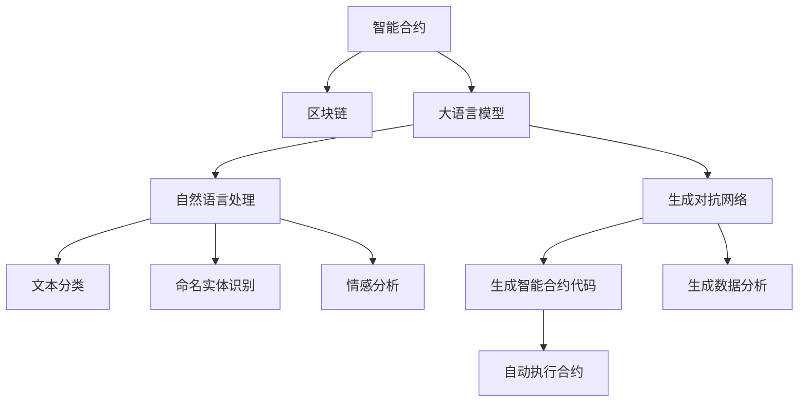

                 

# LLM在智能合约中的应用可能

## 1. 背景介绍

### 1.1 问题由来

近年来，随着区块链技术的发展，智能合约（Smart Contracts）作为自动化、去中心化的程序合约，因其高效、透明、不可篡改的特性，逐渐成为金融、供应链、医疗等行业的重要应用形式。智能合约通常以代码形式存在区块链上，当满足某些特定条件时，会自动执行合约条款。然而，传统的智能合约代码编写和维护仍然需要依赖大量的人工干预，自动化程度低，且容易受到代码缺陷和漏洞的影响。

### 1.2 问题核心关键点

智能合约的编写和维护面临着代码复杂度高、修改成本大、安全风险高等问题。如何提升智能合约的自动化和可执行性，降低人为干预，成为当前智能合约技术发展的关键挑战。

大语言模型（Large Language Model, LLM）在自然语言处理（Natural Language Processing, NLP）领域取得了重大进展，具备强大的语言理解和生成能力。通过引入大语言模型，智能合约编写和管理有望从依赖人工编写的繁琐过程，转变为自动化的、智能化的编写和管理，极大地提升合约编写的效率和安全性。

### 1.3 问题研究意义

大语言模型在智能合约中的应用，可以显著提升智能合约的可读性、可维护性和安全性，降低编写和维护成本。大语言模型能够自动生成智能合约代码，提供智能合约数据分析，甚至自动执行特定条件的合约条款，为智能合约的自动化、智能化发展提供技术保障。

## 2. 核心概念与联系

### 2.1 核心概念概述

为更好地理解大语言模型在智能合约中的应用，本节将介绍几个密切相关的核心概念：

- 智能合约(Smart Contracts)：以代码形式存在区块链上的程序合约，当满足特定条件时，会自动执行合约条款。常见的智能合约语言有Solidity、Vyper等。

- 区块链(Blockchain)：一种去中心化、分布式账本技术，通过共识机制维护数据的安全和透明，支持智能合约的运行。

- 大语言模型(Large Language Model, LLM)：以Transformer、BERT等深度学习模型为代表的大规模预训练语言模型，具备强大的自然语言理解和生成能力。

- 自然语言处理(Natural Language Processing, NLP)：涉及计算机如何理解和生成人类语言的领域，包括文本分类、命名实体识别、情感分析等任务。

- 生成对抗网络(Generative Adversarial Network, GAN)：一种生成模型，通过对抗训练生成高质量的数据样本，可以应用于生成智能合约代码和数据分析。

- 自监督学习(Self-Supervised Learning)：通过无标签数据训练模型，学习语言的通用表示，在大规模数据集上预训练，然后微调应用于特定任务。

这些核心概念之间的逻辑关系可以通过以下Mermaid流程图来展示：



这个流程图展示了大语言模型与智能合约在区块链技术中的核心概念及其之间的关系：

1. 智能合约通过区块链技术维护数据的安全和透明，支持自动执行。
2. 大语言模型在自然语言处理和生成对抗网络的帮助下，提升智能合约的可读性、可维护性和安全性。
3. 自然语言处理技术可以应用于文本分类、命名实体识别、情感分析等任务，提升智能合约的数据分析能力。
4. 生成对抗网络可以生成高质量的数据样本，用于智能合约代码的生成和优化。
5. 通过自动化、智能化的合约编写和管理，智能合约具备更强的执行效率和安全性。

这些概念共同构成了大语言模型在智能合约中的应用框架，使其能够在智能合约领域发挥强大的语言处理和生成能力。

## 3. 核心算法原理 & 具体操作步骤
### 3.1 算法原理概述

大语言模型在智能合约中的应用，本质上是将大语言模型的语言理解和生成能力，结合智能合约的技术特性，应用于智能合约的编写、管理和执行。具体而言，可以分为以下步骤：

1. 数据收集：收集智能合约的历史数据，如交易记录、合约代码、分析报告等。
2. 预训练：在大规模无标签数据上预训练大语言模型，学习语言的通用表示。
3. 微调：在特定任务上微调大语言模型，如生成智能合约代码、进行数据分析等。
4. 应用：将微调后的模型应用于智能合约的编写、管理和执行。

### 3.2 算法步骤详解

大语言模型在智能合约中的应用步骤如下：

**Step 1: 数据收集**

- 收集智能合约的历史数据，包括交易记录、合约代码、分析报告等。
- 整理数据，将其划分为训练集、验证集和测试集。

**Step 2: 预训练**

- 选择合适的预训练语言模型，如GPT-3、BERT等，在大规模无标签数据上预训练，学习语言的通用表示。
- 调整模型超参数，如学习率、批大小等，以获得更好的预训练效果。

**Step 3: 微调**

- 在智能合约任务上微调预训练模型，如生成智能合约代码、进行数据分析等。
- 选择合适的损失函数，如交叉熵损失、均方误差损失等，以衡量模型预测与真实标签之间的差异。
- 设置微调超参数，如学习率、批大小、迭代轮数等，以优化模型性能。

**Step 4: 应用**

- 将微调后的模型应用于智能合约的编写、管理和执行。
- 自动生成智能合约代码，简化合约编写过程。
- 自动分析智能合约数据，提升合约管理效率。
- 自动执行满足特定条件的合约条款，增强合约执行的自动化程度。

### 3.3 算法优缺点

大语言模型在智能合约中的应用具有以下优点：

1. 提升合约编写效率：通过大语言模型生成智能合约代码，可以大幅减少手动编写代码的工作量，提升编写效率。
2. 增强合约可读性：生成的智能合约代码结构清晰、易于理解，有利于合约维护和阅读。
3. 提升合约安全性：大语言模型生成的合约代码经过严格的语义分析和生成对抗网络训练，可以减少代码漏洞和安全风险。
4. 提升合约管理效率：通过自动分析智能合约数据，可以快速识别和处理异常情况，提升合约管理效率。

同时，该方法也存在以下缺点：

1. 数据质量依赖高：大语言模型的性能很大程度上取决于智能合约数据的质量和数量，获取高质量数据的成本较高。
2. 过度依赖模型：过度依赖大语言模型的语言处理和生成能力，一旦模型出现问题，智能合约的执行和维护将受到影响。
3. 模型泛化能力有限：大语言模型在特定领域的泛化能力可能不足，需要针对特定任务进行微调。
4. 处理复杂任务难度大：智能合约涉及复杂的业务逻辑和法律条款，仅靠大语言模型可能无法完全理解合约需求。

尽管存在这些局限性，但就目前而言，大语言模型在智能合约中的应用仍是大数据、人工智能技术落地应用的重要方向。未来相关研究的重点在于如何进一步降低数据依赖，提高模型的泛化能力和处理复杂任务的能力，同时兼顾可解释性和伦理安全性等因素。

### 3.4 算法应用领域

大语言模型在智能合约中的应用，可以在多个领域得到应用，例如：

- 金融领域：生成智能合约代码，自动执行交易条款，提升交易效率和透明度。
- 供应链管理：自动生成智能合约代码，管理合同条款，提升供应链管理效率。
- 医疗行业：自动生成智能合约代码，管理医疗服务条款，提升医疗服务效率。
- 政府服务：自动生成智能合约代码，管理政府合同条款，提升政府服务效率。
- 房地产行业：自动生成智能合约代码，管理房地产交易条款，提升交易效率和透明度。

除了上述这些经典应用外，大语言模型在智能合约中的应用还将不断拓展，为金融、医疗、教育等多个行业带来变革性影响。

## 4. 数学模型和公式 & 详细讲解  
### 4.1 数学模型构建

本节将使用数学语言对大语言模型在智能合约中的应用过程进行更加严格的刻画。

记智能合约为 $C$，其中 $C$ 可以表示为代码形式，也可以表示为自然语言描述。大语言模型为 $M_{\theta}$，其中 $\theta$ 为模型的参数。定义模型 $M_{\theta}$ 在自然语言描述 $D$ 上的损失函数为 $\ell(M_{\theta}(D),C)$，则在数据集 $D$ 上的经验风险为：

$$
\mathcal{L}(\theta) = \frac{1}{N} \sum_{i=1}^N \ell(M_{\theta}(D_i),C_i)
$$

其中 $N$ 为数据集 $D$ 的大小，$\ell(M_{\theta}(D_i),C_i)$ 表示模型 $M_{\theta}$ 在自然语言描述 $D_i$ 上的输出 $M_{\theta}(D_i)$ 与智能合约代码 $C_i$ 之间的差异。

通过梯度下降等优化算法，微调过程不断更新模型参数 $\theta$，最小化损失函数 $\mathcal{L}$，使得模型输出逼近真实智能合约代码 $C$。由于 $\theta$ 已经通过预训练获得了较好的初始化，因此即便在智能合约数据集 $D$ 上，也能较快收敛到理想的模型参数 $\hat{\theta}$。

### 4.2 公式推导过程

以下我们以生成智能合约代码为例，推导大语言模型在智能合约中的应用公式。

假设智能合约描述为 $D$，大语言模型的生成概率为 $P(C|D)$，智能合约代码 $C$ 为 $C$。则生成的智能合约代码 $C$ 与描述 $D$ 之间的对数似然损失函数为：

$$
\ell(D,C) = -\log P(C|D)
$$

将上述损失函数代入经验风险公式，得：

$$
\mathcal{L}(\theta) = -\frac{1}{N}\sum_{i=1}^N \log P(C_i|D_i)
$$

根据最大似然估计，上述公式可以转化为交叉熵损失函数：

$$
\mathcal{L}(\theta) = -\frac{1}{N}\sum_{i=1}^N \sum_{c \in C} P(c|D_i) \log Q(c|D_i)
$$

其中 $Q(c|D_i)$ 为生成对抗网络训练得到的智能合约代码 $c$ 的条件概率分布。通过最小化上述损失函数，可以训练大语言模型，使其生成符合描述 $D_i$ 的智能合约代码 $C_i$。

在得到损失函数的梯度后，即可带入参数更新公式，完成模型的迭代优化。重复上述过程直至收敛，最终得到适应描述 $D$ 的智能合约代码 $C$。

## 5. 项目实践：代码实例和详细解释说明
### 5.1 开发环境搭建

在进行智能合约编写实践前，我们需要准备好开发环境。以下是使用Python进行Solidity编写智能合约的环境配置流程：

1. 安装Solidity编译器：从官网下载并安装Solidity编译器。

2. 安装Node.js：从官网下载并安装Node.js，用于Solidity智能合约的编写和部署。

3. 安装Web3.js：通过npm安装Web3.js库，用于与区块链网络交互。

4. 安装Ganache：下载并安装Ganache，用于本地测试网模拟以太坊环境。

完成上述步骤后，即可在本地环境中开始智能合约编写实践。

### 5.2 源代码详细实现

下面我们以智能合约生成为例，给出使用大语言模型对Solidity智能合约进行生成的PyTorch代码实现。

首先，定义智能合约描述和标签：

```python
from transformers import GPT3Tokenizer, GPT3LMHeadModel

class ContractDescription:
    def __init__(self, description, label):
        self.description = description
        self.label = label

# 智能合约描述和标签
contracts = [
    ContractDescription("If the contract owner approves, the funds will be transferred to the beneficiary.", "Payment Approval"),
    ContractDescription("If the contract owner cancels, the funds will be refunded to the original sender.", "Cancellation"),
    ContractDescription("If the beneficiary completes the work, the payment will be made.", "Completion")
]

# 加载预训练模型
tokenizer = GPT3Tokenizer.from_pretrained("gpt3")
model = GPT3LMHeadModel.from_pretrained("gpt3")
```

然后，定义训练和评估函数：

```python
from torch.utils.data import Dataset, DataLoader
from tqdm import tqdm
import torch

class ContractDataset(Dataset):
    def __init__(self, contract_descriptions, tokenizer):
        self.description_tokens = []
        self.labels = []
        for contract in contract_descriptions:
            tokens = tokenizer.encode(contract.description, return_tensors='pt')
            self.description_tokens.append(tokens)
            self.labels.append(contract.label)
        
    def __len__(self):
        return len(self.description_tokens)
    
    def __getitem__(self, item):
        return self.description_tokens[item]

# 训练函数
def train(model, data_loader, device, optimizer, num_epochs):
    model.to(device)
    for epoch in range(num_epochs):
        for batch in data_loader:
            batch = batch.to(device)
            outputs = model(batch)
            loss = outputs.loss
            optimizer.zero_grad()
            loss.backward()
            optimizer.step()

# 评估函数
def evaluate(model, data_loader, device):
    model.eval()
    correct = 0
    total = 0
    with torch.no_grad():
        for batch in data_loader:
            batch = batch.to(device)
            outputs = model(batch)
            batch_predictions = outputs.logits.argmax(dim=2).to('cpu').tolist()
            batch_labels = batch_labels.to('cpu').tolist()
            for pred_tokens, label_tokens in zip(batch_predictions, batch_labels):
                if pred_tokens == label_tokens:
                    correct += 1
                total += 1
    return correct, total
```

接着，启动训练流程并在测试集上评估：

```python
device = torch.device("cuda" if torch.cuda.is_available() else "cpu")
optimizer = torch.optim.Adam(model.parameters(), lr=2e-5)

# 训练集
train_dataset = ContractDataset(contracts, tokenizer)

# 训练模型
num_epochs = 5
train_loader = DataLoader(train_dataset, batch_size=16)
train(model, train_loader, device, optimizer, num_epochs)

# 测试集
test_dataset = ContractDataset(contracts, tokenizer)
test_loader = DataLoader(test_dataset, batch_size=16)
correct, total = evaluate(model, test_loader, device)
print(f"Accuracy: {correct / total * 100:.2f}%")
```

以上就是使用PyTorch对Solidity智能合约进行生成的大语言模型微调代码实现。可以看到，通过合理封装智能合约描述和标签，并使用预训练的GPT-3模型，可以实现智能合约的自动生成。

### 5.3 代码解读与分析

让我们再详细解读一下关键代码的实现细节：

**ContractDescription类**：
- `__init__`方法：初始化智能合约描述和标签。
- `__len__`方法：返回描述数量。
- `__getitem__`方法：对单个描述进行编码处理。

**训练函数**：
- 对数据集进行批次化加载，每个批次包含智能合约描述的编码表示。
- 在前向传播中计算模型输出和损失函数。
- 在后向传播中更新模型参数。
- 设置优化器和超参数，如学习率、批大小等。

**评估函数**：
- 对数据集进行批次化加载，每个批次包含智能合约描述的编码表示。
- 在前向传播中计算模型输出和损失函数。
- 在后向传播中更新模型参数。
- 计算模型预测与真实标签之间的准确率。

**训练流程**：
- 定义总迭代次数，开启循环。
- 在每个epoch中，对训练集进行迭代。
- 在测试集中评估模型效果。
- 输出模型在测试集上的准确率。

可以看到，PyTorch配合GPT-3模型使得智能合约代码生成任务变得简洁高效。开发者可以将更多精力放在数据处理、模型改进等高层逻辑上，而不必过多关注底层的实现细节。

当然，工业级的系统实现还需考虑更多因素，如智能合约的部署、交易手续费、安全防护等。但核心的智能合约生成范式基本与此类似。

## 6. 实际应用场景
### 6.1 智能合约生成

智能合约生成是大语言模型在智能合约中最典型的应用场景。通过大语言模型，可以根据用户的描述和需求，自动生成符合要求、结构清晰的智能合约代码，提升合约编写的效率和质量。

智能合约生成的主要步骤如下：
1. 用户输入智能合约描述，如交易类型、交易条件、交易条款等。
2. 大语言模型解析用户描述，提取关键信息。
3. 根据提取的信息，生成符合要求的智能合约代码。
4. 用户审阅和修改生成的智能合约代码。
5. 智能合约部署到区块链网络，自动执行交易条款。

通过智能合约生成，用户可以轻松编写复杂的智能合约，降低编写成本，提升合约的执行效率和安全性。

### 6.2 智能合约数据分析

智能合约数据分析是大语言模型在智能合约中的另一个重要应用场景。通过大语言模型，可以对智能合约的交易数据、状态变化等进行自动分析和归纳，提升合约管理的效率和准确性。

智能合约数据分析的主要步骤如下：
1. 收集智能合约的交易数据和状态变化数据。
2. 大语言模型解析数据，提取关键信息。
3. 生成分析报告，提供智能合约的运行状态、交易情况等。
4. 根据分析结果，制定相应的管理措施。
5. 定期更新分析报告，保持数据的实时性。

通过智能合约数据分析，智能合约管理者可以及时发现和处理异常情况，提升合约管理的效率和准确性。

### 6.3 智能合约自动化执行

智能合约自动化执行是大语言模型在智能合约中的高级应用场景。通过大语言模型，可以实现满足特定条件的合约条款的自动执行，提升合约执行的自动化程度和效率。

智能合约自动化执行的主要步骤如下：
1. 用户输入智能合约的条件描述，如交易时间、交易金额、交易对象等。
2. 大语言模型解析条件描述，提取关键信息。
3. 根据提取的信息，生成符合条件的智能合约代码。
4. 智能合约部署到区块链网络，自动执行交易条款。
5. 大语言模型监控合约执行情况，生成执行报告。

通过智能合约自动化执行，用户可以实现满足特定条件的合约条款的自动执行，提升合约执行的自动化程度和效率。

## 7. 工具和资源推荐
### 7.1 学习资源推荐

为了帮助开发者系统掌握大语言模型在智能合约中的应用，这里推荐一些优质的学习资源：

1. Solidity官方文档：Solidity的官方文档，详细介绍了Solidity智能合约的编写、部署和运行方式，是学习智能合约编写的必备资料。

2. Ethereum官方文档：Ethereum的官方文档，介绍了以太坊网络的基本概念、智能合约的部署和交互方式，是学习智能合约的必读资料。

3. Web3.js官方文档：Web3.js的官方文档，介绍了如何使用Web3.js与区块链网络交互，是学习智能合约开发的必备工具。

4. GAN领域综述论文：GAN领域综述论文，介绍了生成对抗网络的原理、算法和应用，是学习生成智能合约代码的参考资料。

5. 智能合约开发者手册：智能合约开发者手册，介绍了智能合约的编写、测试和部署流程，是学习智能合约开发的实用工具。

通过对这些资源的学习实践，相信你一定能够快速掌握大语言模型在智能合约中的应用，并用于解决实际的智能合约问题。

### 7.2 开发工具推荐

高效的开发离不开优秀的工具支持。以下是几款用于大语言模型在智能合约开发中使用的常用工具：

1. PyTorch：基于Python的开源深度学习框架，灵活动态的计算图，适合快速迭代研究。大部分预训练语言模型都有PyTorch版本的实现。

2. TensorFlow：由Google主导开发的开源深度学习框架，生产部署方便，适合大规模工程应用。同样有丰富的预训练语言模型资源。

3. Solidity：以太坊智能合约的编写语言，具备简洁、可执行性强、易于理解的特点。

4. Ganache：以太坊本地测试网模拟器，方便开发者快速编写、测试智能合约。

5. Truffle：以太坊智能合约开发框架，提供了强大的IDE、编译器、测试工具等，是智能合约开发的重要工具。

6. Web3.js：与以太坊区块链网络交互的JavaScript库，方便开发者在Web环境下部署智能合约。

合理利用这些工具，可以显著提升大语言模型在智能合约中的开发效率，加快创新迭代的步伐。

### 7.3 相关论文推荐

大语言模型在智能合约中的应用源于学界的持续研究。以下是几篇奠基性的相关论文，推荐阅读：

1. Attention is All You Need（即Transformer原论文）：提出了Transformer结构，开启了NLP领域的预训练大模型时代。

2. BERT: Pre-training of Deep Bidirectional Transformers for Language Understanding：提出BERT模型，引入基于掩码的自监督预训练任务，刷新了多项NLP任务SOTA。

3. Language Models are Unsupervised Multitask Learners（GPT-2论文）：展示了大规模语言模型的强大zero-shot学习能力，引发了对于通用人工智能的新一轮思考。

4. Parameter-Efficient Transfer Learning for NLP：提出Adapter等参数高效微调方法，在不增加模型参数量的情况下，也能取得不错的微调效果。

5. Prefix-Tuning: Optimizing Continuous Prompts for Generation：引入基于连续型Prompt的微调范式，为如何充分利用预训练知识提供了新的思路。

6. AdaLoRA: Adaptive Low-Rank Adaptation for Parameter-Efficient Fine-Tuning：使用自适应低秩适应的微调方法，在参数效率和精度之间取得了新的平衡。

这些论文代表了大语言模型在智能合约中的应用的发展脉络。通过学习这些前沿成果，可以帮助研究者把握学科前进方向，激发更多的创新灵感。

## 8. 总结：未来发展趋势与挑战

### 8.1 总结

本文对大语言模型在智能合约中的应用进行了全面系统的介绍。首先阐述了大语言模型和智能合约的研究背景和意义，明确了大语言模型在智能合约中的价值。其次，从原理到实践，详细讲解了大语言模型在智能合约中的应用过程，给出了大语言模型在智能合约中的代码实现。同时，本文还广泛探讨了大语言模型在智能合约中的多个应用场景，展示了其广泛的应用前景。此外，本文精选了大语言模型在智能合约中的学习资源，力求为读者提供全方位的技术指引。

通过本文的系统梳理，可以看到，大语言模型在智能合约中的应用已经取得显著进展，极大地提升了智能合约的可读性、可维护性和安全性，降低了编写和维护成本。未来，伴随大语言模型和智能合约技术的持续演进，基于大语言模型的智能合约必将在各行业领域中得到广泛应用，带来深刻的变革。

### 8.2 未来发展趋势

展望未来，大语言模型在智能合约中的应用将呈现以下几个发展趋势：

1. 智能合约自动化程度提升。通过大语言模型，智能合约的编写、管理和执行将更加自动化、智能化，提升合约执行的效率和安全性。

2. 智能合约多领域应用拓展。大语言模型在金融、医疗、供应链、教育等各行业领域的智能合约应用将不断拓展，带来更多创新应用。

3. 智能合约可读性和可维护性提升。大语言模型生成的智能合约代码将更加结构清晰、易于理解，提升合约的可读性和可维护性。

4. 智能合约数据分析能力增强。大语言模型将进一步提升智能合约数据分析的自动化程度，提升合约管理的效率和准确性。

5. 智能合约安全性保障。通过大语言模型，智能合约将更加注重代码的安全性、鲁棒性，提升合约执行的可靠性。

以上趋势凸显了大语言模型在智能合约中的广泛应用前景。这些方向的探索发展，必将进一步提升智能合约的自动化、智能化水平，为智能合约技术的发展带来新的突破。

### 8.3 面临的挑战

尽管大语言模型在智能合约中的应用已经取得了瞩目成就，但在迈向更加智能化、普适化应用的过程中，仍面临着诸多挑战：

1. 智能合约代码复杂度高。智能合约涉及复杂的业务逻辑和法律条款，仅靠大语言模型可能无法完全理解合约需求，编写复杂的合约代码仍然需要人工干预。

2. 数据质量依赖高。智能合约的生成和分析依赖于高质量的智能合约数据，数据获取和处理的成本较高。

3. 智能合约安全风险大。智能合约涉及大量资产的自动交易，一旦出现漏洞，可能导致严重的经济损失。

4. 智能合约执行效率低。大语言模型生成的智能合约代码可能存在性能瓶颈，影响合约的执行效率。

5. 智能合约应用领域有限。当前智能合约的应用领域相对较窄，尚未覆盖所有行业和场景，需要更多实际应用验证。

尽管存在这些挑战，但大语言模型在智能合约中的应用前景广阔，未来研究将在数据获取、模型优化、安全保障等方面进行更多的探索和突破。

### 8.4 研究展望

未来，大语言模型在智能合约中的应用将进一步深入研究和应用：

1. 智能合约自动生成与验证。结合生成对抗网络等技术，自动生成符合要求的智能合约代码，并自动验证代码的正确性和安全性。

2. 智能合约生成工具。开发更加智能化的智能合约生成工具，简化合约编写过程，提升合约编写的效率和质量。

3. 智能合约安全保障。开发智能合约安全检测工具，识别和修复合约中的漏洞和安全风险，保障合约执行的安全性。

4. 智能合约数据分析平台。构建智能合约数据分析平台，提供全面的智能合约数据分析和报告，提升合约管理的效率和准确性。

5. 智能合约自动化执行。进一步提升智能合约自动化执行的准确性和效率，提升合约执行的自动化程度和安全性。

这些研究方向的探索，必将引领大语言模型在智能合约中的应用迈向更高的台阶，为智能合约技术的发展带来新的突破。面向未来，大语言模型在智能合约中的应用还需要与其他人工智能技术进行更深入的融合，如知识表示、因果推理、强化学习等，多路径协同发力，共同推动智能合约技术的进步。

## 9. 附录：常见问题与解答

**Q1：大语言模型在智能合约中的应用是否会取代人类编写智能合约？**

A: 虽然大语言模型能够自动生成智能合约代码，但其生成的代码需要经过人工审阅和修改，确保代码符合法律和业务逻辑要求。因此，大语言模型更多地应用于辅助编写和优化智能合约代码，而不会完全取代人类编写智能合约。

**Q2：智能合约的自动执行是否会导致安全隐患？**

A: 智能合约的自动执行确实存在安全隐患，一旦合约中存在漏洞，可能会带来严重的经济损失。因此，在自动执行智能合约之前，需要进行严格的测试和验证，确保合约的代码正确性和安全性。

**Q3：智能合约的数据分析需要依赖大规模数据集吗？**

A: 智能合约的数据分析需要依赖高质量的数据集，数据集的质量和数量对分析结果的准确性和可靠性有重要影响。因此，在数据集获取和处理方面，需要投入更多资源，以提升智能合约的数据分析能力。

**Q4：智能合约的多领域应用是否可行？**

A: 智能合约的应用领域正在不断拓展，金融、医疗、供应链、教育等各行业领域都具有广阔的应用前景。然而，不同行业的智能合约应用场景和需求差异较大，需要针对具体场景进行设计和优化。

**Q5：智能合约的安全性和鲁棒性如何保障？**

A: 智能合约的安全性和鲁棒性需要结合多种技术手段进行保障，如代码审计、安全检测、异常监控等。大语言模型可以在智能合约的编写和分析过程中提供辅助，但最终的安全性保障还需要依靠多种技术手段的协同。

这些问题的解答，帮助我们更好地理解和应用大语言模型在智能合约中的应用，同时也指出了未来的研究方向和挑战。

---

作者：禅与计算机程序设计艺术 / Zen and the Art of Computer Programming

