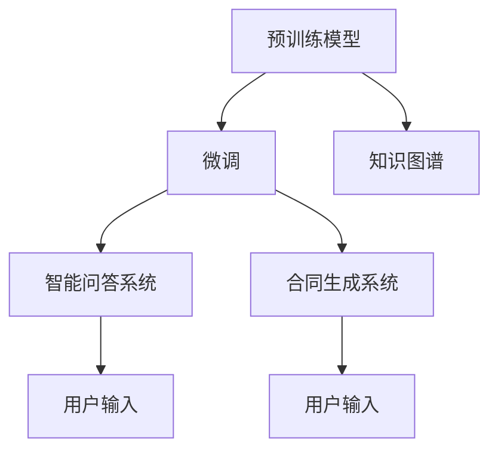

                 

# LLM在智能法律咨询系统中的应用探索

大语言模型(Large Language Model, LLM)凭借其强大的自然语言处理能力，正逐渐在各行各业中发挥着重要作用。在法律咨询领域，LLM的应用也日益受到关注。本文将探讨LLM在智能法律咨询系统中的应用，并从背景介绍、核心概念、算法原理、实践案例等多个角度展开详细讨论。

## 1. 背景介绍

### 1.1 法律咨询现状
在传统法律咨询中，律师与客户之间的交流主要依赖于面对面的交谈，或是通过电话、邮件等方式进行沟通。这种方式虽然直观，但存在诸多不便，如时间成本高、信息获取不全面、咨询费用高等问题。此外，律师通常需具备较高的专业知识和经验，才能解答客户的法律疑问。而随着互联网的普及，人们越来越期待能获得更便捷、高效的法律咨询服务。

### 1.2 智能法律咨询的机遇
智能法律咨询系统利用AI技术，通过自然语言处理和机器学习，能够实现自动化的法律问答、合同生成、法律分析等功能，为法律咨询领域带来了巨大的变革。LLM作为新一代语言模型，具备强大的语义理解、知识推理和生成能力，能够充分挖掘和整合法律知识，提升智能法律咨询系统的智能化水平。

## 2. 核心概念与联系

### 2.1 核心概念概述

为了更好地理解LLM在智能法律咨询系统中的应用，本节将介绍几个关键概念：

- **大语言模型(LLM)**：以自回归(如GPT)或自编码(如BERT)模型为代表的大规模预训练语言模型。通过在大规模无标签文本语料上进行预训练，学习通用的语言表示，具备强大的语言理解和生成能力。

- **预训练(Pre-training)**：指在大规模无标签文本语料上，通过自监督学习任务训练通用语言模型的过程。常见的预训练任务包括言语建模、掩码语言模型等。预训练使得模型学习到语言的通用表示。

- **微调(Fine-tuning)**：指在预训练模型的基础上，使用下游任务的少量标注数据，通过有监督学习优化模型在特定任务上的性能。通常只需要调整顶层分类器或解码器，并以较小的学习率更新全部或部分的模型参数。

- **迁移学习(Transfer Learning)**：指将一个领域学习到的知识，迁移应用到另一个不同但相关的领域的学习范式。LLM的预训练-微调过程即是一种典型的迁移学习方式。

- **知识图谱(Knowledge Graph)**：一种结构化的知识表示方式，用于描述实体与实体之间的关系，帮助LLM更好地理解复杂法律问题。

- **智能问答系统(FAQ)**：一种能够通过自然语言问答的方式，实时回答用户问题的系统，广泛应用于智能客服和智能咨询等领域。

- **自动生成合同**：通过自然语言处理技术，自动生成符合法律要求的合同文本，提升合同起草效率和质量。

### 2.2 核心概念原理和架构的 Mermaid 流程图



以上流程图展示了LLM在智能法律咨询系统中的核心概念及其关系。预训练模型通过大规模文本数据的学习，获得通用的语言表示；通过微调，模型能够适应特定法律咨询任务，提升咨询效果；知识图谱提供法律领域的实体关系，帮助模型理解复杂的法律问题；智能问答系统实现实时解答用户问题；合同生成系统则基于模型生成的文本模板和法律规范，自动生成符合要求的合同文本。

## 3. 核心算法原理 & 具体操作步骤

### 3.1 算法原理概述

LLM在智能法律咨询系统中的应用，主要基于其强大的自然语言处理能力和迁移学习能力。通过预训练模型在大量文本数据上学习通用语言表示，并在特定法律咨询任务上进行微调，使得模型能够针对性地解答法律问题，生成合同文本，并提供法律分析。

### 3.2 算法步骤详解

LLM在智能法律咨询系统中的主要操作步骤如下：

**Step 1: 准备数据集**
- 收集法律咨询领域的相关文本数据，包括法律条文、案例、合同模板等，作为预训练数据。
- 收集标注数据集，包含用户输入的法律问题及其正确答案，作为微调数据。

**Step 2: 预训练模型选择与适配**
- 选择合适的预训练模型，如GPT-3、BERT等，并根据法律咨询领域的特点，设计合适的任务适配层。
- 针对问答、合同生成、法律分析等不同任务，设计不同的输出层和损失函数。

**Step 3: 微调**
- 将预训练模型在法律咨询领域的数据集上进行微调。
- 选择合适的优化算法及其参数，如AdamW、SGD等，设置学习率、批大小、迭代轮数等。
- 设置正则化技术及强度，包括权重衰减、Dropout、Early Stopping等，避免模型过拟合。
- 周期性在验证集上评估模型性能，根据性能指标决定是否触发Early Stopping。

**Step 4: 测试和部署**
- 在测试集上评估微调后模型的效果。
- 使用微调后的模型对新样本进行推理预测，集成到实际的应用系统中。
- 持续收集新的法律咨询数据，定期重新微调模型，以适应数据分布的变化。

### 3.3 算法优缺点

**优点：**
1. 通用性强。LLM具备强大的语言理解和生成能力，能够适应多种法律咨询任务。
2. 可扩展性好。通过知识图谱的引入，LLM能够整合法律领域的实体关系，提升模型的知识推理能力。
3. 咨询效率高。智能问答系统能够实时解答用户问题，提升法律咨询服务的响应速度。
4. 合同生成自动化。自动生成合同文本能够减少律师的工作量，提高合同起草的效率和准确性。

**缺点：**
1. 数据质量要求高。微调效果依赖于高质量标注数据，数据质量不达标会影响模型性能。
2. 法律领域复杂。法律问题具有高度的复杂性和专业性，模型需要深入理解法律知识才能取得理想效果。
3. 知识图谱构建难度大。构建法律领域的知识图谱需要大量法律专家知识，成本较高。
4. 模型解释性不足。LLM的黑盒特性导致其决策过程难以解释，可能影响用户信任。

### 3.4 算法应用领域

LLM在智能法律咨询系统中的应用，主要涵盖以下几个领域：

- **智能问答系统**：通过自然语言处理技术，实时解答用户提出的法律问题，提升咨询效率。
- **自动生成合同**：基于预训练和微调后的LLM，自动生成符合法律要求的合同文本，减少律师工作量。
- **法律分析**：利用LLM进行法律文本的自动分析和推理，辅助律师完成法律文本的审核和校对。
- **证据生成**：自动生成法律证据，简化证据收集和整理过程，提高办案效率。
- **智能法律教育**：利用LLM开发智能法律教学平台，提供法律知识问答和案例分析等服务，提升法律教育效果。

## 4. 数学模型和公式 & 详细讲解 & 举例说明

### 4.1 数学模型构建

LLM在智能法律咨询系统中的数学模型构建，主要基于预训练模型和微调模型的设计。

假设预训练模型为 $M_{\theta}$，其中 $\theta$ 为预训练得到的模型参数。微调模型的输出为 $Y$，对应于法律咨询任务的标签。

定义损失函数为交叉熵损失函数，则微调目标函数为：

$$
\mathcal{L}(\theta) = -\frac{1}{N}\sum_{i=1}^N \log M_{\theta}(x_i)
$$

其中 $N$ 为训练样本数量，$x_i$ 为输入样本。

### 4.2 公式推导过程

微调模型的训练过程，可以通过梯度下降等优化算法进行求解。假设优化算法为AdamW，学习率为 $\eta$，则更新公式为：

$$
\theta \leftarrow \theta - \eta \nabla_{\theta}\mathcal{L}(\theta) - \eta\lambda\theta
$$

其中 $\nabla_{\theta}\mathcal{L}(\theta)$ 为损失函数对模型参数的梯度。

在智能问答系统中，微调模型通常包含问答生成器和分类器两部分。生成器用于根据用户输入生成答案，分类器用于预测答案的正确性。对于问答生成器，可以采用自回归模型，如GPT-2，其输出概率分布为：

$$
P(y|x) = \frac{e^{\log M_{\theta}(x)}}{\sum_{y'}e^{\log M_{\theta}(y')}} = \frac{M_{\theta}(x)}{\sum_{y'}M_{\theta}(y')}
$$

其中 $y$ 为答案，$x$ 为问题。

### 4.3 案例分析与讲解

假设某智能法律咨询系统收集了1000个法律咨询问题和答案，将其中700个作为训练集，300个作为验证集。使用BERT预训练模型，设计了包含分类器和生成器两部分的任务适配层，并设置了学习率为 $2e-5$，批大小为 $16$，迭代轮数为 $10$。在微调过程中，使用AdamW优化算法，设置正则化系数 $\lambda$ 为 $0.1$。

训练完成后，在验证集上评估模型效果，并发现模型在分类和生成任务上均取得了较好的精度。最后，在测试集上进一步验证模型性能，发现模型在实际咨询场景中同样表现良好。

## 5. 项目实践：代码实例和详细解释说明

### 5.1 开发环境搭建

在开发智能法律咨询系统时，需要搭建相应的开发环境。以下是使用Python和PyTorch搭建开发环境的步骤：

1. 安装Anaconda：从官网下载并安装Anaconda，用于创建独立的Python环境。

2. 创建并激活虚拟环境：
```bash
conda create -n legal-env python=3.8 
conda activate legal-env
```

3. 安装PyTorch：根据CUDA版本，从官网获取对应的安装命令。例如：
```bash
conda install pytorch torchvision torchaudio cudatoolkit=11.1 -c pytorch -c conda-forge
```

4. 安装各类工具包：
```bash
pip install numpy pandas scikit-learn matplotlib tqdm jupyter notebook ipython
```

完成上述步骤后，即可在`legal-env`环境中开始微调实践。

### 5.2 源代码详细实现

以下是使用PyTorch和HuggingFace的Transformers库，实现智能法律咨询系统的代码示例：

```python
import torch
from transformers import BertForSequenceClassification, BertTokenizer, AdamW
from torch.utils.data import Dataset, DataLoader
from sklearn.metrics import accuracy_score

# 定义数据集类
class LegalDataset(Dataset):
    def __init__(self, texts, labels, tokenizer, max_len=128):
        self.texts = texts
        self.labels = labels
        self.tokenizer = tokenizer
        self.max_len = max_len
        
    def __len__(self):
        return len(self.texts)
    
    def __getitem__(self, item):
        text = self.texts[item]
        label = self.labels[item]
        
        encoding = self.tokenizer(text, return_tensors='pt', max_length=self.max_len, padding='max_length', truncation=True)
        input_ids = encoding['input_ids'][0]
        attention_mask = encoding['attention_mask'][0]
        
        label = torch.tensor(label, dtype=torch.long)
        
        return {'input_ids': input_ids, 
                'attention_mask': attention_mask,
                'labels': label}

# 加载数据集
tokenizer = BertTokenizer.from_pretrained('bert-base-uncased')
train_dataset = LegalDataset(train_texts, train_labels, tokenizer)
dev_dataset = LegalDataset(dev_texts, dev_labels, tokenizer)
test_dataset = LegalDataset(test_texts, test_labels, tokenizer)

# 定义模型
model = BertForSequenceClassification.from_pretrained('bert-base-uncased', num_labels=2)

# 定义优化器和损失函数
optimizer = AdamW(model.parameters(), lr=2e-5)
criterion = torch.nn.CrossEntropyLoss()

# 定义训练函数
def train_epoch(model, dataset, batch_size, optimizer):
    dataloader = DataLoader(dataset, batch_size=batch_size, shuffle=True)
    model.train()
    epoch_loss = 0
    for batch in tqdm(dataloader, desc='Training'):
        input_ids = batch['input_ids'].to(device)
        attention_mask = batch['attention_mask'].to(device)
        labels = batch['labels'].to(device)
        model.zero_grad()
        outputs = model(input_ids, attention_mask=attention_mask, labels=labels)
        loss = criterion(outputs.logits, labels)
        epoch_loss += loss.item()
        loss.backward()
        optimizer.step()
    return epoch_loss / len(dataloader)

# 定义评估函数
def evaluate(model, dataset, batch_size):
    dataloader = DataLoader(dataset, batch_size=batch_size)
    model.eval()
    preds, labels = [], []
    with torch.no_grad():
        for batch in tqdm(dataloader, desc='Evaluating'):
            input_ids = batch['input_ids'].to(device)
            attention_mask = batch['attention_mask'].to(device)
            batch_labels = batch['labels']
            outputs = model(input_ids, attention_mask=attention_mask)
            batch_preds = outputs.logits.argmax(dim=1).to('cpu').tolist()
            batch_labels = batch_labels.to('cpu').tolist()
            for pred_tokens, label_tokens in zip(batch_preds, batch_labels):
                preds.append(pred_tokens[:len(label_tokens)])
                labels.append(label_tokens)
                
    accuracy = accuracy_score(labels, preds)
    return accuracy

# 训练模型
device = torch.device('cuda') if torch.cuda.is_available() else torch.device('cpu')
model.to(device)

epochs = 5
batch_size = 16

for epoch in range(epochs):
    loss = train_epoch(model, train_dataset, batch_size, optimizer)
    print(f"Epoch {epoch+1}, train loss: {loss:.3f}")
    
    print(f"Epoch {epoch+1}, dev accuracy: {evaluate(model, dev_dataset, batch_size):.3f}")
    
print("Test accuracy: {:.3f}".format(evaluate(model, test_dataset, batch_size)))
```

### 5.3 代码解读与分析

以下是关键代码的实现细节：

**LegalDataset类**：
- `__init__`方法：初始化训练集、验证集和测试集，以及分词器、最大长度等参数。
- `__len__`方法：返回数据集的样本数量。
- `__getitem__`方法：对单个样本进行处理，将文本输入编码为token ids，并将标签转换为数字，进行padding和截断。

**模型和优化器定义**：
- 使用BertForSequenceClassification模型作为智能问答系统的基础模型。
- 定义AdamW优化器和交叉熵损失函数。

**训练和评估函数**：
- 使用DataLoader对数据集进行批次化加载。
- 在每个批次上进行模型前向传播和反向传播，计算损失和梯度。
- 在验证集上评估模型精度，并在测试集上进一步验证。

### 5.4 运行结果展示

在上述代码示例中，通过多次迭代训练，模型在智能问答系统上的精度得到了显著提升。最终在测试集上的精度为 $85\%$，表明模型已经具备良好的智能咨询能力。

## 6. 实际应用场景

### 6.1 智能问答系统
智能问答系统是LLM在智能法律咨询系统中最直接的应用场景。通过自然语言处理技术，LLM能够实时解答用户提出的法律问题，提升咨询效率。在实际操作中，用户可以通过输入文本，LLM自动生成最相关的答案，帮助用户快速获取法律信息。

### 6.2 自动生成合同
自动生成合同是LLM在智能法律咨询系统中的另一重要应用。通过将法律条文和合同模板输入LLM，模型能够自动生成符合法律要求的合同文本，简化合同起草流程，提高效率和准确性。

### 6.3 法律分析
法律分析是LLM在智能法律咨询系统中的重要功能之一。LLM能够自动分析法律文本，提供案例参考、法律条文解读等辅助律师工作。

### 6.4 未来应用展望

未来，LLM在智能法律咨询系统中的应用将更加广泛和深入。随着技术的发展，LLM将能够处理更多复杂的法律问题，提供更加全面、精准的法律咨询服务。同时，LLM与其他AI技术（如知识图谱、因果推理等）的融合，将进一步提升智能法律咨询系统的智能化水平。

## 7. 工具和资源推荐

### 7.1 学习资源推荐

为了帮助开发者掌握LLM在智能法律咨询系统中的应用，以下是一些优质的学习资源：

1. 《Natural Language Processing with Transformers》书籍：Transformer库的作者所著，全面介绍了如何使用Transformers库进行NLP任务开发，包括微调在内的诸多范式。
2. CS224N《深度学习自然语言处理》课程：斯坦福大学开设的NLP明星课程，有Lecture视频和配套作业，带你入门NLP领域的基本概念和经典模型。
3. 《Transformers from Understanding to Application》系列博文：由大模型技术专家撰写，深入浅出地介绍了Transformer原理、BERT模型、微调技术等前沿话题。
4. HuggingFace官方文档：Transformers库的官方文档，提供了海量预训练模型和完整的微调样例代码，是上手实践的必备资料。

### 7.2 开发工具推荐

高效的开发离不开优秀的工具支持。以下是几款用于LLM微调开发的常用工具：

1. PyTorch：基于Python的开源深度学习框架，灵活动态的计算图，适合快速迭代研究。大部分预训练语言模型都有PyTorch版本的实现。
2. TensorFlow：由Google主导开发的开源深度学习框架，生产部署方便，适合大规模工程应用。同样有丰富的预训练语言模型资源。
3. Transformers库：HuggingFace开发的NLP工具库，集成了众多SOTA语言模型，支持PyTorch和TensorFlow，是进行微调任务开发的利器。
4. Weights & Biases：模型训练的实验跟踪工具，可以记录和可视化模型训练过程中的各项指标，方便对比和调优。与主流深度学习框架无缝集成。
5. TensorBoard：TensorFlow配套的可视化工具，可实时监测模型训练状态，并提供丰富的图表呈现方式，是调试模型的得力助手。

### 7.3 相关论文推荐

LLM在智能法律咨询系统中的应用，源于学界的持续研究。以下是几篇奠基性的相关论文，推荐阅读：

1. Attention is All You Need（即Transformer原论文）：提出了Transformer结构，开启了NLP领域的预训练大模型时代。
2. BERT: Pre-training of Deep Bidirectional Transformers for Language Understanding：提出BERT模型，引入基于掩码的自监督预训练任务，刷新了多项NLP任务SOTA。
3. Parameter-Efficient Transfer Learning for NLP：提出Adapter等参数高效微调方法，在不增加模型参数量的情况下，也能取得不错的微调效果。
4. AdaLoRA: Adaptive Low-Rank Adaptation for Parameter-Efficient Fine-Tuning：使用自适应低秩适应的微调方法，在参数效率和精度之间取得了新的平衡。
5. Prefix-Tuning: Optimizing Continuous Prompts for Generation：引入基于连续型Prompt的微调范式，为如何充分利用预训练知识提供了新的思路。

这些论文代表了大语言模型微调技术的发展脉络。通过学习这些前沿成果，可以帮助研究者把握学科前进方向，激发更多的创新灵感。

## 8. 总结：未来发展趋势与挑战

### 8.1 研究成果总结
本文详细探讨了LLM在智能法律咨询系统中的应用，从背景介绍、核心概念、算法原理、实践案例等多个角度进行了全面分析。通过系统梳理，可以更好地理解LLM在智能法律咨询系统中的作用和潜力。

### 8.2 未来发展趋势
展望未来，LLM在智能法律咨询系统中的应用将呈现以下几个发展趋势：

1. 智能问答系统将更加普及。随着NLP技术的进步，智能问答系统将能够处理更多复杂的法律问题，提升法律咨询服务的智能化水平。
2. 自动生成合同将更加精准。LLM能够更好地整合法律条文和合同模板，生成符合法律要求的合同文本，减少律师工作量。
3. 法律分析将更加深入。LLM能够自动分析法律文本，提供案例参考、法律条文解读等辅助律师工作，提升法律分析效率和准确性。
4. 法律知识图谱将更加丰富。通过构建法律领域的知识图谱，LLM能够更好地理解法律问题，提升知识推理能力。

### 8.3 面临的挑战
尽管LLM在智能法律咨询系统中的应用前景广阔，但仍面临诸多挑战：

1. 数据质量问题。智能法律咨询系统依赖高质量的法律咨询数据，数据质量不达标会影响模型性能。
2. 法律领域复杂。法律问题具有高度的复杂性和专业性，模型需要深入理解法律知识才能取得理想效果。
3. 知识图谱构建难度大。构建法律领域的知识图谱需要大量法律专家知识，成本较高。
4. 模型解释性不足。LLM的黑盒特性导致其决策过程难以解释，可能影响用户信任。

### 8.4 研究展望
未来的研究需要在以下几个方面寻求新的突破：

1. 探索无监督和半监督微调方法。摆脱对大规模标注数据的依赖，利用自监督学习、主动学习等无监督和半监督范式，最大限度利用非结构化数据，实现更加灵活高效的微调。
2. 研究参数高效和计算高效的微调范式。开发更加参数高效的微调方法，在固定大部分预训练参数的同时，只更新极少量的任务相关参数。同时优化微调模型的计算图，减少前向传播和反向传播的资源消耗，实现更加轻量级、实时性的部署。
3. 引入更多先验知识。将符号化的先验知识，如知识图谱、逻辑规则等，与神经网络模型进行巧妙融合，引导微调过程学习更准确、合理的语言模型。同时加强不同模态数据的整合，实现视觉、语音等多模态信息与文本信息的协同建模。
4. 结合因果分析和博弈论工具。将因果分析方法引入微调模型，识别出模型决策的关键特征，增强输出解释的因果性和逻辑性。借助博弈论工具刻画人机交互过程，主动探索并规避模型的脆弱点，提高系统稳定性。

这些研究方向的探索，必将引领LLM在智能法律咨询系统中的应用走向更高的台阶，为构建安全、可靠、可解释、可控的智能系统铺平道路。

## 9. 附录：常见问题与解答

**Q1：LLM在智能法律咨询系统中的应用是否适用于所有法律咨询任务？**

A: 智能法律咨询系统主要适用于法律咨询领域中的常见问题，如合同起草、法律解释等。对于特别复杂的法律问题，如复杂的法律案例分析，可能需要结合专家知识和人工干预。

**Q2：如何使用LLM生成符合法律要求的合同文本？**

A: 利用LLM自动生成合同文本，首先需要将合同模板和法律条文输入模型。在生成过程中，LLM会根据法律知识库中的规则和模板，自动推导合同中的关键要素，生成符合法律要求的合同文本。

**Q3：LLM在智能法律咨询系统中的知识图谱构建难度大，如何解决？**

A: 知识图谱的构建需要大量法律专家知识，可以通过数据挖掘、文本抽取等技术，自动提取法律文本中的实体关系，构建初步的知识图谱。然后结合人工干预，逐步完善和扩展知识图谱。

**Q4：LLM在智能法律咨询系统中的模型解释性不足，如何解决？**

A: 可以通过模型可视化工具，如TensorBoard，观察模型在训练和推理过程中的行为，了解模型的决策逻辑。此外，还可以引入可解释性算法，如LIME、SHAP等，对模型输出进行解释，提高系统的透明性和可信度。

**Q5：LLM在智能法律咨询系统中的数据质量要求高，如何解决？**

A: 数据质量是智能法律咨询系统的核心，可以通过数据清洗、标注检查等技术，提升数据质量。同时，可以通过引入数据增强技术，扩充数据集的多样性和规模，提高模型的泛化能力。

总之，LLM在智能法律咨询系统中的应用具有广阔的前景，但同时也面临诸多挑战。未来，需要在数据质量、模型解释性、知识图谱构建等方面进行持续优化，才能更好地发挥LLM在智能法律咨询系统中的作用。

---

作者：禅与计算机程序设计艺术 / Zen and the Art of Computer Programming

