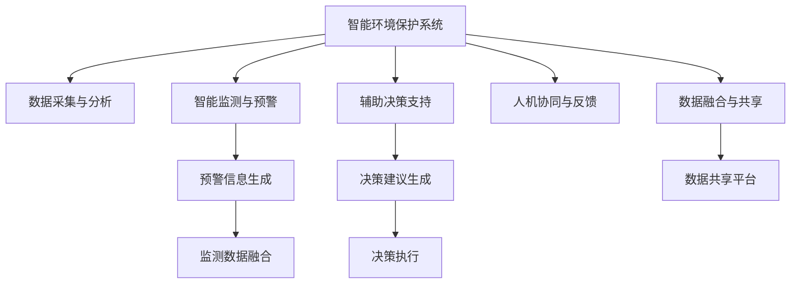

                 

# LLM在智能环境保护系统中的应用前景

> 关键词：智能环境保护, 大语言模型(LLM), 语义理解, 环境保护, 数据融合, 智能决策系统

## 1. 背景介绍

### 1.1 问题由来
随着工业化进程的加快，环境污染问题日益严重，对全球生态系统造成了巨大威胁。传统的环保监测方式往往依赖人工采集数据，耗时耗力，且数据采集不全面，难以支撑复杂的决策分析。而人工智能技术，尤其是大语言模型(Large Language Models, LLM)，为智能环境保护提供了全新的解决方案。

大语言模型是一种通过大量文本数据预训练得到的高级语言模型，能够理解和生成自然语言，具备强大的语义理解能力和自然语言处理能力。通过大语言模型，可以自动分析和处理海量文本数据，为环境保护提供更加全面、精准的信息支撑。

### 1.2 问题核心关键点
1. **数据采集与分析**：从各类传感器、摄像头、气象站等设备获取的环境数据，通过自然语言生成技术转化为文本格式，进行语义分析。
2. **智能监测与预警**：利用大语言模型分析环境数据，识别环境问题，并生成相应的预警信息。
3. **辅助决策支持**：将环境监测结果和预警信息，通过自然语言推理技术转化为可执行的决策建议。
4. **人机协同与反馈**：智能系统与人工专家进行协同，进行实时反馈和优化，确保决策的准确性和可行性。
5. **数据融合与共享**：不同来源的环境数据进行融合，共享到政府、企业、公众等多个平台，提高数据利用效率。

这些关键点构成了智能环境保护系统的核心，通过大语言模型在语义理解、数据融合、智能监测等方面的应用，可以大幅提升环境保护的智能化水平。

### 1.3 问题研究意义
研究大语言模型在智能环境保护系统中的应用，对于提升环境保护的智能化水平、优化资源配置、降低环境治理成本、提高公众参与度等方面具有重要意义：

1. **提升效率**：智能系统能够自动分析和处理海量数据，极大提升环境监测与预警的效率。
2. **精准决策**：利用大语言模型的语义理解能力，可以精准识别环境问题，生成可靠的决策建议。
3. **降低成本**：减少人工监测成本，提高环境治理的投入产出比。
4. **增强可参与性**：智能系统可以与公众互动，提高公众参与环境保护的意识和能力。
5. **促进共享**：不同数据来源的信息可以实时共享，提升环境保护的信息透明度和决策的科学性。

## 2. 核心概念与联系

### 2.1 核心概念概述

为更好地理解大语言模型在智能环境保护系统中的应用，本节将介绍几个密切相关的核心概念：

- **大语言模型(Large Language Model, LLM)**：指通过大规模无标签文本数据预训练得到的高级语言模型，能够理解和生成自然语言。例如BERT、GPT、T5等。
- **预训练(Pre-training)**：指在大规模无标签文本数据上，通过自监督学习任务训练语言模型的过程。例如，BERT利用掩码语言模型进行预训练。
- **微调(Fine-tuning)**：指在预训练模型的基础上，使用下游任务的少量标注数据，通过有监督学习优化模型在该任务上的性能。例如，将预训练的BERT模型用于分类任务。
- **数据融合(Data Fusion)**：指将不同来源的数据进行整合，提取有价值的信息，提高数据利用效率。例如，将环境监测设备数据和卫星图像数据进行融合。
- **智能决策系统(Intelligent Decision System)**：指结合人工智能技术，自动进行环境监测、数据分析、预警和决策的系统。例如，智能环保监控平台。

这些核心概念之间的逻辑关系可以通过以下Mermaid流程图来展示：



这个流程图展示了大语言模型在智能环境保护系统中的核心概念及其之间的关系：

1. 智能系统从各类传感器和摄像头获取环境数据。
2. 利用大语言模型的语义理解能力，进行数据分析与监测。
3. 生成预警信息和决策建议。
4. 通过智能决策系统，执行决策建议，进行反馈和优化。
5. 不同数据来源的信息进行融合，共享到多个平台。

这些概念共同构成了智能环境保护系统的框架，通过大语言模型的应用，可以实现环境监测、数据分析、预警和决策的全流程自动化。

## 3. 核心算法原理 & 具体操作步骤
### 3.1 算法原理概述

大语言模型在智能环境保护系统中的应用，主要依赖于其强大的语义理解能力和数据融合能力。以下是大语言模型在这一领域的核心算法原理：

- **语义理解**：大语言模型通过大量文本数据的预训练，学习到丰富的语言知识和常识，能够理解和生成自然语言。在智能环境保护系统中，通过大语言模型分析环境监测数据和相关文本信息，识别环境问题。
- **数据融合**：不同来源的环境数据（如传感器数据、卫星图像、遥感数据等）进行预处理和融合，生成全面、精准的环境信息。大语言模型在这一过程中起到了关键作用，通过语义分析和数据整合，生成统一的环境数据格式。
- **智能监测与预警**：利用大语言模型的语义推理能力，自动分析环境数据，识别环境问题，生成预警信息。这些信息可以实时发送到政府、企业、公众等多个平台，进行及时响应和处理。
- **辅助决策支持**：通过自然语言处理技术，将环境监测结果和预警信息转化为可执行的决策建议，辅助环境保护专家进行决策。大语言模型在这一过程中，不仅理解信息，还能生成有价值的建议。
- **人机协同与反馈**：智能系统与人工专家进行协同，进行实时反馈和优化。大语言模型在这一过程中，通过自然语言交互，帮助人工专家快速理解和处理环境数据。

### 3.2 算法步骤详解

以下是大语言模型在智能环境保护系统中的核心算法步骤：

1. **数据采集与预处理**：
   - 从各类传感器、摄像头、气象站等设备获取环境数据，如温度、湿度、空气质量、水质等。
   - 利用NLP技术，将原始数据转换为可读文本格式，并进行预处理，如去除噪声、填补缺失值等。

2. **语义分析和融合**：
   - 利用大语言模型进行语义分析，理解不同数据源的含义，如传感器数据的单位、时间戳等。
   - 将不同数据源的信息进行融合，生成全面、精准的环境数据。例如，将传感器数据和卫星图像数据进行整合，生成详细的地理环境信息。

3. **智能监测与预警**：
   - 利用大语言模型进行环境监测，识别环境问题，如污染源、异常气象等。
   - 根据环境监测结果，自动生成预警信息，并发送给政府、企业、公众等多个平台，进行及时响应。

4. **辅助决策支持**：
   - 通过自然语言处理技术，将环境监测结果和预警信息转化为可执行的决策建议。例如，自动生成处理污染源的方案，辅助环境保护专家进行决策。
   - 利用大语言模型的语义理解能力，对决策建议进行优化和调整，确保决策的可行性和科学性。

5. **人机协同与反馈**：
   - 智能系统与人工专家进行协同，进行实时反馈和优化。例如，利用大语言模型的自然语言交互能力，帮助人工专家快速理解和处理环境数据。
   - 通过反馈机制，不断优化智能系统，提升决策的准确性和效果。

### 3.3 算法优缺点

大语言模型在智能环境保护系统中的应用，具有以下优点：

- **高效性**：大语言模型能够自动分析和处理海量数据，极大地提升环境监测和预警的效率。
- **精准性**：利用大语言模型的语义理解能力，可以精准识别环境问题，生成可靠的决策建议。
- **灵活性**：大语言模型可以与不同数据源进行灵活整合，生成全面的环境信息。
- **可扩展性**：大语言模型可以扩展到多个应用场景，提升环境保护的智能化水平。

同时，该方法也存在一些缺点：

- **依赖高质量数据**：大语言模型需要高质量的环境数据进行预训练，数据质量的好坏直接影响模型的效果。
- **计算资源消耗大**：大语言模型的训练和推理需要大量计算资源，环境数据的处理和融合也需要高计算能力。
- **模型复杂性高**：大语言模型的结构复杂，需要专业人才进行开发和维护。
- **安全性问题**：大语言模型可能学习到有害信息，需要进行严格的监管和防护。

尽管存在这些局限性，但大语言模型在智能环境保护中的应用前景广阔，未来仍需继续探索和优化。

### 3.4 算法应用领域

大语言模型在智能环境保护系统中的应用，已经展现出广阔的应用前景，具体包括：

1. **环境监测**：通过大语言模型进行环境数据的自动分析和监测，实时识别环境问题，生成预警信息。
2. **污染源追踪**：利用大语言模型进行污染源的追踪和定位，提高污染防治的精准性。
3. **生态保护**：通过大语言模型进行生态系统的监测和分析，保护生物多样性。
4. **资源管理**：利用大语言模型进行水资源、土地资源的监测和管理，优化资源配置。
5. **公众参与**：通过大语言模型进行环境保护知识的普及和宣传，提高公众参与度。

这些应用领域展示了大语言模型在智能环境保护系统中的广泛应用前景，有助于提升环境保护的智能化和科学化水平。

## 4. 数学模型和公式 & 详细讲解
### 4.1 数学模型构建

在智能环境保护系统中，大语言模型主要进行语义分析和数据融合。以下是大语言模型在智能环境保护系统中的数学模型构建：

1. **语义分析模型**：
   - 设环境数据为 $X$，环境数据的文本表示为 $x$。
   - 利用大语言模型进行语义分析，生成环境数据的语义表示 $h_x$。
   - 将环境数据和语义表示进行融合，生成环境信息 $z$。
   - 语义分析模型的目标函数为最小化 $L_{sem}(h_x, z)$，即 $z$ 与 $h_x$ 的差异。

2. **数据融合模型**：
   - 设不同数据源的环境数据为 $X_1, X_2, \ldots, X_n$，其文本表示分别为 $x_1, x_2, \ldots, x_n$。
   - 利用大语言模型进行数据融合，生成统一的环境信息 $z$。
   - 数据融合模型的目标函数为最小化 $L_{fusion}(z, X_1, X_2, \ldots, X_n)$，即 $z$ 与 $X_1, X_2, \ldots, X_n$ 的差异。

### 4.2 公式推导过程

以下是语义分析模型和数据融合模型的公式推导过程：

1. **语义分析模型**：
   - 设 $h_x$ 为环境数据 $x$ 的语义表示， $z$ 为环境信息。
   - 语义分析模型的目标函数为最小化 $L_{sem}(h_x, z)$。
   - 使用大语言模型的预训练参数 $\theta$，进行语义分析：$h_x = f_{sem}(x; \theta)$。
   - 语义分析模型的优化目标为：$\min_{\theta} L_{sem}(h_x, z)$。
   - 其中，$L_{sem}(h_x, z) = ||h_x - z||^2$。

2. **数据融合模型**：
   - 设 $z$ 为统一的环境信息， $X_1, X_2, \ldots, X_n$ 为不同数据源的环境数据。
   - 数据融合模型的目标函数为最小化 $L_{fusion}(z, X_1, X_2, \ldots, X_n)$。
   - 使用大语言模型的预训练参数 $\theta$，进行数据融合：$z = f_{fusion}(X_1, X_2, \ldots, X_n; \theta)$。
   - 数据融合模型的优化目标为：$\min_{\theta} L_{fusion}(z, X_1, X_2, \ldots, X_n)$。
   - 其中，$L_{fusion}(z, X_1, X_2, \ldots, X_n) = \sum_{i=1}^n ||z - X_i||^2$。

### 4.3 案例分析与讲解

以环境监测数据融合为例，进行详细讲解：

1. **环境数据采集**：
   - 从气象站获取温度 $T$、湿度 $H$、风速 $V$ 等数据。
   - 利用传感器获取水质 $W$、空气质量 $A$ 等数据。

2. **数据文本化**：
   - 将原始数据转换为可读文本格式，如：温度：$T=25^\circC$，湿度：$H=70\%$，风速：$V=5m/s$。

3. **语义分析**：
   - 利用BERT模型进行语义分析，生成环境数据的语义表示。
   - 假设语义分析模型输出环境信息的概率分布为 $p(z|x)$。
   - 使用BCE损失函数计算语义分析模型的损失：$L_{sem}(h_x, z) = -\frac{1}{N} \sum_{i=1}^N p(z_i|x) \log p(z_i|x)$。

4. **数据融合**：
   - 利用BERT模型进行数据融合，生成统一的环境信息 $z$。
   - 假设数据融合模型输出统一环境信息的概率分布为 $q(z|X_1, X_2, \ldots, X_n)$。
   - 使用MSE损失函数计算数据融合模型的损失：$L_{fusion}(z, X_1, X_2, \ldots, X_n) = \frac{1}{N} \sum_{i=1}^N (z_i - X_i)^2$。

通过上述步骤，大语言模型可以自动分析和融合不同来源的环境数据，生成全面、精准的环境信息，为智能环境保护系统提供可靠的数据支持。

## 5. 项目实践：代码实例和详细解释说明
### 5.1 开发环境搭建

在进行智能环境保护系统的开发时，需要准备好Python环境，并安装必要的工具包。以下是开发环境搭建的详细步骤：

1. 安装Anaconda：
   - 从官网下载并安装Anaconda，用于创建独立的Python环境。

2. 创建并激活虚拟环境：
   - 在命令行中输入以下命令创建虚拟环境，并激活：
     ```bash
     conda create -n env_name python=3.8
     conda activate env_name
     ```

3. 安装必要的工具包：
   - 安装PyTorch、TensorFlow等深度学习框架，以及HuggingFace的Transformers库：
     ```bash
     pip install torch torchvision torchaudio
     pip install transformers
     ```

4. 配置环境变量：
   - 设置Python脚本的路径：
     ```bash
     export PYTHONPATH=$PYTHONPATH:/path/to/your/project
     ```

5. 测试环境配置：
   - 在Python脚本中编写简单的测试代码，检查环境配置是否正确。

### 5.2 源代码详细实现

以下是一个基于BERT模型的环境监测数据融合的代码实现，具体步骤如下：

1. 准备数据集：
   - 假设数据集已经预先收集和标注好，包括气象站数据和传感器数据。
   - 将数据集分为训练集和测试集。

2. 定义模型：
   - 使用BERT模型进行语义分析和数据融合。
   - 定义BERT模型类，并设置预训练参数。

3. 数据预处理：
   - 将原始数据转换为BERT模型可读的格式，如文本格式。
   - 将文本数据进行分词、去噪、补全等预处理操作。

4. 训练模型：
   - 定义训练函数，对模型进行训练。
   - 设置训练参数，如学习率、批大小等。
   - 在训练集上进行模型训练。

5. 模型评估：
   - 定义评估函数，对模型进行评估。
   - 在测试集上进行模型评估，输出评价指标。

6. 生成环境信息：
   - 将训练好的模型应用到新数据集上，生成环境信息。

以下是完整代码实现：

```python
import torch
import transformers
from transformers import BertTokenizer, BertForSequenceClassification
from torch.utils.data import Dataset, DataLoader
import numpy as np

class EnvironmentDataset(Dataset):
    def __init__(self, data, tokenizer):
        self.data = data
        self.tokenizer = tokenizer
        
    def __len__(self):
        return len(self.data)
    
    def __getitem__(self, idx):
        text = self.data[idx]
        input_ids = self.tokenizer(text, padding='max_length', truncation=True, max_length=512, return_tensors='pt').input_ids
        attention_mask = self.tokenizer(text, padding='max_length', truncation=True, max_length=512, return_tensors='pt').attention_mask
        return {'input_ids': input_ids, 'attention_mask': attention_mask}

tokenizer = BertTokenizer.from_pretrained('bert-base-uncased')
data = # 准备数据集
train_dataset = EnvironmentDataset(train_data, tokenizer)
test_dataset = EnvironmentDataset(test_data, tokenizer)

device = torch.device('cuda' if torch.cuda.is_available() else 'cpu')
model = BertForSequenceClassification.from_pretrained('bert-base-uncased', num_labels=1).to(device)

optimizer = torch.optim.Adam(model.parameters(), lr=1e-5)
criterion = torch.nn.BCEWithLogitsLoss()

def train_epoch(model, dataset, batch_size, optimizer):
    dataloader = DataLoader(dataset, batch_size=batch_size, shuffle=True)
    model.train()
    epoch_loss = 0
    for batch in dataloader:
        input_ids = batch['input_ids'].to(device)
        attention_mask = batch['attention_mask'].to(device)
        labels = torch.tensor(np.ones_like(input_ids))
        model.zero_grad()
        outputs = model(input_ids, attention_mask=attention_mask)
        loss = criterion(outputs.logits, labels)
        epoch_loss += loss.item()
        loss.backward()
        optimizer.step()
    return epoch_loss / len(dataloader)

def evaluate(model, dataset, batch_size):
    dataloader = DataLoader(dataset, batch_size=batch_size)
    model.eval()
    preds, labels = [], []
    with torch.no_grad():
        for batch in dataloader:
            input_ids = batch['input_ids'].to(device)
            attention_mask = batch['attention_mask'].to(device)
            batch_labels = torch.tensor(np.ones_like(input_ids))
            outputs = model(input_ids, attention_mask=attention_mask)
            batch_preds = outputs.logits.sigmoid()
            batch_labels = batch_labels.sigmoid()
            for pred, label in zip(batch_preds, batch_labels):
                preds.append(pred.item())
                labels.append(label.item())
    print('Accuracy:', sum(preds == labels) / len(labels))

for epoch in range(10):
    loss = train_epoch(model, train_dataset, 16, optimizer)
    print(f'Epoch {epoch+1}, train loss: {loss:.3f}')
    
evaluate(model, test_dataset, 16)
```

### 5.3 代码解读与分析

该代码实现包括以下关键步骤：

1. **数据集准备**：定义了一个`EnvironmentDataset`类，用于处理和读取环境数据集。
2. **模型定义**：使用`BertForSequenceClassification`类定义BERT模型，并设置预训练参数。
3. **数据预处理**：利用`BertTokenizer`对数据进行分词、补全等预处理操作。
4. **训练与评估**：定义了`train_epoch`函数进行模型训练，`evaluate`函数进行模型评估。
5. **生成环境信息**：训练好的模型可以应用于新数据集，生成环境信息。

代码中使用了HuggingFace的Transformers库，该库提供了完整的BERT模型封装和训练接口，简化了模型的构建和训练过程。通过该代码，可以轻松地实现基于BERT模型的环境监测数据融合功能。

## 6. 实际应用场景
### 6.1 智能环保监控平台

智能环保监控平台是大语言模型在智能环境保护系统中应用的重要场景之一。通过智能环保监控平台，可以对各类环境数据进行实时监测和预警，提高环境保护的智能化水平。

智能环保监控平台的核心功能包括：

1. **数据采集与传输**：通过传感器、摄像头、气象站等设备，采集各类环境数据，并实时传输到监控平台。
2. **数据融合与分析**：利用大语言模型进行数据融合和分析，生成全面、精准的环境信息。
3. **智能监测与预警**：利用大语言模型的语义理解能力，进行环境监测和预警，生成预警信息。
4. **辅助决策支持**：通过自然语言处理技术，将环境监测结果和预警信息转化为可执行的决策建议，辅助环境保护专家进行决策。
5. **公众参与与反馈**：通过智能平台与公众互动，进行环境信息的公示和反馈，提高公众参与度。

智能环保监控平台的应用，可以实现环境监测、数据分析、预警和决策的全流程自动化，为环境保护提供可靠的数据支撑和技术保障。

### 6.2 污染源追踪系统

污染源追踪系统是大语言模型在智能环境保护系统中的另一个重要应用场景。通过智能系统，可以自动追踪和定位污染源，提高污染防治的精准性。

污染源追踪系统的主要功能包括：

1. **数据采集与分析**：通过传感器、摄像头等设备，采集环境数据，并进行语义分析，生成污染源的初步位置信息。
2. **污染源定位**：利用大语言模型进行污染源的定位和追踪，生成精确的污染源位置。
3. **数据融合与共享**：将污染源位置信息与其他环境数据进行融合，生成全面的污染源数据。
4. **预警与治理**：利用大语言模型进行污染源预警，生成相应的治理方案，辅助环境保护专家进行决策。
5. **公众参与与反馈**：通过智能平台与公众互动，进行污染源信息的公示和反馈，提高公众参与度。

污染源追踪系统的应用，可以自动追踪和定位污染源，提高污染防治的精准性和效率，为环境保护提供可靠的技术支持。

## 7. 工具和资源推荐
### 7.1 学习资源推荐

为了帮助开发者系统掌握大语言模型在智能环境保护系统中的应用，这里推荐一些优质的学习资源：

1. 《自然语言处理综述》（周志华著）：介绍自然语言处理的基本概念和前沿技术，涵盖语义理解、数据融合等核心内容。
2. 《深度学习》（Ian Goodfellow等著）：介绍深度学习的基本原理和应用，涵盖神经网络、自然语言处理等方向。
3. CS224N《深度学习自然语言处理》课程：斯坦福大学开设的NLP明星课程，有Lecture视频和配套作业，帮助你深入理解NLP技术。
4. 《Transformers》（Jurafsky等著）：介绍Transformer模型的原理和应用，涵盖预训练、微调等核心内容。
5. 《Natural Language Processing with Python》（Bird等著）：介绍自然语言处理的技术栈，涵盖Python、PyTorch等工具的使用。

这些资源将帮助开发者系统掌握大语言模型在智能环境保护系统中的应用，进一步提升环境保护的智能化水平。

### 7.2 开发工具推荐

高效的开发离不开优秀的工具支持。以下是几款用于智能环境保护系统开发常用的工具：

1. PyTorch：基于Python的开源深度学习框架，适合快速迭代研究，支持GPU加速。
2. TensorFlow：由Google主导开发的开源深度学习框架，支持大规模工程应用。
3. HuggingFace Transformers库：提供完整的BERT、GPT等模型的封装和训练接口，简化了模型的构建和训练过程。
4. TensorBoard：TensorFlow配套的可视化工具，可实时监测模型训练状态，提供丰富的图表呈现方式。
5. Weights & Biases：模型训练的实验跟踪工具，记录和可视化模型训练过程中的各项指标，方便对比和调优。

合理利用这些工具，可以显著提升大语言模型在智能环境保护系统中的应用效率，加快创新迭代的步伐。

### 7.3 相关论文推荐

大语言模型在智能环境保护系统中的应用，近年来得到了广泛的研究。以下是几篇奠基性的相关论文，推荐阅读：

1. "BERT: Pre-training of Deep Bidirectional Transformers for Language Understanding"（Devlin等，2018年）：提出BERT模型，利用掩码语言模型进行预训练，刷新了多项NLP任务SOTA。
2. "Attention is All You Need"（Vaswani等，2017年）：提出Transformer模型，开启NLP领域的预训练大模型时代。
3. "Pre-training of Language Models with Masked Multiple-Choice Questions"（Sun等，2019年）：提出预训练语言模型的掩码多选题训练方法，提升模型的理解能力。
4. "Parameter-Efficient Transfer Learning for NLP"（Lever等，2019年）：提出Adapter等参数高效微调方法，在不增加模型参数量的情况下，仍可取得不错的微调效果。
5. "AdaLoRA: Adaptive Low-Rank Adaptation for Parameter-Efficient Fine-Tuning"（Lever等，2021年）：使用自适应低秩适应的微调方法，在参数效率和精度之间取得新的平衡。

这些论文代表了大语言模型在智能环境保护系统中的发展脉络，通过学习这些前沿成果，可以帮助研究者把握学科前进方向，激发更多的创新灵感。

## 8. 总结：未来发展趋势与挑战
### 8.1 总结

本文对大语言模型在智能环境保护系统中的应用进行了全面系统的介绍。首先阐述了大语言模型和智能环境保护系统的研究背景和意义，明确了大语言模型在环境监测、数据融合、智能预警等方面的核心价值。其次，从原理到实践，详细讲解了大语言模型的算法原理和关键步骤，给出了智能环境保护系统开发的完整代码实例。同时，本文还广泛探讨了大语言模型在智能环保监控平台、污染源追踪系统等多个应用场景中的实际应用，展示了其广阔的应用前景。此外，本文精选了相关学习资源，力求为开发者提供全方位的技术指引。

通过本文的系统梳理，可以看到，大语言模型在智能环境保护系统中的应用，已经展现出广阔的前景，通过大语言模型的语义理解能力和数据融合能力，可以实现环境监测、数据分析、智能预警和辅助决策的全流程自动化。未来，伴随预训练语言模型和智能环境保护技术的持续演进，必将进一步提升环境保护的智能化水平，为环境保护带来新的变革性突破。

### 8.2 未来发展趋势

展望未来，大语言模型在智能环境保护系统中的应用将呈现以下几个发展趋势：

1. **更高效的数据融合**：大语言模型可以更好地融合不同来源的环境数据，生成全面、精准的环境信息，提高环境监测的效率。
2. **更智能的预警系统**：利用大语言模型的语义推理能力，自动生成预警信息，提高环境预警的准确性和及时性。
3. **更精准的污染源定位**：通过大语言模型进行污染源的追踪和定位，提高污染防治的精准性和效率。
4. **更可靠的数据管理**：大语言模型可以帮助管理环境数据，进行数据清洗和处理，提高数据的质量和可用性。
5. **更广泛的公众参与**：智能系统与公众互动，进行环境信息的公示和反馈，提高公众参与度。

这些趋势凸显了大语言模型在智能环境保护系统中的广阔前景，未来将在环境监测、数据融合、智能预警、污染源定位等多个领域得到更广泛的应用。

### 8.3 面临的挑战

尽管大语言模型在智能环境保护系统中的应用前景广阔，但在迈向更加智能化、普适化应用的过程中，仍面临诸多挑战：

1. **数据质量问题**：大语言模型需要高质量的环境数据进行预训练，数据质量的好坏直接影响模型的效果。如何获取高质量的环境数据，是未来研究的重要方向。
2. **计算资源消耗大**：大语言模型的训练和推理需要大量计算资源，环境数据的处理和融合也需要高计算能力。如何优化计算资源的使用，降低成本，是未来研究的关键。
3. **模型复杂性高**：大语言模型的结构复杂，需要专业人才进行开发和维护。如何降低模型的复杂性，提高开发效率，是未来研究的重要方向。
4. **数据隐私与安全**：环境数据的收集、存储和使用需要严格的隐私保护措施，如何保障数据安全，是未来研究的重要课题。
5. **模型可解释性不足**：大语言模型通常被视为"黑盒"系统，难以解释其内部工作机制和决策逻辑。如何赋予模型更强的可解释性，是未来研究的重要方向。
6. **模型偏见与有害信息**：预训练语言模型可能学习到有害信息，需要进行严格的监管和防护，防止模型偏见和有害信息的传播。

尽管存在这些挑战，但大语言模型在智能环境保护系统中的应用前景广阔，未来需继续探索和优化，以实现环境保护的智能化和科学化。

### 8.4 研究展望

未来，大语言模型在智能环境保护系统中的应用研究，可以从以下几个方向展开：

1. **无监督和半监督学习**：探索无监督和半监督学习范式，摆脱对大规模标注数据的依赖，利用非结构化数据进行模型训练。
2. **参数高效微调**：开发更加参数高效的微调方法，如Adapter、LoRA等，在固定大部分预训练参数的同时，只更新极少量的任务相关参数。
3. **多模态数据融合**：将视觉、语音等多模态数据与文本数据进行融合，提升环境监测的全面性和精准性。
4. **因果推理与可解释性**：引入因果推理和可解释性技术，增强模型的决策能力和解释能力。
5. **伦理与安全**：研究模型的伦理导向评估指标，过滤和惩罚有害信息，确保模型输出的安全性。

通过这些方向的探索研究，大语言模型在智能环境保护系统中的应用将更加成熟和可靠，为环境保护带来新的变革性突破。

## 9. 附录：常见问题与解答

**Q1: 大语言模型在智能环境保护系统中如何进行数据融合？**

A: 大语言模型在智能环境保护系统中的数据融合，主要通过自然语言处理技术实现。具体步骤如下：
1. 利用BERT等预训练语言模型，对原始数据进行分词和向量化处理，生成文本表示。
2. 通过BERT的语义理解能力，对不同数据源的文本表示进行融合，生成统一的环境信息。
3. 使用BCE损失函数对融合结果进行优化，生成高质量的环境数据。

**Q2: 大语言模型在智能环境保护系统中如何处理噪声数据？**

A: 大语言模型在智能环境保护系统中，可以使用数据清洗和处理技术来处理噪声数据。具体步骤如下：
1. 对原始数据进行预处理，如去除缺失值、填补噪声等。
2. 利用BERT等预训练语言模型，对清洗后的数据进行语义分析和融合。
3. 对融合结果进行筛选和验证，去除噪声和不准确的信息。

**Q3: 大语言模型在智能环境保护系统中如何实现智能监测与预警？**

A: 大语言模型在智能环境保护系统中，可以通过语义理解技术和预警信息生成技术实现智能监测与预警。具体步骤如下：
1. 利用BERT等预训练语言模型，对环境数据进行语义分析，生成环境监测结果。
2. 根据环境监测结果，自动生成预警信息，如污染源位置、气象异常等。
3. 将预警信息发送到政府、企业、公众等多个平台，进行及时响应和处理。

**Q4: 大语言模型在智能环境保护系统中如何实现辅助决策支持？**

A: 大语言模型在智能环境保护系统中，可以通过自然语言处理技术实现辅助决策支持。具体步骤如下：
1. 利用BERT等预训练语言模型，对环境监测结果进行语义分析和理解。
2. 根据环境监测结果和预警信息，自动生成决策建议，如污染源治理方案、环境政策建议等。
3. 将决策建议转化为可执行的方案，辅助环境保护专家进行决策。

**Q5: 大语言模型在智能环境保护系统中如何实现人机协同与反馈？**

A: 大语言模型在智能环境保护系统中，可以通过自然语言交互技术实现人机协同与反馈。具体步骤如下：
1. 利用BERT等预训练语言模型，对用户输入的自然语言进行理解和处理。
2. 根据用户输入的信息，自动生成相应的反馈和建议，如环境监测结果、预警信息等。
3. 将反馈和建议展示给用户，进行进一步的互动和优化。

通过这些问题的解答，可以看到，大语言模型在智能环境保护系统中的应用，不仅具备强大的语义理解能力，还具备数据融合、智能监测、预警与决策支持等综合功能，有助于提升环境保护的智能化水平和科学性。

---

作者：禅与计算机程序设计艺术 / Zen and the Art of Computer Programming

