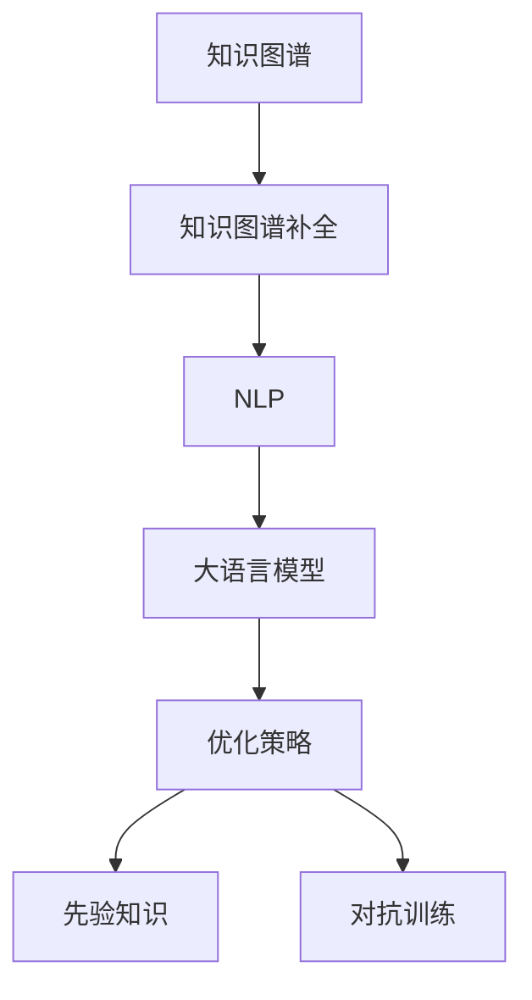

                 

# LLM在知识图谱补全上的优化策略

> 关键词：大语言模型(LLM), 知识图谱(KG), 知识补全, 自然语言处理(NLP), 迁移学习(Transfer Learning), 优化策略(Optimization Strategy)

## 1. 背景介绍

### 1.1 问题由来
知识图谱（Knowledge Graph, KG）是结构化表示实体间关系的数据集合，广泛应用于信息检索、推荐系统、智能问答等领域。然而，现有的知识图谱往往存在实体缺失、关系不确定等问题，制约了其应用效果。

近年来，知识图谱补全（KG Completion）成为研究热点。通过填充缺失的实体和关系，知识图谱更加完善和准确。目前，知识图谱补全主要依赖于传统的深度学习模型，但这些方法往往在效果和泛化能力上存在不足。

大语言模型（Large Language Model, LLM）作为新一代的深度学习模型，具备强大的语言理解和生成能力。通过引入大语言模型，知识图谱补全有望获得新的突破。然而，大语言模型在知识图谱补全上的应用仍存在许多挑战，如何高效利用其语言能力，仍需进一步探索。

### 1.2 问题核心关键点
知识图谱补全的核心在于识别实体和关系的潜在模式，并根据模式预测缺失的实体和关系。大语言模型可以生成具有上下文语义的语言描述，利用语言能力对知识图谱进行自动补全。

当前大语言模型在知识图谱补全上应用的核心关键点包括：

- 如何设计任务适配层，将语言描述映射为知识图谱的实体和关系。
- 如何设计损失函数，衡量预测值与真实值之间的差异。
- 如何优化模型参数，最小化损失函数并提升模型性能。
- 如何设计输入模板，引导大语言模型生成更具信息量的语言描述。
- 如何引入先验知识，提升模型泛化能力。

## 2. 核心概念与联系

### 2.1 核心概念概述

为更好地理解大语言模型在知识图谱补全上的应用，本节将介绍几个密切相关的核心概念：

- 知识图谱(Knowledge Graph, KG)：结构化的实体-关系数据，用于表示现实世界的信息。常见类型包括RDF、Turtle等。

- 知识图谱补全(KG Completion)：通过填充缺失的实体和关系，使知识图谱更加完整准确。主要方法包括基于规则、基于深度学习等。

- 自然语言处理(Natural Language Processing, NLP)：利用计算方法处理和分析自然语言数据，以实现文本分类、信息抽取、机器翻译等任务。

- 大语言模型(Large Language Model, LLM)：如GPT-3、BERT等，通过大规模语料预训练学习通用的语言表示，具备强大的语言理解和生成能力。

- 迁移学习(Transfer Learning)：将一个领域学习到的知识，迁移应用到另一个相关领域的任务中，提升模型在新领域上的性能。

- 优化策略(Optimization Strategy)：在大语言模型上进行知识图谱补全时，设计合理的优化策略，可以有效提升模型效果。

- 先验知识(Prior Knowledge)：通过外部知识库、规则等引入的先验信息，辅助模型生成更准确的预测。

- 对抗训练(Adversarial Training)：通过加入对抗样本，提高模型对噪声数据的鲁棒性。

这些核心概念之间的逻辑关系可以通过以下Mermaid流程图来展示：



这个流程图展示了大语言模型在知识图谱补全中的应用路径：

1. 知识图谱通过自然语言处理，转化为语言描述。
2. 大语言模型生成语言描述，进而预测缺失的实体和关系。
3. 引入优化策略，提升模型的训练效果。
4. 引入先验知识，增强模型的泛化能力。
5. 对抗训练，提升模型对噪声数据的鲁棒性。

这些概念共同构成了大语言模型在知识图谱补全中的应用框架，使其能够更好地利用语言能力，提升知识图谱的完整性和准确性。

## 3. 核心算法原理 & 具体操作步骤
### 3.1 算法原理概述

大语言模型在知识图谱补全上的应用，本质上是一个基于迁移学习的推理过程。其核心思想是：利用大语言模型的语言理解和生成能力，将知识图谱转化为语言描述，再利用语言描述预测缺失的实体和关系。

形式化地，假设知识图谱为 $G=(V,E)$，其中 $V$ 为实体集合，$E$ 为关系集合。设 $X$ 为待补全的缺失实体或关系，则任务适配层 $F$ 的输入为 $d$，输出为 $y$。任务适配层将语言描述 $d$ 映射为 $y$，映射过程如下：

$$
y = F(d)
$$

知识图谱补全的目标是最大化 $y$ 与真实值 $y_{true}$ 之间的距离。通常使用均方误差、交叉熵等损失函数来衡量预测值与真实值之间的差异。因此，知识图谱补全的优化目标为：

$$
\min_{y} \|y - y_{true}\|
$$

其中 $\|\cdot\|$ 为损失函数。

通过梯度下降等优化算法，模型不断更新参数 $w$，最小化损失函数，使得预测值逼近真实值。由于大语言模型已经通过预训练获得了丰富的语言知识，因此即便在数据量较少的情况下，也能快速收敛到理想的预测结果。

### 3.2 算法步骤详解

大语言模型在知识图谱补全中的应用，通常包括以下几个关键步骤：

**Step 1: 任务适配层设计**

- 根据知识图谱类型，选择合适的任务适配层 $F$，将语言描述 $d$ 映射为补全结果 $y$。例如，对于二元关系补全，可设计分类器进行实体和关系的预测。

- 使用交叉熵等损失函数，衡量预测结果与真实结果之间的差异。

**Step 2: 选择优化器**

- 选择合适的优化器，如AdamW、SGD等，设置学习率、批大小、迭代轮数等。

- 设置正则化技术及强度，包括权重衰减、Dropout、Early Stopping等，防止模型过拟合。

**Step 3: 训练模型**

- 将知识图谱转化为语言描述，输入大语言模型进行推理预测。

- 使用优化器更新模型参数，最小化损失函数。

**Step 4: 评估模型**

- 在测试集上评估模型的补全效果，对比微调前后的精度提升。

- 使用对抗样本，评估模型的鲁棒性。

**Step 5: 集成部署**

- 使用微调后的模型对新数据进行推理预测，集成到实际的知识图谱系统中。

- 持续收集新数据，定期重新微调模型，以适应数据分布的变化。

以上是知识图谱补全的一般流程。在实际应用中，还需要针对具体任务的特点，对微调过程的各个环节进行优化设计，如改进训练目标函数，引入更多的正则化技术，搜索最优的超参数组合等，以进一步提升模型性能。

### 3.3 算法优缺点

大语言模型在知识图谱补全上的应用具有以下优点：

- 语言表示丰富。大语言模型能够生成具有语义信息的语言描述，有助于提升知识图谱的完整性和准确性。
- 泛化能力较强。大语言模型具备较强的泛化能力，能够应对不同类型的知识图谱补全任务。
- 鲁棒性较好。大语言模型对噪声数据的鲁棒性较强，能够在不同数据分布下保持稳定性能。
- 可解释性较好。大语言模型生成的语言描述，具有较强的可解释性，易于理解和调试。

同时，该方法也存在一定的局限性：

- 训练成本较高。大语言模型通常需要较大的计算资源，训练过程较为耗时。
- 数据需求较大。知识图谱补全任务需要大量的标注数据，获取高质量标注数据的成本较高。
- 模型复杂度较高。大语言模型参数量较大，推理计算资源消耗较大。
- 语言描述泛化能力不足。大语言模型生成的语言描述，可能无法全面覆盖知识图谱的语义空间，导致部分实体和关系无法补全。

尽管存在这些局限性，但就目前而言，基于大语言模型的知识图谱补全方法仍是大规模知识图谱补全的理想选择。未来相关研究的重点在于如何进一步降低大语言模型的计算资源消耗，提高知识图谱补全的效率，同时兼顾模型的可解释性和泛化能力等因素。

### 3.4 算法应用领域

大语言模型在知识图谱补全上的应用已经广泛应用于各种领域，例如：

- 智能问答系统：在问答系统中，利用知识图谱补全，提升系统的智能水平和回答准确度。
- 推荐系统：在推荐系统中，利用知识图谱补全，提升推荐结果的个性化和多样性。
- 金融风险预测：在金融领域，利用知识图谱补全，提升风险预测的准确性和及时性。
- 医疗知识图谱：在医疗领域，利用知识图谱补全，提升医疗知识的完整性和准确性。
- 历史事件图谱：在历史学领域，利用知识图谱补全，探索历史事件之间的关联关系。

除了上述这些经典应用外，大语言模型在知识图谱补全上的应用还在不断拓展，如智能搜索、学术图谱、地理信息等，为各个领域的知识图谱构建和应用提供了新的工具和方法。

## 4. 数学模型和公式 & 详细讲解  
### 4.1 数学模型构建

本节将使用数学语言对大语言模型在知识图谱补全中的应用进行更加严格的刻画。

假设知识图谱为 $G=(V,E)$，其中 $V$ 为实体集合，$E$ 为关系集合。设 $X$ 为待补全的缺失实体或关系，$y$ 为补全结果。假设大语言模型为 $M_{\theta}$，其中 $\theta$ 为模型参数。则知识图谱补全的任务适配层 $F$ 为：

$$
F: d \rightarrow y
$$

其中 $d$ 为语言描述，$y$ 为补全结果。

定义模型 $M_{\theta}$ 在输入 $d$ 上的损失函数为 $\ell(M_{\theta}(d),y)$，则在数据集 $D$ 上的经验风险为：

$$
\mathcal{L}(\theta) = \frac{1}{N} \sum_{i=1}^N \ell(M_{\theta}(d_i),y_i)
$$

其中 $d_i$ 为第 $i$ 个样本的语言描述，$y_i$ 为对应的补全结果。

知识图谱补全的目标是最大化 $y$ 与真实值 $y_{true}$ 之间的距离。通常使用均方误差、交叉熵等损失函数来衡量预测值与真实值之间的差异。

### 4.2 公式推导过程

以下我们以二元关系补全为例，推导交叉熵损失函数及其梯度的计算公式。

假设模型 $M_{\theta}$ 在输入 $d$ 上的输出为 $\hat{y}=M_{\theta}(d) \in [0,1]$，表示实体-关系对的匹配概率。真实标签 $y \in \{0,1\}$。则二元关系补全的交叉熵损失函数定义为：

$$
\ell(M_{\theta}(d),y) = -[y\log \hat{y} + (1-y)\log (1-\hat{y})]
$$

将其代入经验风险公式，得：

$$
\mathcal{L}(\theta) = -\frac{1}{N}\sum_{i=1}^N [y_i\log M_{\theta}(d_i)+(1-y_i)\log(1-M_{\theta}(d_i))]
$$

根据链式法则，损失函数对参数 $\theta_k$ 的梯度为：

$$
\frac{\partial \mathcal{L}(\theta)}{\partial \theta_k} = -\frac{1}{N}\sum_{i=1}^N (\frac{y_i}{M_{\theta}(d_i)}-\frac{1-y_i}{1-M_{\theta}(d_i)}) \frac{\partial M_{\theta}(d_i)}{\partial \theta_k}
$$

其中 $\frac{\partial M_{\theta}(d_i)}{\partial \theta_k}$ 可进一步递归展开，利用自动微分技术完成计算。

在得到损失函数的梯度后，即可带入参数更新公式，完成模型的迭代优化。重复上述过程直至收敛，最终得到适应知识图谱补全任务的最优模型参数 $\theta^*$。

## 5. 项目实践：代码实例和详细解释说明
### 5.1 开发环境搭建

在进行知识图谱补全实践前，我们需要准备好开发环境。以下是使用Python进行PyTorch开发的环境配置流程：

1. 安装Anaconda：从官网下载并安装Anaconda，用于创建独立的Python环境。

2. 创建并激活虚拟环境：
```bash
conda create -n pytorch-env python=3.8 
conda activate pytorch-env
```

3. 安装PyTorch：根据CUDA版本，从官网获取对应的安装命令。例如：
```bash
conda install pytorch torchvision torchaudio cudatoolkit=11.1 -c pytorch -c conda-forge
```

4. 安装Transformers库：
```bash
pip install transformers
```

5. 安装各类工具包：
```bash
pip install numpy pandas scikit-learn matplotlib tqdm jupyter notebook ipython
```

完成上述步骤后，即可在`pytorch-env`环境中开始知识图谱补全实践。

### 5.2 源代码详细实现

这里以KGE-BERT为例，展示使用Transformers库对BERT模型进行知识图谱补全的PyTorch代码实现。

首先，定义任务适配层：

```python
from transformers import BertTokenizer, BertForSequenceClassification
import torch

class KGRelationClassifier(BertForSequenceClassification):
    def __init__(self, num_labels):
        super().__init__.from_pretrained('bert-base-uncased', num_labels=num_labels)
        
    def forward(self, input_ids, attention_mask=None, labels=None):
        outputs = super().forward(input_ids, attention_mask=attention_mask)
        return outputs.logits
```

然后，定义模型和优化器：

```python
from transformers import BertTokenizer
from torch.utils.data import Dataset, DataLoader
from torch import nn, optim

tokenizer = BertTokenizer.from_pretrained('bert-base-uncased')
model = KGRelationClassifier(num_labels=2)
optimizer = optim.Adam(model.parameters(), lr=2e-5)
```

接着，定义训练和评估函数：

```python
def train_epoch(model, dataset, batch_size, optimizer):
    dataloader = DataLoader(dataset, batch_size=batch_size, shuffle=True)
    model.train()
    epoch_loss = 0
    for batch in dataloader:
        input_ids = batch['input_ids'].to(device)
        attention_mask = batch['attention_mask'].to(device)
        labels = batch['labels'].to(device)
        model.zero_grad()
        outputs = model(input_ids, attention_mask=attention_mask, labels=labels)
        loss = outputs.loss
        epoch_loss += loss.item()
        loss.backward()
        optimizer.step()
    return epoch_loss / len(dataloader)

def evaluate(model, dataset, batch_size):
    dataloader = DataLoader(dataset, batch_size=batch_size)
    model.eval()
    preds, labels = [], []
    with torch.no_grad():
        for batch in dataloader:
            input_ids = batch['input_ids'].to(device)
            attention_mask = batch['attention_mask'].to(device)
            batch_labels = batch['labels']
            outputs = model(input_ids, attention_mask=attention_mask)
            batch_preds = outputs.logits.argmax(dim=1).to('cpu').tolist()
            batch_labels = batch_labels.to('cpu').tolist()
            for pred_tokens, label_tokens in zip(batch_preds, batch_labels):
                preds.append(pred_tokens)
                labels.append(label_tokens)
                
    print(classification_report(labels, preds))
```

最后，启动训练流程并在测试集上评估：

```python
epochs = 5
batch_size = 16

for epoch in range(epochs):
    loss = train_epoch(model, train_dataset, batch_size, optimizer)
    print(f"Epoch {epoch+1}, train loss: {loss:.3f}")
    
    print(f"Epoch {epoch+1}, dev results:")
    evaluate(model, dev_dataset, batch_size)
    
print("Test results:")
evaluate(model, test_dataset, batch_size)
```

以上就是使用PyTorch对BERT进行知识图谱补全任务训练的完整代码实现。可以看到，借助Transformers库的封装，代码实现变得简洁高效。

### 5.3 代码解读与分析

让我们再详细解读一下关键代码的实现细节：

**KGRelationClassifier类**：
- 继承自BertForSequenceClassification，重写`forward`方法，仅保留分类器输出。

**模型和优化器**：
- 使用Adam优化器，设置合适的学习率。

**训练和评估函数**：
- 使用DataLoader对数据集进行批次化加载，供模型训练和推理使用。
- 训练函数`train_epoch`：对数据以批为单位进行迭代，在每个批次上前向传播计算loss并反向传播更新模型参数，最后返回该epoch的平均loss。
- 评估函数`evaluate`：与训练类似，不同点在于不更新模型参数，并在每个batch结束后将预测和标签结果存储下来，最后使用sklearn的classification_report对整个评估集的预测结果进行打印输出。

**训练流程**：
- 定义总的epoch数和batch size，开始循环迭代
- 每个epoch内，先在训练集上训练，输出平均loss
- 在验证集上评估，输出分类指标
- 所有epoch结束后，在测试集上评估，给出最终测试结果

可以看到，PyTorch配合Transformers库使得BERT知识图谱补全的代码实现变得简洁高效。开发者可以将更多精力放在数据处理、模型改进等高层逻辑上，而不必过多关注底层的实现细节。

当然，工业级的系统实现还需考虑更多因素，如模型的保存和部署、超参数的自动搜索、更灵活的任务适配层等。但核心的知识图谱补全范式基本与此类似。

## 6. 实际应用场景
### 6.1 智能问答系统

在大语言模型进行知识图谱补全的基础上，智能问答系统可以实现更加准确、智能的对话交互。传统问答系统往往需要依赖于知识库的预先构建和人工维护，无法及时更新知识。而基于知识图谱补全的问答系统，可以自动构建和更新知识库，提升系统的智能水平。

在技术实现上，可以将知识图谱转化为自然语言描述，作为大语言模型的输入。通过微调，模型可以自动学习和补全知识图谱，生成针对用户问题的回答。对于用户提出的新问题，还可以实时搜索相关知识，动态组织生成回答。如此构建的智能问答系统，能大幅提升用户咨询体验和问题解决效率。

### 6.2 推荐系统

在推荐系统中，利用知识图谱补全，可以提升推荐结果的个性化和多样性。传统推荐系统往往依赖于用户的历史行为数据进行推荐，难以充分考虑实体和关系之间的语义信息。而基于知识图谱补全的推荐系统，可以自动学习和补全知识图谱，发现实体和关系之间的潜在关联，生成更加个性化、符合语义的推荐结果。

在实践中，可以收集用户浏览、点击、评论等行为数据，提取和用户交互的物品标题、描述、标签等文本内容。将文本内容作为模型输入，用户后续行为作为监督信号，在此基础上微调预训练语言模型。微调后的模型能够从文本内容中准确把握用户的兴趣点，生成更符合用户偏好的推荐结果。

### 6.3 金融风险预测

在金融领域，利用知识图谱补全，可以提升风险预测的准确性和及时性。传统金融风险预测往往依赖于静态的历史数据和规则，难以捕捉动态的市场变化。而基于知识图谱补全的金融风险预测系统，可以自动学习和补全知识图谱，发现金融实体之间的关系和潜在风险，生成更加准确和及时的预测结果。

在实践中，可以收集金融领域相关的数据，如股票价格、财务报表等，提取其中的实体和关系，构建金融知识图谱。将金融知识图谱转化为自然语言描述，作为大语言模型的输入。通过微调，模型可以自动学习和补全金融知识图谱，生成针对金融实体的风险预测结果。对于新的金融数据，模型可以实时更新和补全知识图谱，生成更加准确的预测结果。

### 6.4 未来应用展望

随着大语言模型和知识图谱补全技术的不断发展，基于知识图谱补全的NLP应用也将不断拓展，为各行各业带来变革性影响。

在智慧医疗领域，基于知识图谱补全的智能诊疗系统可以自动构建和更新医学知识库，提升诊疗系统的智能水平和准确度。

在智能教育领域，基于知识图谱补全的学习推荐系统可以自动构建和更新课程知识库，实现因材施教，提高教学质量。

在智慧城市治理中，基于知识图谱补全的智能问答系统可以自动构建和更新城市知识库，提升城市管理的自动化和智能化水平，构建更安全、高效的未来城市。

此外，在企业生产、社会治理、文娱传媒等众多领域，基于知识图谱补全的人工智能应用也将不断涌现，为经济社会发展注入新的动力。相信随着技术的日益成熟，知识图谱补全必将成为人工智能技术落地应用的重要手段，推动人工智能技术在更多领域的应用和发展。

## 7. 工具和资源推荐
### 7.1 学习资源推荐

为了帮助开发者系统掌握大语言模型在知识图谱补全中的应用，这里推荐一些优质的学习资源：

1. 《Knowledge Graphs: Representation and Reasoning》书籍：详细介绍知识图谱的概念、表示和推理方法，涵盖知识图谱补全的理论和实践。

2. 《Graph Neural Networks and Knowledge Graphs》系列文章：Google AI的深度学习小组发表的一系列文章，介绍Graph Neural Networks在知识图谱补全中的应用。

3. 《KG-BERT: Knowledge Graph Embedding and Completion with BERT》论文：提出KG-BERT模型，利用BERT模型进行知识图谱补全，刷新了多项NLP任务SOTA。

4. KG-BERT官方代码：KG-BERT模型的官方代码，支持TensorFlow和PyTorch两种深度学习框架，提供完整的微调样例代码。

5. Weights & Biases：模型训练的实验跟踪工具，可以记录和可视化模型训练过程中的各项指标，方便对比和调优。与主流深度学习框架无缝集成。

6. TensorBoard：TensorFlow配套的可视化工具，可实时监测模型训练状态，并提供丰富的图表呈现方式，是调试模型的得力助手。

通过对这些资源的学习实践，相信你一定能够快速掌握大语言模型在知识图谱补全中的应用，并用于解决实际的NLP问题。
###  7.2 开发工具推荐

高效的开发离不开优秀的工具支持。以下是几款用于大语言模型在知识图谱补全上应用的常用工具：

1. PyTorch：基于Python的开源深度学习框架，灵活动态的计算图，适合快速迭代研究。大多数预训练语言模型都有PyTorch版本的实现。

2. TensorFlow：由Google主导开发的开源深度学习框架，生产部署方便，适合大规模工程应用。同样有丰富的预训练语言模型资源。

3. Transformers库：HuggingFace开发的NLP工具库，集成了众多SOTA语言模型，支持PyTorch和TensorFlow，是进行知识图谱补全开发的利器。

4. Weights & Biases：模型训练的实验跟踪工具，可以记录和可视化模型训练过程中的各项指标，方便对比和调优。与主流深度学习框架无缝集成。

5. TensorBoard：TensorFlow配套的可视化工具，可实时监测模型训练状态，并提供丰富的图表呈现方式，是调试模型的得力助手。

6. Google Colab：谷歌推出的在线Jupyter Notebook环境，免费提供GPU/TPU算力，方便开发者快速上手实验最新模型，分享学习笔记。

合理利用这些工具，可以显著提升知识图谱补全任务的开发效率，加快创新迭代的步伐。

### 7.3 相关论文推荐

大语言模型在知识图谱补全上的应用源于学界的持续研究。以下是几篇奠基性的相关论文，推荐阅读：

1. Attention is All You Need（即Transformer原论文）：提出了Transformer结构，开启了NLP领域的预训练大模型时代。

2. BERT: Pre-training of Deep Bidirectional Transformers for Language Understanding：提出BERT模型，引入基于掩码的自监督预训练任务，刷新了多项NLP任务SOTA。

3. KG-BERT: Knowledge Graph Embedding and Completion with BERT：提出KG-BERT模型，利用BERT模型进行知识图谱补全，刷新了多项NLP任务SOTA。

4. Graph Neural Networks and Knowledge Graphs：介绍Graph Neural Networks在知识图谱补全中的应用，提出GraphSAGE等模型。

5. A Graph Neural Network Approach for Knowledge Graph Completion：提出GraphSAGE模型，利用图神经网络进行知识图谱补全。

6. A Knowledge Graph Embedding and Completion Framework with Data Augmentation and Contextualized Graph Neural Networks：提出KG-ASGD模型，利用数据增强和图神经网络进行知识图谱补全。

这些论文代表了大语言模型在知识图谱补全技术的发展脉络。通过学习这些前沿成果，可以帮助研究者把握学科前进方向，激发更多的创新灵感。

## 8. 总结：未来发展趋势与挑战

### 8.1 总结

本文对大语言模型在知识图谱补全上的应用进行了全面系统的介绍。首先阐述了知识图谱补全和大语言模型的研究背景和意义，明确了知识图谱补全在数据构建和应用中的重要价值。其次，从原理到实践，详细讲解了大语言模型在知识图谱补全中的应用过程，给出了知识图谱补全任务开发的完整代码实例。同时，本文还广泛探讨了大语言模型在知识图谱补全上的应用场景，展示了知识图谱补全技术的应用潜力。此外，本文精选了知识图谱补全技术的各类学习资源，力求为读者提供全方位的技术指引。

通过本文的系统梳理，可以看到，大语言模型在知识图谱补全上的应用已经进入实际落地应用的阶段，相关技术正日益成熟。利用大语言模型生成的语言描述，可以自动构建和更新知识图谱，生成更准确、完整的知识图谱，提升知识图谱在智能问答、推荐系统、金融风险预测等领域的智能化水平。相信随着技术的不断演进，知识图谱补全技术必将成为人工智能技术落地应用的重要手段，为各行各业带来变革性影响。

### 8.2 未来发展趋势

展望未来，大语言模型在知识图谱补全上的应用将呈现以下几个发展趋势：

1. 模型规模持续增大。随着算力成本的下降和数据规模的扩张，预训练语言模型的参数量还将持续增长。超大规模语言模型蕴含的丰富语言知识，有望支撑更加复杂多变的知识图谱补全任务。

2. 知识图谱补全方法日趋多样。除了传统的深度学习方法外，未来会涌现更多基于图神经网络、符号学习等方法的补全方法，在保持模型泛化能力的同时，提升补全效果。

3. 持续学习成为常态。随着数据分布的不断变化，知识图谱补全模型也需要持续学习新知识以保持性能。如何在不遗忘原有知识的同时，高效吸收新样本信息，将成为重要的研究课题。

4. 对抗样本和鲁棒性问题。当前知识图谱补全模型面对对抗样本时，泛化性能往往大打折扣。未来会进一步探索如何提升模型的鲁棒性，避免灾难性遗忘，确保模型在各种数据分布下保持稳定。

5. 语言描述泛化能力提升。大语言模型生成的语言描述，可能无法全面覆盖知识图谱的语义空间，导致部分实体和关系无法补全。未来会引入更多的先验知识，增强语言描述的泛化能力。

6. 多模态知识融合。当前知识图谱补全主要聚焦于纯文本数据，未来会进一步拓展到图像、视频、语音等多模态数据补全。多模态信息的融合，将显著提升语言模型对现实世界的理解和建模能力。

以上趋势凸显了大语言模型在知识图谱补全上的应用前景。这些方向的探索发展，必将进一步提升知识图谱的完整性和准确性，为知识图谱构建和应用提供新的工具和方法。

### 8.3 面临的挑战

尽管大语言模型在知识图谱补全上的应用已经取得显著成效，但在迈向更加智能化、普适化应用的过程中，仍面临诸多挑战：

1. 标注成本瓶颈。虽然知识图谱补全方法可以大大降低标注数据的需求，但对于长尾应用场景，仍需获取高质量标注数据，成本较高。如何进一步降低标注样本的依赖，将是一大难题。

2. 模型鲁棒性不足。当前知识图谱补全模型面对对抗样本时，泛化性能往往大打折扣。如何提高模型对噪声数据的鲁棒性，避免灾难性遗忘，还需要更多理论和实践的积累。

3. 计算资源消耗大。大语言模型和知识图谱补全任务参数量较大，推理计算资源消耗较大。如何优化模型结构，提高计算效率，是未来优化的重要方向。

4. 语言描述泛化能力不足。大语言模型生成的语言描述，可能无法全面覆盖知识图谱的语义空间，导致部分实体和关系无法补全。如何提升语言描述的泛化能力，是未来优化的一个重要方向。

5. 安全性和隐私问题。大语言模型生成的语言描述，可能包含敏感信息，存在隐私泄露的风险。如何保障数据安全，保护用户隐私，也是未来研究的重要课题。

6. 知识图谱补全模型的可解释性问题。当前知识图谱补全模型通常作为"黑盒"系统，难以解释其内部工作机制和决策逻辑。如何赋予模型更强的可解释性，增强用户信任，也是未来研究的重点。

尽管存在这些挑战，但随着学界和产业界的共同努力，大语言模型在知识图谱补全上的应用必将不断突破，逐步迈向更加智能化、普适化的阶段。未来，随着技术的不断演进，相信知识图谱补全技术必将在各个领域大放异彩，为知识图谱构建和应用提供新的动力。

### 8.4 研究展望

面对大语言模型在知识图谱补全上应用所面临的挑战，未来的研究需要在以下几个方面寻求新的突破：

1. 探索无监督和半监督知识图谱补全方法。摆脱对大规模标注数据的依赖，利用自监督学习、主动学习等无监督和半监督范式，最大限度利用非结构化数据，实现更加灵活高效的补全。

2. 研究参数高效和计算高效的补全方法。开发更加参数高效的补全方法，在固定大部分预训练参数的同时，只更新极少量的任务相关参数。同时优化补全模型的计算图，减少前向传播和反向传播的资源消耗，实现更加轻量级、实时性的部署。

3. 引入更多先验知识。通过外部知识库、规则等引入的先验信息，辅助模型生成更准确的预测。同时加强不同模态数据的整合，实现视觉、语音等多模态信息与文本信息的协同建模。

4. 结合因果分析和博弈论工具。将因果分析方法引入补全模型，识别出模型决策的关键特征，增强输出解释的因果性和逻辑性。借助博弈论工具刻画人机交互过程，主动探索并规避模型的脆弱点，提高系统稳定性。

5. 纳入伦理道德约束。在模型训练目标中引入伦理导向的评估指标，过滤和惩罚有偏见、有害的输出倾向。同时加强人工干预和审核，建立模型行为的监管机制，确保输出符合人类价值观和伦理道德。

这些研究方向的探索，必将引领知识图谱补全技术迈向更高的台阶，为构建安全、可靠、可解释、可控的智能系统铺平道路。面向未来，大语言模型在知识图谱补全上的应用还需要与其他人工智能技术进行更深入的融合，如知识表示、因果推理、强化学习等，多路径协同发力，共同推动知识图谱补全系统的进步。只有勇于创新、敢于突破，才能不断拓展知识图谱补全的边界，让知识图谱更好地服务各行各业。

## 9. 附录：常见问题与解答

**Q1：知识图谱补全任务为什么需要大语言模型？**

A: 知识图谱补全任务需要从文本中提取出实体和关系，这通常涉及自然语言处理和语义理解。大语言模型具备强大的语言理解和生成能力，可以自动从文本中提取和生成实体和关系，有助于提升知识图谱补全的效果。

**Q2：知识图谱补全中的损失函数有哪些？**

A: 知识图谱补全中常用的损失函数包括均方误差、交叉熵、余弦相似度等。均方误差用于回归任务，交叉熵用于分类任务，余弦相似度用于语义相似度计算。不同任务和模型可能需要选择不同的损失函数。

**Q3：如何提升知识图谱补全模型的泛化能力？**

A: 可以通过引入更多的先验知识，如知识图谱的结构信息、领域知识库等，辅助模型生成更准确的预测。同时，通过对抗训练、数据增强等技术，提升模型的鲁棒性和泛化能力。

**Q4：知识图谱补全中的对抗样本问题如何解决？**

A: 可以通过引入对抗训练技术，即在训练过程中加入对抗样本，提高模型对噪声数据的鲁棒性。具体方法包括FGM、PGD等对抗训练算法，可以在模型训练过程中生成对抗样本，增强模型的泛化能力。

**Q5：知识图谱补全中的可解释性问题如何解决？**

A: 可以通过引入可解释性模型，如决策树、LIME等，对模型的预测过程进行解释和可视化。同时，通过设计易于理解的模型结构，如层级结构、模块化设计等，提升模型的可解释性。

通过这些常见问题的解答，相信你能够更加深入地理解知识图谱补全技术的原理和应用，为后续研究和发展提供参考。

