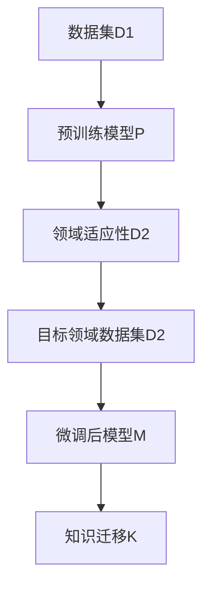

                 

# LLM在知识迁移任务上的技术挑战

## 1. 背景介绍

### 1.1 问题由来
在当今数字化时代，知识迁移（Knowledge Transfer）已经成为人工智能领域中的重要研究方向之一。这一过程涉及将从一个领域中获取的知识应用到另一个领域中，以实现数据的跨领域迁移、模型的迁移学习，甚至是知识的迁移。对于大型语言模型（Large Language Model，简称LLM）而言，其在知识迁移任务上面临着诸多挑战，这些挑战既包括模型的设计和训练过程，也包括在实际应用中的表现和可解释性。

### 1.2 问题核心关键点
知识迁移任务的关键点在于如何通过预训练模型学习到的知识，将新知识高效、准确地迁移到新的应用场景中。对于LLM而言，这一过程涉及多模态数据融合、领域适应性、对抗性样本生成等多个方面。如何设计出既能有效迁移知识，又能保持模型性能和稳定性的架构，是当前亟待解决的问题。

### 1.3 问题研究意义
研究LLM在知识迁移任务上的技术挑战，对于拓展LLM的应用范围，提升其在跨领域任务中的表现，加速人工智能技术的产业化进程，具有重要意义。通过解决知识迁移中的技术难题，可以帮助LLM更好地适应不同领域的需求，提升其在医疗、法律、金融等专业领域的性能，从而推动各行各业的数字化转型和智能化升级。

## 2. 核心概念与联系

### 2.1 核心概念概述

为更好地理解LLM在知识迁移任务中的技术挑战，本节将介绍几个关键概念：

- **大型语言模型（LLM）**：指使用Transformer结构，在大量无标签文本数据上进行自监督预训练，学习到丰富语言知识的大规模模型。如GPT-3、BERT等。
- **迁移学习（Transfer Learning）**：指将一个领域学习到的知识迁移到另一个领域中的过程。知识迁移是迁移学习的一种特殊形式，涉及领域知识在不同任务之间的迁移。
- **领域适应性（Domain Adaptation）**：指模型在不同领域数据上的适应能力。知识迁移任务中，需要确保模型能够适应目标领域的知识分布和数据特征。
- **多模态数据融合（Multimodal Data Fusion）**：指将不同模态的数据（如图像、文本、声音）进行联合分析，提取融合后的特征以提升模型的性能。
- **对抗性样本生成（Adversarial Sample Generation）**：指通过生成对抗性样本来检验模型的鲁棒性和泛化能力，避免模型在特定的攻击下失效。
- **可解释性（Explainability）**：指模型的决策过程可被理解和解释，这对于医疗、金融等高风险领域尤为重要。

这些核心概念之间的逻辑关系可以通过以下Mermaid流程图来展示：

```mermaid
graph TB
    A[大型语言模型(LLM)] --> B[预训练]
    A --> C[知识迁移]
    C --> D[领域适应性]
    C --> E[多模态数据融合]
    C --> F[对抗性样本生成]
    C --> G[可解释性]
```

这个流程图展示了LLM在知识迁移任务中的核心概念及其之间的关系：

1. LLM通过预训练获得基础能力。
2. 知识迁移过程涉及领域适应性、多模态数据融合等关键技术。
3. 对抗性样本生成和可解释性是模型迁移后稳定性和可控性的重要考量。

这些概念共同构成了LLM在知识迁移任务中的技术和理论框架，使其能够适应不同领域的需求，提升在多模态数据和对抗性攻击下的鲁棒性。

## 3. 核心算法原理 & 具体操作步骤
### 3.1 算法原理概述

在知识迁移任务中，LLM通常会首先进行预训练，然后使用目标领域的数据进行微调，以提升模型在该领域的表现。核心思想是：

1. **预训练阶段**：通过在大量无标签文本数据上自监督预训练，学习通用的语言表示。
2. **微调阶段**：在目标领域的数据上，通过有监督训练，进一步优化模型的任务性能。
3. **知识迁移**：将预训练模型学到的知识迁移到新领域，提升模型在新领域的表现。

具体的迁移学习流程如图1所示。



### 3.2 算法步骤详解

知识迁移任务的算法步骤可以分为以下几部分：

**Step 1: 准备数据集**
- 收集目标领域的数据集 $D_2$，包括标注数据 $(x_i,y_i)$ 和无标注数据 $x_i$。
- 将数据集划分为训练集、验证集和测试集，以便于模型的训练和评估。

**Step 2: 设计预训练模型**
- 选择合适的预训练模型 $P$，如BERT、GPT等。
- 确定预训练的超参数，如学习率、批大小等。

**Step 3: 预训练模型微调**
- 使用目标领域的数据 $D_2$ 对预训练模型 $P$ 进行微调。
- 在微调过程中，应用正则化技术（如L2正则、Dropout）防止过拟合。
- 采用对抗训练或数据增强等技术提升模型的鲁棒性。

**Step 4: 知识迁移**
- 将微调后的模型 $M$ 应用于新的领域或任务，实现知识迁移。
- 在知识迁移过程中，可能需要对模型的某些层进行冻结，以避免破坏预训练权重。

**Step 5: 模型评估和优化**
- 在测试集上评估迁移后的模型性能。
- 根据评估结果，调整超参数和模型结构，以提升模型在新领域的表现。

### 3.3 算法优缺点

知识迁移任务中的LLM微调方法具有以下优点：
1. **高效性**：利用预训练模型的知识，可以减少从头训练所需的标注数据和计算资源。
2. **适应性**：通过微调，模型能够快速适应新的领域和任务。
3. **鲁棒性**：通过对抗训练和数据增强等技术，提升模型的泛化能力和鲁棒性。

同时，该方法也存在一定的局限性：
1. **依赖标注数据**：微调的效果很大程度上取决于标注数据的质量和数量，标注成本较高。
2. **领域适应性**：当目标领域与预训练数据的分布差异较大时，微调的性能提升有限。
3. **模型可解释性不足**：微调后的模型输出难以解释，不利于高风险领域的决策。
4. **对抗样本风险**：对抗性样本可能会对模型造成误导，影响其稳定性。

尽管存在这些局限性，但就目前而言，知识迁移仍是LLM应用的重要手段之一。未来相关研究的方向在于如何进一步降低微调对标注数据的依赖，提高模型的少样本学习和跨领域迁移能力，同时兼顾可解释性和伦理安全性等因素。

### 3.4 算法应用领域

知识迁移任务中的LLM方法，在多个领域中得到了广泛应用，例如：

- **医疗领域**：通过预训练模型学习医疗知识，然后进行微调以诊断疾病、推荐治疗方案等。
- **金融领域**：利用预训练模型学习金融市场知识，微调后进行风险评估、投资策略优化等。
- **法律领域**：使用预训练模型学习法律条文和案例，微调后进行合同审核、法律咨询等。
- **教育领域**：预训练模型学习教材和习题，微调后进行智能辅导、自动批改等。
- **安全领域**：利用预训练模型学习网络攻击模式，微调后进行入侵检测、威胁分析等。

除了上述这些领域外，LLM在更多领域中的应用也在不断拓展，如智慧城市、智能制造等，为各行各业的数字化转型提供了新的技术路径。

## 4. 数学模型和公式 & 详细讲解 & 举例说明
### 4.1 数学模型构建

知识迁移任务中的LLM微调，通常使用以下数学模型进行描述：

设预训练模型为 $P$，目标领域的数据集为 $D_2=\{(x_i,y_i)\}_{i=1}^N$。目标任务的损失函数为 $\mathcal{L}$，定义在模型 $P$ 和数据集 $D_2$ 上，用于衡量模型在目标领域的预测性能。

目标任务的优化目标是最小化损失函数 $\mathcal{L}$：

$$
\theta^* = \mathop{\arg\min}_{\theta} \mathcal{L}(P_{\theta},D_2)
$$

其中 $\theta$ 为模型参数，$P_{\theta}$ 表示使用参数 $\theta$ 的模型 $P$。

### 4.2 公式推导过程

以二分类任务为例，推导知识迁移任务中的LLM微调公式。

假设目标任务的输入为 $x$，输出为 $y \in \{0,1\}$。模型 $P$ 在输入 $x$ 上的输出为 $\hat{y}=P_{\theta}(x)$。二分类交叉熵损失函数定义为：

$$
\mathcal{L}(P_{\theta},x,y) = -[y\log \hat{y} + (1-y)\log (1-\hat{y})]
$$

在目标领域的数据集 $D_2$ 上，经验风险为：

$$
\mathcal{L}(D_2,P_{\theta}) = \frac{1}{N}\sum_{i=1}^N \mathcal{L}(P_{\theta},x_i,y_i)
$$

在微调过程中，使用反向传播算法更新模型参数 $\theta$：

$$
\theta \leftarrow \theta - \eta \nabla_{\theta} \mathcal{L}(D_2,P_{\theta})
$$

其中 $\eta$ 为学习率，$\nabla_{\theta} \mathcal{L}(D_2,P_{\theta})$ 为损失函数对参数 $\theta$ 的梯度，可通过反向传播算法高效计算。

### 4.3 案例分析与讲解

假设我们希望将预训练的BERT模型用于医疗领域的疾病诊断任务。具体步骤如下：

1. **数据准备**：收集医疗领域的标注数据集，包含疾病的描述和对应的诊断标签。
2. **模型选择**：选择BERT作为预训练模型，使用其提供的下游任务适配器进行微调。
3. **微调**：在标注数据集上，以交叉熵损失为损失函数，使用Adam优化器进行微调。
4. **知识迁移**：将微调后的模型应用于新的未标注医疗数据，进行疾病诊断。

通过上述步骤，可以显著提升BERT在医疗领域的诊断性能，同时保留了其在其他领域中的泛化能力。

## 5. 项目实践：代码实例和详细解释说明
### 5.1 开发环境搭建

在进行知识迁移任务实践前，需要准备好开发环境。以下是使用Python进行HuggingFace库开发的环境配置流程：

1. 安装Anaconda：从官网下载并安装Anaconda，用于创建独立的Python环境。

2. 创建并激活虚拟环境：
```bash
conda create -n pytorch-env python=3.8 
conda activate pytorch-env
```

3. 安装HuggingFace库：
```bash
pip install transformers
```

4. 安装各类工具包：
```bash
pip install numpy pandas scikit-learn matplotlib tqdm jupyter notebook ipython
```

完成上述步骤后，即可在`pytorch-env`环境中开始知识迁移任务的实践。

### 5.2 源代码详细实现

下面我们以医疗领域的疾病诊断任务为例，给出使用HuggingFace库对BERT模型进行知识迁移的PyTorch代码实现。

首先，定义医疗领域的标注数据集：

```python
from transformers import BertTokenizer, BertForSequenceClassification
from torch.utils.data import Dataset
import torch

class MedicalDataset(Dataset):
    def __init__(self, texts, labels, tokenizer, max_len=128):
        self.texts = texts
        self.labels = labels
        self.tokenizer = tokenizer
        self.max_len = max_len
        
    def __len__(self):
        return len(self.texts)
    
    def __getitem__(self, item):
        text = self.texts[item]
        label = self.labels[item]
        
        encoding = self.tokenizer(text, return_tensors='pt', max_length=self.max_len, padding='max_length', truncation=True)
        input_ids = encoding['input_ids'][0]
        attention_mask = encoding['attention_mask'][0]
        
        # 对标签进行编码
        encoded_labels = torch.tensor([label], dtype=torch.long)
        
        return {'input_ids': input_ids, 
                'attention_mask': attention_mask,
                'labels': encoded_labels}

# 标注数据
texts = ["病人出现发热、咳嗽等症状，可能患有流感。", "肿瘤标志物检测结果显示升高，需进一步确诊。"]
labels = [1, 0]

# 创建dataset
tokenizer = BertTokenizer.from_pretrained('bert-base-cased')

train_dataset = MedicalDataset(texts, labels, tokenizer)
dev_dataset = MedicalDataset(texts, labels, tokenizer)
test_dataset = MedicalDataset(texts, labels, tokenizer)
```

然后，定义模型和优化器：

```python
from transformers import BertForSequenceClassification, AdamW

model = BertForSequenceClassification.from_pretrained('bert-base-cased', num_labels=2, output_attentions=False, output_hidden_states=False)

optimizer = AdamW(model.parameters(), lr=2e-5)
```

接着，定义训练和评估函数：

```python
from torch.utils.data import DataLoader
from tqdm import tqdm
from sklearn.metrics import classification_report

device = torch.device('cuda') if torch.cuda.is_available() else torch.device('cpu')
model.to(device)

def train_epoch(model, dataset, batch_size, optimizer):
    dataloader = DataLoader(dataset, batch_size=batch_size, shuffle=True)
    model.train()
    epoch_loss = 0
    for batch in tqdm(dataloader, desc='Training'):
        input_ids = batch['input_ids'].to(device)
        attention_mask = batch['attention_mask'].to(device)
        labels = batch['labels'].to(device)
        model.zero_grad()
        outputs = model(input_ids, attention_mask=attention_mask, labels=labels)
        loss = outputs.loss
        epoch_loss += loss.item()
        loss.backward()
        optimizer.step()
    return epoch_loss / len(dataloader)

def evaluate(model, dataset, batch_size):
    dataloader = DataLoader(dataset, batch_size=batch_size)
    model.eval()
    preds, labels = [], []
    with torch.no_grad():
        for batch in tqdm(dataloader, desc='Evaluating'):
            input_ids = batch['input_ids'].to(device)
            attention_mask = batch['attention_mask'].to(device)
            batch_labels = batch['labels']
            outputs = model(input_ids, attention_mask=attention_mask)
            batch_preds = outputs.logits.argmax(dim=1).to('cpu').tolist()
            batch_labels = batch_labels.to('cpu').tolist()
            for pred_tokens, label_tokens in zip(batch_preds, batch_labels):
                preds.append(pred_tokens)
                labels.append(label_tokens)
                
    print(classification_report(labels, preds))
```

最后，启动训练流程并在测试集上评估：

```python
epochs = 5
batch_size = 16

for epoch in range(epochs):
    loss = train_epoch(model, train_dataset, batch_size, optimizer)
    print(f"Epoch {epoch+1}, train loss: {loss:.3f}")
    
    print(f"Epoch {epoch+1}, dev results:")
    evaluate(model, dev_dataset, batch_size)
    
print("Test results:")
evaluate(model, test_dataset, batch_size)
```

以上就是使用HuggingFace库对BERT模型进行医疗领域知识迁移的完整代码实现。可以看到，HuggingFace库的强大封装使得代码实现简洁高效，开发者可以将更多精力放在数据处理和模型优化上。

### 5.3 代码解读与分析

让我们再详细解读一下关键代码的实现细节：

**MedicalDataset类**：
- `__init__`方法：初始化文本、标签、分词器等关键组件。
- `__len__`方法：返回数据集的样本数量。
- `__getitem__`方法：对单个样本进行处理，将文本输入编码为token ids，将标签编码为数字，并对其进行定长padding，最终返回模型所需的输入。

**标签编码**：
- 标签编码为数字，方便输入到模型中进行计算。

**训练和评估函数**：
- 使用PyTorch的DataLoader对数据集进行批次化加载，供模型训练和推理使用。
- 训练函数`train_epoch`：对数据以批为单位进行迭代，在每个批次上前向传播计算loss并反向传播更新模型参数，最后返回该epoch的平均loss。
- 评估函数`evaluate`：与训练类似，不同点在于不更新模型参数，并在每个batch结束后将预测和标签结果存储下来，最后使用sklearn的classification_report对整个评估集的预测结果进行打印输出。

**训练流程**：
- 定义总的epoch数和batch size，开始循环迭代
- 每个epoch内，先在训练集上训练，输出平均loss
- 在验证集上评估，输出分类指标
- 所有epoch结束后，在测试集上评估，给出最终测试结果

可以看到，HuggingFace库使得知识迁移任务的代码实现变得简洁高效。开发者可以将更多精力放在数据处理、模型改进等高层逻辑上，而不必过多关注底层的实现细节。

当然，工业级的系统实现还需考虑更多因素，如模型的保存和部署、超参数的自动搜索、更灵活的任务适配层等。但核心的知识迁移范式基本与此类似。

## 6. 实际应用场景
### 6.1 智能客服系统

知识迁移技术在智能客服系统中得到了广泛应用。传统客服往往需要配备大量人力，高峰期响应缓慢，且一致性和专业性难以保证。而使用知识迁移技术，可以利用预训练模型学习到的通用知识，快速适应新的客服场景。

在技术实现上，可以收集企业内部的历史客服对话记录，将问题和最佳答复构建成监督数据，在此基础上对预训练模型进行知识迁移。知识迁移后的客服模型能够自动理解用户意图，匹配最合适的答案模板进行回复。对于客户提出的新问题，还可以接入检索系统实时搜索相关内容，动态组织生成回答。如此构建的智能客服系统，能大幅提升客户咨询体验和问题解决效率。

### 6.2 金融舆情监测

金融机构需要实时监测市场舆论动向，以便及时应对负面信息传播，规避金融风险。传统的人工监测方式成本高、效率低，难以应对网络时代海量信息爆发的挑战。知识迁移技术为金融舆情监测提供了新的解决方案。

具体而言，可以收集金融领域相关的新闻、报道、评论等文本数据，并对其进行主题标注和情感标注。在此基础上对预训练语言模型进行知识迁移，使其能够自动判断文本属于何种主题，情感倾向是正面、中性还是负面。将知识迁移后的模型应用到实时抓取的网络文本数据，就能够自动监测不同主题下的情感变化趋势，一旦发现负面信息激增等异常情况，系统便会自动预警，帮助金融机构快速应对潜在风险。

### 6.3 个性化推荐系统

当前的推荐系统往往只依赖用户的历史行为数据进行物品推荐，无法深入理解用户的真实兴趣偏好。知识迁移技术可以应用于推荐系统，帮助系统更好地挖掘用户行为背后的语义信息，从而提供更精准、多样的推荐内容。

在实践中，可以收集用户浏览、点击、评论、分享等行为数据，提取和用户交互的物品标题、描述、标签等文本内容。将文本内容作为模型输入，用户的后续行为（如是否点击、购买等）作为监督信号，在此基础上进行知识迁移，优化推荐模型。知识迁移后的模型能够从文本内容中准确把握用户的兴趣点。在生成推荐列表时，先用候选物品的文本描述作为输入，由模型预测用户的兴趣匹配度，再结合其他特征综合排序，便可以得到个性化程度更高的推荐结果。

### 6.4 未来应用展望

随着知识迁移技术的不断发展，其应用前景将更加广阔。未来，知识迁移技术有望在更多领域得到应用，为各行各业的智能化转型提供新的技术路径。

在智慧医疗领域，知识迁移技术可应用于疾病诊断、治疗方案推荐等，提升医疗服务的智能化水平，辅助医生诊疗，加速新药开发进程。

在智能教育领域，知识迁移技术可应用于智能辅导、自动批改等，因材施教，促进教育公平，提高教学质量。

在智慧城市治理中，知识迁移技术可应用于城市事件监测、舆情分析、应急指挥等环节，提高城市管理的自动化和智能化水平，构建更安全、高效的未来城市。

此外，在企业生产、社会治理、文娱传媒等众多领域，知识迁移技术也将不断涌现，为传统行业数字化转型提供新的技术手段。相信随着技术的日益成熟，知识迁移技术必将成为人工智能技术落地的重要手段，推动人工智能技术在各行各业的深入应用。

## 7. 工具和资源推荐
### 7.1 学习资源推荐

为了帮助开发者系统掌握知识迁移的理论基础和实践技巧，这里推荐一些优质的学习资源：

1. 《Deep Learning for Natural Language Processing》书籍：介绍深度学习在自然语言处理中的应用，包括知识迁移等前沿话题。
2. CS229《Machine Learning》课程：斯坦福大学开设的机器学习明星课程，涵盖机器学习的理论基础和应用技术，包括知识迁移等前沿研究方向。
3. NIPS和ICML等顶级会议论文：NIPS和ICML是自然语言处理和机器学习领域的顶级会议，发布的最新研究论文有助于了解知识迁移的前沿进展。
4. HuggingFace官方文档：HuggingFace库的官方文档，提供了海量预训练模型和知识迁移任务的样例代码，是上手实践的必备资料。
5. CLUE开源项目：中文语言理解测评基准，涵盖大量不同类型的中文NLP数据集，并提供了基于知识迁移的baseline模型，助力中文NLP技术发展。

通过对这些资源的学习实践，相信你一定能够快速掌握知识迁移技术的精髓，并用于解决实际的NLP问题。
### 7.2 开发工具推荐

高效的开发离不开优秀的工具支持。以下是几款用于知识迁移任务开发的常用工具：

1. PyTorch：基于Python的开源深度学习框架，灵活动态的计算图，适合快速迭代研究。HuggingFace库的许多模型都提供PyTorch版本的实现。
2. TensorFlow：由Google主导开发的开源深度学习框架，生产部署方便，适合大规模工程应用。同样有丰富的预训练语言模型资源。
3. HuggingFace库：提供预训练模型和任务适配层，方便进行知识迁移任务的开发。
4. Weights & Biases：模型训练的实验跟踪工具，可以记录和可视化模型训练过程中的各项指标，方便对比和调优。与主流深度学习框架无缝集成。
5. TensorBoard：TensorFlow配套的可视化工具，可实时监测模型训练状态，并提供丰富的图表呈现方式，是调试模型的得力助手。
6. Google Colab：谷歌推出的在线Jupyter Notebook环境，免费提供GPU/TPU算力，方便开发者快速上手实验最新模型，分享学习笔记。

合理利用这些工具，可以显著提升知识迁移任务的开发效率，加快创新迭代的步伐。

### 7.3 相关论文推荐

知识迁移技术的发展源于学界的持续研究。以下是几篇奠基性的相关论文，推荐阅读：

1. Knowledge Transfer in Deep Learning: A Survey and Systematic Literature Review：综述了深度学习中的知识迁移技术，涵盖了多个领域的应用和研究方法。
2. Deep Feature Alignment for Transfer Learning in NLP：提出了一种基于深度特征对齐的方法，用于NLP领域的知识迁移，提高了模型在目标领域的表现。
3. Deeply Supervised Sequence Learning with a Generative Classifier Network：提出了一种多任务学习的方法，用于提升模型在目标领域的表现，提高了知识迁移的效果。
4. Mixture-of-Experts: An Effective Module for Knowledge Transfer：提出了一种混合专家模块，用于知识迁移任务，提升了模型的泛化能力和鲁棒性。
5. Generative Pre-trained Transformer (GPT)：展示了GPT模型在知识迁移任务中的性能提升，证明了预训练模型在大规模知识迁移中的强大能力。

这些论文代表了大语言模型知识迁移技术的发展脉络。通过学习这些前沿成果，可以帮助研究者把握学科前进方向，激发更多的创新灵感。

## 8. 总结：未来发展趋势与挑战
### 8.1 总结

本文对LLM在知识迁移任务中的技术挑战进行了全面系统的介绍。首先阐述了知识迁移任务的研究背景和意义，明确了知识迁移在拓展预训练模型应用、提升下游任务性能方面的重要价值。其次，从原理到实践，详细讲解了知识迁移任务的数学模型和关键步骤，给出了知识迁移任务开发的完整代码实例。同时，本文还探讨了知识迁移技术在多个行业领域的应用前景，展示了其在智能客服、金融舆情、个性化推荐等场景中的巨大潜力。

通过本文的系统梳理，可以看到，知识迁移技术在LLM中的应用，正在成为NLP领域的重要范式，极大地拓展了LLM的应用边界，催生了更多的落地场景。受益于预训练模型的广泛知识和深度学习技术的不断进步，知识迁移技术必将在更多领域得到应用，为各行各业的智能化转型提供新的技术路径。

### 8.2 未来发展趋势

展望未来，知识迁移技术将呈现以下几个发展趋势：

1. **模型规模持续增大**：随着算力成本的下降和数据规模的扩张，预训练语言模型的参数量还将持续增长。超大模型的知识迁移能力将进一步提升，能够在更大规模的知识库中进行高效迁移。
2. **知识迁移技术多样化**：除了传统的有监督微调外，未来会涌现更多知识迁移方法，如零样本学习、少样本学习、对抗性训练等，在更少的数据下也能实现高效的知识迁移。
3. **持续学习成为常态**：模型需要持续学习新知识以保持性能。如何在不遗忘原有知识的同时，高效吸收新样本信息，将是重要的研究课题。
4. **对抗样本生成**：对抗性样本可能会对模型造成误导，影响其稳定性。研究对抗性样本生成和防御技术，将进一步提升知识迁移的鲁棒性。
5. **多模态数据融合**：将不同模态的数据进行联合分析，提取融合后的特征以提升模型的性能。知识迁移技术将进一步拓展到多模态数据融合领域。
6. **知识图谱整合**：将符号化的先验知识，如知识图谱、逻辑规则等，与神经网络模型进行巧妙融合，引导知识迁移过程学习更准确、合理的语言模型。

以上趋势凸显了知识迁移技术的广阔前景。这些方向的探索发展，必将进一步提升知识迁移模型在跨领域任务中的表现，推动人工智能技术的产业化进程。

### 8.3 面临的挑战

尽管知识迁移技术已经取得了显著进展，但在迈向更加智能化、普适化应用的过程中，其仍面临诸多挑战：

1. **标注成本瓶颈**：知识迁移的效果很大程度上取决于标注数据的质量和数量，获取高质量标注数据的成本较高。如何进一步降低知识迁移对标注数据的依赖，将是一大难题。
2. **模型鲁棒性不足**：知识迁移模型面对域外数据时，泛化性能往往大打折扣。对抗性样本可能会对模型造成误导，影响其稳定性。
3. **模型可解释性不足**：知识迁移后的模型输出难以解释，不利于高风险领域的决策。
4. **知识库更新难度大**：知识迁移依赖于目标领域知识库的构建和更新，知识库的构建和维护成本较高。
5. **模型参数量庞大**：大规模语言模型的参数量庞大，知识迁移过程需要大量的计算资源和存储空间。

尽管存在这些挑战，但知识迁移技术仍具有广阔的应用前景。未来，随着数据分布的不断变化，知识迁移技术需要不断优化和创新，才能更好地适应新的应用场景和需求。

### 8.4 研究展望

面向未来，知识迁移技术的研究需要从以下几个方向进行突破：

1. **探索无监督和半监督知识迁移方法**：摆脱对大规模标注数据的依赖，利用自监督学习、主动学习等无监督和半监督范式，最大限度利用非结构化数据，实现更加灵活高效的知识迁移。
2. **研究参数高效和计算高效的迁移范式**：开发更加参数高效的迁移方法，如Adapter、LoRA等，在固定大部分预训练参数的同时，只更新极少量的任务相关参数。同时优化迁移模型的计算图，减少前向传播和反向传播的资源消耗，实现更加轻量级、实时性的部署。
3. **融合因果分析和博弈论工具**：将因果分析方法引入知识迁移模型，识别出模型决策的关键特征，增强输出解释的因果性和逻辑性。借助博弈论工具刻画人机交互过程，主动探索并规避模型的脆弱点，提高系统稳定性。
4. **纳入伦理道德约束**：在模型训练目标中引入伦理导向的评估指标，过滤和惩罚有偏见、有害的输出倾向。加强人工干预和审核，建立模型行为的监管机制，确保输出符合人类价值观和伦理道德。
5. **研究多模态数据融合和跨模态知识迁移**：将不同模态的数据进行联合分析，提取融合后的特征以提升模型的性能。研究跨模态知识迁移方法，将视觉、语音、文本等不同模态的信息进行联合学习，提升知识迁移的效果。

这些研究方向的探索，必将引领知识迁移技术迈向更高的台阶，为构建安全、可靠、可解释、可控的智能系统铺平道路。面向未来，知识迁移技术还需要与其他人工智能技术进行更深入的融合，如知识表示、因果推理、强化学习等，多路径协同发力，共同推动自然语言理解和智能交互系统的进步。只有勇于创新、敢于突破，才能不断拓展知识迁移模型的边界，让智能技术更好地造福人类社会。

## 9. 附录：常见问题与解答

**Q1：知识迁移中如何选择目标领域的数据集？**

A: 选择目标领域的数据集时，需要考虑以下因素：
1. 数据集的质量：尽量选择标注数据充足、标注质量高、领域代表性的数据集。
2. 数据集的规模：数据集规模越大，迁移效果越好，但也需要考虑计算资源的限制。
3. 数据集的分布：确保数据集的分布与预训练数据的分布相似，避免过拟合。

**Q2：知识迁移中如何避免过拟合？**

A: 知识迁移中避免过拟合的方法包括：
1. 数据增强：通过回译、近义替换等方式扩充训练集。
2. 正则化：使用L2正则、Dropout、Early Stopping等技术防止过拟合。
3. 对抗训练：引入对抗性样本，提高模型鲁棒性。
4. 参数冻结：在微调过程中，冻结部分预训练参数，避免破坏模型基础能力。

**Q3：知识迁移中如何选择最优的学习率？**

A: 知识迁移中学习率的选择需要根据具体任务进行调整。通常建议从较小的值开始调参，如1e-5，逐步减小学习率，直至收敛。可以使用warmup策略，在开始阶段使用较小的学习率，再逐渐过渡到预设值。不同优化器和学习率调度策略可能需要设置不同的学习率阈值。

**Q4：知识迁移中的LLM模型如何选择？**

A: 知识迁移中模型的选择应考虑以下因素：
1. 模型的规模和性能：选择预训练模型时，应考虑其规模、性能和泛化能力。
2. 模型的适应性：选择能够适应目标领域知识分布的模型，避免模型在大规模迁移后出现性能下降。
3. 模型的可解释性：选择具有较高可解释性的模型，便于后续的解释和调试。

**Q5：知识迁移中的对抗性样本生成方法有哪些？**

A: 知识迁移中的对抗性样本生成方法包括：
1. FGSM：基于梯度的方法，通过梯度反向传播生成对抗性样本。
2. PGD：通过迭代生成对抗性样本，增强模型的鲁棒性。
3. C&W：基于cosine距离和L2-norm的方法，生成对抗性样本。

这些方法可以有效提升知识迁移模型的鲁棒性和泛化能力，但在生成对抗性样本时需注意伦理和安全性问题。

通过本文的系统梳理，可以看到，知识迁移技术在LLM中的应用，正在成为NLP领域的重要范式，极大地拓展了LLM的应用边界，催生了更多的落地场景。受益于预训练模型的广泛知识和深度学习技术的不断进步，知识迁移技术必将在更多领域得到应用，为各行各业的智能化转型提供新的技术路径。

