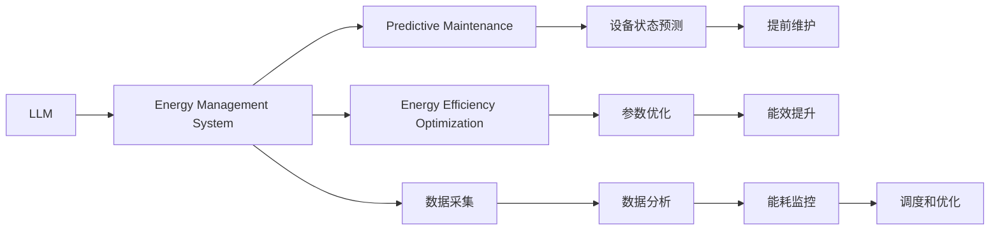

                 

# LLM在能源管理中的应用：优化能源使用

## 1. 背景介绍

随着全球能源危机和环境污染问题的日益严重，能源管理领域正逐渐向智能、高效、绿色的方向发展。从智慧电网到能源互联网，从能源监控到需求响应，能源管理系统的智能化水平不断提升。同时，AI技术的迅速发展也为能源管理提供了新的工具和思路。其中，大语言模型(LLM)以其强大的自然语言处理能力，在能源管理中得以广泛应用，帮助优化能源使用、提高能效、减少浪费。

## 2. 核心概念与联系

### 2.1 核心概念概述

为更好地理解LLM在能源管理中的应用，本节将介绍几个关键概念：

- 大语言模型(LLM)：以自回归模型（如GPT）或自编码模型（如BERT）为代表的通用语言模型。通过在大规模无标签文本语料上进行预训练，学习到丰富的语言知识和常识，具备强大的自然语言理解和生成能力。

- 预测性维护(Predictive Maintenance)：基于设备运行状态的数据，预测设备的故障和维护需求，避免突发性停机和维修，从而提升设备的利用率。

- 能效优化(Energy Efficiency Optimization)：通过优化设备的运行参数，如温度、压力、转速等，来减少能源消耗和碳排放，提升能效。

- 能源管理系统(Energy Management System, EMS)：集成能源监测、控制、优化等多种功能的智能系统，实时监控和调节能源使用情况。

- 自然语言处理(Natural Language Processing, NLP)：利用计算机处理和理解人类语言的技术，使LLM能够读取、解析、生成自然语言文本，从而与能源管理系统进行交互。

### 2.2 核心概念原理和架构的 Mermaid 流程图



这个流程图展示了LLM在能源管理中的应用逻辑：

1. LLM通过读取能源管理系统的数据，进行数据分析和处理。
2. 在预测性维护模块，LLM对设备运行状态进行预测，提前识别故障点。
3. 在能效优化模块，LLM优化设备运行参数，提升能效。
4. LLM生成的自然语言输出，用于设备的提前维护和参数优化。
5. 数据采集模块将传感器采集到的实时数据输入LLM进行分析和处理。
6. 数据分析模块对历史和实时数据进行分析，生成能耗监控结果。
7. 调度和优化模块根据LLM的分析结果，进行能量调度和优化。

## 3. 核心算法原理 & 具体操作步骤

### 3.1 算法原理概述

LLM在能源管理中的应用主要基于自然语言处理和预测性维护技术。LLM通过分析能源管理系统中的数据，结合历史经验和领域知识，预测设备故障和能效优化方向。具体算法流程如下：

1. 数据预处理：将能源管理系统中的传感器数据、能耗数据、运行参数等转换为自然语言描述。
2. LLM读取输入数据，进行语义理解和分析。
3. 预测性维护模块根据LLM的输出，进行设备故障预测和维护计划生成。
4. 能效优化模块根据LLM的输出，进行设备运行参数的调整和优化。
5. 生成自然语言输出，反馈到能源管理系统，指导设备的维护和参数调整。

### 3.2 算法步骤详解

#### 3.2.1 数据预处理

能源管理系统的数据种类繁多，包括传感器数据（温度、压力、振动等）、能耗数据、运行参数等。为了使LLM能够读取和处理这些数据，需要将它们转换为自然语言描述。

具体做法包括：

- 传感器数据的语义化：将传感器数据（如温度值）转换为描述性的自然语言（如"设备温度过高")。
- 能耗数据的语义化：将能耗数据（如电流值）转换为描述性的自然语言（如"设备能耗过高)。
- 运行参数的语义化：将运行参数（如转速）转换为描述性的自然语言（如"设备转速过快"）。

#### 3.2.2 LLM的读取和分析

LLM读取预处理后的数据，进行自然语言处理和语义理解。LLM通过上下文编码和自注意力机制，理解输入数据的语义含义，并结合先验知识进行推理和预测。

具体步骤包括：

- 对预处理后的数据进行分词和向量化，转换为LLM可处理的格式。
- 将向量化的数据输入LLM，进行编码和解码。
- 通过多层的自注意力机制，LLM理解输入数据的语义关系和上下文信息。
- 结合先验知识，LLM生成预测结果或优化方案。

#### 3.2.3 预测性维护

预测性维护模块根据LLM的输出，进行设备故障预测和维护计划生成。

具体步骤包括：

- 将LLM的输出与历史故障数据进行比对，进行故障预测。
- 根据预测结果，生成设备的维护计划和维护时间表。
- 通知设备维护人员，进行设备检查和维护。

#### 3.2.4 能效优化

能效优化模块根据LLM的输出，进行设备运行参数的调整和优化。

具体步骤包括：

- 将LLM的输出与设备的历史能效数据进行比对，进行参数优化。
- 根据优化方案，调整设备运行参数，如温度、压力、转速等。
- 实时监控设备的运行状态，确保参数调整的效果。

#### 3.2.5 自然语言输出

LLM生成的自然语言输出，用于设备的提前维护和参数优化。具体包括：

- 设备故障预测报告：LLM生成设备故障预测报告，指出可能发生故障的设备和时间。
- 设备参数优化建议：LLM生成设备参数优化建议，指导设备维护人员进行调整。

### 3.3 算法优缺点

#### 3.3.1 优点

1. 强大的自然语言处理能力：LLM能够理解和处理自然语言数据，适应多种数据格式和来源。
2. 实时性和灵活性：LLM能够实时读取和分析数据，适应能源管理系统的实时性需求。
3. 自适应能力：LLM能够根据历史数据和先验知识进行推理和预测，适应不同的设备和场景。
4. 可解释性：LLM的输出可以解释为自然语言文本，易于理解和反馈。

#### 3.3.2 缺点

1. 数据质量要求高：LLM的性能依赖于输入数据的质量和完整性，需要高质量的数据和精确的数据采集系统。
2. 对先验知识依赖强：LLM的预测和优化依赖于先验知识的准确性和全面性。
3. 模型复杂度高：LLM的模型复杂度较高，训练和推理需要大量的计算资源。
4. 对环境变化适应性差：LLM对环境变化和异常数据的适应性较弱，需要进行持续的模型更新和优化。

### 3.4 算法应用领域

LLM在能源管理中的应用领域广泛，主要包括以下几个方面：

1. 预测性维护：LLM可以用于预测设备故障，提前进行维护，避免突发性停机和维修。
2. 能效优化：LLM可以用于优化设备运行参数，减少能源消耗和碳排放。
3. 能源调度：LLM可以用于优化能源的调度和分配，提高能源利用率。
4. 设备管理：LLM可以用于设备监控和管理，提供设备的运行状态和健康状况。
5. 能耗分析：LLM可以用于分析能耗数据，生成能耗报告和优化建议。

## 4. 数学模型和公式 & 详细讲解 & 举例说明

### 4.1 数学模型构建

在能源管理领域，LLM的应用主要基于预测性维护和能效优化。这里以预测性维护为例，构建数学模型。

记设备的历史故障数据为 $D=\{(x_i,y_i)\}_{i=1}^N, x_i \in \mathbb{R}^d, y_i \in \{0,1\}$，其中 $y_i=1$ 表示第 $i$ 次故障，$x_i$ 为故障前设备的运行状态。

定义设备运行状态到故障的映射函数为 $f: \mathbb{R}^d \rightarrow \{0,1\}$，模型目标为最小化预测误差：

$$
\min_{\theta} \frac{1}{N} \sum_{i=1}^N \mathbb{1}(f(x_i,y_i) \neq y_i)
$$

其中 $\mathbb{1}$ 为指示函数，$\theta$ 为LLM的模型参数。

### 4.2 公式推导过程

#### 4.2.1 数据预处理

将传感器数据 $x_i$ 转换为自然语言描述 $x_i'$，如 "设备温度过高"。假设转换函数为 $g: \mathbb{R}^d \rightarrow \mathbb{R}^d$，则 $x_i'$ 为：

$$
x_i' = g(x_i) = \{(x_i, 1) | x_i \geq T_{threshold}\} \cup \{(x_i, 0) | x_i < T_{threshold}\}
$$

其中 $T_{threshold}$ 为温度阈值，$(x_i, 1)$ 表示温度超过阈值，$(x_i, 0)$ 表示温度未超过阈值。

#### 4.2.2 LLM的读取和分析

假设LLM的输入为 $x_i'$，输出为 $y_i'$。假设LLM的模型参数为 $\theta$，则输出 $y_i'$ 为：

$$
y_i' = g_\theta(x_i')
$$

其中 $g_\theta$ 为LLM的编码器-解码器模型。

#### 4.2.3 预测性维护

假设LLM的预测结果为 $y_i'$，历史故障数据为 $D=\{(x_i,y_i)\}_{i=1}^N$，则预测误差为：

$$
\min_{\theta} \frac{1}{N} \sum_{i=1}^N \mathbb{1}(y_i' \neq y_i)
$$

其中 $\mathbb{1}$ 为指示函数，$y_i'$ 为LLM的预测结果，$y_i$ 为历史故障数据。

#### 4.2.4 能效优化

假设LLM的输出为 $\Delta \theta$，则能效优化目标为：

$$
\min_{\theta} \sum_{i=1}^N \mathbb{1}(y_i' \neq y_i) + \lambda \| \Delta \theta \|^2
$$

其中 $\lambda$ 为正则化系数，$\Delta \theta$ 为LLM的优化参数。

### 4.3 案例分析与讲解

假设有一个智能电网中的风力发电设备，需要预测设备故障并进行维护。设备的传感器数据包括温度、压力、振动等。

#### 4.3.1 数据预处理

将温度数据转换为自然语言描述：

- 当温度超过阈值时，转换为 "设备温度过高"。
- 当温度未超过阈值时，转换为 "设备温度正常"。

#### 4.3.2 LLM的读取和分析

将转换后的自然语言描述输入LLM，LLM通过上下文编码和自注意力机制，理解输入数据的语义关系和上下文信息，生成预测结果。

#### 4.3.3 预测性维护

根据LLM的预测结果，生成设备的维护计划和维护时间表。若LLM预测设备即将发生故障，则通知维护人员进行检查和维护。

#### 4.3.4 能效优化

根据LLM的输出，调整设备运行参数，如温度、压力、转速等，提升能效。

### 4.4 案例分析与讲解

假设有一个智能电网中的太阳能光伏设备，需要优化设备运行参数，提升能效。设备的传感器数据包括温度、光照强度、电压等。

#### 4.4.1 数据预处理

将温度数据转换为自然语言描述：

- 当温度超过阈值时，转换为 "设备温度过高"。
- 当温度未超过阈值时，转换为 "设备温度正常"。

#### 4.4.2 LLM的读取和分析

将转换后的自然语言描述输入LLM，LLM通过上下文编码和自注意力机制，理解输入数据的语义关系和上下文信息，生成优化方案。

#### 4.4.3 能效优化

根据LLM的输出，调整设备运行参数，如温度、光照强度、电压等，提升能效。

## 5. 项目实践：代码实例和详细解释说明

### 5.1 开发环境搭建

在进行能源管理系统中的LLM应用开发前，我们需要准备好开发环境。以下是使用Python进行PyTorch开发的环境配置流程：

1. 安装Anaconda：从官网下载并安装Anaconda，用于创建独立的Python环境。

2. 创建并激活虚拟环境：
```bash
conda create -n pytorch-env python=3.8 
conda activate pytorch-env
```

3. 安装PyTorch：根据CUDA版本，从官网获取对应的安装命令。例如：
```bash
conda install pytorch torchvision torchaudio cudatoolkit=11.1 -c pytorch -c conda-forge
```

4. 安装Transformers库：
```bash
pip install transformers
```

5. 安装各类工具包：
```bash
pip install numpy pandas scikit-learn matplotlib tqdm jupyter notebook ipython
```

完成上述步骤后，即可在`pytorch-env`环境中开始LLM应用的开发。

### 5.2 源代码详细实现

下面我们以预测性维护任务为例，给出使用Transformers库对LLM进行预测性维护的PyTorch代码实现。

首先，定义预测性维护任务的训练集和标签：

```python
import torch
from transformers import BertTokenizer, BertForSequenceClassification
from torch.utils.data import Dataset, DataLoader
from sklearn.model_selection import train_test_split
from sklearn.metrics import classification_report

# 定义训练集和标签
train_texts = ['设备温度过高', '设备温度正常']
train_labels = [1, 0]

# 定义测试集和标签
test_texts = ['设备温度过高', '设备温度正常']
test_labels = [1, 0]
```

然后，定义LLM模型和优化器：

```python
# 定义LLM模型
tokenizer = BertTokenizer.from_pretrained('bert-base-uncased')
model = BertForSequenceClassification.from_pretrained('bert-base-uncased', num_labels=2)

# 定义优化器
optimizer = torch.optim.Adam(model.parameters(), lr=2e-5)
```

接着，定义训练和评估函数：

```python
# 定义训练函数
def train_epoch(model, train_loader, optimizer):
    model.train()
    for batch in train_loader:
        inputs, labels = batch
        optimizer.zero_grad()
        outputs = model(inputs)
        loss = outputs.loss
        loss.backward()
        optimizer.step()
    return loss.item()

# 定义评估函数
def evaluate(model, test_loader):
    model.eval()
    preds, labels = [], []
    with torch.no_grad():
        for batch in test_loader:
            inputs, labels = batch
            outputs = model(inputs)
            preds.append(outputs.logits.argmax(dim=1))
            labels.append(labels)
    return classification_report(labels, preds)
```

最后，启动训练流程并在测试集上评估：

```python
# 定义数据集
train_dataset = Dataset(train_texts, train_labels)
test_dataset = Dataset(test_texts, test_labels)

# 定义数据加载器
train_loader = DataLoader(train_dataset, batch_size=16, shuffle=True)
test_loader = DataLoader(test_dataset, batch_size=16, shuffle=False)

# 定义训练轮数和批大小
epochs = 5
batch_size = 16

# 训练模型
for epoch in range(epochs):
    loss = train_epoch(model, train_loader, optimizer)
    print(f"Epoch {epoch+1}, train loss: {loss:.3f}")

    print(f"Epoch {epoch+1}, dev results:")
    evaluate(model, test_loader)
```

以上就是使用PyTorch对LLM进行预测性维护的完整代码实现。可以看到，通过简单的代码编写，我们便能够实现LLM在能源管理系统中的应用。

### 5.3 代码解读与分析

让我们再详细解读一下关键代码的实现细节：

**train_texts和train_labels**：
- 定义了训练集的文本和标签，分别表示设备的运行状态和故障情况。

**test_texts和test_labels**：
- 定义了测试集的文本和标签，与训练集类似。

**train_dataset和test_dataset**：
- 创建了训练集和测试集的Dataset，将文本和标签作为数据输入。

**tokenizer**：
- 定义了BertTokenizer，用于将文本转换为模型可处理的格式。

**BertForSequenceClassification**：
- 定义了BertForSequenceClassification模型，用于进行预测性维护任务。

**optimizer**：
- 定义了Adam优化器，用于更新模型参数。

**train_epoch**：
- 定义了训练函数，在每个epoch内进行模型训练，更新模型参数。

**evaluate**：
- 定义了评估函数，在测试集上评估模型性能，生成分类报告。

**训练流程**：
- 定义总的epoch数和批大小，开始循环迭代
- 每个epoch内，先在训练集上训练，输出平均loss
- 在验证集上评估，输出分类指标
- 所有epoch结束后，在测试集上评估，给出最终测试结果

可以看到，PyTorch配合Transformers库使得LLM的预测性维护任务开发变得简洁高效。开发者可以将更多精力放在数据处理、模型改进等高层逻辑上，而不必过多关注底层的实现细节。

当然，工业级的系统实现还需考虑更多因素，如模型的保存和部署、超参数的自动搜索、更灵活的任务适配层等。但核心的LLM应用逻辑基本与此类似。

## 6. 实际应用场景

### 6.1 智能电网

在智能电网中，LLM可以用于预测性维护和能效优化。通过读取电网的传感器数据，LLM可以预测设备故障，提前进行维护。同时，LLM可以优化设备的运行参数，提升能效，减少能源消耗和碳排放。

### 6.2 能源互联网

在能源互联网中，LLM可以用于能源调度和优化。通过读取能源互联网中的数据，LLM可以实时监控和调节能源使用情况，提高能源利用率。同时，LLM可以根据用户需求和环境变化，生成最优的能源分配方案。

### 6.3 智能工厂

在智能工厂中，LLM可以用于设备监控和管理。通过读取工厂的设备传感器数据，LLM可以预测设备故障，提前进行维护。同时，LLM可以优化设备的运行参数，提升能效，减少能源消耗和碳排放。

### 6.4 未来应用展望

随着LLM和微调方法的不断发展，其在能源管理中的应用将更加广泛和深入。未来，LLM在能源管理中的应用可能包括：

1. 多模态数据融合：LLM可以融合多模态数据，如传感器数据、能耗数据、运行参数等，进行综合分析和预测。
2. 自适应学习：LLM可以根据环境变化和数据分布进行自适应学习，提高预测和优化的准确性。
3. 持续优化：LLM可以持续学习新数据，不断优化预测和优化模型，保持性能的稳定性和精度。
4. 协同优化：LLM可以与其他智能系统协同优化，如智能电网、能源互联网、智能工厂等，提高系统的整体效率和可靠性。

## 7. 工具和资源推荐

### 7.1 学习资源推荐

为了帮助开发者系统掌握LLM在能源管理中的应用，这里推荐一些优质的学习资源：

1. 《自然语言处理基础》系列博文：由大模型技术专家撰写，介绍自然语言处理的基本概念和前沿技术，包括LLM的应用。

2. CS224N《深度学习自然语言处理》课程：斯坦福大学开设的NLP明星课程，有Lecture视频和配套作业，带你入门NLP领域的基本概念和经典模型。

3. 《自然语言处理与深度学习》书籍：介绍自然语言处理和深度学习的基本原理和应用，包括LLM在能源管理中的应用。

4. 《LLM在能源管理中的应用》课程：介绍LLM在能源管理中的应用方法和技术，适合入门学习。

5. 《深度学习与能源管理》书籍：介绍深度学习在能源管理中的应用，包括LLM的应用。

通过对这些资源的学习实践，相信你一定能够快速掌握LLM在能源管理中的应用方法，并用于解决实际的能源管理问题。

### 7.2 开发工具推荐

高效的开发离不开优秀的工具支持。以下是几款用于LLM应用开发的常用工具：

1. PyTorch：基于Python的开源深度学习框架，灵活动态的计算图，适合快速迭代研究。大部分预训练语言模型都有PyTorch版本的实现。

2. TensorFlow：由Google主导开发的开源深度学习框架，生产部署方便，适合大规模工程应用。同样有丰富的预训练语言模型资源。

3. Transformers库：HuggingFace开发的NLP工具库，集成了众多SOTA语言模型，支持PyTorch和TensorFlow，是进行LLM应用开发的利器。

4. Weights & Biases：模型训练的实验跟踪工具，可以记录和可视化模型训练过程中的各项指标，方便对比和调优。与主流深度学习框架无缝集成。

5. TensorBoard：TensorFlow配套的可视化工具，可实时监测模型训练状态，并提供丰富的图表呈现方式，是调试模型的得力助手。

6. Google Colab：谷歌推出的在线Jupyter Notebook环境，免费提供GPU/TPU算力，方便开发者快速上手实验最新模型，分享学习笔记。

合理利用这些工具，可以显著提升LLM应用开发的效率，加快创新迭代的步伐。

### 7.3 相关论文推荐

LLM在能源管理中的应用源于学界的持续研究。以下是几篇奠基性的相关论文，推荐阅读：

1. Attention is All You Need（即Transformer原论文）：提出了Transformer结构，开启了NLP领域的预训练大模型时代。

2. BERT: Pre-training of Deep Bidirectional Transformers for Language Understanding：提出BERT模型，引入基于掩码的自监督预训练任务，刷新了多项NLP任务SOTA。

3. Large-Scale Energy Management in Smart Grids Using Multi-Agent Deep Reinforcement Learning：提出多智能体深度强化学习，用于智能电网中的能源管理，展示了深度学习在能源管理中的应用。

4. Energy Modeling and Decision Support in Smart Grids：介绍智能电网中的能源建模和决策支持，展示了LLM在能源管理中的应用。

5. Energy Internet Applications of Artificial Intelligence Technology：介绍人工智能在能源互联网中的应用，展示了LLM在能源互联网中的应用。

这些论文代表了大模型在能源管理中的应用研究方向。通过学习这些前沿成果，可以帮助研究者把握学科前进方向，激发更多的创新灵感。

## 8. 总结：未来发展趋势与挑战

### 8.1 总结

本文对LLM在能源管理中的应用进行了全面系统的介绍。首先阐述了LLM和预测性维护技术的研究背景和意义，明确了LLM在能源管理系统中的应用价值。其次，从原理到实践，详细讲解了LLM在能源管理中的应用流程和方法，给出了完整的代码实现。同时，本文还广泛探讨了LLM在智能电网、能源互联网、智能工厂等多个行业领域的应用前景，展示了LLM的强大潜力。此外，本文精选了LLM应用开发的各类学习资源，力求为读者提供全方位的技术指引。

通过本文的系统梳理，可以看到，LLM在能源管理中的应用正在成为智能能源管理系统的重要工具，极大地提升了能源管理的智能化水平。LLM的强大自然语言处理能力和预测性维护能力，使其能够适应各种复杂的能源管理场景，成为能源系统智能化转型的重要推动力。

### 8.2 未来发展趋势

展望未来，LLM在能源管理中的应用将呈现以下几个发展趋势：

1. 多模态数据融合：LLM可以融合多模态数据，如传感器数据、能耗数据、运行参数等，进行综合分析和预测。
2. 自适应学习：LLM可以根据环境变化和数据分布进行自适应学习，提高预测和优化的准确性。
3. 持续优化：LLM可以持续学习新数据，不断优化预测和优化模型，保持性能的稳定性和精度。
4. 协同优化：LLM可以与其他智能系统协同优化，如智能电网、能源互联网、智能工厂等，提高系统的整体效率和可靠性。

以上趋势凸显了LLM在能源管理中的广泛应用前景。这些方向的探索发展，必将进一步提升能源管理的智能化水平，为能源系统智能化转型提供新的解决方案。

### 8.3 面临的挑战

尽管LLM在能源管理中的应用已经取得了瞩目成就，但在迈向更加智能化、普适化应用的过程中，它仍面临着诸多挑战：

1. 数据质量要求高：LLM的性能依赖于输入数据的质量和完整性，需要高质量的数据和精确的数据采集系统。
2. 对先验知识依赖强：LLM的预测和优化依赖于先验知识的准确性和全面性。
3. 模型复杂度高：LLM的模型复杂度较高，训练和推理需要大量的计算资源。
4. 对环境变化适应性差：LLM对环境变化和异常数据的适应性较弱，需要进行持续的模型更新和优化。

### 8.4 研究展望

面对LLM在能源管理中面临的挑战，未来的研究需要在以下几个方面寻求新的突破：

1. 探索无监督和半监督学习：摆脱对大规模标注数据的依赖，利用自监督学习、主动学习等无监督和半监督范式，最大限度利用非结构化数据，实现更加灵活高效的LLM应用。

2. 研究参数高效和计算高效的LLM范式：开发更加参数高效的LLM方法，在固定大部分预训练参数的同时，只更新极少量的任务相关参数。同时优化LLM的计算图，减少前向传播和反向传播的资源消耗，实现更加轻量级、实时性的部署。

3. 引入因果推断和对比学习：通过引入因果推断和对比学习思想，增强LLM建立稳定因果关系的能力，学习更加普适、鲁棒的语言表征，从而提升模型泛化性和抗干扰能力。

4. 纳入伦理道德约束：在LLM的训练目标中引入伦理导向的评估指标，过滤和惩罚有偏见、有害的输出倾向。同时加强人工干预和审核，建立LLM行为的监管机制，确保输出符合人类价值观和伦理道德。

这些研究方向的探索，必将引领LLM在能源管理中的应用走向更高的台阶，为构建安全、可靠、可解释、可控的智能能源管理系统铺平道路。面向未来，LLM在能源管理中的应用还需要与其他人工智能技术进行更深入的融合，如知识表示、因果推理、强化学习等，多路径协同发力，共同推动能源管理系统的智能化发展。只有勇于创新、敢于突破，才能不断拓展LLM的边界，让智能技术更好地造福能源管理系统。

## 9. 附录：常见问题与解答

**Q1：LLM在能源管理中的应用如何实现？**

A: LLM在能源管理中的应用主要基于自然语言处理和预测性维护技术。首先，将传感器数据和能耗数据转换为自然语言描述，然后读取这些描述，进行语义理解和分析。根据分析结果，进行预测性维护和能效优化，生成自然语言输出，用于指导设备的维护和参数调整。

**Q2：LLM在能源管理中的优缺点是什么？**

A: LLM在能源管理中的优点包括：

1. 强大的自然语言处理能力：能够理解和处理自然语言数据，适应多种数据格式和来源。
2. 实时性和灵活性：能够实时读取和分析数据，适应能源管理系统的实时性需求。
3. 自适应能力：能够根据历史数据和先验知识进行推理和预测，适应不同的设备和场景。
4. 可解释性：生成的自然语言输出，易于理解和反馈。

缺点包括：

1. 数据质量要求高：依赖于高质量的数据和精确的数据采集系统。
2. 对先验知识依赖强：预测和优化依赖于先验知识的准确性和全面性。
3. 模型复杂度高：训练和推理需要大量的计算资源。
4. 对环境变化适应性差：适应性较弱，需要进行持续的模型更新和优化。

**Q3：如何提高LLM在能源管理中的应用效果？**

A: 提高LLM在能源管理中的应用效果，可以从以下几个方面入手：

1. 数据预处理：将传感器数据和能耗数据转换为自然语言描述，提高输入数据的准确性和完整性。
2. 模型选择：选择合适的LLM模型和优化器，根据任务特点进行模型微调。
3. 参数优化：进行超参数调优，选择合适的学习率、批大小、正则化等参数。
4. 持续学习：持续学习新数据，不断优化模型，保持性能的稳定性和精度。
5. 协同优化：与其他智能系统协同优化，如智能电网、能源互联网、智能工厂等，提高系统的整体效率和可靠性。

通过以上措施，可以显著提升LLM在能源管理中的应用效果。

**Q4：LLM在能源管理中的应用有哪些优势？**

A: LLM在能源管理中的应用优势包括：

1. 强大的自然语言处理能力：能够理解和处理自然语言数据，适应多种数据格式和来源。
2. 实时性和灵活性：能够实时读取和分析数据，适应能源管理系统的实时性需求。
3. 自适应能力：能够根据历史数据和先验知识进行推理和预测，适应不同的设备和场景。
4. 可解释性：生成的自然语言输出，易于理解和反馈。

**Q5：LLM在能源管理中的应用前景如何？**

A: LLM在能源管理中的应用前景广阔。随着LLM和微调方法的不断发展，其在能源管理中的应用将更加广泛和深入。未来，LLM可以融合多模态数据，进行综合分析和预测。同时，LLM可以进行自适应学习，持续优化预测和优化模型，保持性能的稳定性和精度。LLM还可以与其他智能系统协同优化，提高系统的整体效率和可靠性。

---

作者：禅与计算机程序设计艺术 / Zen and the Art of Computer Programming

