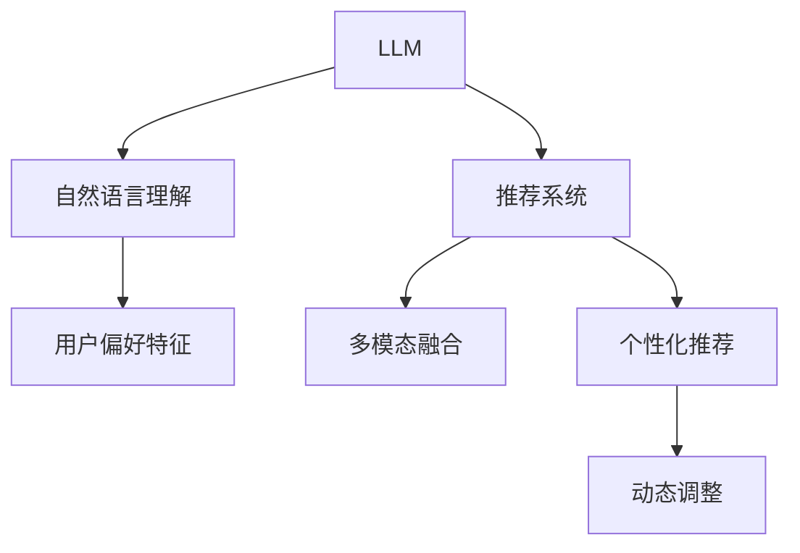

                 

# LLM在音视频推荐中的发展空间

## 1. 背景介绍

### 1.1 问题由来
在互联网的浪潮中，音视频内容已成为人们生活不可或缺的一部分。从在线音乐、视频点播到直播、短视频，多样化的音视频形式满足了用户的不同需求。然而，音视频内容的推荐问题也随之而来，如何精准推荐用户感兴趣的内容，提升用户满意度和平台黏性，成为音视频行业的重要课题。

大语言模型(LLM)作为近年来的热门技术，通过大规模数据训练，已经具备了强大的自然语言理解和生成能力。在音视频推荐领域，LLM展现了显著的应用前景。本文将系统探讨LLM在音视频推荐中的发展空间，分析其核心原理和操作步骤，并结合实际应用场景，给出具体建议。

### 1.2 问题核心关键点
LLM在音视频推荐中的应用，主要涉及以下几个关键点：

1. **自然语言理解与生成**：利用LLM强大的自然语言处理能力，分析用户评论、评分等文本数据，提取用户偏好特征。
2. **多模态融合**：结合音视频内容标签、用户历史行为等多样化的数据，构建更加丰富和准确的推荐模型。
3. **个性化推荐**：基于用户行为数据和LLM分析结果，为用户推荐最符合其兴趣的音视频内容。
4. **动态调整**：随着用户兴趣变化和平台数据更新，LLM可以实时调整推荐策略，实现精准推荐。

这些关键点共同构成了LLM在音视频推荐中的核心应用框架，为其带来了广阔的发展空间。

### 1.3 问题研究意义
LLM在音视频推荐中的应用，对于提升用户体验、增加平台黏性、驱动音视频内容消费具有重要意义：

1. **提升用户体验**：通过精准推荐，为用户提供满意的内容，增强用户体验，提升用户满意度。
2. **增加平台黏性**：通过个性化推荐，增加用户粘性，提升平台的用户留存率和活跃度。
3. **驱动内容消费**：通过精准推荐，提升音视频内容的点击率和消费量，增加平台的收入。
4. **创新推荐技术**：LLM的应用推动了音视频推荐技术的创新，加速了音视频推荐领域的智能化转型。

因此，研究LLM在音视频推荐中的应用，对于提升音视频平台的技术水平和市场竞争力具有重要价值。

## 2. 核心概念与联系

### 2.1 核心概念概述

为了更好地理解LLM在音视频推荐中的应用，本节将介绍几个关键概念及其相互关系：

- **大语言模型(LLM)**：以Transformer等架构为代表的，通过大规模数据预训练获得的强大自然语言处理能力。
- **推荐系统**：利用用户行为数据和内容特征，为用户提供个性化推荐的系统。
- **多模态融合**：将文本、音频、视频等多样化的数据源进行融合，构建更加全面的推荐模型。
- **个性化推荐**：根据用户的历史行为和当前兴趣，动态调整推荐策略，为用户提供最符合其需求的内容。
- **动态调整**：根据用户行为数据的变化，实时更新推荐策略，提升推荐的精准度。

这些概念之间存在着紧密的联系和相互影响。LLM通过强大的自然语言理解能力，可以从文本数据中提取用户偏好特征，结合多模态数据，构建个性化推荐模型。动态调整策略则保证了推荐系统的实时性和灵活性。

### 2.2 核心概念原理和架构的 Mermaid 流程图



这个流程图展示了LLM在音视频推荐中的应用逻辑：

1. **自然语言理解**：利用LLM从文本数据中提取用户偏好特征。
2. **多模态融合**：结合音视频内容标签和用户行为数据，构建推荐模型。
3. **个性化推荐**：根据用户历史行为和当前兴趣，动态调整推荐策略。
4. **动态调整**：实时更新推荐模型，提升推荐的精准度。

这些步骤共同构成了LLM在音视频推荐中的应用框架，为其带来了巨大的发展潜力。

## 3. 核心算法原理 & 具体操作步骤

### 3.1 算法原理概述

LLM在音视频推荐中的核心算法原理，主要涉及以下几个方面：

1. **自然语言理解**：利用LLM对用户评论、评分等文本数据进行情感分析、主题分类等，提取用户偏好特征。
2. **多模态融合**：结合音视频内容标签、用户历史行为、时间特征等多样化数据源，构建推荐模型。
3. **个性化推荐**：根据用户历史行为和当前兴趣，动态调整推荐策略，实现个性化推荐。
4. **动态调整**：利用用户实时行为数据，实时更新推荐模型，提升推荐精准度。

### 3.2 算法步骤详解

基于LLM的音视频推荐算法步骤主要包括：

**Step 1: 准备数据集和模型**

1. 收集音视频内容数据，包括用户评分、评论、标签等。
2. 构建用户行为数据集，包括观看历史、点赞记录、搜索记录等。
3. 选择预训练语言模型，如GPT、BERT等，作为推荐系统的基础。

**Step 2: 用户偏好特征提取**

1. 利用LLM对用户评论、评分等文本数据进行情感分析、主题分类等，提取用户偏好特征。
2. 将文本数据转化为数字向量，输入到LLM中，获得用户的情感倾向、兴趣主题等信息。

**Step 3: 多模态融合**

1. 将音视频内容标签、用户历史行为、时间特征等多样化数据源进行融合。
2. 利用LLM对音视频内容进行自动生成或摘要，提取关键信息。
3. 结合文本特征和内容特征，构建多模态推荐模型。

**Step 4: 个性化推荐**

1. 根据用户历史行为和当前兴趣，动态调整推荐策略。
2. 利用多模态融合结果，计算每个音视频内容对用户的兴趣度。
3. 根据兴趣度排序，推荐用户最感兴趣的内容。

**Step 5: 动态调整**

1. 实时收集用户行为数据，如观看时间、点赞记录等。
2. 根据实时数据动态更新推荐模型，提升推荐的精准度。
3. 定期重新训练LLM，适应新的数据分布。

### 3.3 算法优缺点

LLM在音视频推荐中的应用，具有以下优点：

1. **高效性**：利用LLM强大的自然语言处理能力，快速提取用户偏好特征。
2. **准确性**：LLM可以处理大规模文本数据，准确提取用户兴趣特征。
3. **灵活性**：结合多样化数据源，构建多模态推荐模型，提升推荐精准度。
4. **实时性**：利用动态调整策略，实现实时推荐，提升用户体验。

但同时也存在一些缺点：

1. **计算资源需求高**：预训练LLM需要大量计算资源，对于音视频推荐系统，计算资源消耗较大。
2. **模型训练复杂**：多模态融合和个性化推荐模型的训练较为复杂，需要精心设计和调整。
3. **数据依赖性强**：推荐效果高度依赖于用户行为数据和音视频内容数据的质量和数量。

### 3.4 算法应用领域

LLM在音视频推荐中的应用领域广泛，涵盖以下方面：

1. **视频点播推荐**：基于用户历史观看记录，推荐用户可能感兴趣的视频内容。
2. **音乐推荐**：利用用户听歌记录和评论，推荐相似风格的音乐。
3. **直播推荐**：结合用户在线时间和互动数据，推荐适合的直播内容。
4. **短视频推荐**：利用用户点赞和互动数据，推荐热门短视频。
5. **个性化广告推荐**：根据用户兴趣特征，推荐适合的广告内容。

这些应用领域展示了LLM在音视频推荐中的广泛适用性和巨大潜力。

## 4. 数学模型和公式 & 详细讲解 & 举例说明

### 4.1 数学模型构建

本节将使用数学语言对基于LLM的音视频推荐模型进行详细构建。

假设音视频推荐系统包含$m$个音视频内容，每个内容$i$有$n$个标签$l$，用户$u$有$k$个历史行为$d$，推荐模型为$f$，用户的兴趣度向量为$v_u$。

**用户偏好特征提取**

$$
v_u = f_{L}(L(u))
$$

其中，$L(u)$表示用户$u$的评论、评分等文本数据，$f_L$为LLM对文本数据进行情感分析和主题分类的模型。

**多模态融合**

$$
\hat{v}_i = f_{M}(i, v_u)
$$

其中，$f_M$为多模态融合模型，将音视频内容$i$与用户$u$的兴趣度向量$v_u$进行融合。

**个性化推荐**

$$
r_i = \sigma(f_{R}(\hat{v}_i, v_u))
$$

其中，$f_R$为个性化推荐模型，$\sigma$为激活函数。

**动态调整**

$$
v_u = v_u + \lambda f_{U}(v_u, d_t)
$$

其中，$f_U$为动态调整模型，$d_t$为用户最新的行为数据，$\lambda$为调整系数。

### 4.2 公式推导过程

以下我们以音乐推荐为例，推导基于LLM的推荐模型的公式。

假设音乐推荐系统包含$m$首音乐，每首音乐$i$有$n$个标签$l$，用户$u$有$k$个历史行为$d$。

**用户偏好特征提取**

$$
v_u = f_{L}(L(u))
$$

其中，$L(u)$表示用户$u$的听歌记录、评论等文本数据，$f_L$为LLM对文本数据进行情感分析和主题分类的模型。

**多模态融合**

$$
\hat{v}_i = f_{M}(i, v_u)
$$

其中，$f_M$为多模态融合模型，将音乐$i$与用户$u$的兴趣度向量$v_u$进行融合。

**个性化推荐**

$$
r_i = \sigma(f_{R}(\hat{v}_i, v_u))
$$

其中，$f_R$为个性化推荐模型，$\sigma$为激活函数。

**动态调整**

$$
v_u = v_u + \lambda f_{U}(v_u, d_t)
$$

其中，$f_U$为动态调整模型，$d_t$为用户最新的听歌记录，$\lambda$为调整系数。

### 4.3 案例分析与讲解

假设用户$u$的历史行为包括过去一周内听过的三首音乐，以及最近一个月的评分记录。利用LLM对文本数据进行分析，得到用户$u$的兴趣度向量$v_u$。然后，系统将用户的兴趣度向量与每首音乐的标签信息进行融合，得到每首音乐对用户$u$的兴趣度$\hat{v}_i$。根据兴趣度排序，系统推荐用户最感兴趣的音乐。同时，系统实时收集用户的最新行为数据，如听过的新歌曲，利用动态调整模型更新用户的兴趣度向量$v_u$，实现实时推荐。

## 5. 项目实践：代码实例和详细解释说明

### 5.1 开发环境搭建

在进行LLM在音视频推荐的应用开发前，我们需要准备好开发环境。以下是使用Python进行PyTorch开发的环境配置流程：

1. 安装Anaconda：从官网下载并安装Anaconda，用于创建独立的Python环境。

2. 创建并激活虚拟环境：
```bash
conda create -n pytorch-env python=3.8 
conda activate pytorch-env
```

3. 安装PyTorch：根据CUDA版本，从官网获取对应的安装命令。例如：
```bash
conda install pytorch torchvision torchaudio cudatoolkit=11.1 -c pytorch -c conda-forge
```

4. 安装Transformers库：
```bash
pip install transformers
```

5. 安装各类工具包：
```bash
pip install numpy pandas scikit-learn matplotlib tqdm jupyter notebook ipython
```

完成上述步骤后，即可在`pytorch-env`环境中开始开发。

### 5.2 源代码详细实现

下面以音乐推荐系统为例，给出使用Transformers库对BERT模型进行音乐推荐的应用开发代码实现。

首先，定义音乐推荐的数据处理函数：

```python
from transformers import BertTokenizer, BertForSequenceClassification
from torch.utils.data import Dataset
import torch

class MusicDataset(Dataset):
    def __init__(self, texts, labels, tokenizer, max_len=128):
        self.texts = texts
        self.labels = labels
        self.tokenizer = tokenizer
        self.max_len = max_len
        
    def __len__(self):
        return len(self.texts)
    
    def __getitem__(self, item):
        text = self.texts[item]
        label = self.labels[item]
        
        encoding = self.tokenizer(text, return_tensors='pt', max_length=self.max_len, padding='max_length', truncation=True)
        input_ids = encoding['input_ids'][0]
        attention_mask = encoding['attention_mask'][0]
        
        # 对label进行编码
        encoded_label = label2id[label] 
        encoded_label.extend([label2id['O']] * (self.max_len - len(encoded_label)))
        labels = torch.tensor(encoded_label, dtype=torch.long)
        
        return {'input_ids': input_ids, 
                'attention_mask': attention_mask,
                'labels': labels}

# 标签与id的映射
label2id = {'O': 0, 'Groove': 1, 'Electronic': 2, 'Pop': 3, 'Rock': 4, 'Jazz': 5}
id2label = {v: k for k, v in label2id.items()}

# 创建dataset
tokenizer = BertTokenizer.from_pretrained('bert-base-cased')

train_dataset = MusicDataset(train_texts, train_labels, tokenizer)
dev_dataset = MusicDataset(dev_texts, dev_labels, tokenizer)
test_dataset = MusicDataset(test_texts, test_labels, tokenizer)
```

然后，定义模型和优化器：

```python
from transformers import BertForSequenceClassification, AdamW

model = BertForSequenceClassification.from_pretrained('bert-base-cased', num_labels=len(label2id))

optimizer = AdamW(model.parameters(), lr=2e-5)
```

接着，定义训练和评估函数：

```python
from torch.utils.data import DataLoader
from tqdm import tqdm
from sklearn.metrics import classification_report

device = torch.device('cuda') if torch.cuda.is_available() else torch.device('cpu')
model.to(device)

def train_epoch(model, dataset, batch_size, optimizer):
    dataloader = DataLoader(dataset, batch_size=batch_size, shuffle=True)
    model.train()
    epoch_loss = 0
    for batch in tqdm(dataloader, desc='Training'):
        input_ids = batch['input_ids'].to(device)
        attention_mask = batch['attention_mask'].to(device)
        labels = batch['labels'].to(device)
        model.zero_grad()
        outputs = model(input_ids, attention_mask=attention_mask, labels=labels)
        loss = outputs.loss
        epoch_loss += loss.item()
        loss.backward()
        optimizer.step()
    return epoch_loss / len(dataloader)

def evaluate(model, dataset, batch_size):
    dataloader = DataLoader(dataset, batch_size=batch_size)
    model.eval()
    preds, labels = [], []
    with torch.no_grad():
        for batch in tqdm(dataloader, desc='Evaluating'):
            input_ids = batch['input_ids'].to(device)
            attention_mask = batch['attention_mask'].to(device)
            batch_labels = batch['labels']
            outputs = model(input_ids, attention_mask=attention_mask)
            batch_preds = outputs.logits.argmax(dim=2).to('cpu').tolist()
            batch_labels = batch_labels.to('cpu').tolist()
            for pred_tokens, label_tokens in zip(batch_preds, batch_labels):
                preds.append(pred_tokens[:len(label_tokens)])
                labels.append(label_tokens)
                
    print(classification_report(labels, preds))
```

最后，启动训练流程并在测试集上评估：

```python
epochs = 5
batch_size = 16

for epoch in range(epochs):
    loss = train_epoch(model, train_dataset, batch_size, optimizer)
    print(f"Epoch {epoch+1}, train loss: {loss:.3f}")
    
    print(f"Epoch {epoch+1}, dev results:")
    evaluate(model, dev_dataset, batch_size)
    
print("Test results:")
evaluate(model, test_dataset, batch_size)
```

以上就是使用PyTorch对BERT模型进行音乐推荐系统的完整代码实现。可以看到，得益于Transformers库的强大封装，我们可以用相对简洁的代码完成BERT模型的加载和推荐任务的开发。

### 5.3 代码解读与分析

让我们再详细解读一下关键代码的实现细节：

**MusicDataset类**：
- `__init__`方法：初始化文本、标签、分词器等关键组件。
- `__len__`方法：返回数据集的样本数量。
- `__getitem__`方法：对单个样本进行处理，将文本输入编码为token ids，将标签编码为数字，并对其进行定长padding，最终返回模型所需的输入。

**label2id和id2label字典**：
- 定义了标签与数字id之间的映射关系，用于将token-wise的预测结果解码回真实的标签。

**训练和评估函数**：
- 使用PyTorch的DataLoader对数据集进行批次化加载，供模型训练和推理使用。
- 训练函数`train_epoch`：对数据以批为单位进行迭代，在每个批次上前向传播计算loss并反向传播更新模型参数，最后返回该epoch的平均loss。
- 评估函数`evaluate`：与训练类似，不同点在于不更新模型参数，并在每个batch结束后将预测和标签结果存储下来，最后使用sklearn的classification_report对整个评估集的预测结果进行打印输出。

**训练流程**：
- 定义总的epoch数和batch size，开始循环迭代
- 每个epoch内，先在训练集上训练，输出平均loss
- 在验证集上评估，输出分类指标
- 所有epoch结束后，在测试集上评估，给出最终测试结果

可以看到，PyTorch配合Transformers库使得BERT微调的代码实现变得简洁高效。开发者可以将更多精力放在数据处理、模型改进等高层逻辑上，而不必过多关注底层的实现细节。

当然，工业级的系统实现还需考虑更多因素，如模型的保存和部署、超参数的自动搜索、更灵活的任务适配层等。但核心的推荐范式基本与此类似。

## 6. 实际应用场景

### 6.1 智能音乐点播推荐

智能音乐点播推荐是LLM在音视频推荐中的典型应用。智能音乐推荐系统可以根据用户听歌历史和评价，动态推荐相似风格或热门的新歌曲。

在技术实现上，可以收集用户的历史听歌记录和评分数据，将其作为监督数据，对预训练语言模型进行微调，使其能够从文本数据中提取用户偏好特征。然后，将音乐内容与用户偏好特征进行融合，构建多模态推荐模型，实现个性化的音乐推荐。

### 6.2 视频点播推荐

视频点播推荐是LLM在音视频推荐中的另一重要应用。系统可以根据用户观影历史和评分，推荐用户可能感兴趣的视频内容。

在技术实现上，可以收集用户的历史观影记录和评分数据，将其作为监督数据，对预训练语言模型进行微调。然后将视频内容与用户偏好特征进行融合，构建多模态推荐模型，实现个性化的视频推荐。

### 6.3 直播推荐

直播推荐利用LLM在自然语言处理方面的优势，可以根据用户在线时间和互动数据，推荐适合的直播内容。

在技术实现上，可以收集用户在线时间、互动数据等文本数据，对其进行情感分析、主题分类等，提取用户偏好特征。然后将直播内容与用户偏好特征进行融合，构建多模态推荐模型，实现个性化的直播推荐。

### 6.4 动态广告推荐

动态广告推荐利用LLM在自然语言处理方面的优势，可以根据用户兴趣特征，推荐适合的广告内容。

在技术实现上，可以收集用户的历史行为数据，包括浏览记录、点击记录等，利用LLM提取用户兴趣特征。然后将广告内容与用户兴趣特征进行融合，构建多模态推荐模型，实现个性化的广告推荐。

## 7. 工具和资源推荐

### 7.1 学习资源推荐

为了帮助开发者系统掌握LLM在音视频推荐中的应用，这里推荐一些优质的学习资源：

1. 《Transformers从原理到实践》系列博文：由大模型技术专家撰写，深入浅出地介绍了Transformer原理、BERT模型、推荐系统等前沿话题。

2. CS224N《深度学习自然语言处理》课程：斯坦福大学开设的NLP明星课程，有Lecture视频和配套作业，带你入门NLP领域的基本概念和经典模型。

3. 《Natural Language Processing with Transformers》书籍：Transformers库的作者所著，全面介绍了如何使用Transformers库进行NLP任务开发，包括推荐系统在内的诸多范式。

4. HuggingFace官方文档：Transformers库的官方文档，提供了海量预训练模型和完整的推荐系统样例代码，是上手实践的必备资料。

5. Kaggle推荐系统竞赛：涵盖多种类型的推荐系统竞赛，可以深入了解推荐系统在不同场景下的应用。

通过对这些资源的学习实践，相信你一定能够快速掌握LLM在音视频推荐中的应用，并用于解决实际的推荐问题。

### 7.2 开发工具推荐

高效的开发离不开优秀的工具支持。以下是几款用于LLM在音视频推荐开发的常用工具：

1. PyTorch：基于Python的开源深度学习框架，灵活动态的计算图，适合快速迭代研究。大部分预训练语言模型都有PyTorch版本的实现。

2. TensorFlow：由Google主导开发的开源深度学习框架，生产部署方便，适合大规模工程应用。同样有丰富的预训练语言模型资源。

3. Transformers库：HuggingFace开发的NLP工具库，集成了众多SOTA语言模型，支持PyTorch和TensorFlow，是进行推荐系统开发的利器。

4. Weights & Biases：模型训练的实验跟踪工具，可以记录和可视化模型训练过程中的各项指标，方便对比和调优。与主流深度学习框架无缝集成。

5. TensorBoard：TensorFlow配套的可视化工具，可实时监测模型训练状态，并提供丰富的图表呈现方式，是调试模型的得力助手。

6. Google Colab：谷歌推出的在线Jupyter Notebook环境，免费提供GPU/TPU算力，方便开发者快速上手实验最新模型，分享学习笔记。

合理利用这些工具，可以显著提升LLM在音视频推荐任务的开发效率，加快创新迭代的步伐。

### 7.3 相关论文推荐

LLM在音视频推荐中的应用源于学界的持续研究。以下是几篇奠基性的相关论文，推荐阅读：

1. Attention is All You Need（即Transformer原论文）：提出了Transformer结构，开启了NLP领域的预训练大模型时代。

2. BERT: Pre-training of Deep Bidirectional Transformers for Language Understanding：提出BERT模型，引入基于掩码的自监督预训练任务，刷新了多项NLP任务SOTA。

3. Recommendation Systems in Industry: A Survey on Systems and Approaches（推荐系统综述）：总结了推荐系统的历史和现状，介绍了多种推荐系统算法和技术。

4. Large-Scale Multi-Task Learning for Recommendation Systems：提出多任务学习的方法，在多个推荐任务上取得了显著效果。

5. Multi-Task Learning of Cross-Modal Embeddings for Recommendation（多模态推荐）：利用多模态数据融合，提升了推荐系统的性能。

6. Big Data Mining and Statistical Learning（大数据挖掘和统计学习）：介绍了多种大数据推荐算法和技术，涵盖了从协同过滤到深度学习等多种方法。

这些论文代表了大模型在音视频推荐领域的研究方向，通过学习这些前沿成果，可以帮助研究者把握学科前进方向，激发更多的创新灵感。

## 8. 总结：未来发展趋势与挑战

### 8.1 总结

本文对基于LLM的音视频推荐方法进行了全面系统的介绍。首先阐述了LLM在音视频推荐中的应用背景和意义，明确了LLM在音视频推荐中的核心应用框架，分析了其核心算法原理和操作步骤。其次，通过代码实例和详细解释说明，展示了LLM在音视频推荐中的实际应用。

LLM在音视频推荐中的应用，极大地提升了推荐系统的精准度和用户体验。通过强大的自然语言处理能力，LLM能够高效提取用户偏好特征，结合多模态数据源，构建个性化推荐模型，实现实时动态调整，极大地提升了推荐的精准度和时效性。

### 8.2 未来发展趋势

展望未来，LLM在音视频推荐中的应用将呈现以下几个发展趋势：

1. **多模态融合的深入**：未来推荐系统将更加注重多模态数据的融合，结合文本、音视频、社交数据等多样化信息，构建更加全面和精准的推荐模型。

2. **个性化推荐的强化**：随着用户兴趣的动态变化，推荐系统将更加注重个性化推荐，通过动态调整策略，实现实时精准推荐。

3. **动态调整的实时化**：未来推荐系统将更加注重实时调整，结合用户最新行为数据，动态更新推荐模型，提升推荐精度和时效性。

4. **跨领域应用的拓展**：LLM在音视频推荐中的应用将逐步扩展到其他领域，如金融、教育、医疗等，实现跨领域推荐。

5. **迁移学习的广泛应用**：利用LLM的预训练知识，实现跨领域迁移学习，提升推荐系统的泛化能力。

### 8.3 面临的挑战

尽管LLM在音视频推荐中的应用取得了显著效果，但仍面临一些挑战：

1. **计算资源消耗**：大规模预训练语言模型的计算资源需求较高，对于推荐系统来说，计算资源消耗较大。

2. **数据依赖性强**：推荐效果高度依赖于用户行为数据和音视频内容数据的质量和数量，数据获取成本较高。

3. **模型复杂度**：多模态融合和个性化推荐模型的训练较为复杂，需要精心设计和调整。

4. **实时性要求高**：实时动态调整推荐模型，需要高效的算法和硬件支持，实时性要求较高。

5. **用户隐私保护**：推荐系统需要处理大量用户数据，如何保护用户隐私，实现数据安全，是一个重要问题。

### 8.4 研究展望

面对LLM在音视频推荐中面临的挑战，未来的研究需要在以下几个方面寻求新的突破：

1. **计算资源优化**：开发更加高效的模型压缩和剪枝技术，优化模型结构，降低计算资源消耗。

2. **数据采集优化**：采用更加多样化和高质量的数据源，降低数据获取成本，提升推荐效果。

3. **模型简化与优化**：简化多模态融合和个性化推荐模型的结构，降低模型复杂度，提升训练效率。

4. **实时调整优化**：开发高效的实时调整算法，提升推荐系统的实时性和稳定性。

5. **用户隐私保护**：利用差分隐私等技术，保护用户隐私，实现数据安全。

这些研究方向将推动LLM在音视频推荐中的应用，提升推荐系统的精准度和用户体验，促进音视频行业的智能化转型。

## 9. 附录：常见问题与解答

**Q1：如何选择合适的预训练语言模型？**

A: 选择合适的预训练语言模型需要考虑多个因素，如模型的规模、任务的复杂度、数据的类型等。一般来说，规模较大的预训练语言模型能够处理更复杂的任务，但计算资源消耗也更大。因此，需要根据具体任务和计算资源进行权衡选择。

**Q2：预训练语言模型对推荐效果的影响？**

A: 预训练语言模型对推荐效果有显著影响。一个高质量的预训练语言模型可以更好地提取用户偏好特征，提升推荐系统的精准度和多样性。因此，选择合适的预训练语言模型，并进行微调，是提高推荐效果的重要手段。

**Q3：多模态融合中各模态的重要性？**

A: 在多模态融合中，各模态的重要性是不同的。文本模态通常包含用户情感、主题等信息，对用户偏好的理解尤为重要。音视频模态则包含内容特征和风格特征，对推荐系统的多样性和个性化有重要影响。社交模态则包含用户互动和兴趣等信息，对推荐系统的实时性和动态调整有重要影响。因此，多模态融合中，各模态的权重和融合方式需要根据具体任务进行设计。

**Q4：动态调整策略的实现？**

A: 动态调整策略的实现通常包括以下步骤：

1. 实时收集用户行为数据，如观看时间、点赞记录等。
2. 利用动态调整模型，更新用户兴趣度向量。
3. 根据更新后的兴趣度向量，重新计算每个音视频内容对用户的兴趣度。
4. 根据兴趣度排序，推荐用户最感兴趣的内容。

**Q5：如何在推荐系统中实现LLM？**

A: 在推荐系统中实现LLM，通常需要以下几个步骤：

1. 收集用户行为数据，包括观影记录、听歌记录等。
2. 利用预训练语言模型，提取用户偏好特征。
3. 构建多模态融合模型，将音视频内容与用户偏好特征进行融合。
4. 构建个性化推荐模型，根据用户历史行为和当前兴趣，动态调整推荐策略。
5. 实时收集用户行为数据，动态更新用户兴趣度向量，实现实时推荐。

---

作者：禅与计算机程序设计艺术 / Zen and the Art of Computer Programming

