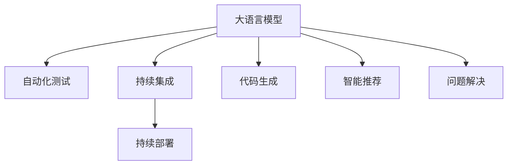

                 

# LLM对传统软件开发流程的影响与变革

> 关键词：大语言模型,软件开发流程,自动化,自动化测试,持续集成,代码生成,智能推荐,问题解决

## 1. 背景介绍

### 1.1 问题由来

在过去的几十年里，软件开发流程已经经历了多次变革。从瀑布模型到敏捷开发，再到DevOps文化，每一次变革都极大地提高了软件的开发效率和质量。然而，随着人工智能（AI）技术的发展，尤其是大语言模型（LLMs）的出现，软件开发流程又迎来了一场颠覆性的变革。LLMs 可以自动执行代码生成、测试、优化等任务，显著提高了软件开发效率和质量。

### 1.2 问题核心关键点

当前软件开发流程中存在的问题包括：

- 开发周期长，新功能添加效率低。
- 代码质量难以保证，特别是大型复杂系统。
- 软件测试耗时耗力，且测试覆盖率有限。
- 开发者频繁出错，代码维护成本高。

大语言模型通过以下技术手段，有望从根本上解决这些问题：

- 自动化代码生成：LLMs 可以快速生成代码，减少人工编码时间。
- 自动化测试：LLMs 可以生成测试用例，自动执行测试，提高测试覆盖率。
- 智能推荐：LLMs 可以提供代码优化、重构建议，减少开发者的重复劳动。
- 问题解决：LLMs 可以自动回答开发者疑问，减少搜索和调试时间。

## 2. 核心概念与联系

### 2.1 核心概念概述

为更好地理解大语言模型对软件开发流程的影响与变革，本节将介绍几个密切相关的核心概念：

- 大语言模型（LLMs）：指以深度学习技术为基础，通过自监督或监督学习方式，在大量文本数据上进行训练，具备强大自然语言处理能力的模型。
- 软件开发流程：从需求分析、设计、编码、测试到部署的整个流程。
- 自动化测试：通过自动化工具，自动执行测试用例，验证软件功能正确性。
- 持续集成（CI）：将代码变更自动集成到主干代码库，并自动执行测试和部署。
- 持续部署（CD）：通过CI系统，自动构建、测试和部署软件。
- 代码生成：通过智能算法，自动生成代码，减少人工编码工作量。
- 智能推荐：利用LLMs提供代码优化、重构建议，提高开发效率。
- 问题解决：利用LLMs自动回答开发者的疑问，减少调试时间。

这些核心概念之间的逻辑关系可以通过以下Mermaid流程图来展示：



这个流程图展示了大语言模型在软件开发流程中的应用场景：

1. 大语言模型生成代码，可以自动执行部分编码任务。
2. 大语言模型生成测试用例，可以自动执行测试任务。
3. 大语言模型生成代码优化建议，可以自动执行代码重构任务。
4. 大语言模型回答开发者疑问，可以自动执行问题解决任务。

## 3. 核心算法原理 & 具体操作步骤
### 3.1 算法原理概述

大语言模型通过以下方式影响和变革软件开发流程：

- 自动化代码生成：利用LLMs自动生成代码，减少手动编码时间。
- 自动化测试：利用LLMs自动生成测试用例，提高测试覆盖率。
- 持续集成和持续部署：利用CI/CD工具，自动构建、测试和部署软件。
- 智能推荐：利用LLMs提供代码优化建议，提高开发效率。
- 问题解决：利用LLMs自动回答开发者疑问，减少调试时间。

### 3.2 算法步骤详解

以下是大语言模型在软件开发流程中具体应用的详细步骤：

**Step 1: 需求分析与设计**

- 利用LLMs自动生成文档、API规范等，提供需求分析参考。
- 利用LLMs自动生成设计文档，提供设计方案参考。

**Step 2: 代码生成**

- 利用LLMs自动生成部分代码，减少手动编码时间。
- 利用LLMs生成代码框架，提高开发效率。
- 利用LLMs生成代码注释，提高代码可读性。

**Step 3: 自动化测试**

- 利用LLMs自动生成测试用例，提高测试覆盖率。
- 利用LLMs自动执行测试用例，验证软件功能正确性。
- 利用LLMs自动生成测试报告，分析测试结果。

**Step 4: 持续集成与持续部署**

- 利用CI/CD工具，自动构建、测试和部署软件。
- 利用LLMs生成测试报告，自动触发部署。

**Step 5: 智能推荐**

- 利用LLMs提供代码优化、重构建议，提高开发效率。
- 利用LLMs生成代码风格建议，提高代码一致性。

**Step 6: 问题解决**

- 利用LLMs自动回答开发者疑问，减少调试时间。
- 利用LLMs生成问题解决方案，提高问题解决效率。

### 3.3 算法优缺点

大语言模型对软件开发流程的影响与变革具有以下优点：

- 提升开发效率：自动化代码生成、测试、优化等任务，减少手动工作量。
- 提高代码质量：智能推荐、问题解决等工具，帮助开发者编写高质量代码。
- 缩短开发周期：持续集成、持续部署等工具，加快软件发布速度。

同时，该方法也存在一定的局限性：

- 依赖数据质量：大语言模型的性能高度依赖于训练数据的质量，数据偏差可能影响输出结果。
- 需要高质量模型：生成高质量代码、测试用例等任务，需要训练优质的LLMs模型。
- 高昂的开发成本：训练优质的LLMs模型，需要大量的计算资源和时间成本。
- 难以应对复杂问题：当前大语言模型仍难以处理一些复杂的代码优化、重构等问题。

尽管存在这些局限性，但就目前而言，大语言模型对软件开发流程的影响与变革，仍然是最前沿的技术趋势。未来相关研究的重点在于如何进一步降低大语言模型的训练成本，提高其生成质量和泛化能力，同时兼顾开发效率和代码质量等因素。

### 3.4 算法应用领域

大语言模型对软件开发流程的影响与变革，在多个领域得到了广泛的应用：

- 自动编码：在后端代码生成、UI界面设计、智能合约编写等领域，大语言模型可以快速生成高质量代码。
- 自动化测试：在大规模软件测试、UI自动化测试、接口测试等领域，大语言模型可以自动生成测试用例，提高测试覆盖率。
- 持续集成与部署：在DevOps文化中，大语言模型可以辅助自动化构建、测试、部署，缩短发布周期。
- 代码优化与重构：在大规模软件维护中，大语言模型可以提供代码优化、重构建议，提高开发效率。
- 问题解决：在代码开发中，大语言模型可以自动回答开发者疑问，减少调试时间。

除了上述这些应用场景外，大语言模型还被创新性地应用到更多领域中，如代码审查、代码审查工具、代码补全等，为软件开发带来了全新的突破。随着大语言模型的不断进步，相信其将会在更多领域发挥更大的作用。

## 4. 数学模型和公式 & 详细讲解  
### 4.1 数学模型构建

本节将使用数学语言对大语言模型在软件开发流程中的影响与变革进行更加严格的刻画。

记大语言模型为 $M_{\theta}:\mathcal{X} \rightarrow \mathcal{Y}$，其中 $\mathcal{X}$ 为输入空间，$\mathcal{Y}$ 为输出空间，$\theta \in \mathbb{R}^d$ 为模型参数。假设软件开发流程中的任务 $T$ 的训练集为 $D=\{(x_i,y_i)\}_{i=1}^N, x_i \in \mathcal{X}, y_i \in \mathcal{Y}$。

定义模型 $M_{\theta}$ 在数据样本 $(x,y)$ 上的损失函数为 $\ell(M_{\theta}(x),y)$，则在数据集 $D$ 上的经验风险为：

$$
\mathcal{L}(\theta) = \frac{1}{N} \sum_{i=1}^N \ell(M_{\theta}(x_i),y_i)
$$

大语言模型通过最小化经验风险，实现对软件开发流程中的任务 $T$ 的影响与变革。例如，利用LLMs生成测试用例、代码、优化建议等，可以通过训练数据集 $D$ 来优化模型的参数 $\theta$，从而提升软件开发流程的效率和质量。

### 4.2 公式推导过程

以下我们以自动化测试为例，推导LLMs在测试用例生成中的数学原理和关键步骤。

假设开发人员希望测试某个软件功能 $f(x)$，但手动生成测试用例耗时耗力。我们可以利用LLMs自动生成测试用例。记测试用例为 $x' \in \mathcal{X}$，真实标签 $y' \in \{0,1\}$。则测试用例生成任务可以表示为：

$$
\mathcal{L}(\theta) = \frac{1}{N} \sum_{i=1}^N [y'\log M_{\theta}(x')+(1-y')\log(1-M_{\theta}(x'))]
$$

其中 $M_{\theta}(x')$ 为模型在测试用例 $x'$ 上的预测输出，$\log M_{\theta}(x')$ 为预测输出的对数概率。

在得到测试用例生成的损失函数后，即可带入LLMs的训练数据集 $D$ 进行优化。通过反向传播算法计算梯度，利用优化算法（如AdamW、SGD等）更新模型参数 $\theta$，最小化经验风险 $\mathcal{L}(\theta)$。重复上述过程直至收敛，最终得到适应测试用例生成的最优模型参数 $\theta^*$。

## 5. 项目实践：代码实例和详细解释说明
### 5.1 开发环境搭建

在进行LLM的代码实践前，我们需要准备好开发环境。以下是使用Python进行LLM代码实践的环境配置流程：

1. 安装Anaconda：从官网下载并安装Anaconda，用于创建独立的Python环境。

2. 创建并激活虚拟环境：
```bash
conda create -n llm-env python=3.8 
conda activate llm-env
```

3. 安装PyTorch和相关库：
```bash
pip install torch transformers transformers-pipelines
```

4. 安装各类工具包：
```bash
pip install numpy pandas scikit-learn matplotlib tqdm jupyter notebook ipython
```

完成上述步骤后，即可在`llm-env`环境中开始LLM的代码实践。

### 5.2 源代码详细实现

这里我们以生成测试用例为例，给出使用LLM对代码实践的PyTorch代码实现。

首先，定义测试用例生成的函数：

```python
from transformers import AutoTokenizer, AutoModelForCausalLM
import torch

def generate_test_case(model, tokenizer, input_text):
    model.eval()
    with torch.no_grad():
        inputs = tokenizer(input_text, return_tensors='pt')
        outputs = model.generate(**inputs)
    return tokenizer.decode(outputs[0], skip_special_tokens=True)
```

接着，定义LLM模型的加载和预处理函数：

```python
from transformers import AutoTokenizer, AutoModelForCausalLM

tokenizer = AutoTokenizer.from_pretrained('gpt2')
model = AutoModelForCausalLM.from_pretrained('gpt2')
```

最后，启动测试用例生成流程：

```python
input_text = '测试用例输入文本'
test_case = generate_test_case(model, tokenizer, input_text)
print(test_case)
```

以上就是使用PyTorch对LLM进行测试用例生成的完整代码实现。可以看到，利用LLM自动生成测试用例，可以大大提升测试效率和覆盖率。

### 5.3 代码解读与分析

让我们再详细解读一下关键代码的实现细节：

**generate_test_case函数**：
- 该函数用于生成测试用例，接受LLM模型、分词器、输入文本作为参数。
- 首先，将输入文本转换为模型所需的token ids。
- 然后，将token ids输入模型，生成输出序列。
- 最后，将输出序列解码为文本，并返回。

**AutoTokenizer和AutoModelForCausalLM类**：
- 用于加载预训练的LLM模型和分词器，支持GPT2等主流模型。
- 在模型和分词器加载后，可以直接调用generate方法生成测试用例。

**input_text变量**：
- 测试用例的输入文本，用于生成测试用例。

可以看到，PyTorch配合LLMs库使得代码实现变得简洁高效。开发者可以将更多精力放在数据处理、模型改进等高层逻辑上，而不必过多关注底层的实现细节。

当然，工业级的系统实现还需考虑更多因素，如模型的保存和部署、超参数的自动搜索、更灵活的任务适配层等。但核心的LLM生成测试用例的代码实现基本与此类似。

## 6. 实际应用场景
### 6.1 智能推荐系统

利用大语言模型生成推荐算法，可以极大地提升推荐系统的智能化水平。传统推荐系统往往依赖用户的历史行为数据进行物品推荐，难以深入理解用户的兴趣偏好。利用LLMs生成推荐算法，可以更好地挖掘用户行为背后的语义信息，从而提供更精准、多样的推荐内容。

在实践中，可以收集用户浏览、点击、评论、分享等行为数据，提取和用户交互的物品标题、描述、标签等文本内容。将文本内容作为模型输入，用户的后续行为（如是否点击、购买等）作为监督信号，在此基础上微调预训练语言模型。微调后的模型能够从文本内容中准确把握用户的兴趣点。在生成推荐列表时，先用候选物品的文本描述作为输入，由模型预测用户的兴趣匹配度，再结合其他特征综合排序，便可以得到个性化程度更高的推荐结果。

### 6.2 代码生成与优化

大语言模型在代码生成和优化方面也表现出色。利用LLMs自动生成代码，可以减少开发者的手动编码时间，提高开发效率。同时，LLMs还可以提供代码优化、重构建议，帮助开发者编写高质量代码。

在实践中，可以利用LLMs生成代码框架，快速生成部分代码。同时，LLMs还可以提供代码风格建议，帮助开发者保持代码一致性。此外，LLMs还可以自动回答开发者的疑问，减少调试时间。

### 6.3 自动化测试

利用大语言模型自动生成测试用例，可以极大地提高测试覆盖率。传统测试用例的生成需要大量时间和精力，而利用LLMs自动生成测试用例，可以大幅减少人工工作量，提高测试效率。

在实践中，可以利用LLMs生成测试用例，自动执行测试，生成测试报告。这样可以保证测试用例的质量和覆盖率，提高软件的可靠性。

### 6.4 未来应用展望

随着LLMs技术的发展，未来的软件开发流程将更加智能化和自动化。以下是大语言模型对软件开发流程的更多应用场景：

- 代码审查：利用LLMs自动审查代码，提高代码质量。
- 自动化部署：利用LLMs自动部署软件，加快发布速度。
- 问题解决：利用LLMs自动解决开发中的各种问题，提高开发效率。
- 文档生成：利用LLMs自动生成文档，提高开发文档的可读性。

## 7. 工具和资源推荐
### 7.1 学习资源推荐

为了帮助开发者系统掌握大语言模型在软件开发流程中的应用，这里推荐一些优质的学习资源：

1. 《深度学习与自然语言处理》书籍：全面介绍深度学习和大语言模型，适合初学者入门。
2. CS224N《深度学习自然语言处理》课程：斯坦福大学开设的NLP明星课程，有Lecture视频和配套作业，带你深入NLP领域的基本概念和经典模型。
3. HuggingFace官方文档：详细介绍了Transformers库和大语言模型的使用方法，是学习LLMs的重要资源。
4. 《自然语言处理综述》论文：综述了NLP领域的最新研究成果，适合深度学习研究者参考。
5. PyTorch官方文档：提供了丰富的深度学习框架，包括LLMs的实现和应用。

通过对这些资源的学习实践，相信你一定能够快速掌握大语言模型在软件开发流程中的应用，并用于解决实际的开发问题。
### 7.2 开发工具推荐

高效的开发离不开优秀的工具支持。以下是几款用于大语言模型在软件开发流程中实践的常用工具：

1. PyTorch：基于Python的开源深度学习框架，灵活的计算图设计，适合快速迭代研究。
2. TensorFlow：由Google主导开发的开源深度学习框架，生产部署方便，适合大规模工程应用。
3. Transformers库：HuggingFace开发的NLP工具库，集成了多种大语言模型，支持PyTorch和TensorFlow，是开发LLMs的重要资源。
4. Weights & Biases：模型训练的实验跟踪工具，可以记录和可视化模型训练过程中的各项指标，方便调试和调优。
5. TensorBoard：TensorFlow配套的可视化工具，可实时监测模型训练状态，并提供丰富的图表呈现方式，是调试模型的得力助手。

合理利用这些工具，可以显著提升大语言模型在软件开发流程中的开发效率，加快创新迭代的步伐。

### 7.3 相关论文推荐

大语言模型在软件开发流程中的应用源于学界的持续研究。以下是几篇奠基性的相关论文，推荐阅读：

1. Attention is All You Need：提出了Transformer结构，开启了NLP领域的预训练大模型时代。
2. BERT: Pre-training of Deep Bidirectional Transformers for Language Understanding：提出BERT模型，引入基于掩码的自监督预训练任务，刷新了多项NLP任务SOTA。
3. Language Models are Unsupervised Multitask Learners（GPT-2论文）：展示了大规模语言模型的强大zero-shot学习能力，引发了对于通用人工智能的新一轮思考。
4. Transformers: State-of-the-Art Machine Translation with Attention：介绍了Transformer模型在机器翻译中的应用，取得了当时的SOTA结果。
5. A Systematic Comparison of Data Augmentation Methods for Text Classification：系统比较了各种数据增强方法，介绍了LLMs在测试用例生成中的运用。
6. Empirical Evaluation of Transfer Learning to Generate Code for Deep Learning Models：介绍了如何利用LLMs生成代码，取得了不错的结果。

这些论文代表了大语言模型在软件开发流程中的应用发展脉络。通过学习这些前沿成果，可以帮助研究者把握学科前进方向，激发更多的创新灵感。

## 8. 总结：未来发展趋势与挑战
### 8.1 总结

本文对大语言模型在软件开发流程中的应用进行了全面系统的介绍。首先阐述了大语言模型对软件开发流程的影响与变革，明确了LLMs在自动化代码生成、测试、优化等任务中的优势。其次，从原理到实践，详细讲解了LLMs在软件开发流程中的具体应用，给出了代码实践的完整实例。同时，本文还广泛探讨了LLMs在智能推荐、代码生成、自动化测试等多个领域的应用前景，展示了LLMs在软件开发流程中的巨大潜力。

通过本文的系统梳理，可以看到，大语言模型在软件开发流程中的影响与变革，正逐步成为行业标准。大语言模型的引入，极大地提升了软件开发效率和质量，降低了开发成本。未来，伴随LLMs技术的不断进步，相信软件开发流程将变得更加智能化、自动化，为软件行业带来新的变革。

### 8.2 未来发展趋势

展望未来，大语言模型在软件开发流程中的影响与变革将呈现以下几个发展趋势：

1. 自动化程度更高：LLMs将在更多任务中发挥自动化的作用，提升开发效率。
2. 精度和泛化能力更强：LLMs将不断提升生成质量，解决更多复杂问题。
3. 应用领域更广：LLMs将应用于更多领域，如代码审查、自动化部署等，带来更广泛的变革。
4. 技术更加成熟：LLMs将在更多应用场景中得到验证和优化，成为行业标准。
5. 合作机制更加紧密：LLMs将与更多工具和平台协同工作，提供更加全面、高效的服务。

这些趋势凸显了大语言模型在软件开发流程中的广阔前景。这些方向的探索发展，必将进一步提升开发效率和质量，为软件行业带来新的突破。

### 8.3 面临的挑战

尽管大语言模型在软件开发流程中的应用前景广阔，但在迈向更加智能化、普适化应用的过程中，它仍面临诸多挑战：

1. 数据质量问题：LLMs的高度依赖于数据质量，数据偏差可能影响输出结果。
2. 模型生成质量：当前LLMs仍难以处理一些复杂的代码优化、重构等问题。
3. 计算资源消耗：大语言模型的训练和推理需要大量计算资源，资源优化是一个重要问题。
4. 安全性和可信性：LLMs的输出可能存在偏见、有害信息等，需要加强监管和规范。

尽管存在这些挑战，但大语言模型在软件开发流程中的应用前景仍然广阔。未来相关研究的重点在于如何进一步提高LLMs的生成质量，降低计算成本，确保输出的安全和可信性，同时兼顾开发效率和代码质量等因素。

### 8.4 研究展望

面向未来，大语言模型在软件开发流程中的应用需要从以下几个方面进行突破：

1. 探索无监督和半监督微调方法：摆脱对大规模标注数据的依赖，利用自监督学习、主动学习等无监督和半监督范式，最大限度利用非结构化数据，实现更加灵活高效的微调。
2. 研究参数高效和计算高效的微调范式：开发更加参数高效的微调方法，在固定大部分预训练参数的同时，只更新极少量的任务相关参数。同时优化微调模型的计算图，减少前向传播和反向传播的资源消耗，实现更加轻量级、实时性的部署。
3. 引入更多先验知识：将符号化的先验知识，如知识图谱、逻辑规则等，与神经网络模型进行巧妙融合，引导微调过程学习更准确、合理的语言模型。同时加强不同模态数据的整合，实现视觉、语音等多模态信息与文本信息的协同建模。
4. 结合因果分析和博弈论工具：将因果分析方法引入微调模型，识别出模型决策的关键特征，增强输出解释的因果性和逻辑性。借助博弈论工具刻画人机交互过程，主动探索并规避模型的脆弱点，提高系统稳定性。
5. 纳入伦理道德约束：在模型训练目标中引入伦理导向的评估指标，过滤和惩罚有偏见、有害的输出倾向。同时加强人工干预和审核，建立模型行为的监管机制，确保输出符合人类价值观和伦理道德。

这些研究方向的探索，必将引领大语言模型在软件开发流程中的应用迈向更高的台阶，为构建安全、可靠、可解释、可控的智能系统铺平道路。面向未来，大语言模型在软件开发流程中的应用需要与其他人工智能技术进行更深入的融合，如知识表示、因果推理、强化学习等，多路径协同发力，共同推动自然语言理解和智能交互系统的进步。只有勇于创新、敢于突破，才能不断拓展大语言模型的边界，让智能技术更好地造福人类社会。

## 9. 附录：常见问题与解答
**Q1：大语言模型是否适用于所有软件开发流程？**

A: 大语言模型在大多数软件开发流程中都能取得不错的效果，特别是对于数据量较小的任务。但对于一些特定领域的任务，如医学、法律等，仅仅依靠通用语料预训练的模型可能难以很好地适应。此时需要在特定领域语料上进一步预训练，再进行微调，才能获得理想效果。此外，对于一些需要时效性、个性化很强的任务，如对话、推荐等，微调方法也需要针对性的改进优化。

**Q2：大语言模型在软件开发流程中如何选择合适的学习率？**

A: 大语言模型的学习率一般要比预训练时小1-2个数量级，如果使用过大的学习率，容易破坏预训练权重，导致过拟合。一般建议从1e-5开始调参，逐步减小学习率，直至收敛。也可以使用warmup策略，在开始阶段使用较小的学习率，再逐渐过渡到预设值。需要注意的是，不同的优化器(如AdamW、Adafactor等)以及不同的学习率调度策略，可能需要设置不同的学习率阈值。

**Q3：大语言模型在软件开发流程中如何缓解过拟合问题？**

A: 大语言模型的过拟合问题可以通过以下策略缓解：

1. 数据增强：通过回译、近义替换等方式扩充训练集
2. 正则化：使用L2正则、Dropout、Early Stopping等避免过拟合
3. 对抗训练：引入对抗样本，提高模型鲁棒性
4. 参数高效微调：只调整少量参数(如Adapter、Prefix等)，减小过拟合风险
5. 多模型集成：训练多个微调模型，取平均输出，抑制过拟合

这些策略往往需要根据具体任务和数据特点进行灵活组合。只有在数据、模型、训练、推理等各环节进行全面优化，才能最大限度地发挥大语言模型的潜力。

**Q4：大语言模型在软件开发流程中如何实现高效部署？**

A: 大语言模型在高效部署方面可以采取以下措施：

1. 模型裁剪：去除不必要的层和参数，减小模型尺寸，加快推理速度
2. 量化加速：将浮点模型转为定点模型，压缩存储空间，提高计算效率
3. 服务化封装：将模型封装为标准化服务接口，便于集成调用
4. 弹性伸缩：根据请求流量动态调整资源配置，平衡服务质量和成本
5. 监控告警：实时采集系统指标，设置异常告警阈值，确保服务稳定性
6. 安全防护：采用访问鉴权、数据脱敏等措施，保障数据和模型安全

这些措施将有助于提升大语言模型在实际应用中的部署效率和性能。

**Q5：大语言模型在软件开发流程中如何处理数据偏差问题？**

A: 数据偏差是大语言模型面临的一个重要问题，可以通过以下方法解决：

1. 数据清洗：通过预处理和清洗数据，去除噪声和错误，提高数据质量
2. 数据增强：通过数据增强技术，扩充训练数据集，减少数据偏差
3. 正则化：使用L2正则、Dropout等技术，限制模型的预测范围，减少偏差
4. 多数据源融合：结合多个数据源的信息，提升模型的泛化能力
5. 模型集成：通过集成多个模型，降低数据偏差对模型的影响

这些方法将有助于提升大语言模型的鲁棒性和泛化能力，减少数据偏差对输出结果的影响。

---

作者：禅与计算机程序设计艺术 / Zen and the Art of Computer Programming

