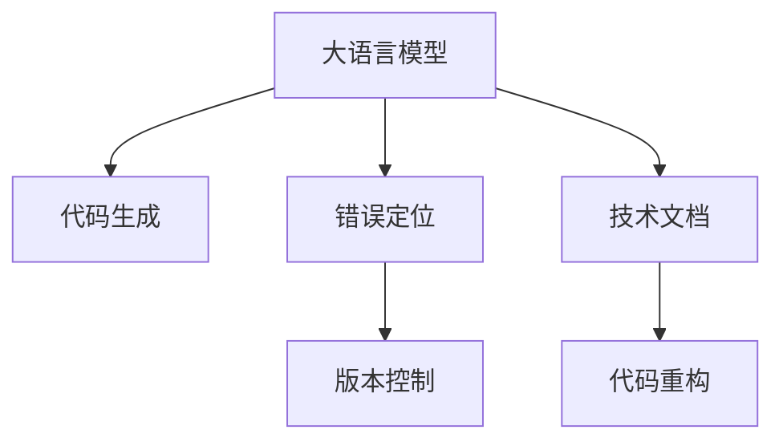

                 

# LLM对传统软件维护方法的挑战与改进

> 关键词：
大语言模型, 软件维护, 代码生成, 错误定位, 版本控制, 技术文档, 代码重构

## 1. 背景介绍

### 1.1 问题由来
随着软件开发的规模日益扩大，软件的维护变得越来越复杂和困难。在传统的软件开发过程中，代码的编写、测试、部署、维护等环节都需要依赖人工操作，效率低下，容易出现错误。而大语言模型（LLM）的出现，为软件维护提供了新的思路和方法，引起了业界的广泛关注。

LLM是一种基于深度学习的自然语言处理技术，通过在海量数据上进行预训练，能够自动生成高质量的自然语言文本，涵盖代码生成、错误定位、版本控制、技术文档、代码重构等多个方面。这些特性使得LLM在软件维护中具有巨大的潜力，但同时也带来了新的挑战和问题。

## 2. 核心概念与联系

### 2.1 核心概念概述

为更好地理解LLM在软件维护中的应用，本节将介绍几个关键概念：

- **大语言模型（LLM）**：以自回归或自编码模型为代表的大规模预训练语言模型。通过在海量数据上进行预训练，学习通用的语言表示，具备强大的语言理解和生成能力。
- **代码生成**：指通过自然语言描述或示例代码，自动生成完整的程序代码。LLM在代码生成中应用广泛，能够显著提高代码编写效率。
- **错误定位**：指通过自然语言描述或代码片段，定位程序中的错误，并提供相应的修正建议。LLM能够自动分析代码，发现错误并给出解决策略。
- **版本控制**：指通过自然语言描述，记录和管理软件项目的版本变更历史。LLM能够自动生成版本控制注释，帮助开发者跟踪变更信息。
- **技术文档**：指通过自然语言描述，生成软件项目的文档，包括代码注释、接口文档、使用手册等。LLM能够自动生成高质量的文档，提升用户体验。
- **代码重构**：指通过自然语言描述，重构代码结构，优化代码性能。LLM能够自动分析代码，提出重构建议，提升代码质量。

这些核心概念之间的逻辑关系可以通过以下Mermaid流程图来展示：



这个流程图展示了大语言模型在软件维护中的核心概念及其之间的关系：

1. 大语言模型通过预训练获得基础能力。
2. 在代码生成、错误定位、版本控制、技术文档、代码重构等多个方面应用。
3. 通过自然语言描述，实现自动化的软件维护。

## 3. 核心算法原理 & 具体操作步骤
### 3.1 算法原理概述

LLM在软件维护中的应用，本质上是将自然语言处理技术与软件维护过程结合，利用LLM自动化的特性，提升软件维护的效率和质量。其核心思想是：将自然语言描述转换为程序代码、错误定位、版本控制注释、技术文档、重构建议等，实现自动化和高效化的软件维护。

形式化地，假设输入的自然语言描述为 $L$，目标输出为 $O$，则目标是将 $L$ 转换为 $O$ 的过程。以代码生成为例，这个过程可以表示为：

$$
O = f(L)
$$

其中 $f$ 为代码生成函数，可以将自然语言描述 $L$ 自动转换为代码。

### 3.2 算法步骤详解

LLM在软件维护中的应用，通常包括以下几个关键步骤：

**Step 1: 输入数据准备**
- 收集自然语言描述，如代码注释、错误描述、版本变更说明、技术文档、重构建议等。
- 对输入数据进行预处理，如去除噪声、分词、标记等。

**Step 2: 模型训练和微调**
- 选择合适的预训练模型 $M_{\theta}$，如GPT、BERT等。
- 在预训练模型的基础上，使用自然语言描述进行微调，优化模型对特定任务的适应能力。

**Step 3: 模型预测**
- 将输入的自然语言描述输入模型，获取模型预测结果。
- 根据模型预测结果，生成相应的输出，如代码、错误定位、版本控制注释、技术文档、重构建议等。

**Step 4: 验证和优化**
- 在实际数据上验证模型的预测结果，评估模型的性能。
- 根据验证结果，优化模型的训练过程和参数设置。

**Step 5: 部署和集成**
- 将优化后的模型部署到实际环境中，实现自动化软件维护。
- 集成到软件开发工具链中，如IDE、版本控制系统、代码审查工具等。

以上是LLM在软件维护中应用的一般流程。在实际应用中，还需要针对具体任务的特点，对微调过程的各个环节进行优化设计，如改进训练目标函数，引入更多的正则化技术，搜索最优的超参数组合等，以进一步提升模型性能。

### 3.3 算法优缺点

LLM在软件维护中的应用，具有以下优点：
1. 高效快速。LLM能够在短时间内生成高质量的代码、文档、重构建议等，大幅提升软件维护的效率。
2. 准确性高。LLM能够自动分析代码，发现错误并给出解决方案，提升错误定位和代码重构的准确性。
3. 可扩展性强。LLM可以轻松应对不同类型的自然语言描述，如代码注释、错误描述、技术文档等，具有较强的泛化能力。

同时，该方法也存在一定的局限性：
1. 依赖高质量的输入数据。LLM的效果很大程度上取决于自然语言描述的质量和规范性，容易出现误导性输出。
2. 知识更新不足。LLM需要定期更新预训练数据和微调模型，才能保持最新的技术知识。
3. 可解释性不足。LLM的决策过程缺乏可解释性，难以对其推理逻辑进行分析和调试。
4. 需要持续维护。LLM需要不断优化和更新，才能适应软件项目的变化，维持其效果。

尽管存在这些局限性，但就目前而言，LLM在软件维护中的应用已经展现出了巨大的潜力，成为提升软件维护效率和质量的重要手段。

### 3.4 算法应用领域

LLM在软件维护中的应用，涵盖了代码生成、错误定位、版本控制、技术文档、代码重构等多个方面，具体如下：

- **代码生成**：自动生成代码，包括注释、接口、实现等，提升代码编写效率。
- **错误定位**：自动分析代码，定位错误并提供解决方案，提升代码质量和可维护性。
- **版本控制**：自动生成版本控制注释，记录和跟踪软件项目的变更历史，方便团队协作。
- **技术文档**：自动生成代码注释、接口文档、使用手册等，提升用户使用体验和可维护性。
- **代码重构**：自动分析代码，提出重构建议，提升代码性能和可维护性。

除了上述这些经典应用外，LLM还在软件项目管理、测试、部署等方面展现出强大的能力，为软件开发提供全方位的自动化支持。

## 4. 数学模型和公式 & 详细讲解 & 举例说明
### 4.1 数学模型构建

在LLM应用软件维护中，数学模型的构建是其核心内容之一。以代码生成为例，可以将自然语言描述 $L$ 转换为代码 $O$ 的过程表示为如下数学模型：

$$
O = \arg\max_{O \in \mathcal{O}} P(O|L)
$$

其中 $P(O|L)$ 为自然语言描述 $L$ 转换为代码 $O$ 的概率，可以通过模型训练获得。

### 4.2 公式推导过程

在代码生成中，自然语言描述 $L$ 转换为代码 $O$ 的过程可以通过条件概率模型实现：

$$
P(O|L) = \prod_{i=1}^n P(o_i|L)
$$

其中 $o_i$ 为代码序列的第 $i$ 个字符或代码单元，$P(o_i|L)$ 为自然语言描述 $L$ 转换为代码 $o_i$ 的概率。

在实际计算中，通常使用解码器对代码生成过程进行建模，通过循环神经网络（RNN）或变换器（Transformer）等模型实现。以Transformer为例，其编码器-解码器架构如图：


其中编码器将自然语言描述 $L$ 转换为一系列中间向量 $H$，解码器将这些中间向量转换为代码序列 $O$。

### 4.3 案例分析与讲解

以一个简单的代码生成例子来说明：

**输入**：
```python
# 计算数组的平均值
arr = [1, 2, 3, 4, 5]
avg = sum(arr) / len(arr)
```

**输出**：
```python
def calculate_average(arr):
    total = 0
    for i in arr:
        total += i
    return total / len(arr)
```

在这个例子中，自然语言描述通过预训练的模型转换为代码序列，其中：

- 自然语言描述中的关键信息，如“计算数组的平均值”、“数组”、“总和”、“平均值”等，被转换为代码序列中的函数定义、变量声明、循环等。
- 模型通过学习大量有标注的代码-自然语言描述对，自动生成代码。

通过LLM自动化的代码生成，开发者可以显著提高代码编写的效率和质量，减少重复劳动。

## 5. 项目实践：代码实例和详细解释说明
### 5.1 开发环境搭建

在进行LLM应用软件维护的开发过程中，需要先搭建好开发环境。以下是使用Python进行代码实现的环境配置流程：

1. 安装Anaconda：从官网下载并安装Anaconda，用于创建独立的Python环境。

2. 创建并激活虚拟环境：
```bash
conda create -n pytorch-env python=3.8 
conda activate pytorch-env
```

3. 安装PyTorch：根据CUDA版本，从官网获取对应的安装命令。例如：
```bash
conda install pytorch torchvision torchaudio cudatoolkit=11.1 -c pytorch -c conda-forge
```

4. 安装Transformer库：
```bash
pip install transformers
```

5. 安装各类工具包：
```bash
pip install numpy pandas scikit-learn matplotlib tqdm jupyter notebook ipython
```

完成上述步骤后，即可在`pytorch-env`环境中开始开发实践。

### 5.2 源代码详细实现

下面我们以代码生成为例，给出使用Transformers库进行代码生成的PyTorch代码实现。

首先，定义代码生成任务的数据处理函数：

```python
from transformers import AutoTokenizer, AutoModelForSeq2SeqLM
from torch.utils.data import Dataset
import torch

class CodeGenerationDataset(Dataset):
    def __init__(self, texts, targets):
        self.texts = texts
        self.targets = targets
        self.tokenizer = AutoTokenizer.from_pretrained('gpt2')
        self.model = AutoModelForSeq2SeqLM.from_pretrained('gpt2')
        
    def __len__(self):
        return len(self.texts)
    
    def __getitem__(self, item):
        text = self.texts[item]
        target = self.targets[item]
        
        encoding = self.tokenizer(text, return_tensors='pt', max_length=512, padding='max_length', truncation=True)
        input_ids = encoding['input_ids'][0]
        attention_mask = encoding['attention_mask'][0]
        return {'input_ids': input_ids, 
                'attention_mask': attention_mask,
                'target_ids': target}
```

然后，定义训练和评估函数：

```python
from torch.utils.data import DataLoader
from tqdm import tqdm
from sklearn.metrics import accuracy_score

device = torch.device('cuda') if torch.cuda.is_available() else torch.device('cpu')
model.to(device)

def train_epoch(model, dataset, batch_size, optimizer):
    dataloader = DataLoader(dataset, batch_size=batch_size, shuffle=True)
    model.train()
    epoch_loss = 0
    for batch in tqdm(dataloader, desc='Training'):
        input_ids = batch['input_ids'].to(device)
        attention_mask = batch['attention_mask'].to(device)
        target_ids = batch['target_ids'].to(device)
        model.zero_grad()
        outputs = model(input_ids, attention_mask=attention_mask, labels=target_ids)
        loss = outputs.loss
        epoch_loss += loss.item()
        loss.backward()
        optimizer.step()
    return epoch_loss / len(dataloader)

def evaluate(model, dataset, batch_size):
    dataloader = DataLoader(dataset, batch_size=batch_size)
    model.eval()
    preds, labels = [], []
    with torch.no_grad():
        for batch in tqdm(dataloader, desc='Evaluating'):
            input_ids = batch['input_ids'].to(device)
            attention_mask = batch['attention_mask'].to(device)
            target_ids = batch['target_ids']
            outputs = model(input_ids, attention_mask=attention_mask)
            pred_tokens = outputs.logits.argmax(dim=2).to('cpu').tolist()
            preds.append(pred_tokens[:len(target_ids)])
            labels.append(target_ids.to('cpu').tolist())
                
    return accuracy_score(labels, preds)
```

最后，启动训练流程并在测试集上评估：

```python
epochs = 5
batch_size = 16

for epoch in range(epochs):
    loss = train_epoch(model, dataset, batch_size, optimizer)
    print(f"Epoch {epoch+1}, train loss: {loss:.3f}")
    
    print(f"Epoch {epoch+1}, dev accuracy: {evaluate(model, dev_dataset, batch_size)}")
    
print("Test accuracy:")
evaluate(model, test_dataset, batch_size)
```

以上就是使用PyTorch对GPT-2进行代码生成的完整代码实现。可以看到，得益于Transformer库的强大封装，我们可以用相对简洁的代码完成代码生成的实践。

### 5.3 代码解读与分析

让我们再详细解读一下关键代码的实现细节：

**CodeGenerationDataset类**：
- `__init__`方法：初始化文本、标签、分词器等关键组件。
- `__len__`方法：返回数据集的样本数量。
- `__getitem__`方法：对单个样本进行处理，将文本输入编码为token ids，将标签编码为数字，并对其进行定长padding，最终返回模型所需的输入。

**模型训练和评估函数**：
- 使用PyTorch的DataLoader对数据集进行批次化加载，供模型训练和推理使用。
- 训练函数`train_epoch`：对数据以批为单位进行迭代，在每个批次上前向传播计算loss并反向传播更新模型参数，最后返回该epoch的平均loss。
- 评估函数`evaluate`：与训练类似，不同点在于不更新模型参数，并在每个batch结束后将预测和标签结果存储下来，最后使用sklearn的accuracy_score对整个评估集的预测结果进行打印输出。

**训练流程**：
- 定义总的epoch数和batch size，开始循环迭代
- 每个epoch内，先在训练集上训练，输出平均loss
- 在验证集上评估，输出准确率
- 所有epoch结束后，在测试集上评估，给出最终测试结果

可以看到，PyTorch配合Transformer库使得代码生成的代码实现变得简洁高效。开发者可以将更多精力放在数据处理、模型改进等高层逻辑上，而不必过多关注底层的实现细节。

当然，工业级的系统实现还需考虑更多因素，如模型的保存和部署、超参数的自动搜索、更灵活的任务适配层等。但核心的微调范式基本与此类似。

## 6. 实际应用场景
### 6.1 软件开发中的代码生成

在软件开发过程中，代码生成是提升开发效率的重要手段。传统的代码生成工具往往依赖模板和规则，难以处理复杂的逻辑和业务场景。而LLM的代码生成能力，能够自动分析自然语言描述，生成高质量的代码，大幅提升代码编写的效率和质量。

以开发一个电商网站后台管理系统为例，开发者可以使用LLM自动生成以下代码：

- 数据库模型定义：自动生成数据库表结构定义、字段类型、索引等。
- 控制器代码：自动生成控制器类、方法、路由等。
- 服务层代码：自动生成服务类、方法、业务逻辑等。
- 界面设计：自动生成前端页面、组件等。

通过LLM自动化的代码生成，开发者可以显著提高开发效率，减少重复劳动，降低开发成本。

### 6.2 代码重构

代码重构是软件维护中必不可少的一环，可以有效提升代码的可读性和可维护性。传统的代码重构往往依赖人工分析和手动修改，效率低下，容易出错。而LLM的代码重构能力，能够自动分析代码，提出重构建议，优化代码结构，提升代码性能。

以重构一个电商网站的后台管理系统为例，开发者可以使用LLM自动生成以下代码：

- 代码风格统一：自动生成代码风格统一的自动格式化工具。
- 模块化重构：自动生成模块化、解耦的代码结构。
- 性能优化：自动生成代码性能优化的建议。

通过LLM自动化的代码重构，开发者可以显著提高代码质量，降低维护成本，提升软件系统的可靠性和稳定性。

### 6.3 版本控制

版本控制是软件项目管理中不可或缺的一环，能够记录和管理软件项目的变更历史，方便团队协作和回溯问题。传统的版本控制工具依赖人工填写注释和说明，容易出错且难以维护。而LLM的版本控制能力，能够自动生成版本控制注释，记录和跟踪软件项目的变更历史。

以维护一个电商网站的后台管理系统为例，开发者可以使用LLM自动生成以下版本控制注释：

- 新功能添加：自动生成新功能添加的版本注释。
- 功能修改：自动生成功能修改的版本注释。
- 性能优化：自动生成性能优化的版本注释。

通过LLM自动化的版本控制，开发者可以显著提高版本管理的效率和质量，方便团队协作和回溯问题。

### 6.4 未来应用展望

随着LLM和微调方法的不断发展，在软件维护中的应用也将不断拓展，为软件开发提供更高效、智能的解决方案。

在智慧城市治理中，LLM可以自动生成城市事件监测、舆情分析、应急指挥等任务所需的技术文档和代码，提升城市治理的智能化水平。

在企业生产中，LLM可以自动生成生产设备的控制代码、维护手册、操作文档等，提升生产效率和设备稳定性。

在社会治理中，LLM可以自动生成法律文书、政策文档、社会事件分析报告等，提升社会治理的科学性和规范性。

此外，在教育、医疗、金融、交通等诸多领域，LLM也将展现出强大的应用潜力，为各行各业提供智能化的技术支持。

## 7. 工具和资源推荐
### 7.1 学习资源推荐

为了帮助开发者系统掌握LLM在软件维护中的应用，这里推荐一些优质的学习资源：

1. 《自然语言处理与深度学习》系列书籍：全面介绍了自然语言处理和深度学习的基本概念和前沿技术，是学习LLM的重要参考。

2. 《Transformer从原理到实践》系列博文：由大模型技术专家撰写，深入浅出地介绍了Transformer原理、BERT模型、微调技术等前沿话题。

3. 《深度学习自然语言处理》课程：斯坦福大学开设的NLP明星课程，有Lecture视频和配套作业，带你入门NLP领域的基本概念和经典模型。

4. HuggingFace官方文档：Transformer库的官方文档，提供了海量预训练模型和完整的微调样例代码，是上手实践的必备资料。

5. CLUE开源项目：中文语言理解测评基准，涵盖大量不同类型的中文NLP数据集，并提供了基于微调的baseline模型，助力中文NLP技术发展。

通过对这些资源的学习实践，相信你一定能够快速掌握LLM在软件维护中的应用，并用于解决实际的NLP问题。

### 7.2 开发工具推荐

高效的开发离不开优秀的工具支持。以下是几款用于LLM应用软件维护开发的常用工具：

1. PyTorch：基于Python的开源深度学习框架，灵活动态的计算图，适合快速迭代研究。大部分预训练语言模型都有PyTorch版本的实现。

2. TensorFlow：由Google主导开发的开源深度学习框架，生产部署方便，适合大规模工程应用。同样有丰富的预训练语言模型资源。

3. Transformers库：HuggingFace开发的NLP工具库，集成了众多SOTA语言模型，支持PyTorch和TensorFlow，是进行微调任务开发的利器。

4. Weights & Biases：模型训练的实验跟踪工具，可以记录和可视化模型训练过程中的各项指标，方便对比和调优。与主流深度学习框架无缝集成。

5. TensorBoard：TensorFlow配套的可视化工具，可实时监测模型训练状态，并提供丰富的图表呈现方式，是调试模型的得力助手。

6. Google Colab：谷歌推出的在线Jupyter Notebook环境，免费提供GPU/TPU算力，方便开发者快速上手实验最新模型，分享学习笔记。

合理利用这些工具，可以显著提升LLM应用软件维护任务的开发效率，加快创新迭代的步伐。

### 7.3 相关论文推荐

LLM在软件维护中的应用源于学界的持续研究。以下是几篇奠基性的相关论文，推荐阅读：

1. Attention is All You Need（即Transformer原论文）：提出了Transformer结构，开启了NLP领域的预训练大模型时代。

2. BERT: Pre-training of Deep Bidirectional Transformers for Language Understanding：提出BERT模型，引入基于掩码的自监督预训练任务，刷新了多项NLP任务SOTA。

3. Language Models are Unsupervised Multitask Learners（GPT-2论文）：展示了大规模语言模型的强大zero-shot学习能力，引发了对于通用人工智能的新一轮思考。

4. Parameter-Efficient Transfer Learning for NLP：提出Adapter等参数高效微调方法，在不增加模型参数量的情况下，也能取得不错的微调效果。

5. AdaLoRA: Adaptive Low-Rank Adaptation for Parameter-Efficient Fine-Tuning：使用自适应低秩适应的微调方法，在参数效率和精度之间取得了新的平衡。

6. Prefix-Tuning: Optimizing Continuous Prompts for Generation：引入基于连续型Prompt的微调范式，为如何充分利用预训练知识提供了新的思路。

这些论文代表了大语言模型在软件维护中的应用和发展脉络。通过学习这些前沿成果，可以帮助研究者把握学科前进方向，激发更多的创新灵感。

## 8. 总结：未来发展趋势与挑战
### 8.1 总结

本文对LLM在软件维护中的应用进行了全面系统的介绍。首先阐述了LLM和微调技术的研究背景和意义，明确了微调在拓展预训练模型应用、提升软件维护效率方面的独特价值。其次，从原理到实践，详细讲解了LLM在软件维护中的数学模型和关键步骤，给出了微调任务开发的完整代码实例。同时，本文还广泛探讨了LLM在软件维护中的应用场景，展示了LLM技术的广阔前景。

通过本文的系统梳理，可以看到，LLM在软件维护中的应用正在成为软件开发中的重要手段，极大地提升了软件开发的效率和质量。未来，伴随LLM和微调方法的持续演进，软件维护技术也将迎来新的突破，为软件开发带来更多创新和效率提升。

### 8.2 未来发展趋势

展望未来，LLM在软件维护中的应用将呈现以下几个发展趋势：

1. 模型规模持续增大。随着算力成本的下降和数据规模的扩张，预训练语言模型的参数量还将持续增长。超大规模语言模型蕴含的丰富语言知识，有望支撑更加复杂多变的软件维护任务。

2. 微调方法日趋多样。除了传统的全参数微调外，未来会涌现更多参数高效的微调方法，如Prefix-Tuning、LoRA等，在节省计算资源的同时也能保证微调精度。

3. 持续学习成为常态。随着数据分布的不断变化，LLM需要持续学习新知识以保持性能。如何在不遗忘原有知识的同时，高效吸收新样本信息，将成为重要的研究课题。

4. 标注样本需求降低。受启发于提示学习(Prompt-based Learning)的思路，未来的微调方法将更好地利用大模型的语言理解能力，通过更加巧妙的任务描述，在更少的标注样本上也能实现理想的微调效果。

5. 多模态微调崛起。当前的微调主要聚焦于纯文本数据，未来会进一步拓展到图像、视频、语音等多模态数据微调。多模态信息的融合，将显著提升语言模型对现实世界的理解和建模能力。

6. 模型通用性增强。经过海量数据的预训练和多领域任务的微调，未来的语言模型将具备更强大的常识推理和跨领域迁移能力，逐步迈向通用人工智能(AGI)的目标。

以上趋势凸显了LLM在软件维护中的广阔前景。这些方向的探索发展，必将进一步提升软件维护的效率和质量，为软件开发带来更多创新和效率提升。

### 8.3 面临的挑战

尽管LLM在软件维护中的应用已经取得了显著成效，但在迈向更加智能化、普适化应用的过程中，它仍面临着诸多挑战：

1. 标注成本瓶颈。尽管LLM能够自动生成高质量的代码和文档，但标注样本的获取仍是一个难题。对于特定领域或特定任务，获取高质量标注数据的需求依然存在。如何进一步降低微调对标注样本的依赖，将是一大难题。

2. 模型鲁棒性不足。当前LLM模型在面对域外数据时，泛化性能往往大打折扣。对于测试样本的微小扰动，LLM的预测也容易发生波动。如何提高LLM模型的鲁棒性，避免灾难性遗忘，还需要更多理论和实践的积累。

3. 推理效率有待提高。尽管LLM模型的精度高，但在实际部署时往往面临推理速度慢、内存占用大等效率问题。如何在保证性能的同时，简化模型结构，提升推理速度，优化资源占用，将是重要的优化方向。

4. 可解释性亟需加强。当前LLM的决策过程缺乏可解释性，难以对其推理逻辑进行分析和调试。对于医疗、金融等高风险应用，算法的可解释性和可审计性尤为重要。如何赋予LLM更强的可解释性，将是亟待攻克的难题。

5. 安全性有待保障。预训练语言模型难免会学习到有偏见、有害的信息，通过微调传递到下游任务，产生误导性、歧视性的输出，给实际应用带来安全隐患。如何从数据和算法层面消除模型偏见，避免恶意用途，确保输出的安全性，也将是重要的研究课题。

6. 知识整合能力不足。现有的LLM模型往往局限于任务内数据，难以灵活吸收和运用更广泛的先验知识。如何让LLM过程更好地与外部知识库、规则库等专家知识结合，形成更加全面、准确的信息整合能力，还有很大的想象空间。

正视LLM面临的这些挑战，积极应对并寻求突破，将是大语言模型微调走向成熟的必由之路。相信随着学界和产业界的共同努力，这些挑战终将一一被克服，LLM在软件维护中必将发挥更大的作用。

### 8.4 未来突破

面对LLM在软件维护中所面临的种种挑战，未来的研究需要在以下几个方面寻求新的突破：

1. 探索无监督和半监督微调方法。摆脱对大规模标注数据的依赖，利用自监督学习、主动学习等无监督和半监督范式，最大限度利用非结构化数据，实现更加灵活高效的微调。

2. 研究参数高效和计算高效的微调范式。开发更加参数高效的微调方法，在固定大部分预训练参数的同时，只更新极少量的任务相关参数。同时优化微调模型的计算图，减少前向传播和反向传播的资源消耗，实现更加轻量级、实时性的部署。

3. 融合因果和对比学习范式。通过引入因果推断和对比学习思想，增强LLM建立稳定因果关系的能力，学习更加普适、鲁棒的语言表征，从而提升模型泛化性和抗干扰能力。

4. 引入更多先验知识。将符号化的先验知识，如知识图谱、逻辑规则等，与神经网络模型进行巧妙融合，引导LLM过程学习更准确、合理的语言模型。同时加强不同模态数据的整合，实现视觉、语音等多模态信息与文本信息的协同建模。

5. 结合因果分析和博弈论工具。将因果分析方法引入LLM模型，识别出模型决策的关键特征，增强输出解释的因果性和逻辑性。借助博弈论工具刻画人机交互过程，主动探索并规避模型的脆弱点，提高系统稳定性。

6. 纳入伦理道德约束。在模型训练目标中引入伦理导向的评估指标，过滤和惩罚有偏见、有害的输出倾向。同时加强人工干预和审核，建立模型行为的监管机制，确保输出符合人类价值观和伦理道德。

这些研究方向的探索，必将引领LLM在软件维护中迈向更高的台阶，为软件开发提供更加高效、智能的解决方案。面向未来，LLM在软件维护中的研究还需要与其他人工智能技术进行更深入的融合，如知识表示、因果推理、强化学习等，多路径协同发力，共同推动软件开发技术的进步。

## 9. 附录：常见问题与解答

**Q1：LLM在软件维护中是否适用于所有任务？**

A: 尽管LLM在许多任务上取得了显著成效，但在一些特定领域或特定任务上，LLM的效果可能不理想。例如，对于需要高精度的代码生成和优化任务，LLM的输出可能存在一定的错误或不足。此外，对于一些复杂的多模态任务，LLM也面临挑战。因此，在使用LLM进行软件维护时，需要结合具体任务的特点和需求，评估其适用性和有效性。

**Q2：微调过程中如何选择合适的学习率？**

A: 微调的学习率一般要比预训练时小1-2个数量级，以避免破坏预训练权重。一般建议从1e-5开始调参，逐步减小学习率，直至收敛。也可以使用warmup策略，在开始阶段使用较小的学习率，再逐渐过渡到预设值。需要注意的是，不同的优化器(如AdamW、Adafactor等)以及不同的学习率调度策略，可能需要设置不同的学习率阈值。

**Q3：LLM在软件维护中的表现与传统方法相比如何？**

A: 相比于传统的手工编写、测试、优化等方法，LLM在软件维护中具有显著的效率提升和质量保证优势。通过自动化的代码生成、错误定位、版本控制、技术文档、代码重构等任务，LLM能够大幅度降低软件开发和维护的难度和成本，提高开发效率和软件质量。但是，对于一些复杂或特殊的任务，LLM的效果可能不如传统方法，需要结合具体任务的特点进行评估。

**Q4：如何缓解LLM在软件维护中的过拟合问题？**

A: 过拟合是LLM在软件维护中面临的主要挑战之一。可以通过以下方法缓解过拟合问题：
1. 数据增强：通过回译、近义替换等方式扩充训练集。
2. 正则化：使用L2正则、Dropout、Early Stopping等避免过拟合。
3. 对抗训练：引入对抗样本，提高模型鲁棒性。
4. 参数高效微调：只调整少量参数(如Adapter、Prefix等)，减小过拟合风险。
5. 多模型集成：训练多个微调模型，取平均输出，抑制过拟合。

这些策略往往需要根据具体任务和数据特点进行灵活组合。只有在数据、模型、训练、推理等各环节进行全面优化，才能最大限度地发挥LLM的潜力。

**Q5：LLM在软件维护中的效果如何评估？**

A: 评估LLM在软件维护中的效果通常从以下几个方面进行：
1. 代码质量：评估生成的代码是否符合规范、可读性、可维护性等指标。
2. 代码准确性：评估生成的代码是否正确、无错误。
3. 代码效率：评估生成的代码在执行速度、资源消耗等方面的表现。
4. 代码可读性：评估生成的代码是否易于理解、维护。
5. 代码可扩展性：评估生成的代码是否易于扩展、扩展后是否仍然符合规范。

评估效果时，通常使用定量指标（如代码质量评分、错误率、执行时间等）和定性指标（如代码可读性、可维护性、可扩展性等）相结合的方式，全面评估LLM的效果。

**Q6：LLM在软件维护中如何保证安全性？**

A: 在使用LLM进行软件维护时，保证安全性是一个重要的问题。可以通过以下方法保证安全性：
1. 数据安全：确保输入数据的安全性，避免敏感信息泄露。
2. 模型安全：定期更新模型，避免模型受到攻击或被篡改。
3. 算法安全：确保算法过程透明、可解释，避免算法的不可预测性。
4. 人员安全：加强人员管理，避免恶意行为。
5. 法律合规：确保系统符合相关法律法规和标准规范。

通过这些措施，可以有效提升LLM在软件维护中的安全性，保障系统的稳定性和可靠性。

---

作者：禅与计算机程序设计艺术 / Zen and the Art of Computer Programming

