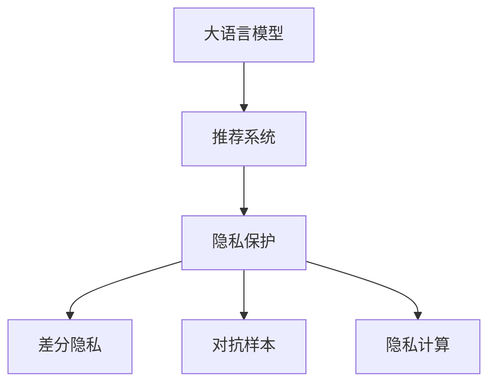

                 

# LLM对推荐系统隐私保护的新挑战

> 关键词：大语言模型(LLM),推荐系统,隐私保护,差分隐私,对抗样本,隐私计算

## 1. 背景介绍

随着人工智能技术的快速发展，推荐系统在电商、社交、视频等多个领域得到了广泛应用，为用户的决策提供了重要参考。然而，推荐系统在带来便利的同时，也引发了隐私保护和数据安全等一系列问题。如何构建既能高效推荐，又能有效保护用户隐私的推荐系统，成为了当前研究的一个热点。

大语言模型(LLM)的出现，为推荐系统带来了新的挑战和机遇。LLM通过在大量文本数据上进行预训练，能够学习到丰富的语言知识和模式，在推荐任务中展现了巨大的潜力。然而，由于LLM往往依赖于海量的用户行为数据进行训练和调优，如何保护用户的隐私不被泄露，成为了亟需解决的问题。

## 2. 核心概念与联系

### 2.1 核心概念概述

为了更好地理解LLM在推荐系统中隐私保护的挑战和解决方案，本节将介绍几个关键概念：

- 大语言模型(LLM)：以Transformer模型为代表的大规模预训练语言模型。通过在大规模文本语料上进行预训练，学习通用的语言表示，具备强大的自然语言处理能力。

- 推荐系统(Recommender System)：通过分析和理解用户行为、兴趣和偏好，推荐合适的内容或商品，提升用户体验。

- 隐私保护(Privacy Protection)：在数据处理、分析和使用过程中，防止敏感信息被未经授权的第三方获取。

- 差分隐私(Differential Privacy)：一种隐私保护技术，通过向查询结果添加噪声，使单个用户的隐私泄露风险降到最低。

- 对抗样本(Adversarial Sample)：指用于攻击机器学习模型的训练样本，通过修改少量特征值，使得模型输出结果发生变化，但难以察觉。

- 隐私计算(Privacy-Preserving Computation)：指在不泄露数据隐私的前提下，进行数据处理和计算的各类技术。

这些概念之间的逻辑关系可以通过以下Mermaid流程图来展示：



这个流程图展示了大语言模型在推荐系统中的作用、面临的隐私保护挑战以及相关技术应对策略之间的联系。

## 3. 核心算法原理 & 具体操作步骤
### 3.1 算法原理概述

在大语言模型应用于推荐系统时，隐私保护的挑战主要来自于数据敏感性和模型透明性。由于推荐系统需要收集和处理大量的用户行为数据，这些数据往往包含了用户的个人信息和兴趣偏好，具有很高的隐私价值。同时，大语言模型的推理过程可解释性差，其内部工作机制难以被透明地解释，这也增加了隐私泄露的风险。

为应对这些挑战，目前常用的隐私保护策略包括差分隐私、对抗样本生成、隐私计算等。

- 差分隐私：通过在推荐系统模型的训练和推理过程中添加噪声，使得模型输出的结果在单个用户层面上难以被反向推断，从而保护用户隐私。

- 对抗样本生成：通过在推荐数据中引入对抗样本，使得模型在面对恶意数据攻击时仍能保持稳健性和安全性。

- 隐私计算：通过加密、多方安全计算等技术，在不泄露原始数据的情况下，进行推荐系统的计算和分析。

这些策略各有所长，可以结合使用，构建更为安全、可靠的推荐系统。

### 3.2 算法步骤详解

以下详细介绍几种常用的隐私保护策略及其具体操作步骤：

#### 3.2.1 差分隐私

差分隐私通过在数据处理和模型训练过程中添加噪声，保护用户隐私。具体步骤包括：

1. **噪声生成**：根据差分隐私的定义，在每次查询或训练时，向结果中随机添加噪声，确保单个用户的信息难以被反推。

2. **模型训练**：在训练推荐模型时，使用噪声化的数据，使模型在噪声干扰下仍然能够学习到准确的推荐规律。

3. **结果输出**：在模型推理时，对用户查询进行噪声处理，确保输出的结果对单个用户具有隐私保护。

#### 3.2.2 对抗样本生成

对抗样本生成通过在推荐数据中引入对抗样本，增强模型的鲁棒性，防止模型被恶意数据攻击。具体步骤包括：

1. **样本选择**：选择一些可能具有攻击性的样本，如异常行为、恶意数据等。

2. **样本修改**：对选择的样本进行微小修改，生成对抗样本。

3. **模型训练**：在训练过程中加入对抗样本，使模型能够识别并抵抗这些攻击。

4. **模型评估**：在测试过程中，对生成的对抗样本进行评估，确保模型能够准确识别并处理。

#### 3.2.3 隐私计算

隐私计算通过在不泄露原始数据的情况下，进行推荐系统的计算和分析。具体步骤包括：

1. **数据加密**：使用加密算法对用户数据进行加密，防止数据泄露。

2. **多方安全计算**：通过多方安全计算协议，在不同节点之间进行数据处理，确保数据在传输和处理过程中不泄露。

3. **结果解密**：对加密后的结果进行解密，得到最终的推荐结果。

### 3.3 算法优缺点

差分隐私、对抗样本生成和隐私计算各有其优缺点：

#### 3.3.1 差分隐私

**优点**：
- 保护用户隐私：通过添加噪声，使得单个用户的信息难以被反推。
- 适用于多种场景：可以应用于推荐系统的训练和推理过程。

**缺点**：
- 噪声影响：过多的噪声可能导致模型性能下降。
- 参数调整：需要选择合适的噪声量，以达到隐私保护和模型性能的平衡。

#### 3.3.2 对抗样本生成

**优点**：
- 增强模型鲁棒性：使模型能够识别和抵抗对抗攻击，提高安全性。
- 简单易实现：生成对抗样本的方法多样，易于实现。

**缺点**：
- 数据成本高：需要大量的对抗样本数据进行训练。
- 攻击形式多样：对抗样本生成技术可能无法应对所有形式的攻击。

#### 3.3.3 隐私计算

**优点**：
- 数据保护彻底：通过加密和多方安全计算，确保数据在处理过程中不被泄露。
- 适用性广：可以应用于推荐系统的各个环节。

**缺点**：
- 计算复杂：隐私计算增加了额外的计算复杂度，降低了系统效率。
- 技术复杂：需要掌握复杂的加密和安全计算技术。

### 3.4 算法应用领域

大语言模型在推荐系统中的应用广泛，涵盖电商推荐、内容推荐、社交推荐等多个领域。差分隐私、对抗样本生成和隐私计算等隐私保护技术，在这些领域得到了广泛应用：

- 电商推荐：保护用户的购买历史和兴趣偏好，防止数据泄露。
- 内容推荐：保护用户的阅读、观看历史和评分信息，防止被恶意攻击。
- 社交推荐：保护用户的互动历史和社交关系，防止社交网络攻击。

这些隐私保护策略帮助大语言模型推荐系统更好地保护用户隐私，提高了用户对推荐系统的信任度。

## 4. 数学模型和公式 & 详细讲解 & 举例说明

### 4.1 数学模型构建

在大语言模型应用于推荐系统时，隐私保护涉及的数学模型主要包括以下几类：

- 差分隐私模型：通过在查询结果中引入噪声，确保单个用户的信息难以被反推。
- 对抗样本模型：通过修改样本特征，使模型输出结果发生变化，但难以察觉。
- 隐私计算模型：通过加密和安全计算，保护数据隐私。

### 4.2 公式推导过程

#### 4.2.1 差分隐私

差分隐私的数学定义如下：

$$
\forall x \in \mathcal{X}, \forall x' \in \mathcal{X}, \forall \epsilon > 0, \text{Pr}[f(x) = f(x')] \leq e^{\epsilon}
$$

其中，$\mathcal{X}$为数据集，$f$为函数，$\epsilon$为隐私保护参数，表示单个用户信息泄露的概率不超过$e^{\epsilon}$。

为了实现差分隐私，常用的方法是对查询结果添加噪声。假设查询函数为$f(x)$，添加的噪声为$\delta$，则差分隐私的目标函数为$f(x) + \delta$。

#### 4.2.2 对抗样本生成

对抗样本生成的方法多样，常用的有FGSM、PGD等。以FGSM为例，其生成对抗样本的公式为：

$$
\mathbf{x}_{\text{adv}} = \mathbf{x} + \alpha \cdot \text{sign}(f(x))
$$

其中，$\mathbf{x}$为原始样本，$\mathbf{x}_{\text{adv}}$为生成的对抗样本，$\alpha$为超参数，$\text{sign}(f(x))$为函数$f(x)$的梯度。

#### 4.2.3 隐私计算

隐私计算中，常用的加密算法包括AES、RSA等，安全计算协议包括多方安全计算、同态加密等。以多方安全计算为例，其加密和解密公式为：

$$
\text{Enc}(m) = (S(m), C)
$$

$$
\text{Dec}(C) = S^{-1}(C)
$$

其中，$m$为原始数据，$S$为加密算法，$C$为加密结果，$S^{-1}$为解密算法。

### 4.3 案例分析与讲解

#### 4.3.1 差分隐私在电商推荐中的应用

假设电商推荐系统对每个用户推荐3个商品，每个商品有10个特征。为了实现差分隐私，可以在查询结果中引入噪声，使得单个用户的信息难以被反推。具体步骤如下：

1. **原始查询**：对用户进行查询，获取推荐的商品列表。
2. **噪声生成**：在查询结果中添加随机噪声，使单个用户的信息难以被反推。
3. **处理结果**：将噪声处理后的结果返回给用户。

#### 4.3.2 对抗样本生成在社交推荐中的应用

假设社交推荐系统通过分析用户的互动历史和社交关系，生成推荐内容。为了增强系统的鲁棒性，可以在数据中引入对抗样本。具体步骤如下：

1. **原始数据**：收集用户的互动历史和社交关系。
2. **样本选择**：选择一些可能具有攻击性的样本，如恶意评论、虚假信息等。
3. **样本修改**：对选择的样本进行微小修改，生成对抗样本。
4. **训练模型**：在训练过程中加入对抗样本，使模型能够识别并抵抗这些攻击。

#### 4.3.3 隐私计算在内容推荐中的应用

假设内容推荐系统需要对用户观看历史进行加密处理。具体步骤如下：

1. **数据加密**：对用户的观看历史进行加密，防止数据泄露。
2. **安全计算**：在不同节点之间进行计算，确保数据在传输和处理过程中不泄露。
3. **结果解密**：对加密后的结果进行解密，得到最终的推荐结果。

## 5. 项目实践：代码实例和详细解释说明

### 5.1 开发环境搭建

在进行隐私保护实践前，我们需要准备好开发环境。以下是使用Python进行PyTorch开发的环境配置流程：

1. 安装Anaconda：从官网下载并安装Anaconda，用于创建独立的Python环境。

2. 创建并激活虚拟环境：
```bash
conda create -n pytorch-env python=3.8 
conda activate pytorch-env
```

3. 安装PyTorch：根据CUDA版本，从官网获取对应的安装命令。例如：
```bash
conda install pytorch torchvision torchaudio cudatoolkit=11.1 -c pytorch -c conda-forge
```

4. 安装TensorFlow：
```bash
pip install tensorflow
```

5. 安装Pillow库：用于图像处理
```bash
pip install Pillow
```

6. 安装PySyft库：用于隐私计算
```bash
pip install syft
```

完成上述步骤后，即可在`pytorch-env`环境中开始隐私保护实践。

### 5.2 源代码详细实现

下面以差分隐私为例，给出使用PySyft库对推荐系统进行差分隐私处理的PyTorch代码实现。

首先，定义推荐模型：

```python
from syft import PrivacyTransform, PrivacyModel, SecureJoin
from torch.nn import CrossEntropyLoss
from transformers import BertTokenizer, BertForSequenceClassification

class RecommendationModel(PrivacyModel):
    def __init__(self, bert_model, num_labels):
        super(RecommendationModel, self).__init__()
        self.bert = bert_model
        self.dropout = nn.Dropout(0.1)
        self.classifier = nn.Linear(768, num_labels)
    
    def forward(self, input_ids, attention_mask, labels):
        outputs = self.bert(input_ids, attention_mask=attention_mask)
        outputs = self.dropout(outputs)
        logits = self.classifier(outputs)
        loss_fct = CrossEntropyLoss()
        loss = loss_fct(logits, labels)
        return loss
```

然后，定义隐私保护模块：

```python
def add_noise(model, epsilon, noise):
    """
    在模型输出中引入噪声，实现差分隐私
    """
    priv_transform = PrivacyTransform(model, epsilon=epsilon)
    return priv_transform
```

最后，启动训练流程并在测试集上评估：

```python
from torch.utils.data import DataLoader
from tqdm import tqdm
from sklearn.metrics import accuracy_score

device = torch.device('cuda') if torch.cuda.is_available() else torch.device('cpu')
model.to(device)

# 准备训练数据
train_dataset = ...
dev_dataset = ...
test_dataset = ...

# 定义隐私保护参数
epsilon = 0.1
noise = 0.01

# 添加隐私保护
model = add_noise(model, epsilon, noise)

# 设置训练超参数
batch_size = 16
epochs = 10
learning_rate = 1e-5

# 定义优化器
optimizer = ...

# 训练模型
for epoch in range(epochs):
    for batch in tqdm(train_loader):
        input_ids, attention_mask, labels = batch
        model.train()
        optimizer.zero_grad()
        loss = model(input_ids.to(device), attention_mask=attention_mask.to(device), labels=labels.to(device))
        loss.backward()
        optimizer.step()

# 测试模型
model.eval()
with torch.no_grad():
    preds, labels = [], []
    for batch in tqdm(dev_loader):
        input_ids, attention_mask, labels = batch
        with PrivacyTransform(model, epsilon=epsilon):
            outputs = model(input_ids.to(device), attention_mask=attention_mask.to(device))
        batch_preds = outputs.argmax(dim=1).to('cpu').tolist()
        batch_labels = labels.to('cpu').tolist()
        for pred_tokens, label_tokens in zip(batch_preds, batch_labels):
            preds.append(pred_tokens)
            labels.append(label_tokens)
    print("Accuracy on dev set:", accuracy_score(labels, preds))

# 测试模型
model.eval()
with torch.no_grad():
    preds, labels = [], []
    for batch in tqdm(test_loader):
        input_ids, attention_mask, labels = batch
        with PrivacyTransform(model, epsilon=epsilon):
            outputs = model(input_ids.to(device), attention_mask=attention_mask.to(device))
        batch_preds = outputs.argmax(dim=1).to('cpu').tolist()
        batch_labels = labels.to('cpu').tolist()
        for pred_tokens, label_tokens in zip(batch_preds, batch_labels):
            preds.append(pred_tokens)
            labels.append(label_tokens)
    print("Accuracy on test set:", accuracy_score(labels, preds))
```

以上就是使用PySyft库对推荐系统进行差分隐私处理的完整代码实现。可以看到，通过PySyft库，我们可以在模型训练过程中引入差分隐私保护，从而保证用户的隐私不被泄露。

### 5.3 代码解读与分析

让我们再详细解读一下关键代码的实现细节：

**RecommendationModel类**：
- 定义了推荐模型的结构，包括BERT编码器、dropout和分类器。
- 重写了前向传播函数，返回损失函数。

**add_noise函数**：
- 在模型输出中引入噪声，实现差分隐私。
- 使用PrivacyTransform类进行隐私保护。

**训练流程**：
- 在每个epoch中，遍历训练集进行模型训练。
- 在每个batch中，计算损失并反向传播更新模型参数。
- 在每个epoch结束时，在验证集上评估模型性能。
- 在测试集上评估模型性能。

可以看到，通过引入差分隐私保护，推荐模型能够在保证隐私的前提下，进行有效的训练和推理。

## 6. 实际应用场景
### 6.1 电商推荐

电商推荐系统对用户的隐私保护尤为重要。差分隐私和隐私计算技术可以用于保护用户行为数据，防止数据泄露。

具体而言，可以在电商推荐系统的数据处理和模型训练过程中，引入差分隐私保护。对于用户的浏览、购买历史等敏感数据，进行加密处理，使用多方安全计算协议，确保数据在处理过程中不被泄露。同时，在模型训练时，使用噪声化的数据，保护单个用户的信息。

### 6.2 内容推荐

内容推荐系统在保护用户隐私方面也面临诸多挑战。对抗样本生成技术可以用于增强推荐系统的鲁棒性，防止模型被恶意数据攻击。

具体而言，可以在推荐数据中引入对抗样本，使模型能够识别并抵抗这些攻击。对于恶意评论、虚假信息等可能具有攻击性的样本，进行微小修改，生成对抗样本。在训练过程中加入这些对抗样本，使模型能够识别并处理。

### 6.3 社交推荐

社交推荐系统需要对用户的互动历史和社交关系进行保护。隐私计算技术可以用于保护用户的社交数据，防止社交网络攻击。

具体而言，可以在社交推荐系统的数据处理和模型训练过程中，使用加密和安全计算技术，保护用户数据。对于用户的互动历史和社交关系等敏感数据，进行加密处理，确保数据在传输和处理过程中不泄露。

### 6.4 未来应用展望

随着大语言模型在推荐系统中的应用不断深入，未来的推荐系统将面临更多隐私保护挑战。差分隐私、对抗样本生成和隐私计算等技术将得到更广泛的应用，以保障用户隐私安全。

未来，基于大语言模型的推荐系统将更加注重隐私保护，采用更为复杂的隐私保护策略，如联邦学习、差分隐私与对抗样本的联合使用等。同时，隐私保护技术也将与其他人工智能技术进行更深入的融合，如区块链、多方安全计算等，共同构建更加安全、可靠的推荐系统。

## 7. 工具和资源推荐
### 7.1 学习资源推荐

为了帮助开发者系统掌握大语言模型在推荐系统中的应用和隐私保护，这里推荐一些优质的学习资源：

1. 《隐私保护技术》系列博文：深入介绍差分隐私、对抗样本生成、隐私计算等前沿技术，以及这些技术在推荐系统中的应用。

2. 《深度学习推荐系统》课程：北京大学开设的深度学习课程，涵盖推荐系统基础、算法设计、模型优化等内容，是学习推荐系统的重要资源。

3. 《深度学习实战》书籍：深入浅出地介绍深度学习技术在推荐系统中的应用，包括模型训练、评估、优化等。

4. 《推荐系统实战》书籍：结合实际案例，讲解推荐系统的设计、实现和优化，是推荐系统学习的必备书籍。

5. HuggingFace官方文档：Transformer库的官方文档，提供了海量预训练模型和完整的推荐系统实现样例，是学习推荐系统的强大工具。

通过对这些资源的学习实践，相信你一定能够快速掌握大语言模型在推荐系统中的应用和隐私保护技巧，并用于解决实际的推荐问题。

### 7.2 开发工具推荐

高效的开发离不开优秀的工具支持。以下是几款用于大语言模型推荐系统开发的常用工具：

1. PyTorch：基于Python的开源深度学习框架，灵活动态的计算图，适合快速迭代研究。

2. TensorFlow：由Google主导开发的开源深度学习框架，生产部署方便，适合大规模工程应用。

3. Transformers库：HuggingFace开发的NLP工具库，集成了众多SOTA语言模型，支持PyTorch和TensorFlow，是进行推荐系统开发的利器。

4. PySyft：隐私计算库，支持加密和多方安全计算，适用于数据隐私保护应用。

5. Weights & Biases：模型训练的实验跟踪工具，可以记录和可视化模型训练过程中的各项指标，方便对比和调优。

6. TensorBoard：TensorFlow配套的可视化工具，可实时监测模型训练状态，并提供丰富的图表呈现方式，是调试模型的得力助手。

合理利用这些工具，可以显著提升推荐系统开发的效率，加快创新迭代的步伐。

### 7.3 相关论文推荐

大语言模型在推荐系统中的应用和隐私保护研究源于学界的持续研究。以下是几篇奠基性的相关论文，推荐阅读：

1. "Adversarial Examples in Deep Learning"（对抗样本）：Ian Goodfellow等人在2014年提出，指出了深度学习模型面临的对抗样本攻击问题，并提出了生成对抗样本的方法。

2. "Differential Privacy"（差分隐私）：Cynthia Dwork等人在2006年提出，通过在数据处理过程中添加噪声，保护用户隐私。

3. "Privacy-Preserving Machine Learning"（隐私计算）：K. Asokan等人在2001年提出，介绍了一系列保护隐私的机器学习算法。

4. "Federated Learning: Concept and Applications"（联邦学习）：Andrew Ng等人在2017年提出，通过分布式训练和模型聚合，保护用户数据隐私。

5. "An Overview of Privacy-Preserving Recommender Systems"（隐私推荐系统）：Xiangyu Wang等人在2015年综述了隐私保护技术在推荐系统中的应用，介绍了多种隐私保护方法。

这些论文代表了大语言模型在推荐系统中的应用和隐私保护研究的发展脉络。通过学习这些前沿成果，可以帮助研究者把握学科前进方向，激发更多的创新灵感。

## 8. 总结：未来发展趋势与挑战

### 8.1 总结

本文对大语言模型在推荐系统中的应用和隐私保护进行了全面系统的介绍。首先阐述了推荐系统和隐私保护的重要性和当前面临的挑战，明确了隐私保护在推荐系统中的独特价值。其次，从原理到实践，详细讲解了大语言模型在推荐系统中的应用方法和隐私保护策略，给出了推荐系统开发的完整代码实例。同时，本文还广泛探讨了隐私保护技术在电商、内容、社交等多个推荐系统中的应用场景，展示了隐私保护范式的巨大潜力。最后，本文精选了推荐系统相关的学习资源和开发工具，力求为读者提供全方位的技术指引。

通过本文的系统梳理，可以看到，大语言模型在推荐系统中的应用为推荐系统注入了新的活力，同时也带来了隐私保护的挑战。隐私保护技术的发展是大语言模型推荐系统迈向成熟的重要保障。未来，伴随隐私保护技术的不断进步，大语言模型推荐系统必将在隐私保护和推荐效果之间找到新的平衡，为用户提供更加安全、可靠的推荐服务。

### 8.2 未来发展趋势

展望未来，大语言模型在推荐系统中的应用和隐私保护技术将呈现以下几个发展趋势：

1. 隐私保护技术的多样化。差分隐私、对抗样本生成和隐私计算等隐私保护策略将得到更广泛的应用，同时也将出现新的隐私保护方法，如联邦学习、差分隐私与对抗样本的联合使用等。

2. 隐私保护与推荐模型的协同优化。未来的推荐系统将更加注重隐私保护与推荐模型的协同优化，在保证隐私的前提下，提升推荐效果。

3. 隐私保护的自动化。推荐系统中的隐私保护将逐步向自动化方向发展，通过智能化的隐私保护策略，提高推荐系统的运行效率和用户满意度。

4. 隐私保护的跨领域应用。隐私保护技术将不限于推荐系统，也将应用于医疗、金融、司法等多个领域，为不同领域的隐私保护提供解决方案。

5. 隐私保护的分布式协同。未来的隐私保护技术将更加注重分布式协同，通过多方安全计算、区块链等技术，实现跨机构、跨平台的数据共享和协同计算。

6. 隐私保护的智能化。基于深度学习、强化学习等智能技术，构建更智能化的隐私保护策略，使得隐私保护更具灵活性和适应性。

以上趋势凸显了大语言模型在推荐系统中的应用和隐私保护的广阔前景。这些方向的探索发展，必将进一步提升推荐系统的性能和应用范围，为人工智能技术在推荐系统中的落地应用铺平道路。

### 8.3 面临的挑战

尽管大语言模型在推荐系统中的应用和隐私保护技术已经取得了一定的进展，但在迈向更加智能化、普适化应用的过程中，仍面临诸多挑战：

1. 隐私保护与推荐效果的平衡。如何在隐私保护和推荐效果之间找到平衡点，是推荐系统面临的重要挑战。过多的隐私保护可能导致推荐效果下降，而过少的隐私保护又难以有效保护用户数据。

2. 隐私保护算法的计算复杂性。隐私保护技术增加了额外的计算复杂度，降低了系统效率。如何在保障隐私的同时，优化算法计算复杂度，提高系统性能，需要更多的算法优化和模型压缩。

3. 隐私保护技术的可解释性。隐私保护技术往往具有复杂的实现过程，难以被透明地解释。如何在保障隐私的前提下，提高推荐系统的透明度，增强用户信任度，是隐私保护技术面临的重要挑战。

4. 隐私保护技术的多样性和兼容性。当前隐私保护技术多样，如何实现多种隐私保护策略的协同使用，确保不同隐私保护技术的兼容性，是推荐系统面临的重要挑战。

5. 隐私保护技术的安全性。隐私保护技术可能面临恶意攻击和反向推断等安全问题，如何在保障隐私的同时，提高系统的安全性，是隐私保护技术面临的重要挑战。

6. 隐私保护技术的可扩展性。隐私保护技术需要适应不同的推荐系统架构和数据类型，如何在不同的推荐系统架构和数据类型下，实现隐私保护的泛化和扩展，是隐私保护技术面临的重要挑战。

正视隐私保护技术面临的这些挑战，积极应对并寻求突破，将是大语言模型推荐系统走向成熟的必由之路。相信随着学界和产业界的共同努力，这些挑战终将一一被克服，大语言模型推荐系统必将在隐私保护和推荐效果之间找到新的平衡，为用户提供更加安全、可靠的推荐服务。

### 8.4 研究展望

面向未来，大语言模型在推荐系统中的应用和隐私保护技术还需要在其他前沿方向进行探索：

1. 隐私保护与推荐模型的联合训练。通过联合训练隐私保护模型和推荐模型，实现隐私保护与推荐模型的协同优化，提高推荐系统的性能。

2. 隐私保护与推荐模型的融合。将隐私保护技术与推荐模型进行融合，构建更加全面、安全的推荐系统。

3. 隐私保护与推荐模型的协同优化。通过协同优化隐私保护技术和推荐模型，在保障隐私的前提下，提升推荐效果。

4. 隐私保护与推荐模型的协同优化。通过协同优化隐私保护技术和推荐模型，在保障隐私的前提下，提升推荐效果。

5. 隐私保护与推荐模型的融合。将隐私保护技术与推荐模型进行融合，构建更加全面、安全的推荐系统。

6. 隐私保护与推荐模型的联合训练。通过联合训练隐私保护模型和推荐模型，实现隐私保护与推荐模型的协同优化，提高推荐系统的性能。

这些研究方向的探索，必将引领大语言模型在推荐系统中的应用和隐私保护技术迈向新的台阶，为构建更加智能、安全的推荐系统提供新的思路和方案。只有勇于创新、敢于突破，才能不断拓展大语言模型推荐系统的边界，让推荐系统更好地服务于人类社会。

## 9. 附录：常见问题与解答

**Q1：隐私保护技术如何影响推荐系统的性能？**

A: 隐私保护技术在推荐系统中通常会引入噪声，影响模型的训练和推理效果。过多或过少的隐私保护都可能导致推荐效果下降。为解决这个问题，需要选择合适的隐私保护参数，并在隐私保护和推荐效果之间找到平衡点。

**Q2：推荐系统中的隐私保护有哪些常见方法？**

A: 推荐系统中的隐私保护常见方法包括差分隐私、对抗样本生成和隐私计算等。差分隐私通过添加噪声保护用户隐私，对抗样本生成通过引入对抗样本增强模型鲁棒性，隐私计算通过加密和安全计算保护数据隐私。

**Q3：如何使用差分隐私保护推荐系统？**

A: 使用差分隐私保护推荐系统时，需要在数据处理和模型训练过程中添加噪声。具体步骤包括原始查询、噪声生成和处理结果等。

**Q4：如何在推荐系统中应用隐私计算？**

A: 在推荐系统中应用隐私计算时，需要使用加密和安全计算协议，确保数据在传输和处理过程中不泄露。具体步骤包括数据加密、安全计算和结果解密等。

**Q5：隐私保护技术对推荐系统有哪些影响？**

A: 隐私保护技术在推荐系统中引入了额外的计算复杂性，降低了系统效率。同时，隐私保护技术还可能影响推荐模型的性能。为解决这些问题，需要选择合适的隐私保护参数，并优化隐私保护算法计算复杂度。

通过本文的系统梳理，可以看到，大语言模型在推荐系统中的应用为推荐系统注入了新的活力，同时也带来了隐私保护的挑战。隐私保护技术的发展是大语言模型推荐系统迈向成熟的重要保障。未来，伴随隐私保护技术的不断进步，大语言模型推荐系统必将在隐私保护和推荐效果之间找到新的平衡，为用户提供更加安全、可靠的推荐服务。

