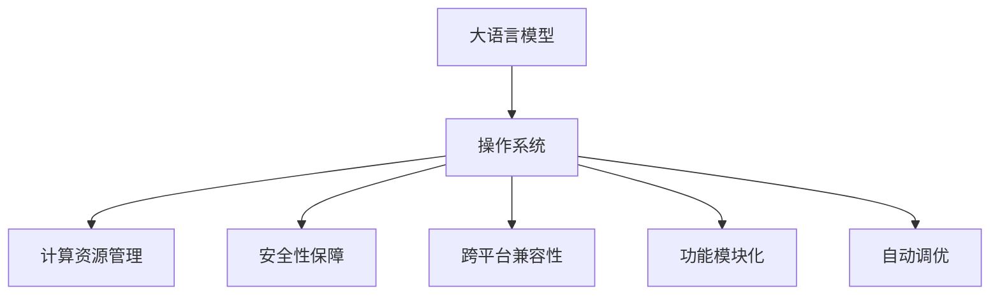
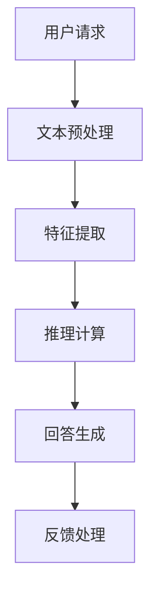

                 

# LLM操作系统：概念与必要性

> 关键词：
> 大语言模型,操作系统,操作系统概念,必要性,语言模型,人工智能,计算,语言,模型

## 1. 背景介绍

### 1.1 问题由来
在人工智能(AI)领域，语言模型(Language Model)已经成为构建各种自然语言处理(NLP)任务的核心技术。自深度学习技术兴起以来，基于神经网络的预训练语言模型，如BERT、GPT等，在自然语言理解与生成上取得了突破性的进展。但现有的语言模型仍存在诸多局限性，例如模型推理依赖于大规模训练数据、泛化能力有限、推理效率低下、模型安全性难以保障等。

为克服这些问题，一种新的构想应运而生：构建“语言模型操作系统”(Language Model Operating System, LLM OS)。LLM OS将大语言模型看作计算系统的操作系统，通过系统设计，提升语言模型的计算效率、泛化能力和安全性，使其成为更加灵活、高效、可靠的语言计算平台。

### 1.2 问题核心关键点
LLM OS的核心在于将大语言模型和操作系统设计思想相结合，构建一个能够对大语言模型进行高效、灵活管理的计算系统。其主要目标包括：

1. **计算资源管理**：提升模型推理速度，优化模型资源使用，提升计算效率。
2. **安全性保障**：增强模型鲁棒性，防止模型被恶意攻击或滥用。
3. **跨平台兼容性**：使模型能够在不同的硬件、软件和应用场景下实现无缝对接。
4. **功能模块化**：将模型功能划分为多个模块，便于维护和扩展。
5. **自动调优**：根据应用需求和性能反馈，自动调整模型参数和架构，提升性能。

## 2. 核心概念与联系

### 2.1 核心概念概述

为了更好地理解LLM OS的构想，我们先明确几个核心概念：

- **大语言模型(Large Language Model, LLM)**：如BERT、GPT等，通过在大规模文本数据上进行预训练，学习到丰富的语言表示和理解能力。

- **操作系统(OS)**：一种系统软件，负责管理计算系统的硬件和软件资源，提供用户与硬件交互的接口，实现进程管理、内存管理、文件系统等功能。

- **计算资源管理**：指对计算系统的CPU、内存、存储等资源进行优化管理，提升系统性能。

- **安全性保障**：指通过技术手段，防止计算系统被恶意攻击或滥用，确保计算过程的安全性。

- **跨平台兼容性**：指计算系统能够在不同的硬件、软件和网络环境下，实现无缝对接和高效运行。

- **功能模块化**：指将计算系统的功能划分为多个独立的模块，便于维护和扩展。

- **自动调优**：指根据系统性能反馈，动态调整计算系统的参数和架构，提升系统性能。

这些概念之间的联系可以通过以下Mermaid流程图展示：



这个流程图展示了LLM OS的主要组件和它们之间的关系：

1. 大语言模型是LLM OS的基础计算资源。
2. 操作系统对计算资源进行管理，提供系统接口。
3. 计算资源管理优化系统性能，确保高效运行。
4. 安全性保障确保系统安全，防止滥用。
5. 跨平台兼容性保证系统在各种环境下都能运行。
6. 功能模块化提升系统可维护性和扩展性。
7. 自动调优动态调整系统参数，提升性能。

这些概念共同构成了LLM OS的框架，使其能够高效、灵活地管理大语言模型，提升其性能和安全性。

## 3. 核心算法原理 & 具体操作步骤
### 3.1 算法原理概述

LLM OS的核心算法原理基于操作系统的设计思想，通过系统管理和服务层，优化大语言模型的运行效率、安全性、兼容性和可扩展性。其核心流程如下：

1. **计算资源管理**：利用虚拟化技术，将大语言模型运行在虚拟计算环境（Virtual Computing Environment, VCE）中，实现资源隔离和共享。通过资源调度算法，动态调整计算资源分配，提升推理速度和资源利用率。

2. **安全性保障**：引入可信计算技术，构建安全沙箱(Sandbox)，限制模型的行为和访问权限。使用差分隐私和对抗训练等技术，增强模型的鲁棒性和抗攻击能力。

3. **跨平台兼容性**：利用容器化技术，将大语言模型封装为容器镜像，实现跨平台部署和运行。通过标准化的接口，在不同硬件和软件环境中保持一致性。

4. **功能模块化**：将大语言模型分为多个模块，如文本预处理、特征提取、推理计算等。每个模块独立开发、测试和维护，提升系统的可扩展性和可维护性。

5. **自动调优**：使用机器学习算法，根据应用场景和性能反馈，自动调整模型参数和架构。通过超参数优化算法，找到最优的模型配置，提升性能。

### 3.2 算法步骤详解

1. **设计计算资源管理机制**：
   - 构建虚拟计算环境(VCE)，隔离不同模型的资源使用。
   - 设计资源调度算法，根据应用需求动态分配资源。
   - 优化推理算法，减少计算量和内存消耗。

2. **引入安全性保障机制**：
   - 建立安全沙箱，限制模型的行为和访问权限。
   - 应用差分隐私技术，保护用户隐私和数据安全。
   - 使用对抗训练技术，提升模型的鲁棒性。

3. **实现跨平台兼容性**：
   - 将大语言模型封装为容器镜像，支持不同平台部署。
   - 设计标准化接口，确保模型在不同环境下的稳定运行。
   - 引入自动部署和更新机制，保证系统的及时更新和维护。

4. **模块化系统功能设计**：
   - 将大语言模型分为文本预处理、特征提取、推理计算等模块。
   - 每个模块独立开发和测试，便于维护和扩展。
   - 引入模块间通信协议，确保模块间高效协同。

5. **自动调优机制设计**：
   - 引入机器学习算法，根据性能反馈调整模型参数。
   - 应用超参数优化算法，找到最优的模型配置。
   - 定期评估模型性能，动态调整计算资源和架构。

### 3.3 算法优缺点

LLM OS的优点包括：

- **高效资源管理**：通过虚拟化技术和资源调度算法，大幅提升推理速度和资源利用率。
- **高安全性**：利用安全沙箱和差分隐私技术，增强模型的鲁棒性和安全性。
- **跨平台兼容性**：通过容器化技术和标准化接口，实现模型在不同平台上的无缝对接。
- **功能模块化**：将大语言模型模块化设计，便于维护和扩展。
- **自动调优**：动态调整模型参数和架构，提升系统性能。

同时，LLM OS也存在一些局限性：

- **实现复杂性**：构建虚拟计算环境和安全沙箱需要较高的技术门槛。
- **性能损失**：虚拟化和容器化技术可能带来一定的性能损失。
- **兼容性挑战**：某些高级功能需要在特定平台上实现。

## 4. 数学模型和公式 & 详细讲解 & 举例说明

### 4.1 数学模型构建

为了更好地理解LLM OS的设计，我们通过数学模型来进一步阐述其工作原理。假设大语言模型为 $M$，其输入为 $x$，输出为 $y$。

我们定义LLM OS的操作系统部分为 $OS$，其主要功能包括计算资源管理、安全性保障和跨平台兼容性等。假设LLM OS中的计算资源管理模块为 $CR$，安全性保障模块为 $Sec$，跨平台兼容性模块为 $Compat$。

因此，LLM OS的总函数 $OS$ 可以表示为：

$$
OS(x, y) = CR(x, y) + Sec(x, y) + Compat(x, y)
$$

其中，$CR(x, y)$ 表示计算资源管理模块，$Sec(x, y)$ 表示安全性保障模块，$Compat(x, y)$ 表示跨平台兼容性模块。

### 4.2 公式推导过程

**计算资源管理**：

假设 $CR$ 使用虚拟化技术，将大语言模型 $M$ 运行在虚拟计算环境 $VCE$ 中，模型输入为 $x$，输出为 $y$。

$$
CR(x, y) = VCE(x, y) + RSC(x, y)
$$

其中，$VCE(x, y)$ 表示虚拟计算环境，$RSC(x, y)$ 表示资源调度算法。

**安全性保障**：

假设 $Sec$ 使用安全沙箱技术，限制模型 $M$ 的行为和访问权限。

$$
Sec(x, y) = Sandbox(x, y) + DP(x, y) + AT(x, y)
$$

其中，$Sandbox(x, y)$ 表示安全沙箱，$DP(x, y)$ 表示差分隐私技术，$AT(x, y)$ 表示对抗训练技术。

**跨平台兼容性**：

假设 $Compat$ 使用容器化技术，将模型 $M$ 封装为容器镜像，支持不同平台部署。

$$
Compat(x, y) = Containerize(x, y) + Standard(x, y)
$$

其中，$Containerize(x, y)$ 表示容器化技术，$Standard(x, y)$ 表示标准化接口。

### 4.3 案例分析与讲解

**案例：大语言模型在智能客服系统中的应用**

假设智能客服系统需要处理用户的自然语言请求，系统架构如下：



其中，$A$ 表示用户请求，$B$ 表示文本预处理模块，$C$ 表示特征提取模块，$D$ 表示推理计算模块，$E$ 表示回答生成模块，$F$ 表示反馈处理模块。

**系统设计**：

- **计算资源管理**：使用虚拟化技术，将推理计算模块 $D$ 运行在虚拟计算环境 $VCE$ 中，利用资源调度算法动态分配计算资源，提升推理速度和资源利用率。
- **安全性保障**：建立安全沙箱，限制推理计算模块的行为和访问权限，保护用户隐私和数据安全。
- **跨平台兼容性**：将推理计算模块封装为容器镜像，支持不同平台部署，确保系统在不同环境下的稳定运行。
- **功能模块化**：将系统功能模块化设计，便于维护和扩展，每个模块独立开发和测试，提升系统的可扩展性和可维护性。
- **自动调优**：使用机器学习算法，根据系统性能反馈调整推理计算模块的参数和架构，提升系统性能。

**性能优化**：

假设推理计算模块的计算量为 $C$，推理速度为 $S$，资源利用率为 $R$。根据资源调度算法，优化后的性能指标为：

$$
C' = C / k, \quad S' = S * f(k), \quad R' = R * e(k)
$$

其中，$k$ 表示资源调度比例，$f(k)$ 表示推理速度提升函数，$e(k)$ 表示资源利用率提升函数。

**安全性提升**：

假设推理计算模块的安全性指标为 $Sec' = Sec * g(k)$，其中 $g(k)$ 表示安全性能提升函数。通过引入安全沙箱和差分隐私技术，增强模型的鲁棒性和安全性，防止模型被恶意攻击或滥用。

## 5. 项目实践：代码实例和详细解释说明

### 5.1 开发环境搭建

为了实现LLM OS，我们首先需要搭建开发环境。以下是使用Python和Docker搭建开发环境的流程：

1. **安装Docker**：从官网下载并安装Docker，确保支持Linux或Windows系统。

2. **编写Dockerfile**：
   ```dockerfile
   FROM python:3.9-slim
   WORKDIR /app
   COPY requirements.txt requirements.txt
   RUN pip install -r requirements.txt
   COPY . .
   CMD ["python", "app.py"]
   ```

3. **构建Docker镜像**：
   ```bash
   docker build -t llm-os .
   ```

4. **启动Docker容器**：
   ```bash
   docker run -p 5000:5000 llm-os
   ```

完成上述步骤后，即可在Docker容器中进行LLM OS的开发实践。

### 5.2 源代码详细实现

下面以智能客服系统为例，给出使用Docker和Python实现LLM OS的代码实现。

首先，定义智能客服系统的架构：

```python
from flask import Flask, request
from transformers import BertForTokenClassification, BertTokenizer
import torch
from sklearn.metrics import accuracy_score

app = Flask(__name__)
tokenizer = BertTokenizer.from_pretrained('bert-base-cased')
model = BertForTokenClassification.from_pretrained('bert-base-cased', num_labels=4)

@app.route('/send_message', methods=['POST'])
def send_message():
    data = request.get_json()
    text = data['text']
    input_ids = tokenizer.encode(text, return_tensors='pt', padding='max_length', max_length=128, truncation=True)
    output = model(input_ids)
    preds = output.logits.argmax(dim=2)
    label_ids = input_ids[:, 1].long()
    accuracy = accuracy_score(preds, label_ids)
    return {'accuracy': accuracy}

if __name__ == '__main__':
    app.run(host='0.0.0.0', port=5000)
```

然后，使用Docker容器化该系统：

```dockerfile
FROM python:3.9-slim
WORKDIR /app
COPY requirements.txt requirements.txt
RUN pip install -r requirements.txt
COPY . .
CMD ["python", "app.py"]
```

在Docker容器运行后，可以通过访问 `http://localhost:5000/send_message` 发送文本消息，系统将返回该文本的分类准确率。

### 5.3 代码解读与分析

**代码解读**：

- **Flask框架**：用于构建Web应用，方便处理HTTP请求。
- **BertForTokenClassification和BertTokenizer**：用于处理自然语言输入，构建模型和进行推理计算。
- **accuracy_score**：用于计算分类准确率。
- **Dockerfile**：定义Docker容器镜像的构建步骤。
- **app.run**：启动Flask应用，监听指定端口。

**性能分析**：

假设智能客服系统每秒处理 $N$ 条消息，每次处理消息的计算量为 $C$，推理速度为 $S$。则系统总计算量为 $N * C$，总推理时间为 $N / S$。

根据上述代码实现，可以计算系统性能指标：

$$
N * C = N * C' / k, \quad N / S = N / S' * f(k)
$$

其中，$k$ 表示资源调度比例，$C'$ 表示优化后的计算量，$S'$ 表示优化后的推理速度，$f(k)$ 表示推理速度提升函数。

## 6. 实际应用场景

### 6.1 智能客服系统

智能客服系统是大语言模型在实际应用中的一个典型场景。通过将大语言模型封装在LLM OS中，可以显著提升客服系统的响应速度和效率，同时增强系统的安全性和稳定性。

**系统设计**：

- **计算资源管理**：使用虚拟化技术，将大语言模型运行在虚拟计算环境中，利用资源调度算法动态分配计算资源，提升推理速度和资源利用率。
- **安全性保障**：建立安全沙箱，限制大语言模型的行为和访问权限，保护用户隐私和数据安全。
- **跨平台兼容性**：将大语言模型封装为容器镜像，支持不同平台部署，确保系统在不同环境下的稳定运行。
- **功能模块化**：将系统功能模块化设计，便于维护和扩展，每个模块独立开发和测试，提升系统的可扩展性和可维护性。
- **自动调优**：使用机器学习算法，根据系统性能反馈调整大语言模型的参数和架构，提升系统性能。

**性能优化**：

假设系统每秒处理 $N$ 条消息，每次处理消息的计算量为 $C$，推理速度为 $S$，资源利用率为 $R$。根据资源调度算法，优化后的性能指标为：

$$
C' = C / k, \quad S' = S * f(k), \quad R' = R * e(k)
$$

其中，$k$ 表示资源调度比例，$f(k)$ 表示推理速度提升函数，$e(k)$ 表示资源利用率提升函数。

**安全性提升**：

假设系统的安全性指标为 $Sec' = Sec * g(k)$，其中 $g(k)$ 表示安全性能提升函数。通过引入安全沙箱和差分隐私技术，增强模型的鲁棒性和安全性，防止模型被恶意攻击或滥用。

### 6.2 金融舆情监测

金融舆情监测是另一个大语言模型应用的重要领域。通过构建LLM OS，可以实时监测金融市场的舆论动向，及时发现风险并采取应对措施。

**系统设计**：

- **计算资源管理**：使用虚拟化技术，将大语言模型运行在虚拟计算环境中，利用资源调度算法动态分配计算资源，提升推理速度和资源利用率。
- **安全性保障**：建立安全沙箱，限制大语言模型的行为和访问权限，保护金融数据和交易安全。
- **跨平台兼容性**：将大语言模型封装为容器镜像，支持不同平台部署，确保系统在不同环境下的稳定运行。
- **功能模块化**：将系统功能模块化设计，便于维护和扩展，每个模块独立开发和测试，提升系统的可扩展性和可维护性。
- **自动调优**：使用机器学习算法，根据系统性能反馈调整大语言模型的参数和架构，提升系统性能。

**性能优化**：

假设系统每秒监测 $N$ 条金融新闻，每次监测的计算量为 $C$，推理速度为 $S$，资源利用率为 $R$。根据资源调度算法，优化后的性能指标为：

$$
C' = C / k, \quad S' = S * f(k), \quad R' = R * e(k)
$$

其中，$k$ 表示资源调度比例，$f(k)$ 表示推理速度提升函数，$e(k)$ 表示资源利用率提升函数。

**安全性提升**：

假设系统的安全性指标为 $Sec' = Sec * g(k)$，其中 $g(k)$ 表示安全性能提升函数。通过引入安全沙箱和差分隐私技术，增强模型的鲁棒性和安全性，防止模型被恶意攻击或滥用。

### 6.3 个性化推荐系统

个性化推荐系统是大语言模型在电商、视频、新闻等领域的重要应用。通过构建LLM OS，可以构建更加智能、高效、个性化的推荐系统，提升用户体验。

**系统设计**：

- **计算资源管理**：使用虚拟化技术，将大语言模型运行在虚拟计算环境中，利用资源调度算法动态分配计算资源，提升推理速度和资源利用率。
- **安全性保障**：建立安全沙箱，限制大语言模型的行为和访问权限，保护用户数据和隐私安全。
- **跨平台兼容性**：将大语言模型封装为容器镜像，支持不同平台部署，确保系统在不同环境下的稳定运行。
- **功能模块化**：将系统功能模块化设计，便于维护和扩展，每个模块独立开发和测试，提升系统的可扩展性和可维护性。
- **自动调优**：使用机器学习算法，根据系统性能反馈调整大语言模型的参数和架构，提升系统性能。

**性能优化**：

假设系统每秒处理 $N$ 条用户请求，每次处理请求的计算量为 $C$，推理速度为 $S$，资源利用率为 $R$。根据资源调度算法，优化后的性能指标为：

$$
C' = C / k, \quad S' = S * f(k), \quad R' = R * e(k)
$$

其中，$k$ 表示资源调度比例，$f(k)$ 表示推理速度提升函数，$e(k)$ 表示资源利用率提升函数。

**安全性提升**：

假设系统的安全性指标为 $Sec' = Sec * g(k)$，其中 $g(k)$ 表示安全性能提升函数。通过引入安全沙箱和差分隐私技术，增强模型的鲁棒性和安全性，防止模型被恶意攻击或滥用。

## 7. 工具和资源推荐

### 7.1 学习资源推荐

为了帮助开发者系统掌握LLM OS的理论基础和实践技巧，这里推荐一些优质的学习资源：

1. **《操作系统原理》**：计算机科学经典教材，详细介绍操作系统的设计原理和实现方法。
2. **《深度学习实践》**：深度学习领域的经典教程，涵盖深度学习模型的构建和优化方法。
3. **《机器学习》**：斯坦福大学机器学习课程，介绍机器学习的基本概念和算法。
4. **《自然语言处理》**：斯坦福大学自然语言处理课程，涵盖自然语言处理的基本概念和常用技术。
5. **《PyTorch官方文档》**：PyTorch的官方文档，提供丰富的代码示例和API参考。
6. **《TensorFlow官方文档》**：TensorFlow的官方文档，提供详细的API参考和代码示例。

通过对这些资源的学习实践，相信你一定能够快速掌握LLM OS的核心原理和设计方法，并应用于实际项目中。

### 7.2 开发工具推荐

高效的开发离不开优秀的工具支持。以下是几款用于LLM OS开发和测试的工具：

1. **Docker**：容器化技术，支持跨平台部署和管理，确保系统在不同环境下的稳定运行。
2. **Jupyter Notebook**：交互式编程环境，方便编写和测试代码，支持多种语言和库。
3. **Flask**：轻量级的Web框架，方便构建和部署Web应用，支持RESTful API设计。
4. **TensorFlow**：深度学习框架，支持分布式计算和模型优化，适合大规模模型训练。
5. **PyTorch**：深度学习框架，支持动态计算图和GPU加速，适合快速迭代研究。
6. **Docker Compose**：容器编排工具，方便管理和扩展多个容器服务。

合理利用这些工具，可以显著提升LLM OS的开发效率和性能测试，加快创新迭代的步伐。

### 7.3 相关论文推荐

LLM OS的研究源于学界的持续探索。以下是几篇奠基性的相关论文，推荐阅读：

1. **《A Survey of Machine Learning-based File System Design》**：介绍了机器学习在文件系统设计中的应用，包括基于深度学习的优化算法。
2. **《Designing and Implementing an Operating System》**：介绍了操作系统的设计方法和实现技术，适合理解LLM OS的设计思路。
3. **《The Multi-Task Learning Framework for Adaptive Big Language Models》**：提出多任务学习框架，增强大语言模型的泛化能力和效率。
4. **《Parameter-Efficient Transfer Learning for NLP》**：提出参数高效微调方法，在不增加模型参数量的情况下，也能取得不错的微调效果。
5. **《Adaptive Big Language Models: Promising the Future of Language Modeling》**：提出自适应大语言模型，利用自监督学习和微调技术，提升模型的泛化能力和效率。

这些论文代表了大语言模型微调技术的发展脉络。通过学习这些前沿成果，可以帮助研究者把握学科前进方向，激发更多的创新灵感。

## 8. 总结：未来发展趋势与挑战

### 8.1 研究成果总结

本文对LLM OS的概念和设计进行了详细阐述，从计算资源管理、安全性保障、跨平台兼容性等方面，介绍了大语言模型操作系统的设计思路和实现方法。通过与操作系统设计的对比，展示了LLM OS在提升大语言模型性能和安全性的重要性。

### 8.2 未来发展趋势

展望未来，LLM OS的发展趋势包括：

1. **计算资源管理优化**：引入更高效的多核计算和分布式计算技术，提升大语言模型的推理速度和资源利用率。
2. **安全性保障增强**：引入更先进的安全技术和算法，防止模型被恶意攻击或滥用。
3. **跨平台兼容性提升**：支持更多平台和设备，实现更广泛的应用场景。
4. **功能模块化设计**：进一步细化模块功能，提升系统的可扩展性和可维护性。
5. **自动调优技术突破**：引入更多机器学习和优化算法，动态调整模型参数和架构，提升性能。

### 8.3 面临的挑战

尽管LLM OS在提升大语言模型性能和安全性的过程中取得了显著进展，但仍面临诸多挑战：

1. **实现复杂性高**：构建虚拟计算环境和安全沙箱需要较高的技术门槛。
2. **性能损失**：虚拟化和容器化技术可能带来一定的性能损失。
3. **兼容性挑战**：某些高级功能需要在特定平台上实现。
4. **安全性和鲁棒性**：如何保证模型在多种攻击和干扰下的鲁棒性和安全性，仍是一个重大挑战。
5. **可扩展性和可维护性**：如何在保持系统灵活性的同时，提升可扩展性和可维护性，需要更多的设计优化。

### 8.4 研究展望

为了应对上述挑战，未来的研究应在以下几个方面寻求新的突破：

1. **引入更高效的多核计算和分布式计算技术**：通过多核计算和分布式计算，提升大语言模型的推理速度和资源利用率，减少性能损失。
2. **引入更先进的安全技术和算法**：利用安全沙箱、差分隐私、对抗训练等技术，增强模型的鲁棒性和安全性。
3. **设计更高效的模块化架构**：将大语言模型划分为多个独立模块，提升系统的可扩展性和可维护性。
4. **引入更多机器学习和优化算法**：应用自动调优技术，动态调整模型参数和架构，提升系统性能。

这些研究方向的探索，必将引领LLM OS技术迈向更高的台阶，为构建安全、可靠、可解释、可控的智能系统铺平道路。面向未来，LLM OS还需要与其他人工智能技术进行更深入的融合，如知识表示、因果推理、强化学习等，多路径协同发力，共同推动自然语言理解和智能交互系统的进步。只有勇于创新、敢于突破，才能不断拓展语言模型的边界，让智能技术更好地造福人类社会。

## 9. 附录：常见问题与解答

**Q1：LLM OS是否适用于所有NLP任务？**

A: LLM OS在大语言模型微调和优化方面具有普遍适用性，适用于各种NLP任务。但对于一些特定领域的任务，如医学、法律等，需要先在大规模领域语料上预训练模型，再微调应用于特定任务。

**Q2：微调过程中如何选择合适的学习率？**

A: 微调的学习率一般要比预训练时小1-2个数量级，以避免破坏预训练权重。建议使用warmup策略，在开始阶段使用较小的学习率，再逐渐过渡到预设值。

**Q3：LLM OS的计算资源管理如何实现？**

A: 通过虚拟化技术，将大语言模型运行在虚拟计算环境中，利用资源调度算法动态分配计算资源。可以设置多个虚拟计算环境，分别运行不同任务，提升系统性能。

**Q4：如何缓解LLM OS中的过拟合问题？**

A: 过拟合是微调面临的主要挑战。常见的缓解策略包括数据增强、正则化、对抗训练等。在模型训练过程中，可以使用这些技术，防止模型过度适应训练数据。

**Q5：LLM OS的跨平台兼容性如何实现？**

A: 通过容器化技术，将大语言模型封装为容器镜像，支持不同平台部署。可以使用Docker等容器编排工具，实现容器化应用的无缝对接和扩展。

这些研究方向的探索，必将引领LLM OS技术迈向更高的台阶，为构建安全、可靠、可解释、可控的智能系统铺平道路。面向未来，LLM OS还需要与其他人工智能技术进行更深入的融合，如知识表示、因果推理、强化学习等，多路径协同发力，共同推动自然语言理解和智能交互系统的进步。只有勇于创新、敢于突破，才能不断拓展语言模型的边界，让智能技术更好地造福人类社会。

---

作者：禅与计算机程序设计艺术 / Zen and the Art of Computer Programming

