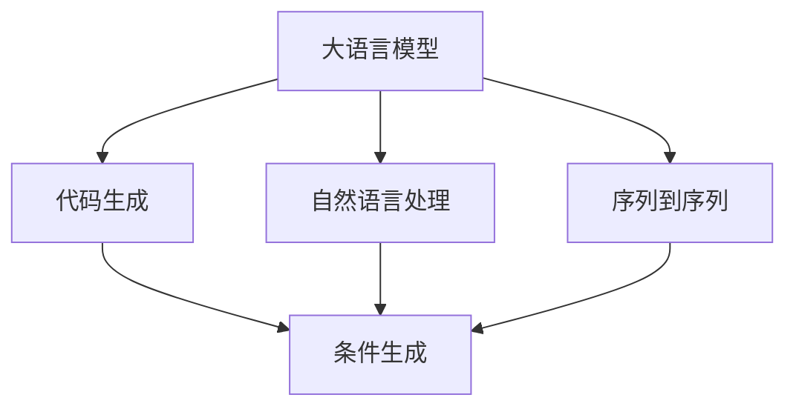

                 

# LLM的代码生成与理解能力分析

> 关键词：语言模型, 代码生成, 自然语言处理(NLP), 程序设计, 人工智能(AI)

## 1. 背景介绍

### 1.1 问题由来
近年来，大规模预训练语言模型(LLMs)在自然语言处理(NLP)领域取得了突破性进展。这类模型通过在海量文本数据上进行自监督预训练，具备强大的语言理解和生成能力。但随着NLP技术在编程领域的应用需求日益增长，LLMs的代码生成能力也逐渐受到关注。

代码生成作为程序设计中不可或缺的一部分，对于提升开发效率、降低编程门槛具有重要意义。而大语言模型，凭借其强大的文本生成能力，被寄予厚望，有望在代码生成中大放异彩。

### 1.2 问题核心关键点
代码生成是一种特定的自然语言处理任务，其核心在于利用大语言模型的语言生成能力，自动构建出符合语法和语义规范的程序代码。目前，基于大语言模型的代码生成方法主要包括模板填充、条件生成、序列到序列(Seq2Seq)等，各方法在语法、语义、效率等方面各有优缺点。

本研究将从代码生成和理解能力两个维度，对大语言模型进行全面分析，阐述其技术原理、应用场景及面临的挑战，为代码生成技术的发展提供新的思路和方向。

## 2. 核心概念与联系

### 2.1 核心概念概述

为更好地理解大语言模型在代码生成和理解中的应用，本节将介绍几个关键概念：

- 大语言模型(LLM)：通过在海量文本数据上进行自监督预训练，获得丰富语言表示能力的模型。常用的预训练模型包括GPT-3、BERT、XLNet等。
- 代码生成：根据自然语言描述，自动生成符合语法和语义规范的程序代码。其目标是在理解用户需求的基础上，生成代码片段或完整的程序。
- 自然语言处理(NLP)：利用计算机技术处理、理解和生成自然语言，是实现代码生成、理解等任务的底层技术。
- 条件生成：在大语言模型中，根据输入的条件语句自动生成满足条件的代码片段，常用于代码填充任务。
- 序列到序列(Seq2Seq)：一种机器学习模型，将输入序列映射到输出序列，常用于代码生成任务中的编码器和解码器设计。

这些核心概念之间的逻辑关系可以通过以下Mermaid流程图来展示：



这个流程图展示了大语言模型在代码生成中的应用路径：

1. 大语言模型通过自监督预训练获得语言表示能力。
2. 通过自然语言处理，理解用户输入的自然语言描述。
3. 根据用户需求生成代码片段或程序，常采用条件生成和序列到序列等方法。

## 3. 核心算法原理 & 具体操作步骤
### 3.1 算法原理概述

大语言模型的代码生成能力主要依赖于其在自监督预训练过程中学习到的语言表示能力。其基本原理如下：

- **编码阶段**：首先，大语言模型将输入的自然语言描述转换为一个向量表示，通过自监督预训练学习到单词之间的语义关系和语法结构。
- **解码阶段**：在得到向量表示后，大语言模型利用解码器生成代码片段或程序。解码器的设计常基于序列到序列模型，将自然语言序列映射为代码序列。

### 3.2 算法步骤详解

大语言模型的代码生成过程主要包括以下步骤：

1. **数据预处理**：将输入的自然语言描述转换为模型可以处理的形式，如分词、编码等。
2. **模型初始化**：使用预训练模型作为代码生成模型的初始化参数。
3. **编码阶段**：将自然语言描述输入模型，得到向量表示。
4. **解码阶段**：根据向量表示生成代码片段或程序。
5. **后处理**：对生成的代码进行语法和语义检查，确保代码的规范性和正确性。

### 3.3 算法优缺点

大语言模型在代码生成中的应用具有以下优点：

- **高效灵活**：利用预训练模型，可以显著减少代码生成所需的训练时间和数据量。
- **广泛适用**：可以处理多种编程语言，支持多种编程风格和任务类型。
- **性能提升**：生成代码质量高，语法和语义正确性较好。

同时，也存在以下局限性：

- **语义理解不足**：对于较为复杂、抽象的编程需求，模型的语义理解能力有限，生成代码的准确性可能较低。
- **生成代码的可读性**：有时生成的代码不够易读，理解难度较高。
- **可控性差**：模型的生成过程较为随机，生成的代码与用户需求不完全一致。

### 3.4 算法应用领域

大语言模型的代码生成能力在多个领域均有应用，包括：

- **代码自动补全**：根据用户输入的代码片段，自动补全后续代码。
- **代码生成**：根据自然语言描述自动生成完整的程序代码。
- **程序调试**：根据错误信息和程序片段，自动生成调试代码或修复建议。
- **API文档自动生成**：根据API信息，自动生成API文档。

这些应用领域展示了大语言模型在代码生成中的广泛潜力，有望在未来的软件工程和人工智能开发中发挥重要作用。

## 4. 数学模型和公式 & 详细讲解 & 举例说明

### 4.1 数学模型构建

本节将使用数学语言对大语言模型在代码生成中的应用进行更加严格的刻画。

假设大语言模型为 $M_{\theta}:\mathcal{X} \rightarrow \mathcal{Y}$，其中 $\mathcal{X}$ 为自然语言描述的向量表示空间，$\mathcal{Y}$ 为代码序列的向量表示空间，$\theta \in \mathbb{R}^d$ 为模型参数。

设输入自然语言描述为 $x \in \mathcal{X}$，代码序列为 $y \in \mathcal{Y}$。模型的编码阶段目标是最小化预测误差：

$$
\mathcal{L}_{encode}(x) = \min_{\theta} ||M_{\theta}(x) - y||^2
$$

在得到向量表示后，模型的解码阶段目标是最小化生成代码与真实代码之间的误差：

$$
\mathcal{L}_{decode}(y) = \min_{\theta} ||M_{\theta}(y) - \hat{y}||^2
$$

其中 $\hat{y}$ 为真实的代码序列，$||\cdot||$ 为向量距离度量。

### 4.2 公式推导过程

下面以自然语言描述为输入，生成Python代码片段为例，推导编码和解码过程的公式。

**编码过程**：

假设输入的自然语言描述为 $x = (\text{``函数名''}, \text{``参数名''}, \text{``返回值类型''}, \text{``功能描述''})$。将 $x$ 转换为向量表示：

$$
x = \text{tokenizer}(\text{``函数名''}, \text{``参数名''}, \text{``返回值类型''}, \text{``功能描述''})
$$

将向量 $x$ 输入大语言模型 $M_{\theta}$，得到向量表示 $z \in \mathbb{R}^d$：

$$
z = M_{\theta}(x)
$$

**解码过程**：

解码器将向量 $z$ 转换为代码片段 $y$，常采用序列到序列模型：

$$
y = \text{Decoder}(z)
$$

解码器的设计常基于注意力机制(Attention Mechanism)，根据上下文信息生成代码：

$$
y = \text{Attention}(z)
$$

其中 $\text{Attention}$ 为注意力机制函数，根据向量 $z$ 的上下文信息，选择相应的代码模板。

### 4.3 案例分析与讲解

考虑一个简单的例子，根据自然语言描述生成Python函数代码：

- **输入**：函数名为 `add`，参数为 `x, y`，返回值为 `result`，功能为求两个数之和。
- **编码过程**：将输入转换为向量表示，输入大语言模型。
- **解码过程**：根据向量表示，生成函数代码。

假设编码器的输出为 $z = [\text{``def"}, \text{``add"}, \text{``(x, y)''}, \text{``result''}, \text{``= x + y''}, \text{``return result''}]$，解码器根据注意力机制选择函数模板，生成代码片段：

$$
y = \text{``def add(x, y): return x + y'''}
$$

## 5. 项目实践：代码实例和详细解释说明
### 5.1 开发环境搭建

在进行代码生成实践前，我们需要准备好开发环境。以下是使用Python进行PyTorch开发的环境配置流程：

1. 安装Anaconda：从官网下载并安装Anaconda，用于创建独立的Python环境。

2. 创建并激活虚拟环境：
```bash
conda create -n pytorch-env python=3.8 
conda activate pytorch-env
```

3. 安装PyTorch：根据CUDA版本，从官网获取对应的安装命令。例如：
```bash
conda install pytorch torchvision torchaudio cudatoolkit=11.1 -c pytorch -c conda-forge
```

4. 安装Transformers库：
```bash
pip install transformers
```

5. 安装各类工具包：
```bash
pip install numpy pandas scikit-learn matplotlib tqdm jupyter notebook ipython
```

完成上述步骤后，即可在`pytorch-env`环境中开始代码生成实践。

### 5.2 源代码详细实现

下面以使用Transformers库实现基于大语言模型的Python代码生成为例，给出完整的代码实现。

首先，定义代码生成函数：

```python
from transformers import AutoTokenizer, AutoModelForCausalLM
import torch

def generate_code(model_path, prompt, max_len=512):
    # 加载模型和tokenizer
    tokenizer = AutoTokenizer.from_pretrained(model_path)
    model = AutoModelForCausalLM.from_pretrained(model_path)

    # 将提示转换成token ids
    inputs = tokenizer.encode(prompt, return_tensors='pt')

    # 生成代码
    outputs = model.generate(inputs, max_length=max_len)

    # 将token ids转换成文本
    code = tokenizer.decode(outputs[0], skip_special_tokens=True)

    return code
```

然后，在主函数中测试代码生成：

```python
model_path = 'path/to/model'
prompt = '定义一个函数，实现两个数的加法'
code = generate_code(model_path, prompt)

print(code)
```

以上就是使用PyTorch和Transformers库实现基于大语言模型的Python代码生成的完整代码实现。可以看到，利用Transformers库的封装，我们能够快速实现代码生成任务。

### 5.3 代码解读与分析

让我们再详细解读一下关键代码的实现细节：

**AutoTokenizer.from_pretrained(model_path)**：
- 通过指定模型路径，从HuggingFace Model Hub下载对应的预训练模型和分词器。

**AutoModelForCausalLM.from_pretrained(model_path)**：
- 加载预训练模型，常用于基于自回归模型的序列生成任务，如代码生成。

**tokenizer.encode(prompt, return_tensors='pt')**：
- 将输入的自然语言描述 `prompt` 转换为token ids，返回PyTorch张量形式。

**model.generate(inputs, max_length=max_len)**：
- 将输入的token ids作为起始条件，生成代码序列。`max_length` 参数指定生成的代码长度。

**tokenizer.decode(outputs[0], skip_special_tokens=True)**：
- 将生成的token ids解码为文本，去除特殊符号。

代码生成函数简单高效，实现了从自然语言描述到代码生成的全流程。实际应用中，可以根据具体需求调整生成代码的长度和风格。

## 6. 实际应用场景
### 6.1 智能编程助手

智能编程助手是代码生成的主要应用场景之一。传统编程助手往往需要开发者手动输入代码片段，效率较低。而基于大语言模型的智能编程助手，能够根据自然语言描述自动生成代码，大大提高开发效率。

在技术实现上，可以收集程序员常用的API信息、开发经验、编程风格等，构建大规模语料库，对大语言模型进行自监督预训练。在应用时，用户输入编程需求，智能编程助手自动生成代码片段或完整程序，并进行语法和语义检查，确保生成的代码规范且正确。

### 6.2 代码检测与优化

代码检测与优化是大语言模型在代码生成中的另一重要应用。传统的代码检测工具依赖规则库和启发式算法，检测和优化效果有限。而大语言模型通过预训练，具备更强的语法和语义理解能力，可以识别代码中的错误和潜在问题，并提出改进建议。

例如，可以设计一个代码检测模型，输入一段代码，输出代码中可能存在的错误类型和改进建议。在优化代码时，根据模型输出结果，自动生成改进后的代码，提升代码质量和性能。

### 6.3 程序调试与维护

程序调试和维护是大语言模型的另一重要应用场景。在程序出现错误时，大语言模型能够根据错误信息和代码片段，自动生成调试代码或修复建议。

例如，可以构建一个程序调试模型，输入错误信息和代码片段，输出调试代码或修复建议。在维护代码时，根据模型输出结果，自动生成修复代码，提升代码维护效率和质量。

### 6.4 未来应用展望

随着大语言模型和代码生成技术的不断发展，未来的代码生成和理解能力将呈现以下几个发展趋势：

1. **精度提升**：大语言模型的语言理解和生成能力将不断提升，生成的代码将更加准确、规范。
2. **可解释性增强**：大语言模型将具备更强的可解释性，代码生成过程的可控性和透明性将不断提高。
3. **多样化应用**：代码生成技术将应用于更多领域，如数据分析、机器学习、智能运维等，提升这些领域的自动化和智能化水平。
4. **多模态融合**：大语言模型将与多模态信息处理技术结合，提升代码生成的多样性和创新性。
5. **人机协同**：大语言模型将与程序员协同工作，提升编程效率和代码质量。

这些趋势将推动代码生成技术进入新阶段，为软件工程和人工智能开发带来革命性变革。

## 7. 工具和资源推荐
### 7.1 学习资源推荐

为了帮助开发者系统掌握大语言模型在代码生成中的应用，这里推荐一些优质的学习资源：

1. **《Transformer从原理到实践》系列博文**：由大模型技术专家撰写，深入浅出地介绍了Transformer原理、BERT模型、代码生成等前沿话题。

2. **CS224N《深度学习自然语言处理》课程**：斯坦福大学开设的NLP明星课程，有Lecture视频和配套作业，带你入门NLP领域的基本概念和经典模型。

3. **《Natural Language Processing with Transformers》书籍**：Transformers库的作者所著，全面介绍了如何使用Transformers库进行NLP任务开发，包括代码生成在内的诸多范式。

4. **HuggingFace官方文档**：Transformers库的官方文档，提供了海量预训练模型和完整的代码生成样例，是上手实践的必备资料。

5. **CLUE开源项目**：中文语言理解测评基准，涵盖大量不同类型的中文NLP数据集，并提供了基于代码生成的baseline模型，助力中文NLP技术发展。

通过对这些资源的学习实践，相信你一定能够快速掌握大语言模型在代码生成中的应用，并用于解决实际的NLP问题。

### 7.2 开发工具推荐

高效的开发离不开优秀的工具支持。以下是几款用于大语言模型代码生成开发的常用工具：

1. **PyTorch**：基于Python的开源深度学习框架，灵活动态的计算图，适合快速迭代研究。

2. **TensorFlow**：由Google主导开发的开源深度学习框架，生产部署方便，适合大规模工程应用。

3. **Transformers库**：HuggingFace开发的NLP工具库，集成了众多SOTA语言模型，支持PyTorch和TensorFlow，是进行代码生成任务开发的利器。

4. **Weights & Biases**：模型训练的实验跟踪工具，可以记录和可视化模型训练过程中的各项指标，方便对比和调优。与主流深度学习框架无缝集成。

5. **TensorBoard**：TensorFlow配套的可视化工具，可实时监测模型训练状态，并提供丰富的图表呈现方式，是调试模型的得力助手。

6. **Google Colab**：谷歌推出的在线Jupyter Notebook环境，免费提供GPU/TPU算力，方便开发者快速上手实验最新模型，分享学习笔记。

合理利用这些工具，可以显著提升大语言模型代码生成任务的开发效率，加快创新迭代的步伐。

### 7.3 相关论文推荐

大语言模型和代码生成技术的发展源于学界的持续研究。以下是几篇奠基性的相关论文，推荐阅读：

1. **Attention is All You Need**：提出了Transformer结构，开启了NLP领域的预训练大模型时代。

2. **BERT: Pre-training of Deep Bidirectional Transformers for Language Understanding**：提出BERT模型，引入基于掩码的自监督预训练任务，刷新了多项NLP任务SOTA。

3. **Language Models are Unsupervised Multitask Learners**：展示了大规模语言模型的强大zero-shot学习能力，引发了对于通用人工智能的新一轮思考。

4. **Code Transformer: Sequence-to-Sequence Pre-training of Neural Programming Models**：提出代码转换器模型，将自然语言描述转换为代码，在代码生成任务上取得显著效果。

5. **The Transformer XL: Attentive Language Models Beyond a Fixed-Length Context**：提出Transformer XL模型，提升了序列生成任务的性能。

6. **A Survey on Natural Language Programming**：综述了自然语言编程的研究现状和未来方向，展示了代码生成技术的多样性和潜力。

这些论文代表了大语言模型在代码生成中的应用基础，通过学习这些前沿成果，可以帮助研究者把握学科前进方向，激发更多的创新灵感。

## 8. 总结：未来发展趋势与挑战

### 8.1 总结

本文对大语言模型在代码生成和理解中的应用进行了全面系统的介绍。首先阐述了大语言模型和代码生成的研究背景和意义，明确了代码生成在软件工程中的重要价值。其次，从代码生成和理解能力两个维度，详细讲解了模型的技术原理和应用方法，给出了代码生成任务开发的完整代码实现。同时，本文还探讨了代码生成技术在智能编程助手、代码检测与优化、程序调试与维护等多个领域的应用前景，展示了代码生成技术的广阔潜力。

通过本文的系统梳理，可以看到，大语言模型在代码生成中的应用正在不断拓展，有望为软件开发带来革命性变革。未来，伴随预训练语言模型和代码生成技术的不断演进，相信代码生成技术将在软件工程和人工智能开发中发挥重要作用，提升开发效率和代码质量。

### 8.2 未来发展趋势

展望未来，大语言模型在代码生成中的应用将呈现以下几个发展趋势：

1. **多模态融合**：大语言模型将与图像、音频等多模态信息处理技术结合，提升代码生成的多样性和创新性。
2. **可解释性增强**：大语言模型将具备更强的可解释性，代码生成过程的可控性和透明性将不断提高。
3. **人机协同**：大语言模型将与程序员协同工作，提升编程效率和代码质量。
4. **多样化应用**：代码生成技术将应用于更多领域，如数据分析、机器学习、智能运维等，提升这些领域的自动化和智能化水平。
5. **精度提升**：大语言模型的语言理解和生成能力将不断提升，生成的代码将更加准确、规范。

这些趋势将推动代码生成技术进入新阶段，为软件工程和人工智能开发带来革命性变革。

### 8.3 面临的挑战

尽管大语言模型在代码生成中的应用已经取得了一定进展，但在迈向更加智能化、普适化应用的过程中，它仍面临着诸多挑战：

1. **精度和规范性**：生成的代码需要具备高精度和规范性，满足实际应用的需求。
2. **可解释性和可控性**：大语言模型生成代码的过程较为随机，生成的代码与用户需求不完全一致，难以解释和控制。
3. **模型泛化能力**：对于不同的编程语言和编程风格，大语言模型需要具备较强的泛化能力，以应对多样化的应用场景。
4. **硬件资源消耗**：大语言模型在生成代码时，往往需要较大的计算资源，如何在保证性能的同时，降低资源消耗，是一个重要的问题。
5. **语义理解能力**：对于较为复杂、抽象的编程需求，大语言模型的语义理解能力有限，生成代码的准确性可能较低。

这些挑战需要在未来的研究中进行深入探讨和解决，才能推动大语言模型在代码生成中的应用进入新阶段。

### 8.4 研究展望

面对大语言模型在代码生成中面临的诸多挑战，未来的研究需要在以下几个方面寻求新的突破：

1. **多模态融合**：将大语言模型与图像、音频等多模态信息处理技术结合，提升代码生成的多样性和创新性。
2. **可解释性和可控性**：开发更加可解释和可控的代码生成模型，提高生成代码的质量和用户满意度。
3. **模型泛化能力**：构建更加通用的代码生成模型，提升模型对不同编程语言和风格的适应能力。
4. **硬件资源优化**：优化大语言模型的生成过程，降低资源消耗，提升代码生成的效率和可扩展性。
5. **语义理解能力**：提升大语言模型的语义理解能力，使其能够更好地处理复杂、抽象的编程需求。

这些研究方向的探索，必将引领大语言模型在代码生成技术的发展，推动软件工程和人工智能开发进入新阶段。未来，大语言模型必将在代码生成中发挥越来越重要的作用，为软件开发带来革命性变革。

## 9. 附录：常见问题与解答

**Q1：大语言模型在代码生成中是否存在语义理解不足的问题？**

A: 是的。对于较为复杂、抽象的编程需求，大语言模型的语义理解能力有限，生成的代码准确性可能较低。为了解决这个问题，需要优化模型的语义表示能力和推理机制，或者引入更多领域特定的知识，提升模型的理解能力。

**Q2：大语言模型生成的代码可读性差，如何改进？**

A: 生成代码的可读性可以通过优化模型的训练过程和后处理技术进行改进。例如，可以在模型训练中加入代码可读性评估指标，引导模型生成易读代码。在后处理阶段，可以对生成的代码进行语法检查和格式优化，提升可读性。

**Q3：大语言模型生成的代码与用户需求不完全一致，如何改进？**

A: 生成代码的可控性可以通过优化模型的训练过程和引导词设计进行改进。例如，可以在输入中加入更详细的用户需求，指导模型生成更符合用户期望的代码。在模型训练过程中，可以引入更多的引导词，提高模型的生成可控性。

**Q4：大语言模型生成代码的精度和规范性如何保证？**

A: 生成的代码精度和规范性可以通过代码检测和优化技术进行保证。例如，可以构建代码检测模型，输入生成的代码，输出错误类型和改进建议。在优化代码时，根据模型输出结果，自动生成改进后的代码，提升代码质量和性能。

**Q5：大语言模型在代码生成中如何处理多模态信息？**

A: 大语言模型可以通过引入多模态信息处理技术，提升代码生成的多样性和创新性。例如，可以构建多模态代码生成模型，输入文本、图像、代码片段等多种信息，生成更全面、多样化的代码。

这些问题的解答展示了在代码生成中，大语言模型面临的挑战和可能的解决方案。通过对这些问题的深入探讨，可以更好地推动大语言模型在代码生成中的应用，提升软件开发的自动化和智能化水平。

---

作者：禅与计算机程序设计艺术 / Zen and the Art of Computer Programming

