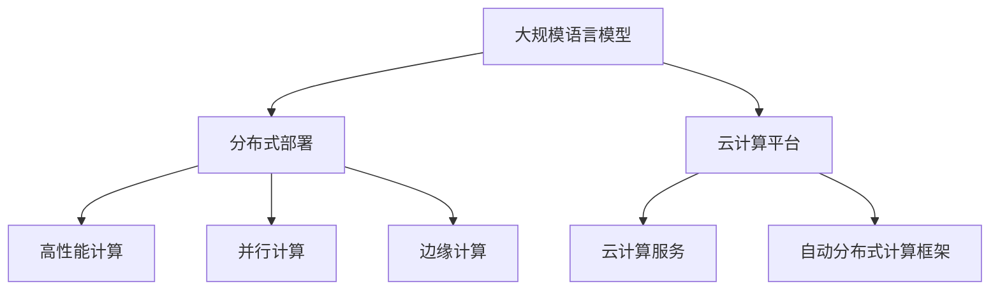

                 

# LLM的分布式部署：AI的云端革命

> 关键词：分布式部署, 云AI, 高性能计算, 并行计算, 边缘计算, 云计算, 模型训练, 模型推理

## 1. 背景介绍

### 1.1 问题由来

随着深度学习技术的快速发展，大规模语言模型(LLMs)如BERT、GPT等在自然语言处理(NLP)领域取得了突破性进展。这些模型在海量无标签文本数据上进行预训练，学习到丰富的语言知识和常识，具备强大的语言理解和生成能力。然而，模型参数量庞大，训练和推理计算量巨大，难以在单个服务器或客户端上高效运行。

为了应对这一挑战，分布式计算技术被引入到大规模语言模型的部署中。分布式部署不仅能够显著提高计算效率，还通过负载均衡和资源共享，提升系统的可靠性和扩展性。云计算平台提供了丰富的分布式计算资源和完善的工具支持，成为大规模语言模型部署的主流选择。

## 2. 核心概念与联系

### 2.1 核心概念概述

为了更好地理解大规模语言模型在云端的分布式部署，本节将介绍几个密切相关的核心概念：

- 大规模语言模型(LLMs)：以BERT、GPT等模型为代表的大规模预训练语言模型。通过在大规模无标签文本语料上进行预训练，学习通用的语言表示。
- 分布式部署：将模型参数和计算任务分布在多个服务器或计算节点上进行并行处理，以提升计算效率和系统性能。
- 云计算平台：如AWS、Google Cloud、Azure等，提供弹性计算资源和完善的分布式计算支持，支持大规模语言模型的部署和运行。
- 高性能计算(HPC)：用于处理大规模、复杂计算任务的计算环境，通常配备专门的硬件设备和高速网络。
- 并行计算：通过多个处理器或计算节点同时处理计算任务，实现计算速度的倍增。
- 边缘计算：在接近数据源的本地节点上进行数据处理，减少延迟和带宽消耗，适用于实时性要求高的应用场景。
- 云计算服务：如虚拟机、容器、函数服务等，支持模型的灵活部署和扩展。
- 自动分布式计算框架：如TensorFlow、PyTorch等，提供高效的分布式计算支持。

这些概念之间的逻辑关系可以通过以下Mermaid流程图来展示：



这个流程图展示了大规模语言模型的部署关键概念及其之间的关系：

1. 大规模语言模型通过预训练获得基础能力。
2. 分布式部署通过多个计算节点并行计算，提升计算效率。
3. 云计算平台提供弹性计算资源和分布式计算支持。
4. 高性能计算和并行计算提升分布式部署的计算能力。
5. 边缘计算适用于实时性要求高的应用场景。
6. 云计算服务支持模型的灵活部署和扩展。
7. 自动分布式计算框架提供高效的分布式计算支持。

这些概念共同构成了大规模语言模型在云端的部署框架，使其能够高效、灵活、可靠地运行。通过理解这些核心概念，我们可以更好地把握大规模语言模型在云端的分布式部署方式。

## 3. 核心算法原理 & 具体操作步骤
### 3.1 算法原理概述

大规模语言模型在云端的分布式部署，本质上是一个并行计算和分布式任务调度的问题。其核心思想是：将模型计算任务分布到多个计算节点上，并行处理，提升计算效率和系统性能。

形式化地，假设大规模语言模型为 $M_{\theta}$，其中 $\theta$ 为模型参数。给定云计算平台提供的数据集 $D=\{(x_i,y_i)\}_{i=1}^N, x_i \in \mathcal{X}, y_i \in \mathcal{Y}$，分布式部署的目标是找到最优参数：

$$
\theta^* = \mathop{\arg\min}_{\theta} \mathcal{L}(M_{\theta},D)
$$

其中 $\mathcal{L}$ 为针对任务 $T$ 设计的损失函数，用于衡量模型预测输出与真实标签之间的差异。常见的损失函数包括交叉熵损失、均方误差损失等。

通过梯度下降等优化算法，分布式部署过程不断更新模型参数 $\theta$，最小化损失函数 $\mathcal{L}$，使得模型输出逼近真实标签。由于 $\theta$ 已经通过预训练获得了较好的初始化，因此即便在大规模数据集 $D$ 上进行分布式部署，也能较快收敛到理想的模型参数 $\hat{\theta}$。

### 3.2 算法步骤详解

大规模语言模型在云端的分布式部署一般包括以下几个关键步骤：

**Step 1: 准备数据和计算资源**
- 收集训练数据 $D$，准备分布式部署所需的数据集。
- 选择合适的云计算平台，如AWS、Google Cloud、Azure等，准备计算资源和网络环境。

**Step 2: 设计分布式计算框架**
- 选择合适的分布式计算框架，如TensorFlow、PyTorch、Horovod等。
- 设计数据分片和任务调度策略，确保计算任务的均衡分配。

**Step 3: 执行分布式训练**
- 将训练数据 $D$ 分割为多个小批量的数据集，每个数据集分配到一个计算节点上。
- 在每个计算节点上同时进行模型训练，使用分布式计算框架进行任务调度和参数更新。
- 周期性在主节点上评估模型性能，根据性能指标决定是否触发Early Stopping。

**Step 4: 部署和推理**
- 将微调后的模型部署到生产环境中，如AWS Lambda、Google Cloud Functions等。
- 配置推理环境和接口，确保模型能够稳定、高效地提供服务。
- 使用API或SDK接口，调用部署的模型进行推理预测。

以上是分布式部署大语言模型的一般流程。在实际应用中，还需要针对具体任务的特点，对分布式部署过程的各个环节进行优化设计，如改进训练目标函数，引入更多的正则化技术，搜索最优的超参数组合等，以进一步提升模型性能。

### 3.3 算法优缺点

分布式部署大规模语言模型具有以下优点：
1. 计算效率高。分布式部署能够显著提高计算效率，加速模型训练和推理。
2. 扩展性强。通过增加计算节点，分布式部署能够灵活扩展，支持更大规模的数据集和计算任务。
3. 系统可靠性高。分布式部署通过负载均衡和资源共享，提升系统的可靠性和可用性。
4. 成本低。云计算平台提供弹性计算资源，按需计费，节省硬件和运维成本。

同时，该方法也存在一定的局限性：
1. 通信开销大。分布式部署需要频繁进行数据通信，增加计算延时。
2. 编程复杂。分布式部署需要编写复杂的分布式计算代码，调试和维护成本高。
3. 数据一致性问题。多个计算节点共享数据时，可能出现数据一致性问题，需要额外的协调机制。
4. 隐私安全问题。分布式部署需要共享数据和模型参数，可能存在隐私和安全风险。

尽管存在这些局限性，但就目前而言，分布式部署仍是处理大规模语言模型计算任务的主流范式。未来相关研究的重点在于如何进一步降低通信开销，提高编程效率，确保数据一致性和隐私安全，同时兼顾模型性能和可扩展性。

### 3.4 算法应用领域

大规模语言模型在云端的分布式部署方法，已经在NLP领域得到广泛的应用，覆盖了几乎所有常见任务，例如：

- 文本分类：如情感分析、主题分类、意图识别等。通过分布式部署，可以更快地处理大规模文本数据，提升分类性能。
- 命名实体识别：识别文本中的人名、地名、机构名等特定实体。通过分布式部署，可以并行处理大量实体标注数据，提升识别准确率。
- 关系抽取：从文本中抽取实体之间的语义关系。通过分布式部署，可以高效处理大规模语料，发现更多关系模式。
- 问答系统：对自然语言问题给出答案。通过分布式部署，可以处理多轮对话数据，提升问答系统效果。
- 机器翻译：将源语言文本翻译成目标语言。通过分布式部署，可以并行处理大量句子，提升翻译速度和质量。
- 文本摘要：将长文本压缩成简短摘要。通过分布式部署，可以并行处理大量文本，加速摘要生成。
- 对话系统：使机器能够与人自然对话。通过分布式部署，可以并行处理多轮对话数据，提升对话流畅度和上下文理解能力。

除了上述这些经典任务外，分布式部署的大规模语言模型也被创新性地应用到更多场景中，如可控文本生成、常识推理、代码生成、数据增强等，为NLP技术带来了全新的突破。随着分布式计算技术的不断进步，相信大规模语言模型在云端的部署将更加高效、灵活、可靠。

## 4. 数学模型和公式 & 详细讲解  
### 4.1 数学模型构建

本节将使用数学语言对大规模语言模型在云端的分布式部署过程进行更加严格的刻画。

记大规模语言模型为 $M_{\theta}$，其中 $\theta$ 为模型参数。假设云计算平台提供的数据集为 $D=\{(x_i,y_i)\}_{i=1}^N, x_i \in \mathcal{X}, y_i \in \mathcal{Y}$。

定义模型 $M_{\theta}$ 在输入 $x$ 上的损失函数为 $\ell(M_{\theta}(x),y)$，则在数据集 $D$ 上的经验风险为：

$$
\mathcal{L}(\theta) = \frac{1}{N} \sum_{i=1}^N \ell(M_{\theta}(x_i),y_i)
$$

分布式部署的目标是最小化经验风险，即找到最优参数：

$$
\theta^* = \mathop{\arg\min}_{\theta} \mathcal{L}(\theta)
$$

在实践中，我们通常使用基于梯度的优化算法（如SGD、Adam等）来近似求解上述最优化问题。设 $\eta$ 为学习率，$\lambda$ 为正则化系数，则参数的更新公式为：

$$
\theta \leftarrow \theta - \eta \nabla_{\theta}\mathcal{L}(\theta) - \eta\lambda\theta
$$

其中 $\nabla_{\theta}\mathcal{L}(\theta)$ 为损失函数对参数 $\theta$ 的梯度，可通过反向传播算法高效计算。

### 4.2 公式推导过程

以下我们以二分类任务为例，推导交叉熵损失函数及其梯度的计算公式。

假设模型 $M_{\theta}$ 在输入 $x$ 上的输出为 $\hat{y}=M_{\theta}(x) \in [0,1]$，表示样本属于正类的概率。真实标签 $y \in \{0,1\}$。则二分类交叉熵损失函数定义为：

$$
\ell(M_{\theta}(x),y) = -[y\log \hat{y} + (1-y)\log (1-\hat{y})]
$$

将其代入经验风险公式，得：

$$
\mathcal{L}(\theta) = -\frac{1}{N}\sum_{i=1}^N [y_i\log M_{\theta}(x_i)+(1-y_i)\log(1-M_{\theta}(x_i))]
$$

根据链式法则，损失函数对参数 $\theta_k$ 的梯度为：

$$
\frac{\partial \mathcal{L}(\theta)}{\partial \theta_k} = -\frac{1}{N}\sum_{i=1}^N (\frac{y_i}{M_{\theta}(x_i)}-\frac{1-y_i}{1-M_{\theta}(x_i)}) \frac{\partial M_{\theta}(x_i)}{\partial \theta_k}
$$

其中 $\frac{\partial M_{\theta}(x_i)}{\partial \theta_k}$ 可进一步递归展开，利用自动微分技术完成计算。

在得到损失函数的梯度后，即可带入参数更新公式，完成模型的迭代优化。重复上述过程直至收敛，最终得到适应云计算平台分布式部署的最优模型参数 $\theta^*$。

## 5. 项目实践：代码实例和详细解释说明
### 5.1 开发环境搭建

在进行分布式部署实践前，我们需要准备好开发环境。以下是使用Python进行PyTorch和TensorFlow开发的环境配置流程：

1. 安装Anaconda：从官网下载并安装Anaconda，用于创建独立的Python环境。

2. 创建并激活虚拟环境：
```bash
conda create -n pytorch-env python=3.8 
conda activate pytorch-env
```

3. 安装PyTorch：根据CUDA版本，从官网获取对应的安装命令。例如：
```bash
conda install pytorch torchvision torchaudio cudatoolkit=11.1 -c pytorch -c conda-forge
```

4. 安装TensorFlow：从官网下载并安装TensorFlow，选择对应的版本（2.x或1.x）。

5. 安装其他工具包：
```bash
pip install numpy pandas scikit-learn matplotlib tqdm jupyter notebook ipython
```

完成上述步骤后，即可在`pytorch-env`环境中开始分布式部署实践。

### 5.2 源代码详细实现

这里我们以TensorFlow为例，展示如何使用TensorFlow实现大规模语言模型的分布式训练。

首先，定义模型和优化器：

```python
import tensorflow as tf
from tensorflow.keras.layers import Dense, Input
from tensorflow.keras.models import Model
from tensorflow.keras.optimizers import Adam
import os

# 定义模型
input = Input(shape=(128,))
x = Dense(256, activation='relu')(input)
x = Dense(256, activation='relu')(x)
output = Dense(1, activation='sigmoid')(x)
model = Model(inputs=input, outputs=output)

# 定义优化器
optimizer = Adam(learning_rate=0.001)
```

接着，定义分布式训练的参数：

```python
# 定义分布式训练参数
cluster_spec = {
    'worker': ['localhost:2222', 'localhost:2223'],
    'chief': 'localhost:2224',
}

# 定义分布式训练策略
strategy = tf.distribute.MirroredStrategy(devices=['/job:worker', '/job:chief'])
```

然后，定义分布式训练的函数：

```python
def train_step(input_data):
    with strategy.scope():
        with tf.GradientTape() as tape:
            logits = model(input_data)
            loss = tf.keras.losses.binary_crossentropy(y_true=input_data.labels, y_pred=logits)
        gradients = tape.gradient(loss, model.trainable_variables)
        optimizer.apply_gradients(zip(gradients, model.trainable_variables))
```

最后，启动分布式训练过程：

```python
# 准备数据
train_dataset = ...

# 启动分布式训练
strategy.run(train_step, args=(next(iter(train_dataset)),))
```

以上就是使用TensorFlow进行大规模语言模型分布式训练的完整代码实现。可以看到，利用TensorFlow的分布式计算策略，可以轻松实现模型的并行计算和参数更新，大大提高计算效率。

### 5.3 代码解读与分析

让我们再详细解读一下关键代码的实现细节：

**MirroredStrategy**：
- 定义了分布式训练策略，将计算任务分布到多个计算节点上，并行处理。
- 支持并行梯度计算，加速模型训练过程。

**train_step函数**：
- 在分布式计算策略的上下文中执行模型前向计算，计算损失函数。
- 利用TensorFlow的自动微分功能计算模型参数的梯度。
- 根据梯度更新模型参数，完成参数更新。

**分布式数据处理**：
- 将数据集按批次处理，分配到多个计算节点上，并行计算损失函数和梯度。
- 通过`strategy.run`方法，启动分布式训练过程，确保计算任务的均衡分配和参数更新的同步性。

可以看到，TensorFlow的分布式计算策略提供了强大的分布式部署支持，可以轻松实现大规模语言模型的并行计算和分布式训练。

## 6. 实际应用场景
### 6.1 智能客服系统

基于大规模语言模型在云端的分布式部署技术，可以广泛应用于智能客服系统的构建。传统客服往往需要配备大量人力，高峰期响应缓慢，且一致性和专业性难以保证。而使用分布式部署的大规模语言模型，可以7x24小时不间断服务，快速响应客户咨询，用自然流畅的语言解答各类常见问题。

在技术实现上，可以收集企业内部的历史客服对话记录，将问题和最佳答复构建成监督数据，在此基础上对预训练模型进行分布式微调。分布式微调后的模型能够自动理解用户意图，匹配最合适的答案模板进行回复。对于客户提出的新问题，还可以接入检索系统实时搜索相关内容，动态组织生成回答。如此构建的智能客服系统，能大幅提升客户咨询体验和问题解决效率。

### 6.2 金融舆情监测

金融机构需要实时监测市场舆论动向，以便及时应对负面信息传播，规避金融风险。传统的人工监测方式成本高、效率低，难以应对网络时代海量信息爆发的挑战。基于大规模语言模型在云端的分布式部署技术，可以在实时抓取的网络文本数据上应用文本分类和情感分析技术，自动监测不同主题下的情感变化趋势，一旦发现负面信息激增等异常情况，系统便会自动预警，帮助金融机构快速应对潜在风险。

### 6.3 个性化推荐系统

当前的推荐系统往往只依赖用户的历史行为数据进行物品推荐，无法深入理解用户的真实兴趣偏好。基于大规模语言模型在云端的分布式部署技术，个性化推荐系统可以更好地挖掘用户行为背后的语义信息，从而提供更精准、多样的推荐内容。

在实践中，可以收集用户浏览、点击、评论、分享等行为数据，提取和用户交互的物品标题、描述、标签等文本内容。将文本内容作为模型输入，用户的后续行为（如是否点击、购买等）作为监督信号，在此基础上分布式微调预训练语言模型。分布式微调后的模型能够从文本内容中准确把握用户的兴趣点。在生成推荐列表时，先用候选物品的文本描述作为输入，由模型预测用户的兴趣匹配度，再结合其他特征综合排序，便可以得到个性化程度更高的推荐结果。

### 6.4 未来应用展望

随着分布式计算技术的不断进步，基于大规模语言模型在云端的部署方法将更加高效、灵活、可靠。未来，在智慧医疗、智能教育、智慧城市治理等更多领域，分布式部署的大规模语言模型将发挥重要作用，推动NLP技术的产业化进程。

在智慧医疗领域，基于分布式部署的对话系统、病历分析、知识图谱等技术，可以辅助医生诊疗，加速新药开发进程。在智能教育领域，分布式部署的对话系统、个性化推荐系统等技术，可以因材施教，促进教育公平，提高教学质量。在智慧城市治理中，分布式部署的对话系统、舆情监测系统等技术，可以构建更安全、高效的未来城市。

此外，在企业生产、社会治理、文娱传媒等众多领域，分布式部署的大规模语言模型也将不断涌现，为传统行业数字化转型升级提供新的技术路径。相信随着技术的日益成熟，分布式部署方法将成为AI技术落地应用的重要范式，推动人工智能技术向更广阔的领域加速渗透。

## 7. 工具和资源推荐
### 7.1 学习资源推荐

为了帮助开发者系统掌握大规模语言模型在云端的分布式部署的理论基础和实践技巧，这里推荐一些优质的学习资源：

1. 《TensorFlow分布式计算》官方文档：全面介绍TensorFlow的分布式计算功能，包括MirroredStrategy、ParameterServerStrategy等。

2. 《深度学习分布式计算》课程：斯坦福大学开设的分布式计算课程，涵盖深度学习在分布式环境下的训练和优化技术。

3. 《高性能计算基础》书籍：全面介绍高性能计算的理论和实践，适合深入学习分布式计算技术的开发者。

4. 《大规模机器学习实践》书籍：Google资深工程师所著，涵盖机器学习在分布式环境下的训练和优化技术，适合深入学习分布式计算技术的开发者。

5. 《云计算平台深度学习》博客：深度学习在云计算平台上的实践经验分享，涵盖AWS、Google Cloud、Azure等主流云平台的深度学习技术。

通过对这些资源的学习实践，相信你一定能够快速掌握大规模语言模型在云端的分布式部署的精髓，并用于解决实际的NLP问题。
###  7.2 开发工具推荐

高效的开发离不开优秀的工具支持。以下是几款用于大规模语言模型在云端分布式部署开发的常用工具：

1. TensorFlow：由Google主导开发的开源深度学习框架，支持分布式计算和自动微分，适合大规模模型训练和推理。

2. PyTorch：Facebook开发的深度学习框架，灵活易于扩展，支持分布式计算和自动微分，适合大规模模型训练和推理。

3. Horovod：由Uber开发的开源分布式深度学习框架，支持TensorFlow、PyTorch等多种深度学习框架，提供高效的分布式计算支持。

4. TensorFlow Distribute：TensorFlow提供的分布式计算模块，支持TensorFlow的分布式训练和推理，易于使用。

5. Kubernetes：Google开发的容器编排系统，支持大规模计算节点的管理和服务部署，适合分布式系统的构建。

6. Kafka：Apache开源的消息队列系统，支持大规模数据的分布式处理，适合分布式数据处理的场景。

合理利用这些工具，可以显著提升大规模语言模型在云端的分布式部署的开发效率，加快创新迭代的步伐。

### 7.3 相关论文推荐

大规模语言模型和分布式计算技术的发展源于学界的持续研究。以下是几篇奠基性的相关论文，推荐阅读：

1. Parameter Server for Distributed Training: An Analysis and Comparison of Model-Averaging and Model-Parallel Training Algorithms: 深度学习在大规模分布式计算环境下的训练算法分析。

2. Exploring Distributed Deep Learning: From Single Machine to Multiple Machines: 深度学习在多台机器上的分布式训练方法研究。

3. The Turing Award Lecture: The Next Fifty Years of Computing: 计算机科学领域的未来发展趋势，涉及深度学习和大规模计算的展望。

4. Communication-Efficient Training of Deep Learning Models: 高效分布式深度学习训练方法的研究。

5. Beyond Distributed Computing: On the Tail Power of Computation: 分布式计算技术的未来发展方向，涉及边缘计算和云端的探索。

这些论文代表了大规模语言模型在云端的分布式部署技术的发展脉络。通过学习这些前沿成果，可以帮助研究者把握学科前进方向，激发更多的创新灵感。

## 8. 总结：未来发展趋势与挑战

### 8.1 总结

本文对基于大规模语言模型在云端的分布式部署方法进行了全面系统的介绍。首先阐述了大规模语言模型和分布式部署的研究背景和意义，明确了分布式部署在提升计算效率、扩展性和系统可靠性方面的独特价值。其次，从原理到实践，详细讲解了分布式部署的数学模型和关键步骤，给出了分布式部署任务开发的完整代码实例。同时，本文还广泛探讨了分布式部署方法在智能客服、金融舆情、个性化推荐等多个行业领域的应用前景，展示了分布式部署范式的巨大潜力。此外，本文精选了分布式部署技术的各类学习资源，力求为读者提供全方位的技术指引。

通过本文的系统梳理，可以看到，基于大规模语言模型在云端的分布式部署方法正在成为NLP领域的重要范式，极大地拓展了预训练语言模型的应用边界，催生了更多的落地场景。受益于云计算平台和分布式计算技术的不断进步，相信大规模语言模型在云端的部署将更加高效、灵活、可靠。未来，伴随分布式计算技术的进一步发展，基于云端的分布式部署方法将更好地支持大规模语言模型的应用，推动人工智能技术向更广阔的领域加速渗透。

### 8.2 未来发展趋势

展望未来，基于大规模语言模型在云端的分布式部署技术将呈现以下几个发展趋势：

1. 模型规模持续增大。随着算力成本的下降和数据规模的扩张，分布式部署的模型规模还将持续增长，模型参数量将突破百亿级别。超大规模语言模型蕴含的丰富语言知识，有望支撑更加复杂多变的下游任务。

2. 分布式训练框架不断完善。新的分布式训练框架不断涌现，如Horovod、Ray等，进一步提升分布式计算的效率和灵活性。

3. 分布式推理加速技术。通过异构加速、模型剪枝等技术，提升分布式推理的效率和性能。

4. 边缘计算与云端的结合。分布式部署将拓展到边缘计算场景，如物联网设备、移动端等，提升实时性和响应速度。

5. 云计算服务优化。云计算平台将提供更多优化服务，如GPU加速、自动调参等，进一步降低模型部署和维护成本。

6. 自动机器学习(AutoML)。结合AutoML技术，自动选择最优的分布式计算策略和超参数组合，提高模型部署效率。

以上趋势凸显了大规模语言模型在云端的分布式部署技术的广阔前景。这些方向的探索发展，必将进一步提升分布式部署的性能和灵活性，使大规模语言模型更好地服务于各垂直行业。

### 8.3 面临的挑战

尽管分布式部署大规模语言模型已经取得了瞩目成就，但在迈向更加智能化、普适化应用的过程中，它仍面临着诸多挑战：

1. 通信开销大。分布式部署需要频繁进行数据通信，增加计算延时，需要优化通信策略和算法。

2. 编程复杂。分布式部署需要编写复杂的分布式计算代码，调试和维护成本高。

3. 数据一致性问题。多个计算节点共享数据时，可能出现数据一致性问题，需要额外的协调机制。

4. 隐私安全问题。分布式部署需要共享数据和模型参数，可能存在隐私和安全风险。

5. 计算资源不足。分布式部署需要大量的计算资源，可能面临计算资源不足的问题。

尽管存在这些挑战，但通过不断的技术创新和实践积累，这些挑战终将一一被克服，分布式部署方法将成为大规模语言模型应用的主流范式，推动人工智能技术向更广阔的领域加速渗透。

### 8.4 研究展望

面向未来，分布式部署技术的研究方向可以包括以下几个方面：

1. 探索无监督和半监督分布式计算方法。摆脱对大规模标注数据的依赖，利用自监督学习、主动学习等无监督和半监督范式，最大限度利用非结构化数据，实现更加灵活高效的分布式部署。

2. 研究分布式计算的高效算法。开发更加高效的分布式训练和推理算法，如模型并行、参数服务器等，提升计算效率。

3. 引入更多先验知识。将符号化的先验知识，如知识图谱、逻辑规则等，与神经网络模型进行巧妙融合，引导分布式部署过程学习更准确、合理的语言模型。

4. 融合因果分析和博弈论工具。将因果分析方法引入分布式部署模型，识别出模型决策的关键特征，增强输出解释的因果性和逻辑性。

5. 结合自动机器学习(AutoML)技术。通过自动选择最优的分布式计算策略和超参数组合，提高模型部署效率。

这些研究方向将引领大规模语言模型在云端的分布式部署技术迈向更高的台阶，为构建安全、可靠、可解释、可控的智能系统铺平道路。面向未来，分布式部署技术还需要与其他人工智能技术进行更深入的融合，如知识表示、因果推理、强化学习等，多路径协同发力，共同推动自然语言理解和智能交互系统的进步。只有勇于创新、敢于突破，才能不断拓展语言模型的边界，让智能技术更好地造福人类社会。

## 9. 附录：常见问题与解答

**Q1：分布式部署是否适用于所有NLP任务？**

A: 分布式部署在大规模语言模型上可以取得显著的效果，特别是在数据量较大的任务上。但对于一些特定领域的任务，如医学、法律等，仅仅依靠通用语料预训练的模型可能难以很好地适应。此时需要在特定领域语料上进一步预训练，再进行分布式部署，才能获得理想效果。此外，对于一些需要时效性、个性化很强的任务，如对话、推荐等，分布式部署方法也需要针对性的改进优化。

**Q2：分布式部署过程中如何选择合适的学习率？**

A: 分布式部署的学习率一般要比单机训练小1-2个数量级，以避免梯度爆炸或消失的问题。一般建议从0.001开始调参，逐步减小学习率，直至收敛。也可以使用warmup策略，在开始阶段使用较小的学习率，再逐渐过渡到预设值。需要注意的是，不同的优化器(如SGD、Adam等)以及不同的学习率调度策略，可能需要设置不同的学习率阈值。

**Q3：分布式部署过程中如何缓解通信开销？**

A: 通信开销是分布式部署的一个主要瓶颈。可以通过以下方法缓解通信开销：
1. 数据分片：将数据集分成多个子集，每个子集分配到一个计算节点上。
2. 参数聚合：将多个计算节点的参数聚合，减少通信次数。
3. 模型并行：将模型分为多个子模型，分别在多个计算节点上并行计算。

这些方法可以显著降低通信开销，提升分布式部署的计算效率。

**Q4：分布式部署过程中如何提高编程效率？**

A: 分布式部署的编程复杂性是另一个主要挑战。可以通过以下方法提高编程效率：
1. 使用自动分布式计算框架：如TensorFlow、PyTorch等，提供高效的分布式计算支持。
2. 使用分布式计算库：如Horovod、Ray等，简化分布式计算的代码编写和调试。
3. 使用自动化工具：如TensorBoard、Weights & Biases等，实时监控训练过程，自动调参和优化。

这些工具和方法可以显著提高分布式部署的编程效率，降低开发和调试成本。

**Q5：分布式部署过程中如何确保数据一致性和隐私安全？**

A: 分布式部署需要共享数据和模型参数，可能存在数据一致性和隐私安全问题。可以通过以下方法解决这些问题：
1. 数据一致性机制：使用分布式锁或一致性哈希等机制，确保多个计算节点访问共享数据的一致性。
2. 隐私保护技术：使用差分隐私、联邦学习等技术，保护数据隐私。
3. 安全机制：使用加密通信、访问控制等机制，保护模型参数和数据的安全性。

这些方法可以确保分布式部署过程中的数据一致性和隐私安全，防止模型泄露和数据滥用。

**Q6：分布式部署过程中如何提高计算效率？**

A: 分布式部署需要高效的计算策略和算法。可以通过以下方法提高计算效率：
1. 异构加速：利用GPU、TPU等高性能计算资源，加速模型训练和推理。
2. 模型剪枝：对模型进行剪枝和压缩，减少计算量和内存占用。
3. 并行计算：利用多线程、多进程等并行计算技术，提升计算效率。

这些方法可以显著提高分布式部署的计算效率，加速模型训练和推理。

总之，分布式部署需要开发者从数据、算法、工具等多个维度协同发力，才能真正实现大规模语言模型的高效、灵活、可靠部署。通过不断优化和改进，分布式部署技术必将在大规模语言模型的应用中发挥更大的作用，推动NLP技术向更广阔的领域加速渗透。

