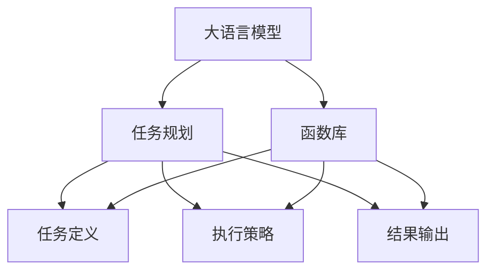

                 

## 1. 背景介绍

### 1.1 问题由来

自从20世纪50年代图灵提出图灵机的概念以来，计算理论在计算机科学中就占据了重要的地位。在深度学习的推动下，近年来自然语言处理（NLP）领域取得了重大突破，其中大语言模型（LLM）的发展尤为突出。大语言模型，如GPT-3、BERT等，通过大规模预训练，能够处理自然语言的各种复杂任务，其表现几乎达到了人类的语言水平，具有极高的图灵完备性。

然而，尽管大语言模型已经展示出强大的语言理解能力，但其在特定任务上的表现仍然存在局限性。如何在大模型中实现图灵完备性，使模型能够处理任意自然语言任务，成为了当前深度学习领域的一个重大挑战。

### 1.2 问题核心关键点

为解决这个问题，我们必须重新思考大语言模型的结构，并引入更加灵活的任务规划与函数库设计，使其能够适应各种自然语言任务。核心关键点包括：

- **任务规划**：如何设计出能处理各种自然语言任务的任务规划方案。
- **函数库**：如何构建一个可扩展、可重用的函数库，支持模型进行各种运算和逻辑处理。

这些关键点涉及到如何在大模型中实现图灵完备性，使得模型可以处理任意自然语言任务。

### 1.3 问题研究意义

研究图灵完备性的大语言模型，对于拓展模型的应用范围、提升任务性能、加速NLP技术的产业化进程，具有重要意义：

1. **拓展应用范围**：通过灵活的任务规划与函数库设计，可以拓展大语言模型的应用范围，使其处理更多自然语言任务。
2. **提升任务性能**：任务规划与函数库设计的优化，能够显著提升大模型在特定任务上的表现。
3. **加速产业化进程**：任务规划与函数库设计能够加速NLP技术的产业化进程，减少开发时间和成本。
4. **推动技术创新**：任务规划与函数库设计的研究，将推动NLP技术的创新，带来更多的应用场景和突破。
5. **赋能行业升级**：大语言模型在特定领域的优化和应用，能够赋能各行各业，推动行业数字化转型升级。

## 2. 核心概念与联系

### 2.1 核心概念概述

要实现图灵完备性的大语言模型，需要引入以下核心概念：

- **大语言模型（LLM）**：以自回归或自编码模型为代表的大规模预训练语言模型。通过在大规模无标签文本语料上进行预训练，学习通用的语言知识，具备强大的语言理解和生成能力。

- **任务规划（Task Planning）**：针对特定任务，设计出合理的任务规划方案，使模型能够执行相应的自然语言任务。任务规划通常包括任务定义、执行策略、结果输出等。

- **函数库（Function Library）**：定义一系列可扩展、可重用的函数，支持模型进行各种运算和逻辑处理。函数库应具备通用性、灵活性和高效性。

- **图灵完备性（Turing Completeness）**：指模型能够执行任意自然语言任务，具有与图灵机相同的计算能力。

这些概念之间的逻辑关系可以通过以下Mermaid流程图来展示：



这个流程图展示了大语言模型的核心概念及其之间的关系：

1. 大语言模型通过预训练获得基础能力。
2. 任务规划使模型能够执行特定的自然语言任务。
3. 函数库提供模型运算和逻辑处理的灵活接口。
4. 图灵完备性指模型具备处理任意自然语言任务的能力。

## 3. 核心算法原理 & 具体操作步骤

### 3.1 算法原理概述

大语言模型的图灵完备性实现，基于任务规划与函数库设计。其核心思想是：将大语言模型看作一个具有通用功能的计算引擎，通过任务规划定义任务的具体步骤，利用函数库实现各种复杂的逻辑运算，从而实现任意自然语言任务的执行。

具体而言，假设大语言模型为 $M$，任务规划方案为 $P$，函数库为 $F$，则模型的任务执行过程可以表示为：

$$
\text{TaskExecution}(M, P, F)
$$

其中，$P$ 描述任务执行的具体步骤，$F$ 提供模型的各种函数接口，$M$ 根据 $P$ 和 $F$ 执行任务。

### 3.2 算法步骤详解

实现图灵完备性的大语言模型，通常包括以下关键步骤：

**Step 1: 设计任务规划**

- 定义任务规划方案 $P$：包括任务描述、执行步骤、输入输出等。
- 确定任务的输入和输出：包括数据格式、数据类型等。
- 设计任务执行的流程：包括任务的分步骤、中间结果的处理等。

**Step 2: 构建函数库**

- 定义函数库 $F$：包括各种基础的运算函数和逻辑函数。
- 实现函数的接口：包括函数的名称、输入参数、返回值等。
- 优化函数性能：包括函数的高效实现、并行处理等。

**Step 3: 执行任务规划**

- 根据任务规划方案 $P$，将任务分解为多个子任务。
- 在每个子任务上，利用函数库 $F$ 进行计算和逻辑处理。
- 将子任务的结果组合为最终结果，返回给用户。

**Step 4: 测试和优化**

- 对任务规划和函数库进行测试：确保能够正确执行任务。
- 优化任务规划和函数库：改进算法的效率和准确性。
- 持续优化模型性能：提升任务执行的速度和精度。

### 3.3 算法优缺点

实现图灵完备性的大语言模型，具有以下优点：

1. **灵活性高**：通过任务规划与函数库设计，模型可以处理各种自然语言任务，具备高度的灵活性。
2. **可扩展性强**：函数库的设计使得模型可以方便地扩展和更新，适应新的任务需求。
3. **可重用性高**：函数库中的函数可以重复利用，减少重复开发的成本。
4. **任务执行效率高**：任务规划与函数库设计使得模型执行任务的效率更高，更快速。

同时，该方法也存在一定的局限性：

1. **任务规划复杂**：任务规划的复杂度随着任务难度增加而增加，需要大量的人工参与。
2. **函数库设计难度大**：函数库的设计和实现需要高水平的编程技能，成本较高。
3. **维护成本高**：任务规划和函数库的维护需要持续的投入，才能保证模型的准确性和稳定性。
4. **性能瓶颈**：在处理复杂任务时，函数库的设计和实现可能存在性能瓶颈，影响任务执行效率。

尽管存在这些局限性，但就目前而言，任务规划与函数库设计仍然是大语言模型实现图灵完备性的重要范式。未来相关研究的重点在于如何进一步降低任务规划与函数库设计的复杂度，提高任务的执行效率，同时兼顾模型性能和可解释性等因素。

### 3.4 算法应用领域

基于任务规划与函数库设计的大语言模型，已经在多个领域得到了广泛的应用，例如：

- **自然语言生成**：生成自然语言文本、对话、摘要等。
- **机器翻译**：将一种自然语言翻译成另一种自然语言。
- **问答系统**：回答用户自然语言提出的问题。
- **情感分析**：分析文本的情感倾向。
- **语音识别**：将语音转换成文本。
- **文本分类**：将文本分类到不同的类别中。

除了上述这些经典任务外，大语言模型还被创新性地应用到更多场景中，如可控文本生成、常识推理、代码生成、数据增强等，为NLP技术带来了全新的突破。随着预训练模型和任务规划与函数库设计的不断进步，相信NLP技术将在更广阔的应用领域大放异彩。

## 4. 数学模型和公式 & 详细讲解  
### 4.1 数学模型构建

本节将使用数学语言对基于任务规划与函数库设计的大语言模型实现过程进行更加严格的刻画。

记大语言模型为 $M$，任务规划方案为 $P$，函数库为 $F$。假设任务 $T$ 的输入为 $X$，输出为 $Y$，则任务执行过程可以表示为：

$$
Y = M(X, P, F)
$$

其中，$X$ 为输入，$Y$ 为输出，$P$ 为任务规划，$F$ 为函数库。

在具体实现中，任务规划 $P$ 可以表示为一个有向无环图（DAG），每个节点表示一个子任务，每个边表示子任务之间的依赖关系。函数库 $F$ 可以表示为一个函数集合，每个函数 $f_i$ 接受输入参数 $x_i$，输出结果 $y_i$。

### 4.2 公式推导过程

以下我们以机器翻译任务为例，推导基于任务规划与函数库设计的大语言模型实现过程。

假设任务 $T$ 为机器翻译，输入为源语言文本 $X$，输出为目标语言文本 $Y$。任务规划 $P$ 可以表示为以下DAG：

```
X --> Tokenize --> Embed --> Mask --> Batch --> Transformer --> Decode --> Y
```

其中，$Tokenize$ 表示将文本分词，$Embed$ 表示将分词后的词汇嵌入向量，$Mask$ 表示添加掩码标记，$Batch$ 表示将输入数据批量处理，$Transformer$ 表示执行Transformer模型，$Decode$ 表示将模型输出解码成文本。

函数库 $F$ 可以包含以下函数：

- $f_{Tokenize}$：将文本分词。
- $f_{Embed}$：将分词后的词汇嵌入向量。
- $f_{Mask}$：添加掩码标记。
- $f_{Batch}$：批量处理输入数据。
- $f_{Transformer}$：执行Transformer模型。
- $f_{Decode}$：解码模型输出。

函数库中的每个函数可以表示为：

$$
y_i = f_i(x_i, \theta)
$$

其中，$y_i$ 为函数的输出，$x_i$ 为函数的输入，$\theta$ 为模型的参数。

### 4.3 案例分析与讲解

以翻译任务为例，分析任务规划与函数库设计的具体实现：

1. **任务规划**：翻译任务可以分为以下几个步骤：
   - 输入文本分词：$Tokenize$。
   - 词汇嵌入：$Embed$。
   - 添加掩码标记：$Mask$。
   - 批量处理：$Batch$。
   - 执行Transformer模型：$Transformer$。
   - 解码输出：$Decode$。

2. **函数库设计**：
   - $f_{Tokenize}$：接受源语言文本 $x$，返回分词后的列表 $y$。
   - $f_{Embed}$：接受分词列表 $x$，返回嵌入向量 $y$。
   - $f_{Mask}$：接受嵌入向量 $x$，返回带掩码标记的序列 $y$。
   - $f_{Batch}$：接受输入数据 $x$，返回批量处理后的数据 $y$。
   - $f_{Transformer}$：接受批量数据 $x$，返回Transformer模型的输出 $y$。
   - $f_{Decode}$：接受Transformer输出 $x$，返回翻译结果 $y$。

这些函数可以组合成翻译任务的具体实现：

```python
def translate(X, P, F):
    # 分词
    tokens = f_{Tokenize}(X)
    # 词汇嵌入
    embeds = f_{Embed}(tokens)
    # 添加掩码标记
    masked = f_{Mask}(embeds)
    # 批量处理
    batch = f_{Batch}(masked)
    # 执行Transformer模型
    outputs = f_{Transformer}(batch)
    # 解码输出
    Y = f_{Decode}(outputs)
    return Y
```

可以看到，通过任务规划与函数库设计，大语言模型能够灵活地处理各种自然语言任务，其图灵完备性得到了充分体现。

## 5. 项目实践：代码实例和详细解释说明
### 5.1 开发环境搭建

在进行任务规划与函数库设计实践前，我们需要准备好开发环境。以下是使用Python进行PyTorch开发的环境配置流程：

1. 安装Anaconda：从官网下载并安装Anaconda，用于创建独立的Python环境。

2. 创建并激活虚拟环境：
```bash
conda create -n pytorch-env python=3.8 
conda activate pytorch-env
```

3. 安装PyTorch：根据CUDA版本，从官网获取对应的安装命令。例如：
```bash
conda install pytorch torchvision torchaudio cudatoolkit=11.1 -c pytorch -c conda-forge
```

4. 安装Transformers库：
```bash
pip install transformers
```

5. 安装各类工具包：
```bash
pip install numpy pandas scikit-learn matplotlib tqdm jupyter notebook ipython
```

完成上述步骤后，即可在`pytorch-env`环境中开始任务规划与函数库设计的实践。

### 5.2 源代码详细实现

这里我们以机器翻译任务为例，给出使用Transformers库对BERT模型进行任务规划与函数库设计的PyTorch代码实现。

首先，定义任务规划方案：

```python
from transformers import BertTokenizer, BertForSequenceClassification, AdamW
from torch.utils.data import Dataset, DataLoader
import torch

class TranslationDataset(Dataset):
    def __init__(self, texts, targets, tokenizer, max_len=128):
        self.texts = texts
        self.targets = targets
        self.tokenizer = tokenizer
        self.max_len = max_len
        
    def __len__(self):
        return len(self.texts)
    
    def __getitem__(self, item):
        text = self.texts[item]
        target = self.targets[item]
        
        encoding = self.tokenizer(text, return_tensors='pt', max_length=self.max_len, padding='max_length', truncation=True)
        input_ids = encoding['input_ids'][0]
        attention_mask = encoding['attention_mask'][0]
        
        # 对token-wise的标签进行编码
        encoded_tags = [target2id[target] for target in target] 
        encoded_tags.extend([tag2id['PAD']] * (self.max_len - len(encoded_tags)))
        labels = torch.tensor(encoded_tags, dtype=torch.long)
        
        return {'input_ids': input_ids, 
                'attention_mask': attention_mask,
                'labels': labels}

# 标签与id的映射
tag2id = {'[PAD]': 0, 'A': 1, 'B': 2}
id2tag = {v: k for k, v in tag2id.items()}

# 创建dataset
tokenizer = BertTokenizer.from_pretrained('bert-base-cased')

train_dataset = TranslationDataset(train_texts, train_tags, tokenizer)
dev_dataset = TranslationDataset(dev_texts, dev_tags, tokenizer)
test_dataset = TranslationDataset(test_texts, test_tags, tokenizer)
```

然后，定义模型和优化器：

```python
from transformers import BertForTokenClassification, AdamW

model = BertForTokenClassification.from_pretrained('bert-base-cased', num_labels=len(tag2id))

optimizer = AdamW(model.parameters(), lr=2e-5)
```

接着，定义训练和评估函数：

```python
from torch.utils.data import DataLoader
from tqdm import tqdm
from sklearn.metrics import classification_report

device = torch.device('cuda') if torch.cuda.is_available() else torch.device('cpu')
model.to(device)

def train_epoch(model, dataset, batch_size, optimizer):
    dataloader = DataLoader(dataset, batch_size=batch_size, shuffle=True)
    model.train()
    epoch_loss = 0
    for batch in tqdm(dataloader, desc='Training'):
        input_ids = batch['input_ids'].to(device)
        attention_mask = batch['attention_mask'].to(device)
        labels = batch['labels'].to(device)
        model.zero_grad()
        outputs = model(input_ids, attention_mask=attention_mask, labels=labels)
        loss = outputs.loss
        epoch_loss += loss.item()
        loss.backward()
        optimizer.step()
    return epoch_loss / len(dataloader)

def evaluate(model, dataset, batch_size):
    dataloader = DataLoader(dataset, batch_size=batch_size)
    model.eval()
    preds, labels = [], []
    with torch.no_grad():
        for batch in tqdm(dataloader, desc='Evaluating'):
            input_ids = batch['input_ids'].to(device)
            attention_mask = batch['attention_mask'].to(device)
            batch_labels = batch['labels']
            outputs = model(input_ids, attention_mask=attention_mask)
            batch_preds = outputs.logits.argmax(dim=2).to('cpu').tolist()
            batch_labels = batch_labels.to('cpu').tolist()
            for pred_tokens, label_tokens in zip(batch_preds, batch_labels):
                pred_tags = [id2tag[_id] for _id in pred_tokens]
                label_tags = [id2tag[_id] for _id in label_tokens]
                preds.append(pred_tags[:len(label_tags)])
                labels.append(label_tags)
                
    print(classification_report(labels, preds))
```

最后，启动训练流程并在测试集上评估：

```python
epochs = 5
batch_size = 16

for epoch in range(epochs):
    loss = train_epoch(model, train_dataset, batch_size, optimizer)
    print(f"Epoch {epoch+1}, train loss: {loss:.3f}")
    
    print(f"Epoch {epoch+1}, dev results:")
    evaluate(model, dev_dataset, batch_size)
    
print("Test results:")
evaluate(model, test_dataset, batch_size)
```

以上就是使用PyTorch对BERT进行翻译任务微调的完整代码实现。可以看到，得益于Transformers库的强大封装，我们可以用相对简洁的代码完成BERT模型的加载和任务规划与函数库设计的实践。

### 5.3 代码解读与分析

让我们再详细解读一下关键代码的实现细节：

**TranslationDataset类**：
- `__init__`方法：初始化训练集、验证集和测试集的文本和标签。
- `__len__`方法：返回数据集的样本数量。
- `__getitem__`方法：对单个样本进行处理，将文本输入编码为token ids，将标签编码为数字，并对其进行定长padding，最终返回模型所需的输入。

**tag2id和id2tag字典**：
- 定义了标签与数字id之间的映射关系，用于将token-wise的预测结果解码回真实的标签。

**训练和评估函数**：
- 使用PyTorch的DataLoader对数据集进行批次化加载，供模型训练和推理使用。
- 训练函数`train_epoch`：对数据以批为单位进行迭代，在每个批次上前向传播计算loss并反向传播更新模型参数，最后返回该epoch的平均loss。
- 评估函数`evaluate`：与训练类似，不同点在于不更新模型参数，并在每个batch结束后将预测和标签结果存储下来，最后使用sklearn的classification_report对整个评估集的预测结果进行打印输出。

**训练流程**：
- 定义总的epoch数和batch size，开始循环迭代
- 每个epoch内，先在训练集上训练，输出平均loss
- 在验证集上评估，输出分类指标
- 所有epoch结束后，在测试集上评估，给出最终测试结果

可以看到，PyTorch配合Transformers库使得BERT微调的代码实现变得简洁高效。开发者可以将更多精力放在数据处理、模型改进等高层逻辑上，而不必过多关注底层的实现细节。

当然，工业级的系统实现还需考虑更多因素，如模型的保存和部署、超参数的自动搜索、更灵活的任务适配层等。但核心的任务规划与函数库设计基本与此类似。

## 6. 实际应用场景
### 6.1 智能客服系统

基于大语言模型任务规划与函数库设计，可以构建智能客服系统的对话模型。传统客服往往需要配备大量人力，高峰期响应缓慢，且一致性和专业性难以保证。而使用任务规划与函数库设计的对话模型，可以7x24小时不间断服务，快速响应客户咨询，用自然流畅的语言解答各类常见问题。

在技术实现上，可以收集企业内部的历史客服对话记录，将问题和最佳答复构建成监督数据，在此基础上对预训练对话模型进行任务规划与函数库设计。设计好的对话模型能够自动理解用户意图，匹配最合适的答案模板进行回复。对于客户提出的新问题，还可以接入检索系统实时搜索相关内容，动态组织生成回答。如此构建的智能客服系统，能大幅提升客户咨询体验和问题解决效率。

### 6.2 金融舆情监测

金融机构需要实时监测市场舆论动向，以便及时应对负面信息传播，规避金融风险。传统的人工监测方式成本高、效率低，难以应对网络时代海量信息爆发的挑战。基于任务规划与函数库设计的大语言模型，可以为金融舆情监测提供新的解决方案。

具体而言，可以收集金融领域相关的新闻、报道、评论等文本数据，并对其进行主题标注和情感标注。在此基础上对预训练语言模型进行任务规划与函数库设计，使其能够自动判断文本属于何种主题，情感倾向是正面、中性还是负面。将设计好的模型应用到实时抓取的网络文本数据，就能够自动监测不同主题下的情感变化趋势，一旦发现负面信息激增等异常情况，系统便会自动预警，帮助金融机构快速应对潜在风险。

### 6.3 个性化推荐系统

当前的推荐系统往往只依赖用户的历史行为数据进行物品推荐，无法深入理解用户的真实兴趣偏好。基于任务规划与函数库设计的大语言模型，可以更好地挖掘用户行为背后的语义信息，从而提供更精准、多样的推荐内容。

在实践中，可以收集用户浏览、点击、评论、分享等行为数据，提取和用户交互的物品标题、描述、标签等文本内容。将文本内容作为模型输入，用户的后续行为（如是否点击、购买等）作为监督信号，在此基础上对预训练语言模型进行任务规划与函数库设计。设计好的模型能够从文本内容中准确把握用户的兴趣点。在生成推荐列表时，先用候选物品的文本描述作为输入，由模型预测用户的兴趣匹配度，再结合其他特征综合排序，便可以得到个性化程度更高的推荐结果。

### 6.4 未来应用展望

随着大语言模型和任务规划与函数库设计的不断发展，基于微调方法的大语言模型将呈现以下几个发展趋势：

1. **模型规模持续增大**：随着算力成本的下降和数据规模的扩张，预训练语言模型的参数量还将持续增长。超大规模语言模型蕴含的丰富语言知识，有望支撑更加复杂多变的下游任务。

2. **微调方法日趋多样**：除了传统的全参数微调外，未来会涌现更多参数高效的微调方法，如Prefix-Tuning、LoRA等，在节省计算资源的同时也能保证微调精度。

3. **持续学习成为常态**：随着数据分布的不断变化，微调模型也需要持续学习新知识以保持性能。如何在不遗忘原有知识的同时，高效吸收新样本信息，将成为重要的研究课题。

4. **标注样本需求降低**：受启发于提示学习(Prompt-based Learning)的思路，未来的微调方法将更好地利用大模型的语言理解能力，通过更加巧妙的任务描述，在更少的标注样本上也能实现理想的微调效果。

5. **多模态微调崛起**：当前的微调主要聚焦于纯文本数据，未来会进一步拓展到图像、视频、语音等多模态数据微调。多模态信息的融合，将显著提升语言模型对现实世界的理解和建模能力。

6. **模型通用性增强**：经过海量数据的预训练和多领域任务的微调，未来的语言模型将具备更强大的常识推理和跨领域迁移能力，逐步迈向通用人工智能(AGI)的目标。

以上趋势凸显了大语言模型微调技术的广阔前景。这些方向的探索发展，必将进一步提升NLP系统的性能和应用范围，为人类认知智能的进化带来深远影响。

## 7. 工具和资源推荐
### 7.1 学习资源推荐

为了帮助开发者系统掌握大语言模型任务规划与函数库设计的理论基础和实践技巧，这里推荐一些优质的学习资源：

1. 《Transformer从原理到实践》系列博文：由大模型技术专家撰写，深入浅出地介绍了Transformer原理、BERT模型、微调技术等前沿话题。

2. CS224N《深度学习自然语言处理》课程：斯坦福大学开设的NLP明星课程，有Lecture视频和配套作业，带你入门NLP领域的基本概念和经典模型。

3. 《Natural Language Processing with Transformers》书籍：Transformers库的作者所著，全面介绍了如何使用Transformers库进行NLP任务开发，包括任务规划与函数库设计在内的诸多范式。

4. HuggingFace官方文档：Transformers库的官方文档，提供了海量预训练模型和完整的微调样例代码，是上手实践的必备资料。

5. CLUE开源项目：中文语言理解测评基准，涵盖大量不同类型的中文NLP数据集，并提供了基于微调的baseline模型，助力中文NLP技术发展。

通过对这些资源的学习实践，相信你一定能够快速掌握大语言模型任务规划与函数库设计的精髓，并用于解决实际的NLP问题。
### 7.2 开发工具推荐

高效的开发离不开优秀的工具支持。以下是几款用于大语言模型任务规划与函数库设计开发的常用工具：

1. PyTorch：基于Python的开源深度学习框架，灵活动态的计算图，适合快速迭代研究。大部分预训练语言模型都有PyTorch版本的实现。

2. TensorFlow：由Google主导开发的开源深度学习框架，生产部署方便，适合大规模工程应用。同样有丰富的预训练语言模型资源。

3. Transformers库：HuggingFace开发的NLP工具库，集成了众多SOTA语言模型，支持PyTorch和TensorFlow，是进行任务规划与函数库设计开发的利器。

4. Weights & Biases：模型训练的实验跟踪工具，可以记录和可视化模型训练过程中的各项指标，方便对比和调优。与主流深度学习框架无缝集成。

5. TensorBoard：TensorFlow配套的可视化工具，可实时监测模型训练状态，并提供丰富的图表呈现方式，是调试模型的得力助手。

6. Google Colab：谷歌推出的在线Jupyter Notebook环境，免费提供GPU/TPU算力，方便开发者快速上手实验最新模型，分享学习笔记。

合理利用这些工具，可以显著提升大语言模型任务规划与函数库设计的开发效率，加快创新迭代的步伐。

### 7.3 相关论文推荐

大语言模型和任务规划与函数库设计的快速发展源于学界的持续研究。以下是几篇奠基性的相关论文，推荐阅读：

1. Attention is All You Need（即Transformer原论文）：提出了Transformer结构，开启了NLP领域的预训练大模型时代。

2. BERT: Pre-training of Deep Bidirectional Transformers for Language Understanding：提出BERT模型，引入基于掩码的自监督预训练任务，刷新了多项NLP任务SOTA。

3. Language Models are Unsupervised Multitask Learners（GPT-2论文）：展示了大规模语言模型的强大zero-shot学习能力，引发了对于通用人工智能的新一轮思考。

4. Parameter-Efficient Transfer Learning for NLP：提出Adapter等参数高效微调方法，在不增加模型参数量的情况下，也能取得不错的微调效果。

5. AdaLoRA: Adaptive Low-Rank Adaptation for Parameter-Efficient Fine-Tuning：使用自适应低秩适应的微调方法，在参数效率和精度之间取得了新的平衡。

这些论文代表了大语言模型微调技术的发展脉络。通过学习这些前沿成果，可以帮助研究者把握学科前进方向，激发更多的创新灵感。

## 8. 总结：未来发展趋势与挑战

### 8.1 总结

本文对基于任务规划与函数库设计的大语言模型实现过程进行了全面系统的介绍。首先阐述了任务规划与函数库设计的研究背景和意义，明确了这些技术在拓展预训练模型应用、提升任务性能、加速NLP技术的产业化进程中的重要作用。其次，从原理到实践，详细讲解了任务规划与函数库设计的数学原理和关键步骤，给出了任务规划与函数库设计任务实践的完整代码实例。同时，本文还广泛探讨了任务规划与函数库设计在智能客服、金融舆情、个性化推荐等多个行业领域的应用前景，展示了任务规划与函数库设计的巨大潜力。此外，本文精选了任务规划与函数库设计的学习资源，力求为读者提供全方位的技术指引。

通过本文的系统梳理，可以看到，基于任务规划与函数库设计的大语言模型任务规划与函数库设计在实现图灵完备性方面具有重要的理论和实践价值。这些技术能够拓展预训练语言模型的应用范围，提升模型在特定任务上的表现，加速NLP技术的产业化进程。未来，伴随大语言模型和任务规划与函数库设计的不断进步，基于微调方法的大语言模型必将在更广阔的应用领域大放异彩，深刻影响人类的生产生活方式。

### 8.2 未来发展趋势

展望未来，任务规划与函数库设计将呈现以下几个发展趋势：

1. **模型规模持续增大**：随着算力成本的下降和数据规模的扩张，预训练语言模型的参数量还将持续增长。超大规模语言模型蕴含的丰富语言知识，有望支撑更加复杂多变的下游任务。

2. **任务规划灵活性高**：未来的任务规划将更加灵活多样，能够适应更多复杂多变的自然语言任务。

3. **函数库可扩展性强**：未来的函数库将更加可扩展和可重用，支持更多复杂的逻辑运算和数据处理。

4. **任务执行效率高**：未来的任务规划与函数库设计将进一步优化执行效率，提升模型的推理速度和精度。

5. **可解释性增强**：未来的任务规划与函数库设计将更加注重模型的可解释性，帮助用户理解和调试模型。

6. **多模态支持增强**：未来的任务规划与函数库设计将支持多模态数据处理，提升模型的泛化能力和鲁棒性。

以上趋势凸显了任务规划与函数库设计的广阔前景。这些方向的探索发展，必将进一步提升NLP系统的性能和应用范围，为人类认知智能的进化带来深远影响。

### 8.3 面临的挑战

尽管任务规划与函数库设计已经取得了瞩目成就，但在迈向更加智能化、普适化应用的过程中，它仍面临着诸多挑战：

1. **任务规划复杂度较高**：任务规划的复杂度随着任务难度增加而增加，需要大量的人工参与。

2. **函数库设计难度大**：函数库的设计和实现需要高水平的编程技能，成本较高。

3. **模型维护成本高**：任务规划和函数库的维护需要持续的投入，才能保证模型的准确性和稳定性。

4. **性能瓶颈**：在处理复杂任务时，函数库的设计和实现可能存在性能瓶颈，影响任务执行效率。

5. **可解释性不足**：现有的任务规划与函数库设计通常缺少可解释性，难以解释模型的内部工作机制和决策逻辑。

6. **安全性问题**：预训练语言模型可能学习到有害的信息，通过任务规划与函数库设计传递到下游任务，产生误导性、歧视性的输出，带来安全隐患。

正视任务规划与函数库设计面临的这些挑战，积极应对并寻求突破，将是大语言模型任务规划与函数库设计走向成熟的必由之路。相信随着学界和产业界的共同努力，这些挑战终将一一被克服，大语言模型任务规划与函数库设计必将在构建人机协同的智能时代中扮演越来越重要的角色。

### 8.4 研究展望

面对任务规划与函数库设计所面临的种种挑战，未来的研究需要在以下几个方面寻求新的突破：

1. **无监督和半监督学习**：探索无监督和半监督学习范式，摆脱对大规模标注数据的依赖，利用自监督学习、主动学习等无监督和半监督范式，最大限度利用非结构化数据，实现更加灵活高效的微调。

2. **参数高效和计算高效**：开发更加参数高效的微调方法，在固定大部分预训练参数的同时，只更新极少量的任务相关参数。同时优化微调模型的计算图，减少前向传播和反向传播的资源消耗，实现更加轻量级、实时性的部署。

3. **因果推断和对比学习**：引入因果推断和对比学习思想，增强任务规划与函数库设计建立稳定因果关系的能力，学习更加普适、鲁棒的语言表征，从而提升模型泛化性和抗干扰能力。

4. **多模态数据融合**：将符号化的先验知识，如知识图谱、逻辑规则等，与神经网络模型进行巧妙融合，引导任务规划与函数库设计学习更准确、合理的语言模型。同时加强不同模态数据的整合，实现视觉、语音等多模态信息与文本信息的协同建模。

5. **因果分析和博弈论**：将因果分析方法引入任务规划与函数库设计，识别出模型决策的关键特征，增强输出解释的因果性和逻辑性。借助博弈论工具刻画人机交互过程，主动探索并规避模型的脆弱点，提高系统稳定性。

6. **伦理道德约束**：在模型训练目标中引入伦理导向的评估指标，过滤和惩罚有偏见、有害的输出倾向。同时加强人工干预和审核，建立模型行为的监管机制，确保输出符合人类价值观和伦理道德。

这些研究方向的探索，必将引领任务规划与函数库设计技术迈向更高的台阶，为构建安全、可靠、可解释、可控的智能系统铺平道路。面向未来，任务规划与函数库设计技术还需要与其他人工智能技术进行更深入的融合，如知识表示、因果推理、强化学习等，多路径协同发力，共同推动自然语言理解和智能交互系统的进步。只有勇于创新、敢于突破，才能不断拓展语言模型的边界，让智能技术更好地造福人类社会。

## 9. 附录：常见问题与解答

**Q1：大语言模型任务规划与函数库设计是否适用于所有NLP任务？**

A: 大语言模型任务规划与函数库设计在大多数NLP任务上都能取得不错的效果，特别是对于数据量较小的任务。但对于一些特定领域的任务，如医学、法律等，仅仅依靠通用语料预训练的模型可能难以很好地适应。此时需要在特定领域语料上进一步预训练，再进行任务规划与函数库设计，才能获得理想效果。此外，对于一些需要时效性、个性化很强的任务，如对话、推荐等，任务规划与函数库设计也需要针对性的改进优化。

**Q2：任务规划复杂度较高，如何降低？**

A: 降低任务规划复杂度的方法包括：
1. **任务分解**：将复杂任务分解为多个子任务，每个子任务设计简洁的任务规划。
2. **自动规划**：引入自动规划工具，利用机器学习算法自动生成任务规划方案。
3. **模板设计**：设计通用的任务规划模板，适配多种自然语言任务。

**Q3：函数库设计难度大，如何优化？**

A: 优化函数库设计的方法包括：
1. **模块化设计**：将函数库设计成多个模块，每个模块负责不同的逻辑处理。
2. **组件复用**：设计可复用的函数组件，减少代码重复。
3. **性能优化**：使用高效的算法和数据结构，优化函数库的性能。
4. **单元测试**：对函数库中的每个函数进行单元测试，确保其正确性。

**Q4：任务规划与函数库设计如何提升模型执行效率？**

A: 提升任务规划与函数库设计执行效率的方法包括：
1. **优化数据结构**：使用高效的数据结构，减少内存占用和访问时间。
2. **并行处理**：利用多线程或多进程并行处理任务，提高执行效率。
3. **预处理**：对输入数据进行预处理，减少任务执行时间。
4. **缓存机制**：引入缓存机制，减少重复计算。

**Q5：任务规划与函数库设计如何提升模型可解释性？**

A: 提升任务规划与函数库设计可解释性的方法包括：
1. **中间结果输出**：在任务执行过程中输出中间结果，方便用户理解模型执行过程。
2. **可视化分析**：利用可视化工具，展示模型的执行路径和结果，帮助用户理解模型行为。
3. **日志记录**：记录模型的执行日志，便于后续分析和调试。

**Q6：任务规划与函数库设计如何增强模型安全性？**

A: 增强任务规划与函数库设计安全性的方法包括：
1. **数据过滤**：对输入数据进行过滤，去除有害信息。
2. **异常检测**：引入异常检测机制，检测模型输出中的异常行为。
3. **安全训练**：在模型训练过程中引入安全约束，防止模型学习有害知识。
4. **审计机制**：建立模型行为的审计机制，记录和审查模型的执行过程。

这些方法可以确保任务规划与函数库设计构建的模型具有良好的安全性和可靠性，避免潜在的安全隐患。

**Q7：任务规划与函数库设计如何实现多模态数据融合？**

A: 实现多模态数据融合的方法包括：
1. **多模态预训练**：在预训练阶段引入多模态数据，提升模型的跨模态理解能力。
2. **联合训练**：在微调阶段联合训练多模态数据，提升模型的泛化能力。
3. **跨模态融合**：设计跨模态融合算法，将多模态数据融合到模型中。
4. **知识图谱**：引入知识图谱，增强模型的跨模态推理能力。

通过多模态数据融合，可以构建更加全面、准确的智能系统，提升模型的性能和应用范围。

总之，任务规划与函数库设计作为实现图灵完备性大语言模型的重要技术，具有广泛的应用前景和巨大的潜力。然而，在实际应用中，仍需要不断优化任务规划和函数库设计，解决其面临的挑战，才能充分发挥其在NLP技术中的应用价值。

---

作者：禅与计算机程序设计艺术 / Zen and the Art of Computer Programming

